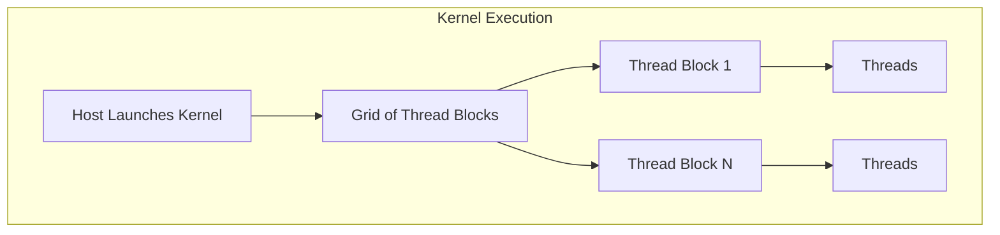

Você está encarregado de criar um **capítulo de livro** extenso, detalhado e avançado sobre um tópico específico relacionado a **computação paralela utilizando CUDA**. Seu objetivo é produzir um guia de estudo abrangente para um Cientista da Computação especialista com conhecimento avançado em arquitetura de computadores e programação paralela. Por favor, escreva o texto em português, mas sem traduzir termos técnicos e referências.

O tópico para o seu capítulo é:

<X>{{X}}</X>

**Diretrizes Importantes:**

1. **Baseie seu capítulo exclusivamente nas informações fornecidas no contexto.** Não introduza conhecimento externo. **Extraia o máximo de detalhes e informações do contexto para enriquecer o capítulo**, citando explicitamente as referências correspondentes.

2. **Atribua um número sequencial a cada trecho relevante do contexto.** Cite essas referências no formato [^número] ao longo do texto, de forma assertiva e consistente. Por exemplo, [^1] refere-se ao primeiro trecho do contexto.

3. **Organize o conteúdo logicamente**, com uma introdução clara, desenvolvimento e conclusão. Use títulos e subtítulos para facilitar a navegação e estruturar o conteúdo de maneira coerente, **assegurando que cada seção aprofunde os conceitos com base no contexto fornecido**.

4. **Aprofunde-se em conceitos técnicos e matemáticos relacionados à computação paralela com CUDA.** Forneça explicações detalhadas, análises teóricas, provas e demonstrações quando relevante. **Utilize todos os detalhes disponíveis no contexto para enriquecer as explicações**, assegurando uma compreensão profunda dos temas abordados, como paralelismo de dados, estrutura de programas CUDA, gerenciamento de memória em dispositivos e execução de kernels. Não traduza nomes técnicos e teóricos.

5. **Use a seguinte formatação:**

   - Use **negrito** para conceitos principais.
   - Use *itálico* para citações ou paráfrases importantes.
   - Use caixas de destaque para informações cruciais.
   - Use emojis (⚠️❗✔️💡) para ênfase quando apropriado.

   **Evite formatação de bullet points. Foque em criar um texto corrido e bem estruturado.**

6. **Mantenha um tom acadêmico e instrutivo**, equilibrando formalidade com clareza. Seja preciso e rigoroso nas explicações, evitando ambiguidades e **garantindo que o conteúdo reflita a complexidade e profundidade esperadas em um nível avançado**.

7. **Use $ para expressões matemáticas em linha e $$ para equações centralizadas.** Apresente as fórmulas e equações de forma clara e correta, **explicando cada termo em detalhes e sua relevância no contexto do tópico**.

8. **Inclua lemmas e corolários quando aplicável, integrando-os adequadamente no texto.**

   - Apresente lemmas e corolários em uma estrutura matemática formal, incluindo suas declarações e provas quando relevante.
   - Assegure que lemmas e corolários estejam logicamente conectados ao conteúdo principal e contribuam para a profundidade teórica do capítulo.

9. **Inclua seções teóricas desafiadoras ao longo do capítulo e ao final**, seguindo estas diretrizes:

   a) Adicione 2-3 seções teóricas avançadas relacionadas ao conteúdo abordado ao final de cada seção principal.

   b) As seções devem ser altamente relevantes ao estudo de computação paralela com CUDA, **avaliar a compreensão profunda de conceitos teóricos-chave**, podem envolver cálculos complexos e provas, e focar em análises teóricas e derivações.

   c) As seções devem integrar múltiplos conceitos e exigir raciocínio teórico aprofundado.

   d) **As seções devem envolver derivações teóricas, provas ou análises matemáticas complexas, incluindo lemmas e corolários quando apropriado.** Evite focar em aspectos de aplicação ou implementação que não estejam diretamente relacionados aos fundamentos de CUDA. Adicione $\blacksquare$ ao final das provas.

   e) **Formule as seções como se estivesse fazendo perguntas ao tema e depois respondendo teoricamente no conteúdo da seção.**

10. **Referencie o contexto de forma assertiva e consistente.** Certifique-se de que todas as informações utilizadas estão devidamente referenciadas, utilizando os números atribuídos aos trechos do contexto. **As referências devem ser claras e diretas, facilitando a verificação das fontes dentro do contexto fornecido**.

11. **Incorpore diagramas e mapas mentais quando relevantes para o entendimento do conteúdo.** Use a linguagem Mermaid para diagramas ou **<imagem: descrição detalhada da imagem>** quando apropriado, apenas nas seções onde eles realmente contribuam para a compreensão dos conceitos de programação paralela com CUDA.

    **Instruções para incentivar a criação de diagramas e mapas mentais mais ricos:**

    - Ao utilizar Mermaid, crie diagramas complexos que representem estruturas detalhadas, como a arquitetura host-device, o fluxo de execução de um kernel, ou a organização de threads em grids e blocos.

    - Utilize Mermaid para representar fórmulas matemáticas e algoritmos de forma visual, facilitando a compreensão de processos matemáticos e computacionais avançados no contexto de CUDA.

    - Para os mapas mentais, construa representações gráficas que conectem os principais conceitos e seções do capítulo, servindo como um guia rápido para o leitor entender os conceitos de forma avançada e aprofundada no âmbito de programação paralela com CUDA.

    - Para as imagens descritas em **<imagem: descrição detalhada da imagem>**, forneça descrições ricas que permitam visualizar gráficos complexos, como a organização da memória global, o processo de transferência de dados entre host e device, ou a representação de grids e blocos de threads.

    **Exemplos de como usar diagramas e mapas mentais:**

    - **Usando Mermaid para Mapas Mentais:**

      Se estiver apresentando os conceitos fundamentais de **Data Parallelism**, pode incluir:

      ```mermaid
      graph TD
        A["Data Parallelism"] --> B["Independent Computations"]
        A --> C["Large Datasets"]
        A --> D["Scalability"]
        B --> E["Vector Addition"]
        C --> F["Images"]
        C --> G["Physics Simulations"]

  **Explicação:** Este mapa mental ilustra a categorização dos principais componentes do paralelismo de dados, conforme descrito no contexto [^X].

- **Usando Mermaid para Explicar Algoritmos:**

  Ao detalhar o **processo de lançamento de um kernel CUDA**, pode incluir:

  ```mermaid
  flowchart LR
    Start[Host Code] --> KernelLaunch["Kernel Launch <<<grid, block>>>"]
    KernelLaunch --> Grid[Grid of Threads]
    Grid --> Block1[Thread Block 1]
    Grid --> BlockN[Thread Block N]
    Block1 --> Thread1[Thread 1]
    Block1 --> ThreadM[Thread M]
    End[Device Code Execution]
  ```

  **Explicação:** Este diagrama representa os passos sequenciais do lançamento de um kernel CUDA, conforme explicado no contexto [^Y].

- **Usando Mermaid para Visualizar Fórmulas Matemáticas:**

  Para ilustrar a relação entre índices de threads e dados no **exemplo de adição de vetores**, pode incluir:

  ```mermaid
  graph LR
    threadIdx -->|"Maps to"| DataIndex
    blockIdx -->|"Contributes to"| DataIndex
  ```

  **Explicação:** Este diagrama mostra como `threadIdx` e `blockIdx` são usados para calcular o índice de dados, conforme discutido no contexto [^Z].

- **Usando <imagem: descrição detalhada da imagem>:**

  Se for relevante, você pode inserir:

  <imagem: Arquitetura detalhada da memória global de uma GPU, mostrando bancos de memória e interconexões>

12. **Adicione mais instruções que incentivem a escrita de um texto aprofundado e avançado:**

    - **Aprofunde cada conceito com exemplos complexos, discussões críticas e análises comparativas no contexto de computação paralela com CUDA, sempre fundamentadas no contexto.**

    - **Integre referências cruzadas entre seções para mostrar conexões entre diferentes tópicos abordados no âmbito de programação paralela com CUDA.**

    - **Inclua discussões sobre limitações, desafios atuais e possíveis direções futuras de pesquisa relacionadas ao tema de computação paralela com CUDA.**

    - **Utilize linguagem técnica apropriada, mantendo precisão terminológica e rigor conceitual no contexto de CUDA.**

**Importante:**

- **Comece criando a introdução e as primeiras 3 a 4 seções do capítulo.** Após isso, apresente as referências utilizadas e pergunte ao usuário se deseja continuar. Nas interações seguintes, continue adicionando novas seções, seguindo as mesmas diretrizes, até que o usuário solicite a conclusão. Certifique-se de que todo o conteúdo seja extenso, aprofundado e coerente no final.

- **Não conclua o capítulo até que o usuário solicite.**

**Estruture seu capítulo da seguinte forma:**

## Título Conciso

<imagem: proponha uma imagem relevante para o conteúdo do capítulo, por exemplo, um diagrama complexo que ilustra a arquitetura de uma GPU ou um mapa mental abrangente dos componentes da programação CUDA>

### Introdução

Uma introdução contextual abrangente que apresenta o tópico e sua relevância no estudo de computação paralela com CUDA, **extraindo informações detalhadas do contexto [^1]**.

### Conceitos Fundamentais

Em vez de utilizar listas ou tabelas, desenvolva um texto contínuo que explique cada conceito fundamental relacionado a CUDA, integrando-os harmoniosamente na narrativa e **referenciando o contexto apropriadamente**.

**Conceito 1:** Apresentação detalhada, incluindo teoria e análises matemáticas sobre, por exemplo, **Data Parallelism**. **Utilize informações do contexto [^2] para enriquecer a explicação**.

**Lemma 1:** Formule e demonstre um lemma relevante que suporte o Conceito 1, **com base no contexto [^3]**.

**Conceito 2:** Exploração aprofundada sobre a **estrutura de um programa CUDA**, sustentada por fundamentos teóricos e arquiteturais. **Baseie-se no contexto [^4] para aprofundar os detalhes**.

**Corolário 1:** Apresente um corolário derivado do Lemma 1 ou do Conceito 2, **referenciando o contexto [^5]**.

**Conceito 3:** Discussão abrangente sobre **Kernel Functions e o modelo de execução de threads**, com suporte teórico e análises pertinentes. **Referencie o contexto [^6] para suporte adicional**.

Utilize as formatações para destacar informações cruciais quando necessário em qualquer seção do capítulo:

> ⚠️ **Nota Importante**: Informação crítica que merece destaque no contexto de CUDA. **Referência ao contexto [^7]**.

> ❗ **Ponto de Atenção**: Observação crucial para compreensão teórica correta sobre programação paralela com CUDA. **Conforme indicado no contexto [^8]**.

> ✔️ **Destaque**: Informação técnica ou teórica com impacto significativo em CUDA. **Baseado no contexto [^9]**.

### [Tópico ou Conceito Específico Relacionado a CUDA]

<imagem: descrição detalhada ou utilize a linguagem Mermaid para diagramas ricos e relevantes, como mapas mentais que conectam conceitos ou diagramas que explicam algoritmos e fórmulas matemáticas específicas de CUDA>

**Exemplo de diagrama com Mermaid:**



**Explicação:** Este diagrama representa a estrutura de execução de um kernel CUDA, conforme descrito no contexto [^10].

Desenvolva uma explicação aprofundada do tópico ou conceito, **sempre referenciando o contexto [^10]**. Utilize exemplos, fórmulas e provas matemáticas para enriquecer a exposição, **extraindo detalhes específicos do contexto para suportar cada ponto**.

Inclua mapas mentais para visualizar as relações entre os conceitos apresentados, facilitando a compreensão aprofundada pelo leitor.

Inclua lemmas e corolários quando aplicável:

**Lemma 2:** Declare e prove um lemma que seja fundamental para o entendimento deste tópico em CUDA, **baseado no contexto [^11]**.

**Corolário 2:** Apresente um corolário que resulte diretamente do Lemma 2, **conforme indicado no contexto [^12]**.

Para comparações, integre a discussão no texto corrido, evitando listas ou bullet points. Por exemplo:

"Uma das vantagens do Data Parallelism em CUDA, conforme destacado no contexto [^13], é que permite..."

"No entanto, uma desvantagem notável do modelo host-device em CUDA, de acordo com o contexto [^14], é que..."

### [Conceito Teórico Avançado em CUDA]

<imagem: descrição detalhada da imagem se relevante, incluindo mapas mentais que relacionem este conceito com outros abordados no capítulo>

Apresente definições matemáticas detalhadas, **apoiando-se no contexto [^15]**. Por exemplo:

O cálculo do índice global de um thread em CUDA é definido como **detalhado no contexto [^16]**:

$$
\text{global\_index} = \text{blockIdx.x} \times \text{blockDim.x} + \text{threadIdx.x}
$$

Onde `blockIdx.x` é o índice do bloco, `blockDim.x` é o tamanho do bloco e `threadIdx.x` é o índice do thread dentro do bloco.

**Explique em detalhe como a equação funciona e suas implicações no contexto de CUDA, analisando seu comportamento matemático [^17]**. Se possível, **elabore passo a passo, conforme demonstrado no contexto [^18], a formulação das equações mencionadas**.

Inclua lemmas e corolários relevantes:

**Lemma 3:** Apresente um lemma que auxilia na compreensão ou na prova da corretude do mapeamento de threads para dados em CUDA, **baseado no contexto [^19]**.

**Prova do Lemma 3:** Desenvolva a prova detalhada do lemma, **utilizando conceitos do contexto [^20]**. $\blacksquare$

**Corolário 3:** Derive um corolário que resulte do Lemma 3, destacando suas implicações práticas na implementação de kernels CUDA, **conforme indicado no contexto [^21]**.

### [Dedução Teórica Complexa em CUDA]

<imagem: descrição detalhada ou utilize a linguagem Mermaid para diagramas ricos, como um mapa mental mostrando as interconexões entre diferentes componentes da arquitetura CUDA>

**Exemplo de uso de <imagem: descrição detalhada da imagem>:**

<imagem: Diagrama detalhado do fluxo de dados entre a memória Host e a memória Device em CUDA, mostrando os diferentes tipos de transferências>

Apresente definições matemáticas detalhadas, **apoiando-se no contexto [^22]**. Por exemplo:

O tempo de execução de um kernel CUDA pode ser modelado como **detalhado no contexto [^23]**:

$$
T_{kernel} = T_{launch} + \frac{N}{P} \times T_{compute} + T_{memory}
$$

Onde $T_{launch}$ é o tempo de lançamento do kernel, $N$ é o tamanho dos dados, $P$ é o número de threads, $T_{compute}$ é o tempo de computação por elemento e $T_{memory}$ é o tempo de acesso à memória.

**Explique em detalhe como cada componente afeta o desempenho de um kernel CUDA, analisando seu comportamento matemático [^24]**. Se possível, **elabore passo a passo, conforme demonstrado no contexto [^25]**. **Analise as implicações teóricas deste modelo, abordando problemas comuns como gargalos de memória no contexto [^26]**.

Inclua lemmas e corolários que aprofundem a análise:

**Lemma 4:** Formule um lemma que explique como o tamanho do bloco de threads afeta o tempo de execução do kernel, **com base no contexto [^27]**.

**Prova do Lemma 4:** Desenvolva a prova detalhada, **utilizando conceitos do contexto [^28]**. $\blacksquare$

**Corolário 4:** Apresente um corolário que resulte do Lemma 4, destacando suas implicações práticas na otimização de kernels CUDA, **conforme indicado no contexto [^29]**.

### [Prova ou Demonstração Matemática Avançada em CUDA]

Apresente o teorema ou proposição a ser provado, **apoiando-se no contexto [^30]**. Por exemplo:

O **Teorema da Escalabilidade do Paralelismo de Dados** afirma que, para problemas inerentemente paralelizáveis por dados, o speedup obtido ao aumentar o número de processadores é linear, até um certo limite, **conforme detalhado no contexto [^31]**.

**Explique em detalhe o significado do teorema e sua importância no campo de CUDA, analisando suas implicações teóricas [^32]**.

Inicie a prova estabelecendo as premissas necessárias, **referenciando o contexto [^33]**. Em seguida, desenvolva o primeiro passo lógico da demonstração, **utilizando definições e conceitos do contexto [^34]**. Prossiga com o raciocínio matemático, introduzindo lemmas intermediários se necessário, **provando-os conforme demonstrado no contexto [^35]**.

Inclua lemmas e corolários durante a prova:

**Lemma 5:** Apresente um lemma que seja crucial para a prova da escalabilidade do paralelismo de dados em CUDA, **baseado no contexto [^36]**.

**Prova do Lemma 5:** Detalhe a prova do lemma, **utilizando conceitos do contexto [^37]**. $\blacksquare$

**Corolário 5:** Derive um corolário que ajude a finalizar a prova do teorema, **conforme indicado no contexto [^38]**.

Continue o desenvolvimento da prova, mantendo um fluxo lógico e rigoroso. **Elabore cada etapa detalhadamente, conforme demonstrado no contexto [^39], explicando o raciocínio por trás de cada manipulação matemática**. Destaque insights importantes ou técnicas matemáticas avançadas utilizadas ao longo da demonstração.

> ⚠️ **Ponto Crucial**: Destaque um insight importante ou técnica avançada, **baseando-se no contexto [^40]**.

Conclua a prova mostrando como os passos anteriores levam ao resultado desejado. **Analise as implicações do teorema provado, discutindo sua relevância e aplicações potenciais na programação CUDA [^41]**. Se aplicável, apresente extensões ou generalizações do teorema, **referenciando discussões teóricas do contexto [^42]**.

Mantenha um tom acadêmico e rigoroso, adequado para um público com conhecimento avançado em Ciência da Computação e matemática, especialmente no contexto de CUDA. Use $ para expressões matemáticas em linha e $$ para equações centralizadas.

### Pergunta Teórica Avançada (Exemplo): **Como a escolha do tamanho do bloco de threads afeta a localidade dos dados e o desempenho de um kernel CUDA?**

**Resposta:**

A **escolha do tamanho do bloco de threads** influencia diretamente a forma como os threads acessam a memória global e a memória compartilhada dentro de um bloco, afetando a **localidade dos dados**, **conforme definido no contexto [^43]**.

**Continue explicando em detalhe a resposta, trazendo informações relevantes do contexto.**

Inclua lemmas e corolários se necessário para aprofundar a explicação:

**Lemma 6:** Apresente um lemma que clarifique a relação entre o tamanho do bloco e o acesso à memória compartilhada, **baseado no contexto [^44]**.

**Corolário 6:** Derive um corolário que mostre as implicações práticas dessa relação no desempenho dos kernels CUDA, **conforme indicado no contexto [^45]**.

> ⚠️ **Ponto Crucial**: A importância de escolher um tamanho de bloco que maximize a coalescência de acessos à memória global e minimize bank conflicts na memória compartilhada, **baseando-se no contexto [^46]**.

Essa relação implica que a otimização do tamanho do bloco é crucial para alcançar um alto desempenho em aplicações CUDA.

As perguntas devem ser altamente relevantes, **avaliar a compreensão profunda de conceitos teóricos-chave em CUDA**, podem envolver cálculos complexos e provas, e focar em análises teóricas e derivações. Por exemplo, explorando temas como:

- **Definições Formais:** Apresente definições precisas e formais dos conceitos envolvidos, utilizando a linguagem e notação apropriadas em CUDA.

- **Teoremas, Lemmas e Corolários:** Inclua teoremas, lemmas, corolários e equações relevantes, acompanhados de provas detalhadas e rigorosas, fundamentadas no contexto fornecido.

- **Integração de Conceitos:** Combine múltiplos conceitos teóricos para aprofundar a análise, exigindo raciocínio avançado e crítico no contexto de CUDA.

### Conclusão

(Nota: **Não conclua o capítulo até que o usuário solicite.**)

### Referências

Após gerar as primeiras 3 a 4 seções, adicione as referências utilizadas no capítulo obtidas do contexto da seguinte forma:

[^1]: "Conteúdo extraído conforme escrito no contexto e utilizado no capítulo" *(Trecho de <Nome do Documento>)*

[^2]: "Conteúdo extraído conforme escrito no contexto e utilizado no capítulo" *(Trecho de <Nome do Documento>)*

[^3]: ... *[Continue numerando e citando trechos relevantes do contexto]*

**Deseja que eu continue com as próximas seções?**

**Notas Finais:**

- Este modelo é um guia flexível; adapte conforme necessário mantendo-se fiel ao contexto fornecido.

- **Priorize profundidade e detalhamento, extraindo o máximo de informações do contexto e referenciando-as de forma assertiva.**

- Use [^número] para todas as referências ao contexto.

- Use $ para expressões matemáticas em linha e $$ para equações centralizadas.

- **Não introduza informações externas ao contexto fornecido. Todo o conteúdo deve ser derivado do contexto disponível.**

- Exemplos técnicos devem ser apenas em C/C++ e avançados, **preferencialmente utilizando a API CUDA Runtime, conforme indicado no contexto**.

- Não traduza nomes técnicos e teóricos.

- Adicione $\blacksquare$ ao final das provas.

- **Incorpore diagramas e mapas mentais quando relevantes para o entendimento do conteúdo, utilizando a linguagem Mermaid ou <imagem: descrição detalhada da imagem>.**

  **Exemplos:**

  - **Ao explicar a estrutura de um kernel CUDA, utilize Mermaid para representar o fluxo de execução dos threads, incluindo detalhes como acesso à memória global e compartilhada.**

  - **Para ilustrar gráficos e plots complexos, insira <imagem: Gráfico detalhado mostrando o speedup obtido com diferentes números de threads em um kernel CUDA>.**

  - **Para criar mapas mentais que conectem os principais conceitos do capítulo, utilize Mermaid para representar as relações entre paralelismo de dados, arquitetura da GPU e programação CUDA, facilitando a compreensão global do conteúdo pelo leitor.**

Lembre-se de usar $ em vez de \( e \), e $$ em vez de \[ e \] para expressões matemáticas!

Tenha cuidado para não se desviar do tópico proposto em X.

**Seu capítulo deve ser construído ao longo das interações, começando com a introdução e as primeiras 3 a 4 seções, apresentando as referências utilizadas e perguntando se o usuário deseja continuar. Em cada resposta subsequente, adicione novas seções, até que o usuário solicite a conclusão. Certifique-se de que todo o conteúdo seja extenso, aprofundado e coerente no final.**