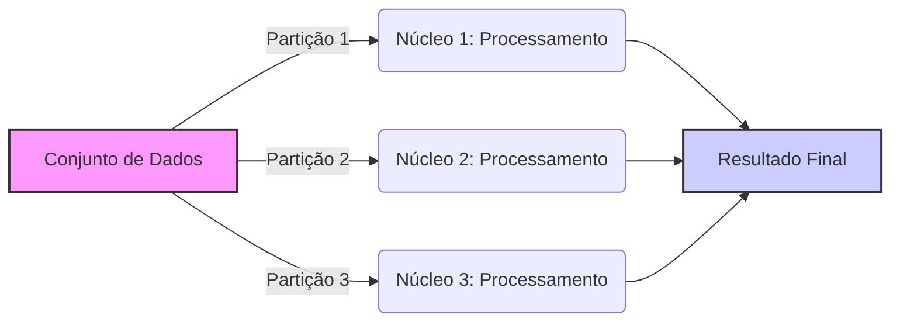
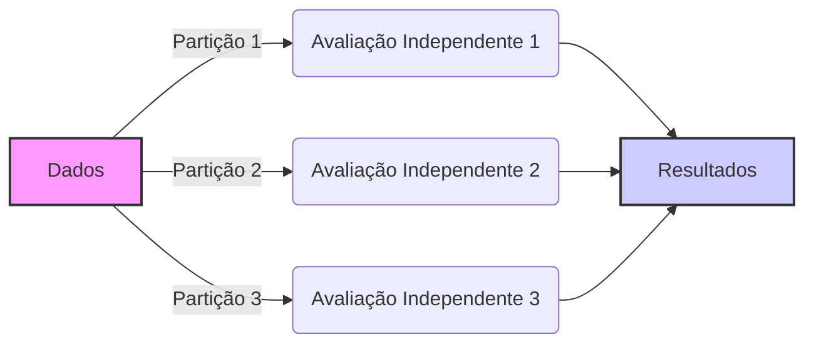
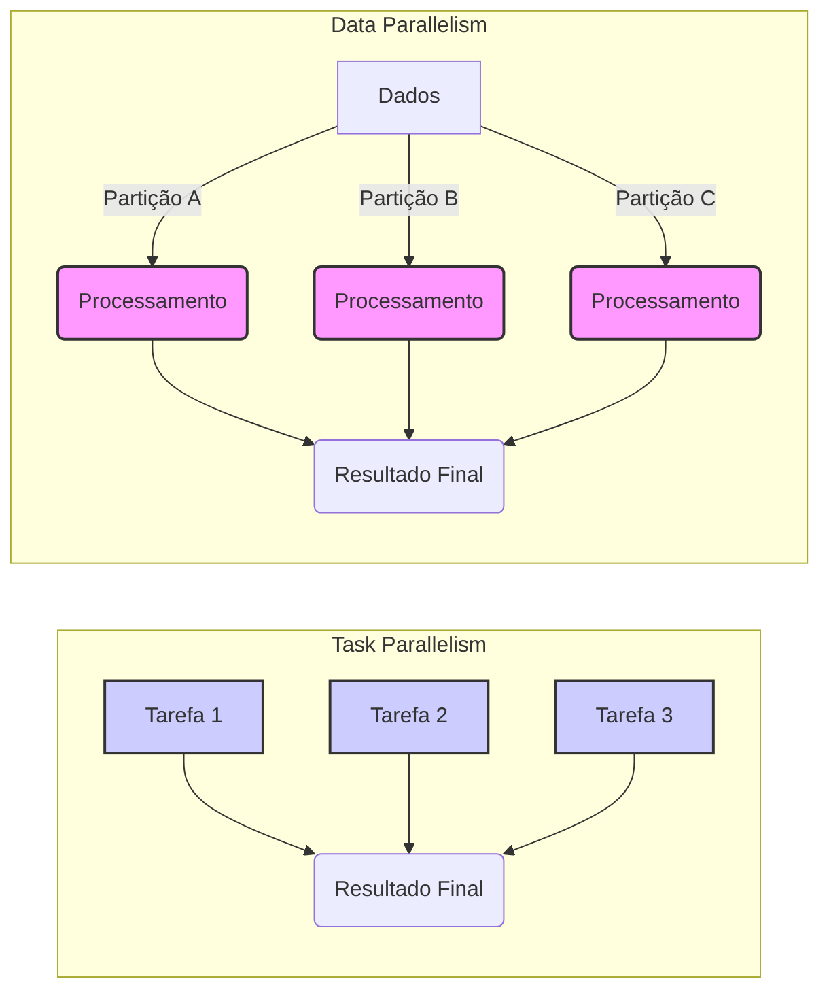
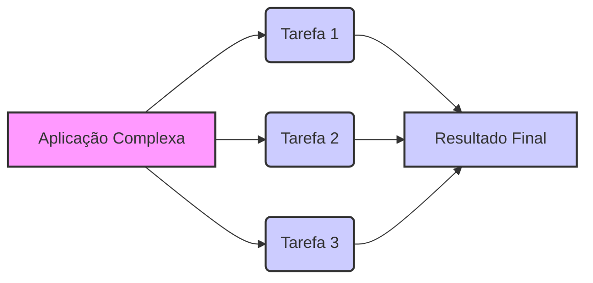
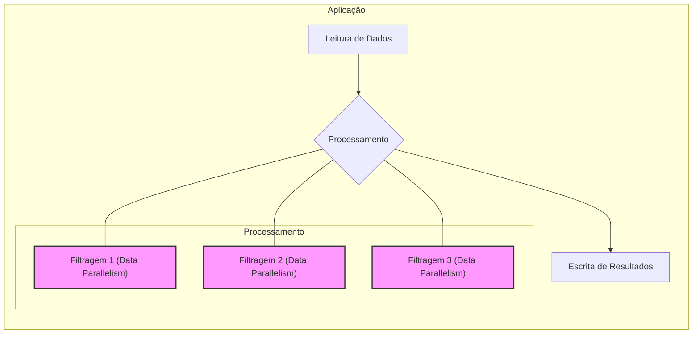
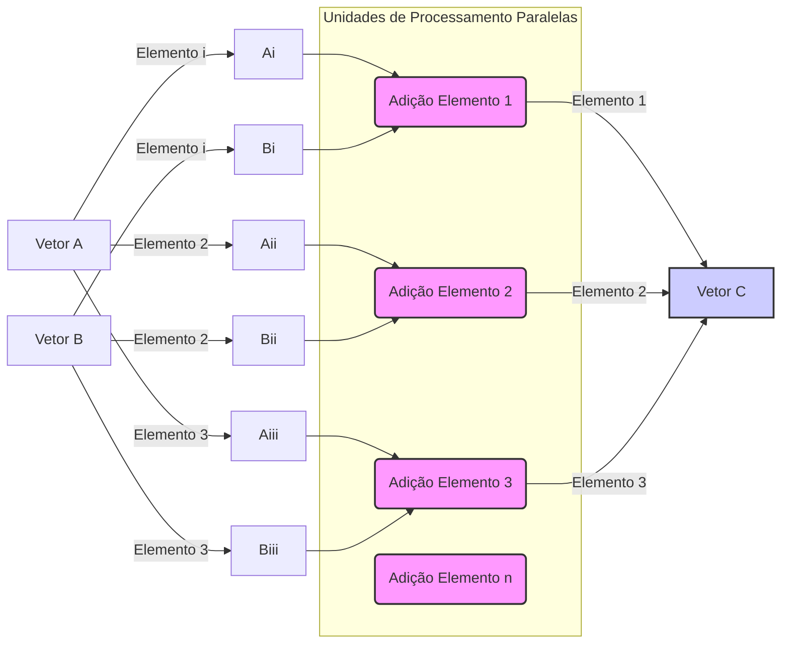

## Data Parallelism in Modern Applications

### Introdução ao Data Parallelism

O conceito de **data parallelism** é fundamental para entender como aplicações modernas lidam com grandes volumes de dados e requisitos computacionais intensivos [^1]. A necessidade de processar rapidamente informações provenientes de simulações físicas complexas, análises de imagens e vídeos, ou mesmo tarefas de agendamento em larga escala, exige uma abordagem que vá além do processamento sequencial tradicional [^2]. Este trecho explorará como essa forma de paralelismo se manifesta em diversas aplicações, destacando sua importância para o desempenho e a escalabilidade em sistemas de computação heterogêneos.

### Desenvolvimento do Conceito de Data Parallelism

**Conceito A: Data Parallelism e Aplicações de Modelagem do Mundo Real**

Modernas aplicações de software frequentemente operam sobre grandes quantidades de dados, modelando fenômenos do mundo real [^2]. Imagens e vídeos, por exemplo, capturam eventos físicos simultâneos e independentes em diferentes partes de uma cena. Da mesma forma, simulações de dinâmica de fluidos e física de corpos rígidos modelam forças naturais e movimentos, que podem ser avaliados independentemente dentro de pequenos intervalos de tempo [^2]. O agendamento de companhias aéreas envolve o gerenciamento de inúmeros voos, equipes e portões de aeroporto que operam de maneira paralela. A capacidade de avaliar tais eventos de forma independente é a base para o **data parallelism** nessas aplicações [^2].

==O **data parallelism** consiste na aplicação da mesma operação a diferentes partes de uma estrutura de dados, permitindo a execução paralela de tarefas [^1]. Um exemplo claro é a adição de vetores, onde cada elemento do vetor soma resultante é obtido pela soma de elementos correspondentes dos vetores de entrada, operações que podem ser realizadas em paralelo [^2].==

**Lemma X:** *Escalabilidade Através do Data Parallelism.*

**Declaração:** Em aplicações que processam grandes conjuntos de dados, o **data parallelism** oferece uma via natural para escalabilidade, permitindo que o desempenho cresça conforme o número de recursos de processamento aumenta.

**Prova:**

1. **Passo 1:** Em um cenário de **data parallelism**, as operações são aplicadas de forma independente a diferentes partições dos dados [^2].
2. **Passo 2:** Ao aumentar o número de processadores, o sistema pode alocar cada partição para um processador separado, permitindo que múltiplas operações sejam executadas simultaneamente [^2].
3. **Passo 3:** Essa abordagem reduz o tempo total de processamento de forma proporcional ao aumento do número de processadores, demonstrando a escalabilidade inerente ao **data parallelism** [^2]. $\blacksquare$

**Conceito B: CUDA e o Aproveitamento do Data Parallelism**

A arquitetura **CUDA** (Compute Unified Device Architecture) foi projetada para aproveitar o **data parallelism** de forma eficiente [^1]. Dispositivos **CUDA**, como as GPUs, possuem um grande número de unidades aritméticas, permitindo que tarefas computacionais sobre grandes conjuntos de dados sejam realizadas de maneira paralela [^2]. Programas **CUDA** dividem o processamento entre um *host* (CPU) e um ou mais *devices* (GPUs), com o código executado no *device* frequentemente sendo projetado para explorar o **data parallelism** [^3].

==O conceito de *kernels* em **CUDA** é crucial para a execução paralela [^3]. Um *kernel* é uma função que é executada por um grande número de *threads* simultaneamente. Cada *thread* processa uma parte dos dados, permitindo que a aplicação explore o **data parallelism** inerente aos problemas [^5].== Isso significa que cada *thread* pode executar as mesmas instruções sobre dados diferentes, acelerando o processo de computação [^5].

**Corolário Y:** *Otimização de Threads em CUDA para Data Parallelism.*

**Declaração:** A organização de *threads* em blocos e grades em **CUDA** permite o processamento eficiente de conjuntos de dados, com cada *thread* realizando operações sobre uma porção específica dos dados [^5].

**Prova:**

1. **Passo 1:** Em **CUDA**, *threads* são agrupadas em blocos, que por sua vez são organizados em grades [^5].
2. **Passo 2:** Cada *thread* possui um identificador único, permitindo que acesse uma porção específica dos dados [^5].
3. **Passo 3:** ==Ao ajustar o tamanho dos blocos e o número de blocos, um programa **CUDA** pode otimizar o processamento para diferentes tamanhos de conjuntos de dados, maximizando o aproveitamento do **data parallelism** [^5]. $\blacksquare$==

### Seção Teórica Avançada

**Pergunta Teórica:** Dada a definição de **data parallelism** como a aplicação da mesma operação a diferentes porções de dados [^2], e o uso de *kernels* em **CUDA** para executar essas operações em paralelo [^5], como podemos demonstrar que a escolha apropriada do tamanho dos blocos de *threads* (thread blocks) é crucial para o desempenho ideal em um dispositivo **CUDA**, considerando a natureza da arquitetura de hardware?

**Resposta:**

O desempenho de um programa **CUDA** que explora o **data parallelism** depende crucialmente da escolha do tamanho dos *thread blocks* [^5]. ==A arquitetura de hardware de uma GPU favorece blocos de *threads* que são múltiplos de 32 devido a razões de eficiência [^5].== O agrupamento de *threads* em *warps* de 32 *threads* permite que a GPU execute operações SIMD (Single Instruction, Multiple Data) de maneira eficiente. Se o tamanho do bloco não for um múltiplo de 32, pode ocorrer uma subutilização dos recursos de hardware, levando a gargalos de desempenho.

A escolha do número de *thread blocks* também afeta o desempenho. ==Um número muito pequeno de blocos pode não utilizar totalmente o hardware disponível, enquanto um número muito grande de blocos pode gerar uma sobrecarga de gerenciamento, impactando o desempenho [^5].==

Assim, a otimização do desempenho de **data parallelism** em **CUDA** envolve não apenas a execução simultânea de operações em dados diferentes, mas também a consideração das características da arquitetura de hardware ao definir os parâmetros de execução dos *kernels* [^5]. ==O tamanho ideal dos *thread blocks* e o número de blocos devem ser escolhidos de forma a maximizar a utilização dos recursos da GPU e minimizar a sobrecarga de gerenciamento, garantindo que o paralelismo seja explorado de maneira eficiente. $\blacksquare$==

### Conclusão do Trecho

O **data parallelism** é um paradigma essencial para o processamento eficiente de grandes conjuntos de dados, especialmente em aplicações que modelam o mundo real [^2]. A capacidade de dividir tarefas computacionais em sub-tarefas que podem ser executadas independentemente em diferentes porções dos dados é fundamental para alcançar escalabilidade e alto desempenho. A arquitetura **CUDA** foi projetada para explorar esse paralelismo, permitindo que desenvolvedores implementem aplicações que utilizam o poder computacional de GPUs para resolver problemas complexos [^3]. A escolha correta dos parâmetros de execução, como o tamanho dos *thread blocks*, é crucial para atingir o desempenho máximo em ambientes **CUDA** [^5].

### Referências Utilizadas neste Trecho

[^1]: "Our main objective is to teach the key concepts involved in writing massively parallel programs in a heterogeneous computing system." *(Introdução do Capítulo 3)*
[^2]: "Modern software applications often process a large amount of data and incur long execution time on sequential computers... Such independent evaluation is the basis of data parallelism in these applications." *(Seção 3.1)*
[^3]: "The structure of a CUDA program reflects the coexistence of a host (CPU) and one or more devices (GPUs) in the computer." *(Seção 3.2)*
[^4]: "Let us illustrate the concept of data parallelism with a vector addition example in Figure 3.1." *(Seção 3.1)*
[^5]: "Launching a kernel typically generates a large number of threads to exploit data parallelism... All the threads that are generated by a kernel launch are collectively called a grid." *(Seção 3.5)*

## Independent Evaluation as Basis

### Introdução à Avaliação Independente

A essência do **data parallelism** reside na capacidade de realizar avaliações independentes sobre diferentes partes de um conjunto de dados [^2]. Este princípio fundamental permite que tarefas computacionais sejam divididas em subtarefas menores, executadas simultaneamente, resultando em ganhos significativos de desempenho [^2]. ==O conceito de **avaliação independente** é, portanto, a pedra angular para o desenvolvimento de aplicações paralelas eficientes em sistemas heterogêneos como os que utilizam **CUDA** [^1].== Este trecho se aprofundará nesse princípio, explorando suas implicações e ilustrando sua aplicação prática em exemplos concretos.

### Desenvolvimento do Conceito de Avaliação Independente

**Conceito A: A Natureza da Avaliação Independente**

A **avaliação independente** refere-se à capacidade de computar um resultado para uma dada porção de dados sem depender dos resultados obtidos para outras porções de dados [^2]. Em outras palavras, cada cálculo pode ser realizado isoladamente e em paralelo com outros cálculos, sem a necessidade de comunicação ou sincronização entre eles [^2]. Este princípio é exemplificado claramente na adição de vetores, onde a soma de cada par de elementos correspondentes pode ser realizada de forma independente [^2].

A capacidade de realizar avaliações independentes permite que um programa tire proveito da arquitetura de processadores paralelos, como as GPUs [^2]. Ao alocar cada avaliação independente para uma unidade de processamento separada, pode-se reduzir drasticamente o tempo total de processamento. A identificação de avaliações independentes é, portanto, um passo crucial no processo de design de aplicações paralelas [^2].

**Lemma X:** *Relação Entre Avaliação Independente e Paralelismo de Dados.*

**Declaração:** ==A existência de avaliações independentes é uma condição necessária e suficiente para a aplicação efetiva de **data parallelism** em um problema computacional.==

**Prova:**

1. **Passo 1:** Se as operações sobre os dados podem ser avaliadas de forma independente, cada uma dessas avaliações pode ser alocada a um thread ou unidade de processamento separada, executando-se em paralelo [^2].
2. **Passo 2:** Se as operações sobre os dados dependem de outros dados ou resultados intermediários, a execução em paralelo torna-se mais complexa e, em alguns casos, impossível sem sincronização e comunicação entre as unidades de processamento [^2].
3. **Passo 3:** A natureza das operações como independentes possibilita que o processo seja distribuído em um *grid* de *threads*, otimizando o uso de recursos e acelerando a execução [^5]. $\blacksquare$

**Conceito B: Avaliação Independente em Aplicações Reais**

==Em aplicações do mundo real, o princípio da **avaliação independente** se manifesta em diversos cenários [^2]. Em processamento de imagens, por exemplo, a manipulação de pixels pode muitas vezes ser feita de forma independente, permitindo que a mesma operação (como um filtro) seja aplicada a diferentes regiões de uma imagem em paralelo [^2]. Em simulações de dinâmica de fluidos, o cálculo das forças e movimentos pode ser realizado independentemente em diferentes pontos da simulação, dentro de um pequeno intervalo de tempo [^2]. O agendamento de voos em companhias aéreas é outro exemplo, onde as decisões sobre alocação de voos, tripulações e portões podem, em grande parte, ser tomadas de forma independente, desde que se respeitem as restrições globais do sistema [^2].==

O reconhecimento da existência de **avaliações independentes** permite que os desenvolvedores projetem aplicações mais eficientes, capazes de tirar o máximo proveito das capacidades de processamento paralelo [^2]. A identificação dessas avaliações independentes é, portanto, uma etapa essencial para a otimização de desempenho em aplicações que utilizam **CUDA** e outros sistemas de computação heterogênea [^1].

**Corolário Y:** *O Papel do Kernel CUDA na Avaliação Independente.*

**Declaração:** Um *kernel* **CUDA** é uma função projetada para encapsular uma avaliação independente, que pode ser executada por múltiplas *threads* simultaneamente em diferentes partes de um conjunto de dados [^5].

**Prova:**

1. **Passo 1:** Cada *thread* em um *kernel* executa a mesma sequência de instruções, mas sobre diferentes porções dos dados [^5].
2. **Passo 2:** A natureza da avaliação dentro do *kernel* é tal que cada *thread* trabalha de forma independente, sem necessidade de comunicação ou sincronização com outros *threads* [^5].
3. **Passo 3:** O *kernel*, portanto, atua como um modelo para avaliações independentes, permitindo que um grande número de operações seja executado em paralelo, aproveitando o **data parallelism** [^5]. $\blacksquare$

### Seção Teórica Avançada

**Pergunta Teórica:** Dado que a **avaliação independente** é a base do **data parallelism**, e que o *kernel* em **CUDA** implementa esta avaliação sobre diferentes elementos de um *grid* de *threads* [^5], ==como podemos modelar matematicamente a redução do tempo de execução de um algoritmo devido ao **data parallelism**, considerando o número de unidades de processamento paralelas e a quantidade de avaliações independentes a serem realizadas?==

**Resposta:**

Podemos modelar matematicamente a redução do tempo de execução devido ao **data parallelism** usando a Lei de Amdahl. ==A Lei de Amdahl estabelece que a aceleração máxima de um programa devido à paralelização é limitada pela porção sequencial do código. Seja *T* o tempo de execução de um programa sequencial e *p* a fração do programa que pode ser paralelizada, o tempo de execução de um programa paralelo *Tparalelo* pode ser modelado como:==

$$ T_{paralelo} = (1-p)T + \frac{pT}{N} $$

==Onde *N* é o número de unidades de processamento paralelas (threads ou núcleos).== O primeiro termo, $(1-p)T$, representa a porção sequencial do programa que não pode ser paralelizada. O segundo termo, $\frac{pT}{N}$, representa a porção do programa que pode ser paralelizada e que será dividida entre as unidades de processamento.

Para um cenário ideal onde todas as avaliações são independentes, *p* se aproxima de 1, e a equação se simplifica para:

$$ T_{paralelo} \approx \frac{T}{N} $$

Neste caso, o tempo de execução é aproximadamente inversamente proporcional ao número de unidades de processamento, o que reflete a aceleração proporcionada pelo **data parallelism**. Entretanto, na prática, nem todos os problemas são perfeitamente paralelizáveis, e a comunicação e sincronização entre os *threads* pode gerar uma sobrecarga, reduzindo a aceleração. A Lei de Amdahl, portanto, fornece um limite teórico superior para a aceleração, mas o tempo de execução real também depende de fatores como a arquitetura do hardware e a eficiência da implementação do código paralelo. $\blacksquare$

### Conclusão do Trecho

O princípio da **avaliação independente** é o alicerce do **data parallelism**, permitindo que problemas computacionais sejam divididos em tarefas menores que podem ser executadas em paralelo [^2]. A capacidade de identificar e aproveitar essas avaliações independentes é fundamental para o design de aplicações paralelas eficientes em **CUDA** e outros sistemas de computação heterogênea [^1]. Ao modelar as operações de forma que cada *thread* possa realizar seus cálculos sem depender de outros *threads*, maximiza-se o uso dos recursos computacionais e minimiza-se o tempo de execução. A implementação de *kernels* em **CUDA** reflete diretamente este princípio, fornecendo uma base sólida para a exploração do **data parallelism** [^5].

### Referências Utilizadas neste Trecho

[^1]: "Our main objective is to teach the key concepts involved in writing massively parallel programs in a heterogeneous computing system." *(Introdução do Capítulo 3)*
[^2]: "Modern software applications often process a large amount of data and incur long execution time on sequential computers... Such independent evaluation is the basis of data parallelism in these applications." *(Seção 3.1)*
[^3]: "The structure of a CUDA program reflects the coexistence of a host (CPU) and one or more devices (GPUs) in the computer." *(Seção 3.2)*
[^4]: "Let us illustrate the concept of data parallelism with a vector addition example in Figure 3.1." *(Seção 3.1)*
[^5]: "Launching a kernel typically generates a large number of threads to exploit data parallelism... All the threads that are generated by a kernel launch are collectively called a grid." *(Seção 3.5)*

## Task Parallelism vs. Data Parallelism

### Introdução à Comparação entre Task Parallelism e Data Parallelism

A exploração do paralelismo é fundamental para o desenvolvimento de aplicações de alto desempenho, e duas abordagens principais se destacam: **task parallelism** e **data parallelism** [^2]. Embora ambas visem acelerar a execução de um programa através da divisão do trabalho, elas diferem significativamente na forma como essa divisão é feita [^2]. Este trecho explorará as características distintas de cada abordagem, comparando suas vantagens e desvantagens, e destacando como elas podem ser combinadas para obter o melhor desempenho em sistemas de computação heterogêneos.

### Desenvolvimento da Comparação

**Conceito A: Task Parallelism e a Decomposição de Aplicações**

==O **task parallelism** envolve a decomposição de uma aplicação em tarefas independentes, que podem ser executadas simultaneamente [^2]. Cada tarefa pode realizar uma operação diferente ou trabalhar em uma parte diferente do problema.== Um exemplo clássico é uma aplicação que precisa realizar uma adição de vetores e uma multiplicação de matriz por vetor. Cada uma dessas operações pode ser vista como uma tarefa separada e pode ser executada em paralelo [^2].

O **task parallelism** é particularmente útil em aplicações que possuem várias fases ou etapas de processamento que podem ser realizadas simultaneamente. Em um simulador de dinâmica molecular, por exemplo, o cálculo de forças vibracionais, rotacionais, e não-ligantes podem ser consideradas tarefas distintas [^2]. O grau de paralelismo é determinado pelo número de tarefas independentes que podem ser identificadas na aplicação [^2].

**Lemma X:** *Independência de Tarefas em Task Parallelism*

**Declaração:** Em **task parallelism**, a execução paralela de tarefas é possível quando cada tarefa é independente das outras, ou seja, não necessita dos resultados de outras tarefas para prosseguir.

**Prova:**

1. **Passo 1:** Uma tarefa independente pode ser executada em qualquer ordem ou simultaneamente com outras tarefas independentes, sem causar inconsistências nos resultados [^2].
2. **Passo 2:** Se duas tarefas dependem uma da outra (por exemplo, uma tarefa precisa do resultado de outra), a execução paralela direta é impossível sem mecanismos de sincronização e comunicação [^2].
3. **Passo 3:**  A independência das tarefas permite que o sistema distribua cada tarefa para um processador ou núcleo separado, maximizando o aproveitamento do paralelismo e reduzindo o tempo de execução [^2]. $\blacksquare$

**Conceito B: Data Parallelism e a Operação Sobre Dados**

O **data parallelism**, por outro lado, envolve a aplicação da mesma operação a diferentes partes de um conjunto de dados em paralelo [^2]. Em vez de decompor a aplicação em diferentes tarefas, o **data parallelism** foca na divisão dos dados para que cada unidade de processamento trabalhe em uma parte diferente deles [^2]. A adição de vetores é um exemplo perfeito de **data parallelism**, onde a mesma operação de adição é aplicada a cada par de elementos correspondentes [^2].

O **data parallelism** é particularmente eficaz quando se trabalha com grandes conjuntos de dados e operações repetitivas. Em processamento de imagens, a aplicação de um filtro pode ser implementada como um problema de **data parallelism**, onde cada pixel da imagem é processado independentemente [^2]. Em simulações de dinâmica de fluidos, cada ponto da simulação pode ter as mesmas equações aplicadas [^2]. O grau de paralelismo é determinado pelo tamanho dos dados e pela capacidade do sistema de dividir esses dados entre as unidades de processamento [^2].

**Corolário Y:** *Escalabilidade do Data Parallelism Com Grandes Conjuntos de Dados*

**Declaração:** O **data parallelism** oferece uma escalabilidade natural para aplicações que lidam com grandes conjuntos de dados, permitindo que o desempenho aumente conforme o número de processadores aumenta.

**Prova:**

1. **Passo 1:** Em **data parallelism**, a mesma operação é aplicada a diferentes porções dos dados.
2. **Passo 2:** Com mais processadores, cada processador pode lidar com uma porção menor dos dados, resultando em um processamento simultâneo de todas as partes.
3. **Passo 3:** Essa divisão do trabalho permite que aplicações escalem seu desempenho em proporção ao aumento de hardware disponível, tornando o **data parallelism** ideal para processar grandes conjuntos de dados [^2]. $\blacksquare$

### Seção Teórica Avançada

**Pergunta Teórica:**  Considerando que tanto o **task parallelism** quanto o **data parallelism** são formas de explorar o paralelismo em aplicações computacionais, e que aplicações reais podem apresentar características de ambos [^2], como podemos derivar uma métrica ou metodologia para avaliar qual abordagem é mais adequada (ou uma combinação de ambas) para uma determinada aplicação, levando em consideração fatores como a natureza das operações, o tamanho dos dados, e o hardware disponível?

**Resposta:**

A escolha entre **task parallelism**, **data parallelism**, ou uma combinação de ambos, depende de vários fatores que precisam ser analisados cuidadosamente. Não existe uma abordagem única que seja ideal para todas as aplicações. Uma possível metodologia para essa avaliação envolve os seguintes passos:

1. **Análise da Aplicação:** O primeiro passo é entender a aplicação e suas etapas de processamento. É fundamental identificar as tarefas distintas e as operações repetitivas sobre os dados. Se a aplicação tiver um conjunto de etapas de processamento que podem ser executadas independentemente, o **task parallelism** pode ser uma boa abordagem. Se a aplicação envolve uma grande quantidade de dados e operações repetitivas sobre eles, o **data parallelism** pode ser mais adequado.

2. **Tamanho dos Dados e Operações:** O tamanho dos dados e a natureza das operações influenciam a escolha. Se os dados são grandes e as operações são homogêneas, o **data parallelism** tende a ser a melhor opção. Se os dados são menores ou as operações são muito variadas, o **task parallelism** pode ser mais vantajoso.

3. **Hardware Disponível:** O hardware disponível também influencia a escolha. Se o sistema possui muitos núcleos de CPU, o **task parallelism** pode ser uma boa opção. Se o sistema possui uma GPU com muitos núcleos de processamento, o **data parallelism** pode ser mais eficiente.

4. **Análise de Dependência:** É crucial analisar as dependências entre as tarefas e as operações. Se as tarefas dependem fortemente umas das outras, a execução paralela pode ser dificultada. Se as operações sobre os dados são independentes, o **data parallelism** pode ser implementado com facilidade.

5. **Combinação de Abordagens:** Em muitos casos, a melhor abordagem envolve uma combinação de **task parallelism** e **data parallelism**. Por exemplo, uma aplicação pode ser dividida em tarefas maiores usando o **task parallelism**, e cada tarefa pode ser implementada usando o **data parallelism**.

6. **Métricas de Desempenho:** Após a implementação, é fundamental medir o desempenho da aplicação para avaliar a eficácia da abordagem escolhida. Métricas como tempo de execução, utilização de recursos, e escalabilidade podem ser utilizadas para comparar diferentes implementações e otimizar o uso de paralelismo.

A melhor abordagem é aquela que se alinha com a natureza da aplicação, os recursos de hardware disponíveis e que maximiza o desempenho e a escalabilidade. A metodologia descrita oferece uma estrutura para tomar essa decisão de forma informada e eficiente. $\blacksquare$

### Conclusão do Trecho

O **task parallelism** e o **data parallelism** são duas abordagens fundamentais para a exploração do paralelismo em computação, cada uma com suas vantagens e desvantagens [^2]. O **task parallelism** foca na divisão de uma aplicação em tarefas independentes, enquanto o **data parallelism** foca na aplicação da mesma operação a diferentes porções dos dados [^2]. A escolha entre essas abordagens (ou uma combinação de ambas) depende da natureza específica da aplicação, dos dados e do hardware disponível. A compreensão das diferenças entre essas abordagens é essencial para o desenvolvimento de aplicações paralelas de alto desempenho em sistemas heterogêneos como os que utilizam **CUDA** [^1].

### Referências Utilizadas neste Trecho

[^1]: "Our main objective is to teach the key concepts involved in writing massively parallel programs in a heterogeneous computing system." *(Introdução do Capítulo 3)*
[^2]: "Data parallelism is not the only type of parallelism widely used in parallel programming. Task parallelism has also been used extensively in parallel programming... Such independent evaluation is the basis of data parallelism in these applications." *(Seção 3.1)*
[^3]: "The structure of a CUDA program reflects the coexistence of a host (CPU) and one or more devices (GPUs) in the computer." *(Seção 3.2)*
[^4]: "Let us illustrate the concept of data parallelism with a vector addition example in Figure 3.1." *(Seção 3.1)*
[^5]: "Launching a kernel typically generates a large number of threads to exploit data parallelism... All the threads that are generated by a kernel launch are collectively called a grid." *(Seção 3.5)*

## Task Decomposition

### Introdução à Task Decomposition

A **task decomposition**, ou decomposição de tarefas, é um processo fundamental no desenvolvimento de aplicações paralelas, especialmente aquelas que utilizam **task parallelism** [^2]. Essa metodologia envolve a divisão de uma aplicação complexa em unidades de trabalho menores, independentes e gerenciáveis, cada uma representando uma tarefa discreta [^2]. A eficácia da **task decomposition** influencia diretamente a capacidade de uma aplicação de tirar proveito de sistemas de computação paralela e heterogênea, como os que utilizam **CUDA** [^1]. Este trecho explorará os princípios e as técnicas envolvidas na **task decomposition**, ilustrando sua importância para o desempenho e a escalabilidade de aplicações modernas.

### Desenvolvimento da Task Decomposition

**Conceito A: A Essência da Task Decomposition**

A **task decomposition** é o processo de identificar as unidades de trabalho independentes dentro de uma aplicação. Cada unidade de trabalho, ou tarefa, deve ser definida de forma que sua execução não dependa da execução de outras tarefas, a menos que essa dependência seja explicitamente gerenciada [^2]. A decomposição de uma aplicação em tarefas é crucial para a aplicação do **task parallelism**, onde diferentes tarefas são executadas simultaneamente em diferentes unidades de processamento [^2].

A qualidade da **task decomposition** impacta diretamente o desempenho paralelo da aplicação. Se as tarefas forem muito grandes e interdependentes, a paralelização pode não gerar ganhos significativos. Se as tarefas forem muito pequenas, a sobrecarga de gerenciamento pode superar os benefícios da paralelização. O objetivo é encontrar um equilíbrio, criando tarefas que sejam grandes o suficiente para justificar o overhead da paralelização, mas pequenas o suficiente para que possam ser executadas de forma independente e eficiente [^2].

**Lemma X:** *Independência e Paralelização em Task Decomposition*

**Declaração:** A eficiência do **task parallelism** depende diretamente da capacidade de uma **task decomposition** criar tarefas independentes, maximizando a simultaneidade e minimizando a necessidade de comunicação e sincronização.

**Prova:**

1. **Passo 1:** Se as tarefas são independentes, elas podem ser executadas simultaneamente em diferentes processadores ou núcleos, aproveitando o paralelismo [^2].
2. **Passo 2:** Se as tarefas dependem uma da outra, é preciso adicionar mecanismos de sincronização e comunicação, que introduzem sobrecarga e podem limitar o desempenho [^2].
3. **Passo 3:** Uma **task decomposition** eficaz busca reduzir ao máximo a interdependência entre as tarefas, permitindo que a aplicação execute o máximo de trabalho possível em paralelo, minimizando a sobrecarga [^2]. $\blacksquare$

**Conceito B: Técnicas de Task Decomposition**

Existem várias técnicas para realizar a **task decomposition**, dependendo da natureza da aplicação [^2]. Uma técnica comum é a decomposição funcional, onde a aplicação é dividida em tarefas com base em suas funcionalidades. Por exemplo, uma aplicação de processamento de vídeo pode ter tarefas para decodificação, filtragem, e codificação, cada uma podendo ser executada em paralelo [^2].

Outra técnica é a decomposição por domínio, onde a aplicação é dividida com base nas diferentes partes dos dados que ela processa. Por exemplo, uma aplicação de simulação pode ter uma tarefa para cada região do espaço simulado, com cada tarefa processando a física dessa região [^2]. A escolha da técnica depende da estrutura da aplicação e do tipo de paralelismo que se deseja alcançar [^2].

Em muitos casos, uma combinação dessas técnicas pode ser necessária para otimizar a **task decomposition**. Além disso, a análise cuidadosa das dependências entre as tarefas é essencial para garantir a execução correta e eficiente da aplicação paralela [^2].

**Corolário Y:** *Task Decomposition e CUDA Streams*

**Declaração:**  Em **CUDA**, a **task decomposition** pode ser utilizada em conjunto com *streams* para executar tarefas de forma assíncrona, permitindo que o CPU e a GPU trabalhem em paralelo e maximizando a utilização dos recursos.

**Prova:**

1. **Passo 1:** *CUDA streams* permitem que as tarefas sejam enfileiradas para execução em um *device* de forma assíncrona, sem bloquear o *host* [^2].
2. **Passo 2:** Ao dividir uma aplicação em tarefas menores que podem ser executadas em diferentes *streams*, a **task decomposition** possibilita que o CPU continue realizando outras tarefas enquanto a GPU está ocupada com uma tarefa [^2].
3. **Passo 3:** Essa sobreposição de execução do CPU e da GPU é um dos benefícios importantes do uso de *streams* para gerenciar tarefas em **CUDA**, que permite maior paralelismo em um sistema heterogêneo. $\blacksquare$

### Seção Teórica Avançada

**Pergunta Teórica:** Dado que a **task decomposition** é um processo que visa dividir uma aplicação em unidades de trabalho independentes para facilitar a execução paralela, e considerando que a granularidade das tarefas (o tamanho e complexidade de cada tarefa) pode impactar significativamente o desempenho, como podemos formalizar matematicamente a relação entre o número de tarefas, o tempo de execução de cada tarefa, e o overhead de comunicação e sincronização, para determinar a granularidade ideal para uma dada aplicação em um sistema paralelo?

**Resposta:**

Podemos formalizar a relação entre o número de tarefas, o tempo de execução, e o overhead de comunicação e sincronização utilizando um modelo simplificado. Seja *N* o número de tarefas, *texec* o tempo médio de execução de cada tarefa, e *tcomm* o overhead médio de comunicação e sincronização por tarefa. O tempo total de execução *Ttotal* para uma aplicação paralela pode ser modelado como:

$$T_{total} = \frac{N \cdot t_{exec}}{P} + O(t_{comm} \cdot N)$$

Onde *P* representa o número de processadores ou unidades de execução paralelas. O primeiro termo, $\frac{N \cdot t_{exec}}{P}$, representa o tempo de execução das tarefas, dividido pelo número de processadores. O segundo termo, $O(t_{comm} \cdot N)$, representa a sobrecarga de comunicação e sincronização, que pode crescer com o aumento do número de tarefas.

No entanto, esta equação representa uma versão simplificada, visto que a complexidade da comunicação e sincronização, geralmente, não são lineares com relação ao número de tarefas. Em problemas reais, a relação entre tarefas, tempo de execução e *overhead* pode ser não linear e depender de outros fatores, como a latência da rede e a arquitetura do sistema.

O objetivo é encontrar o encontrar um valor para *N* (número de tarefas) que minimize o tempo total de execução *Ttotal*. Se *N* é muito pequeno (poucas tarefas), pode haver subutilização dos processadores, resultando em um tempo de execução maior, mesmo com pouco *overhead*. Se *N* é muito grande (muitas tarefas), o overhead de comunicação e sincronização pode dominar o tempo de execução total, tornando a paralelização ineficaz.

A granularidade ideal das tarefas (relacionada a *texec*) é obtida ao encontrar o balanço que resulta no menor tempo de execução total. Isso geralmente envolve experimentação e análise de desempenho para identificar um ponto ótimo que equilibra o tempo de execução das tarefas com o *overhead* de comunicação e sincronização. $\blacksquare$

### Conclusão do Trecho

A **task decomposition** é um processo essencial para a exploração eficaz do **task parallelism** em aplicações computacionais [^2]. A capacidade de dividir uma aplicação complexa em tarefas independentes e gerenciáveis é fundamental para alcançar o alto desempenho em sistemas paralelos, como os que utilizam **CUDA** [^1]. A escolha adequada das técnicas de decomposição e a análise das dependências entre as tarefas são cruciais para o sucesso do desenvolvimento de aplicações paralelas eficientes. A integração com recursos como *CUDA streams* possibilita o uso eficaz da **task decomposition** em sistemas heterogêneos, maximizando o aproveitamento dos recursos de processamento [^2].

### Referências Utilizadas neste Trecho

[^1]: "Our main objective is to teach the key concepts involved in writing massively parallel programs in a heterogeneous computing system." *(Introdução do Capítulo 3)*
[^2]: "Data parallelism is not the only type of parallelism widely used in parallel programming. Task parallelism has also been used extensively in parallel programming... Such independent evaluation is the basis of data parallelism in these applications." *(Seção 3.1)*
[^3]: "The structure of a CUDA program reflects the coexistence of a host (CPU) and one or more devices (GPUs) in the computer." *(Seção 3.2)*
[^4]: "Let us illustrate the concept of data parallelism with a vector addition example in Figure 3.1." *(Seção 3.1)*
[^5]: "Launching a kernel typically generates a large number of threads to exploit data parallelism... All the threads that are generated by a kernel launch are collectively called a grid." *(Seção 3.5)*

## Scalability of Data Parallelism

### Introdução à Escalabilidade do Data Parallelism

A **escalabilidade** é uma característica crucial para aplicações que precisam lidar com grandes volumes de dados e demandas computacionais crescentes [^2]. No contexto da computação paralela, o **data parallelism** emerge como um dos principais mecanismos para alcançar essa escalabilidade [^2]. A capacidade de dividir um problema em partes menores e processá-las simultaneamente, explorando o aumento de recursos de hardware, torna o **data parallelism** fundamental para o desenvolvimento de aplicações de alto desempenho em sistemas heterogêneos, como os que utilizam **CUDA** [^1]. Este trecho investigará em detalhes o papel do **data parallelism** como motor da escalabilidade, explorando como ele se adapta ao aumento de recursos de hardware e as implicações para o desempenho das aplicações.

### Desenvolvimento da Escalabilidade do Data Parallelism

**Conceito A: Data Parallelism como Base da Escalabilidade**

A escalabilidade de uma aplicação paralela refere-se à sua capacidade de manter ou melhorar seu desempenho à medida que mais recursos de hardware (por exemplo, processadores, núcleos, etc.) são adicionados ao sistema [^2]. O **data parallelism** oferece uma forma natural de alcançar a escalabilidade, pois permite que a mesma operação seja aplicada a diferentes porções dos dados simultaneamente [^2]. Ao aumentar o número de processadores ou unidades de processamento, cada unidade pode ser designada para processar uma parte diferente dos dados, acelerando a execução geral [^2].

O **data parallelism** é particularmente bem-adaptado para aplicações que lidam com grandes conjuntos de dados e operações repetitivas, onde o mesmo tipo de cálculo é executado em diferentes partes dos dados [^2]. Em aplicações de processamento de imagem, por exemplo, cada pixel pode ser processado de forma independente [^2]. Em simulações de dinâmica de fluidos, cada ponto no espaço simulado pode ter as mesmas equações aplicadas [^2]. Essa natureza paralelizável das operações permite que o **data parallelism** seja eficaz em uma ampla gama de aplicações.

**Lemma X:** *A Relação Direta entre Data Parallelism e Escalabilidade*

**Declaração:** O **data parallelism** oferece uma forma direta de escalabilidade, onde o desempenho de uma aplicação aumenta de maneira aproximadamente linear com o número de unidades de processamento disponíveis, dentro de certos limites práticos.

**Prova:**

1. **Passo 1:** No **data parallelism**, a mesma operação é aplicada a diferentes partes dos dados [^2].
2. **Passo 2:** Ao aumentar o número de unidades de processamento, o sistema pode alocar cada parte dos dados a uma unidade separada, permitindo que múltiplas operações sejam executadas simultaneamente [^2].
3. **Passo 3:** Em condições ideais, o tempo de execução da aplicação paralela é inversamente proporcional ao número de unidades de processamento, resultando em escalabilidade quase linear [^2]. $\blacksquare$

**Conceito B: Data Parallelism e Arquiteturas CUDA**

Em arquiteturas **CUDA**, o **data parallelism** é explorado através da execução de *kernels* em um grande número de *threads* [^5]. Cada *thread* executa o mesmo código sobre uma porção diferente dos dados, utilizando os recursos paralelos da GPU [^5]. A organização hierárquica de *threads* em blocos e grades permite que a aplicação seja escalável para diferentes tamanhos de problemas, desde que o número de threads e blocos seja adequadamente configurado [^5].

A capacidade de aumentar o número de *threads* e blocos para explorar o poder computacional de GPUs maiores é um fator chave para a escalabilidade de aplicações **CUDA** baseadas em **data parallelism**. A mesma aplicação pode ser executada em uma GPU menor com menos recursos ou em uma GPU maior com mais recursos, com o desempenho sendo escalado de acordo [^5]. Esse tipo de escalabilidade é uma das principais vantagens do **data parallelism** em sistemas heterogêneos como os que utilizam **CUDA** [^1].

**Corolário Y:** *Data Parallelism e Limitações de Escalabilidade*

**Declaração:** Embora o **data parallelism** ofereça uma forma eficaz de escalabilidade, ele está sujeito a limitações práticas, como a sobrecarga de comunicação, a falta de paralelismo em certas partes do código e a arquitetura de hardware específica.

**Prova:**

1. **Passo 1:** A comunicação entre diferentes unidades de processamento, especialmente quando processam partes de dados que são dependentes uma da outra, pode gerar sobrecarga e reduzir a escalabilidade [^2].
2. **Passo 2:** Nem todas as partes de uma aplicação podem ser paralelizáveis. A existência de partes sequenciais do código limita a escalabilidade geral, de acordo com a Lei de Amdahl [^2].
3. **Passo 3:** As características específicas da arquitetura de hardware, como largura de banda de memória e número de núcleos de processamento, também podem impor limitações à escalabilidade alcançável em **data parallelism** [^5]. $\blacksquare$

### Seção Teórica Avançada

**Pergunta Teórica:** Dado que o **data parallelism** se beneficia do aumento de recursos de hardware para melhorar o desempenho, como podemos formular uma função que modele o *speedup* de uma aplicação baseada em **data parallelism**, levando em consideração tanto o número de unidades de processamento quanto a sobrecarga de comunicação e sincronização, e como essa função se relaciona com a Lei de Amdahl?

**Resposta:**

Podemos modelar o *speedup* de uma aplicação baseada em **data parallelism** usando uma função que leve em consideração o número de unidades de processamento e a sobrecarga de comunicação. Seja *S(N)* o *speedup* obtido com *N* unidades de processamento. O tempo de execução da aplicação sequencial é *Tseq*, e o tempo de execução paralelo é *Tpar*. Então, o speedup pode ser modelado como:

$$S(N) = \frac{T_{seq}}{T_{par}}$$

Em uma situação ideal onde não há comunicação, $T_{par} = \frac{T_{seq}}{N}$, e $S(N) = N$, o que significa um speedup linear. No entanto, em situações reais, a sobrecarga de comunicação e sincronização afeta o tempo de execução paralelo. Uma maneira de modelar essa sobrecarga é adicionando um termo que aumenta com *N*, representado como uma função *f(N)*. Assim, o tempo de execução paralelo pode ser expresso como:

$$T_{par} = \frac{T_{seq}}{N} + f(N)$$

A forma exata da função *f(N)* depende das características específicas da aplicação e do hardware, mas geralmente aumenta com o número de unidades de processamento, representando o aumento da sobrecarga de comunicação.

A relação entre essa modelagem e a Lei de Amdahl é que a Lei de Amdahl define um limite teórico para o *speedup* devido à existência de partes sequenciais do código. Seja *p* a fração do código que pode ser paralelizada, o speedup máximo, conforme a Lei de Amdahl, é dado por:

$$ S_{max} = \frac{1}{(1-p) + \frac{p}{N}} $$

A função que modela o *speedup* com sobrecarga de comunicação e sincronização reflete a realidade prática, onde o speedup é inferior ao limite teórico da Lei de Amdahl devido à sobrecarga da comunicação. O objetivo da otimização é minimizar essa sobrecarga, aproximando o *speedup* real do limite teórico da Lei de Amdahl e explorando a escalabilidade do **data parallelism** de forma mais eficiente. $\blacksquare$

### Conclusão do Trecho

O **data parallelism** desempenha um papel central na conquista da escalabilidade em aplicações paralelas [^2]. Ao permitir que as mesmas operações sejam aplicadas simultaneamente a diferentes porções dos dados, ele possibilita que o desempenho aumente à medida que mais recursos de hardware são adicionados ao sistema [^2]. A arquitetura **CUDA** explora esse paralelismo através da execução de *kernels* por múltiplos *threads* em GPUs, proporcionando uma plataforma eficaz para o desenvolvimento de aplicações escaláveis [^5]. Embora a escalabilidade do **data parallelism** seja afetada por limitações práticas, como sobrecarga de comunicação, a escolha adequada de arquiteturas e a otimização da implementação do código podem minimizar esses efeitos e obter ganhos significativos de desempenho [^2].

### Referências Utilizadas neste Trecho

[^1]: "Our main objective is to teach the key concepts involved in writing massively parallel programs in a heterogeneous computing system." *(Introdução do Capítulo 3)*
[^2]: "In general, data parallelism is the main source of scalability for parallel programs... Such independent evaluation is the basis of data parallelism in these applications." *(Seção 3.1)*
[^3]: "The structure of a CUDA program reflects the coexistence of a host (CPU) and one or more devices (GPUs) in the computer." *(Seção 3.2)*
[^4]: "Let us illustrate the concept of data parallelism with a vector addition example in Figure 3.1." *(Seção 3.1)*
[^5]: "Launching a kernel typically generates a large number of threads to exploit data parallelism... All the threads that are generated by a kernel launch are collectively called a grid." *(Seção 3.5)*

## Role of Task Parallelism in Performance

### Introdução ao Papel do Task Parallelism no Desempenho

Embora o **data parallelism** seja frequentemente o principal motor da escalabilidade em aplicações paralelas, o **task parallelism** desempenha um papel suplementar crucial na otimização do desempenho [^2]. Em muitos casos, uma aplicação pode se beneficiar da combinação de ambas as abordagens para alcançar o máximo de eficiência. O **task parallelism**, ao permitir a execução paralela de diferentes tarefas, possibilita a melhor utilização de recursos de hardware e a sobreposição de computação e comunicação, contribuindo para um melhor desempenho geral [^2]. Este trecho explorará as diferentes maneiras pelas quais o **task parallelism** contribui para a otimização do desempenho, com ênfase em sua interação com o **data parallelism** em sistemas heterogêneos, como os que utilizam **CUDA** [^1].

### Desenvolvimento do Papel do Task Parallelism no Desempenho

**Conceito A: Task Parallelism como Complemento ao Data Parallelism**

O **task parallelism** é particularmente útil para aplicações que possuem várias fases ou etapas de processamento que podem ser executadas simultaneamente, como a leitura de arquivos de entrada, o processamento de dados, e a escrita de arquivos de saída [^2]. Em vez de executar essas etapas sequencialmente, o **task parallelism** permite que elas sejam executadas em paralelo, reduzindo o tempo total de execução [^2]. Quando combinado com o **data parallelism**, o **task parallelism** pode potencializar ainda mais o desempenho de uma aplicação. Por exemplo, uma aplicação de processamento de imagem pode usar o **task parallelism** para executar diferentes filtros em paralelo, e cada filtro pode usar o **data parallelism** para processar os pixels da imagem em paralelo [^2].

A combinação de **task parallelism** e **data parallelism** pode levar à sobreposição de computação e comunicação, melhorando a utilização dos recursos de hardware e reduzindo o tempo total de execução. Enquanto algumas unidades de processamento realizam cálculos intensivos, outras podem estar envolvidas em tarefas de comunicação ou leitura de dados, evitando ociosidade e maximizando o rendimento da aplicação [^2].

**Lemma X:** *A Sinergia entre Task Parallelism e Data Parallelism*

**Declaração:** A combinação estratégica de **task parallelism** e **data parallelism** em aplicações paralelas pode resultar em um desempenho superior, através da sobreposição de computação e comunicação, e da exploração do paralelismo em diferentes níveis da aplicação.

**Prova:**

1. **Passo 1:** O **task parallelism** permite a execução simultânea de diferentes etapas da aplicação, enquanto o **data parallelism** permite a execução paralela da mesma operação sobre diferentes partes dos dados [^2].
2. **Passo 2:** Ao aplicar o **task parallelism** em conjunto com o **data parallelism**, a aplicação pode explorar o paralelismo em vários níveis, maximizando o uso de recursos e reduzindo o tempo de execução [^2].
3. **Passo 3:** A combinação dessas abordagens possibilita sobrepor operações de computação e comunicação, mantendo as unidades de processamento ativas e evitando gargalos, melhorando a eficiência geral da aplicação [^2]. $\blacksquare$

**Conceito B: Task Parallelism e CUDA Streams**

Em **CUDA**, o **task parallelism** pode ser implementado através do uso de *streams* [^2]. Um *stream* é uma sequência de operações que são executadas em ordem no dispositivo, mas diferentes *streams* podem ser executados em paralelo [^2]. Ao dividir a aplicação em tarefas que podem ser executadas em *streams* diferentes, o programador pode sobrepor a execução de diferentes partes da aplicação, melhorando a utilização do dispositivo e reduzindo o tempo total de execução [^2]. Os *streams* de **CUDA** permitem uma execução mais eficiente de aplicações com diferentes tarefas.

O uso de *streams* também possibilita que o CPU e o GPU trabalhem em paralelo, maximizando o aproveitamento dos recursos do sistema. Enquanto o CPU prepara os dados para uma próxima tarefa, o GPU pode estar executando uma tarefa anterior em um *stream* separado. Essa capacidade de sobreposição de execução é fundamental para alcançar alto desempenho em aplicações que usam **CUDA**, e o **task parallelism** é um motor chave para essa otimização [^2].

**Corolário Y:** *O Papel de Task Parallelism na Otimização do Fluxo de Dados*

**Declaração:**  O **task parallelism**, especialmente quando utilizado com *CUDA streams*, permite otimizar o fluxo de dados entre CPU e GPU, reduzindo o tempo de espera e melhorando o desempenho geral da aplicação.

**Prova:**

1. **Passo 1:** Através de *streams*, o CPU pode enviar dados para o GPU enquanto o GPU está trabalhando em dados enviados anteriormente, utilizando a transferência e execução de forma simultânea [^2].
2. **Passo 2:** O uso de **task parallelism** para organizar o fluxo de dados permite que o CPU e GPU trabalhem de forma mais eficiente, evitando interrupções e maximizando o uso dos recursos disponíveis [^2].
3. **Passo 3:** Ao sobrepor transferência e execução de dados, o **task parallelism** diminui o tempo de espera e acelera a execução de tarefas complexas. $\blacksquare$

### Seção Teórica Avançada

**Pergunta Teórica:** Dado que tanto o **data parallelism** quanto o **task parallelism** são utilizados para otimizar o desempenho de aplicações paralelas, e que o uso eficiente de *CUDA streams* pode permitir a sobreposição de operações entre CPU e GPU [^2], como podemos derivar uma métrica ou modelo que quantifique o benefício combinado de **data parallelism**, **task parallelism** e *CUDA streams* para uma dada aplicação, considerando as características de sobreposição, transferência de dados e diferentes tipos de operações?

**Resposta:**

Podemos desenvolver uma métrica ou modelo que quantifique o benefício combinado do **data parallelism**, **task parallelism** e *CUDA streams* considerando as características de cada um e seus impactos no desempenho. Podemos modelar o tempo total de execução de uma aplicação como a soma de três componentes: o tempo de computação da GPU, o tempo de transferência de dados e o tempo de sobreposição entre computação e transferência. Seja *Ttotal* o tempo total de execução, podemos modelá-lo como:

$$T_{total} = T_{gpu} + T_{transf} - T_{overlap}$$

Onde:

*   *Tgpu* é o tempo de computação na GPU, que é reduzido pelo **data parallelism**.
*   *Ttransf* é o tempo de transferência de dados entre CPU e GPU.
*   *Toverlap* é o tempo de sobreposição entre computação e transferência, que é aumentado pelo uso de *CUDA streams* e **task parallelism**.

Podemos expressar *Tgpu* em função do número de *threads*, blocos e o tempo de computação sequencial *Tseq_gpu*:

$$T_{gpu} = \frac{T_{seq\_gpu}}{N_{threads} \cdot N_{blocks}}$$

Onde *Nthreads* é o número de *threads* por bloco e *Nblocks* é o número de blocos.

Podemos modelar *Ttransf* considerando o volume de dados transferidos *Vdata* e a largura de banda da memória *BW*:

$$T_{transf} = \frac{V_{data}}{BW}$$

O termo *Toverlap* representa a sobreposição de computação e transferência, e é diretamente afetado pelo uso de *CUDA streams* e **task parallelism**. A sobreposição é dependente da capacidade do hardware e da aplicação de computar e transferir dados ao mesmo tempo, mas um modelo simples considera que a sobreposição é uma porcentagem *k* do tempo de transferência:

$$T_{overlap} = k \cdot T_{transf}$$

O valor de *k* varia dependendo da aplicação e da arquitetura, mas aumenta com o uso de *streams* e **task parallelism**. Uma aplicação com diversas tarefas que podem ser computadas de forma independente, como filtros em uma imagem, podem se beneficiar do uso de *streams*, que permitem que o CPU e a GPU trabalhem em paralelo. Desta forma, o CPU prepara e transfere os dados enquanto o GPU processa os dados de tarefas anteriores.

Esta modelagem, embora simplificada, oferece uma forma de quantificar o impacto combinado do **data parallelism**, **task parallelism** e *CUDA streams* no desempenho geral de uma aplicação paralela, e pode ser utilizada como guia para otimizar o desempenho de uma aplicação. $\blacksquare$

### Conclusão do Trecho

O **task parallelism** desempenha um papel complementar ao **data parallelism** na otimização do desempenho de aplicações paralelas [^2]. Através da execução simultânea de diferentes tarefas e da sobreposição de computação e comunicação, o **task parallelism** contribui para um melhor aproveitamento dos recursos de hardware e para a redução do tempo total de execução [^2]. A combinação do **task parallelism** e **data parallelism**, especialmente quando implementada através de *CUDA streams*, é fundamental para alcançar o máximo desempenho em sistemas heterogêneos como os que utilizam **CUDA** [^1]. Ao organizar as diferentes tarefas e o fluxo de dados de forma eficiente, essas abordagens permitem que as aplicações explorem o paralelismo em diversos níveis, garantindo um uso otimizado dos recursos e melhor desempenho geral [^2].

### Referências Utilizadas neste Trecho

[^1]: "Our main objective is to teach the key concepts involved in writing massively parallel programs in a heterogeneous computing system." *(Introdução do Capítulo 3)*
[^2]: "Data parallelism is not the only type of parallelism widely used in parallel programming. Task parallelism has also been used extensively in parallel programming... Nevertheless, task parallelism can also play an important role in achieving performance goals." *(Seção 3.1)*
[^3]: "The structure of a CUDA program reflects the coexistence of a host (CPU) and one or more devices (GPUs) in the computer." *(Seção 3.2)*
[^4]: "Let us illustrate the concept of data parallelism with a vector addition example in Figure 3.1." *(Seção 3.1)*
[^5]: "Launching a kernel typically generates a large number of threads to exploit data parallelism... All the threads that are generated by a kernel launch are collectively called a grid." *(Seção 3.5)*

## Vector Addition Example of Data Parallelism

### Introdução ao Exemplo da Adição de Vetores

O exemplo da adição de vetores é uma ilustração clara e concisa do conceito de **data parallelism** [^2]. Neste exemplo, cada elemento da soma resultante é obtido pela adição de elementos correspondentes dos vetores de entrada, e essas operações podem ser realizadas de forma independente e simultânea [^2]. A simplicidade do exemplo da adição de vetores o torna ideal para entender os fundamentos do **data parallelism** e como ele pode ser implementado em sistemas de computação paralela, especialmente em **CUDA** [^1]. Este trecho explorará detalhadamente o exemplo da adição de vetores, analisando como ele demonstra os princípios do **data parallelism** e como ele é utilizado na prática.

### Desenvolvimento do Exemplo da Adição de Vetores

**Conceito A: A Independência das Operações na Adição de Vetores**

Na adição de dois vetores, por exemplo, vetores A e B de tamanho *n*, cada elemento do vetor resultante C é calculado como a soma dos elementos correspondentes em A e B:  C[i] = A[i] + B[i], para todo *i* variando de 0 a *n*-1 [^2]. O ponto chave é que o cálculo de cada elemento C[i] é completamente independente do cálculo de qualquer outro elemento C[j] [^2]. Isso significa que cada uma dessas operações de adição pode ser realizada em paralelo, sem a necessidade de comunicação ou sincronização entre elas [^2].

A natureza independente dessas operações torna a adição de vetores um exemplo paradigmático do **data parallelism**. Cada operação de adição pode ser atribuída a uma unidade de processamento separada, como um *thread* em **CUDA**, permitindo que a operação seja realizada de forma eficiente em sistemas de computação paralela [^2]. A capacidade de realizar avaliações independentes em diferentes partes dos dados é a base do **data parallelism** [^2], e a adição de vetores ilustra este princípio de forma clara e concisa.

**Lemma X:** *Paralelismo na Adição de Vetores e sua Escala.*

**Declaração:** A adição de vetores demonstra um paralelismo que escala naturalmente com o tamanho dos vetores, onde cada elemento pode ser processado independentemente por um thread ou unidade de processamento, resultando em um speedup linear em um cenário ideal.

**Prova:**

1. **Passo 1:** Em um cenário ideal, cada adição de elementos correspondentes (A[i] + B[i]) pode ser executada por um thread ou unidade de processamento separada.
2. **Passo 2:** Se aumentarmos o número de elementos do vetor, basta aumentar o número de threads ou unidades de processamento disponíveis.
3. **Passo 3:** Em um sistema ideal, o tempo de execução da adição de vetores é inversamente proporcional ao número de threads ou unidades de processamento, demonstrando um speedup linear que escala naturalmente com o tamanho dos vetores [^2]. $\blacksquare$

**Conceito B: Implementação da Adição de Vetores em CUDA**

Em **CUDA**, a adição de vetores pode ser implementada através de um *kernel*, onde cada *thread* calcula um elemento do vetor resultante [^5]. O *kernel* é executado por um grande número de *threads* que são organizados em blocos e grades, permitindo que cada *thread* realize a operação de adição sobre um par de elementos dos vetores de entrada [^5]. O *kernel* pode ser declarado como `__global__ void vecAddKernel(float* A, float* B, float* C, int n)` onde `A`, `B` e `C` são ponteiros para os vetores de entrada e saída, e `n` é o número de elementos do vetor [^5].

Dentro do *kernel*, cada *thread* usa seu índice `threadIdx.x` e `blockIdx.x`, combinados com a dimensão dos blocos `blockDim.x`, para calcular um índice único no vetor, i. A linha de código responsável por realizar a adição é: `C[i] = A[i] + B[i];` [^5]. A simplicidade dessa operação ilustra como o **data parallelism** pode ser implementado de forma eficiente em **CUDA**. A arquitetura paralela da GPU é aproveitada, permitindo que as operações de adição sejam realizadas simultaneamente por vários *threads*.

**Corolário Y:** *A Relação entre Threads e Índices nos Vetores.*

**Declaração:** Em uma implementação de adição de vetores usando **data parallelism** em **CUDA**, existe uma correspondência direta entre o índice do *thread* e o índice do vetor, onde cada *thread* é responsável por calcular um elemento específico do vetor.

**Prova:**

1. **Passo 1:** Cada thread em **CUDA** recebe um identificador único construído a partir de `threadIdx.x` dentro de um bloco, e `blockIdx.x` para identificar o bloco dentro da grade [^5].
2. **Passo 2:** O índice do vetor i é calculado usando `i = threadIdx.x + blockDim.x * blockIdx.x;`. Isso garante que cada thread acesse um elemento distinto no vetor.
3. **Passo 3:** Através dessa correspondência, cada *thread* realiza a operação de adição em uma parte específica dos dados, exemplificando a implementação do **data parallelism** em **CUDA** [^5]. $\blacksquare$

### Seção Teórica Avançada

**Pergunta Teórica:** Dada a implementação da adição de vetores como um exemplo de **data parallelism** em **CUDA**, e sabendo que cada *thread* executa a mesma operação de adição sobre diferentes dados, como podemos demonstrar que o tempo de execução de um kernel de adição de vetores em **CUDA** pode ser aproximado por uma função que depende do tamanho do vetor e da capacidade de processamento da GPU, e como as limitações de hardware (como a capacidade de memória e o número de *threads* suportados) afetam o tempo de execução?

**Resposta:**

Podemos aproximar o tempo de execução de um *kernel* de adição de vetores em **CUDA** usando uma função que considera o tamanho do vetor e a capacidade da GPU. Seja *T* o tempo total de execução, *n* o tamanho do vetor, *Nthreads* o número total de threads e *top* o tempo médio para realizar uma operação de adição. Podemos modelar o tempo de execução como:

$$T \approx \frac{n}{N_{threads}} \cdot t_{op} + t_{overhead}$$

Onde *toverhead* representa o tempo de sobrecarga (inicialização, comunicação, etc.)

Se o número de *threads* for igual ou maior que o tamanho do vetor *n* (o que corresponde a um *thread* por elemento do vetor), o tempo de execução seria aproximadamente *top* + *toverhead*. No entanto, em situações práticas, o número de threads é geralmente menor que o tamanho do vetor, então, o tempo de execução é proporcional a divisão entre o número de elementos e o número de threads, somado a um *overhead* inicial que independe do tamanho do vetor, desde que ele possa ser processado pelo hardware.

As limitações de hardware como capacidade de memória e o número de *threads* suportados afetam o tempo de execução. Se o vetor for muito grande e não couber na memória da GPU, serão necessárias várias transferências entre a CPU e GPU, aumentando o *toverhead*. Além disso, a GPU suporta um número limitado de threads, o que pode limitar o paralelismo e aumentar o tempo de execução em vetores muito grandes.

Além disso, a arquitetura da GPU pode levar à necessidade de organizar os *threads* em blocos, e pode haver um tempo de execução diferente entre o início e o fim do processamento de blocos. Também, o tempo de execução de cada *thread* pode variar dependendo do hardware. Portanto, embora a equação forneça uma aproximação útil do tempo de execução, a situação real pode ser mais complexa, e a otimização para um tempo de execução mínimo pode envolver escolher adequadamente o número de threads, o tamanho do bloco, e o uso da memória. $\blacksquare$

### Conclusão do Trecho

O exemplo da adição de vetores ilustra de forma clara os princípios do **data parallelism**, onde cada elemento é processado independentemente [^2]. A natureza independente das operações de adição permite que elas sejam executadas simultaneamente por um grande número de *threads* em **CUDA**, explorando a arquitetura paralela da GPU e alcançando alto desempenho [^5]. O exemplo da adição de vetores é fundamental para entender como o **data parallelism** é aplicado na prática e como ele pode ser utilizado para resolver problemas computacionais de maneira eficiente [^2].

### Referências Utilizadas neste Trecho

[^1]: "Our main objective is to teach the key concepts involved in writing massively parallel programs in a heterogeneous computing system." *(Introdução do Capítulo 3)*
[^2]: "Let us illustrate the concept of data parallelism with a vector addition example in Figure 3.1... In this example, each element of the sum vector C is generated by adding an element of input vector A to an element of input vector B." *(Seção 3.1)*
[^3]: "The structure of a CUDA program reflects the coexistence of a host (CPU) and one or more devices (GPUs) in the computer." *(Seção 3.2)*
[^4]: "A CUDA device is typically a GPU." *(Introdução do Capítulo 3)*
[^5]: "Launching a kernel typically generates a large number of threads to exploit data parallelism... In the vector addition example, each thread can be used to compute one element of the output vector C." *(Seção 3.5)*
