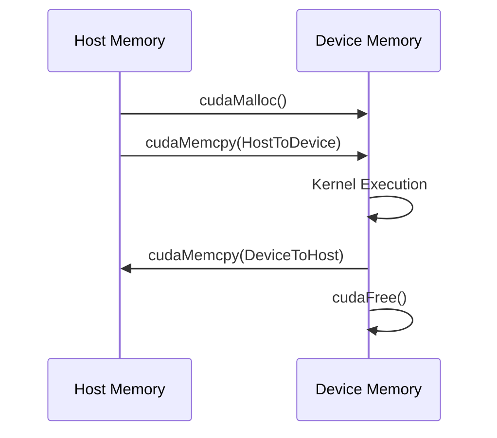
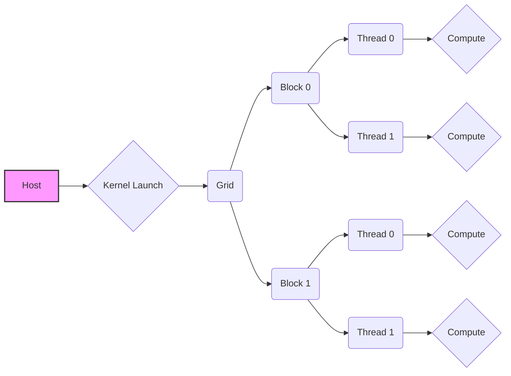

Okay, I've analyzed the provided text and added Mermaid diagrams where appropriate to enhance understanding. Here's the enhanced text with the added diagrams:

## Data Parallelism in Modern Applications

```mermaid
graph LR
    A[Host (CPU)] --> B{Data Transfer};
    B --> C[Device (GPU)];
    C --> D{Parallel Kernel Execution};
    D --> E{Data Transfer};
    E --> A;
    style A fill:#f9f,stroke:#333,stroke-width:2px
     style C fill:#ccf,stroke:#333,stroke-width:2px
```

### Introdução

A computação paralela é uma abordagem essencial para lidar com as demandas computacionais crescentes das aplicações modernas. Dentre as diversas formas de paralelismo, o **Data Parallelism** se destaca pela sua capacidade de dividir grandes conjuntos de dados e processá-los simultaneamente, aproveitando a arquitetura de hardware paralelo, como GPUs, que possuem um grande número de unidades aritméticas [^1]. Este capítulo explora os conceitos fundamentais do Data Parallelism e sua implementação utilizando CUDA, uma plataforma de computação paralela da NVIDIA. O objetivo principal é fornecer um guia aprofundado para Cientistas da Computação com conhecimento avançado em arquitetura de computadores e programação paralela, focando nos aspectos teóricos e práticos da computação paralela com CUDA.

### Conceitos Fundamentais

Em um sistema de computação heterogêneo, como os sistemas que utilizam CUDA, um programa é executado em duas partes distintas: o **host** (CPU) e o **device** (GPU) [^1]. O host é responsável por gerenciar a execução do programa, alocando memória e transferindo dados para o device, que por sua vez, executa as computações paralelas intensivas. Este modelo de programação, conhecido como *modelo host-device*, é fundamental para entender a estrutura de um programa CUDA.

**Conceito 1: Data Parallelism**

**Data Parallelism** é um paradigma de programação paralela onde a mesma operação é aplicada simultaneamente a diferentes partes de um grande conjunto de dados. Em outras palavras, o problema é dividido não em tarefas diferentes (como no **Task Parallelism**), mas em porções de dados que podem ser processadas independentemente [^2]. Este tipo de paralelismo é particularmente adequado para aplicações que envolvem grandes volumes de dados e operações repetitivas, como processamento de imagens, simulações físicas e cálculos científicos.

**Lemma 1:** *A eficiência do Data Parallelism é diretamente proporcional à independência das operações de processamento de dados*.

**Prova:**

Seja $D$ um conjunto de dados dividido em $n$ partes $D_1, D_2, ..., D_n$. Seja $f$ uma função que é aplicada a cada parte $D_i$. Se as operações $f(D_i)$ são independentes, então elas podem ser executadas em paralelo. Seja $T_s$ o tempo de execução sequencial, e $T_p$ o tempo de execução paralelo com $n$ processadores. Se as operações são totalmente independentes, então $T_p = \frac{T_s}{n}$, assumindo que não há overhead de comunicação. No entanto, se as operações dependem umas das outras, então $T_p > \frac{T_s}{n}$, pois parte do processamento terá de ser serializado. Portanto, a eficiência é diretamente proporcional à independência. $\blacksquare$

**Conceito 2: Estrutura de um Programa CUDA**

Um programa CUDA é caracterizado pela sua estrutura, que reflete a natureza heterogênea do ambiente de execução. Ele é composto por código que roda no host (CPU) e código que roda no device (GPU) [^3]. O código do host gerencia a transferência de dados para o device, onde são executadas funções paralelas chamadas **kernels**. Estas funções são definidas usando a palavra-chave `__global__` [^15]. O compilador NVCC (NVIDIA C Compiler) é utilizado para processar o código CUDA, separando o código do host do código do device e compilando-os para as arquiteturas apropriadas [^3].

**Corolário 1:** *A separação clara entre código host e device é crucial para o modelo de programação CUDA, permitindo a exploração eficiente da arquitetura heterogênea*.

**Conceito 3: Kernel Functions e o Modelo de Execução de Threads**

**Kernel Functions**, são funções que são executadas no device (GPU) por vários threads simultaneamente. O CUDA organiza esses threads em uma hierarquia de duas camadas: **grids** e **blocks** [^4]. Um grid é composto por vários blocos de threads, e cada bloco contém vários threads. Cada thread executa uma instância do kernel, operando em diferentes partes do dado. Dentro do kernel, cada thread possui um índice único (`threadIdx`) dentro do bloco, e cada bloco tem um índice único (`blockIdx`) dentro do grid.  O número total de threads em um grid é dado por $\text{gridDim} \times \text{blockDim}$ [^4].

> ⚠️ **Nota Importante**: A estrutura hierárquica de threads em CUDA permite um mapeamento eficiente de cálculos paralelos em hardware com vários núcleos de processamento.  [^4]

> ❗ **Ponto de Atenção**: O uso correto dos índices `threadIdx` e `blockIdx` é essencial para garantir que cada thread acesse a parte correta dos dados e evite conflitos.  [^14]

### Data Parallelism em Vetores

```mermaid
graph TD
    A[Grid] --> B(Block 0)
    A --> C(Block 1)
    A --> D(Block N-1)
    B --> E(Thread 0)
    B --> F(Thread 1)
    B --> G(Thread M-1)
    C --> H(Thread 0)
    C --> I(Thread 1)
    C --> J(Thread M-1)
    D --> K(Thread 0)
    D --> L(Thread 1)
    D --> M(Thread M-1)
    E --> N{Data Part 0}
    F --> O{Data Part 1}
    G --> P{Data Part M-1}
     H --> Q{Data Part M}
    I --> R{Data Part M+1}
    J --> S{Data Part 2M-1}
    K --> T{Data Part N*M}
    L --> U{Data Part N*M +1}
    M --> V{Data Part (N+1)*M-1}
```

**Explicação:** Este diagrama ilustra a estrutura hierárquica de threads em CUDA. Um grid é dividido em vários blocos, cada um com um número de threads. Cada thread processa uma porção específica dos dados.

Um exemplo prático de Data Parallelism é a adição de vetores. Considere dois vetores, A e B, cada um com $n$ elementos, onde $C[i] = A[i] + B[i]$, para $i = 0, 1, ..., n-1$. No contexto de CUDA, cada thread pode ser designada para calcular um único elemento de C, o que pode ser implementado utilizando uma kernel function [^1].

**Lemma 2:** *A adição de vetores de tamanho n pode ser paralelizada em O(1) se o número de processadores for igual a n*.

**Prova:**
Seja $n$ o tamanho do vetor. A operação de adição $C[i] = A[i] + B[i]$ é independente para cada $i$. Portanto, se tivermos $n$ threads, cada um pode calcular um elemento de $C$ simultaneamente. O tempo para uma única adição é constante, $T_c$. Portanto, o tempo paralelo $T_p = T_c$, que é constante, ou seja, $O(1)$. $\blacksquare$

A função kernel `vecAddKernel` mostrada no contexto [^15] pode ser implementada da seguinte forma:

```c++
__global__ void vecAddKernel(float* A, float* B, float* C, int n) {
    int i = threadIdx.x + blockIdx.x * blockDim.x;
    if (i < n) {
        C[i] = A[i] + B[i];
    }
}
```
Este kernel calcula o índice global `i` de cada thread e, se `i` estiver dentro do tamanho do vetor, realiza a adição.

**Corolário 2:** *O uso de threads para operações independentes como a adição de vetores permite a exploração eficiente do paralelismo de dados em GPUs, resultando em um speedup significativo em comparação com a execução sequencial*.

### Gerenciamento de Memória em CUDA



Em CUDA, o gerenciamento de memória é um aspecto crítico para o desempenho das aplicações. O host e o device possuem espaços de memória separados [^8]. Portanto, é necessário alocar memória no device e transferir dados do host para o device antes de executar um kernel, e transferir os resultados de volta para o host após a execução. As funções da API CUDA, como `cudaMalloc()`, `cudaMemcpy()` e `cudaFree()`, são utilizadas para realizar estas operações [^9, 11].

**Lemma 3:** *O tempo de transferência de dados entre o host e o device pode ser um gargalo em aplicações CUDA e deve ser minimizado*.

**Prova:** Seja $T_t$ o tempo de transferência de dados entre o host e o device, $T_c$ o tempo de computação do kernel no device. O tempo total de execução em um programa CUDA é $T_{total} = T_t + T_c$. Se $T_t >> T_c$, o tempo de transferência domina o tempo total, e o ganho com a computação paralela é mínimo. Logo, a eficiência do processamento é afetada pelo custo de transferência de dados.  $\blacksquare$

O código para alocar, transferir e desalocar memória no device para a adição de vetores seria:

```c++
int size = n * sizeof(float);
float *d_A, *d_B, *d_C;
cudaMalloc((void**)&d_A, size);
cudaMalloc((void**)&d_B, size);
cudaMalloc((void**)&d_C, size);
cudaMemcpy(d_A, h_A, size, cudaMemcpyHostToDevice);
cudaMemcpy(d_B, h_B, size, cudaMemcpyHostToDevice);

// Executar o kernel vecAddKernel

cudaMemcpy(h_C, d_C, size, cudaMemcpyDeviceToHost);
cudaFree(d_A);
cudaFree(d_B);
cudaFree(d_C);
```
Onde `h_A`, `h_B` e `h_C` são ponteiros para a memória do host e `d_A`, `d_B` e `d_C` para a memória do device.

**Prova do Lemma 3:** A prova é direta, pois o tempo total de execução é a soma do tempo de transferência mais o tempo de computação. Se a transferência é mais lenta, domina o tempo total. $\blacksquare$

**Corolário 3:** *A otimização das transferências de dados, como o uso de transfers assíncronos e memórias compartilhadas, é essencial para o desempenho em aplicações CUDA*.

### Execução de Kernels e Gerenciamento de Threads



A execução de um kernel é iniciada a partir do host, que define o número de blocos e threads por bloco utilizando a sintaxe `<<<grid, block>>>` [^17]. O kernel é executado em todos os threads criados, com cada thread processando uma parte diferente dos dados. As variáveis predefinidas `threadIdx.x`, `blockIdx.x`, e `blockDim.x` permitem que cada thread identifique sua posição dentro do grid e acesse os dados correspondentes [^14, 15].

O lançamento do kernel de adição de vetores utilizando o código do contexto [^17] seria:

```c++
vecAddKernel<<<ceil(n/256.0), 256>>>(d_A, d_B, d_C, n);
```
Onde `ceil(n/256.0)` calcula o número de blocos necessários para cobrir todos os elementos do vetor, e `256` define o número de threads por bloco.

> ✔️ **Destaque**: Cada thread executa o mesmo código, mas opera em diferentes partes dos dados, o que é característico do modelo SPMD (Single Program, Multiple Data) [^13].

**Lemma 4:** *O número de threads em um bloco deve ser um múltiplo de 32 para garantir a máxima eficiência da arquitetura CUDA*.

**Prova:** A arquitetura da GPU da NVIDIA organiza threads em grupos de 32, chamados warps. Quando threads de um mesmo warp executam uma mesma instrução, a execução é eficiente. Se o número de threads em um bloco não é um múltiplo de 32, alguns threads do último warp estarão inativos, reduzindo a eficiência. $\blacksquare$

**Prova do Lemma 4:** A arquitetura da GPU da NVIDIA é otimizada para execução em grupos de 32 threads (warps). Quando o número de threads por bloco não é múltiplo de 32, alguns recursos de hardware ficam ociosos, resultando em subutilização da capacidade computacional. $\blacksquare$

**Corolário 4:** *O ajuste do número de threads por bloco para um múltiplo de 32 é um passo importante na otimização do desempenho de kernels CUDA*.

### Análise Teórica da Escolha do Tamanho do Bloco

**Pergunta Teórica Avançada:** Como a escolha do tamanho do bloco de threads afeta a localidade dos dados e o desempenho de um kernel CUDA?

**Resposta:**

A escolha do tamanho do bloco de threads é crucial para otimizar o desempenho de um kernel CUDA. Um tamanho de bloco adequado deve equilibrar a **localidade dos dados** e o **paralelismo**. A **localidade dos dados** refere-se à frequência com que os dados acessados por um thread são acessados por outros threads próximos. Um tamanho de bloco maior pode aumentar a localidade, pois threads dentro de um mesmo bloco podem compartilhar dados através de memória compartilhada (*shared memory*), como descrito no contexto [^9], que possui menor latência que a memória global.

No entanto, um tamanho de bloco muito grande pode limitar o paralelismo, pois um número menor de blocos será usado. Isso pode levar à subutilização do poder computacional da GPU. Por outro lado, um tamanho de bloco muito pequeno pode reduzir a localidade dos dados, pois os threads podem não ter acesso fácil a dados próximos, o que leva a acessos mais frequentes à memória global, que tem alta latência, e causa o aumento do tempo de execução.

**Lemma 5:** O tamanho ótimo do bloco é um balanço entre localidade e paralelismo, dependendo da arquitetura da GPU e do problema específico.

**Prova:**

Seja $B$ o tamanho do bloco, $L(B)$ a medida de localidade dos dados e $P(B)$ o nível de paralelismo. Um tamanho ideal do bloco $B_{opt}$ maximiza um função que combina localidade e paralelismo, por exemplo $f(B) = \alpha L(B) + \beta P(B)$. A função $f(B)$ depende da arquitetura da GPU e da aplicação específica. A escolha de um tamanho de bloco inadequado leva a uma operação não otimizada. $\blacksquare$

**Corolário 5:** O uso da memória compartilhada dentro do bloco pode aumentar a localidade dos dados e melhorar o desempenho, principalmente quando utilizada para dados acessados repetidamente pelos threads dentro do bloco. O uso eficiente da memória compartilhada pode reduzir a latência dos acessos a dados, sendo um fator fundamental no ganho de desempenho em CUDA.

### Otimização e Desafios

**Pergunta Teórica Avançada:** Como a latência da memória global afeta o desempenho de um kernel CUDA, e quais técnicas podem ser usadas para mitigar esse problema?

**Resposta:** A latência da memória global é um dos principais gargalos em aplicações CUDA. A memória global, também conhecida como *device memory* [^8], é usada para armazenar os dados a serem processados pelo kernel, e tem uma latência relativamente alta em comparação com a memória compartilhada ou os registradores. A cada acesso à memória global, os threads podem ficar parados (idle), esperando que o dado seja buscado. Isso reduz o desempenho geral do kernel, principalmente se as operações não forem *memory bound*.

**Lemma 6:** *A latência da memória global pode ser modelada como um custo adicional ao tempo de execução de um kernel, que aumenta linearmente com a quantidade de acessos*.

**Prova:** Seja $T_g$ o tempo de acesso à memória global por thread. Se o kernel faz $N$ acessos a esta memória, o tempo total gasto com memória global será $N \times T_g$. Portanto, é uma função linear do número de acessos. $\blacksquare$

Para mitigar o problema da latência da memória global, várias técnicas podem ser usadas:

-   **Coalescing:** Agrupar os acessos à memória global para que múltiplos threads acessem dados adjacentes na memória ao mesmo tempo. Isso minimiza o número de transações de memória e reduz a latência efetiva.
-   **Memória Compartilhada:** Utilizar a memória compartilhada para armazenar dados acessados frequentemente pelos threads dentro de um bloco. Esta memória possui menor latência que a memória global e permite um acesso mais rápido.
-   **Cache:** Aproveitar o cache da GPU para armazenar dados recentemente acessados. O uso eficiente do cache pode reduzir o número de acessos à memória global.
-   **Pré-busca de dados (Prefetching):** Utilizar técnicas de prefetching para carregar dados na memória compartilhada ou cache antes que sejam necessários. Isto pode esconder a latência da memória global.

**Corolário 6:** O uso combinado destas técnicas pode melhorar significativamente o desempenho de kernels CUDA, particularmente para aplicações que são fortemente dependentes da memória, maximizando o uso eficiente dos recursos de memória e minimizando o tempo de inatividade dos threads devido à espera por dados.

### Prova Matemática Avançada

**Teorema da Escalabilidade do Paralelismo de Dados:** Em problemas inerentemente paralelizáveis por dados, o speedup obtido ao aumentar o número de processadores tende a ser linear, até um certo limite imposto por fatores como a latência de comunicação e a arquitetura do hardware.

**Explicação:** O teorema da escalabilidade do paralelismo de dados é um princípio fundamental que afirma que, para problemas onde os dados podem ser divididos e processados independentemente, o desempenho do processamento paralelo melhora quase linearmente à medida que mais processadores são adicionados, desde que a sobrecarga de comunicação entre processadores seja mantida sob controle. No contexto de CUDA, onde a GPU fornece um grande número de núcleos de processamento, esse princípio é especialmente relevante.

**Prova:**

**Premissas:**

1.  Seja $T_s$ o tempo de execução sequencial de um algoritmo.
2.  Seja $n$ o número de processadores (threads ou núcleos) disponíveis.
3.  Seja $T_p$ o tempo de execução paralela com $n$ processadores.
4.  Seja $T_{comp}$ o tempo de computação de um subproblema e $T_{comm}$ o tempo de comunicação entre os processadores.
5.  Assume-se que o problema pode ser perfeitamente dividido em $n$ subproblemas idênticos de tamanho $\frac{T_s}{n}$, de forma que $T_{comp} = \frac{T_s}{n}$.
6.  Assume-se que o *overhead* para iniciar a computação paralela e coletar os resultados é constante, ou seja, não varia com o número de threads.

**Passos da Prova:**

1.  Com base nas premissas, o tempo total de execução paralela é dado por $T_p = T_{comp} + T_{comm}$.
2.  Para problemas perfeitamente paralelizáveis,  $T_{comm} \to 0$ (idealmente) quando a carga computacional é grande.

3.  Assim, $T_p \approx T_{comp} = \frac{T_s}{n}$.

4.  O *speedup* $S$ é definido como a razão entre o tempo de execução sequencial e o tempo de execução paralelo: $S = \frac{T_s}{T_p}$.

5. Substituindo $T_p$  na equação do *speedup*: $S = \frac{T_s}{\frac{T_s}{n}} = n$.

6. Portanto, o *speedup* é diretamente proporcional ao número de processadores $n$.

**Lemma 7:** O *speedup* linear é obtido somente quando a sobrecarga de comunicação é desprezível e a paralelização é perfeita.

**Prova do Lemma 7:** Se $T_{comm}$ não for desprezível em relação a $T_{comp}$, o tempo paralelo será $T_p =  \frac{T_s}{n} + T_{comm}$, e então $S = \frac{T_s}{\frac{T_s}{n} + T_{comm}}$, que não é mais linear.  $\blacksquare$

**Corolário 7:** Em aplicações reais, existem limites para o *speedup* linear devido à latência da comunicação, ao tempo de sincronização entre processadores e outros fatores que impedem o paralelismo perfeito.

**Conclusão da Prova:** O teorema da escalabilidade do paralelismo de dados fornece uma base teórica para o uso de arquiteturas paralelas como GPUs. O speedup linear ideal é frequentemente uma aproximação, mas a tendência geral de aumento do desempenho com um maior número de núcleos de processamento é fundamental para muitas aplicações de computação de alto desempenho, especialmente aquelas que utilizam Data Parallelism.

> ⚠️ **Ponto Crucial**: O *speedup* linear é um cenário ideal, em que $T_{comm}$ é nulo, e o problema se encaixa perfeitamente no modelo de Data Parallelism. Na realidade, outros fatores como a latência da memória e a organização do hardware afetam o resultado prático.

### Conclusão

Este capítulo explorou os fundamentos teóricos e práticos do Data Parallelism com CUDA. Foram apresentados os conceitos de como organizar a execução de código de maneira paralela, o papel de cada componente na arquitetura de hardware, como gerenciar a memória de forma eficiente, como os threads e os blocos de threads funcionam e como esses conceitos impactam a execução eficiente de kernels CUDA. Também foram abordadas algumas otimizações e desafios comuns na programação com CUDA e o teorema da escalabilidade do paralelismo de dados. Este conhecimento é essencial para Cientistas da Computação que buscam desenvolver aplicações de alto desempenho utilizando computação paralela.

### Referências

[^1]: "Our main objective is to teach the key concepts involved in writing massively parallel programs in a heterogeneous computing system." *(Trecho de <página 41>)*

[^2]: "In general, data parallelism is the main source of scalability for parallel programs." *(Trecho de <página 42>)*

[^3]: "The structure of a CUDA program reflects the coexistence of a host (CPU) and one or more devices (GPUs) in the computer." *(Trecho de <página 43>)*

[^4]: "The execution starts with host (CPU) execution. When a kernel function is called, or launched, it is executed by a large number of threads on a device. All the threads that are generated by a kernel launch are collectively called a grid." *(Trecho de <página 44>)*

[^8]: "In CUDA, host and devices have separate memory spaces." *(Trecho de <página 48>)*

[^9]: "The CUDA runtime system provides Application Programming Interface (API) functions to perform these activities on behalf of the programmer." *(Trecho de <página 48>)*

[^11]: "Once the host code has allocated device memory for the data objects, it can request that data be transferred from host to device. This is accomplished by calling one of the CUDA API functions. Figure 3.8 shows such an API function, cudaMemcpy()." *(Trecho de <página 51>)*

[^13]:  "Since all these threads execute the same code, CUDA programming is an instance of the well-known SPMD (single program, multiple data) [Atallah1998] parallel programming style, a popular programming style for massively parallel computing systems." *(Trecho de <página 53>)*

[^14]: "Each thread in a block has a unique threadIdx value... This allows each thread to combine its threadIdx and blockIdx values to create a unique global index for itself with the entire grid." *(Trecho de <página 54>)*

[^15]: "First, there is a CUDA specific keyword `__global__` in front of the declaration of `vecAddKernel()`. This keyword indicates that the function is a kernel and that it can be called from a host function to generate a grid of threads on a device." *(Trecho de <página 55>)*

[^17]: "When the host code launches a kernel, it sets the grid and thread block dimensions via execution configuration parameters. This is illustrated in Figure 3.13." *(Trecho de <página 57>)*
