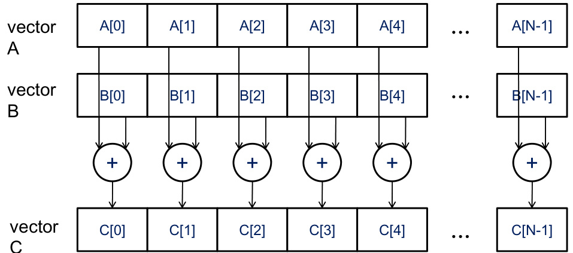

## Data Parallelism e Escalabilidade em Arquiteturas CUDA

### Introdução

A programação em CUDA (Compute Unified Device Architecture) explora o poder de processamento paralelo das GPUs (Graphics Processing Units) para acelerar aplicações computacionalmente intensivas. Uma das estratégias fundamentais para alcançar esse objetivo é o **data parallelism**, que consiste em dividir os dados de um problema em porções menores e processá-las simultaneamente em múltiplos núcleos de processamento. Este capítulo se dedicará ao exame detalhado do data parallelism, focando em como ele permite a utilização eficiente de processadores massivamente paralelos e como a escalabilidade das aplicações se beneficia da evolução constante do hardware.

### Conceitos Fundamentais

**Data parallelism** é uma forma de paralelismo onde a mesma operação é aplicada simultaneamente a múltiplos elementos de um conjunto de dados [^2]. Em outras palavras, o problema é decomposto em subproblemas independentes, cada um trabalhando sobre uma porção distinta dos dados. Essa abordagem é particularmente eficaz em GPUs, que são projetadas para realizar a mesma instrução em muitos dados ao mesmo tempo (Single Instruction, Multiple Data - SIMD).

A **escalabilidade** de programas paralelos, frequentemente, depende do data parallelism [^2]. À medida que os conjuntos de dados aumentam, a capacidade de utilizar processadores massivamente paralelos torna-se crucial para manter o desempenho. Sem data parallelism, o desempenho da aplicação pode estagnar ou até mesmo diminuir com o aumento do tamanho dos dados, devido à sobrecarga de comunicação e sincronização entre os núcleos.

A eficácia do data parallelism está intrinsecamente ligada à capacidade de decompor um problema em subproblemas independentes que podem ser executados simultaneamente [^2]. Um problema que pode ser facilmente dividido dessa forma é considerado *data-parallel friendly*. Exemplos clássicos incluem operações em vetores e matrizes, processamento de imagens e simulações físicas onde cada elemento do domínio pode ser atualizado independentemente dos demais.

Para ilustrar o conceito, considere a adição de dois vetores  $A$ e $B$ de tamanho $N$, resultando em um vetor $C$. Em uma abordagem serial, cada elemento $C[i]$ é calculado sequencialmente:

$$
C[i] = A[i] + B[i] \quad \text{for } i = 0, 1, ..., N-1
$$

Em uma abordagem data-parallel, cada elemento $C[i]$ pode ser calculado simultaneamente por um thread CUDA diferente. Isso pode ser implementado alocando um thread para cada elemento do vetor ou, em casos onde o número de elementos é muito grande, alocando múltiplos threads para cada bloco de dados, com cada thread processando uma parte do bloco.

A escolha da granularidade do data parallelism (ou seja, o tamanho da porção de dados processada por cada thread) é crucial para o desempenho. Se a granularidade for muito fina (pouco trabalho por thread), a sobrecarga de gerenciamento de threads pode dominar o tempo de execução. Se a granularidade for muito grossa (muito trabalho por thread), o paralelismo pode ser limitado, e alguns núcleos podem ficar ociosos.

### Conclusão

O data parallelism é uma técnica essencial na programação CUDA para GPUs, permitindo a exploração máxima do paralelismo massivo oferecido por essas arquiteturas. A capacidade de decompor problemas em subproblemas independentes e a escolha adequada da granularidade são fatores determinantes para a eficiência e escalabilidade das aplicações. Ao otimizar o data parallelism, é possível criar aplicações que se beneficiam do aumento do poder de processamento das GPUs a cada nova geração de hardware.

### Referências
[^2]: Data parallelism allows for efficient utilization of massively parallel processors, enabling application performance to scale with each generation of hardware that offers more execution resources. The scalability of parallel programs often relies on data parallelism. As data sets grow, the ability to utilize massively parallel processors becomes crucial for maintaining performance. The effectiveness of data parallelism is tied to the ability to decompose a problem into independent subproblems that can be executed simultaneously.
<!-- END -->