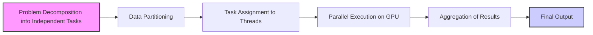
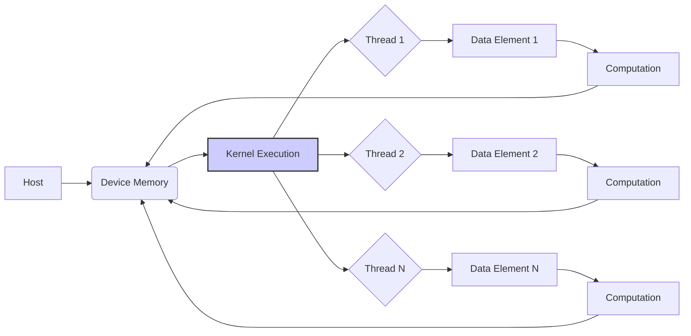
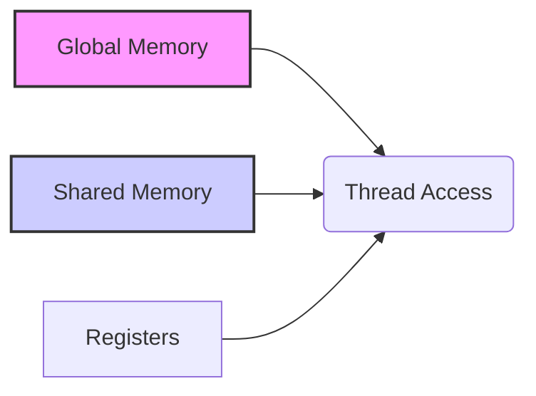

## Independent Evaluation as Basis of Data Parallelism in CUDA



### Introdução

O **Data Parallelism**, como discutido no capítulo anterior, é uma técnica fundamental para o desenvolvimento de aplicações de alto desempenho em computação paralela. A essência desta técnica reside na capacidade de executar a mesma operação em múltiplas partes de um conjunto de dados, de forma simultânea e independente. Esta independência de avaliação é o que permite o escalonamento eficiente do processamento e o aproveitamento da capacidade massiva de paralelismo oferecida pelas GPUs através da arquitetura CUDA [^1, 2]. Este capítulo aprofunda o conceito de **avaliação independente** como base para Data Parallelism, explorando sua aplicação em cenários práticos e as implicações para o desempenho em CUDA, sempre baseado no contexto fornecido.

### Avaliação Independente: A Base do Data Parallelism

A **avaliação independente** é um princípio que estabelece que cada operação sobre uma parte dos dados pode ser realizada sem depender dos resultados das operações realizadas sobre as outras partes. Em outras palavras, não há dependências entre os cálculos realizados em diferentes segmentos dos dados. Esta propriedade é crucial para o Data Parallelism, pois permite que diferentes threads executem seus cálculos simultaneamente, sem a necessidade de sincronização ou comunicação excessiva [^2].

**Conceito 1: Independência e Paralelismo**

A relação entre independência e paralelismo é direta: quanto maior a independência das operações, maior o potencial de paralelização. Em aplicações que modelam fenômenos físicos ou processam grandes volumes de dados, muitas vezes é possível identificar operações que podem ser realizadas de forma independente sobre diferentes partes dos dados. Por exemplo, no processamento de imagens, cada pixel pode ser processado independentemente dos outros; em simulações de dinâmica de fluidos, o cálculo das forças atuando em diferentes pontos do fluido podem ser realizados simultaneamente [^2].

**Lemma 1:** A independência das operações é condição necessária para a aplicação eficiente do Data Parallelism.

**Prova:** Se existirem dependências entre as operações sobre os dados, a execução paralela de todos os threads pode produzir resultados incorretos ou ser significativamente atrasada devido à necessidade de sincronização e comunicação entre os threads. Sejam as operações $O_1, O_2, \dots, O_n$. Se $O_i$ depende do resultado de $O_j$, não é possível executar as duas operações simultaneamente. Portanto, a independência é uma condição necessária para a aplicação eficiente do Data Parallelism. $\blacksquare$

**Conceito 2: Identificação de Áreas de Paralelização**

A identificação das áreas de paralelização em uma aplicação é um passo fundamental para aplicar Data Parallelism. Em geral, aplicações que operam sobre grandes conjuntos de dados, como vetores, matrizes e imagens, são boas candidatas para Data Parallelism. A chave é encontrar as operações que podem ser aplicadas a cada elemento ou grupo de elementos independentemente. A aplicação de operações matemáticas, lógicas e transformações são exemplos comuns de operações que podem ser paralelizadas utilizando esta abordagem [^2].

**Corolário 1:** A capacidade de identificar operações independentes dentro de um problema é fundamental para a aplicação eficaz do Data Parallelism, e este é o primeiro passo para determinar um modelo de programação paralela utilizando CUDA.

### Aplicação em Kernels CUDA


**Explicação:** Este diagrama de fluxo mostra como cada thread processa um elemento de dados de forma independente durante a execução de um kernel CUDA.

No contexto de CUDA, a avaliação independente é realizada através da execução de **kernel functions**. Cada thread executa uma instância do kernel sobre diferentes partes dos dados, seguindo o modelo SPMD (Single Program Multiple Data). As variáveis predefinidas `threadIdx` e `blockIdx` são usadas para calcular o índice de cada thread e garantir que cada thread acesse a parte correta dos dados [^14, 15]. A função `vecAddKernel` apresentada anteriormente é um exemplo clássico de como este tipo de avaliação independente pode ser implementada [^15].

**Lemma 2:** A estrutura do kernel CUDA, juntamente com os índices de threads, garante que cada thread realize cálculos independentes sobre um elemento ou grupo de elementos.

**Prova:** No kernel CUDA, o índice de cada thread é computado a partir das variáveis `threadIdx`, `blockIdx`, e `blockDim`. Este índice é utilizado para acessar um elemento específico do vetor, matriz, ou outro conjunto de dados. A lógica do kernel é desenhada de forma que não existam dependências diretas entre os cálculos realizados por threads diferentes, a não ser pela escrita no mesmo índice em memória compartilhada ou global, nesse caso a dependência é de escrita para memória compartilhada ou global, não nos dados em si. Assim, cada thread trabalha independentemente nas suas partes de dados. $\blacksquare$

A aplicação da avaliação independente pode ser ilustrada com o exemplo da adição de vetores do contexto [^2, 15], onde cada thread calcula a soma de um par de elementos de dois vetores. O código do kernel utiliza o índice global para acessar os elementos corretos, como exemplificado no trecho abaixo:

```c++
__global__ void vecAddKernel(float* A, float* B, float* C, int n) {
    int i = threadIdx.x + blockIdx.x * blockDim.x;
    if (i < n) {
        C[i] = A[i] + B[i];
    }
}
```
Cada thread processa um elemento único de C, com base em seus índices de threads `threadIdx.x` e `blockIdx.x`, sem depender do trabalho de outros threads, demonstrando o princípio da avaliação independente.

**Corolário 2:** O uso eficiente de variáveis predefinidas e índices de threads permite que os kernels CUDA implementem a avaliação independente de forma eficiente, maximizando o paralelismo e evitando a necessidade de sincronização entre threads em cada thread do mesmo bloco.

### Memória e Independência


**Explicação:** Este diagrama de grafo ilustra os diferentes níveis de memória acessíveis por threads CUDA, destacando a hierarquia de acesso e uso.

A utilização eficiente da hierarquia de memória em CUDA é crucial para garantir o desempenho do Data Parallelism. Embora o conceito de avaliação independente signifique que os cálculos em cada thread sejam independentes, a gestão do acesso à memória é fundamental para o desempenho. A memória global (device memory) é usada para armazenar os dados de entrada e saída dos kernels [^8], enquanto a memória compartilhada é utilizada para permitir a comunicação rápida e o compartilhamento de dados entre threads do mesmo bloco.

**Conceito 3: Memória Global e Memória Compartilhada**

A memória global é acessível por todos os threads na GPU, mas tem alta latência e menor taxa de transferência de dados [^9]. A memória compartilhada é uma área de memória menor e mais rápida, que é compartilhada entre threads dentro do mesmo bloco [^9]. A memória compartilhada possui latência muito menor que a memória global, o que a torna ideal para a troca de dados entre os threads do mesmo bloco. Para garantir a máxima eficiência, os acessos à memória global devem ser *coalesced* para reduzir o número de transações de memória, o que se consegue com threads de um warp acessando dados adjacentes em memória global.

**Lemma 3:** O uso eficiente da hierarquia de memória, incluindo a minimização de acessos à memória global e o aproveitamento da memória compartilhada para dados compartilhados, é essencial para alcançar o máximo desempenho com Data Parallelism.

**Prova:** A memória global tem uma alta latência e um baixo *bandwidth* comparada com a memória compartilhada e os registradores. Cada acesso à memória global tem um custo alto para cada thread, levando a espera por dados e ociosidade dos processadores. Minimizar o uso de acessos à memória global e usar a memória compartilhada para dados que são acessados por vários threads dentro de um bloco reduz a latência total da execução do kernel.  $\blacksquare$

A independência da avaliação dos threads permite a utilização de técnicas como o *tiling*, onde partes dos dados são movidas para a memória compartilhada antes de serem processadas, maximizando a localidade dos dados e reduzindo o número de acessos à memória global.

**Prova do Lemma 3:** Para maximizar a eficiência do Data Parallelism, é preciso minimizar a latência de acesso aos dados. A memória compartilhada permite a troca rápida de dados entre threads do mesmo bloco, o que leva a um menor custo de leitura e escrita comparado com a memória global. $\blacksquare$

**Corolário 3:** O conhecimento da hierarquia de memória em CUDA permite aos desenvolvedores explorar a avaliação independente de forma eficiente, organizando o acesso à memória para minimizar a latência e maximizar a taxa de transferência, maximizando o desempenho dos kernels.

### Estratégias de Otimização para Avaliação Independente

**Pergunta Teórica Avançada:** Como a escolha do tamanho do bloco e a organização dos acessos à memória afetam a localidade dos dados e a independência da avaliação em kernels CUDA?

**Resposta:** A escolha do tamanho do bloco e a organização dos acessos à memória têm um impacto direto na localidade dos dados e na independência da avaliação. Como discutido anteriormente, o tamanho do bloco influencia o grau de paralelismo e a capacidade de compartilhamento de dados na memória compartilhada [^17].

**Lemma 4:** O tamanho do bloco deve ser escolhido de forma a equilibrar o paralelismo e a localidade dos dados.

**Prova:** Se o tamanho do bloco for muito pequeno, haverá um grande número de blocos e pouco compartilhamento de dados. Se o tamanho for muito grande, haverá menos blocos e poderá não haver paralelismo suficiente para executar eficientemente a tarefa. O tamanho ótimo depende do problema específico, bem como das características do hardware. $\blacksquare$

A organização dos acessos à memória também é importante para a localidade e independência. O ideal é organizar o acesso aos dados de forma que threads do mesmo warp acessem dados adjacentes na memória global (coalesced access), e dados acessados repetidamente por um mesmo bloco sejam armazenados na memória compartilhada, melhorando o *bandwidth* e reduzindo a latência.

**Prova do Lemma 4:** O número de threads por bloco afeta o nível de paralelismo e o uso da memória compartilhada. Blocos pequenos podem não utilizar a memória compartilhada eficientemente, e blocos grandes podem limitar o número de blocos executando simultaneamente, o que reduz o paralelismo.  $\blacksquare$

**Corolário 4:** A análise cuidadosa da aplicação, da arquitetura da GPU e dos padrões de acesso à memória é essencial para otimizar a localidade dos dados e garantir a eficiência da avaliação independente, através da escolha correta do tamanho do bloco e da organização dos acessos à memória.

### Desafios e Limitações

**Pergunta Teórica Avançada:** Quais são os principais desafios para garantir a avaliação independente em aplicações complexas, e como eles podem ser abordados?

**Resposta:** Apesar do poder do Data Parallelism, alguns desafios surgem ao garantir a avaliação independente em aplicações complexas. Um dos principais desafios é lidar com dependências de dados, que exigem sincronização e comunicação entre threads. Nesses casos, estratégias como o uso de memória compartilhada para comunicação e técnicas de sincronização como *atomic operations* podem ser usadas para mitigar o impacto dessas dependências.

**Lemma 5:** Dependências de dados podem limitar o paralelismo e a independência da avaliação.

**Prova:** Se uma operação $O_i$ depende do resultado de uma operação $O_j$, a operação $O_i$ não pode ser executada até que a operação $O_j$ seja concluída. Isso introduz uma dependência de dados que limita o paralelismo. A sincronização, nesse caso, é necessária e induz custos que afetam a execução paralela. $\blacksquare$

Outro desafio é garantir o balanceamento de carga entre os threads, onde alguns threads podem ter mais trabalho do que outros. Técnicas como *dynamic scheduling* e *load balancing* podem ser usadas para distribuir o trabalho de maneira mais uniforme entre os threads. Finalmente, a portabilidade de código pode ser um problema, já que a arquitetura de GPUs pode variar, e otimizações específicas podem não ser aplicáveis em todas as arquiteturas.

**Prova do Lemma 5:**  As dependências de dados levam a sincronização e ociosidade de alguns threads até que os dados dependentes se tornem disponíveis, reduzindo o ganho de desempenho do processamento paralelo. $\blacksquare$

**Corolário 5:** O uso de técnicas avançadas de sincronização, balanceamento de carga e design de código que considere a portabilidade são essenciais para superar os desafios da avaliação independente e garantir o máximo desempenho em aplicações complexas.

### Conclusão

A avaliação independente é um pilar fundamental do Data Parallelism, permitindo que os cálculos em diferentes partes dos dados sejam realizados simultaneamente e sem dependência, maximizando o uso eficiente dos recursos paralelos oferecidos pela arquitetura CUDA. Este capítulo detalhou como este princípio se aplica ao desenvolvimento de kernels CUDA e os seus impactos no gerenciamento da memória e na execução paralela, ressaltando a importância de balancear o paralelismo e a localidade. A escolha correta do tamanho do bloco, a otimização do acesso à memória e o uso eficiente da memória compartilhada são cruciais para maximizar o desempenho em aplicações que utilizam Data Parallelism, e o conhecimento da arquitetura e programação em CUDA, juntamente com a aplicação do conceito de avaliação independente, é essencial para o desenvolvimento de aplicações de alto desempenho.

### Referências

[^1]:  "Our main objective is to teach the key concepts involved in writing massively parallel programs in a heterogeneous computing system." *(Trecho de <página 41>)*

[^2]: "Such independent evaluation is the basis of data parallelism in these applications." *(Trecho de <página 42>)*

[^8]: "In CUDA, host and devices have separate memory spaces." *(Trecho de <página 48>)*

[^9]: "The CUDA runtime system provides Application Programming Interface (API) functions to perform these activities on behalf of the programmer." *(Trecho de <página 48>)*

[^14]: "Each thread in a block has a unique threadIdx value... This allows each thread to combine its threadIdx and blockIdx values to create a unique global index for itself with the entire grid." *(Trecho de <página 54>)*

[^15]: "First, there is a CUDA specific keyword `__global__` in front of the declaration of `vecAddKernel()`. This keyword indicates that the function is a kernel and that it can be called from a host function to generate a grid of threads on a device." *(Trecho de <página 55>)*

[^17]: "When the host code launches a kernel, it sets the grid and thread block dimensions via execution configuration parameters. This is illustrated in Figure 3.13." *(Trecho de <página 57>)*
