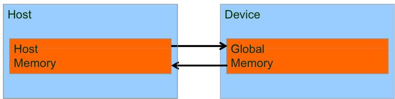

## Data Parallelism: The Cornerstone of Scalable GPU Programming

### Introdução

No contexto da programação CUDA e da exploração do poder computacional das GPUs, o **paralelismo de dados** emerge como um paradigma fundamental para alcançar alta performance e escalabilidade. Diferentemente do **paralelismo de tarefas**, onde diversas tarefas independentes são distribuídas entre os processadores, o paralelismo de dados concentra-se em executar a mesma operação em múltiplos elementos de dados simultaneamente. Este capítulo explorará em profundidade o conceito de paralelismo de dados, sua importância na programação CUDA e como ele se diferencia e complementa o paralelismo de tarefas [^3].

### Conceitos Fundamentais

**Paralelismo de Dados**

O paralelismo de dados é uma forma de paralelismo que distribui os dados por múltiplos processadores, permitindo que cada processador execute a mesma operação em sua porção dos dados simultaneamente [^3]. Este modelo é particularmente adequado para GPUs, que possuem uma arquitetura massivamente paralela projetada para processar grandes volumes de dados de forma eficiente.

A principal característica do paralelismo de dados é que a mesma instrução é aplicada a múltiplos dados simultaneamente. Isso contrasta com o paralelismo de tarefas, onde diferentes instruções são aplicadas a diferentes dados [^3].

**Contraste com Paralelismo de Tarefas**

O paralelismo de tarefas, por outro lado, envolve a decomposição de uma aplicação em tarefas independentes que podem ser executadas concorrentemente. Enquanto o paralelismo de dados busca paralelizar operações sobre os dados, o paralelismo de tarefas se concentra na execução simultânea de diferentes partes de um programa [^3].

Embora o paralelismo de dados seja frequentemente a principal fonte de escalabilidade, o paralelismo de tarefas pode ser utilizado de forma complementar para otimizar o desempenho. Por exemplo, em uma aplicação de processamento de vídeo, o paralelismo de dados pode ser usado para aplicar filtros a cada frame, enquanto o paralelismo de tarefas pode ser usado para processar diferentes frames simultaneamente.

**Implementação com CUDA Streams**

CUDA streams oferecem um mecanismo para gerenciar o paralelismo de tarefas em aplicações CUDA [^3]. Um stream é uma sequência de operações que são executadas em ordem. Diferentes streams podem ser executados simultaneamente, permitindo a sobreposição de operações de computação e transferência de dados.

Ao utilizar CUDA streams, é possível criar múltiplas tarefas independentes e agendá-las para execução em diferentes streams. Isso permite explorar o paralelismo de tarefas, especialmente em aplicações onde as tarefas possuem dependências mínimas entre si.

**Escalabilidade e Abundância de Dados**

O paralelismo de dados é, em geral, a principal fonte de escalabilidade para programas paralelos devido à abundância de dados disponíveis para processamento paralelo [^3]. Em muitas aplicações, o volume de dados a serem processados é muito grande, tornando o paralelismo de dados a abordagem mais eficiente para acelerar a execução.

A escalabilidade do paralelismo de dados depende da capacidade de dividir os dados em porções menores e distribuí-las entre os processadores. Em GPUs, a grande quantidade de cores permite uma divisão granular dos dados, resultando em alta escalabilidade.

**Exemplo Ilustrativo**

Considere a operação de somar dois vetores `A` e `B` de tamanho `N` para gerar um vetor resultante `C`. Em uma abordagem sequencial, cada elemento de `C` seria calculado iterativamente:

```
for (int i = 0; i < N; ++i) {
  C[i] = A[i] + B[i];
}
```

Em um cenário de paralelismo de dados, essa operação pode ser realizada simultaneamente em múltiplos elementos. Cada thread (ou grupo de threads) calcularia uma parte do vetor resultante. Em CUDA, isso seria mapeado para um kernel executado em um grid de threads, onde cada thread calcularia um ou mais elementos de `C`.


O seguinte código CUDA ilustra a implementação do paralelismo de dados para a soma de vetores:

```c++
__global__ void vectorAdd(float *A, float *B, float *C, int N) {
  int i = blockIdx.x * blockDim.x + threadIdx.x;
  if (i < N) {
    C[i] = A[i] + B[i];
  }
}

int main() {
  int N = 1024;
  float *A, *B, *C, *d_A, *d_B, *d_C;

  // Alocação de memória na CPU
  A = (float*)malloc(N * sizeof(float));
  B = (float*)malloc(N * sizeof(float));
  C = (float*)malloc(N * sizeof(float));

  // Inicialização dos vetores A e B (exemplo)
  for (int i = 0; i < N; ++i) {
    A[i] = (float)i;
    B[i] = (float)(N - i);
  }

  // Alocação de memória na GPU
  cudaMalloc((void**)&d_A, N * sizeof(float));
  cudaMalloc((void**)&d_B, N * sizeof(float));
  cudaMalloc((void**)&d_C, N * sizeof(float));

  // Transferência dos dados da CPU para a GPU
  cudaMemcpy(d_A, A, N * sizeof(float), cudaMemcpyHostToDevice);
  cudaMemcpy(d_B, B, N * sizeof(float), cudaMemcpyHostToDevice);

  // Configuração do grid e bloco
  int blockSize = 256;
  int numBlocks = (N + blockSize - 1) / blockSize;

  // Chamada do kernel
  vectorAdd<<<numBlocks, blockSize>>>(d_A, d_B, d_C, N);

  // Transferência dos resultados da GPU para a CPU
  cudaMemcpy(C, d_C, N * sizeof(float), cudaMemcpyDeviceToHost);

  // Verificação dos resultados (exemplo)
  for (int i = 0; i < N; ++i) {
    printf("C[%d] = %f\n", i, C[i]);
  }

  // Liberação de memória
  free(A);
  free(B);
  free(C);
  cudaFree(d_A);
  cudaFree(d_B);
  cudaFree(d_C);

  return 0;
}
```

Neste exemplo, o kernel `vectorAdd` é executado por um grid de threads. Cada thread calcula um elemento do vetor `C`. A configuração do grid e do bloco determina o número de threads que serão executadas em paralelo.  A função `cudaMemcpy` é utilizada para transferir os dados entre a CPU e a GPU.





### Conclusão

O paralelismo de dados é uma técnica essencial para explorar o poder computacional das GPUs. Ao distribuir os dados entre múltiplos processadores e executar a mesma operação em paralelo, é possível obter ganhos significativos de desempenho em diversas aplicações. Embora o paralelismo de tarefas possa complementar o paralelismo de dados, este último é frequentemente a principal fonte de escalabilidade em programas paralelos devido à abundância de dados disponíveis para processamento [^3]. O entendimento e a aplicação correta do paralelismo de dados são cruciais para o desenvolvimento de aplicações CUDA eficientes e escaláveis.  A utilização de CUDA Streams permite também incorporar o paralelismo de tarefas, otimizando ainda mais o desempenho geral da aplicação.

### Referências
[^3]: Data parallelism contrasts with task parallelism, where different tasks are distributed across processors. However, data parallelism is generally the main source of scalability for parallel programs due to the abundance of data available for parallel processing. Task parallelism can complement data parallelism in achieving performance goals. While data parallelism focuses on parallelizing operations across data, task parallelism involves decomposing an application into independent tasks that can be executed concurrently. CUDA streams can be used to manage task parallelism.
<!-- END -->