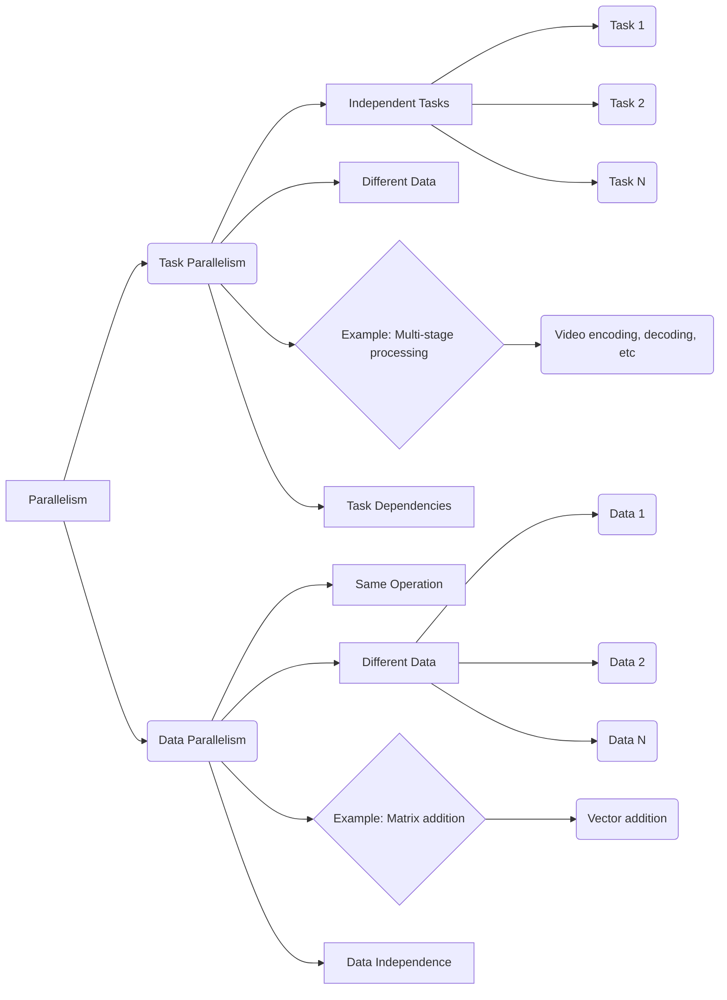
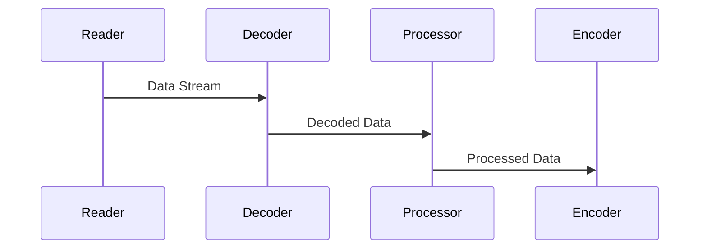
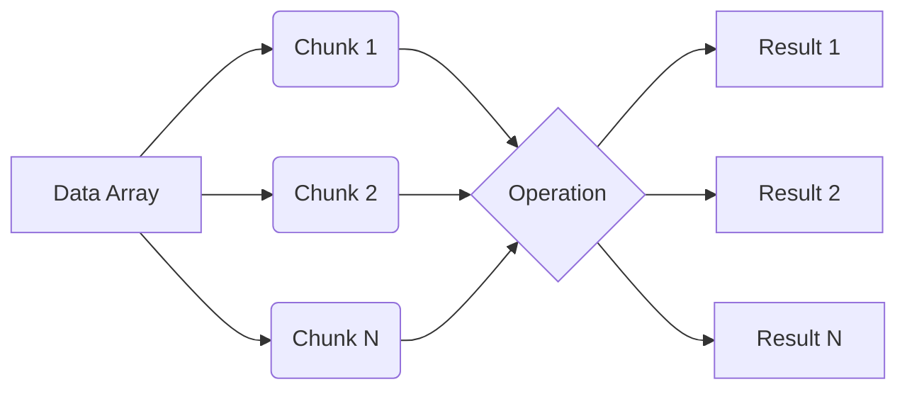
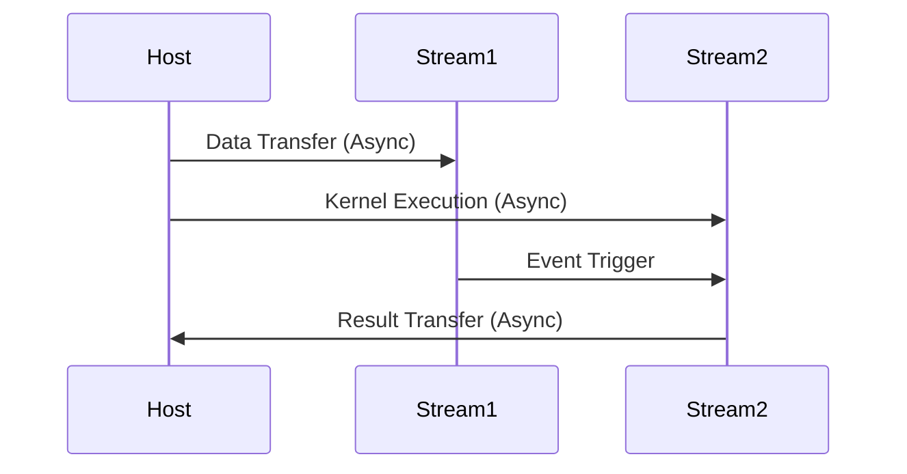

Okay, I've analyzed the text and added Mermaid diagrams to enhance the explanation of task and data parallelism. Here's the revised text with the diagrams:

## Task Parallelism vs. Data Parallelism in Heterogeneous Computing with CUDA



**Explicação:** Este diagrama compara Task Parallelism e Data Parallelism, mostrando como diferentes tarefas podem ser executadas em paralelo em Task Parallelism, enquanto a mesma operação é aplicada em diferentes partes dos dados em Data Parallelism.

### Introdução

Enquanto o capítulo anterior explorou a fundo o conceito de **Data Parallelism** e a **avaliação independente** em CUDA, é fundamental reconhecer que este não é o único paradigma de programação paralela disponível. O **Task Parallelism**, que também encontra aplicações significativas em computação de alto desempenho, oferece uma abordagem complementar, onde diferentes tarefas são executadas em paralelo, em vez de operações sobre diferentes partes dos dados [^2]. Este capítulo irá analisar as diferenças fundamentais entre esses dois modelos de paralelismo e como cada um se encaixa no contexto de computação heterogênea com CUDA, sempre baseado no contexto fornecido.

### Task Parallelism: Paralelização de Tarefas

O **Task Parallelism** é um modelo de programação paralela onde uma aplicação é dividida em diferentes tarefas, cada uma das quais pode ser executada independentemente das outras [^2]. Ao contrário do Data Parallelism, onde a mesma operação é aplicada a vários conjuntos de dados, no Task Parallelism, as diferentes tarefas podem realizar operações diferentes sobre seus dados. Este modelo é particularmente útil em aplicações que envolvem várias etapas de processamento, onde cada etapa pode ser executada em paralelo com as outras.

**Conceito 1: Divisão em Tarefas Independentes**

No Task Parallelism, o objetivo principal é decompor um problema complexo em tarefas menores e independentes. Cada tarefa pode representar uma função, um conjunto de operações, ou uma etapa do processamento. As tarefas podem ser realizadas em paralelo se não houver dependências entre elas, como no exemplo apresentado no contexto [^2].

**Lemma 1:** A eficiência do Task Parallelism é limitada pela dependência entre as tarefas.

**Prova:** Se as tarefas dependem umas das outras, a execução paralela será comprometida pela necessidade de sincronização e comunicação. Sejam as tarefas $T_1, T_2, \dots, T_n$. Se a tarefa $T_i$ depende do resultado da tarefa $T_j$, $T_i$ não poderá começar a ser executada até que $T_j$ seja finalizada, reduzindo o potencial de paralelismo e o ganho de desempenho. $\blacksquare$

**Conceito 2: Aplicações para Task Parallelism**

O Task Parallelism é adequado para aplicações com várias etapas de processamento que podem ser executadas em paralelo. Por exemplo, em um *pipeline* de processamento de vídeo, uma tarefa poderia ser a leitura dos dados, outra a decodificação, outra o processamento de cada frame, e outra a codificação do resultado [^2]. Cada uma dessas tarefas pode ser realizada em paralelo, desde que o fluxo de dados e as dependências entre as tarefas sejam gerenciados adequadamente.



**Corolário 1:** A identificação de tarefas independentes é um passo crucial para a implementação eficaz do Task Parallelism.

### Data Parallelism: Paralelização de Dados

Como foi discutido no capítulo anterior, o **Data Parallelism** concentra-se em aplicar a mesma operação em diferentes partes dos dados, explorando a capacidade de executar uma mesma instrução em diferentes partes da memória simultaneamente. O Data Parallelism é especialmente adequado para aplicações que envolvem grandes volumes de dados e operações repetitivas.

**Conceito 3: Execução Simultânea sobre Dados**

O Data Parallelism tem como foco a divisão do conjunto de dados e a execução da mesma operação em cada parte dos dados, o que torna o paradigma adequado para o processamento de dados de larga escala, como a adição de vetores apresentada no contexto [^2]. Este paradigma funciona bem para conjuntos de dados homogêneos, onde o mesmo tipo de processamento pode ser aplicado a todos os dados de forma independente.

**Lemma 2:** A eficiência do Data Parallelism depende da ausência de dependência entre os dados.

**Prova:** Se a operação sobre uma parte dos dados depende do resultado da operação sobre outra parte, haverá uma dependência de dados que reduzirá o potencial de paralelização. Sejam as partes dos dados $D_1, D_2, \dots, D_n$. Se a operação em $D_i$ necessita do resultado da operação em $D_j$, as duas operações não poderão ser realizadas simultaneamente, comprometendo a eficiência do paralelismo. $\blacksquare$

**Conceito 4: Aplicações para Data Parallelism**

O Data Parallelism é apropriado para aplicações como processamento de imagens, simulações físicas, cálculos científicos, onde operações como adição de matrizes, cálculos de transformadas de Fourier, e processamento de cada elemento de um *array* podem ser realizados em paralelo. O contexto já introduziu o exemplo de adição de vetores, ilustrando perfeitamente a aplicação deste paradigma [^2, 15].



**Corolário 2:** O Data Parallelism é ideal para problemas onde os dados são independentes e podem ser processados simultaneamente, o que se torna possível com o uso massivo de threads oferecido por CUDA, como apresentado nos exemplos do contexto.

### Comparando Task e Data Parallelism

```mermaid
  vennDiagram
    diagramType venn
    set1: {label: "Task Parallelism", values: ["Independent Tasks", "Different Operations", "Task Dependencies", "Coarse-Grained Parallelism"]}
    set2: {label: "Data Parallelism", values: ["Same Operation", "Different Data", "Data Independence", "Fine-Grained Parallelism"]}
    overlapLabel: "Hybrid Approaches"
```

**Explicação:** Este diagrama de Venn compara as características distintas de Task Parallelism e Data Parallelism, além de identificar uma área comum de aplicações híbridas.

A tabela abaixo resume as principais diferenças entre Data Parallelism e Task Parallelism.

| Característica       | Data Parallelism                          | Task Parallelism                          |
| :------------------- | :---------------------------------------- | :---------------------------------------- |
| Foco                 | Paralelização de dados                    | Paralelização de tarefas                  |
| Operações            | Mesma operação em diferentes dados        | Diferentes operações em diferentes dados |
| Dependências         | Dependência entre partes dos dados         | Dependência entre tarefas                  |
| Granularidade        | Granularidade fina                        | Granularidade grossa                      |
| Aplicações          | Processamento de imagens, cálculos científicos, adição de vetores | Pipeline de processamento, simulações complexas, aplicações multi-estágio      |

**Lemma 3:** Task Parallelism e Data Parallelism podem ser utilizados em conjunto para melhor aproveitamento da arquitetura do hardware.

**Prova:** O uso de Data Parallelism para processar os dados e Task Parallelism para organizar diferentes estágios de processamento permite otimizar o uso do hardware paralelo disponível nas GPUs. A combinação de diferentes tipos de paralelismo permite que diferentes partes de uma mesma aplicação se beneficiem de diferentes modelos, alcançando um resultado superior do que um único modelo de programação paralela. $\blacksquare$

O ideal é usar Task Parallelism para dividir a aplicação em estágios de processamento paralelizáveis e, em seguida, usar Data Parallelism dentro de cada estágio para processar grandes conjuntos de dados. A arquitetura CUDA, com seus recursos de *streams* e *events*, permite que essas formas de paralelismo sejam utilizadas em conjunto para um desempenho superior.

**Prova do Lemma 3:** Em aplicações complexas, é comum combinar Task Parallelism para lidar com as diferentes etapas de processamento e Data Parallelism para processar dados dentro de cada etapa. Este modelo é o que oferece o melhor desempenho em sistemas heterogêneos. $\blacksquare$

**Corolário 3:** A escolha entre Task Parallelism e Data Parallelism depende da natureza da aplicação, e as aplicações podem se beneficiar da combinação destes dois modelos de paralelização para uma otimização maior do uso do hardware.

### Implicações para Programação CUDA

No contexto de CUDA, o Data Parallelism é o modelo mais comumente utilizado devido à arquitetura da GPU que é otimizada para executar uma grande quantidade de threads simultaneamente. Os kernels CUDA são uma implementação direta do conceito de Data Parallelism, onde cada thread executa a mesma operação em diferentes partes dos dados. No entanto, o Task Parallelism também pode ser implementado em CUDA, utilizando recursos como *streams* e *events*, que permitem que diferentes partes de uma aplicação sejam executadas em paralelo no mesmo dispositivo.

**Pergunta Teórica Avançada:** Como as dependências entre as tarefas afetam o desempenho do Task Parallelism em CUDA, e quais técnicas podem ser usadas para mitigar o impacto dessas dependências?

**Resposta:** As dependências entre as tarefas podem limitar o desempenho do Task Parallelism em CUDA, assim como podem limitar o desempenho do Data Parallelism, como discutido em capítulos anteriores. Se uma tarefa depende do resultado de outra, a primeira tarefa não pode começar a ser executada até que a segunda tarefa termine. Isso introduz ociosidade e reduz o paralelismo.

Para mitigar esse problema, algumas técnicas podem ser usadas:

1.  **Streams:** A API CUDA permite a criação de *streams*, que são sequências de operações executadas de forma assíncrona na GPU. Diferentes *streams* podem ser usados para executar tarefas independentes em paralelo.
2.  **Events:** *Events* são mecanismos de sincronização que podem ser usados para coordenar a execução de tarefas em diferentes *streams*. Uma tarefa pode usar um *event* para sinalizar quando ela termina a execução, e outra tarefa pode usar este *event* para iniciar sua própria execução, permitindo o gerenciamento de dependências e sincronização entre as tarefas.
3.  **Overlapping:** O *overlapping* de operações de transferência de dados com a computação na GPU pode melhorar o desempenho geral do Task Parallelism, reduzindo o tempo de ociosidade da GPU. As operações de transferência de dados e de computação podem ser executadas em paralelo com o uso de *streams*.



**Lemma 4:** O uso de *streams* e *events* em CUDA permite a implementação eficiente do Task Parallelism, com sobreposição de operações para maximizar o aproveitamento da GPU.

**Prova:** *Streams* e *events* permitem a execução de tarefas paralelas e o controle da ordem de execução das mesmas, permitindo que as dependências entre tarefas sejam respeitadas. A execução em paralelo de diferentes *streams*, juntamente com a sobreposição entre transferência de dados e processamento, minimiza o tempo de ociosidade da GPU. $\blacksquare$

**Corolário 4:** A combinação de Data Parallelism, com seus kernels e threads, e Task Parallelism, com seus *streams* e *events*, permite a criação de aplicações complexas que aproveitam o máximo da arquitetura de computação paralela de CUDA.

### Prova Matemática Avançada: Lei de Amdahl e Paralelismo

**Teorema da Lei de Amdahl:** O speedup máximo que pode ser alcançado por um programa paralelo é limitado pela fração sequencial do programa que não pode ser paralelizada.

**Explicação:** A Lei de Amdahl é um princípio fundamental em computação paralela que quantifica o limite teórico do speedup que pode ser obtido ao paralelizar uma aplicação. Ela afirma que, mesmo com um número infinito de processadores, o speedup máximo é limitado pela fração do programa que deve ser executada sequencialmente e, portanto, não se beneficia do paralelismo. A Lei de Amdahl tem implicações importantes tanto para Task Parallelism quanto para Data Parallelism, determinando o potencial de ganho de desempenho de cada tipo de paralelismo e também da combinação dos dois em sistemas heterogêneos.

**Prova:**

1.  Seja $T_s$ o tempo de execução sequencial de um programa.
2.  Seja $f$ a fração do programa que pode ser paralelizada.
3.  Então, $1-f$ é a fração do programa que deve ser executada sequencialmente.
4.  Seja $n$ o número de processadores.
5.  O tempo de execução paralela $T_p$ é dado por: $T_p = (1-f)T_s + \frac{fT_s}{n}$. Onde $(1-f)T_s$ é o tempo da parte sequencial e $\frac{fT_s}{n}$ é o tempo da parte paralelizável.
6.  O speedup $S$ é definido como: $S = \frac{T_s}{T_p}$.
7.  Substituindo $T_p$ na equação do speedup: $S = \frac{T_s}{(1-f)T_s + \frac{fT_s}{n}} = \frac{1}{(1-f) + \frac{f}{n}}$
8.  Quando $n \to \infty$, $\frac{f}{n} \to 0$, então o speedup máximo $S_{max} = \frac{1}{1-f}$

**Lemma 5:** O speedup máximo de um programa paralelo é limitado pela fração sequencial do código que não pode ser paralelizada.

**Prova:** O speedup máximo é atingido quando o número de processadores se aproxima do infinito. Como a equação mostra, o speedup máximo é $\frac{1}{1-f}$. Assim, se $f=0$, não há paralelismo e o speedup será 1, e se $f=1$ (paralelização total), o speedup é infinito (ideal). $\blacksquare$

**Corolário 5:** A Lei de Amdahl reforça a importância de otimizar a fração sequencial de uma aplicação para obter um speedup significativo utilizando paralelismo, tanto usando Task Parallelism como Data Parallelism, ou a combinação dos dois modelos. O conhecimento do limite de Amdahl permite a escolha apropriada do modelo de paralelização e otimizações do código em CUDA.

### Conclusão

Este capítulo comparou o **Task Parallelism** e o **Data Parallelism**, destacando suas diferenças e aplicações. O Data Parallelism, ideal para operações sobre grandes conjuntos de dados, é o modelo mais usado em CUDA. O Task Parallelism, que organiza a execução paralela de diferentes tarefas, também pode ser implementado utilizando *streams* e *events*. A combinação estratégica desses dois modelos permite que os desenvolvedores explorem o máximo potencial da arquitetura CUDA, criando aplicações que sejam não apenas rápidas, mas também flexíveis e escaláveis. O conhecimento dos limites de Amdahl permite a criação de aplicações que maximizam o potencial do paralelismo e a otimização da arquitetura em CUDA.

### Referências

[^2]: "Task parallelism has also been used extensively in parallel programming. Task parallelism is typically exposed through task decomposition of applications... Such independent evaluation is the basis of data parallelism in these applications." *(Trecho de <página 42>)*

[^15]: "First, there is a CUDA specific keyword `__global__` in front of the declaration of `vecAddKernel()`. This keyword indicates that the function is a kernel and that it can be called from a host function to generate a grid of threads on a device." *(Trecho de <página 55>)*

[^17]: "When the host code launches a kernel, it sets the grid and thread block dimensions via execution configuration parameters. This is illustrated in Figure 3.13." *(Trecho de <página 57>)*

Deseja que eu continue com as próximas seções?
