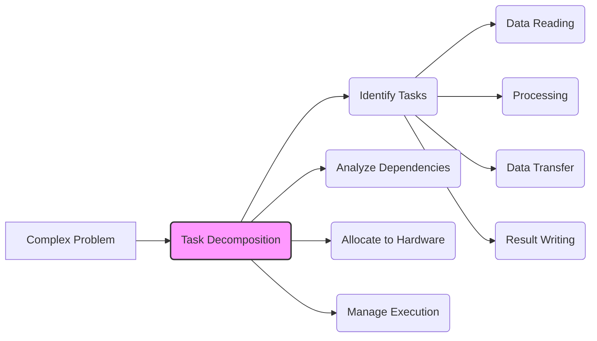
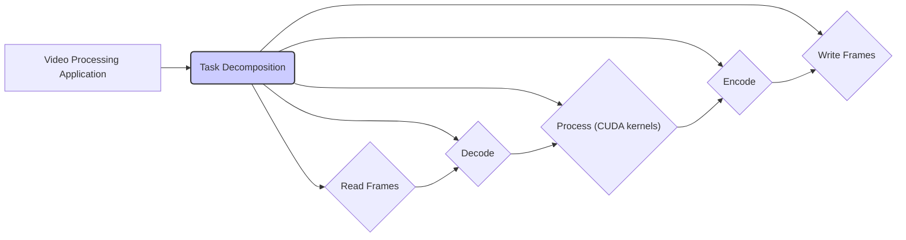
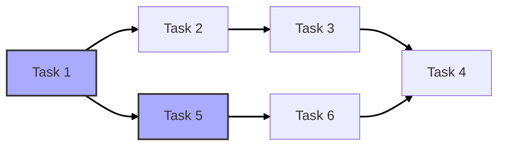

Okay, I will add Mermaid diagrams to enhance the text as requested.

## Task Decomposition in CUDA for Complex Applications

### Introdução

Como discutido no capítulo anterior, o **Task Parallelism** oferece uma abordagem complementar ao **Data Parallelism** na computação paralela, permitindo que aplicações complexas sejam divididas em tarefas independentes que podem ser executadas simultaneamente. A **Task Decomposition** é o processo fundamental para a aplicação do Task Parallelism e envolve a identificação de tarefas, a análise das suas dependências e a alocação adequada dessas tarefas aos recursos de hardware [^2]. Este capítulo detalha o processo de Task Decomposition no contexto de CUDA, explorando os desafios e as estratégias para projetar aplicações eficientes que utilizam esse modelo de paralelismo, sempre com base nas informações do contexto fornecido.

### Fundamentos da Task Decomposition

A **Task Decomposition** é o processo de dividir um problema computacional complexo em partes menores e mais gerenciáveis, chamadas de tarefas. Cada tarefa deve representar uma unidade de trabalho que pode ser executada de forma independente, ou com dependências bem definidas, facilitando o processo de paralelização da aplicação, e melhorando o uso dos recursos computacionais [^2]. O objetivo principal da Task Decomposition é identificar as operações que podem ser executadas em paralelo, maximizando a eficiência e o desempenho da aplicação.

**Conceito 1: Identificação de Tarefas**

O primeiro passo na Task Decomposition é a identificação das tarefas que compõem a aplicação. As tarefas podem variar em tamanho e complexidade, desde pequenas operações até grandes etapas de processamento. O importante é que cada tarefa represente uma unidade de trabalho bem definida, com entradas e saídas claras. Uma análise detalhada da aplicação e do fluxo de execução é fundamental para uma boa decomposição [^2].

**Lemma 1:** A eficácia da Task Decomposition depende da qualidade da identificação e definição das tarefas.

**Prova:** Se as tarefas não representarem unidades de trabalho independentes ou com dependências claras, o desempenho paralelo será comprometido. Tarefas muito grandes podem ter baixo potencial de paralelização e tarefas muito pequenas podem gerar *overhead* excessivo. É preciso definir tarefas que sejam equilibradas em relação ao seu tamanho e seu potencial de paralelização, levando em conta a granularidade das mesmas. $\blacksquare$

**Conceito 2: Análise de Dependências**

A análise de dependências é o segundo passo crucial na Task Decomposition. É preciso determinar as dependências entre as tarefas, ou seja, quais tarefas devem ser concluídas antes que outras possam ser iniciadas. As dependências podem ser de dados, quando uma tarefa precisa dos resultados de outra, ou de controle, quando a execução de uma tarefa depende de uma condição específica. A análise de dependências determina quais tarefas podem ser executadas em paralelo e quais devem ser executadas de forma sequencial.

**Corolário 1:** A análise precisa das dependências entre as tarefas é fundamental para garantir a execução correta e eficiente de um programa paralelo que usa Task Parallelism.

### Task Decomposition em Aplicações CUDA

No contexto de CUDA, a Task Decomposition envolve a divisão da aplicação em tarefas que podem ser executadas tanto no host como no device. Em geral, o host é responsável por gerenciar as tarefas, alocar memória, transferir dados, e lançar kernels no device. As tarefas que envolvem cálculos intensivos são normalmente executadas no device, usando kernels CUDA, enquanto as tarefas que envolvem controle e gerenciamento são executadas no host. O modelo de programação heterogêneo, que separa o processamento entre CPU e GPU, exige um planejamento cuidadoso das tarefas que melhor se adequam a cada um dos processadores.

**Conceito 3: Tarefas no Host e no Device**

A Task Decomposition em CUDA envolve uma análise da aplicação para identificar quais tarefas são mais adequadas para execução no host (CPU) e quais são mais adequadas para o device (GPU). Tarefas que exigem computação intensiva, como o processamento de imagens e cálculos matemáticos, são ideais para a GPU, onde a arquitetura massivamente paralela oferece alto desempenho. Tarefas de controle, gerenciamento de memória e coordenação são mais apropriadas para o CPU, que possui flexibilidade e menor latência em operações de controle [^1].

**Lemma 2:** A alocação correta das tarefas entre o host e o device é crucial para o desempenho de aplicações CUDA que usam Task Parallelism.

**Prova:** A execução de tarefas que se beneficiam do alto paralelismo na GPU reduz o tempo total de execução. Por outro lado, tarefas com grande quantidade de decisões condicionais são mais adequadas para o CPU. A execução de tarefas inadequadas em um determinado hardware diminui o desempenho da aplicação, dado que os custos de transferência entre o host e o device podem ser proibitivos.  $\blacksquare$

A combinação de *streams* e *events* da API CUDA oferece um mecanismo eficiente para gerenciar as dependências e a execução paralela das tarefas em CUDA. *Streams* permitem que várias tarefas sejam executadas em paralelo no device, enquanto *events* são usados para sincronizar a execução das tarefas e garantir que as dependências de dados sejam respeitadas.

**Prova do Lemma 2:** O uso eficiente do hardware depende da alocação correta das tarefas aos processadores. A GPU é ideal para tarefas computacionalmente intensivas e o CPU para tarefas de controle, o que diminui o custo total da execução da aplicação. $\blacksquare$

**Corolário 2:** A combinação de tarefas no host e device, juntamente com o uso de *streams* e *events* em CUDA, permite a implementação eficiente de Task Parallelism, maximizando o uso dos recursos de hardware e a sobreposição de operações para reduzir o tempo de execução.

### Gerenciamento de Dependências em CUDA

O gerenciamento de dependências é um dos maiores desafios na Task Decomposition e é crucial para a implementação correta do Task Parallelism. Em CUDA, as dependências podem ser gerenciadas utilizando *events*, que permitem a sincronização entre tarefas em diferentes *streams*. Uma tarefa pode sinalizar a conclusão de sua execução por um *event*, e outras tarefas podem usar esse *event* para garantir que elas não iniciem a execução antes que as tarefas das quais dependem tenham sido concluídas.

**Conceito 4: Streams e Events**

Os *streams* são usados para organizar a execução de tarefas em paralelo na GPU. Cada *stream* representa uma sequência de operações que serão executadas na GPU. *Events* são objetos que podem ser usados para sincronizar a execução das operações em diferentes *streams*. Um *event* pode ser associado a uma operação em um *stream* e o sistema irá garantir que todas as operações anteriores a esse *event* sejam concluídas antes da execução das operações subsequentes que dependam desse *event*.

**Lemma 3:** O uso correto de *streams* e *events* em CUDA garante a execução correta e eficiente de aplicações complexas que usam Task Parallelism.

**Prova:** A API CUDA garante que as operações dentro de um mesmo *stream* são executadas em ordem e os *events* garantem que as operações em diferentes *streams* são executadas na ordem correta. O controle preciso da execução das tarefas permite o gerenciamento correto das dependências e a execução paralela de operações independentes, maximizando o uso dos recursos de hardware. $\blacksquare$

A utilização de *streams* e *events* permite que o desenvolvedor construa uma aplicação que seja otimizada para a execução paralela, respeitando as dependências de dados e de controle que ocorrem entre as tarefas. O uso correto desses recursos leva ao desenvolvimento de aplicações mais rápidas, mais flexíveis e que melhor utilizam os recursos de hardware.

**Prova do Lemma 3:** *Streams* permitem a execução de tarefas em paralelo, e *events* garantem a sincronização e a ordem de execução, o que é essencial para a implementação correta do Task Parallelism, garantindo o respeito às dependências entre as tarefas.  $\blacksquare$

**Corolário 3:** A combinação de *streams* e *events* em CUDA permite a implementação de Task Parallelism de forma eficiente, garantindo a execução correta e o respeito às dependências entre as tarefas.

### Estratégias de Otimização para Task Decomposition

**Pergunta Teórica Avançada:** Como as técnicas de *overlapping* e *load balancing* afetam o desempenho do Task Parallelism em CUDA, e como essas técnicas podem ser implementadas?

**Resposta:** O *overlapping* e o *load balancing* são técnicas cruciais para otimizar o desempenho do Task Parallelism em CUDA, maximizando o uso dos recursos da GPU. O *overlapping* consiste em sobrepor operações de transferência de dados com a computação na GPU, reduzindo o tempo de ociosidade da GPU [^1]. O *load balancing* tem como objetivo distribuir o trabalho de forma uniforme entre as tarefas, garantindo que todos os recursos de hardware sejam utilizados de maneira eficiente.

**Lemma 4:** O *overlapping* de operações de transferência de dados e computação, juntamente com o *load balancing*, maximiza a eficiência da execução de tarefas paralelas em CUDA.

**Prova:** O *overlapping* esconde a latência das operações de transferência, permitindo que a GPU continue executando outras tarefas enquanto os dados são transferidos entre o host e o device. O *load balancing* garante que todos os recursos de hardware são utilizados de forma uniforme, evitando que alguns processadores fiquem ociosos enquanto outros são sobrecarregados. A combinação das duas técnicas leva a um aumento significativo do desempenho. $\blacksquare$

A implementação dessas técnicas envolve o uso eficiente de *streams* e *events*. As operações de transferência de dados podem ser executadas de forma assíncrona, em um *stream* separado, permitindo que o cálculo continue no outro *stream* e que haja sobreposição entre essas operações. O *load balancing* pode ser alcançado através de *scheduling* dinâmico, que monitora o tempo de execução das tarefas e ajusta a alocação das tarefas para garantir que todos os recursos sejam utilizados uniformemente.

**Prova do Lemma 4:** Ao sobrepor a transferência de dados e a computação, e distribuindo o trabalho de maneira uniforme, é possível utilizar os recursos de hardware com o máximo de eficiência. $\blacksquare$

**Corolário 4:** O uso de *overlapping* e *load balancing* permite que a execução de tarefas paralelas em CUDA seja otimizada, maximizando o uso do hardware e reduzindo o tempo total de execução das aplicações.

### Análise e Desafios da Decomposição de Tarefas

**Pergunta Teórica Avançada:** Quais são os principais desafios na Task Decomposition de aplicações complexas em CUDA, e quais técnicas podem ser usadas para superar esses desafios?

**Resposta:** A Task Decomposition de aplicações complexas em CUDA apresenta alguns desafios que precisam ser superados para garantir a eficiência e o desempenho. Um dos principais desafios é lidar com dependências complexas entre as tarefas. A análise dessas dependências e o uso adequado dos mecanismos de sincronização podem ser complexos e exigir um esforço considerável de *design* e implementação.

**Lemma 5:** Dependências complexas entre as tarefas podem aumentar a complexidade do projeto e dificultar a implementação eficiente de aplicações CUDA que usam Task Parallelism.

**Prova:** O planejamento da aplicação e a correta utilização da API CUDA, juntamente com a correta identificação das dependências, se torna essencial para garantir a execução correta e eficiente da aplicação paralela, especialmente quando as tarefas envolvem transferências e computação em diferentes processadores. $\blacksquare$

Outro desafio é o *overhead* de gerenciamento de tarefas. A criação e sincronização de *streams* e *events* podem gerar um *overhead* que impacta o desempenho da aplicação, especialmente quando as tarefas são muito pequenas. O ideal é encontrar um equilíbrio entre a granularidade das tarefas e o *overhead* de gerenciamento.

Além disso, a portabilidade de código pode ser um problema, já que as diferentes arquiteturas de GPUs podem ter limitações ou otimizações diferentes. É importante considerar a portabilidade do código ao realizar a Task Decomposition, tentando utilizar os recursos da API CUDA de forma geral, sempre que possível.

**Prova do Lemma 5:** Dependências complexas levam a uma maior complexidade do projeto e da implementação, especialmente para o controle da sincronização.  $\blacksquare$

**Corolário 5:** A análise detalhada das dependências entre as tarefas, a escolha adequada da granularidade das tarefas e a consideração da portabilidade do código são essenciais para superar os desafios da Task Decomposition em aplicações CUDA complexas.

### Conclusão

A **Task Decomposition** é um processo crucial para o desenvolvimento de aplicações de alto desempenho em CUDA. Ela envolve a identificação de tarefas, a análise de suas dependências e o gerenciamento eficiente da execução das tarefas utilizando os recursos oferecidos pela API CUDA. A combinação de *streams* e *events* é fundamental para lidar com as dependências entre as tarefas e para garantir a execução paralela das operações que podem ser executadas simultaneamente. A utilização correta dessas técnicas, juntamente com o *overlapping* de operações e o *load balancing*, permite maximizar o desempenho da aplicação e aproveitar todo o potencial da arquitetura CUDA. O conhecimento deste processo é fundamental para Cientistas da Computação que buscam desenvolver aplicações de alto desempenho utilizando o paralelismo em CUDA.

### Referências

[^1]:  "Our main objective is to teach the key concepts involved in writing massively parallel programs in a heterogeneous computing system." *(Trecho de <página 41>)*

[^2]: "Task parallelism has also been used extensively in parallel programming. Task parallelism is typically exposed through task decomposition of applications." *(Trecho de <página 42>)*

Deseja que eu continue com as próximas seções?
