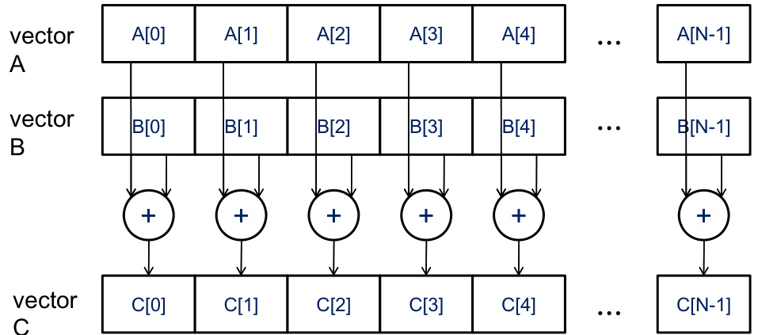

## Data Parallelism: Vector Addition in CUDA

### Introdução
A programação CUDA (Compute Unified Device Architecture) aproveita a capacidade de processamento paralelo das GPUs (Graphics Processing Units) para acelerar aplicações computacionalmente intensivas. Um dos paradigmas fundamentais da programação CUDA é o **data parallelism**, onde a mesma operação é aplicada simultaneamente a múltiplos elementos de dados. Este capítulo explora o conceito de data parallelism através de um exemplo clássico: a adição de vetores [^4]. A adição de vetores ilustra de forma clara como um algoritmo pode ser estruturado para se adequar ao modelo de execução data-paralela, essencial para o aproveitamento máximo das capacidades de uma GPU.

### Conceitos Fundamentais
A **adição de vetores** é uma operação básica onde, dados dois vetores *A* e *B* de tamanho *n*, o vetor soma *C* é obtido somando os elementos correspondentes de *A* e *B*. Matematicamente, isso é expresso como:

$$C[i] = A[i] + B[i], \quad \text{para } i = 0, 0, ..., n-1$$

O ponto crucial é que cada cálculo de $C[i]$ é independente dos demais. Isso significa que a computação de cada elemento do vetor *C* pode ser executada *concorrentemente*. No contexto da programação CUDA, essa independência é explorada alocando cada elemento do vetor *C* a um thread diferente, permitindo que a soma seja calculada em paralelo.

**Implementação Data-Paralela em CUDA:**

Para implementar a adição de vetores em CUDA utilizando data parallelism, os seguintes passos são geralmente seguidos:

1.  **Alocação de Memória:** Alocar memória na GPU para os vetores de entrada *A* e *B*, e para o vetor de saída *C*. Isso envolve a utilização de funções CUDA como `cudaMalloc`.

2.  **Transferência de Dados:** Transferir os dados dos vetores *A* e *B* da memória do host (CPU) para a memória da GPU. Funções como `cudaMemcpy` são usadas para essa finalidade.

3.  **Definição do Kernel CUDA:** Criar um kernel CUDA que execute a operação de adição para um único elemento do vetor. Cada thread executará este kernel para calcular um único elemento de *C*. O índice `i` do elemento a ser calculado pode ser determinado pelo `threadIdx.x`, `blockIdx.x` e `blockDim.x`.

4.  **Lançamento do Kernel:** Lançar o kernel CUDA com um número de threads igual ao tamanho dos vetores. A organização dos threads em blocos também é um fator importante para otimizar o desempenho.

5.  **Transferência dos Resultados:** Transferir o vetor resultante *C* da memória da GPU de volta para a memória do host.

**Exemplo Simplificado:**

Suponha que temos dois vetores, *A* = \[1, 2, 3, 4] e *B* = \[5, 6, 7, 8]. O vetor soma *C* seria *C* = \[6, 8, 10, 12]. No CUDA, cada thread calcularia um elemento de *C*:

*   Thread 0:  $C[0] = A[0] + B[0] = 1 + 5 = 6$
*   Thread 1:  $C[1] = A[1] + B[1] = 2 + 6 = 8$
*   Thread 2:  $C[2] = A[2] + B[2] = 3 + 7 = 10$
*   Thread 3:  $C[3] = A[3] + B[3] = 4 + 8 = 12$

Este exemplo demonstra claramente a independência das operações, que é fundamental para o data parallelism.

**Vantagens do Data Parallelism:**

*   **Aceleração:** A execução paralela em GPUs permite uma aceleração significativa em comparação com a execução sequencial em CPUs.
*   **Escalabilidade:** O data parallelism é escalável, o que significa que o desempenho pode ser aumentado aumentando o número de threads.
*   **Eficiência:** GPUs são projetadas para realizar operações paralelas de forma eficiente, otimizando o uso de recursos de hardware.

### Conclusão
A adição de vetores serve como um exemplo fundamental de como um algoritmo pode ser adaptado para o modelo de execução data-paralela. Este paradigma é essencial para o desenvolvimento de aplicações CUDA eficientes, permitindo o aproveitamento máximo das capacidades de processamento paralelo das GPUs [^4]. Entender e aplicar o data parallelism é um passo crucial para programadores que buscam otimizar o desempenho de suas aplicações em CUDA.

### Referências
[^4]: Vector addition serves as a basic example of data parallelism. In vector addition, each element of the sum vector C is computed by adding corresponding elements from input vectors A and B, such as C[i] = A[i] + B[i]. These additions can be performed independently and concurrently across multiple threads or processing units. The structure of vector addition illustrates how an algorithm can be adapted to fit a data-parallel execution model, which is essential for CUDA programming.
<!-- END -->