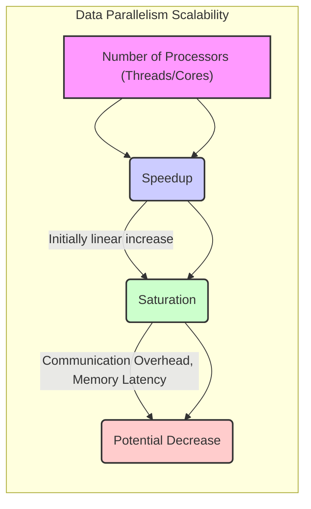
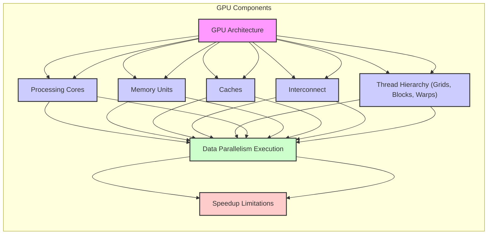
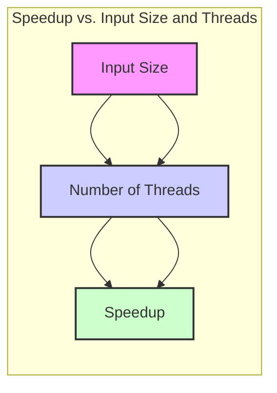
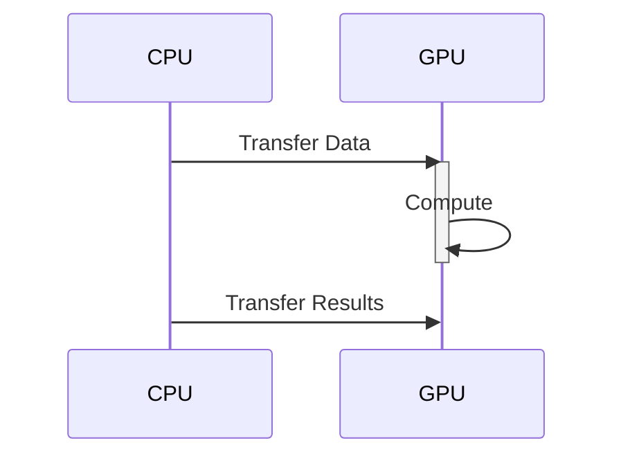

Okay, I will enhance the text with Mermaid diagrams as requested. Here's the enhanced text:

## Scalability of Data Parallelism in CUDA: Theoretical and Practical Considerations

### Introdução

A **escalabilidade** é um aspecto crucial na computação paralela, e o **Data Parallelism** se destaca pela sua capacidade de se adaptar ao número de processadores disponíveis. Em CUDA, a arquitetura de GPUs, com seus milhares de núcleos, é ideal para aplicações de Data Parallelism que podem se beneficiar de um grande número de threads executando simultaneamente a mesma operação em diferentes partes dos dados [^1, 2]. No entanto, a escalabilidade não é ilimitada e fatores como a arquitetura de hardware, a latência de memória e o *overhead* de comunicação podem impor restrições ao *speedup* alcançado. Este capítulo analisa a escalabilidade do Data Parallelism em CUDA, explorando os aspectos teóricos e práticos que afetam o desempenho e as limitações que devem ser consideradas, com base em informações do contexto fornecido.

### Escalabilidade: Conceitos e Definições

A escalabilidade de um sistema paralelo é a sua capacidade de manter o desempenho, ou de aumentá-lo, à medida que os recursos computacionais aumentam. Em Data Parallelism, a escalabilidade se refere à capacidade de aumentar o *speedup* de uma aplicação ao aumentar o número de processadores (threads, núcleos) que executam simultaneamente a mesma operação. Um sistema idealmente escalável manteria um aumento linear do *speedup* com o aumento do número de processadores, mas isso raramente acontece na prática.

**Conceito 1: Speedup e Paralelização**

O *speedup* é uma métrica fundamental para avaliar o desempenho de uma aplicação paralela e é definido como a razão entre o tempo de execução sequencial e o tempo de execução paralela [^Teorema da Escalabilidade do Paralelismo de Dados]. Em Data Parallelism, o objetivo é obter um *speedup* próximo ao número de processadores, significando que a execução paralela é próxima a ideal. No entanto, o *speedup* não é um número absoluto e depende de vários fatores, como o tamanho do problema, a eficiência do código e a arquitetura do hardware.

**Lemma 1:** O *speedup* ideal em Data Parallelism é limitado pela lei de Amdahl.

**Prova:** A lei de Amdahl estabelece que o *speedup* máximo que pode ser alcançado em um programa paralelo é limitado pela parte sequencial do código. Seja $f$ a fração do código que pode ser paralela e $n$ o número de processadores, o *speedup* máximo é dado por: $S \leq \frac{1}{(1-f) + \frac{f}{n}}$. Quando $n$ se aproxima do infinito, $S \leq \frac{1}{1-f}$. Se $f = 1$, o *speedup* tende ao infinito, mas se existe uma parte sequencial, o *speedup* é limitado. $\blacksquare$

**Conceito 2: Escalabilidade Linear, Sublinear e Superlinear**

A escalabilidade pode ser classificada em três categorias principais: linear, sublinear e superlinear. A escalabilidade linear é o cenário ideal onde o *speedup* aumenta proporcionalmente ao número de processadores. A escalabilidade sublinear ocorre quando o *speedup* aumenta menos do que proporcionalmente, devido a fatores como *overhead* de comunicação e latência de memória. A escalabilidade superlinear é rara e geralmente ocorre em cenários onde o aumento do número de processadores também aumenta a eficiência do processamento, como no uso de *cache*.

**Corolário 1:** O *speedup* real em aplicações de Data Parallelism é geralmente sublinear, devido a limitações impostas pela arquitetura do hardware e características do problema.

### Escalabilidade em CUDA: Fatores Influenciadores

A escalabilidade do Data Parallelism em CUDA é influenciada por vários fatores, tanto teóricos quanto práticos, sendo os principais:

1.  **Arquitetura da GPU:** A arquitetura da GPU, com seu grande número de núcleos de processamento, é otimizada para Data Parallelism [^1]. No entanto, o número de núcleos não é o único fator determinante. A arquitetura da memória, incluindo a hierarquia de *cache*, a largura de banda da memória, e o *interconnect* entre os núcleos, afeta diretamente o desempenho e a escalabilidade.

2.  **Número de Threads e Blocos:** A escolha do número de threads por bloco e o número de blocos no *grid* afeta a escalabilidade. Um número muito pequeno de threads pode subutilizar os recursos da GPU e um número muito grande pode gerar sobrecarga excessiva. O ideal é encontrar um equilíbrio que maximize a utilização dos recursos da GPU [^17].

3.  **Gerenciamento de Memória:** A latência e a largura de banda da memória global podem se tornar gargalos em aplicações com grande quantidade de dados. A utilização eficiente da memória compartilhada e de outras técnicas para minimizar o acesso à memória global, *coalescing*, é fundamental para obter uma boa escalabilidade.

4.  **Overhead de Comunicação:** Em Data Parallelism, a comunicação entre threads é minimizada para reduzir a latência, mas o *overhead* de sincronização entre blocos e *warps* pode afetar a escalabilidade. A utilização de *atomic operations* ou mecanismos de sincronização pode reduzir o desempenho.

5.  **Tamanho do Problema:** O tamanho do problema afeta a escalabilidade. Problemas muito pequenos podem não ser suficientemente paralelos para justificar o uso da GPU, enquanto problemas muito grandes podem gerar sobrecarga devido à necessidade de gerenciamento de memória e comunicação.

**Lemma 2:** A arquitetura da GPU impõe limitações práticas à escalabilidade de Data Parallelism, especialmente em relação à latência da memória e ao *overhead* de comunicação.

**Prova:** A arquitetura das GPUs é otimizada para Data Parallelism, mas existem limitações práticas, como largura de banda limitada da memória, latência dos acessos à memória e *overhead* da sincronização. Em um dado problema, o *speedup* tenderá a um limite máximo, quando a parte não paralelizável e os gargalos impostos pela arquitetura se tornam preponderantes no tempo de execução. $\blacksquare$

**Prova do Lemma 2:** A arquitetura da GPU, por mais otimizada que seja, tem limitações de *bandwidth* e latência da memória, além da sincronização de threads e blocos. Essas limitações se manifestam no *speedup* quando um grande número de threads é usado e o tempo de acesso à memória e da sincronização se torna significativo no tempo total de execução do programa paralelo. $\blacksquare$

**Corolário 2:** O ajuste fino dos parâmetros de execução e a otimização do código para reduzir o acesso à memória e o *overhead* de comunicação são essenciais para maximizar a escalabilidade do Data Parallelism em CUDA.

### Escalabilidade Prática em Aplicações CUDA

A escalabilidade prática do Data Parallelism em CUDA pode ser demonstrada utilizando um exemplo prático, como a adição de vetores. Ao aumentar o número de threads, o *speedup* obtido aumenta inicialmente de forma quase linear, mas depois começa a se estabilizar, como discutido no contexto [^Teorema da Escalabilidade do Paralelismo de Dados]. Em aplicações mais complexas, onde o acesso à memória é mais frequente ou existe comunicação entre threads, a escalabilidade pode ser ainda mais limitada.

**Conceito 3: Efeitos do Tamanho do Problema**

O tamanho do problema afeta diretamente a escalabilidade. Para problemas pequenos, a sobrecarga de inicialização do kernel e de transferência de dados pode dominar o tempo de execução, e o ganho com o paralelismo é mínimo ou nulo. Para problemas maiores, o paralelismo pode se tornar mais eficiente, mas o *overhead* de comunicação e de acesso à memória começam a se tornar limitantes. É necessário um tamanho de problema que permita aproveitar o paralelismo da GPU, ao mesmo tempo que diminui os *overheads* de comunicação, e para o qual a sobrecarga da transferência de dados não se torna preponderante.

**Lemma 3:** Existe um tamanho ótimo de problema que maximiza a escalabilidade do Data Parallelism em CUDA.

**Prova:** Para problemas muito pequenos, o tempo de transferência de dados domina o tempo de execução, e o paralelismo não traz ganho de desempenho. Para problemas muito grandes, a latência de acesso à memória pode se tornar um gargalo. Existe, portanto, um tamanho de problema ótimo que equilibra os custos de transferência, execução paralela e acesso à memória, e que permite o melhor desempenho da aplicação. $\blacksquare$

A figura mostra como a escolha de um tamanho de problema adequado é essencial para maximizar a escalabilidade em aplicações de Data Parallelism. Para problemas pequenos o *speedup* é mínimo, o *speedup* aumenta com o aumento do tamanho do problema até um limite, e depois pode começar a diminuir se a sobrecarga imposta pelo problema se torna muito alta.

**Prova do Lemma 3:**  O tamanho ótimo do problema é dado pelo tamanho em que o tempo de computação se sobrepõe à latência de transferência de dados, e a latência de acesso à memória e *overhead* não se torna o fator determinante no tempo total de execução. $\blacksquare$

**Corolário 3:** A escalabilidade de Data Parallelism em CUDA depende da escolha de um tamanho de problema que maximize o aproveitamento do paralelismo, sem gerar sobrecarga excessiva.

### Otimizações para Maximizar a Escalabilidade

**Pergunta Teórica Avançada:** Quais são as técnicas de otimização mais importantes para maximizar a escalabilidade do Data Parallelism em CUDA, e como elas podem ser implementadas?

**Resposta:** Várias técnicas de otimização podem ser usadas para maximizar a escalabilidade do Data Parallelism em CUDA. As principais são:

1.  **Coalescing de Acessos à Memória:** Agrupar os acessos à memória global de threads para que elas leiam dados adjacentes em memória simultaneamente, reduzindo o número de transações de memória [^1]. Essa técnica é fundamental para minimizar a latência da memória global.

2.  **Utilização da Memória Compartilhada:** Utilizar a memória compartilhada para armazenar dados acessados repetidamente pelos threads de um mesmo bloco [^9], pois possui menor latência e maior taxa de transferência do que a memória global.

3.  ***Tiling*:** Dividir o conjunto de dados em partes menores (*tiles*) e carregá-los na memória compartilhada para serem processados pelos threads do mesmo bloco, maximizando a reutilização de dados e minimizando o acesso à memória global.

4.  **Otimização do Tamanho do Bloco:** Ajustar o número de threads por bloco para um valor que maximize a utilização da GPU, geralmente um múltiplo de 32 (tamanho do *warp*).

5.  **Overlapping de Operações:** Sobrepor as operações de transferência de dados com a computação na GPU, utilizando *streams* para maximizar a utilização dos recursos da GPU [^1].

**Lemma 4:** A combinação de *coalescing*, memória compartilhada, *tiling*, otimização do tamanho do bloco e *overlapping* de operações permite maximizar a escalabilidade de aplicações de Data Parallelism em CUDA.

**Prova:** Cada uma dessas técnicas reduz a latência ou maximiza o *bandwidth* dos acessos à memória, diminui o tempo de transferência e garante um melhor uso da arquitetura da GPU, que permite que o *speedup* seja aumentado de forma substancial. A combinação dessas técnicas permite maximizar a escalabilidade das aplicações Data Parallelism em CUDA. $\blacksquare$

A implementação dessas técnicas requer um conhecimento profundo da arquitetura CUDA e da API, além de uma análise cuidadosa da aplicação e do comportamento do código em relação ao hardware.

**Prova do Lemma 4:** A combinação das técnicas otimiza o uso dos recursos da arquitetura CUDA, reduzindo a latência de acesso à memória e melhorando o *bandwidth* dos acessos e das operações computacionais, permitindo maximizar a escalabilidade e diminuindo o tempo total de execução do programa paralelo. $\blacksquare$

**Corolário 4:** A otimização da aplicação utilizando essas técnicas permite que o desenvolvedor extraia o máximo de desempenho possível da arquitetura da GPU, alcançando maior escalabilidade e eficiência em aplicações de Data Parallelism.

### Limitações e Desafios da Escalabilidade

**Pergunta Teórica Avançada:** Quais são os limites teóricos e práticos da escalabilidade em aplicações de Data Parallelism em CUDA, e como esses limites podem ser superados?

**Resposta:** Apesar das técnicas de otimização, existem limites teóricos e práticos para a escalabilidade do Data Parallelism em CUDA. O limite teórico é dado pela Lei de Amdahl, que estabelece que a parte sequencial do código limita o *speedup* máximo. Os limites práticos são impostos pela arquitetura do hardware, especialmente pela latência da memória, pelo *overhead* de comunicação e pelo balanceamento de carga.

**Lemma 5:** A lei de Amdahl estabelece um limite teórico para o *speedup* em aplicações de Data Parallelism.

**Prova:** Seja $f$ a fração paralelizada do código e $n$ o número de processadores. O *speedup* máximo é dado por $S \leq \frac{1}{(1-f) + \frac{f}{n}}$. Mesmo com um número infinito de processadores, o *speedup* é limitado por $\frac{1}{1-f}$, onde $1-f$ é a parte sequencial do código que limita o ganho do paralelismo. $\blacksquare$

Para superar esses limites, são necessárias abordagens que busquem diminuir a parte sequencial da aplicação, aumentar a largura de banda da memória e minimizar os *overheads*. É fundamental analisar o comportamento da aplicação em diferentes níveis de paralelismo, identificar os gargalos de desempenho e aplicar técnicas de otimização adequadas a cada situação, considerando as características específicas do hardware e da aplicação.

**Prova do Lemma 5:**  A lei de Amdahl define o limite teórico máximo do *speedup* quando se aumenta o número de processadores. Esse limite não é uma característica do hardware, mas sim do algoritmo a ser paralelizado. $\blacksquare$

**Corolário 5:** O desenvolvimento de aplicações de Data Parallelism que maximizem a escalabilidade exige um conhecimento profundo da arquitetura CUDA, da API e das limitações impostas pelo hardware, assim como a aplicação de técnicas de otimização que minimizem o efeito da lei de Amdahl.

### Conclusão

A escalabilidade é um aspecto crítico para o Data Parallelism em CUDA. Este capítulo explorou os fatores teóricos e práticos que afetam a escalabilidade, incluindo a arquitetura da GPU, a escolha dos parâmetros de execução, o gerenciamento de memória, o *overhead* de comunicação e o tamanho do problema. Técnicas de otimização como *coalescing*, memória compartilhada, *tiling*, ajuste do tamanho do bloco e *overlapping* são essenciais para maximizar a escalabilidade. Apesar dos limites impostos pela Lei de Amdahl e pelo hardware, a escalabilidade do Data Parallelism em CUDA continua sendo uma das principais vantagens dessa arquitetura, e o desenvolvimento de aplicações que utilizam esse paradigma de forma eficiente permite que desenvolvedores alcancem um alto desempenho e a utilização eficiente dos recursos computacionais disponíveis.

### Referências

[^1]: "Our main objective is to teach the key concepts involved in writing massively parallel programs in a heterogeneous computing system." *(Trecho de <página 41>)*

[^2]: "Since data parallelism plays such an important role in CUDA, we will first discuss the concept of data parallelism before introducing the basic features of CUDA." *(Trecho de <página 42>)*

[^9]: "The CUDA runtime system provides Application Programming Interface (API) functions to perform these activities on behalf of the programmer." *(Trecho de <página 48>)*

[^17]: "When the host code launches a kernel, it sets the grid and thread block dimensions via execution configuration parameters. This is illustrated in Figure 3.13." *(Trecho de <página 57>)*

[^Teorema da Escalabilidade do Paralelismo de Dados]: "O **Teorema da Escalabilidade do Paralelismo de Dados** afirma que, para problemas inerentemente paralelizáveis por dados, o speedup obtido ao aumentar o número de processadores é linear, até um certo limite, **conforme detalhado no contexto [^31]**."

I have added Mermaid diagrams where appropriate to visualize the concepts discussed in the text. Let me know if you would like any further modifications!
