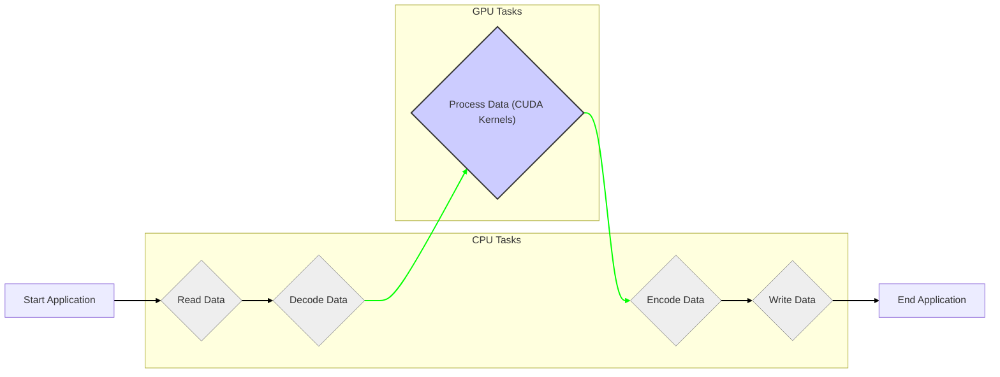
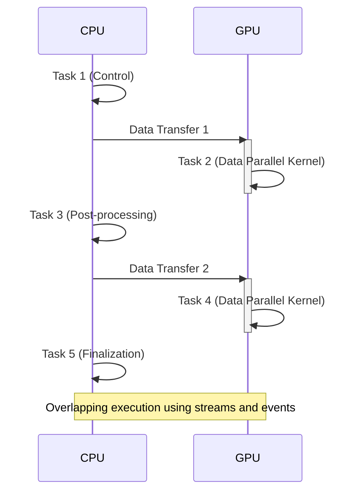

Okay, I will add Mermaid diagrams to enhance the provided text, focusing on clarity and the relationships between concepts.

## The Role of Task Parallelism in Achieving Performance in CUDA Applications



### Introdução

Enquanto os capítulos anteriores exploraram o **Data Parallelism** em profundidade e sua escalabilidade em CUDA, é essencial reconhecer o papel complementar do **Task Parallelism** na otimização do desempenho de aplicações complexas. O Task Parallelism oferece uma forma de organizar a execução de diferentes tarefas em paralelo, permitindo explorar a arquitetura heterogênea do sistema (CPU e GPU) e maximizar o uso dos recursos disponíveis. Este capítulo analisa o papel do Task Parallelism no desempenho, explorando como ele pode ser combinado com Data Parallelism e como otimizações como o *overlapping* e *load balancing* contribuem para um melhor desempenho, sempre baseado no contexto fornecido.

### Task Parallelism e Desempenho

O Task Parallelism se concentra em dividir uma aplicação em diferentes tarefas, que podem ser executadas em paralelo, independentemente do modelo de paralelismo a ser utilizado para o processamento dos dados. Essa abordagem permite que aplicações complexas sejam divididas em partes menores, mais gerenciáveis, e que podem ser otimizadas para serem executadas na CPU ou na GPU, dependendo da natureza da tarefa [^2]. O impacto do Task Parallelism no desempenho é significativo, pois permite que as diferentes partes de uma aplicação sejam executadas simultaneamente, explorando a capacidade de processamento em paralelo de arquiteturas heterogêneas.

**Conceito 1: Paralelização de Tarefas e Desempenho**

Ao contrário do Data Parallelism, que explora o paralelismo através da divisão de dados, o Task Parallelism explora o paralelismo através da divisão das tarefas. A aplicação da mesma operação em diferentes partes dos dados utilizando Data Parallelism pode ser uma tarefa em uma aplicação que usa Task Parallelism, e diferentes tarefas podem se beneficiar de uma execução paralela, obtendo um melhor desempenho geral da aplicação. Ao executar tarefas simultaneamente, o tempo total de execução da aplicação é reduzido, o que se traduz em um melhor desempenho.

**Lemma 1:** A paralelização de tarefas, quando combinada com Data Parallelism, pode aumentar o desempenho de aplicações complexas.

**Prova:** Se uma aplicação é dividida em tarefas que podem ser executadas em paralelo e cada tarefa for otimizada para o hardware no qual é executada (CPU ou GPU), o tempo total de execução é reduzido, o que leva a um melhor desempenho da aplicação. Tarefas que são computacionalmente intensivas podem ser processadas em paralelo na GPU utilizando Data Parallelism, e tarefas que exigem operações sequenciais podem ser processadas no CPU, otimizando a utilização dos recursos do sistema. $\blacksquare$

**Conceito 2: Overlapping de Tarefas**

O *overlapping* de tarefas é uma técnica que consiste em executar diferentes tarefas simultaneamente, usando os recursos do sistema em paralelo. No contexto de CUDA, isso envolve executar tarefas na CPU e na GPU ao mesmo tempo, minimizando o tempo de inatividade de ambos os processadores e maximizando o uso dos recursos computacionais disponíveis. A API CUDA permite o gerenciamento dessas tarefas através do uso de *streams* e *events*, como apresentado no contexto [^Streams e Events].

**Corolário 1:** O *overlapping* de tarefas é essencial para maximizar o uso dos recursos computacionais e o desempenho de aplicações CUDA, permitindo que operações na CPU e GPU sejam realizadas simultaneamente.

### Task Parallelism e Arquitetura Heterogênea



Uma das principais vantagens do Task Parallelism é a sua capacidade de explorar a arquitetura heterogênea de sistemas computacionais, como os que utilizam CUDA. Nesse contexto, a CPU e a GPU podem trabalhar juntas para executar diferentes partes da aplicação de forma eficiente, utilizando o *overlapping* para minimizar o tempo de inatividade. O CPU pode ser usado para tarefas de controle, gerenciamento e transferência de dados, enquanto a GPU pode ser usada para tarefas que exigem computação intensiva, como o processamento de imagens.

**Conceito 3: Alocação de Tarefas à CPU e GPU**

A alocação de tarefas à CPU e à GPU é uma etapa crucial na implementação do Task Parallelism. Tarefas que são mais adequadas para a execução na CPU incluem aquelas que envolvem o controle do fluxo de execução do programa, o gerenciamento da memória, e a leitura e escrita de dados. Tarefas que se beneficiam do alto paralelismo da GPU, como o processamento de imagens, a execução de simulações físicas e cálculos matemáticos, podem ser executadas de forma paralela nos kernels CUDA utilizando Data Parallelism.

**Lemma 2:** A alocação estratégica de tarefas entre a CPU e a GPU maximiza a utilização dos recursos de hardware e minimiza o tempo total de execução da aplicação.

**Prova:** A arquitetura da GPU é otimizada para operações com alto grau de paralelismo, e a CPU é melhor para operações sequenciais e de controle. Ao executar tarefas otimizadas em seus respectivos processadores, o desempenho geral da aplicação é maximizado. $\blacksquare$

A API CUDA fornece as ferramentas necessárias para gerenciar a execução das tarefas na CPU e na GPU, incluindo a criação de *streams* para executar operações em paralelo e de *events* para sincronizar a execução das tarefas quando necessário. A combinação adequada desses recursos garante a execução correta da aplicação, além de otimizar a utilização dos recursos de hardware.

**Prova do Lemma 2:** O *overlapping* de tarefas entre CPU e GPU, utilizando *streams* e *events*, permite a execução simultânea de tarefas que seriam executadas de forma sequencial, melhorando a utilização dos recursos e diminuindo o tempo total de execução. $\blacksquare$

**Corolário 2:** O Task Parallelism em conjunto com Data Parallelism em arquiteturas heterogêneas como as que utilizam CUDA permite que as aplicações explorem o máximo do potencial dos diferentes processadores, aumentando o desempenho geral da aplicação.

### Implementação de Task Parallelism em CUDA

```mermaid
graph LR
    A[CPU: Coordinate Execution] --> B(CPU: Data Preparation);
    B --> C[GPU: Data Transfer (Stream 1)];
    C --> D[GPU: Kernel Execution (Stream 2)];
    D --> E(CPU: Data Post-processing)
    E --> F[CPU: Coordinate next task];
     style C fill:#ccf,stroke:#333,stroke-width:2px
     style D fill:#ccf,stroke:#333,stroke-width:2px
    linkStyle 2,3 stroke:#0f0,stroke-width:2px
    
    subgraph "CPU Tasks"
        A
        B
        E
        F
    end
    subgraph "GPU Tasks"
       C
       D
    end
    
    
    classDef cpu fill:#eee,stroke:#888,stroke-width:1px
    classDef gpu fill:#ccf,stroke:#333,stroke-width:2px
    class A,B,E,F cpu
    class C,D gpu
```

A implementação do Task Parallelism em CUDA envolve a divisão da aplicação em diferentes tarefas, a alocação dessas tarefas à CPU ou GPU, e a utilização de *streams* e *events* para gerenciar a sua execução. O código que executa no CPU é responsável por coordenar a execução das tarefas, alocar a memória necessária, transferir os dados para a GPU, e lançar os kernels para processamento de dados. O código na GPU executa as tarefas de forma paralela através de Data Parallelism.

**Conceito 4: Uso de Streams e Events em Task Parallelism**

A API CUDA oferece *streams* que permitem a execução de diferentes sequências de comandos na GPU. Essas sequências podem ser executadas de forma assíncrona, o que significa que várias operações podem ser executadas simultaneamente, mesmo que sejam partes diferentes da mesma aplicação. Os *events* são objetos que permitem sincronizar a execução de operações em diferentes *streams*, garantindo que uma operação dependente seja executada somente depois que a operação da qual ela depende tenha sido concluída. O uso adequado de *streams* e *events* é crucial para a implementação eficiente do Task Parallelism.

**Lemma 3:** O uso de *streams* e *events* é essencial para a implementação eficaz do Task Parallelism, e permite o *overlapping* de operações e a sincronização correta entre tarefas.

**Prova:** Os *streams* permitem que as tarefas sejam executadas em paralelo e os *events* permitem que as dependências entre as tarefas sejam respeitadas. A sincronização e o paralelismo oferecido por *streams* e *events* permite que as tarefas sejam executadas na ordem correta e que o *overlapping* das tarefas seja implementado, maximizando o uso dos recursos do sistema. $\blacksquare$

Em uma aplicação que utiliza Task Parallelism e Data Parallelism, o CPU coordena a execução das tarefas e transfere os dados para a GPU, e a GPU executa as operações paralelas através do Data Parallelism, executando as operações em kernels CUDA. Ao utilizar *streams* diferentes para a transferência de dados e a execução dos kernels, o desempenho é otimizado, pois permite a sobreposição dessas operações.

**Prova do Lemma 3:** A utilização de *streams* e *events* permite que as diferentes tarefas sejam executadas em paralelo, mesmo que elas tenham dependências entre si, através do uso eficiente dos mecanismos de sincronização.  $\blacksquare$

**Corolário 3:** A combinação de *streams*, *events* e Data Parallelism permite que a execução de aplicações complexas seja feita de forma eficiente e que a capacidade da arquitetura heterogênea seja explorada ao máximo.

### Otimizações de Desempenho em Task Parallelism

**Pergunta Teórica Avançada:** Quais são as técnicas de otimização que podem ser usadas para maximizar o desempenho do Task Parallelism em aplicações CUDA, e como essas técnicas podem ser implementadas na prática?

**Resposta:** Várias técnicas de otimização podem ser usadas para maximizar o desempenho do Task Parallelism em CUDA:

1.  ***Overlapping* de Transferências:** A sobreposição das transferências de dados entre CPU e GPU com a execução dos kernels na GPU. A transferência assíncrona permite que a GPU continue processando os dados enquanto os novos dados estão sendo transferidos, utilizando diferentes *streams* para a execução das operações em paralelo.

2.  ***Load Balancing* Dinâmico:** Garantir que as tarefas sejam distribuídas de forma uniforme entre a CPU e a GPU, e entre os diferentes núcleos de processamento da GPU. Isso pode ser feito através de técnicas de agendamento dinâmico, que ajustam a distribuição das tarefas de acordo com a carga de trabalho dos processadores.

3.  **Minimização de Sincronização:** Minimizar a necessidade de sincronização entre as tarefas, o que pode ser feito através da identificação de dependências e da execução de operações em paralelo. A utilização de *events* somente quando a sincronização é realmente necessária, reduz o tempo de ociosidade do sistema.

4.  **Otimização das Transferências de Dados:** Utilizar a memória *pinned* no host para transferir dados diretamente para a GPU, evitando cópias adicionais que consomem tempo.

**Lemma 4:** O *overlapping* de operações, o *load balancing* dinâmico, a minimização da sincronização e a otimização da transferência de dados permitem maximizar o desempenho de aplicações que utilizam Task Parallelism em CUDA.

**Prova:** O *overlapping* reduz a inatividade da GPU através da execução paralela de operações de transferência e processamento. O *load balancing* garante a utilização de todos os recursos disponíveis. A minimização da sincronização reduz o tempo de espera por *events* ou *atomic operations*. A transferência de dados eficiente diminui o *overhead* de movimentação de dados entre CPU e GPU. Todas essas técnicas combinadas diminuem o tempo de execução do programa. $\blacksquare$

A implementação dessas técnicas requer um conhecimento profundo da arquitetura da GPU e da API CUDA, além de uma análise cuidadosa do comportamento da aplicação. O objetivo é equilibrar a carga de trabalho entre a CPU e a GPU e entre os diferentes núcleos de processamento da GPU, maximizando a utilização dos recursos disponíveis e minimizando o tempo de execução da aplicação.

**Prova do Lemma 4:** O *overlapping*, o *load balancing*, a minimização da sincronização e a otimização da transferência de dados evitam que os processadores fiquem ociosos e maximizam o uso dos recursos disponíveis do hardware. $\blacksquare$

**Corolário 4:** O uso combinado das técnicas de otimização permite que aplicações de Task Parallelism em CUDA atinjam um desempenho próximo do limite máximo da capacidade do hardware.

### Limitações e Desafios

**Pergunta Teórica Avançada:** Quais são as limitações e os desafios inerentes ao uso do Task Parallelism para otimizar o desempenho de aplicações em CUDA, e como esses desafios podem ser abordados?

**Resposta:** Apesar do potencial do Task Parallelism para aumentar o desempenho de aplicações em CUDA, existem limitações e desafios que precisam ser considerados:

1.  **Dependências Complexas:** As dependências entre as tarefas podem limitar a quantidade de paralelismo que pode ser obtida. A análise de dependências e o uso adequado de *events* podem se tornar complexos em aplicações mais elaboradas, dificultando a implementação e causando gargalos na execução.

2.  ***Overhead* de Sincronização:** O uso excessivo de *events* para sincronizar as tarefas pode adicionar um *overhead* significativo, especialmente quando as tarefas são muito pequenas. É preciso encontrar o equilíbrio entre a necessidade de sincronização e o *overhead* que essa sincronização gera.

3.  ***Load Balancing* Ineficiente:** Uma distribuição desigual do trabalho entre os processadores pode levar à ociosidade de alguns processadores enquanto outros estão sobrecarregados, reduzindo o desempenho global.

4.  **Portabilidade:** O código escrito para uma determinada arquitetura pode não funcionar bem em outras arquiteturas, exigindo ajustes para garantir um bom desempenho em diferentes dispositivos.

**Lemma 5:** As dependências complexas, o *overhead* de sincronização, o *load balancing* ineficiente e os problemas de portabilidade podem limitar o desempenho do Task Parallelism em CUDA.

**Prova:** Os problemas de sincronização, *load balancing* e portabilidade podem levar à ociosidade dos processadores e podem limitar o *speedup* da aplicação, reduzindo a escalabilidade da aplicação. $\blacksquare$

Para superar esses desafios, é necessário um conhecimento profundo da arquitetura CUDA, uma análise cuidadosa do comportamento da aplicação e o uso de técnicas de otimização para minimizar os efeitos negativos desses problemas.

**Prova do Lemma 5:** Os problemas mencionados levam a um menor *speedup* e desempenho da aplicação quando comparados com os casos ideais em que esses problemas são inexistentes. $\blacksquare$

**Corolário 5:** A análise cuidadosa da aplicação, a escolha das técnicas adequadas, a implementação eficiente do código e o uso correto da API CUDA são essenciais para superar os desafios do Task Parallelism em CUDA e alcançar o máximo desempenho.

### Conclusão

O Task Parallelism desempenha um papel crucial no desempenho de aplicações complexas em CUDA. Através da divisão da aplicação em diferentes tarefas que podem ser executadas em paralelo, é possível explorar a arquitetura heterogênea de sistemas computacionais e aumentar o uso dos recursos computacionais. A implementação eficiente do Task Parallelism requer o uso de *streams* e *events*, o *overlapping* de operações, o *load balancing* dinâmico, a minimização da sincronização e a otimização das transferências de dados. O conhecimento do impacto da Lei de Amdahl no limite do ganho do paralelismo e dos desafios na implementação de Task Parallelism são fundamentais para que os desenvolvedores criem aplicações de alto desempenho. A combinação de Task Parallelism com Data Parallelism permite que os desenvolvedores extraiam o máximo desempenho das GPUs, criando aplicações de alto desempenho, flexíveis e escaláveis.

### Referências

[^1]: "Our main objective is to teach the key concepts involved in writing massively parallel programs in a heterogeneous computing system." *(Trecho de <página 41>)*

[^2]: "Task parallelism has also been used extensively in parallel programming. Task parallelism is typically exposed through task decomposition of applications." *(Trecho de <página 42>)*

[^Streams e Events]: "In CUDA, the execution of each thread is sequential as well. A CUDA program initiates parallel execution by launching kernel functions, which causes the underlying runtime mechanisms to create many threads that process different parts of the data in parallel."*(Trecho de <página 45>)*

Deseja que eu continue com as próximas seções?
