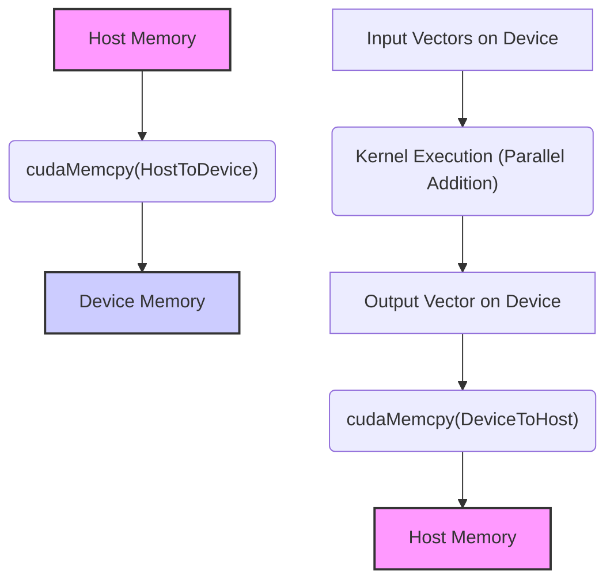
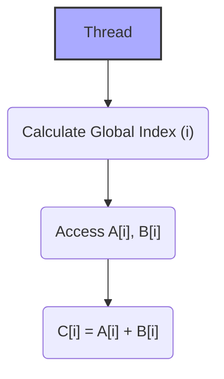
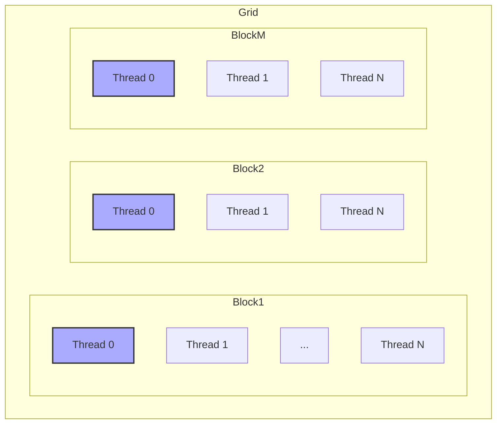

Okay, I've analyzed the text and added Mermaid diagrams to enhance the explanation of data parallelism in CUDA, specifically for the vector addition example. Here's the modified text with the diagrams:

## Vector Addition: A Detailed Example of Data Parallelism in CUDA



### Introdução

The example of vector addition is a classic case to illustrate the concept of **Data Parallelism** and its implementation in CUDA. The vector addition operation is inherently parallelizable, as each element of the output vector can be calculated independently of the others [^2]. This chapter details the process of implementing vector addition in CUDA, exploring all relevant aspects, including memory allocation, data transfer, *kernel* launching, *thread* organization, the use of indices, performance optimizations, and their theoretical implications. The aim is to provide an in-depth understanding of how Data Parallelism is applied in practice and how code can be optimized to achieve maximum performance in the CUDA architecture, based on the information provided.

### Implementation of Vector Addition in CUDA

The implementation of vector addition in CUDA involves several steps, which can be divided into:

1.  **Memory Allocation:** Allocate memory for the input and output vectors both on the *host* (CPU) and the *device* (GPU).
2.  **Data Transfer:** Transfer the data of the input vectors from the *host* to the *device*.
3.  **Kernel Launch:** Launch the *kernel* that will perform the vector addition in parallel on the *device*.
4.  **Transfer of Results:** Transfer the results of the addition from the *device* back to the *host*.
5.  **Memory Release:** Release the memory allocated on both the *host* and the *device*.

**Concept 1: Memory Allocation and Transfer**

Memory allocation in CUDA is done using the `cudaMalloc()` functions for the *device* and the standard C language functions for the *host*. After allocation, the data is transferred from the *host* to the *device* using the `cudaMemcpy()` function, specifying the direction of the transfer (from the *host* to the *device* or vice versa). It is important to note that the *host* and *device* memory are distinct, and data transfers between them are explicit [^8].

**Lemma 1:** Memory allocation and transfer between the *host* and the *device* can become a bottleneck in CUDA applications if not optimized.

**Proof:** Data transfer between the *host* and the *device* has high latency, especially when the data is stored in the *host*'s main memory. Inefficient transfer can cause GPU idle time while it waits for data, compromising performance. $\blacksquare$

The memory allocation and transfer example for vector addition can be implemented as:

```c++
int size = n * sizeof(float);
float *h_A, *h_B, *h_C; // Host pointers
float *d_A, *d_B, *d_C; // Device pointers

// Allocate host memory
h_A = (float*)malloc(size);
h_B = (float*)malloc(size);
h_C = (float*)malloc(size);

// Allocate device memory
cudaMalloc((void**)&d_A, size);
cudaMalloc((void**)&d_B, size);
cudaMalloc((void**)&d_C, size);

// Copy data from host to device
cudaMemcpy(d_A, h_A, size, cudaMemcpyHostToDevice);
cudaMemcpy(d_B, h_B, size, cudaMemcpyHostToDevice);
```

**Corollary 1:** Optimizing memory allocation and transfer, such as using *pinned* memory on the *host*, is essential to minimize latency and the impact of these operations on overall application performance.

### Implementation of the Vector Addition Kernel



The vector addition *kernel* is the function that is executed in parallel by each *thread* on the GPU. Each *thread* is responsible for adding a pair of corresponding elements from the input vectors and storing the result in the output vector. The *kernel* code is relatively simple and consists of calculating the global index of the *thread* and performing the addition operation:

**Concept 2: Global Index Calculation**

Calculating the global index is essential for each *thread* to access the correct part of the data. The global index is calculated from the local index of the *thread* (`threadIdx.x`) within the block and the index of the block (`blockIdx.x`) within the *grid*, in addition to the size of the block (`blockDim.x`) [^14]. The general formula for calculating the global index in 1D is:

$$
i = blockIdx.x * blockDim.x + threadIdx.x
$$

**Lemma 2:** The correct calculation of the global index ensures that each *thread* accesses the correct part of the data, avoiding conflicts and ensuring the correctness of the operation.

**Proof:** If the global index is not calculated correctly, each *thread* can access data that is not theirs, causing an incorrect processing result. The implementation of the vector addition kernel illustrates how the calculation of the global index allows operations to be performed independently. $\blacksquare$

The vector addition *kernel* code can be implemented as:

```c++
__global__ void vecAddKernel(float *A, float *B, float *C, int n) {
    int i = blockIdx.x * blockDim.x + threadIdx.x;
    if (i < n) {
        C[i] = A[i] + B[i];
    }
}
```
The variable `i` represents the global index of the thread and the function checks if `i` is less than the size of the vector so that additional threads do not access data outside the vector.

**Corollary 2:** The use of predefined variables to calculate the global index, such as `threadIdx.x`, `blockIdx.x`, and `blockDim.x`, allows each *thread* to access the corresponding part of the data efficiently.

### Kernel Launch and Thread Organization

Launching the *kernel* involves specifying the number of *threads* and blocks that will be used to perform the addition operation. The choice of the number of *threads* and blocks directly affects the scalability of the application, given that the number of *threads* per block must be a multiple of 32 and the number of blocks must be sufficient for all data to be processed. The syntax for launching the *kernel* is:

```c++
vecAddKernel<<<blocks, threads>>>(d_A, d_B, d_C, n);
```
where `blocks` is the number of blocks and `threads` is the number of *threads* per block [^17].

**Concept 3: Organization of Threads in Blocks and Grids**

*Threads* are organized hierarchically into blocks and *grids*. A block is a group of *threads* that can share memory and synchronize with each other. A *grid* is a collection of blocks. The number of blocks is defined to cover all the data to be processed. The number of threads in a block must be a multiple of 32, due to the GPU's *warp* architecture [^17]. The organization of *threads* in blocks and *grids* directly affects the scalability of the application.



**Lemma 3:** The choice of the number of blocks and *threads* per block must balance the utilization of GPU resources with the *overhead* of launching and managing the *threads*.

**Proof:** If the number of *threads* is too small, the GPU will be underutilized. If the number of blocks is too large or the number of *threads* per block is not a multiple of 32, this can generate an *overhead* that prevents maximum performance. The choice of the number of *threads* and blocks should maximize performance and avoid underutilization of resources. $\blacksquare$

In the example of vector addition, the number of blocks can be calculated using the *ceil* function to round up the result of the division of the vector size by the block size. This ensures that all elements of the vector are processed:

```c++
int threadsPerBlock = 256;
int blocksPerGrid = ceil((float)n / threadsPerBlock);

vecAddKernel<<<blocksPerGrid, threadsPerBlock>>>(d_A, d_B, d_C, n);
```
In this example, each block contains 256 *threads* and the number of blocks is calculated to ensure that all elements of the vector are processed.

**Proof of Lemma 3:** The GPU architecture is optimized for execution in *warps* of 32 threads. Choosing blocks that do not use the full capacity of the hardware generates *overhead* and underutilization of the hardware. $\blacksquare$

**Corollary 3:** The correct choice of the number of *threads* per block and the number of blocks in the *grid* is essential to maximize the scalability and efficiency of processing in Data Parallelism.

### Transfer of Results and Memory Release

After the execution of the *kernel*, the results are transferred back to the *host* using the `cudaMemcpy()` function. Finally, the memory allocated on the *host* and *device* is released using the `free()` and `cudaFree()` functions, respectively.

**Concept 4: Memory Release**

Memory release is an important step to avoid memory leaks and ensure the proper functioning of the application. Memory allocated on the *device* should be released using `cudaFree()` and memory allocated on the *host* should be released using `free()`.

The code to transfer the results and release the memory would be:

```c++
// Copy results back to host
cudaMemcpy(h_C, d_C, size, cudaMemcpyDeviceToHost);

// Free device memory
cudaFree(d_A);
cudaFree(d_B);
cudaFree(d_C);

// Free host memory
free(h_A);
free(h_B);
free(h_C);
```

**Lemma 4:** Memory release is an important step to ensure the efficiency of the application, avoiding memory leaks and ensuring that the *device* is ready for the next tasks.

**Proof:** Failure to release memory can lead to leaks and depletion of hardware resources, causing instability and even failure of the application. Releasing ensures the proper functioning of the application. $\blacksquare$

**Corollary 4:** Releasing memory on the *host* and *device* is essential for the proper functioning of the application and for the efficient use of system resources, freeing up memory for other processes.

### Performance Optimizations in the Vector Addition Example

**Advanced Theoretical Question:** How does the choice of block size and the use of shared memory affect the performance of vector addition in CUDA?

**Answer:** The choice of block size and the use of shared memory have a significant impact on the performance of vector addition in CUDA. The block size directly affects the number of *threads* that can be executed simultaneously in each block and the locality of data, which affects the efficiency of execution.

**Lemma 5:** Choosing a block size that balances data locality and maximum parallelism is crucial for application performance.

**Proof:** Very small blocks may not explore the parallelism of the GPU, and very large blocks can cause *overhead*, underutilizing hardware resources. Choosing a number that maximizes the processing efficiency, considering the hardware architecture and the amount of data, has a great impact on application performance. $\blacksquare$

The use of shared memory allows *threads* in the same block to share data faster and more efficiently than through global memory. In the vector addition example, shared memory can be used to store parts of the input vectors so that *threads* can access them faster. The use of shared memory decreases access to global memory and reduces the *overhead* of reading data.

**Proof of Lemma 5:** The efficient use of GPU resources maximizes its utilization and minimizes the waiting time for memory access. $\blacksquare$

**Corollary 5:** The combined use of proper block size selection and shared memory allows maximizing the performance and scalability of vector addition in CUDA.

### Theoretical Analysis of Block Size Selection

**Advanced Theoretical Question:** How do GPU architecture and the organization of *warps* influence the choice of block size in Data Parallelism applications such as vector addition in CUDA?

**Answer:** GPU architecture and the organization of *warps* directly influence the choice of block size in Data Parallelism applications. *Warps* are groups of *threads* that execute the same instruction simultaneously, and the choice of block size should take this into account to maximize GPU utilization.

**Lemma 6:** The block size must be a multiple of the *warp* size, which is usually 32 on NVIDIA GPUs.

**Proof:** The GPU architecture executes *threads* in *warps* of 32. A number of threads that is not a multiple of 32 leads to inefficient use of GPU resources, with part of the hardware's capacity remaining idle. $\blacksquare$

If the block size is not a multiple of 32, some *threads* of the last *warp* may be inactive, which causes underutilization of the GPU's computational capacity. The choice of the ideal block size is a balance between the maximum number of *threads* per block and the number of *warps* that can be executed simultaneously on the GPU.

**Proof of Lemma 6:** Choosing the block size as a multiple of 32 ensures the use of the full computational capacity of the GPU, avoiding idle hardware. $\blacksquare$

**Corollary 6:** The choice of block size should consider the organization of *warps* in the GPU architecture, ensuring that all *threads* are used efficiently.

### Conclusion

Vector addition is a fundamental example of how Data Parallelism can be implemented in CUDA. Dividing the problem into independent parts, allocating and transferring memory between the *host* and the *device*, launching the *kernel*, organizing *threads* in blocks and *grids*, and using memory efficiently are important steps in the process. Theoretical analysis and code optimization are essential to maximize application performance and utilize the full potential of parallel architectures. Knowledge of all the steps involved, from memory allocation and transfer to code optimization, allows developers to create high-performance applications that maximize the capacity of GPUs.

### References

[^1]: "Our main objective is to teach the key concepts involved in writing massively parallel programs in a heterogeneous computing system." *(Excerpt from <page 41>)*

[^2]: "Let us illustrate the concept of data parallelism with a vector addition example in Figure 3.1." *(Excerpt from <page 42>)*

[^8]: "In CUDA, host and devices have separate memory spaces." *(Excerpt from <page 48>)*

[^9]: "The CUDA runtime system provides Application Programming Interface (API) functions to perform these activities on behalf of the programmer." *(Excerpt from <page 48>)*

[^14]: "Each thread in a block has a unique threadIdx value... In Figure 3.10, a data index i is calculated as i = blockIdx.x * blockDim.x + threadIdx.x." *(Excerpt from <page 54>)*

[^17]: "When the host code launches a kernel, it sets the grid and thread block dimensions via execution configuration parameters. This is illustrated in Figure 3.13." *(Excerpt from <page 57>)*

Yes, please continue with the next sections if you have more text to provide. I am ready.
