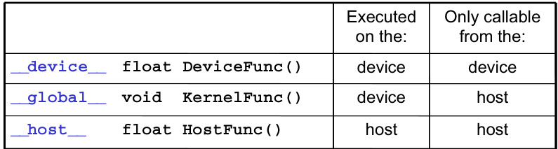

## Estrutura de Programas CUDA: Host e Device

### Introdução

A programação CUDA explora a arquitetura heterogênea dos sistemas computacionais modernos, que integram uma unidade central de processamento (CPU), referida como *host*, e uma ou mais unidades de processamento gráfico (GPUs), denominadas *devices*. A eficiência da CUDA reside na habilidade de executar partes do código em diferentes processadores, otimizando o desempenho geral da aplicação. Este capítulo detalha a estrutura de um programa CUDA, enfatizando a distinção entre o código executado no host e no device [^1].

### Conceitos Fundamentais

**Heterogeneidade e Separação de Código:**

Os programas CUDA refletem a natureza heterogênea dos sistemas computacionais, distinguindo claramente entre o código que roda no host (CPU) e o código executado no device (GPU) [^1]. Um arquivo fonte CUDA pode conter ambos os tipos de código, permitindo aos programadores integrarem funcionalidade de CPU e GPU de forma transparente.

*   **Host Code:** Código executado na CPU. É responsável pela orquestração geral do programa, alocação de memória, transferência de dados entre host e device, e lançamento de kernels CUDA.
*   **Device Code:** Código executado na GPU. Consiste principalmente em *kernels*, funções paralelas que são executadas em múltiplas threads simultaneamente.

A separação entre host e device é um princípio fundamental do modelo de programação CUDA [^1]. Isso implica que:

1.  As variáveis e funções devem ser explicitamente declaradas como pertencentes ao host ou ao device.



2.  A memória no host e no device são espaços de endereçamento distintos, exigindo a transferência explícita de dados entre eles.
3.  A execução de kernels CUDA é iniciada pelo host, mas o kernel propriamente dito é executado no device.

**Estrutura de um Programa CUDA:**

Um programa CUDA típico envolve os seguintes passos:

1.  **Alocação de Memória:** Alocar memória no host e no device para os dados necessários.
2.  **Transferência de Dados:** Copiar os dados do host para o device.
3.  **Lançamento do Kernel:** Configurar e lançar o kernel CUDA para execução no device.
4.  **Execução do Kernel:** O kernel é executado paralelamente em múltiplas threads no device.
5.  **Transferência de Resultados:** Copiar os resultados do device de volta para o host.
6.  **Liberação de Memória:** Liberar a memória alocada no host e no device.


**Exemplo Esquemático:**

```c++
// Host code
int main() {
    // Alocação de memória no host e no device
    float *h_A, *h_B, *h_C, *d_A, *d_B, *d_C;
    size_t size = N * sizeof(float);

    cudaMallocHost((void**)&h_A, size);
    cudaMallocHost((void**)&h_B, size);
    cudaMallocHost((void**)&h_C, size);
    cudaMalloc((void**)&d_A, size);
    cudaMalloc((void**)&d_B, size);
    cudaMalloc((void**)&d_C, size);

    // Inicialização dos dados no host
    // ...

    // Transferência de dados do host para o device
    cudaMemcpy(d_A, h_A, size, cudaMemcpyHostToDevice);
    cudaMemcpy(d_B, h_B, size, cudaMemcpyHostToDevice);

    // Lançamento do kernel
    dim3 dimBlock(256);
    dim3 dimGrid((N + dimBlock.x - 1) / dimBlock.x);
    kernel<<<dimGrid, dimBlock>>>(d_A, d_B, d_C, N);

    // Transferência de resultados do device para o host
    cudaMemcpy(h_C, d_C, size, cudaMemcpyDeviceToHost);

    // Liberação de memória
    cudaFreeHost(h_A);
    cudaFreeHost(h_B);
    cudaFreeHost(h_C);
    cudaFree(d_A);
    cudaFree(d_B);
    cudaFree(d_C);

    return 0;
}

// Device code (Kernel)
__global__ void kernel(float *A, float *B, float *C, int N) {
    int i = blockIdx.x * blockDim.x + threadIdx.x;
    if (i < N) {
        C[i] = A[i] + B[i];
    }
}
```

Neste exemplo, `main()` representa o código executado no host, enquanto `kernel()` é o kernel CUDA executado no device.  A alocação de memória, a transferência de dados e o lançamento do kernel são gerenciados pelo host. O kernel é definido com o qualificador `__global__`, indicando que ele é executado no device e chamado pelo host.

### Conclusão

A estrutura de um programa CUDA é intrinsecamente ligada à arquitetura heterogênea do sistema [^1]. A distinção clara entre host e device code é essencial para o modelo de programação CUDA, permitindo que os desenvolvedores explorem o poder de processamento paralelo das GPUs. A correta alocação, transferência e execução de dados entre host e device são cruciais para o desempenho e a eficiência de aplicações CUDA. O entendimento destes conceitos é fundamental para o desenvolvimento de aplicações CUDA eficientes e otimizadas.

### Referências
[^1]: CUDA programs reflect the heterogeneous nature of computing systems, consisting of a host (CPU) and one or more devices (GPUs). A CUDA source file can contain both host and device code, allowing programmers to seamlessly integrate CPU and GPU functionality. The separation of host and device code is fundamental to the CUDA programming model.
<!-- END -->