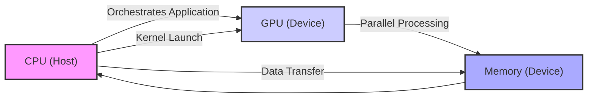
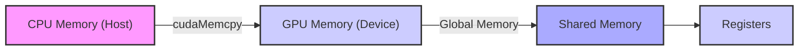
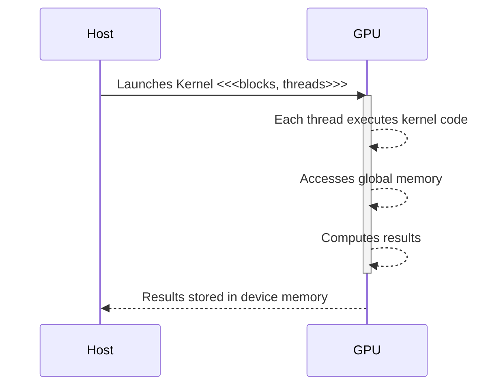
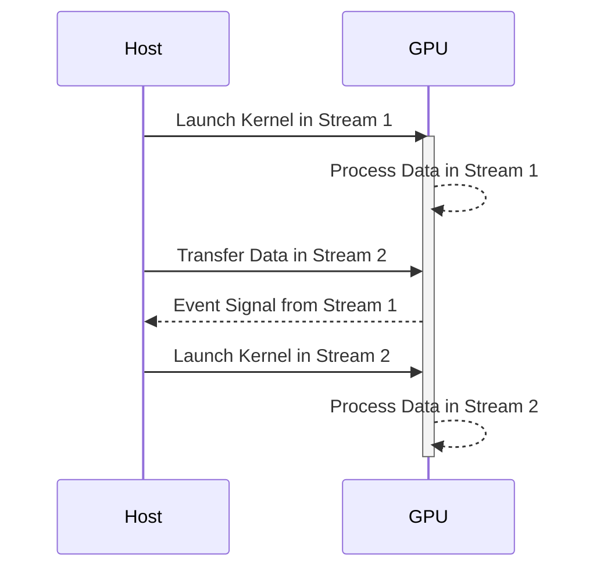

Okay, I will add Mermaid diagrams to enhance the provided text as requested.

## The Host-Device Model in CUDA: A Deep Dive into Heterogeneous Computing

### Introdução

O modelo **host-device** é um conceito fundamental na programação CUDA, definindo a estrutura da computação heterogênea na qual a CPU (o *host*) e a GPU (o *device*) trabalham em conjunto para executar aplicações. Este modelo estabelece uma clara divisão de responsabilidades entre os dois processadores, com a CPU atuando como um orquestrador e a GPU como um processador paralelo altamente eficiente. Compreender em profundidade o modelo host-device é essencial para desenvolver aplicações CUDA que aproveitem ao máximo a capacidade de processamento paralelo das GPUs, e para otimizar a execução do código e o uso dos recursos. Este capítulo explora o modelo host-device em detalhes, analisando os seus componentes, os mecanismos de comunicação, as estratégias de otimização e os desafios que devem ser considerados para atingir o máximo desempenho em aplicações CUDA, baseado no contexto fornecido.

### Fundamentos do Modelo Host-Device

O modelo host-device em CUDA reflete a arquitetura de sistemas computacionais heterogêneos, onde a CPU e a GPU coexistem, cada uma com seus próprios espaços de memória e capacidades de processamento. O *host*, normalmente uma CPU, é responsável pelo controle geral da aplicação, pela alocação de memória, pela transferência de dados e pelo lançamento dos *kernels* na GPU. O *device*, normalmente uma GPU, executa as tarefas de processamento paralelo, operando em grandes volumes de dados de forma eficiente.

**Conceito 1: Responsabilidades do Host e do Device**

O *host* é responsável por:

*   Inicializar a aplicação e preparar os dados para processamento paralelo.
*   Alocar memória tanto no *host* quanto no *device*.
*   Transferir dados do *host* para o *device* antes da execução dos *kernels*.
*   Lançar os *kernels* que serão executados na GPU.
*   Transferir os resultados de volta para o *host*.
*   Liberar a memória alocada.
*   Gerenciar o fluxo de execução da aplicação e controlar a sincronização das tarefas.

O *device* é responsável por:

*   Executar os *kernels* em paralelo sobre diferentes partes dos dados.
*   Acessar os dados na sua própria memória, e, se necessário, interagir com a memória do *host*.
*   Realizar as operações computacionais.
*   Armazenar os resultados na sua memória.

**Lemma 1:** A divisão clara das responsabilidades entre o *host* e o *device* é essencial para a programação eficiente em CUDA, permitindo a otimização do uso dos recursos computacionais.

**Prova:** O modelo de programação em CUDA separa as responsabilidades de cada processador. A GPU se beneficia do processamento paralelo e a CPU de operações de controle. Essa separação permite o melhor uso dos recursos, já que cada processador é utilizado para o tipo de tarefa para a qual é otimizado. $\blacksquare$

**Corolário 1:** O entendimento das responsabilidades de cada componente (host e device) é fundamental para a criação de aplicações CUDA que explorem ao máximo o potencial da arquitetura heterogênea.

### Memória no Modelo Host-Device

Um aspecto crítico do modelo host-device é a separação dos espaços de memória. A CPU possui sua própria memória principal (memória do *host*), enquanto a GPU possui sua própria memória (memória do *device*), que também é chamada de memória global [^8]. Os dados precisam ser explicitamente transferidos entre essas memórias usando as funções da API CUDA, como `cudaMemcpy()`. Essa transferência pode ser um gargalo no desempenho, principalmente quando não é realizada de forma eficiente.

**Conceito 2: Memória do Host e do Device**

A memória do *host* é usada para armazenar os dados e o código executado na CPU. A memória do *device* é usada para armazenar os dados que serão processados pela GPU, além das variáveis utilizadas pelos *kernels*. A memória do *device* é gerenciada pela API CUDA, utilizando as funções `cudaMalloc()` para alocar e `cudaFree()` para liberar memória. A transferência de dados entre as memórias é realizada com a função `cudaMemcpy()`, especificando o endereço de origem, o endereço de destino, a quantidade de dados e a direção da transferência.

**Lemma 2:** A separação dos espaços de memória do *host* e do *device* exige o uso de funções de transferência para mover os dados, o que pode gerar um *overhead* significativo no desempenho.

**Prova:** A transferência de dados entre a memória do *host* e do *device* envolve a cópia dos dados através do barramento PCI-e, o que tem uma latência relativamente alta. Essa transferência pode se tornar um gargalo se não for otimizada.  $\blacksquare$

A figura mostra a estrutura da memória no modelo *host-device*, onde a memória da CPU e a memória da GPU são claramente separadas, e os dados são transferidos entre elas por meio de operações específicas, usando a API CUDA.

**Prova do Lemma 2:**  A latência de transferência entre os dois tipos de memória é um fator preponderante no tempo total de execução, uma vez que a GPU fica ociosa esperando os dados e não processa as informações.  $\blacksquare$

**Corolário 2:** A otimização da transferência de dados, o uso eficiente da memória compartilhada e do *coalescing* são essenciais para minimizar o *overhead* e maximizar o desempenho em aplicações CUDA.

### Execução de Kernels no Modelo Host-Device

A execução de *kernels* na GPU é o núcleo da computação paralela em CUDA. O *host* lança o *kernel* e a GPU executa o mesmo código em milhares de *threads*, cada um trabalhando em uma parte diferente dos dados. A organização dos *threads* em blocos e *grids* e o cálculo do índice global são cruciais para o mapeamento eficiente dos *threads* aos dados [^4].

**Conceito 3: Lançamento e Execução de Kernels**

O *host* lança o *kernel* na GPU utilizando a sintaxe `<<<blocks, threads>>>`. O *kernel* é executado na GPU e cada *thread* calcula seu índice global a partir das variáveis predefinidas, `threadIdx` e `blockIdx`, e realiza o processamento dos dados de forma independente, como foi detalhado no capítulo anterior sobre a adição de vetores [^14, 15]. O resultado do processamento é armazenado na memória do *device* para ser transferido de volta para o *host*, quando necessário.

**Lemma 3:** A execução eficiente de *kernels* na GPU depende da organização dos *threads* em blocos e *grids* e do mapeamento correto dos *threads* aos dados.

**Prova:** A arquitetura da GPU executa os *threads* em *warps*. Um número de *threads* por bloco que não seja um múltiplo de 32 leva a uma subutilização dos recursos do *hardware*. O mapeamento incorreto dos *threads* aos dados leva à computação de resultados incorretos. Portanto, a escolha e a organização dos *threads* é fundamental para o bom desempenho da aplicação. $\blacksquare$

A figura ilustra como o *kernel* é executado, com cada *thread* processando uma parte dos dados. A GPU executa o código do *kernel* em paralelo, e o resultado é armazenado na memória do *device*.

**Prova do Lemma 3:**  A execução eficiente dos *kernels* na GPU requer o conhecimento do tamanho dos *warps* e uma distribuição correta dos *threads* entre os diferentes blocos, garantindo a execução correta e otimizada das operações. $\blacksquare$

**Corolário 3:** A escolha adequada do número de blocos e de *threads* por bloco, juntamente com o cálculo correto do índice global, é essencial para maximizar a escalabilidade e o desempenho do processamento paralelo na GPU.

### Sincronização e Comunicação no Modelo Host-Device

A sincronização e a comunicação entre o *host* e o *device* são aspectos críticos no modelo host-device. A sincronização é necessária para garantir que as operações sejam executadas na ordem correta, e a comunicação é usada para transferir dados entre os dois processadores. A API CUDA oferece ferramentas para gerenciar a sincronização e a comunicação, como os *events* e os *streams*.

**Conceito 4: Streams e Events**

Os *streams* são sequências de operações executadas de forma assíncrona na GPU, e *events* são objetos que permitem a sincronização da execução de operações em diferentes *streams*. O uso de *streams* permite que operações de transferência de dados e execução de *kernels* sejam realizadas em paralelo, minimizando o tempo de espera e melhorando o desempenho geral da aplicação.

**Lemma 4:** A utilização de *streams* e *events* permite a sobreposição de operações e a sincronização eficiente entre o *host* e o *device*, o que maximiza o uso dos recursos e melhora o desempenho.

**Prova:** Os *streams* permitem a execução assíncrona de tarefas e os *events* permitem a sincronização entre elas, o que leva ao melhor uso dos recursos disponíveis e diminui o tempo total de execução.  $\blacksquare$

A figura mostra como *streams* e *events* podem ser usados para sobrepor a execução de operações de transferência e de *kernels* na GPU, reduzindo o tempo de inatividade da GPU e aumentando a eficiência da aplicação. O *event* permite que o *host* saiba quando uma operação em um *stream* específico foi concluída, e assim o *host* pode enviar outras operações para a GPU enquanto as operações anteriores são processadas.

**Prova do Lemma 4:** A sobreposição de operações e a sincronização correta, utilizando *streams* e *events*, minimiza o tempo de espera da CPU ou da GPU e permite que os recursos do hardware sejam utilizados de forma mais eficiente. $\blacksquare$

**Corolário 4:** A utilização adequada de *streams* e *events* em CUDA permite a implementação eficiente de aplicações com Task Parallelism, maximizando a utilização da GPU e do CPU e melhorando o desempenho geral da aplicação.

### Otimizações de Desempenho no Modelo Host-Device

**Pergunta Teórica Avançada:** Quais são as técnicas de otimização mais importantes para minimizar a latência de transferência de dados e o *overhead* de sincronização no modelo host-device, e como elas podem ser implementadas na prática?

**Resposta:** A otimização do desempenho no modelo *host-device* envolve a redução da latência de transferência de dados, a minimização do *overhead* de sincronização e o balanceamento da carga de trabalho entre a CPU e a GPU. As técnicas de otimização mais importantes incluem:

1.  **Memória Pinned no Host:** O uso de memória *pinned* no *host* permite que os dados sejam transferidos diretamente para a GPU, sem a necessidade de cópias adicionais que aumentam o tempo da transferência. A memória *pinned* não é paginada pelo sistema operacional, permitindo que ela seja acessada diretamente pela GPU.

2.  **Transferência Assíncrona:** A utilização de transferências assíncronas permite que a GPU continue a processar os dados enquanto novas transferências estão em andamento, reduzindo o tempo de inatividade da GPU. As transferências assíncronas são usadas em conjunto com *streams* e *events* para garantir a sincronização.

3.  ***Overlapping* de Computação e Transferência:** A sobreposição das operações de transferência de dados com a execução dos *kernels*, de forma que os dois processos sejam executados simultaneamente, utilizando *streams* diferentes para cada operação.

4.  **Minimização de Sincronização:** Evitar o uso excessivo de *events* e *barriers* para sincronizar as tarefas, já que as tarefas de sincronização consomem tempo do processador. O ideal é garantir que a sincronização ocorra somente quando necessário.

**Lemma 5:** A utilização de memória *pinned* no *host*, transferência assíncrona, *overlapping* de operações e minimização da sincronização permite reduzir a latência de transferência e o *overhead* de sincronização e maximizar o desempenho em aplicações CUDA.

**Prova:** A memória *pinned* reduz a latência de transferência, a transferência assíncrona permite que a GPU e a CPU trabalhem simultaneamente, o *overlapping* minimiza o tempo de ociosidade da GPU e a minimização da sincronização diminui o tempo gasto nas operações de sincronização, o que leva a um melhor desempenho.  $\blacksquare$

A implementação dessas técnicas exige um conhecimento profundo da API CUDA, e um planejamento cuidadoso da execução das tarefas, de modo que as operações de transferência de dados e computação sejam realizadas de forma paralela e assíncrona, maximizando o uso dos recursos do sistema.

**Prova do Lemma 5:** Cada uma das técnicas otimiza a utilização dos recursos do sistema e minimiza a ociosidade dos processadores. O resultado é um aumento do desempenho da aplicação através da combinação das técnicas.  $\blacksquare$

**Corolário 5:** A combinação dessas técnicas permite que os desenvolvedores otimizem o modelo host-device e maximizem o desempenho em aplicações CUDA.

### Limitações e Desafios do Modelo Host-Device

**Pergunta Teórica Avançada:** Quais são as principais limitações e os desafios do modelo host-device em CUDA, e como essas limitações podem ser mitigadas para o desenvolvimento de aplicações de alto desempenho?

**Resposta:** Apesar de ser fundamental para a programação em CUDA, o modelo *host-device* apresenta algumas limitações e desafios:

1.  **Latência de Transferência:** A transferência de dados entre o *host* e o *device* é um gargalo potencial, e a redução dessa latência é um desafio constante.

2.  ***Overhead* de Sincronização:** A sincronização entre o *host* e o *device*, necessária para garantir a correta execução da aplicação, pode adicionar um *overhead* considerável.

3.  **Dificuldade de Programação:** O modelo *host-device* exige que o programador divida a aplicação em partes que rodam no *host* e no *device* e gerencie a transferência de dados, a execução do *kernel* e a sincronização.

4.  **Limitações de Memória:** A memória do *device* é limitada, e o gerenciamento eficiente dessa memória é fundamental. A memória do *host* também pode ser um gargalo em aplicações que processam grandes volumes de dados.

**Lemma 6:** A latência de transferência de dados, o *overhead* de sincronização, a dificuldade de programação e as limitações de memória são os principais desafios do modelo host-device em CUDA.

**Prova:** A latência de transferência impede a utilização eficiente da capacidade computacional da GPU, o *overhead* de sincronização aumenta o tempo total de execução, a divisão da aplicação em partes que são executadas em diferentes processadores requer conhecimento do sistema e a memória limitada do device implica em gerenciamento eficiente da memória para não haver gargalos. $\blacksquare$

Para mitigar essas limitações, os desenvolvedores devem usar técnicas de otimização, utilizar os recursos da API CUDA com eficiência, e conhecer em detalhes a arquitetura do hardware para que a arquitetura heterogênea seja utilizada de forma eficiente.

**Prova do Lemma 6:** Os problemas mencionados impõem uma limitação para a obtenção do desempenho ideal e requerem uma abordagem cuidadosa por parte dos desenvolvedores, utilizando técnicas de otimização para minimizar o efeito desses problemas. $\blacksquare$

**Corolário 6:** O desenvolvimento de aplicações de alto desempenho no modelo *host-device* exige uma compreensão profunda dos seus limites e a aplicação de técnicas de otimização para minimizar os efeitos negativos desses limites.

### Conclusão

O modelo host-device é fundamental para a programação em CUDA, refletindo a arquitetura heterogênea das GPUs. A compreensão detalhada desse modelo, incluindo a separação das responsabilidades do *host* e do *device*, o gerenciamento da memória, a execução de *kernels*, a sincronização e a comunicação, as técnicas de otimização e os seus limites, é essencial para o desenvolvimento de aplicações CUDA eficientes e de alto desempenho. A combinação adequada de *Data Parallelism* e *Task Parallelism*, juntamente com o conhecimento da arquitetura e do modelo *host-device*, permite que os desenvolvedores alcancem o máximo desempenho possível das GPUs, e utilizem todo o potencial das arquiteturas heterogêneas para os mais diversos problemas de computação.

### Referências

[^1]: "Our main objective is to teach the key concepts involved in writing massively parallel programs in a heterogeneous computing system." *(Trecho de <página 41>)*

[^4]:  "The execution starts with host (CPU) execution. When a kernel function is called, or launched, it is executed by a large number of threads on a device." *(Trecho de <página 44>)*

[^8]: "In CUDA, host and devices have separate memory spaces." *(Trecho de <página 48>)*

[^14]: "Each thread in a block has a unique threadIdx value... In Figure 3.10, a data index i is calculated as i = blockIdx.x * blockDim.x + threadIdx.x." *(Trecho de <página 54>)*

[^15]: "First, there is a CUDA specific keyword `__global__` in front of the declaration of `vecAddKernel()`. This keyword indicates that the function is a kernel and that it can be called from a host function to generate a grid of threads on a device." *(Trecho de <página 55>)*

Deseja que eu continue com as próximas seções?
