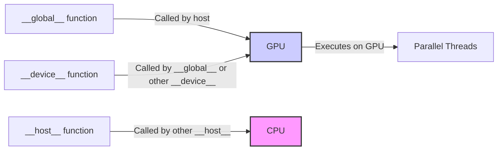
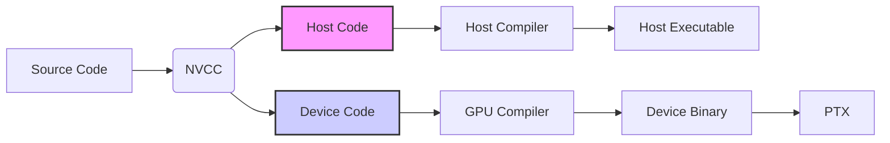
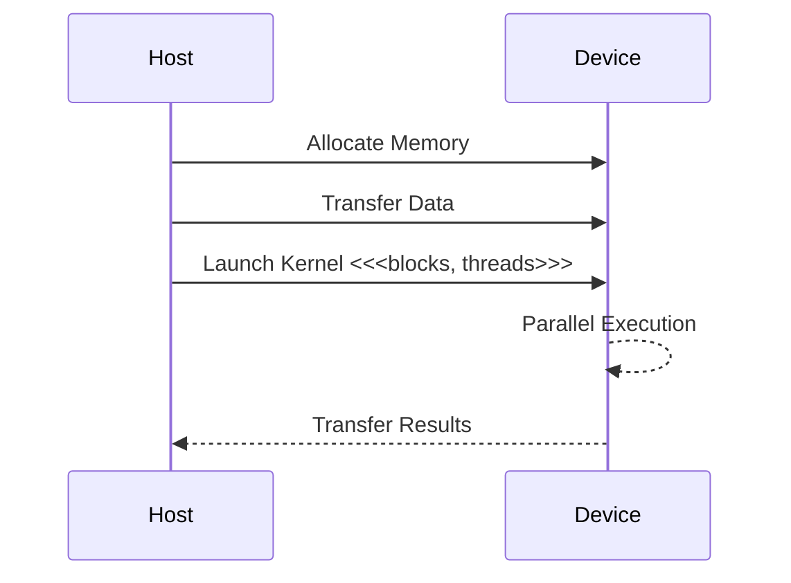

Okay, I will enhance the text with Mermaid diagrams as requested.

## Mixed Host and Device Code in CUDA: Leveraging Heterogeneous Execution

```mermaid
graph LR
    A[Host (CPU)] -- "Data Preparation" --> B(CUDA Driver);
    B -- "Kernel Launch" --> C[Device (GPU)];
    C -- "Parallel Computation" --> D(Memory);
    D -- "Results" --> B;
    B --> A;
    style A fill:#f9f,stroke:#333,stroke-width:2px
    style C fill:#ccf,stroke:#333,stroke-width:2px
```

### Introdução

Em CUDA, a flexibilidade da linguagem C é estendida para permitir a criação de programas que combinam código executado no *host* (CPU) com código executado no *device* (GPU) [^3]. Essa característica permite que aplicações complexas sejam divididas em partes que podem ser executadas no processador mais adequado, com o objetivo de maximizar a eficiência e o desempenho. A capacidade de misturar código de *host* e *device* é um elemento fundamental na programação CUDA, e o entendimento de como isso funciona é essencial para o desenvolvimento de aplicações que utilizem plenamente o potencial de sistemas heterogêneos. Este capítulo explora o conceito de código misto *host* e *device*, detalhando como as funções são definidas e executadas em cada processador, como o NVCC gerencia a compilação desse código misto, e quais são as melhores práticas para otimizar o uso desse recurso, sempre baseado no contexto fornecido.

### Qualificadores de Função: `__global__`, `__device__` e `__host__`

Em CUDA, a distinção entre o código do *host* e do *device* é feita através de *qualificadores de função*, que determinam onde a função será executada e de onde ela poderá ser chamada. Os três qualificadores principais são:

1.  `__global__`: Funções declaradas com esse qualificador são *kernels*, ou seja, funções que serão executadas no *device* (GPU) e podem ser chamadas pelo *host* (CPU). *Kernels* são pontos de entrada para a execução paralela na GPU [^15].
2.  `__device__`: Funções declaradas com esse qualificador são executadas no *device* (GPU) e podem ser chamadas somente por outras funções executadas no *device* (incluindo *kernels* e outras funções *device*). Funções `__device__` são utilizadas para modularizar o código do device e são usadas pelos kernels.
3.  `__host__`: Funções declaradas com esse qualificador são executadas no *host* (CPU) e podem ser chamadas apenas pelo código do *host*. Funções sem qualificador são consideradas `__host__` por padrão. Funções `__host__` são usadas para controlar o fluxo de execução e gerenciar a memória e as transferências de dados entre os processadores.

**Conceito 1: Definição e Uso dos Qualificadores de Função**

Os qualificadores de função são usados para especificar onde a função será executada e de onde ela poderá ser chamada. Uma função declarada com `__global__` é um *kernel* e será executada na GPU e chamada pela CPU. Uma função declarada com `__device__` será executada na GPU, e poderá ser chamada por outras funções que também são executadas na GPU. Uma função declarada com `__host__` será executada no CPU e poderá ser chamada somente por outras funções que também são executadas no CPU. Funções que não possuem qualificador são, por padrão, funções `__host__`.



**Lemma 1:** O uso correto dos qualificadores de função é essencial para garantir que o código seja executado no local correto, e para permitir a interação eficiente entre o *host* e o *device*.

**Prova:** Uma chamada incorreta de funções, ou mesmo o uso incorreto dos qualificadores de função, pode causar erros de compilação e também erros de execução, impedindo que o programa funcione corretamente. A separação e o uso correto dos qualificadores de função permitem o uso eficiente da arquitetura heterogênea. $\blacksquare$

**Corolário 1:** O entendimento do uso correto dos qualificadores de função é fundamental para o desenvolvimento de aplicações CUDA que utilizam o modelo *host-device* com sucesso.

### Compilação de Código Misto: NVCC



A compilação de código misto *host* e *device* é feita utilizando o compilador NVCC (NVIDIA CUDA Compiler) [^3]. O NVCC é responsável por separar o código que será executado no *host* do código que será executado no *device*, gerar código binário para cada uma das arquiteturas e realizar os *links* necessários entre as bibliotecas. O NVCC utiliza os qualificadores de função para identificar o código que deve ser compilado para cada processador.

**Conceito 2: O Processo de Compilação com NVCC**

O NVCC processa os arquivos de código fonte, separando o código do *host* e do *device*. O código do *host* é compilado utilizando um compilador C/C++ padrão e o código do *device* é compilado pelo compilador just-in-time (JIT) do NVCC, que gera o código binário que será executado na GPU. O NVCC também gera um código binário intermediário, chamado de PTX (Parallel Thread Execution), que pode ser otimizado para diferentes arquiteturas de GPU. O processo de compilação envolve a identificação dos qualificadores, a separação do código e a geração de arquivos objeto, *linkando* as bibliotecas necessárias.

**Lemma 2:** O NVCC é fundamental para compilar código misto, e gera arquivos executáveis para as arquiteturas de CPU e GPU, de forma que o código possa ser executado em sistemas heterogêneos.

**Prova:** O NVCC separa o código do host e do device com base nos qualificadores e utiliza compiladores específicos para gerar o código executável em cada processador. Esse processo é fundamental para a execução da aplicação. $\blacksquare$

A figura ilustra o processo de compilação com o NVCC, onde o código fonte é separado em *host* e *device*, e compilado por diferentes compiladores, gerando o executável que será executado em cada processador.

**Prova do Lemma 2:** O NVCC é capaz de separar o código e compilar o código com compiladores específicos, gerando o código executável para cada processador e garantindo a execução correta da aplicação. $\blacksquare$

**Corolário 2:** O NVCC é a ferramenta essencial para compilar e construir aplicações CUDA que utilizam código misto *host* e *device*, e o entendimento de seu processo de compilação é fundamental para o sucesso do desenvolvimento em CUDA.

### Interação entre Host e Device: Chamada de Kernels

A interação entre o *host* e o *device* ocorre principalmente através da chamada de *kernels* pelo código do *host*. O *host* prepara os dados, os transfere para o *device*, lança o *kernel*, e depois recebe os resultados do processamento. Essa interação envolve a alocação de memória no *host* e no *device*, a transferência de dados e o lançamento do *kernel*.

**Conceito 3:  Lançamento de Kernels a partir do Host**

O lançamento de *kernels* é realizado através da sintaxe `<<<blocks, threads>>>`, que especifica a quantidade de blocos e *threads* que serão utilizados para a execução do *kernel* [^17]. Essa sintaxe é utilizada apenas para funções declaradas com `__global__`, que são executadas no *device* e chamadas pelo *host*. O *host* envia os parâmetros que serão utilizados pelo *kernel* e a GPU executa o *kernel* de forma paralela nos milhares de *threads* disponíveis.



**Lemma 3:** A chamada de *kernels* pelo *host* é o mecanismo principal de interação entre o *host* e o *device*, e é a forma através da qual o *host* delega tarefas computacionais para a GPU.

**Prova:** O código do host prepara os dados, aloca a memória necessária e, através da chamada de kernels, delega a execução paralela para a GPU. A interação entre os dois processadores é essencial para o funcionamento da aplicação. $\blacksquare$

O código a seguir mostra como a adição de vetores é realizada através da chamada do *kernel* pelo *host*, utilizando a sintaxe `<<<blocks, threads>>>`.

```c++
int threadsPerBlock = 256;
int blocksPerGrid = ceil((float)n / threadsPerBlock);

vecAddKernel<<<blocksPerGrid, threadsPerBlock>>>(d_A, d_B, d_C, n);
```
Nesse código, a variável `vecAddKernel` é a função que será executada no *device*, e a sintaxe `<<<blocksPerGrid, threadsPerBlock>>>` é usada para especificar a quantidade de blocos e *threads* que serão utilizados para a execução.

**Prova do Lemma 3:** O *host* é responsável pela inicialização e configuração, e o lançamento de *kernels* delega as tarefas paralelas para o *device*. Essa interação é fundamental para o uso eficiente da arquitetura heterogênea. $\blacksquare$

**Corolário 3:** O lançamento correto dos *kernels* e a passagem dos parâmetros necessários é essencial para garantir a execução eficiente da computação paralela na GPU.

### Otimização do Código Misto Host-Device

**Pergunta Teórica Avançada:** Como a escolha do tipo de memória, a minimização da transferência de dados, e a sobreposição da execução do *host* e do *device* afetam o desempenho de aplicações que utilizam código misto em CUDA?

**Resposta:** A escolha do tipo de memória, a minimização da transferência de dados e a sobreposição de execução do *host* e do *device* são técnicas fundamentais para otimizar o desempenho de aplicações que utilizam código misto em CUDA.

1.  **Escolha do Tipo de Memória:** A escolha correta do tipo de memória é fundamental para o desempenho da aplicação. O uso da memória global é inevitável para os dados que precisam ser acessados por todos os *threads*, mas ela tem uma alta latência. O uso da memória compartilhada entre os *threads* de um mesmo bloco tem uma baixa latência e um *bandwidth* maior, e é importante para a troca de dados entre *threads*.

2.  **Minimização da Transferência de Dados:** A transferência de dados entre o *host* e o *device* pode se tornar um gargalo. Utilizar memória *pinned* no *host*, técnicas de *coalescing* dos acessos à memória global na GPU, e transferências assíncronas, são técnicas que permitem reduzir o tempo gasto nas transferências.

3.  **Sobreposição da Execução:** O *overlapping* entre a computação na GPU e o *host* é essencial para maximizar o uso do hardware. O uso de *streams* permite que as operações de transferência e o lançamento dos *kernels* sejam executados em paralelo.

**Lemma 4:** A escolha adequada do tipo de memória, a minimização da transferência de dados e a sobreposição da execução do *host* e do *device* são técnicas essenciais para maximizar o desempenho de aplicações CUDA que utilizam código misto.

**Prova:** O uso eficiente da memória, a redução de transferências de dados e o uso paralelo do *host* e do *device* reduzem o tempo total de execução e otimizam o desempenho. $\blacksquare$

A escolha da memória correta, a minimização das transferências de dados e o *overlapping* da execução são cruciais para alcançar o máximo desempenho em aplicações que utilizam o modelo *host-device*, e a combinação dessas técnicas leva a resultados superiores do que o uso isolado de cada técnica.

**Prova do Lemma 4:**  A escolha adequada da memória e das técnicas otimização permite que o *host* e o *device* trabalhem em paralelo, diminuindo o tempo de espera e maximizando o uso dos recursos. $\blacksquare$

**Corolário 4:** O uso combinado das técnicas de otimização permite o desenvolvimento de aplicações que exploram ao máximo o potencial do modelo *host-device* e da arquitetura de hardware em CUDA.

### Desafios e Limitações do Código Misto

**Pergunta Teórica Avançada:** Quais são os principais desafios e limitações no uso de código misto *host* e *device* em CUDA, e como esses desafios podem ser abordados na prática?

**Resposta:** O uso de código misto *host* e *device* apresenta alguns desafios e limitações, que precisam ser considerados para o desenvolvimento de aplicações robustas e eficientes:

1.  **Gerenciamento da Complexidade:** O gerenciamento da complexidade do código é um desafio, já que o programador precisa entender a interação entre o *host* e o *device* e o uso correto dos qualificadores de função e da API CUDA.
2.  **Depuração:** A depuração de código misto pode ser mais difícil, já que o código é executado em diferentes processadores, e o depurador precisa ser capaz de trabalhar em conjunto com o *host* e o *device*.
3.  **Portabilidade:** O código pode ser menos portável entre diferentes arquiteturas, já que o código do *device* é compilado para uma arquitetura específica.
4.  **Desempenho:** A transferência de dados e a sincronização entre o *host* e o *device* podem se tornar gargalos, se não forem otimizadas corretamente.

**Lemma 5:** A complexidade do código, a dificuldade de depuração, a portabilidade e os gargalos de desempenho são os principais desafios no uso de código misto *host* e *device* em CUDA.

**Prova:** Esses problemas são inerentes à arquitetura heterogênea, e a solução desses problemas requer o uso de técnicas de otimização e o conhecimento do sistema. $\blacksquare$

Para abordar esses desafios, é necessário um conhecimento profundo da arquitetura CUDA, da API, e do comportamento da aplicação em diferentes níveis de paralelismo. O uso de ferramentas de depuração adequadas, a análise do *profiling* da aplicação, e a otimização do código, permitem minimizar os efeitos negativos desses problemas.

**Prova do Lemma 5:** Os problemas mencionados impedem o máximo desempenho da aplicação e exigem um cuidado redobrado por parte dos desenvolvedores, o que pode aumentar o tempo e custo de desenvolvimento. $\blacksquare$

**Corolário 5:** O desenvolvimento de aplicações eficientes que utilizam código misto *host* e *device* requer um planejamento cuidadoso e o conhecimento da arquitetura e da API CUDA.

### Conclusão

O código misto *host* e *device* é uma característica essencial da programação CUDA. Os qualificadores de função `__global__`, `__device__` e `__host__` permitem definir onde cada função será executada, e como a interação entre o *host* e o *device* será feita. O NVCC compila o código misto, gerando executáveis para cada processador. A chamada de *kernels* a partir do *host* é o principal mecanismo para realizar a computação paralela na GPU. A otimização da transferência de dados, o uso adequado da memória e a sobreposição da execução do *host* e do *device* são cruciais para o desempenho. A compreensão de todos esses aspectos e seus desafios é fundamental para o desenvolvimento de aplicações CUDA de alto desempenho.

### Referências

[^3]: "The structure of a CUDA program reflects the coexistence of a host (CPU) and one or more devices (GPUs) in the computer. Each CUDA source file can have a mixture of both host and device code." *(Trecho de <página 43>)*

[^15]: "First, there is a CUDA specific keyword `__global__` in front of the declaration of `vecAddKernel()`. This keyword indicates that the function is a kernel and that it can be called from a host function to generate a grid of threads on a device." *(Trecho de <página 55>)*

[^17]: "When the host code launches a kernel, it sets the grid and thread block dimensions via execution configuration parameters. This is illustrated in Figure 3.13." *(Trecho de <página 57>)*
