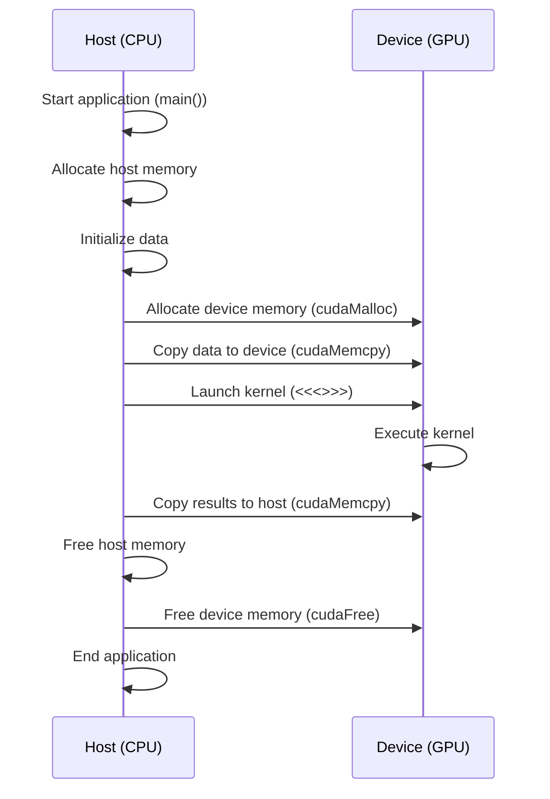
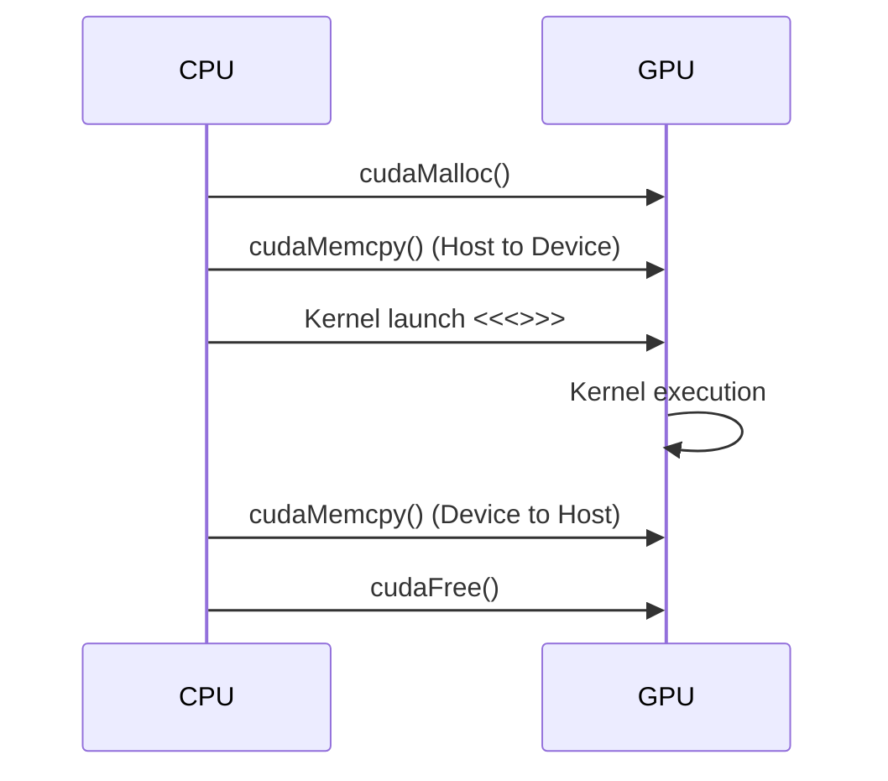

Okay, I've analyzed the text and added Mermaid diagrams to enhance understanding where appropriate. Here's the enhanced text:

## Default Host Code in CUDA: Understanding Implicit Execution on the CPU



### Introdução

Em CUDA, o código que não possui um qualificador de função explícito (`__global__`, `__device__` ou `__host__`) é considerado código de *host* por padrão, sendo automaticamente executado na CPU. Essa característica permite que desenvolvedores utilizem a linguagem C padrão para implementar as partes não paralelas das aplicações, enquanto utilizam as funcionalidades CUDA para realizar a computação paralela na GPU. Este capítulo explora o conceito de **código de *host* padrão** em CUDA, detalhando como esse código é executado, como ele interage com a parte do código que é executada no *device* (GPU), e como ele é gerenciado pelo compilador NVCC e pela API CUDA. O objetivo é proporcionar uma compreensão clara de como o código padrão do *host* se encaixa na arquitetura heterogênea de CUDA, e como ele pode ser utilizado para desenvolver aplicações eficientes, sempre com base nas informações do contexto fornecido.

### Código de Host Padrão: Execução na CPU

O código de *host* padrão em CUDA consiste em todas as funções e declarações que não possuem qualificadores `__global__` ou `__device__`. Este código é implicitamente executado na CPU e, portanto, pode utilizar todas as funcionalidades da linguagem C/C++, incluindo alocação de memória, operações de entrada e saída, e chamadas a bibliotecas externas [^16]. A função `main()`, por exemplo, é considerada uma função de *host* por padrão, e é onde a execução da aplicação começa.

**Conceito 1: Execução Implícita na CPU**

O código de *host* padrão é executado na CPU de forma sequencial, como qualquer programa C/C++. Esse código é responsável por gerenciar o fluxo de execução da aplicação, realizar operações de controle, alocar memória, transferir dados para a GPU e coordenar a execução dos *kernels*. O código de *host* pode utilizar qualquer funcionalidade oferecida pela linguagem C, incluindo laços, condições, funções e outras estruturas de controle de fluxo. O código de *host* também é responsável por inicializar os dados e garantir que eles estejam disponíveis para os *kernels* da GPU.

**Lemma 1:** O código de *host* padrão é o componente que orquestra a execução da aplicação CUDA, e gerencia os recursos do sistema e a interação com o *device*.

**Prova:** O código do *host* é responsável por definir o fluxo de execução, inicializar os dados, alocar a memória e lançar os *kernels* que serão executados na GPU. O *host* controla toda a execução, utilizando a arquitetura heterogênea a seu favor. $\blacksquare$

O código abaixo é um exemplo de código de *host* padrão, onde a função `main()` aloca memória, inicializa vetores e chama a função `vecAdd`, que realiza a adição de vetores na GPU (como descrito no capítulo anterior).

```c++
int main() {
    int n = 1024;
    int size = n * sizeof(float);
    float *h_A, *h_B, *h_C;

    // Allocate host memory
    h_A = (float*)malloc(size);
    h_B = (float*)malloc(size);
    h_C = (float*)malloc(size);

    // Initialize vectors
    for(int i = 0; i < n; i++) {
        h_A[i] = (float)i;
        h_B[i] = (float)(n - i);
    }

    // Call vecAdd function (which calls the kernel)
    vecAdd(h_A, h_B, h_C, n);

    // Free host memory
    free(h_A);
    free(h_B);
    free(h_C);

    return 0;
}
```

**Corolário 1:** O código de *host* padrão é fundamental para o funcionamento de uma aplicação CUDA, pois ele define o fluxo de execução, inicializa os dados, aloca memória e gerencia a interação com o *device*.

### Compilação e Execução do Código de Host Padrão

O código de *host* padrão é compilado pelo compilador C/C++ padrão do sistema, como `gcc` ou `g++`, através do NVCC [^3]. O NVCC separa o código de *host* do código de *device* e usa o compilador padrão para gerar o código objeto para a CPU. Este código é então *linkado* com as bibliotecas CUDA e outras bibliotecas para gerar o executável da aplicação. O código de *host* é executado sequencialmente no CPU, coordenando a execução das tarefas.

**Conceito 2: Processo de Compilação e Execução**

O NVCC é responsável por separar o código de *host* do código de *device* e enviar o código do *host* para o compilador padrão do sistema, gerando um arquivo objeto que será *linkado* com as bibliotecas CUDA para gerar o executável final. A execução do código do *host* inicia a aplicação, que então coordena a execução paralela na GPU, através da chamada de *kernels*.

```mermaid
flowchart LR
    A[Source Code (.cu)] --> B(NVCC Compiler);
    B --> C{Host Code};
    B --> D{Device Code};
    C --> E[C/C++ Compiler];
    D --> F[CUDA Compiler];
    E --> G(Host Object File);
    F --> H(Device Object File);
    G --> I[Linker];
    H --> I;
    I --> J(Executable);
```

**Lemma 2:** O código de *host* padrão é compilado pelo compilador C/C++ padrão e é o ponto de entrada para a execução da aplicação CUDA, sendo responsável por inicializar o ambiente e gerenciar os recursos do sistema.

**Prova:** O NVCC utiliza o compilador C/C++ para compilar o código *host* e depois *linka* esse código com as bibliotecas CUDA, gerando um executável que é executado na CPU, orquestrando todas as operações. $\blacksquare$

O diagrama ilustra o processo de compilação do código misto, onde o código do *host* (padrão) é enviado para o compilador C/C++, e o código do *device* é enviado para o compilador CUDA, e a ligação de todos os arquivos objeto gera o executável final.

**Prova do Lemma 2:** O NVCC separa o código, envia-o para os compiladores apropriados e, no final, une todas as partes para gerar um código executável que é iniciado na CPU. $\blacksquare$

**Corolário 2:** O código de *host* padrão é fundamental para o funcionamento da aplicação CUDA e é o ponto inicial da execução, sendo responsável por inicializar os recursos, lançar os *kernels* na GPU e coordenar o fluxo de execução.

### Interação do Código de Host Padrão com o Device

A interação do código de *host* padrão com o *device* ocorre principalmente através da chamada de funções CUDA da API, que realizam tarefas como a alocação de memória no *device*, a transferência de dados entre o *host* e o *device*, o lançamento de *kernels* e a transferência dos resultados de volta para o *host*. Todas essas interações são realizadas através do uso da API CUDA.

**Conceito 3: Chamada de Funções da API CUDA**

O código de *host* utiliza funções da API CUDA, como `cudaMalloc()`, `cudaMemcpy()` e `cudaFree()`, para gerenciar a memória do *device* e realizar transferências de dados [^9, 11]. O lançamento de *kernels* é também feito através do código do *host*, utilizando a sintaxe `<<<blocks, threads>>>`. Essas funções são chamadas pelo código de *host* e a implementação real da função ocorre no *device*. O *host* orquestra as operações e o *device* realiza as computações paralelas.



**Lemma 3:** O código de *host* padrão interage com o *device* através da chamada de funções da API CUDA, que permitem controlar a execução dos *kernels* na GPU, e o gerenciamento da memória do *device*.

**Prova:** O código do *host* aloca memória no *device*, copia os dados do *host* para o *device*, lança os *kernels*, e recebe os dados do *device*. Essa interação é realizada por meio das chamadas de função da API CUDA, o que permite que a CPU controle a execução na GPU. $\blacksquare$

O exemplo a seguir demonstra como as funções da API CUDA são utilizadas para a alocação de memória, a transferência de dados e o lançamento do *kernel* de adição de vetores.

```c++
void vecAdd(float* h_A, float* h_B, float* h_C, int n) {
    int size = n * sizeof(float);
    float *d_A, *d_B, *d_C;

    // Allocate device memory
    cudaMalloc((void**)&d_A, size);
    cudaMalloc((void**)&d_B, size);
    cudaMalloc((void**)&d_C, size);

    // Copy data to device
    cudaMemcpy(d_A, h_A, size, cudaMemcpyHostToDevice);
    cudaMemcpy(d_B, h_B, size, cudaMemcpyHostToDevice);

    // Launch kernel
    int threadsPerBlock = 256;
    int blocksPerGrid = ceil((float)n / threadsPerBlock);
    vecAddKernel<<<blocksPerGrid, threadsPerBlock>>>(d_A, d_B, d_C, n);

    // Copy results back to host
    cudaMemcpy(h_C, d_C, size, cudaMemcpyDeviceToHost);

    // Free device memory
    cudaFree(d_A);
    cudaFree(d_B);
    cudaFree(d_C);
}
```
Nesse exemplo, a função `vecAdd` é uma função de *host* padrão que utiliza as funções da API CUDA para interagir com a GPU, controlando a execução da aplicação e delegando o processamento para a GPU.

**Prova do Lemma 3:** A interação do código do *host* com o *device* é feita utilizando as funções da API CUDA, que permitem a utilização e gerenciamento dos recursos da GPU. $\blacksquare$

**Corolário 3:** O código de *host* padrão utiliza as funções da API CUDA para gerenciar o *device*, alocar memória, transferir dados, executar os *kernels*, e sincronizar a execução das tarefas, formando a base da execução paralela em CUDA.

### Otimização do Código de Host Padrão

**Pergunta Teórica Avançada:** Como as técnicas de *overlapping* de transferências de dados e a escolha eficiente do tamanho dos dados a serem transferidos, afetam o desempenho do código de *host* padrão em aplicações CUDA?

**Resposta:** A otimização do código de *host* padrão envolve principalmente a redução da sobrecarga da transferência de dados entre o *host* e o *device*, a minimização do tempo de execução do código no *host*, e a maximização do uso da GPU. Técnicas como *overlapping* de transferências de dados e a escolha eficiente do tamanho dos dados afetam diretamente o desempenho.

1.  ***Overlapping* de Transferências:** O *overlapping* de transferência de dados com o processamento na GPU permite maximizar o uso do *hardware* e diminuir o tempo de espera da GPU enquanto os dados são enviados pelo *host*. Isso pode ser feito utilizando *streams* e transferências assíncronas.

2.  **Escolha do Tamanho dos Dados:** A escolha de tamanhos de transferência de dados que maximizem a utilização da largura de banda do barramento PCI-e, evita transferências de dados excessivas e garante que os dados sejam transferidos de forma eficiente, com menos *overhead*. O tamanho ideal depende da arquitetura de hardware.

**Lemma 4:** O *overlapping* de transferências e a escolha eficiente do tamanho dos dados são essenciais para otimizar o desempenho do código de *host* padrão e garantir que o desempenho da aplicação não seja limitado pelas operações de transferência.

**Prova:** O *overlapping* das operações permite que o *host* e o *device* trabalhem em paralelo e a escolha do tamanho dos dados permite que a transferência seja realizada de forma eficiente e rápida.  $\blacksquare$

Utilizar memória *pinned* no *host* para as transferências e utilizar técnicas de *coalescing* na GPU, para garantir que as transferências sejam realizadas de forma eficiente, podem melhorar o desempenho da aplicação, e garantir que a GPU seja utilizada ao máximo.

**Prova do Lemma 4:** A utilização do *overlapping* e da escolha adequada dos tamanhos de dados reduz o tempo de ociosidade da GPU durante a espera por dados e maximiza a taxa de transferência do sistema. $\blacksquare$

**Corolário 4:** O uso das técnicas de otimização permite que o código de *host* padrão não se torne um gargalo para o desempenho da aplicação, e garante que a GPU possa trabalhar de forma eficiente e paralela.

### Limitações e Desafios do Código de Host Padrão

**Pergunta Teórica Avançada:** Quais são as principais limitações e desafios no uso de código de *host* padrão em aplicações CUDA, e como esses desafios podem ser abordados na prática?

**Resposta:** Apesar da sua importância, o código de *host* padrão pode apresentar algumas limitações e desafios:

1.  **Execução Sequencial:** O código de *host* padrão é executado sequencialmente na CPU, o que pode se tornar um gargalo em aplicações que exigem grandes quantidades de processamento no *host*.

2.  **Transferências de Dados:** A transferência de dados entre o *host* e o *device* pode ser um gargalo, já que a largura de banda do barramento PCI-e é limitada, e as transferências adicionam latência no processo.

3.  **Complexidade de Gerenciamento:** O código de *host* padrão é responsável por gerenciar a memória do *host* e do *device*, a transferência dos dados e o lançamento dos *kernels*, e o gerenciamento incorreto desses recursos pode levar a erros e baixo desempenho.

4.  **Otimização:** O código de *host* precisa ser otimizado para utilizar corretamente a arquitetura heterogênea, o que exige conhecimento da arquitetura e do modelo de programação em CUDA.

**Lemma 5:** A execução sequencial, a sobrecarga da transferência de dados e a complexidade do gerenciamento e otimização, podem limitar o desempenho de aplicações CUDA, se o código de *host* padrão não for implementado de forma eficiente.

**Prova:** A execução sequencial no *host* pode ser um gargalo, assim como a transferência de dados e o gerenciamento incorreto dos recursos, levando a uma diminuição do desempenho da aplicação. $\blacksquare$

Para abordar essas limitações, é necessário utilizar técnicas de otimização e um design cuidadoso da aplicação, de forma que o código do *host* possa coordenar a execução da aplicação de forma eficiente, e utilizar os recursos da GPU de forma otimizada. O *profiling* da aplicação pode indicar onde os gargalos ocorrem para que eles possam ser tratados de forma adequada.

**Prova do Lemma 5:**  O *overhead* de execução do código no *host* e a transferência de dados e sua má otimização podem limitar o desempenho geral da aplicação. $\blacksquare$

**Corolário 5:** O desenvolvimento de aplicações eficientes em CUDA exige que o código do *host* padrão seja implementado de forma eficiente, utilizando técnicas de otimização que minimizem os efeitos das limitações inerentes ao código *host* e ao modelo *host-device*.

### Conclusão

O código de *host* padrão é um componente fundamental para o funcionamento de aplicações CUDA, sendo responsável por inicializar os recursos, gerenciar a memória, transferir os dados, lançar os *kernels* na GPU e receber os resultados do processamento. A compreensão da interação entre o código de *host* padrão e o *device*, o gerenciamento da memória, a transferência de dados e a otimização do desempenho são essenciais para o desenvolvimento de aplicações CUDA eficientes, que aproveitem ao máximo a arquitetura heterogênea dos sistemas computacionais. A implementação do *overlapping* e a escolha do tamanho dos dados transferidos podem fazer uma grande diferença no desempenho final da aplicação.

### Referências

[^3]: "The structure of a CUDA program reflects the coexistence of a host (CPU) and one or more devices (GPUs) in the computer. Each CUDA source file can have a mixture of both host and device code." *(Trecho de <página 43>)*

[^9]:  "The CUDA runtime system provides Application Programming Interface (API) functions to perform these activities on behalf of the programmer." *(Trecho de <página 48>)*

[^11]: "Once the host code has allocated device memory for the data objects, it can request that data be transferred from host to device. This is accomplished by calling one of the CUDA API functions." *(Trecho de <página 51>)*

[^14]: "Each thread in a block has a unique threadIdx value... In Figure 3.10, a data index i is calculated as i = blockIdx.x * blockDim.x + threadIdx.x." *(Trecho de <página 54>)*

[^15]: "First, there is a CUDA specific keyword `__global__` in front of the declaration of `vecAddKernel()`. This keyword indicates that the function is a kernel and that it can be called from a host function to generate a grid of threads on a device." *(Trecho de <página 55>)*

[^16]: "The_host_ keyword indicates that the function being declared is a CUDA host function. A host function is simply a traditional C function that executes on the host and can only be called from another host function. By default, all functions in a CUDA program are host functions if they do not have any of the CUDA keywords in their declaration." *(Trecho de <página 56>)*

[^17]: "When the host code launches a kernel, it sets the grid and thread block dimensions via execution configuration parameters. This is illustrated in Figure 3.13." *(Trecho de <página 57>)*

Deseja que eu continue com as próximas seções?
