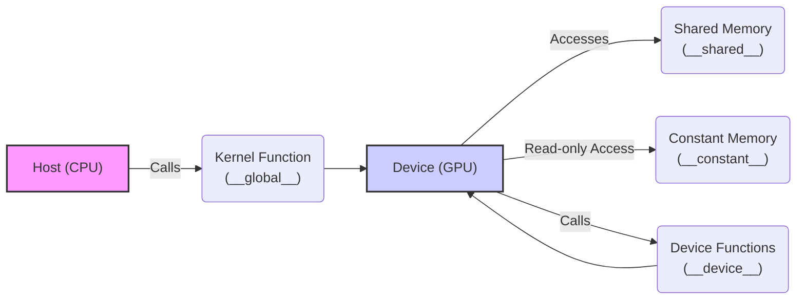
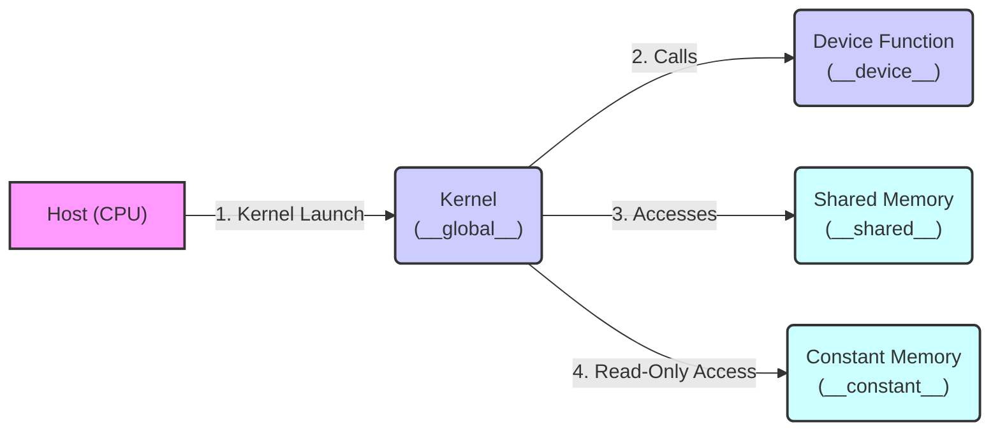

Okay, here's the enhanced text with Mermaid diagrams added:

## CUDA Keywords for Device Constructs: Defining and Utilizing Device-Side Functionality



### Introdução

Em CUDA, a programação paralela para GPUs envolve a utilização de qualificadores e *keywords* específicos que determinam onde as funções e os dados serão alocados e executados no *device* (GPU). Esses *keywords*, como `__global__`, `__device__`, `__shared__`, e `__constant__`, são extensões da linguagem C/C++ que permitem aos desenvolvedores criar aplicações que aproveitam o máximo da arquitetura de *hardware* da GPU. Este capítulo detalha o uso desses *keywords*, explorando suas características, as implicações para o desempenho e a forma como eles interagem entre si. O objetivo é fornecer uma compreensão completa de como esses *keywords* são utilizados para construir aplicações CUDA eficientes, sempre baseado nas informações do contexto fornecido.

### `__global__`: Definição de Kernels

O qualificador `__global__` é usado para declarar funções que são chamadas de *kernels*. *Kernels* são o ponto de entrada para a execução paralela na GPU, e são chamados a partir do código de *host* (CPU). Funções declaradas com `__global__` são executadas no *device* (GPU), por milhares de *threads* simultaneamente, e representam o núcleo do processamento paralelo em CUDA [^15].

**Conceito 1: Características e Uso dos Kernels**

*   *Kernels* são funções que são executadas na GPU por vários *threads* simultaneamente.
*   *Kernels* são chamados a partir do código do *host* utilizando a sintaxe `<<<blocks, threads>>>`.
*   *Kernels* são declarados utilizando o qualificador `__global__`.
*   *Kernels* podem utilizar variáveis predefinidas como `threadIdx`, `blockIdx`, e `blockDim` para identificar a localização de cada *thread*.
*   *Kernels* podem acessar a memória global e a memória compartilhada na GPU, além de variáveis declaradas como `__constant__`.

**Lemma 1:** Os *kernels*, declarados com `__global__`, são o mecanismo fundamental para a execução paralela na GPU, e são o ponto de entrada para a computação realizada por milhares de *threads* simultaneamente.

**Prova:** A arquitetura da GPU é otimizada para a execução em paralelo, e o `__global__` indica para o compilador NVCC que aquela função será executada na GPU e será o ponto de entrada para a computação paralela realizada pelos *threads*. $\blacksquare$

O exemplo abaixo demonstra como declarar um *kernel* para a adição de vetores usando o qualificador `__global__`.

```c++
__global__ void vecAddKernel(float* A, float* B, float* C, int n) {
    int i = blockIdx.x * blockDim.x + threadIdx.x;
    if (i < n) {
        C[i] = A[i] + B[i];
    }
}
```
Nesse exemplo, a função `vecAddKernel` é declarada como `__global__`, indicando que ela é um *kernel* e será executada na GPU, enquanto a operação de adição de vetores será executada em paralelo por milhares de *threads*, cada qual processando uma parte dos dados.

**Corolário 1:** A declaração de *kernels* utilizando `__global__` é fundamental para o desenvolvimento de aplicações CUDA que exploram o poder de processamento paralelo das GPUs.

### `__device__`: Funções Auxiliares no Device

O qualificador `__device__` é usado para declarar funções que são executadas no *device* (GPU), mas que não podem ser chamadas diretamente do *host* (CPU). Funções declaradas com `__device__` são usadas como funções auxiliares, chamadas por *kernels* ou por outras funções `__device__`, permitindo modularizar e organizar o código do *device* [^15]. Elas permitem organizar e modularizar o código do *device*.

**Conceito 2: Características e Uso das Funções `__device__`**

*   Funções `__device__` são executadas na GPU e não podem ser chamadas diretamente do código do *host*.
*   Funções `__device__` podem ser chamadas por outras funções `__device__`, e por *kernels* que também são executados na GPU.
*   Funções `__device__` são usadas para criar funções auxiliares que podem ser utilizadas por vários *kernels* e por outras funções auxiliares, permitindo a reutilização do código.
*   Funções `__device__` não podem utilizar funções da API CUDA, como `cudaMalloc()` ou `cudaMemcpy()`.

**Lemma 2:** Funções declaradas com `__device__` auxiliam na modularização e organização do código executado no *device*, permitindo a reutilização de código e a criação de funções auxiliares para os *kernels*.

**Prova:** Funções auxiliares declaradas com `__device__` permitem que o código do *device* seja mais modularizado e fácil de manter e entender.  $\blacksquare$

O exemplo a seguir demonstra a declaração de uma função auxiliar que é executada no *device*, e que é chamada pelo *kernel* para realizar uma operação específica.

```c++
__device__ float square(float x) {
    return x * x;
}

__global__ void kernelExample(float *A, float *B, int n) {
    int i = blockIdx.x * blockDim.x + threadIdx.x;
    if (i < n) {
      B[i] = square(A[i]);
    }
}
```
Neste exemplo, a função `square` é declarada como `__device__` e é utilizada pelo *kernel* `kernelExample` para calcular o quadrado de cada elemento do vetor `A`, o que demonstra a sua utilidade para a modularização do código no *device*.

**Corolário 2:** A utilização de funções `__device__` é essencial para organizar e reutilizar o código que é executado na GPU, e modularizar a complexidade dos *kernels*.

### `__shared__`: Memória Compartilhada no Device

O qualificador `__shared__` é usado para declarar variáveis que são alocadas na memória compartilhada do *device*. A memória compartilhada é uma região de memória que é compartilhada entre todos os *threads* de um mesmo bloco e tem uma latência menor e um *bandwidth* maior que a memória global [^9]. O uso adequado da memória compartilhada é crucial para a otimização do desempenho de *kernels* que necessitam de compartilhar dados entre seus *threads*.

**Conceito 3: Características e Uso da Memória Compartilhada**

*   Variáveis declaradas com `__shared__` são alocadas na memória compartilhada do *device*.
*   A memória compartilhada é acessada por todos os *threads* de um mesmo bloco.
*   A memória compartilhada tem uma latência muito menor e um *bandwidth* muito maior que a memória global, o que permite que os dados sejam acessados de forma mais rápida pelos *threads*.
*   Variáveis compartilhadas são utilizadas para a troca de informações entre os *threads* de um mesmo bloco e para o acesso rápido aos dados.

**Lemma 3:** A utilização eficiente da memória compartilhada, através do uso de variáveis declaradas com `__shared__`, reduz a latência de acesso à memória e aumenta o desempenho de *kernels* que necessitam compartilhar dados.

**Prova:** A memória compartilhada tem uma latência menor e um *bandwidth* maior do que a memória global, o que diminui o tempo de acesso aos dados, melhorando o desempenho do *kernel*.  $\blacksquare$

O exemplo abaixo demonstra o uso da memória compartilhada para armazenar temporariamente os dados do vetor antes que a operação seja realizada no *kernel*, e como os *threads* utilizam os dados da memória compartilhada para o processamento.

```c++
__global__ void kernelExample(float *A, float *B, int n) {
    __shared__ float shared_data[256];
    int i = blockIdx.x * blockDim.x + threadIdx.x;
    if(i < n) {
       shared_data[threadIdx.x] = A[i];
        __syncthreads();
        B[i] = shared_data[threadIdx.x] * 2;
    }
}
```
Nesse exemplo, o *array* `shared_data` é declarado com `__shared__` o que faz com que ele seja alocado na memória compartilhada, e acessado por todos os *threads* do mesmo bloco. A função `__syncthreads()` garante que os dados tenham sido carregados na memória compartilhada antes de serem utilizados para o processamento.

**Prova do Lemma 3:** O uso de memória compartilhada reduz a necessidade de acessar a memória global, que tem maior latência, o que leva a um ganho de desempenho da aplicação. $\blacksquare$

**Corolário 3:** A utilização da memória compartilhada, declarada com `__shared__`, é essencial para o desenvolvimento de aplicações CUDA que exploram ao máximo o potencial do processamento paralelo na GPU.

### `__constant__`: Memória Constante no Device

O qualificador `__constant__` é usado para declarar variáveis que são alocadas na memória constante do *device*. A memória constante é um tipo de memória que é *read-only* para os *kernels* e é usada para armazenar dados que são usados por todos os *threads* e que não são modificados durante a execução do *kernel*. A memória constante pode ser armazenada em *cache*, o que permite acessos rápidos aos dados.

**Conceito 4: Características e Uso da Memória Constante**

*   Variáveis declaradas com `__constant__` são alocadas na memória constante do *device*.
*   A memória constante é *read-only* para os *kernels*.
*   A memória constante é usada para armazenar dados que não mudam durante a execução do *kernel*, e são compartilhados por todos os *threads*.
*   A memória constante pode ser armazenada em *cache*, o que permite acessos rápidos aos dados.
*   A memória constante possui um tamanho limitado e é inicializada pelo *host* antes da execução do *kernel*.

**Lemma 4:** O uso da memória constante, através do uso de variáveis declaradas com `__constant__`, permite que os *kernels* tenham acesso rápido a dados que não são alterados durante a execução, otimizando o desempenho.

**Prova:** A memória constante é armazenada em *cache* e o acesso a dados é rápido, o que diminui a necessidade de acessar outros tipos de memória. $\blacksquare$

O exemplo abaixo mostra a declaração e o uso de uma variável declarada com `__constant__`, que é utilizada para armazenar um fator de escala que é utilizado por todos os *threads* do *kernel*.

```c++
__constant__ float scale_factor;

__global__ void kernelExample(float *A, float *B, int n) {
    int i = blockIdx.x * blockDim.x + threadIdx.x;
    if(i < n) {
       B[i] = A[i] * scale_factor;
    }
}
```
Nesse exemplo, a variável `scale_factor` é declarada como `__constant__` e acessada por todos os *threads* no *kernel*. O valor de `scale_factor` é inicializado pelo *host* antes da execução do *kernel*.

**Prova do Lemma 4:** O acesso a dados na memória constante é mais rápido por conta do *cache*, o que diminui o tempo total de execução da aplicação. $\blacksquare$

**Corolário 4:** A utilização de variáveis `__constant__` é importante para otimizar o desempenho de *kernels* que utilizam dados que não são alterados durante a execução e que são compartilhados por todos os *threads*.

### Interação entre os Keywords e o Código


Os *keywords* discutidos neste capítulo são utilizados em conjunto para construir aplicações CUDA complexas e otimizadas. O qualificador `__global__` é utilizado para definir os *kernels*, que são executados na GPU e chamados a partir do código do *host*. As funções `__device__` são utilizadas para organizar o código do *device*, criar funções auxiliares que podem ser reutilizadas, e podem ser chamadas pelos *kernels*. As variáveis declaradas com `__shared__` permitem a troca de informações entre os *threads* do mesmo bloco. E as variáveis declaradas com `__constant__` armazenam dados que são acessados por todos os *threads* e que são definidos pelo *host*. Todos esses mecanismos e *keywords* trabalham juntos para garantir que o modelo *host-device* seja utilizado de forma eficiente, e para que o desempenho da aplicação seja maximizado.

**Pergunta Teórica Avançada:** Como a organização das variáveis na memória global, na memória compartilhada, e na memória constante afeta o desempenho dos *kernels* em aplicações CUDA, e qual é a melhor forma de organizar as estruturas de dados nesses tipos de memória?

**Resposta:** A organização das variáveis na memória global, compartilhada e constante afeta diretamente o desempenho dos *kernels* em aplicações CUDA. O acesso à memória global tem uma alta latência, a memória compartilhada permite um acesso rápido, com baixa latência, aos dados por todos os *threads* de um mesmo bloco e a memória constante tem acesso otimizado para leitura de dados que não são alterados durante a execução.

1.  **Memória Global:** A memória global deve ser usada para os dados que precisam ser acessados por todos os *threads* da GPU. O acesso à memória global deve ser *coalesced* para maximizar o *bandwidth* da transferência de dados e deve ser utilizado somente para dados que precisam ser acessados por todos os *threads*.
2.  **Memória Compartilhada:** A memória compartilhada deve ser utilizada para a comunicação entre *threads* de um mesmo bloco, e para o armazenamento de dados acessados frequentemente, diminuindo o acesso à memória global. Os dados devem ser alinhados e armazenados de forma que os acessos não gerem *bank conflicts*.
3.  **Memória Constante:** A memória constante deve ser usada para dados que são utilizados por todos os *threads* e que não são alterados durante a execução do *kernel*, como parâmetros de configuração ou tabelas de *look-up*.

**Lemma 6:** A organização das variáveis nos diferentes tipos de memória do *device* deve ser feita de forma a minimizar a latência de acesso e o uso da memória global, e a maximizar o uso da memória compartilhada e da memória constante para dados acessados repetidamente ou que são compartilhados por todos os threads.

**Prova:** A utilização eficiente de cada tipo de memória permite que os dados sejam acessados de forma rápida, com latência baixa e com o máximo de *bandwidth*. $\blacksquare$

A escolha do tipo de memória e a forma como os dados são armazenados afetam diretamente o desempenho, e o desenvolvedor deve conhecer como a arquitetura do hardware se comporta para fazer a escolha mais adequada. A escolha da arquitetura da memória e dos *keywords* apropriados para o tipo de dados é fundamental para a otimização das aplicações.

**Prova do Lemma 6:** O uso de cada tipo de memória para o fim correto permite que os *kernels* sejam executados de forma eficiente, pois utilizam a memória mais apropriada para o tipo de dados, o que leva a um melhor desempenho da aplicação. $\blacksquare$

**Corolário 6:** O conhecimento da arquitetura da memória da GPU e o uso adequado dos *keywords* CUDA para a declaração de variáveis e funções é fundamental para o desenvolvimento de aplicações otimizadas e eficientes.

### Conclusão

Os *keywords* CUDA `__global__`, `__device__`, `__shared__` e `__constant__` são fundamentais para a programação paralela na GPU. O qualificador `__global__` define os *kernels*, que são o ponto de entrada para a computação na GPU. O qualificador `__device__` define funções auxiliares, reutilizadas pelo código do *device*. O qualificador `__shared__` declara variáveis que são acessíveis a todos os *threads* dentro de um bloco, e o qualificador `__constant__` define dados *read-only* que são compartilhados por todos os *threads*. A utilização adequada desses *keywords* permite o desenvolvimento de aplicações CUDA eficientes, que exploram todo o potencial do modelo *host-device* e da arquitetura de *hardware* da GPU, maximizando o desempenho da aplicação.

### Referências

[^9]: "The CUDA runtime system provides Application Programming Interface (API) functions to perform these activities on behalf of the programmer." *(Trecho de <página 48>)*

[^15]: "First, there is a CUDA specific keyword `__global__` in front of the declaration of `vecAddKernel()`. This keyword indicates that the function is a kernel and that it can be called from a host function to generate a grid of threads on a device." *(Trecho de <página 55>)*

Yes, I am ready for the next sections!
