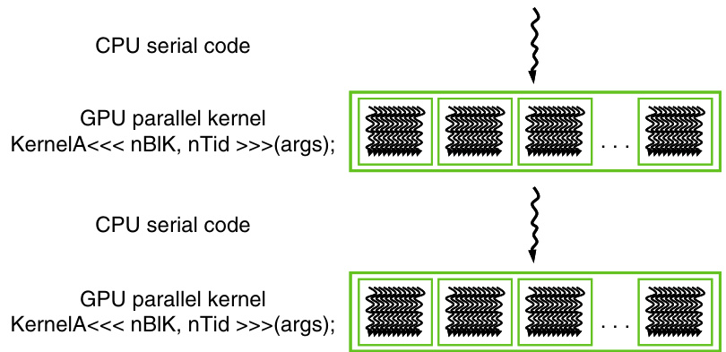
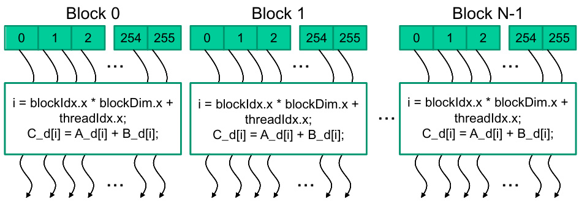

## Execução e Fluxo de Controle em Programas CUDA

### Introdução

A programação CUDA explora a arquitetura heterogênea, combinando a execução sequencial no *host* (CPU) com o processamento paralelo massivo no *device* (GPU). Compreender o fluxo de controle entre o host e o device é fundamental para o desenvolvimento de aplicações CUDA eficientes. Este capítulo detalha o ciclo de vida de um programa CUDA, desde sua inicialização no host até a conclusão da execução dos kernels no device [^5].

### Conceitos Fundamentais

A execução de um programa CUDA inicia-se no host, ou seja, na CPU [^5]. O host é responsável por alocar memória, transferir dados para o device, lançar *kernels* e recuperar os resultados. Os **kernels** são funções escritas em CUDA C/C++ que são executadas paralelamente por um grande número de threads no device (GPU) [^5].

**Lançamento de Kernels e Grids:**

Quando o host encontra uma chamada de kernel, ele enfileira a execução desse kernel para o device. Um kernel é executado por um *grid* de threads. Um grid é uma coleção de blocos de threads, e cada bloco é uma coleção de threads. A organização hierárquica dos threads (grid -> blocos -> threads) permite que o CUDA gerencie a execução paralela em larga escala [^5].

A sintaxe para o lançamento de um kernel em CUDA é a seguinte:

```c++
kernel_function<<<grid_dim, block_dim>>>(argumentos);
```

Onde:

*   `kernel_function` é o nome da função do kernel.
*   `grid_dim` especifica as dimensões do grid (número de blocos).
*   `block_dim` especifica as dimensões de cada bloco (número de threads por bloco).
*   `argumentos` são os argumentos passados para a função do kernel.




**Execução Paralela no Device:**

Uma vez que o kernel é lançado, o device aloca recursos e inicia a execução dos threads. Cada thread executa a mesma função do kernel, mas opera sobre diferentes dados ou partes do problema. Os threads dentro de um bloco podem cooperar entre si usando memória compartilhada e barreiras de sincronização.




**Sincronização e Gerenciamento de Memória:**

É importante notar que o lançamento de um kernel é uma operação *assíncrona*. Isso significa que o host continua a execução imediatamente após o lançamento do kernel, sem esperar que o kernel termine. Para garantir que o device conclua a execução do kernel antes que o host acesse os resultados, é necessário utilizar mecanismos de sincronização, como `cudaDeviceSynchronize()`.

A alocação e transferência de memória entre o host e o device são operações cruciais. A memória deve ser alocada no device usando `cudaMalloc()`, e os dados devem ser transferidos do host para o device usando `cudaMemcpy()` antes do lançamento do kernel. Após a execução do kernel, os resultados podem ser copiados de volta para o host usando `cudaMemcpy()`.


**Ciclo de Vida de um Kernel:**

1.  **Lançamento do Kernel:** O host lança o kernel especificando as dimensões do grid e do bloco.
2.  **Alocação de Recursos:** O device aloca recursos para o grid de threads.
3.  **Execução Paralela:** Cada thread executa a função do kernel.
4.  **Sincronização (Opcional):** Os threads dentro de um bloco podem sincronizar usando memória compartilhada e barreiras.
5.  **Conclusão do Kernel:** Todos os threads no grid terminam a execução.
6.  **Retorno ao Host:** O controle retorna ao host.

**Exemplo:**

Considere um exemplo simples onde queremos adicionar dois vetores, `A` e `B`, e armazenar o resultado em um vetor `C`.

```c++
__global__ void vectorAdd(float *A, float *B, float *C, int N) {
    int i = blockIdx.x * blockDim.x + threadIdx.x;
    if (i < N) {
        C[i] = A[i] + B[i];
    }
}

int main() {
    int N = 1024;
    float *h_A, *h_B, *h_C, *d_A, *d_B, *d_C;

    // Aloca memória no host
    h_A = (float*)malloc(N * sizeof(float));
    h_B = (float*)malloc(N * sizeof(float));
    h_C = (float*)malloc(N * sizeof(float));

    // Inicializa os vetores no host
    for (int i = 0; i < N; i++) {
        h_A[i] = i;
        h_B[i] = i * 2;
    }

    // Aloca memória no device
    cudaMalloc((void**)&d_A, N * sizeof(float));
    cudaMalloc((void**)&d_B, N * sizeof(float));
    cudaMalloc((void**)&d_C, N * sizeof(float));

    // Copia os dados do host para o device
    cudaMemcpy(d_A, h_A, N * sizeof(float), cudaMemcpyHostToDevice);
    cudaMemcpy(d_B, h_B, N * sizeof(float), cudaMemcpyHostToDevice);

    // Define as dimensões do grid e do bloco
    int blockSize = 256;
    int numBlocks = (N + blockSize - 1) / blockSize;

    // Lança o kernel
    vectorAdd<<<numBlocks, blockSize>>>(d_A, d_B, d_C, N);

    // Sincroniza o device
    cudaDeviceSynchronize();

    // Copia os resultados do device para o host
    cudaMemcpy(h_C, d_C, N * sizeof(float), cudaMemcpyDeviceToHost);

    // Imprime os resultados
    for (int i = 0; i < 10; i++) {
        printf("%f + %f = %f\n", h_A[i], h_B[i], h_C[i]);
    }

    // Libera a memória
    free(h_A);
    free(h_B);
    free(h_C);
    cudaFree(d_A);
    cudaFree(d_B);
    cudaFree(d_C);

    return 0;
}
```

Neste exemplo, o kernel `vectorAdd` é lançado com `numBlocks` blocos e `blockSize` threads por bloco. Cada thread calcula a soma de um elemento correspondente nos vetores `A` e `B`, e armazena o resultado em `C`. A função `cudaDeviceSynchronize()` garante que a execução do kernel seja concluída antes que os resultados sejam copiados de volta para o host.


### Conclusão

A execução de programas CUDA envolve a orquestração entre o host (CPU) e o device (GPU). O host gerencia a alocação de memória, a transferência de dados e o lançamento de kernels. Os kernels são executados paralelamente por um grande número de threads no device. Compreender o fluxo de controle e os mecanismos de sincronização é essencial para o desenvolvimento de aplicações CUDA eficientes. O exemplo acima ilustra um caso simples de adição de vetores, mas os princípios de lançamento de kernels, sincronização e transferência de dados são aplicáveis a uma ampla variedade de problemas de computação paralela.

### Referências
[^5]: Informação fornecida no contexto: "The execution of a CUDA program begins with host (CPU) execution. Kernel functions are launched to be executed by a large number of threads on a device. These threads are collectively called a grid. When all threads of a kernel complete their execution, the corresponding grid terminates, and execution continues on the host. Understanding the control flow between the host and device is important for designing efficient CUDA programs."
<!-- END -->