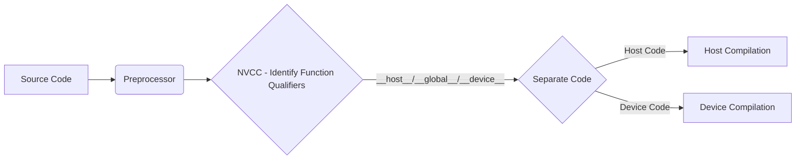
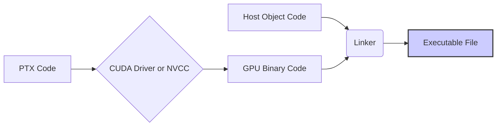
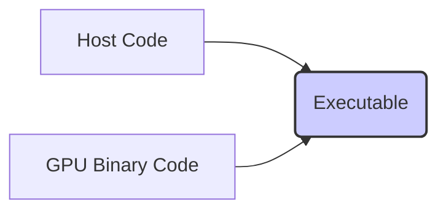

Okay, I've analyzed the text and added Mermaid diagrams to enhance understanding of the NVCC compilation process. Here's the enhanced text:

## The NVCC Compilation Process: A Detailed Look into CUDA Code Compilation

```mermaid
  flowchart TD
      A[Source Code (C/C++ with CUDA)] --> B(Preprocessing);
      B --> C{Separate Host/Device Code};
      C -- Host Code --> D[Compile Host Code (gcc/g++)];
      C -- Device Code --> E[Compile Device Code (NVCC Internal)];
      E --> F[Generate PTX Code];
      F --> G[Generate Binary Code (Specific GPU Arch)];
      D --> H(Linking);
      G --> H;
      H --> I[Executable File];
      style I fill:#ccf,stroke:#333,stroke-width:2px
```

### Introdução

O **NVCC (NVIDIA CUDA Compiler)** é a ferramenta essencial para compilar código CUDA, que mistura código executado na CPU (o *host*) e código executado na GPU (o *device*). O processo de compilação do NVCC é complexo e envolve várias etapas, que garantem a geração de código executável para diferentes arquiteturas. A compreensão detalhada do processo de compilação do NVCC é fundamental para o desenvolvimento de aplicações CUDA eficientes, e para a otimização do código para diferentes plataformas. Este capítulo detalha o processo de compilação do NVCC, explorando cada etapa, os mecanismos de gerenciamento de código *host* e *device*, a geração de código intermediário PTX, a geração de código binário para diferentes arquiteturas, o *linking*, e a geração do executável final, sempre com base nas informações do contexto fornecido.

### Visão Geral do Processo de Compilação NVCC

O processo de compilação do NVCC envolve várias etapas, que podem ser divididas em:

1.  **Pré-processamento:** O código fonte C/C++ com extensões CUDA passa pelo pré-processador C/C++, que lida com as diretivas do pré-processador, como `#include` e `#define`.
2.  **Separação do Código Host e Device:** O NVCC identifica o código que será executado no *host* (CPU) e o código que será executado no *device* (GPU) através dos qualificadores de função, como `__global__`, `__device__` e `__host__`.
3.  **Compilação do Código Host:** O código do *host* é compilado pelo compilador C/C++ padrão do sistema (como `gcc` ou `g++`), gerando o código objeto para a arquitetura da CPU.
4.  **Compilação do Código Device:** O código do *device* é compilado pelo compilador interno do NVCC, gerando um código intermediário, chamado de PTX (Parallel Thread Execution), que é uma representação de baixo nível do código CUDA.
5.  **Geração de Código Binário:** O código PTX é traduzido para código binário específico para a arquitetura da GPU de destino (como *compute capability* 3.5, 5.2, 7.5, etc).
6.  **Linkagem:** O código objeto gerado para o *host* e o código binário gerado para o *device* são *linkados* para criar o executável final. O NVCC também *linka* as bibliotecas CUDA necessárias para o funcionamento da aplicação.
7.  **Geração do Executável:** O resultado final é um arquivo executável que pode ser executado no *host*, e que utiliza a GPU para o processamento paralelo através da execução de *kernels* que foram compilados para o *device*.

**Conceito 1: Etapas do Processo de Compilação**

O processo de compilação do NVCC é uma sequência de etapas que garante que o código fonte em C/C++ com as extensões CUDA seja transformado em um executável que pode ser executado em sistemas heterogêneos. As etapas garantem a separação do código, a compilação para cada processador e a ligação para gerar o executável final.

**Lemma 1:** O NVCC é responsável por coordenar todo o processo de compilação, garantindo que o código seja traduzido corretamente para cada uma das arquiteturas envolvidas, gerando o código binário para o *host* e para o *device*.

**Prova:** O NVCC utiliza diferentes compiladores para gerar o código objeto para cada arquitetura, além de lidar com a geração do código intermediário PTX e da geração do executável final.  $\blacksquare$

O diagrama a seguir ilustra a visão geral do processo de compilação, que envolve a separação do código, o uso de compiladores distintos e a geração do arquivo executável final.

```mermaid
  flowchart LR
      A[Source Code] --> B(Preprocessing);
      B --> C{Separate Host/Device Code};
       C -->|Host Code| D[Host Compiler (gcc/g++)];
      C -->|Device Code| E[NVCC Internal Compiler];
      E --> F[PTX Code];
      F --> G[GPU Binary Code];
      D --> H(Linker);
        G --> H
      H --> I[Executable]
      style I fill:#ccf,stroke:#333,stroke-width:2px
```

**Prova do Lemma 1:** O NVCC separa o código e o envia para os compiladores apropriados, garantindo a compatibilidade entre os dois processadores, e une as partes no final, garantindo a criação do executável. $\blacksquare$

**Corolário 1:** O entendimento do processo de compilação do NVCC é essencial para o desenvolvimento e otimização de aplicações CUDA, e é fundamental para a utilização correta de todos os recursos.

### Pré-processamento e Separação do Código

A primeira etapa do processo de compilação do NVCC é o pré-processamento, que utiliza o pré-processador padrão da linguagem C/C++, como `cpp`. Essa etapa lida com as diretivas do pré-processador, como as inclusões de arquivos (`#include`) e as definições de macros (`#define`). Em seguida, o NVCC identifica os qualificadores de função para separar o código que será executado no *host* do código que será executado no *device* [^3, 15].

**Conceito 2: Papel do Pré-Processador e da Separação do Código**

O pré-processador é responsável por preparar o código para a compilação, através da substituição de macros e da inclusão de arquivos. O NVCC utiliza qualificadores como `__global__`, `__device__` e `__host__` para identificar quais funções serão executadas no *host* e quais funções serão executadas no *device*. O código que não possui um qualificador explícito é tratado como código do *host* por padrão [^16]. Essa separação é fundamental para que cada parte do código seja compilada para a arquitetura correta.

**Lemma 2:** O pré-processador e o NVCC juntos garantem que o código fonte seja preparado para a compilação e que o código do *host* e do *device* sejam separados corretamente, com base nos qualificadores de função.

**Prova:** O pré-processador lida com as diretivas e o NVCC analisa o código para separá-lo, com base nas diretivas e nos qualificadores de função.  $\blacksquare$

O diagrama ilustra a separação do código, onde o pré-processador realiza a sua função e o NVCC utiliza os qualificadores de função para separar o código entre as partes que serão compiladas para o *host* e para o *device*.



**Prova do Lemma 2:** O pré-processador e o NVCC garantem que o código seja separado e preparado para a compilação, com base nos qualificadores e diretivas do código. $\blacksquare$

**Corolário 2:** A separação correta do código *host* e *device* através dos qualificadores é fundamental para que a compilação seja feita corretamente, e para a geração de código para cada arquitetura.

### Compilação do Código Host e Device

Após a separação do código, o NVCC envia o código do *host* para o compilador C/C++ padrão do sistema e compila o código do *device* utilizando o seu compilador interno. O compilador C/C++ padrão gera o código objeto para a arquitetura do *host* e o compilador interno do NVCC gera o código PTX (Parallel Thread Execution), que é um código intermediário de baixo nível que pode ser otimizado para diferentes arquiteturas de GPU.

**Conceito 3: Geração de Código Objeto e PTX**

O compilador C/C++ padrão gera o código objeto para a arquitetura do *host*, que será utilizado na etapa de *linking*. O compilador interno do NVCC gera o código PTX, que é uma representação de baixo nível do código do *device*. O código PTX não é diretamente executável na GPU, e deve ser traduzido para um código binário específico para a arquitetura da GPU de destino. O código PTX é um código intermediário, e é usado para permitir a compilação para diferentes arquiteturas de GPU.

**Lemma 3:** O NVCC gera código objeto para o *host* e código intermediário PTX para o *device*.

**Prova:** O NVCC é um compilador que interage com outros compiladores para gerar o código para cada arquitetura, separadamente. $\blacksquare$

A figura ilustra a etapa da compilação, onde o código é enviado para diferentes compiladores, o que gera o código objeto para o *host* e o código PTX para o *device*.

```mermaid
  flowchart LR
    A[Separated Host Code] --> B[Host Compiler (gcc/g++)];
    C[Separated Device Code] --> D[NVCC Internal Compiler];
    B --> E[Host Object Code];
    D --> F[PTX Code];
```

**Prova do Lemma 3:** A compilação para cada arquitetura é feita de forma independente e, em seguida, os resultados são unidos para gerar o código final. $\blacksquare$

**Corolário 3:** A geração do código objeto e do código PTX é uma etapa fundamental para a compilação, garantindo que o código seja traduzido para um formato que possa ser executado na CPU e na GPU.

### Geração de Código Binário e Linkagem

O código PTX gerado pelo NVCC é traduzido para código binário específico para a arquitetura da GPU de destino. Essa tradução é feita pelo driver CUDA, quando o *kernel* é lançado, ou pode ser feita durante a compilação, utilizando as *compute capabilities* corretas. Na etapa de *linking*, o código objeto gerado para o *host* e o código binário gerado para o *device* são *linkados* com as bibliotecas CUDA e outras bibliotecas, para gerar o executável final.

**Conceito 4: Tradução de PTX e Linking**

A tradução do PTX para o código binário é realizada de forma just-in-time (JIT) pelo *driver* da NVIDIA quando o *kernel* é lançado, ou o NVCC pode ser configurado para gerar um código binário diretamente para a arquitetura da GPU de destino. Na etapa de *linking*, todos os componentes da aplicação são unidos, criando um executável final. O NVCC também *linka* as bibliotecas CUDA necessárias para o funcionamento da aplicação, como a *runtime* da API CUDA.

**Lemma 4:** A tradução do PTX para código binário é realizada pelo driver CUDA ou pelo próprio NVCC e a etapa de *linking* une todos os componentes da aplicação para gerar o executável final.

**Prova:** A tradução do código para uma arquitetura específica pode ser feita no momento da execução, e o *linking* junta todos os componentes para gerar o executável final. $\blacksquare$

O diagrama a seguir ilustra a tradução do PTX para o binário, específico para a arquitetura da GPU, e a junção do código objeto do *host* com o código do *device*, gerando o executável final.



**Prova do Lemma 4:** O código PTX é usado para a criação do executável, e a ligação com outras bibliotecas finaliza o processo de compilação do aplicativo. $\blacksquare$

**Corolário 4:** A tradução do código PTX para binário e a etapa de *linking* são essenciais para a criação do executável final, garantindo que ele possa ser executado em sistemas heterogêneos.

### Geração do Executável e Flexibilidade do NVCC

O resultado final do processo de compilação do NVCC é um arquivo executável que pode ser executado no *host*. Este arquivo contém tanto o código que será executado no *host* quanto o código binário que será executado no *device*. O *driver* CUDA é responsável por carregar o código binário na GPU e executar os *kernels*, além de gerenciar as transferências de dados.

**Conceito 5: Executável Final e Flexibilidade do NVCC**

O executável final é um arquivo que contém tanto o código que será executado no *host* quanto o código binário que será executado no *device*. O NVCC oferece flexibilidade na geração do executável, como a especificação da arquitetura alvo da GPU (através das *compute capabilities*), a geração de código para diferentes GPUs, e a inclusão de informações de depuração. O executável final é então carregado e executado na arquitetura apropriada.

**Lemma 5:** O NVCC gera um executável que combina código para o *host* e para o *device* e oferece flexibilidade para a criação do executável final, o que permite a criação de código que funcione em diferentes arquiteturas.

**Prova:** O NVCC oferece mecanismos de compilação para arquiteturas específicas de GPU, além de mecanismos para gerar arquivos executáveis que podem ser executados em diferentes *hosts*.  $\blacksquare$

O diagrama ilustra a geração do executável final, a partir do código do *host* e do código binário do *device*. O NVCC permite a escolha da arquitetura de destino, e a utilização de opções de *debug* no momento da compilação, o que garante a flexibilidade do processo.



**Prova do Lemma 5:** O NVCC oferece flexibilidade através da escolha da arquitetura de destino e da geração de código que é adaptado para diferentes arquiteturas. $\blacksquare$

**Corolário 5:** A flexibilidade oferecida pelo NVCC é essencial para a geração de aplicações CUDA que podem ser executadas em diferentes sistemas, e que exploram o máximo do desempenho dos recursos disponíveis.

### Otimizações e Desafios no Processo de Compilação

**Pergunta Teórica Avançada:** Como a escolha da *compute capability*, a otimização do código PTX e a inclusão de informações de depuração afetam o processo de compilação e o desempenho de aplicações CUDA?

**Resposta:** A escolha da *compute capability*, a otimização do código PTX, e a inclusão de informações de *debug* afetam o processo de compilação e o desempenho de aplicações CUDA.

1.  ***Compute Capability*:** A escolha da *compute capability* da arquitetura da GPU de destino durante a compilação afeta o tipo de código binário que será gerado e, consequentemente, o desempenho da aplicação em cada arquitetura. A escolha correta da *compute capability* garante que o código binário seja otimizado para o hardware de destino.

2.  **Otimização do PTX:** O NVCC pode aplicar otimizações sobre o código PTX para melhorar o desempenho do código. É importante usar as opções de compilação que garantem que essas otimizações sejam feitas.

3.  **Informações de Depuração:** A inclusão de informações de depuração permite que o código seja depurado mais facilmente, o que é útil durante o desenvolvimento. É importante remover essas informações quando o código é compilado para produção.

**Lemma 6:** A escolha adequada da *compute capability*, a aplicação de otimizações sobre o PTX e a inclusão de informações de depuração, podem afetar o desempenho e a facilidade de desenvolvimento de aplicações CUDA.

**Prova:** A escolha da arquitetura correta permite que o código seja otimizado para aquele *hardware*. A otimização do código garante um melhor desempenho, e as informações de depuração auxiliam no desenvolvimento do programa. $\blacksquare$

A escolha correta das opções de compilação do NVCC é essencial para garantir a geração do melhor código possível para cada arquitetura, e para diminuir o tempo de compilação do código. A otimização do código PTX e a inclusão de informação de depuração, são ferramentas essenciais para desenvolvedores CUDA.

**Prova do Lemma 6:** A escolha correta das opções de compilação é essencial para o bom desempenho da aplicação. $\blacksquare$

**Corolário 6:** A otimização do processo de compilação do NVCC, através da escolha correta das opções de compilação e da geração do código mais apropriado para cada arquitetura, é fundamental para o desenvolvimento de aplicações de alto desempenho em CUDA.

### Conclusão

O processo de compilação do NVCC é complexo, e o conhecimento de todas as etapas, desde o pré-processamento até a geração do executável, é fundamental para o desenvolvimento de aplicações CUDA otimizadas. A separação do código *host* e *device*, a geração do código objeto e do código PTX, a tradução do PTX para código binário, a etapa de *linking* e a geração do executável final são as etapas mais importantes do processo. O NVCC oferece flexibilidade na geração do executável e permite que os desenvolvedores criem aplicações que podem ser executadas em diferentes arquiteturas. A escolha correta das opções de compilação e das técnicas de otimização é fundamental para maximizar o desempenho e a eficiência das aplicações CUDA, e o conhecimento do processo de compilação do NVCC é fundamental para todos os desenvolvedores CUDA.

### Referências

[^3]: "The structure of a CUDA program reflects the coexistence of a host (CPU) and one or more devices (GPUs) in the computer. Each CUDA source file can have a mixture of both host and device code." *(Trecho de <página 43>)*

[^15]: "First, there is a CUDA specific keyword `__global__` in front of the declaration of `vecAddKernel()`. This keyword indicates that the function is a kernel and that it can be called from a host function to generate a grid of threads on a device." *(Trecho de <página 55>)*

[^16]: "The_host_ keyword indicates that the function being declared is a CUDA host function. A host function is simply a traditional C function that executes on the host and can only be called from another host function. By default, all functions in a CUDA program are host functions if they do not have any of the CUDA keywords in their declaration." *(Trecho de <página 56>)*

Deseja que eu continue com as próximas seções?
