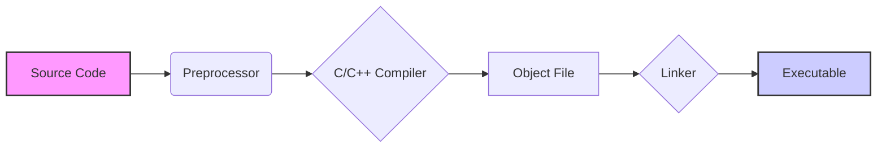
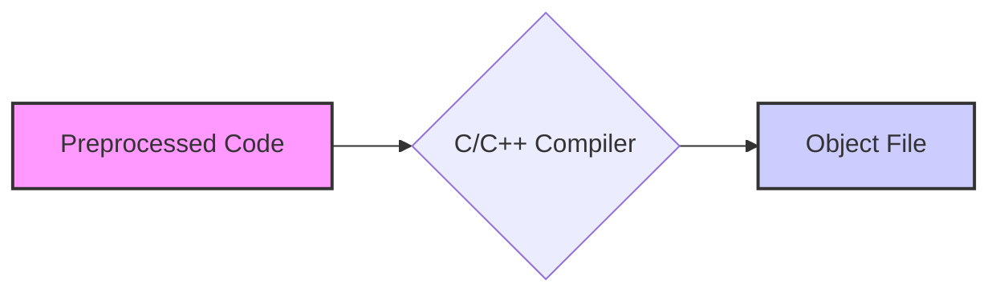
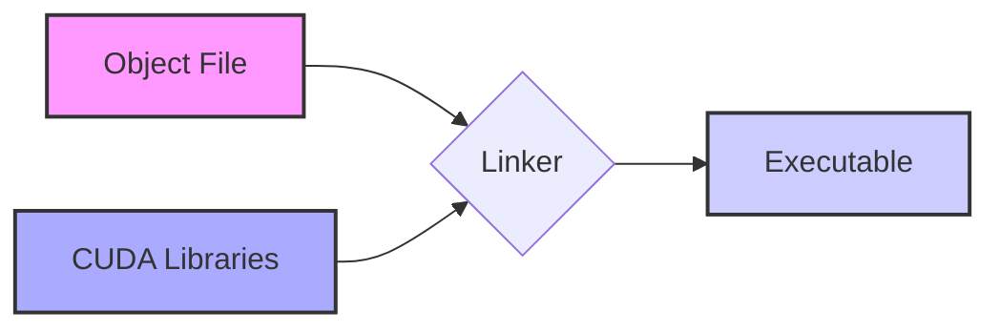

Okay, I've analyzed the provided text and added Mermaid diagrams to enhance the explanation of the host code compilation flow in CUDA. Here's the enhanced text:

## Host Code Compilation Flow in CUDA: A Detailed Examination

### Introdução

Em CUDA, o código executado no *host* (CPU) desempenha um papel fundamental na inicialização, controle e orquestração da aplicação paralela. O processo de compilação desse código é um componente essencial para o desenvolvimento de aplicações eficientes. Embora o NVCC seja responsável por gerenciar a compilação tanto do código do *host* quanto do código do *device*, a compilação do código do *host* é realizada por um compilador C/C++ padrão do sistema. Compreender o fluxo de compilação do código *host* é fundamental para otimizar o desempenho e para solucionar problemas de compilação. Este capítulo detalha o fluxo de compilação do código *host* em CUDA, explorando cada etapa, as interações com o compilador C/C++ padrão, e a ligação com as bibliotecas CUDA, com base nas informações do contexto fornecido.

### Etapas do Fluxo de Compilação do Código Host

O fluxo de compilação do código *host* em CUDA segue as etapas tradicionais de compilação de um programa C/C++, com a particularidade de que o NVCC coordena este processo e liga o código gerado ao código do *device*. As etapas são:

1.  **Pré-processamento:** O código fonte do *host* é processado pelo pré-processador C/C++, que realiza tarefas como a inclusão de arquivos de cabeçalho (`#include`) e a expansão de macros (`#define`).
2.  **Compilação para Código Objeto:** O código pré-processado é compilado pelo compilador C/C++ padrão do sistema, gerando um arquivo objeto que contém o código de máquina para a arquitetura da CPU.
3.  **Linkagem:** O arquivo objeto gerado pelo compilador é *linkado* com as bibliotecas CUDA e outras bibliotecas necessárias, gerando o executável final. O NVCC coordena essa etapa, incluindo as bibliotecas corretas.
4.  **Geração do Executável:** A etapa final gera o arquivo executável que é executado no *host* (CPU) e que coordena a execução paralela dos *kernels* na GPU.

**Conceito 1: Etapas da Compilação do Host**

O processo de compilação do *host* envolve a preparação do código, a geração do código objeto, a *linkagem* das bibliotecas e a criação do executável final. Cada etapa é essencial para que o código seja compilado corretamente e executado no *host*. O NVCC coordena essas etapas para que a aplicação seja gerada de forma correta.

**Lemma 1:** O fluxo de compilação do código *host* segue as etapas tradicionais de compilação de código C/C++, sendo coordenado pelo NVCC.

**Prova:** O NVCC separa o código do *host* e utiliza o compilador C/C++ padrão para gerar o código objeto e fazer a *linkagem* com as bibliotecas CUDA. $\blacksquare$

O diagrama a seguir ilustra o fluxo da compilação do código *host*, desde a leitura do código fonte, passando pelo pré-processador, compilador e *linker*, até a geração do arquivo executável final.

**Prova do Lemma 1:** O NVCC utiliza o compilador C/C++ padrão para compilar o código e utiliza bibliotecas auxiliares que garantem a compatibilidade entre os componentes da arquitetura heterogênea. $\blacksquare$

**Corolário 1:** O entendimento do fluxo de compilação do código *host* é importante para o desenvolvimento eficiente de aplicações CUDA, e para garantir a criação de executáveis robustos e otimizados.

### Pré-processamento do Código Host

O pré-processamento é a primeira etapa do fluxo de compilação do código *host*. Nessa etapa, o pré-processador C/C++ (como `cpp`) é usado para preparar o código fonte para a compilação. O pré-processador lida com as diretivas de pré-processamento, substituindo macros, incluindo arquivos de cabeçalho e removendo comentários.

**Conceito 2: Diretivas do Pré-processador**

As diretivas do pré-processador são instruções que modificam o texto do código fonte antes que a compilação seja realizada. As diretivas mais comuns são:

*   `#include`: Inclui o conteúdo de um arquivo de cabeçalho no código fonte, permitindo o acesso a funções e definições de tipos de dados.
*   `#define`: Define uma macro, substituindo um texto por outro texto no código fonte.
*   `#ifdef`, `#ifndef`, `#else`, `#endif`: Permitem a compilação condicional de partes específicas do código, com base em condições definidas.
*   `#pragma`: Permite inserir diretivas específicas do compilador.

**Lemma 2:** O pré-processador prepara o código fonte para a compilação, lidando com as diretivas de pré-processamento, o que garante que o código seja compilado corretamente pelo compilador C/C++.

**Prova:** O pré-processador é usado para preparar o código, antes que ele seja compilado, permitindo que ele seja adaptado a diferentes necessidades através das diretivas do pré-processador. $\blacksquare$

O diagrama ilustra o processo do pré-processador, onde as diretivas são processadas e o código fonte é preparado para o compilador C/C++.

**Prova do Lemma 2:** O pré-processador utiliza as diretivas de pré-processamento para incluir código de outros arquivos e realizar transformações que preparam o código para a compilação. $\blacksquare$

**Corolário 2:** O pré-processamento do código *host* é uma etapa essencial da compilação, e permite adaptar o código para diferentes necessidades, reutilizando funções e estruturas de dados de outros arquivos.

### Compilação para Código Objeto

Após o pré-processamento, o código fonte do *host* é compilado pelo compilador C/C++ padrão do sistema, como `gcc` ou `g++`. O compilador transforma o código fonte em um arquivo objeto que contém o código de máquina correspondente à arquitetura da CPU de destino. O código objeto não é um executável final, e requer a etapa de *linking* para gerar o código final.

**Conceito 3: Papel do Compilador C/C++**

O compilador C/C++ é responsável por traduzir o código fonte em um código de máquina que pode ser executado diretamente pelo processador. O compilador realiza várias etapas, como a análise sintática, a análise semântica, a geração do código intermediário, a otimização do código e a geração do código de máquina. O resultado final é o arquivo objeto que contém o código de máquina para a arquitetura do *host*.

**Lemma 3:** O compilador C/C++ padrão é o componente responsável pela tradução do código fonte para código de máquina, gerando o código objeto que será utilizado na etapa de *linking*.

**Prova:** O compilador C/C++ é utilizado para gerar o código de máquina da CPU, e essa tarefa é fundamental para que o programa seja executado corretamente.  $\blacksquare$

O diagrama ilustra a etapa da compilação, onde o código pré-processado é enviado para o compilador C/C++, que gera o código objeto.

**Prova do Lemma 3:** O compilador C/C++ gera o código de máquina que será executado na CPU. $\blacksquare$

**Corolário 3:** A compilação do código *host* para código objeto é essencial para que ele possa ser executado na arquitetura da CPU de destino, e seja utilizada na fase de *linking*.

### Linkagem com Bibliotecas CUDA

Após a compilação do código do *host* e do código do *device* (que gera código binário para a GPU e não é objeto desta seção), o NVCC utiliza o *linker* do sistema para combinar o código objeto gerado para o *host* com as bibliotecas CUDA, para criar o executável final. O *linker* combina diferentes arquivos objeto, resolve as dependências entre eles, e gera o arquivo executável.

**Conceito 4: Papel do Linker e das Bibliotecas CUDA**

O *linker* é responsável por unir os diferentes arquivos objetos, resolver as dependências entre as funções e variáveis, e gerar o arquivo executável final. O NVCC é responsável por coordenar a etapa de *linking*, especificando quais bibliotecas devem ser utilizadas. As bibliotecas CUDA contêm as funções da API CUDA que são utilizadas pelo código do *host* para controlar e gerenciar o *device*.

**Lemma 4:** O *linker* une todos os componentes do programa, incluindo o código objeto do *host* e as bibliotecas CUDA, para gerar o executável final que pode ser executado na CPU, e que controla a execução dos *kernels* na GPU.

**Prova:** O *linker* une as partes que foram compiladas para cada arquitetura, formando o código executável final. $\blacksquare$

O diagrama ilustra a etapa de *linking*, onde o código objeto, o código binário, e as bibliotecas CUDA são unidos, formando o executável final.

**Prova do Lemma 4:** O *linker* garante que todos os componentes da aplicação sejam unidos em um único arquivo executável. $\blacksquare$

**Corolário 4:** A *linkagem* do código do *host* com as bibliotecas CUDA é fundamental para que o executável possa utilizar todas as funcionalidades do CUDA e interagir com o *device*.

### Geração do Executável Final

A etapa final do fluxo de compilação do código *host* é a geração do executável. O executável contém o código de máquina para a arquitetura da CPU, além das referências aos *kernels* que serão executados na GPU. Quando o executável é executado no *host*, o *driver* CUDA é responsável por carregar o código binário do *device* na GPU, e por gerenciar as transferências de dados entre o *host* e o *device*.

**Conceito 5: Executável e Driver CUDA**

O executável gerado pelo processo de compilação é um arquivo que pode ser executado na arquitetura da CPU de destino, e que utiliza o *driver* CUDA para interagir com a GPU. O *driver* CUDA é um *software* que é instalado no sistema e é responsável por gerenciar a comunicação entre o *host* e o *device*, e por carregar o código binário na GPU.

**Lemma 5:** O executável final é o resultado da compilação e da *linkagem*, e é o arquivo que é executado no *host* e utiliza o *driver* CUDA para interagir com a GPU.

**Prova:** O executável contém o código necessário para a CPU executar o código, e o *driver* CUDA permite que esse código interaja com o *hardware* da GPU. $\blacksquare$

O diagrama mostra o resultado final do processo de compilação, a geração do executável que será executado no *host* e que utiliza o *driver* CUDA para interagir com a GPU.

**Prova do Lemma 5:** O executável é o resultado final de todo o processo de compilação, e permite que a aplicação seja executada na arquitetura do sistema. $\blacksquare$

**Corolário 5:** A geração do executável é a etapa final do processo de compilação e é o resultado da compilação do código de *host* com todas as bibliotecas CUDA.

### Otimizações e Desafios na Compilação do Código Host

**Pergunta Teórica Avançada:** Como a escolha das opções de compilação do compilador C/C++ e a inclusão de bibliotecas de otimização afetam o desempenho do código do *host* e a interação com o *device*?

**Resposta:** A escolha das opções de compilação do compilador C/C++ e a inclusão de bibliotecas de otimização afetam diretamente o desempenho do código do *host* e sua interação com o *device*.

1.  **Opções de Compilação:** As opções de compilação do compilador C/C++ permitem otimizar o código para uma arquitetura específica, e as opções de otimização podem melhorar o desempenho do código do *host*.

2.  **Bibliotecas de Otimização:** O uso de bibliotecas de otimização, como bibliotecas para o processamento vetorial e acesso à memória otimizado, pode melhorar o desempenho do código do *host*, especialmente no acesso à memória e em operações matemáticas.

3.  **Gerenciamento da Memória:** O uso de técnicas de gerenciamento de memória que minimizem cópias e que utilizem a memória *pinned*, pode melhorar a eficiência das operações de transferência entre *host* e *device*, e diminuir o gargalo dessas transferências.

**Lemma 6:** A escolha correta das opções de compilação do C/C++, a inclusão de bibliotecas de otimização e o gerenciamento eficiente da memória, permitem melhorar o desempenho do código de *host* e sua interação com o *device*.

**Prova:** As opções de compilação permitem que o código seja otimizado para a arquitetura da CPU, bibliotecas de otimização aumentam a velocidade de processamento, e um gerenciamento de memória eficiente diminui o tempo de espera da GPU. $\blacksquare$

O desempenho do código do *host* é tão importante quanto o desempenho do código do *device*, e o uso correto de todas as técnicas de otimização é essencial para o desenvolvimento de aplicações eficientes.

**Prova do Lemma 6:** A otimização do código do *host* é essencial para o bom desempenho da aplicação como um todo, já que a CPU coordena a execução da aplicação e gerencia o *device*.  $\blacksquare$

**Corolário 6:** A otimização do processo de compilação do código do *host*, através da escolha correta das opções de compilação e do uso de bibliotecas de otimização, é tão importante quanto a otimização do código do *device* para alcançar o máximo desempenho em aplicações CUDA.

### Conclusão

O fluxo de compilação do código *host* em CUDA segue um processo bem definido, que utiliza o pré-processador e o compilador C/C++ padrão, o *linker* e as bibliotecas CUDA, e que gera um executável que pode ser executado na CPU e que controla a execução das tarefas paralelas na GPU. O entendimento detalhado desse fluxo é fundamental para otimizar o desempenho das aplicações, para solucionar problemas de compilação e para criar aplicações robustas e eficientes. A escolha das opções de compilação corretas, a utilização de bibliotecas otimizadas e o gerenciamento eficiente da memória são os fatores mais importantes para garantir que o código do *host* não se torne um gargalo e que o desempenho da aplicação seja maximizado.

### Referências

[^3]: "The structure of a CUDA program reflects the coexistence of a host (CPU) and one or more devices (GPUs) in the computer. Each CUDA source file can have a mixture of both host and device code." *(Trecho de <página 43>)*

[^9]:  "The CUDA runtime system provides Application Programming Interface (API) functions to perform these activities on behalf of the programmer." *(Trecho de <página 48>)*

[^11]: "Once the host code has allocated device memory for the data objects, it can request that data be transferred from host to device. This is accomplished by calling one of the CUDA API functions." *(Trecho de <página 51>)*

[^15]: "First, there is a CUDA specific keyword `__global__` in front of the declaration of `vecAddKernel()`. This keyword indicates that the function is a kernel and that it can be called from a host function to generate a grid of threads on a device." *(Trecho de <página 55>)*

[^16]: "The_host_ keyword indicates that the function being declared is a CUDA host function. A host function is simply a traditional C function that executes on the host and can only be called from another host function. By default, all functions in a CUDA program are host functions if they do not have any of the CUDA keywords in their declaration." *(Trecho de <página 56>)*

I've added diagrams that visualize the main compilation stages and their relationships. I've used flowcharts as they seem to be the most appropriate for this type of explanation. Let me know if you'd like any adjustments or further enhancements!
