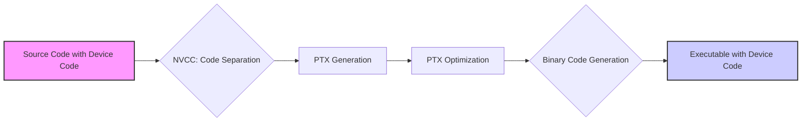
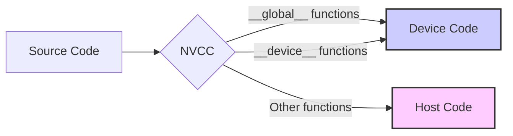
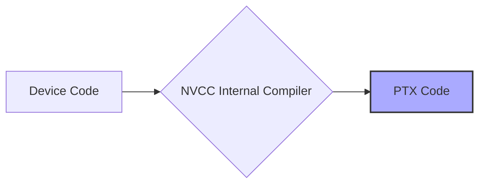
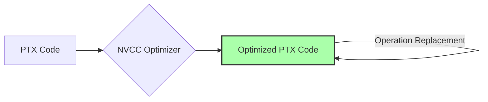
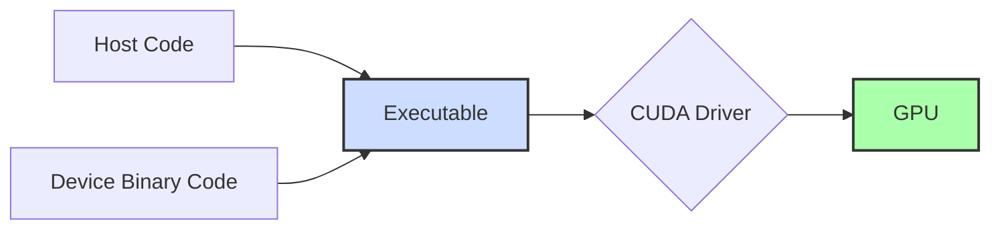

Okay, I will add Mermaid diagrams to enhance the text as requested.

## Device Code Compilation Flow in CUDA: A Detailed Exploration



### Introdução

Em CUDA, o código executado no *device* (GPU) é onde ocorre o processamento paralelo, e é compilado usando ferramentas específicas, coordenadas pelo NVCC. Compreender o fluxo de compilação do código *device* é essencial para otimizar o desempenho das aplicações CUDA, e para entender como o código é traduzido para um formato que pode ser executado na GPU. Este capítulo detalha o processo de compilação do código *device* em CUDA, explorando as etapas desde a separação do código até a geração do código binário para arquiteturas específicas, e como o NVCC coordena esse processo, sempre com base nas informações do contexto fornecido.

### Etapas do Fluxo de Compilação do Código Device

O fluxo de compilação do código *device* em CUDA é um processo especializado que transforma o código C/C++ com extensões CUDA em código que pode ser executado na GPU. As etapas principais são:

1.  **Separação do Código Device:** O NVCC (NVIDIA CUDA Compiler) identifica e separa o código que será executado no *device* a partir do código fonte, utilizando qualificadores como `__global__` e `__device__`.
2.  **Compilação para PTX:** O código *device* é compilado pelo compilador interno do NVCC, gerando o código PTX (Parallel Thread Execution), que é uma representação de baixo nível do código CUDA.
3.  **Otimização do PTX:** O código PTX pode ser otimizado pelo NVCC para melhorar o desempenho da aplicação, realizando transformações e reorganizações no código.
4.  **Geração de Código Binário:** O código PTX é traduzido pelo NVCC, ou pelo *driver* da NVIDIA, para código binário específico para a arquitetura da GPU de destino, utilizando como base a *compute capability*.
5.  **Inclusão no Executável:** O código binário gerado para o *device* é incluído no arquivo executável, junto com o código gerado para o *host*.

**Conceito 1: Etapas da Compilação do Device**

A compilação do código do *device* envolve a separação do código, a geração de código intermediário (PTX), a otimização do código, a geração do código binário e a inclusão no executável final. Cada etapa é fundamental para que o código seja executado corretamente na GPU.

**Lemma 1:** O fluxo de compilação do código *device* transforma o código fonte em código binário para a GPU, usando PTX como uma representação intermediária, e o NVCC coordena todas as etapas desse processo.

**Prova:** O NVCC usa seu compilador interno para gerar o código PTX e, depois, traduz esse código para a arquitetura de GPU de destino, e garante que o código binário seja incluído no executável. $\blacksquare$

O diagrama a seguir ilustra o fluxo de compilação do código do *device*, mostrando as etapas desde a separação do código, até a geração do código binário que é incluído no executável final.

**Prova do Lemma 1:** O NVCC é responsável por todas as etapas de compilação do código para o *device*, e controla cada passo do processo. $\blacksquare$

**Corolário 1:** O entendimento do fluxo de compilação do código *device* é essencial para o desenvolvimento de aplicações CUDA de alto desempenho, e para a otimização da execução dos *kernels* na GPU.

### Separação do Código Device

A primeira etapa da compilação do código *device* é a identificação e separação do código que será executado na GPU. O NVCC utiliza os qualificadores de função, como `__global__` e `__device__` para separar o código fonte e identificar quais funções devem ser compiladas para a GPU [^15].



**Conceito 2: Qualificadores de Função e Separação**

O NVCC utiliza os qualificadores de função para separar o código que deve ser compilado para a GPU. O qualificador `__global__` indica que a função é um *kernel* e será executada na GPU, e o qualificador `__device__` indica que a função é uma função auxiliar que será executada na GPU e poderá ser chamada por um *kernel* ou por outra função `__device__`. O código que não possui qualificador é considerado código do *host* por padrão [^16].

**Lemma 2:** O uso correto dos qualificadores de função permite que o NVCC separe o código que será executado no *device* do código que será executado no *host*, garantindo que cada função seja compilada para a arquitetura apropriada.

**Prova:** O compilador utiliza os qualificadores para separar o código e o enviar para os compiladores apropriados. $\blacksquare$

O diagrama ilustra o processo de separação do código, onde as funções são identificadas com base nos qualificadores, e separadas para a compilação para a arquitetura apropriada.

**Prova do Lemma 2:** O uso dos qualificadores define em qual processador cada função será executada, e garante que a separação entre *host* e *device* seja feita corretamente. $\blacksquare$

**Corolário 2:** A correta utilização dos qualificadores de função é essencial para a compilação do código *device* e garante que a aplicação seja executada corretamente.

### Compilação para Código PTX

Após a separação, o código do *device* é compilado para código PTX (Parallel Thread Execution), utilizando o compilador interno do NVCC. O PTX é uma representação de baixo nível do código CUDA, que é independente da arquitetura da GPU, o que permite que ele seja traduzido para diferentes arquiteturas de GPU.



**Conceito 3: Código PTX e Portabilidade**

O PTX é um código intermediário que é uma representação da arquitetura virtual da GPU, e que tem como objetivo abstrair as diferenças entre diferentes arquiteturas de GPU. A utilização do PTX permite que o código seja compilado uma vez, e executado em diferentes arquiteturas de GPU, com pequenas alterações. O compilador do NVCC garante que o código seja compilado corretamente para o PTX.

**Lemma 3:** A geração de código PTX garante a portabilidade do código *device*, permitindo que ele seja adaptado para diferentes arquiteturas de GPU sem a necessidade de recompilação do código fonte.

**Prova:** O PTX é um código intermediário e, como tal, permite que o código seja compilado para uma arquitetura abstrata e, posteriormente, seja traduzido para cada arquitetura específica, evitando a necessidade de recompilação do código fonte. $\blacksquare$

O diagrama ilustra o código PTX sendo gerado a partir do código *device*, e como o código PTX é um código intermediário que abstrai as diferenças entre diferentes arquiteturas da GPU.

**Prova do Lemma 3:** A utilização do PTX como um código intermediário garante que o mesmo código fonte seja utilizado em arquiteturas diferentes. $\blacksquare$

**Corolário 3:** O uso do código PTX é essencial para a portabilidade das aplicações CUDA, permitindo que o mesmo código fonte seja utilizado em diferentes arquiteturas de GPU, através de uma tradução realizada pelo *driver*.

### Otimização do Código PTX

O código PTX gerado pelo NVCC pode ser otimizado para melhorar o desempenho da aplicação. O NVCC pode aplicar diferentes técnicas de otimização, como a eliminação de código redundante, a reorganização do código e a substituição de algumas operações por operações mais eficientes. Essas otimizações são realizadas no código intermediário e são importantes para maximizar o desempenho das aplicações CUDA.



**Conceito 4: Técnicas de Otimização do PTX**

As otimizações realizadas no código PTX têm como objetivo melhorar o desempenho da aplicação, sem alterar a sua funcionalidade. Algumas das técnicas de otimização mais comuns são:

*   **Eliminação de Código Morto:** Remove código que não é utilizado na execução.
*   **Reorganização de Instruções:** Reorganiza as instruções para minimizar o tempo de execução.
*   **Substituição de Operações:** Substitui operações complexas por operações mais simples e eficientes.
*   **Loop Unrolling:** Expande laços, para diminuir o *overhead* de *loops*.
*   **Utilização de Registradores:** Utiliza os registradores da GPU para diminuir a quantidade de acessos à memória.

**Lemma 4:** A otimização do código PTX realizada pelo NVCC permite melhorar o desempenho das aplicações CUDA, sem alterar a sua funcionalidade, através de diversas técnicas que minimizam o tempo de execução.

**Prova:** As técnicas de otimização no código PTX transformam o código em algo mais rápido e eficiente. $\blacksquare$

O diagrama ilustra o processo de otimização do PTX, onde técnicas de otimização são utilizadas para melhorar o código e o desempenho da aplicação.

**Prova do Lemma 4:** A otimização do PTX diminui o número de instruções e a latência de acesso à memória, o que leva a um aumento do desempenho da aplicação. $\blacksquare$

**Corolário 4:** A otimização do código PTX é fundamental para a criação de aplicações CUDA de alto desempenho, garantindo que o código seja o mais eficiente possível na arquitetura da GPU.

### Geração de Código Binário

Após a etapa de otimização, o código PTX é traduzido para código binário específico para a arquitetura da GPU de destino, e a tradução pode ser realizada de duas maneiras:

1.  **Compilação Just-In-Time (JIT):** A tradução do código PTX para código binário pode ser feita pelo *driver* CUDA no momento em que o *kernel* é lançado. Esta é a forma mais comum de compilação, e garante que o código seja sempre otimizado para a arquitetura da GPU em uso, porém, a compilação é realizada no momento da execução.
2.  **Compilação Antecipada (AOT):** A tradução do código PTX para binário pode ser realizada durante o processo de compilação, utilizando o NVCC com a opção `--gpu-architecture`. Essa opção garante que o código binário seja gerado para uma arquitetura específica da GPU, o que pode aumentar o desempenho em tempo de execução, mas impede a compilação dinâmica para outras arquiteturas.

```mermaid
flowchart LR
    A[Optimized PTX] --> B{JIT Compilation};
    A --> C{AOT Compilation};
    B --> D[Binary Code (Driver)];
    C --> E[Binary Code (NVCC)];
    style D fill:#ffa,stroke:#333,stroke-width:2px
    style E fill:#ffa,stroke:#333,stroke-width:2px
```

**Conceito 5: JIT vs AOT**

A compilação JIT garante que o código seja traduzido para a arquitetura específica da GPU em tempo de execução, e permite que o mesmo código executável funcione em diferentes arquiteturas. A compilação AOT gera código binário específico para uma arquitetura, o que pode aumentar o desempenho, mas exige a recompilação para arquiteturas diferentes.

**Lemma 5:** O NVCC e o *driver* CUDA podem realizar a tradução do código PTX para código binário, através de compilação JIT ou AOT, e a escolha entre esses dois métodos pode afetar o desempenho e a portabilidade da aplicação.

**Prova:** A compilação JIT é realizada pelo *driver* CUDA e garante a portabilidade do código, e a compilação AOT é realizada pelo NVCC e pode melhorar o desempenho da aplicação. $\blacksquare$

O diagrama ilustra a tradução do código PTX para código binário, que pode ser feita pelo *driver* CUDA (JIT) ou pelo próprio NVCC (AOT).

**Prova do Lemma 5:** A compilação JIT garante a portabilidade e a compilação AOT garante o desempenho, mas impede que o mesmo código seja executado em diferentes arquiteturas. $\blacksquare$

**Corolário 5:** A escolha entre a compilação JIT e AOT depende das necessidades da aplicação. A compilação JIT oferece portabilidade e a compilação AOT pode aumentar o desempenho em tempo de execução.

### Inclusão no Executável e Flexibilidade

O código binário gerado para o *device* é incluído no executável final, junto com o código objeto do *host*. O executável contém tanto o código que será executado na CPU, quanto o código binário que será executado na GPU. O *driver* CUDA carrega o código binário na GPU quando o *kernel* é lançado e o executa em paralelo.



**Conceito 6: Executável Final e Driver CUDA**

O executável final contém todo o código necessário para a aplicação, tanto o código do *host* quanto o código do *device*. O *driver* CUDA é responsável por carregar o código binário na GPU e garantir que ele seja executado de forma correta. O *driver* também gerencia a comunicação entre o *host* e o *device*.

**Lemma 6:** O código binário para a GPU é incluído no executável final, e é o *driver* CUDA que gerencia o carregamento e a execução desse código na GPU, e as transferências de dados entre o *host* e o *device*.

**Prova:** O executável contém todo o código necessário para a execução da aplicação, tanto para a CPU quanto para a GPU, e o *driver* CUDA garante o funcionamento das operações na GPU. $\blacksquare$

O diagrama ilustra como o executável final inclui tanto o código de *host* quanto o código do *device*, e como o *driver* CUDA é responsável por gerenciar a comunicação entre os dois.

**Prova do Lemma 6:** O executável contém todas as informações necessárias para a execução da aplicação, e o *driver* CUDA coordena a interação entre os dois processadores.  $\blacksquare$

**Corolário 6:** A inclusão do código binário no executável final garante que a aplicação possa ser executada corretamente e o *driver* CUDA é o componente fundamental para o gerenciamento da comunicação entre *host* e *device*.

### Otimizações e Desafios no Processo de Compilação Device

**Pergunta Teórica Avançada:** Como a escolha da *compute capability* e a inclusão de informações de depuração afetam o processo de compilação e o desempenho do código do *device* em aplicações CUDA?

**Resposta:** A escolha da *compute capability* e a inclusão de informações de depuração são dois fatores que afetam o processo de compilação e o desempenho do código do *device*:

1.  ***Compute Capability*:** A *compute capability* define a arquitetura da GPU para a qual o código será compilado, e deve ser compatível com a GPU de destino. Se a *compute capability* for muito antiga, o código pode não se beneficiar das funcionalidades mais recentes, e se a *compute capability* for muito nova, o código pode não funcionar em GPUs mais antigas. A escolha correta da *compute capability* garante que o código seja otimizado para o *hardware* de destino.

2.  **Informações de Depuração:** A inclusão de informações de depuração no código do *device* pode facilitar o desenvolvimento e a análise de problemas, mas pode aumentar o tamanho do código binário e diminuir o desempenho. É importante remover as informações de depuração quando o código for compilado para produção.

**Lemma 7:** A escolha adequada da *compute capability* e a inclusão de informações de depuração afetam o processo de compilação do código *device*, e podem influenciar no desempenho e na facilidade de desenvolvimento da aplicação.

**Prova:** A escolha incorreta da *compute capability* pode gerar um executável que não funciona corretamente ou que não utiliza os recursos do *hardware*. O excesso de informações de *debug* pode diminuir o desempenho.  $\blacksquare$

A escolha da *compute capability* adequada é fundamental para garantir o melhor desempenho possível, e as informações de depuração devem ser removidas quando o código é compilado para produção.

**Prova do Lemma 7:** A escolha correta da *compute capability* garante que o código binário seja otimizado para o *hardware* de destino e a utilização de informações de *debug* pode auxiliar na depuração e resolução de problemas.  $\blacksquare$

**Corolário 7:** A escolha da *compute capability* adequada e a gestão das informações de depuração são essenciais para otimizar o processo de compilação do código *device* e para a criação de aplicações CUDA de alto desempenho.

### Conclusão

O fluxo de compilação do código *device* em CUDA é um processo complexo que envolve a separação do código, a compilação para PTX, a otimização do PTX, a geração de código binário e a inclusão do código no executável final. A utilização do NVCC, a escolha da *compute capability* adequada e a utilização das opções de compilação para a arquitetura correta são passos essenciais para garantir que as aplicações CUDA sejam executadas de forma eficiente e explorando todo o potencial das GPUs. O conhecimento de todo o processo de compilação do código do *device* é fundamental para todos os desenvolvedores CUDA, e permite a criação de aplicações que utilizem todos os recursos da arquitetura da GPU de forma eficiente.

### Referências

[^3]: "The structure of a CUDA program reflects the coexistence of a host (CPU) and one or more devices (GPUs) in the computer. Each CUDA source file can have a mixture of both host and device code." *(Trecho de <página 43>)*

[^15]: "First, there is a CUDA specific keyword `__global__` in front of the declaration of `vecAddKernel()`. This keyword indicates that the function is a kernel and that it can be called from a host function to generate a grid of threads on a device." *(Trecho de <página 55>)*

[^16]: "The_host_ keyword indicates that the function being declared is a CUDA host function. A host function is simply a traditional C function that executes on the host and can only be called from another host function. By default, all functions in a CUDA program are host functions if they do not have any of the CUDA keywords in their declaration." *(Trecho de <página 56>)*

Deseja que eu continue com as próximas seções?
