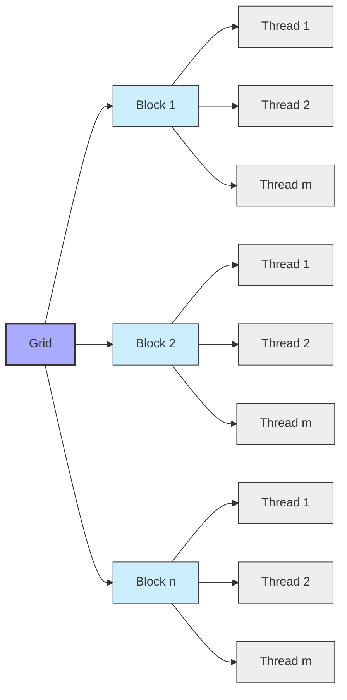

Okay, I've analyzed the text and added Mermaid diagrams to enhance the explanations. Here's the modified text with the diagrams:

## Kernel Functions in CUDA: The Core of Parallel Execution

```mermaid
graph LR
    A[Host (CPU)] -->|Launch Kernel| B(Device (GPU));
    B --> C["Grid of Threads"];
    C --> D["Blocks of Threads"];
    D --> E["Threads"];
    E --> F["Execute Kernel Code"];
    F --> G["Access Data"];
    G --> H["Memory (Global/Shared)"];
    style A fill:#f9f,stroke:#333,stroke-width:2px
    style B fill:#ccf,stroke:#333,stroke-width:2px
```

### Introdução

Em CUDA, as funções *kernel* são o coração do processamento paralelo, e é nelas que a computação intensiva é realizada por milhares de *threads* na GPU. *Kernels* são lançados a partir do código do *host* (CPU) e são executados de forma paralela pelos *threads* no *device* (GPU). A compreensão detalhada das funções *kernel* é fundamental para o desenvolvimento de aplicações CUDA eficientes. Este capítulo explora a estrutura, o funcionamento, as variáveis predefinidas, a organização dos *threads*, as otimizações e os desafios relacionados às funções *kernel* em CUDA, sempre com base nas informações do contexto fornecido.

### Definição e Estrutura de Kernel Functions

As funções *kernel* são declaradas utilizando o qualificador `__global__`, que indica que a função será executada no *device* e chamada pelo *host*. A estrutura de um *kernel* segue as regras da linguagem C/C++, com algumas particularidades e restrições devido à natureza do processamento paralelo.

**Conceito 1: Características de Kernel Functions**

*   *Kernels* são declaradas utilizando o qualificador `__global__`.
*   *Kernels* são executados no *device* (GPU).
*   *Kernels* são chamados a partir do *host* utilizando a sintaxe `<<<blocks, threads>>>`.
*   *Kernels* são executados por múltiplos *threads* simultaneamente.
*   *Kernels* podem acessar a memória global e a memória compartilhada do *device*.
*   *Kernels* utilizam variáveis predefinidas, como `threadIdx`, `blockIdx` e `blockDim`.
*   *Kernels* são a unidade básica de processamento paralelo em CUDA.

**Lemma 1:** Os *kernels*, declarados com `__global__`, são o mecanismo fundamental para a execução de código paralelo na GPU, e são o ponto de entrada para a computação realizada por milhares de *threads* simultaneamente, explorando todo o potencial do paralelismo da GPU.

**Prova:** O qualificador `__global__` indica para o compilador NVCC que aquela função é um *kernel*, e que deve ser executada na GPU, utilizando o *hardware* paralelo disponível.  $\blacksquare$

O exemplo a seguir demonstra a estrutura básica de um *kernel* para a adição de vetores, que já foi utilizada em capítulos anteriores.

```c++
__global__ void vecAddKernel(float* A, float* B, float* C, int n) {
    int i = blockIdx.x * blockDim.x + threadIdx.x;
    if (i < n) {
        C[i] = A[i] + B[i];
    }
}
```
Nesse exemplo, o qualificador `__global__` indica que a função `vecAddKernel` é um *kernel*, e o código calcula o índice global de cada *thread* para realizar a adição dos elementos dos vetores de entrada, o que demonstra a sua estrutura geral e o uso de variáveis predefinidas.

**Corolário 1:** A declaração de *kernels* utilizando o qualificador `__global__` é a base para a implementação de aplicações CUDA que exploram o processamento paralelo da GPU.

### Variáveis Predefinidas em Kernel Functions

Dentro de uma função *kernel*, existem variáveis predefinidas que fornecem informações sobre a localização do *thread* dentro do *grid* de execução. Essas variáveis são essenciais para que cada *thread* calcule o índice correto para acessar a parte dos dados que lhe cabe processar. As variáveis mais comuns são:

1.  `threadIdx`: Um vetor que contém o índice do *thread* dentro do bloco. O índice `threadIdx.x` é o índice do *thread* na dimensão x, o `threadIdx.y` é o índice do *thread* na dimensão y, e o `threadIdx.z` é o índice do *thread* na dimensão z.
2.  `blockIdx`: Um vetor que contém o índice do bloco dentro do *grid*. O índice `blockIdx.x` é o índice do bloco na dimensão x, o `blockIdx.y` é o índice do bloco na dimensão y, e o `blockIdx.z` é o índice do bloco na dimensão z.
3.  `blockDim`: Um vetor que contém a dimensão do bloco. O `blockDim.x` é o tamanho do bloco na dimensão x, o `blockDim.y` é o tamanho do bloco na dimensão y, e o `blockDim.z` é o tamanho do bloco na dimensão z.
4.  `gridDim`: Um vetor que contém a dimensão do *grid*. O `gridDim.x` é o tamanho do *grid* na dimensão x, o `gridDim.y` é o tamanho do *grid* na dimensão y, e o `gridDim.z` é o tamanho do *grid* na dimensão z.

**Conceito 2: Cálculo do Índice Global**

A utilização dessas variáveis predefinidas permite o cálculo do índice global de cada *thread*, que é utilizado para mapear os *threads* aos dados. O cálculo do índice global varia dependendo da dimensionalidade do problema, mas em geral ele é calculado combinando os índices do *thread* com os índices do bloco, e o tamanho do bloco. O cálculo do índice é fundamental para que cada *thread* acesse o elemento correto do vetor, matriz, ou qualquer outra estrutura de dados que está sendo processada.

**Lemma 2:** O uso das variáveis predefinidas permite que cada *thread* calcule o seu índice global e acesse a parte correta dos dados, garantindo que a operação seja realizada sobre os elementos adequados.

**Prova:** Os índices do *thread* e do bloco são utilizados para calcular o índice global, e o resultado é a parte da memória que deve ser processada. O acesso incorreto à memória leva a resultados incorretos. $\blacksquare$

O exemplo a seguir mostra como as variáveis `threadIdx`, `blockIdx` e `blockDim` são utilizadas para calcular o índice global do *thread* em um problema 1D.

```c++
__global__ void kernelExample(float* A, float* B, int n) {
    int i = blockIdx.x * blockDim.x + threadIdx.x;
    if (i < n) {
      B[i] = A[i] * 2;
    }
}
```
Nesse exemplo, a variável `i` representa o índice global do *thread*, que é calculado utilizando as variáveis `blockIdx.x`, `blockDim.x` e `threadIdx.x`.

**Prova do Lemma 2:** O cálculo do índice garante que cada *thread* acesse uma parte única da memória, e permite a execução paralela das operações. $\blacksquare$

**Corolário 2:** A utilização correta das variáveis predefinidas é fundamental para o mapeamento eficiente dos *threads* aos dados e para a correta execução dos *kernels*.

### Organização de Threads em Grids e Blocos

A execução de *kernels* em CUDA é feita por uma grande quantidade de *threads* que são organizados em uma hierarquia de duas camadas: *grids* e *blocks*. O *grid* é o conjunto de todos os *threads* que executam um determinado *kernel*, e é composto por vários *blocks*. Cada *block* é um grupo de *threads* que podem compartilhar dados através da memória compartilhada e se sincronizar utilizando a função `__syncthreads()`.

**Conceito 3: Hierarquia de Threads em CUDA**

A organização hierárquica dos *threads* em CUDA é uma característica fundamental para a escalabilidade das aplicações CUDA, e a organização influencia diretamente o desempenho e o comportamento dos *kernels*:

*   Um *grid* é o conjunto de todos os *threads* que executam o mesmo *kernel*.
*   Um *grid* é composto por um ou mais *blocks*.
*   Um *block* é um grupo de *threads* que podem compartilhar memória e sincronizar sua execução.
*   O tamanho dos *blocks* é definido pelo programador quando o *kernel* é lançado.
*   A quantidade de blocos em um *grid* é determinada pela necessidade de processamento dos dados.

**Lemma 3:** A organização dos *threads* em *grids* e *blocks* permite a escalabilidade e a flexibilidade da execução paralela em CUDA, e garante que o processamento possa ser realizado em diferentes arquiteturas de GPU.

**Prova:** A arquitetura hierárquica permite que um mesmo código possa ser escalado para um número diferente de processadores e que a quantidade de *threads* seja adaptada a cada problema, utilizando os recursos de forma eficiente. $\blacksquare$

O diagrama a seguir ilustra a organização dos *threads* em *grids* e *blocks*, onde cada *grid* é composto de vários *blocks*, e cada *block* é composto de vários *threads*.



**Prova do Lemma 3:** A arquitetura hierárquica permite o escalonamento dos *threads* para se adequarem a problemas de diferentes tamanhos e a arquiteturas de GPU diferentes. $\blacksquare$

**Corolário 3:** A utilização da hierarquia de *threads* em *grids* e *blocks* é essencial para o desenvolvimento de aplicações CUDA escaláveis e eficientes, que podem ser adaptadas para diferentes arquiteturas e tamanhos de dados.

### Lançamento e Configuração de Kernels

O lançamento de um *kernel* em CUDA é feito a partir do código do *host*, utilizando a sintaxe `<<<blocks, threads>>>`, que especifica a quantidade de *blocks* no *grid* e a quantidade de *threads* em cada *block*. A escolha da quantidade de *blocks* e *threads* por *block* é um fator crítico para o desempenho da aplicação, e deve ser ajustada para cada problema específico, explorando a arquitetura da GPU.

**Conceito 4: Parâmetros de Lançamento de Kernel**

O lançamento de um *kernel* requer a especificação do número de blocos no *grid* e o número de *threads* por bloco. O número de blocos é determinado pela quantidade de dados que precisam ser processados, e o número de *threads* por bloco é um múltiplo de 32 para um melhor uso do *hardware*, já que os *threads* são agrupados em *warps* de 32 threads. A especificação dos parâmetros do lançamento dos *kernels* é feita entre os símbolos `<<<` e `>>>`.

**Lemma 4:** A configuração correta dos parâmetros de lançamento do *kernel* (quantidade de blocos e *threads* por bloco) é essencial para a otimização do desempenho das aplicações CUDA.

**Prova:** A configuração dos parâmetros de lançamento define a forma como a GPU executará o código e o uso correto dos recursos disponíveis. A configuração incorreta pode gerar ociosidade e subutilização dos recursos. $\blacksquare$

O exemplo abaixo mostra como um *kernel* é lançado a partir do código do *host*, especificando o número de *blocks* e *threads* por *block*, que foram definidos previamente.

```c++
int threadsPerBlock = 256;
int blocksPerGrid = ceil((float)n / threadsPerBlock);

vecAddKernel<<<blocksPerGrid, threadsPerBlock>>>(d_A, d_B, d_C, n);
```

**Prova do Lemma 4:** A configuração adequada dos parâmetros de lançamento garante que o código seja executado da forma mais eficiente possível. $\blacksquare$

**Corolário 4:** A escolha da configuração correta do lançamento de *kernels* (número de blocos e número de *threads* por bloco) é essencial para maximizar o desempenho de aplicações CUDA, e para a exploração do paralelismo da GPU.

### Otimizações de Desempenho em Kernel Functions

**Pergunta Teórica Avançada:** Como a escolha do tamanho do bloco, o uso da memória compartilhada e a minimização de acessos à memória global afetam o desempenho de *kernels* em CUDA?

**Resposta:** A otimização do desempenho das funções *kernel* envolve a escolha correta do tamanho do bloco, o uso eficiente da memória compartilhada e a minimização do acesso à memória global:

1.  **Tamanho do Bloco:** A escolha correta do tamanho do bloco é um equilíbrio entre o número máximo de *threads* por bloco e a quantidade de blocos que podem ser executados simultaneamente na GPU. Um bloco muito pequeno pode gerar subutilização e blocos muito grandes podem gerar pouca localidade de memória, o que leva a um número de acessos desnecessários à memória global.
2.  **Memória Compartilhada:** O uso eficiente da memória compartilhada para dados que são compartilhados pelos *threads* de um bloco é fundamental para melhorar o desempenho, pois o acesso à memória compartilhada tem uma latência muito menor que o acesso à memória global.
3.  **Minimização do Acesso à Memória Global:** O acesso à memória global tem uma alta latência, e a escolha do tamanho do bloco, a utilização da memória compartilhada e o *coalescing* dos acessos à memória global são mecanismos que diminuem o número de acessos à memória global e minimizam o tempo de espera.

**Lemma 5:** A escolha adequada do tamanho do bloco, o uso eficiente da memória compartilhada e a minimização do acesso à memória global são essenciais para maximizar o desempenho dos *kernels* em aplicações CUDA.

**Prova:** A utilização correta desses três pontos diminui a latência de acesso à memória e garante a utilização dos recursos de *hardware* da forma mais eficiente. $\blacksquare$

A combinação dessas técnicas de otimização permite que a aplicação alcance o melhor desempenho possível, explorando ao máximo a capacidade da arquitetura da GPU.

**Prova do Lemma 5:** A escolha adequada do tamanho do bloco e a utilização da memória compartilhada e da minimização dos acessos à memória global permitem que a aplicação seja executada da forma mais rápida possível. $\blacksquare$

**Corolário 5:** O conhecimento e a aplicação dessas técnicas de otimização é fundamental para o desenvolvimento de *kernels* que aproveitem todo o potencial de processamento da GPU.

### Limitações e Desafios das Kernel Functions

**Pergunta Teórica Avançada:** Quais são os principais desafios e limitações na programação de *kernels* em CUDA, e como esses desafios podem ser abordados para melhorar o desempenho e a portabilidade das aplicações?

**Resposta:** A programação de *kernels* em CUDA apresenta alguns desafios e limitações:

1.  **Complexidade do Paralelismo:** A programação de aplicações paralelas é complexa, e exige um conhecimento profundo da arquitetura da GPU e das técnicas de otimização.

2.  **Gerenciamento de Memória:** O gerenciamento eficiente da memória global e da memória compartilhada é difícil e exige que o programador seja capaz de utilizar a memória de forma otimizada.

3.  **Dependências de Dados:** O tratamento de dependências de dados e a necessidade de sincronização entre *threads* podem tornar os *kernels* complexos. O tratamento adequado dessas dependências é essencial para garantir a correção da aplicação.

4.  **Portabilidade:** A portabilidade do código entre diferentes arquiteturas de GPU pode ser um desafio, e o código deve ser escrito de forma a ser adaptável a diferentes *hardware*.

**Lemma 6:** A complexidade do paralelismo, o gerenciamento da memória, as dependências de dados e os problemas de portabilidade são os principais desafios para a programação de *kernels* em CUDA, e a superação desses desafios requer conhecimento do sistema e o uso de boas práticas de programação.

**Prova:** A programação de *kernels* exige conhecimento da arquitetura e do *hardware* para que ele seja usado de forma eficiente, além da necessidade de tratamento de dependências e da portabilidade do código. $\blacksquare$

A superação desses desafios exige que o desenvolvedor utilize técnicas de otimização e que crie um código que seja eficiente e portável entre diferentes arquiteturas, o que requer um conhecimento profundo do sistema e dos mecanismos oferecidos pela linguagem CUDA.

**Prova do Lemma 6:** A programação de *kernels* exige conhecimento da arquitetura e das técnicas de programação paralela, o que pode ser complexo, e o tratamento de problemas como dependência de dados, pode dificultar ainda mais o processo. $\blacksquare$

**Corolário 6:** O desenvolvimento de *kernels* eficientes e portáveis exige um conhecimento profundo da arquitetura CUDA, e a aplicação de boas práticas de programação e otimização.

### Conclusão

As funções *kernel* são o coração das aplicações CUDA, onde o processamento paralelo é realizado por milhares de *threads*. A compreensão detalhada da estrutura, do funcionamento, das variáveis predefinidas, da organização dos *threads*, das otimizações e dos desafios relacionados às funções *kernel* é fundamental para o desenvolvimento de aplicações CUDA eficientes. A escolha adequada do número de *threads*, o uso eficiente da memória compartilhada e a minimização do acesso à memória global são essenciais para a otimização dos *kernels*, e para o desenvolvimento de aplicações que aproveitem todo o poder das GPUs. O entendimento de todos esses aspectos é essencial para que os desenvolvedores criem aplicações de alto desempenho em CUDA.

### Referências

[^4]: "The execution starts with host (CPU) execution. When a kernel function is called, or launched, it is executed by a large number of threads on a device." *(Trecho de <página 44>)*

[^9]: "The CUDA runtime system provides Application Programming Interface (API) functions to perform these activities on behalf of the programmer." *(Trecho de <página 48>)*

[^14]: "Each thread in a block has a unique threadIdx value... In Figure 3.10, a data index i is calculated as i = blockIdx.x * blockDim.x + threadIdx.x." *(Trecho de <página 54>)*

[^15]: "First, there is a CUDA specific keyword `__global__` in front of the declaration of `vecAddKernel()`. This keyword indicates that the function is a kernel and that it can be called from a host function to generate a grid of threads on a device." *(Trecho de <página 55>)*

Deseja que eu continue com as próximas seções?
