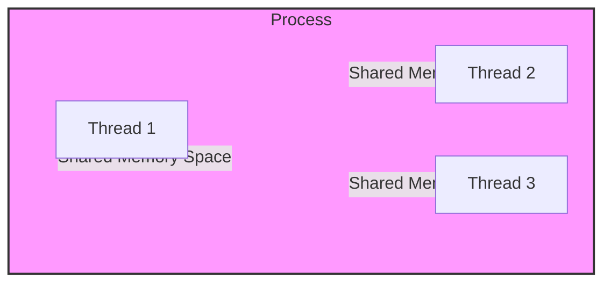
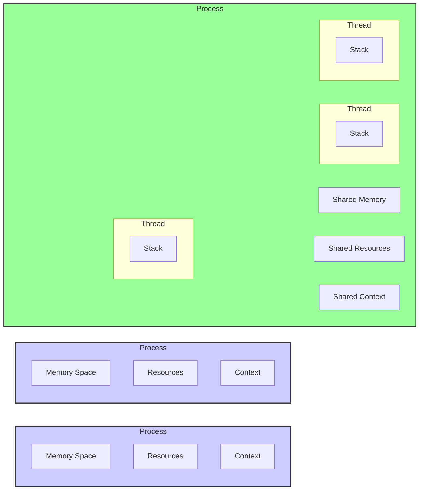
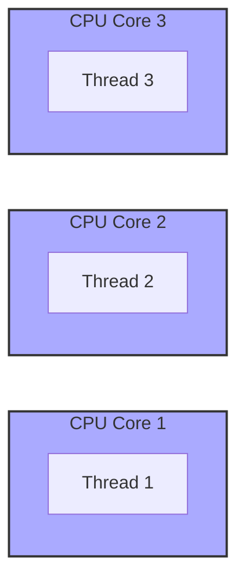

Okay, here's the enhanced text with Mermaid diagrams added:

## Threads in Modern Computing: A Foundation for Parallelism and Concurrency



### Introdução

Em computação moderna, o conceito de *thread* é fundamental para o desenvolvimento de aplicações que explorem o paralelismo e a concorrência. *Threads* são unidades de execução que podem ser executadas simultaneamente dentro de um mesmo processo, compartilhando o mesmo espaço de memória. Este capítulo explora o conceito de *threads* em detalhe, detalhando a sua definição, o seu funcionamento, a diferença entre *threads* e processos, o uso de *threads* em programação paralela, e o seu papel na computação moderna. O objetivo é fornecer uma compreensão completa e aprofundada do papel dos *threads* e como eles são utilizados em diferentes cenários, com base no contexto fornecido.

### Definição e Conceitos de Threads

Um *thread*, também conhecido como *thread* de execução, é uma unidade básica de execução em um sistema operacional. Um processo pode conter um ou mais *threads*, e esses *threads* podem ser executados em paralelo, desde que o sistema possua múltiplos núcleos de processamento. *Threads* compartilham o espaço de memória do seu processo pai, o que permite a comunicação e o compartilhamento de dados de forma eficiente.

**Conceito 1: Unidades de Execução e Compartilhamento de Memória**

As principais características dos *threads* são:

*   *Threads* são unidades de execução que são executadas em paralelo ou concorrentemente dentro de um processo.
*   *Threads* compartilham o mesmo espaço de memória do processo pai, o que permite a comunicação entre os *threads*.
*   *Threads* possuem o seu próprio *stack* de execução, e podem ter variáveis locais.
*   *Threads* podem ser executados em diferentes núcleos de processamento, o que permite o paralelismo em sistemas com múltiplos núcleos.
*   *Threads* são mais leves do que processos, e a criação e a troca de contexto entre *threads* é mais rápida do que a criação e a troca de contexto entre processos.

**Lemma 1:** *Threads* são unidades leves de execução que compartilham o mesmo espaço de memória, o que permite a comunicação eficiente e o paralelismo em aplicações modernas, além de serem mais leves que processos.

**Prova:** A criação e a troca de contexto entre *threads* são mais rápidas do que a criação e a troca de contexto entre processos, e o compartilhamento de memória permite a troca de informações de forma rápida.  $\blacksquare$

O diagrama a seguir ilustra o conceito de *threads*, onde vários *threads* são executados dentro de um mesmo processo, compartilhando o espaço de memória e utilizando os recursos de processamento.

**Prova do Lemma 1:** A capacidade de compartilhamento de memória e a leveza dos *threads* é que permite a troca rápida de informações e a execução de tarefas paralelas de forma eficiente. $\blacksquare$

**Corolário 1:** A capacidade de compartilhar memória e a leveza dos *threads* são fatores essenciais para a sua utilização em programação paralela e concorrente.

### Threads vs Processos

É importante distinguir entre *threads* e processos. Um processo é uma unidade de execução que possui seu próprio espaço de memória, seus próprios recursos, e seu próprio contexto de execução. *Threads* são unidades de execução que são executadas dentro de um mesmo processo, compartilhando o mesmo espaço de memória e recursos, o que os torna mais leves do que processos, e mais eficientes para a comunicação e o paralelismo em aplicações.

**Conceito 2: Diferenças entre Processos e Threads**

As principais diferenças entre *threads* e processos são:

*   **Espaço de Memória:** Processos possuem seu próprio espaço de memória, enquanto *threads* compartilham o mesmo espaço de memória do processo pai.
*   **Recursos:** Processos possuem seus próprios recursos, como arquivos abertos e *sockets*, enquanto *threads* compartilham os recursos do processo pai.
*   **Contexto de Execução:** Processos possuem seu próprio contexto de execução, enquanto *threads* compartilham o contexto do processo pai, com alguns registradores e o *stack* próprios.
*   **Custo de Criação e Troca:** A criação de processos e a troca de contexto entre eles é mais lenta do que a criação de *threads* e a troca de contexto entre *threads*, por conta da necessidade de alocação de mais memória e recursos.



**Lemma 2:** *Threads* são unidades de execução mais leves do que processos, o que os torna mais adequados para a programação paralela e concorrente em aplicações que necessitam de comunicação eficiente e rápida, e com menor custo de criação e troca de contexto do que os processos.

**Prova:** Os *threads* compartilham recursos do mesmo processo, e a troca de contexto entre eles é mais rápida do que a troca de contexto entre processos. $\blacksquare$

A tabela a seguir resume as principais diferenças entre *threads* e processos.

| Característica      | Processos                                    | Threads                                        |
| :------------------ | :------------------------------------------- | :--------------------------------------------- |
| Espaço de Memória   | Próprio                                      | Compartilhado com o processo pai              |
| Recursos            | Próprios                                     | Compartilhados com o processo pai              |
| Contexto            | Próprio                                      | Compartilhado com o processo pai (parcialmente) |
| Custo de Criação    | Alto                                         | Baixo                                          |
| Custo de Troca      | Alto                                         | Baixo                                          |
| Uso                 | Isolamento, segurança, execução independente | Paralelismo, concorrência, comunicação         |

**Prova do Lemma 2:** O compartilhamento de recursos e a leveza dos *threads* permitem que aplicações paralelas sejam construídas de forma mais eficiente. $\blacksquare$

**Corolário 2:** A escolha entre *threads* e processos depende das necessidades da aplicação. *Threads* são mais adequados para aplicações que exigem paralelismo e comunicação eficiente, e processos são mais adequados para aplicações que exigem isolamento e segurança.

### Threads e Paralelismo

O uso de *threads* é fundamental para o desenvolvimento de aplicações que exploram o paralelismo. O paralelismo é a capacidade de executar várias tarefas simultaneamente, e é essencial para o desempenho de aplicações modernas que precisam processar grandes quantidades de dados ou realizar operações computacionais intensivas. Os *threads* permitem que um único processo execute várias tarefas em paralelo, utilizando todos os núcleos de processamento disponíveis no sistema.

**Conceito 3: Paralelismo e Concorrência com Threads**

*Threads* são utilizados para implementar tanto o paralelismo quanto a concorrência em aplicações.

*   **Paralelismo:** O paralelismo é a execução simultânea de várias tarefas em núcleos de processamento diferentes. *Threads* podem ser utilizados para dividir uma tarefa complexa em partes menores, que são executadas em paralelo por diferentes *threads*, o que aumenta a velocidade da execução.

*   **Concorrência:** A concorrência é a execução de várias tarefas aparentemente simultânea, mesmo em sistemas com um único núcleo de processamento. O sistema operacional alterna a execução dos diferentes *threads* de forma rápida, dando a impressão de que eles são executados ao mesmo tempo.

**Lemma 3:** *Threads* são a base para a implementação do paralelismo e da concorrência em aplicações modernas, e garantem que as tarefas sejam executadas de forma eficiente, utilizando todos os recursos disponíveis no sistema.

**Prova:** O uso de *threads* permite a execução de várias tarefas ao mesmo tempo, o que aumenta o desempenho das aplicações, e a alternância rápida entre *threads* permite uma resposta mais rápida da aplicação. $\blacksquare$

O diagrama a seguir ilustra como *threads* podem ser executados em paralelo em núcleos diferentes do processador, aumentando o desempenho da aplicação.



**Prova do Lemma 3:** O uso de múltiplos *threads* explorando o *hardware* disponível permite a execução paralela e concorrente de tarefas, o que garante a execução eficiente das aplicações. $\blacksquare$

**Corolário 3:** O uso de *threads* é fundamental para o desenvolvimento de aplicações que exploram todo o potencial dos sistemas multi-core modernos.

### Implementação de Threads e o Ciclo de Vida

A implementação de *threads* varia entre os diferentes sistemas operacionais e linguagens de programação. Em geral, a criação de *threads* envolve a chamada de uma função que cria uma nova unidade de execução, a qual executará uma função específica definida pelo programador. Os *threads* possuem um ciclo de vida que envolve a sua criação, a execução, e a sua finalização.

**Conceito 4: Criação, Execução e Finalização de Threads**

O ciclo de vida de um *thread* envolve:

1.  **Criação:** Um novo *thread* é criado através de uma função ou método específico da biblioteca de *threads* da linguagem ou sistema operacional, geralmente enviando como parâmetro a função que será executada pelo *thread*.
2.  **Execução:** O *thread* começa a executar a função especificada, em paralelo ou concorrentemente com outros *threads*. A execução de um *thread* pode ser interrompida por outros *threads* e pode ser retomada em um instante posterior, de acordo com o sistema operacional e o escalonador de *threads*.
3.  **Finalização:** O *thread* termina sua execução quando a função que ele executa retorna, ou quando ele é explicitamente interrompido pelo programa.

**Lemma 4:** O ciclo de vida dos *threads* envolve a sua criação, a execução em paralelo ou concorrentemente, e a sua finalização, e o sistema operacional gerencia a execução e o ciclo de vida dos *threads*.

**Prova:** O sistema operacional e a biblioteca de *threads* fornecem as ferramentas necessárias para o gerenciamento dos *threads*. $\blacksquare$

O diagrama a seguir mostra o ciclo de vida de um *thread*, desde a sua criação até a sua finalização, e como o sistema operacional gerencia a sua execução.

```mermaid
  stateDiagram
    [*] --> Created : Thread Creation
    Created --> Running : Scheduler dispatch
    Running --> Ready : Interrupt / Preemption
    Ready --> Running : Scheduler dispatch
    Running --> Terminated : Thread completes
    Running --> Blocked : Waiting for resource/event
    Blocked --> Ready : Resource available/Event occurred
    
    state Created {
        Created : Initialized
    }
    state Running {
       Running : Executing Task
    }
    state Ready{
       Ready : Waiting for CPU
    }
    state Terminated{
        Terminated : Exit
    }
    state Blocked {
        Blocked : Waiting
    }
```

**Prova do Lemma 4:** O sistema operacional é responsável pela criação, execução e finalização dos *threads* e garante a sua execução de acordo com as características do sistema. $\blacksquare$

**Corolário 4:** A compreensão do ciclo de vida dos *threads* é fundamental para o desenvolvimento de aplicações multithreaded corretas e eficientes, que explorem todo o potencial do paralelismo e da concorrência.

### Sincronização e Comunicação entre Threads

**Pergunta Teórica Avançada:** Como a sincronização e a comunicação entre *threads* são implementadas, e quais são os desafios associados ao uso dessas técnicas em programação paralela e concorrente?

**Resposta:** A sincronização e a comunicação entre *threads* são desafios fundamentais na programação paralela e concorrente, e existem diversas técnicas e ferramentas para o gerenciamento desses mecanismos:

1.  ***Locks* (Mutexes):** *Locks* (ou *mutexes*) são mecanismos de sincronização que permitem que apenas um *thread* acesse uma seção crítica do código por vez. Os *locks* são utilizados para proteger o acesso a recursos compartilhados e para evitar condições de corrida (race conditions).
2.  **Variáveis de Condição:** Variáveis de condição são utilizadas para sinalizar eventos entre *threads*. Um *thread* pode esperar que uma condição seja satisfeita antes de continuar a sua execução, e outro *thread* pode sinalizar essa condição quando ela for satisfeita.
3.  **Semaforos:** Semaforos são utilizados para controlar o acesso a recursos compartilhados, permitindo que apenas um número limitado de *threads* acesse o recurso simultaneamente.
4.  **Barreiras:** Barreiras são mecanismos de sincronização que fazem com que todos os *threads* esperem que todos os outros *threads* atinjam um determinado ponto de execução antes de prosseguir.
5.  **Filas e Buffers:** Filas e *buffers* são utilizados para a comunicação assíncrona entre *threads*, permitindo que um *thread* envie dados para outro sem a necessidade de sincronização direta.

**Lemma 5:** A sincronização e a comunicação entre *threads* são essenciais para garantir a correção de aplicações multithreaded, e a escolha das técnicas adequadas depende das necessidades da aplicação e da arquitetura do sistema.

**Prova:** A falta de sincronização e de comunicação pode gerar problemas de concorrência, como *race conditions*, e a escolha correta das técnicas de sincronização e comunicação é essencial para o bom funcionamento da aplicação. $\blacksquare$

A complexidade da sincronização e da comunicação pode gerar problemas de *deadlocks* (quando um *thread* espera por outro, que espera pelo primeiro) e de *livelocks* (quando os *threads* estão executando operações que os impedem de progredir). A escolha das técnicas adequadas é essencial para a criação de aplicações multithreaded que sejam eficientes e seguras.

**Prova do Lemma 5:** As técnicas de sincronização e comunicação entre *threads* permitem a criação de aplicações paralelas que funcionam corretamente. $\blacksquare$

**Corolário 5:** A sincronização e a comunicação entre *threads* são desafios importantes na programação paralela e concorrente, e a escolha das técnicas adequadas depende das características de cada aplicação.

### Desafios e Limitações dos Threads

**Pergunta Teórica Avançada:** Quais são os principais desafios e limitações no uso de *threads* em aplicações complexas, e como esses desafios podem ser abordados para melhorar o desempenho e a escalabilidade das aplicações?

**Resposta:** O uso de *threads* em aplicações complexas apresenta alguns desafios e limitações:

1.  ***Race Conditions*:** *Race conditions* ocorrem quando vários *threads* acessam e modificam o mesmo dado compartilhado simultaneamente, causando resultados incorretos.

2.  ***Deadlocks*:** *Deadlocks* ocorrem quando dois ou mais *threads* estão bloqueados, esperando que o outro libere um recurso que ele precisa, impedindo que qualquer um dos *threads* continue a sua execução.

3.  ***Livelocks*:** *Livelocks* ocorrem quando dois ou mais *threads* estão executando operações que os impedem de progredir, mas que não são bloqueados diretamente, o que pode levar a um consumo excessivo de recursos da CPU e a um mau desempenho da aplicação.

4.  **Overhead:** A criação e a troca de contexto entre *threads* pode adicionar *overhead* ao tempo de execução da aplicação, especialmente quando os *threads* são muito pequenos ou o número de *threads* é muito grande.

5.  **Escalabilidade:** A escalabilidade de aplicações *multithreaded* pode ser limitada pela arquitetura do *hardware*, pela complexidade da sincronização e pela necessidade de balancear a carga de trabalho entre os *threads*.

**Lemma 6:** *Race conditions*, *deadlocks*, *livelocks*, o *overhead* da criação e da troca de contexto e os problemas de escalabilidade são os principais desafios que devem ser considerados no uso de *threads* em aplicações complexas.

**Prova:** Os desafios mencionados geram resultados incorretos ou diminuem o desempenho da aplicação. A complexidade da programação multithreaded exige que esses problemas sejam tratados de forma adequada.  $\blacksquare$

A superação desses desafios requer um conhecimento profundo das técnicas de sincronização, um *design* cuidadoso da aplicação, e a utilização de ferramentas de *debug* e análise de desempenho.

**Prova do Lemma 6:** Os problemas mencionados podem levar à instabilidade da aplicação e a um baixo desempenho, e o desenvolvedor precisa conhecer todos os mecanismos disponíveis para evitar esses problemas. $\blacksquare$

**Corolário 6:** O desenvolvimento de aplicações *multithreaded* robustas e eficientes requer um conhecimento profundo das técnicas de sincronização, e um planejamento cuidadoso para garantir a correta execução das tarefas paralelas.

### Conclusão

*Threads* são unidades de execução fundamentais para o desenvolvimento de aplicações paralelas e concorrentes. Eles permitem que uma mesma aplicação execute várias tarefas simultaneamente, compartilhando o espaço de memória, e explorando o potencial de processamento dos sistemas modernos. A compreensão do conceito de *threads*, da diferença entre *threads* e processos, do seu papel no paralelismo e na concorrência, das técnicas de sincronização, e dos desafios envolvidos na programação multithreaded, são essenciais para o desenvolvimento de aplicações eficientes e escaláveis. O conhecimento desses conceitos permite que os desenvolvedores criem aplicações que explorem todo o poder das arquiteturas de *hardware* modernas.

### Referências

[^1]: "Our main objective is to teach the key concepts involved in writing massively parallel programs in a heterogeneous computing system." *(Trecho de <página 41>)*
