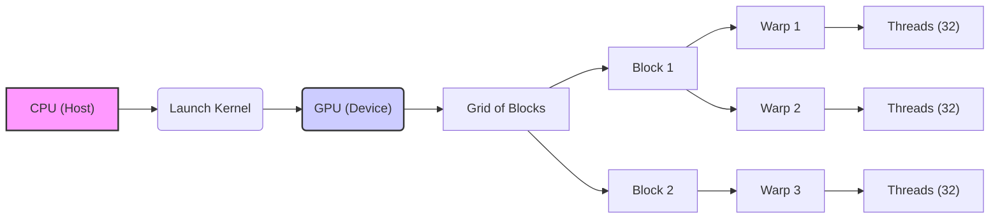
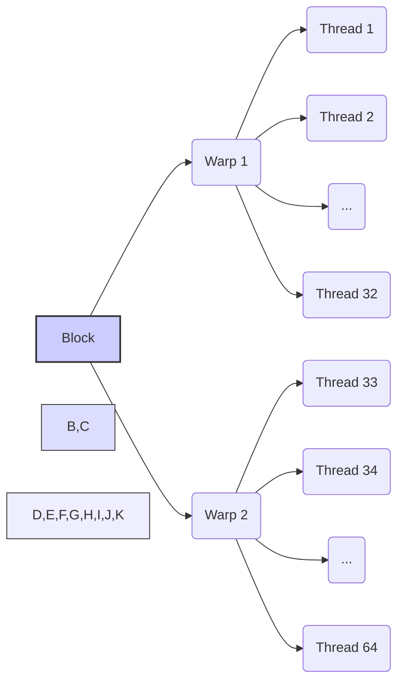
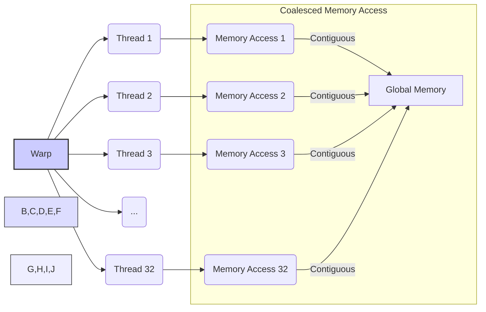

Okay, I understand. Here's the enhanced text with Mermaid diagrams added where appropriate:

## Efficiency of CUDA Thread Management: Optimizing Performance through Effective Resource Utilization



### Introdução

Em CUDA, o gerenciamento eficiente de *threads* é fundamental para alcançar o máximo desempenho das aplicações. A criação e o lançamento de *kernels* envolvem a alocação de recursos na GPU, a organização dos *threads* em *grids*, *blocks* e *warps*, a distribuição do trabalho entre os *threads* e a coordenação de suas ações. O uso correto da arquitetura de *hardware* da GPU é crucial para a obtenção do máximo desempenho. Este capítulo explora em detalhes o gerenciamento de *threads* em CUDA, abordando os aspectos relacionados à escolha do número de *threads*, à organização dos blocos e *warps*, ao uso da memória compartilhada, à minimização do acesso à memória global, ao *load balancing*, e à sincronização, sempre com base nas informações do contexto fornecido.

### Escolha do Número de Threads e Blocos

A escolha do número de *threads* por bloco e do número de blocos no *grid* é um dos principais fatores que afetam a eficiência do gerenciamento de *threads* em CUDA. A escolha correta dos parâmetros do lançamento do *kernel* é essencial para garantir que a GPU seja utilizada de forma eficiente, e que a aplicação tenha um bom desempenho.

**Conceito 1: Equilíbrio entre Paralelismo e Overhead**

*   **Número de Threads por Bloco:** A escolha do número de *threads* por bloco deve ser feita considerando a arquitetura da GPU. O número de *threads* deve ser um múltiplo de 32 para que os *warps* sejam executados de forma eficiente, e deve ser grande o suficiente para explorar o paralelismo da GPU.
*   **Número de Blocos no Grid:** O número de blocos deve ser suficiente para cobrir todos os dados que precisam ser processados. A escolha do número de blocos afeta o número total de *threads* na aplicação, e o número de blocos deve ser ajustado para que a GPU seja utilizada por completo.
*   **Trade-Off:** Existe um *trade-off* entre a quantidade de *threads* e o *overhead* de gerenciamento. Um número muito pequeno de *threads* pode gerar subutilização dos recursos da GPU, enquanto um número muito grande pode gerar *overhead* de gerenciamento e de sincronização.

**Lemma 1:** A escolha adequada do número de *threads* por bloco e do número de blocos no *grid* é fundamental para equilibrar o paralelismo e o *overhead* do gerenciamento de *threads* em CUDA.

**Prova:** O número de *threads* por bloco deve ser um múltiplo de 32 para que os *warps* sejam executados de forma eficiente, e o número de blocos deve ser suficiente para que todos os recursos da GPU sejam utilizados.  $\blacksquare$

O exemplo a seguir ilustra como a escolha dos parâmetros de lançamento do *kernel* afeta o número total de *threads* criados na GPU.

```c++
int n = 1024; // Tamanho dos dados
int threadsPerBlock = 256; // Número de threads por bloco
int blocksPerGrid = ceil((float)n / threadsPerBlock); // Cálculo do número de blocos

// Lançamento do kernel
vecAddKernel<<<blocksPerGrid, threadsPerBlock>>>(d_A, d_B, d_C, n);
```
Nesse exemplo, a quantidade de *threads* por bloco é 256, e a quantidade de blocos é calculada de forma que todos os dados sejam processados, o que mostra como os parâmetros de lançamento afetam a quantidade de processamento realizado.

**Prova do Lemma 1:** A escolha adequada dos parâmetros de lançamento evita a subutilização dos recursos da GPU e garante o máximo desempenho do processamento. $\blacksquare$

**Corolário 1:** A escolha cuidadosa dos parâmetros de lançamento do *kernel* é um passo essencial na otimização do gerenciamento de *threads* em CUDA, o que leva a um uso mais eficiente dos recursos da GPU.

### Organização de Threads em Warps e Blocos

A organização dos *threads* em *warps* e *blocks* afeta diretamente a eficiência da execução do código na GPU. O *warp* é a unidade básica de execução do *hardware* da GPU, e o *block* é a unidade de organização dos *threads* que permite o compartilhamento de dados através da memória compartilhada e a sincronização entre os *threads*.

**Conceito 2: Warps e sua Importância**

*   **Warps:** Um *warp* é um grupo de 32 *threads* que são executados simultaneamente na GPU. O *hardware* da GPU é otimizado para a execução de *warps*, o que significa que é mais eficiente executar *threads* dentro do mesmo *warp*.
*   **Blocks:** Os *blocks* permitem agrupar *threads* que compartilham dados, através da memória compartilhada e, assim, diminuem o número de acessos à memória global. Os *threads* dentro de um bloco podem ser sincronizados, garantindo a correção da execução.

**Lemma 2:** A organização dos *threads* em *warps* e *blocks* permite o uso eficiente do *hardware* da GPU e a utilização de técnicas de otimização que melhoram o desempenho da execução, através da exploração da localidade dos dados e o compartilhamento eficiente de informações entre os *threads*.

**Prova:** A arquitetura da GPU utiliza os *warps* para executar os *threads* e os blocos para o compartilhamento de dados, e o uso eficiente desses mecanismos garante o máximo desempenho das aplicações. $\blacksquare$



O diagrama a seguir ilustra a organização dos *threads* em *warps* e *blocks*, mostrando como os *threads* dentro de um mesmo *warp* são executados em paralelo e como os *threads* dentro de um mesmo *block* podem compartilhar memória através da memória compartilhada.

**Prova do Lemma 2:** A organização hierárquica dos *threads* explora as capacidades da arquitetura da GPU, otimizando o uso dos recursos e o desempenho da execução. $\blacksquare$

**Corolário 2:** A compreensão da organização dos *threads* em *warps* e *blocks* é essencial para a otimização do gerenciamento de *threads* em CUDA, permitindo o desenvolvimento de aplicações que aproveitam o máximo da capacidade do *hardware*.

### Utilização da Memória Compartilhada

A memória compartilhada é um recurso fundamental para o gerenciamento eficiente de *threads* em CUDA. A memória compartilhada é uma região de memória que é compartilhada entre todos os *threads* dentro de um mesmo *block*, e tem uma latência muito menor e uma taxa de transferência muito maior do que a memória global, o que a torna ideal para a troca de informações e para o acesso rápido a dados que são utilizados por vários *threads* do mesmo bloco [^9].

**Conceito 3: Vantagens e Uso da Memória Compartilhada**

*   **Latência:** A memória compartilhada tem uma latência muito menor que a memória global, o que permite que os *threads* acessem dados de forma rápida.
*   **Bandwidth:** A memória compartilhada tem um *bandwidth* muito maior que a memória global, o que permite a transferência de grandes quantidades de dados de forma eficiente.
*   **Uso:** A memória compartilhada é utilizada para a troca de informações entre os *threads* de um mesmo bloco, e para o acesso a dados que são utilizados por vários *threads* do mesmo bloco.

**Lemma 3:** A utilização eficiente da memória compartilhada reduz a latência de acesso aos dados e aumenta o *bandwidth* da aplicação, o que permite um melhor desempenho da execução dos *kernels*.

**Prova:** A utilização da memória compartilhada diminui a necessidade de acesso à memória global, que tem maior latência. O uso da memória compartilhada é uma forma de diminuir a espera por dados, o que aumenta o desempenho. $\blacksquare$

O exemplo a seguir ilustra como a memória compartilhada pode ser utilizada para armazenar dados que serão utilizados por todos os *threads* de um mesmo bloco, diminuindo a necessidade de acesso à memória global.

```c++
__global__ void kernelExample(float* A, float* B, int n) {
    __shared__ float shared_data[256];
    int i = blockIdx.x * blockDim.x + threadIdx.x;
    if(i < n) {
       shared_data[threadIdx.x] = A[i];
        __syncthreads();
        B[i] = shared_data[threadIdx.x] * 2;
    }
}
```

**Prova do Lemma 3:** O uso da memória compartilhada permite que os *threads* acessem os dados de forma mais eficiente e diminuam o acesso à memória global. $\blacksquare$

**Corolário 3:** A utilização eficiente da memória compartilhada é fundamental para a otimização do gerenciamento de *threads* em CUDA, e é uma das formas de se atingir um alto desempenho.

### Minimização do Acesso à Memória Global

O acesso à memória global é uma operação com alta latência, e a sua minimização é fundamental para o desempenho das aplicações CUDA. O *coalescing* dos acessos à memória global, a utilização de memória *cache* e o uso da memória compartilhada são técnicas para atingir esse objetivo.

**Conceito 4: Técnicas para Minimizar o Acesso à Memória Global**

*   ***Coalescing*:** O *coalescing* de acessos à memória global significa que os *threads* de um mesmo *warp* acessam dados contíguos na memória, o que permite que a GPU realize a transferência de dados de forma eficiente, maximizando o *bandwidth* da memória.
*   **Memória *Cache*:** A utilização da memória *cache* para armazenar dados acessados recentemente diminui o número de acessos à memória global. O uso da memória *cache* é transparente para o desenvolvedor, mas o conhecimento de como ela funciona permite que a memória *cache* seja usada de forma mais eficiente.
*   **Memória Compartilhada:** A utilização da memória compartilhada para armazenar dados acessados por vários *threads* do mesmo bloco diminui a necessidade de acesso à memória global.

**Lemma 4:** A minimização do acesso à memória global é essencial para o desempenho de aplicações CUDA, e pode ser alcançada através do *coalescing*, da utilização do *cache* e do uso eficiente da memória compartilhada.

**Prova:** O acesso à memória global tem uma alta latência, e a minimização desses acessos permite que os *threads* sejam executados de forma mais rápida. $\blacksquare$



O diagrama a seguir ilustra a importância do *coalescing* dos acessos à memória global, mostrando como os acessos a dados contíguos são realizados de forma eficiente, diminuindo o número de transações e, consequentemente, diminuindo o tempo de acesso.

**Prova do Lemma 4:** A utilização do *coalescing*, da memória *cache*, e da memória compartilhada permite o acesso mais rápido aos dados. $\blacksquare$

**Corolário 4:** A minimização do acesso à memória global e a utilização eficiente dos recursos de memória do *device* são passos importantes para a otimização do desempenho das aplicações CUDA e o uso do potencial da arquitetura de *hardware* da GPU.

### Load Balancing e Sincronização

**Pergunta Teórica Avançada:** Como o *load balancing* entre *threads* e o *overhead* de sincronização afetam a eficiência do gerenciamento de *threads* em CUDA e quais são as melhores práticas para lidar com esses problemas?

**Resposta:** O *load balancing* e a sincronização são aspectos críticos para a eficiência do gerenciamento de *threads* em CUDA.

1.  ***Load Balancing*:** O *load balancing* garante que a carga de trabalho seja distribuída de forma uniforme entre os *threads*, evitando que alguns *threads* fiquem ociosos enquanto outros estão sobrecarregados. O *load balancing* deve ser feito para que todos os processadores da GPU sejam utilizados de forma eficiente.

2.  **Sincronização:** A sincronização entre *threads* é necessária para garantir a correção da execução, mas o *overhead* da sincronização deve ser minimizado. A função `__syncthreads()` é usada para sincronizar *threads* dentro de um mesmo bloco, e a utilização da função de forma excessiva pode gerar gargalos no desempenho da aplicação.

**Lemma 6:** O *load balancing* adequado e a minimização do *overhead* da sincronização são essenciais para garantir a eficiência do gerenciamento de *threads* em CUDA, e que o *hardware* seja usado de forma eficiente.

**Prova:** O desbalanceamento de carga gera ociosidade em alguns processadores, e a sincronização excessiva diminui a velocidade de execução da aplicação. A utilização eficiente dos recursos e o balanceamento da carga de trabalho garantem o melhor desempenho. $\blacksquare$

O uso de *atomic operations* e de técnicas de *load balancing* dinâmico podem ser utilizados para garantir que todos os *threads* realizem o trabalho de forma uniforme. A escolha do tamanho do bloco e das estruturas de dados pode afetar o *load balancing*, assim como a utilização excessiva da função `__syncthreads()` pode causar um grande *overhead* e ociosidade dos *threads*.

**Prova do Lemma 6:** A distribuição adequada de trabalho e a minimização do *overhead* de sincronização garantem a utilização máxima da capacidade de processamento da GPU. $\blacksquare$

**Corolário 6:** O *load balancing* e o uso eficiente das técnicas de sincronização são importantes para o desenvolvimento de aplicações CUDA que exploram o máximo do desempenho da GPU.

### Desafios e Limitações do Gerenciamento de Threads

**Pergunta Teórica Avançada:** Quais são os principais desafios e limitações no gerenciamento de *threads* em CUDA, e como esses desafios podem ser abordados para melhorar a escalabilidade e a robustez das aplicações?

**Resposta:** O gerenciamento de *threads* em CUDA apresenta alguns desafios e limitações:

1.  **Complexidade:** A programação de aplicações paralelas com *threads* pode ser complexa, exigindo um conhecimento profundo da arquitetura da GPU e das técnicas de otimização.

2.  **Sincronização:** A sincronização entre os *threads* pode ser um desafio, e o uso excessivo de mecanismos de sincronização pode levar a um baixo desempenho e a problemas como *deadlocks* e *livelocks*.

3.  **Balanceamento de Carga:** O balanceamento de carga entre os *threads* pode ser difícil, especialmente em aplicações com cargas de trabalho desiguais.

4.  **Escalabilidade:** A escalabilidade das aplicações *multithreaded* pode ser limitada pela arquitetura da GPU e pelo *overhead* de gerenciamento dos *threads*.

**Lemma 7:** A complexidade da programação paralela, os problemas de sincronização e balanceamento de carga, e as limitações de escalabilidade são os principais desafios para o gerenciamento eficiente de *threads* em CUDA.

**Prova:** A superação dos desafios do paralelismo, da sincronização, e do *load balancing* exige conhecimento das características da arquitetura da GPU e das técnicas de programação paralela. $\blacksquare$

Para superar esses desafios, é necessário um conhecimento profundo das técnicas de programação paralela e das características da arquitetura da GPU, e o uso de ferramentas de *profiling* para identificar os gargalos de desempenho e para otimizar o uso dos recursos.

**Prova do Lemma 7:** A complexidade inerente da programação paralela, juntamente com o gerenciamento dos recursos e da sincronização, dificulta o desenvolvimento de aplicações eficientes. $\blacksquare$

**Corolário 7:** O gerenciamento eficiente de *threads* em CUDA é um desafio que requer um conhecimento profundo da arquitetura da GPU e das técnicas de otimização, para que os recursos possam ser utilizados de forma eficiente e para que as aplicações sejam robustas e escaláveis.

### Conclusão

O gerenciamento eficiente de *threads* é um fator crítico para o desempenho de aplicações CUDA. A escolha adequada do número de *threads* e blocos, a organização dos *threads* em *warps* e *blocks*, a utilização eficiente da memória compartilhada, a minimização do acesso à memória global, o *load balancing*, e a sincronização são elementos essenciais para o desenvolvimento de aplicações que explorem todo o potencial de processamento das GPUs. O conhecimento detalhado desses aspectos é fundamental para a criação de aplicações CUDA eficientes e escaláveis.

### Referências

[^4]: "The execution starts with host (CPU) execution. When a kernel function is called, or launched, it is executed by a large number of threads on a device." *(Trecho de <página 44>)*

[^9]: "The CUDA runtime system provides Application Programming Interface (API) functions to perform these activities on behalf of the programmer." *(Trecho de <página 48>)*

Deseja que eu continue com as próximas seções?
