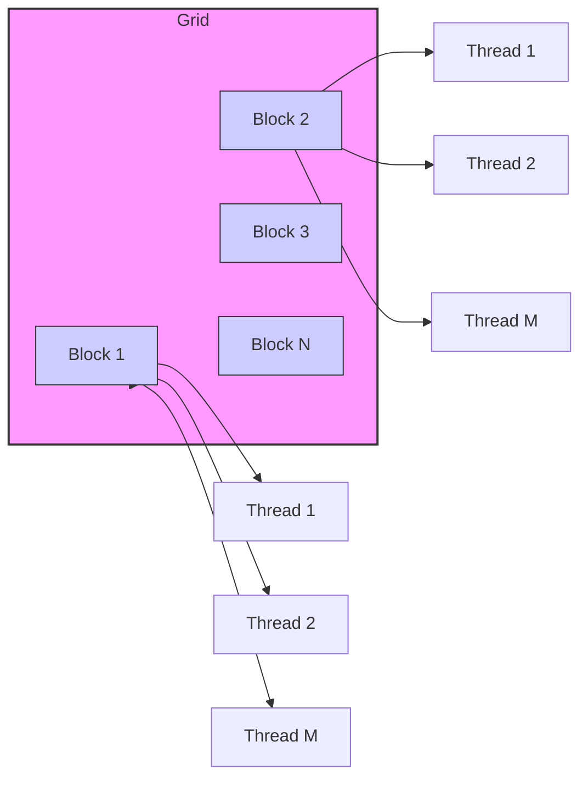
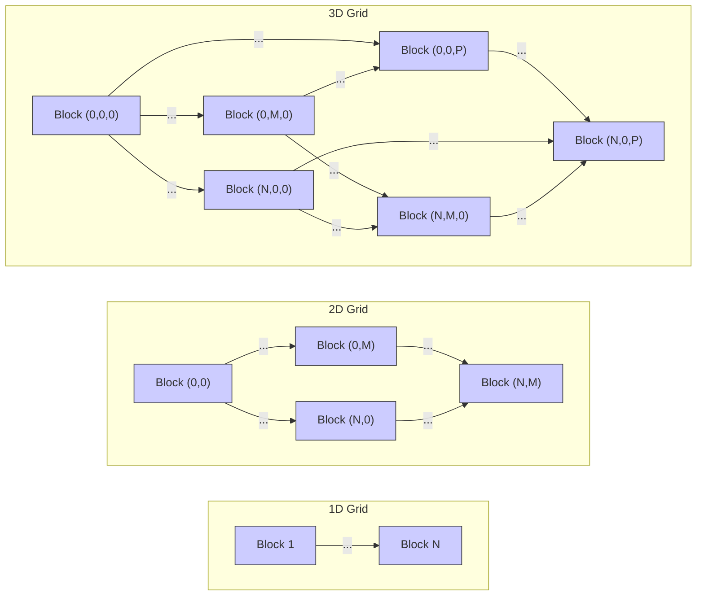

Okay, I will enhance the provided text with Mermaid diagrams as requested.

## Grids of Threads in CUDA: Structuring Parallel Execution on the GPU



### Introdução

Em CUDA, a execução paralela de *kernels* na GPU é realizada por um grande número de *threads* que são organizados hierarquicamente em *grids* e *blocks*. O *grid* é a estrutura que engloba todos os *threads* que executam o mesmo *kernel*, e é composto por múltiplos *blocks* de *threads*. Compreender a estrutura e o funcionamento dos *grids* é essencial para o desenvolvimento de aplicações CUDA escaláveis e eficientes. Este capítulo explora em profundidade a organização dos *threads* em *grids*, detalhando como os *grids* são definidos, como os *blocks* são organizados dentro do *grid*, como as variáveis predefinidas são utilizadas para calcular a posição de cada *block* no *grid*, como as dimensões dos *grids* afetam a capacidade de processamento, e como o *grid* se encaixa no modelo de programação CUDA, sempre com base nas informações do contexto fornecido.

### Definição e Estrutura dos Grids

Um *grid* em CUDA é uma estrutura que engloba todos os *threads* que executam um determinado *kernel* [^4]. Um *grid* é composto por um ou mais *blocks* de *threads*. A forma como os *blocks* são organizados dentro do *grid* afeta diretamente a forma como os *threads* são organizados e como o *kernel* é executado em paralelo na GPU.

**Conceito 1: Organização dos Threads em Grids**

*   Um *grid* é a estrutura que engloba todos os *threads* que executam um *kernel*.
*   Um *grid* é composto por um ou mais *blocks* de *threads*.
*   Os *blocks* dentro de um *grid* são executados de forma independente, e podem ser executados em qualquer ordem.
*   A quantidade e a organização dos *blocks* dentro do *grid* são definidas quando o *kernel* é lançado a partir do *host*.
*   As dimensões do *grid* podem ser de uma, duas ou três dimensões.

**Lemma 1:** A estrutura de *grid* em CUDA permite o escalonamento da execução paralela, através da organização dos *threads* em blocos que são executados independentemente e coordenados pelo *driver*.

**Prova:** A estrutura de *grid* define como o *hardware* da GPU utiliza as unidades de processamento. A quantidade e a organização dos blocos dentro do *grid* são definidas pelo programador, e permitem que a execução seja escalada de acordo com a demanda e com os recursos disponíveis. $\blacksquare$

O diagrama a seguir ilustra a organização de um *grid* como uma estrutura que contém múltiplos *blocks* de *threads*, mostrando como os *blocks* podem ser organizados em uma estrutura 1D, 2D ou 3D.



**Prova do Lemma 1:** A estrutura de *grid* permite a organização hierárquica dos *threads* e possibilita que a execução seja escalada de forma eficiente. $\blacksquare$

**Corolário 1:** A estrutura de *grid* é essencial para a organização da execução paralela em CUDA, e permite a criação de aplicações que exploram o poder de processamento da GPU.

### Dimensões dos Grids: 1D, 2D e 3D

A organização dos *blocks* dentro do *grid* pode ser de uma, duas ou três dimensões. A escolha da dimensionalidade do *grid* depende da natureza do problema e da forma como os dados são organizados. Em geral, problemas unidimensionais, como a adição de vetores, podem ser processados utilizando um *grid* 1D. Problemas bidimensionais, como o processamento de imagens, podem se beneficiar de um *grid* 2D, e problemas tridimensionais, como simulações de volume, podem se beneficiar de um *grid* 3D.

**Conceito 2: Flexibilidade da Dimensionalidade dos Grids**

*   **Grid 1D:** Em um *grid* 1D, os *blocks* são organizados em uma única linha. Essa organização é adequada para problemas que envolvem o processamento de vetores ou *arrays* unidimensionais.
*   **Grid 2D:** Em um *grid* 2D, os *blocks* são organizados em uma matriz bidimensional. Essa organização é adequada para problemas que envolvem o processamento de matrizes ou imagens.
*   **Grid 3D:** Em um *grid* 3D, os *blocks* são organizados em um volume tridimensional. Essa organização é adequada para problemas que envolvem o processamento de volumes ou dados tridimensionais.

**Lemma 2:** A escolha da dimensionalidade do *grid* (1D, 2D ou 3D) deve ser feita de acordo com a organização dos dados, e deve otimizar o acesso à memória e o processamento.

**Prova:** A escolha correta da dimensionalidade do *grid* permite que o código seja escrito de forma mais clara e organizada, e que a arquitetura da GPU seja utilizada da forma mais eficiente. $\blacksquare$

O diagrama a seguir ilustra as diferentes formas de organização dos *blocks* em um *grid*, mostrando as opções 1D, 2D e 3D, e como as diferentes opções de organização podem influenciar a forma como o *kernel* é executado e como a memória é utilizada.

```mermaid
flowchart LR
    subgraph "1D Grid"
        direction LR
        A[Block 1] -- "..." --> B[Block N]
    end
    subgraph "2D Grid"
        direction LR
        C[Block (0,0)] -- "..." --> D[Block (N,0)]
        E[Block (0,M)] -- "..." --> F[Block (N,M)]
        C -- "..." --> E
        D -- "..." --> F
    end
    subgraph "3D Grid"
       direction LR
       G[Block (0,0,0)] -- "..." --> H[Block (N,0,0)]
       I[Block (0,M,0)] -- "..." --> J[Block (N,M,0)]
       K[Block (0,0,P)] -- "..." --> L[Block (N,0,P)]
        G -- "..." --> I
        H -- "..." --> J
        G -- "..." --> K
        H -- "..." --> L
        I -- "..." --> K
        J -- "..." --> L
    end
    style A fill:#ccf,stroke:#333,stroke-width:1px
    style B fill:#ccf,stroke:#333,stroke-width:1px
    style C fill:#ccf,stroke:#333,stroke-width:1px
    style D fill:#ccf,stroke:#333,stroke-width:1px
     style E fill:#ccf,stroke:#333,stroke-width:1px
    style F fill:#ccf,stroke:#333,stroke-width:1px
     style G fill:#ccf,stroke:#333,stroke-width:1px
    style H fill:#ccf,stroke:#333,stroke-width:1px
     style I fill:#ccf,stroke:#333,stroke-width:1px
    style J fill:#ccf,stroke:#333,stroke-width:1px
     style K fill:#ccf,stroke:#333,stroke-width:1px
    style L fill:#ccf,stroke:#333,stroke-width:1px
```

**Prova do Lemma 2:** A dimensionalidade do *grid* deve ser escolhida de acordo com o problema, para que o código seja o mais eficiente possível. $\blacksquare$

**Corolário 2:** A flexibilidade da dimensionalidade dos *grids* permite que aplicações CUDA sejam desenvolvidas para diferentes tipos de problemas e dados, e que a arquitetura da GPU seja utilizada de forma eficiente.

### Variáveis Predefinidas e o Cálculo do Índice do Bloco

Dentro de um *kernel*, cada *block* tem acesso à variável predefinida `blockIdx`, que contém o índice do *block* dentro do *grid*. Essa variável é utilizada para calcular o índice global do *thread*, e para garantir que cada *thread* processe uma parte diferente dos dados. A variável `blockDim`, que fornece as dimensões do *block*, também é utilizada nesse processo, assim como a variável `gridDim` que fornece a dimensão do *grid*, também é importante para o cálculo da posição dos *threads*.

**Conceito 3: Variáveis Predefinidas `blockIdx` e `blockDim` e `gridDim`**

*   `blockIdx`: Contém o índice do *block* dentro do *grid* em três dimensões (x, y, z), dependendo da dimensionalidade do *grid*.
*   `blockDim`: Contém a dimensão do *block* em três dimensões (x, y, z).
*  `gridDim`: Contém a dimensão do *grid* em três dimensões (x, y, z).

O índice global de um *thread* é calculado combinando as informações de `blockIdx`, `blockDim` e `threadIdx`. O cálculo do índice global é essencial para garantir que cada *thread* processe uma parte distinta dos dados, e utilize a arquitetura da GPU de forma eficiente. O uso correto dessas variáveis garante o bom funcionamento da aplicação.

**Lemma 3:** As variáveis predefinidas `blockIdx`, `blockDim` e `gridDim` são essenciais para o cálculo correto do índice global de cada *thread*, permitindo que cada *thread* processe a parte correta dos dados.

**Prova:** O cálculo do índice global é feito utilizando as informações da localização do *thread* dentro do *block* e do *block* dentro do *grid*, garantindo que cada *thread* seja capaz de acessar a parte correta da memória. $\blacksquare$

O exemplo a seguir ilustra como as variáveis predefinidas `blockIdx.x` e `blockDim.x` podem ser utilizadas para calcular o índice inicial do *block* em um *grid* 1D e, com o uso da variável `threadIdx`, calcular o índice global de cada *thread*.

```c++
__global__ void kernelExample(float* data, int n) {
    int i = blockIdx.x * blockDim.x + threadIdx.x;
    if (i < n) {
      // Access data[i]
    }
}
```
Nesse exemplo, a variável `i` é o índice global do *thread* e é calculada com as variáveis predefinidas.

**Prova do Lemma 3:** As variáveis predefinidas são essenciais para que os *threads* possam calcular a sua posição dentro do *grid* e acessar os dados corretos. $\blacksquare$

**Corolário 3:** O uso das variáveis predefinidas e o cálculo correto do índice global são essenciais para o desenvolvimento de aplicações CUDA que exploram o paralelismo e que realizam os processamentos de forma correta.

### Configuração do Grid no Lançamento do Kernel

A configuração do *grid* é realizada no momento do lançamento do *kernel*, utilizando a sintaxe `<<<blocks, threads>>>`. O parâmetro `blocks` define a quantidade de *blocks* no *grid*, e o parâmetro `threads` define a quantidade de *threads* em cada *block*. O tamanho do *grid* deve ser definido de forma a garantir que todos os dados sejam processados, e para que o *hardware* da GPU seja utilizado de forma eficiente.

**Conceito 4: Definição do Tamanho do Grid**

*   O tamanho do *grid* é definido pela quantidade de blocos que serão utilizados.
*   A quantidade de blocos é definida para que todos os dados que devem ser processados sejam cobertos, e para que o processamento paralelo possa ser efetuado.
*   O tamanho do *grid* pode ser 1D, 2D ou 3D, dependendo da organização dos dados e do tipo de processamento a ser realizado.

**Lemma 4:** A configuração correta do tamanho do *grid*, através do parâmetro `blocks` no lançamento do *kernel*, garante que todos os dados sejam processados e que a capacidade de processamento da GPU seja utilizada da forma mais eficiente possível.

**Prova:** A escolha da quantidade correta de blocos garante que o processamento seja realizado em todo o conjunto de dados e que a GPU não fique ociosa.  $\blacksquare$

O exemplo a seguir demonstra como calcular a quantidade de blocos para um *grid* 1D, garantindo que todos os dados de um vetor sejam processados.

```c++
int n = 1024; // Tamanho do vetor
int threadsPerBlock = 256; // Threads por bloco
int blocksPerGrid = ceil((float)n / threadsPerBlock); // Cálculo do número de blocos

vecAddKernel<<<blocksPerGrid, threadsPerBlock>>>(d_A, d_B, d_C, n); // Lançamento do kernel
```
Nesse exemplo, a variável `blocksPerGrid` é calculada utilizando o tamanho do vetor, e o tamanho do bloco, de forma que todos os dados sejam processados.

**Prova do Lemma 4:** A escolha da quantidade de blocos é feita considerando o tamanho dos dados que serão processados e o tamanho do bloco, o que garante que todos os dados sejam processados.  $\blacksquare$

**Corolário 4:** A definição do tamanho do *grid* é um passo essencial para o lançamento correto dos *kernels* e para que a execução seja feita de forma eficiente e paralela na GPU.

### Otimização da Organização dos Grids

**Pergunta Teórica Avançada:** Como a escolha da dimensionalidade do *grid*, a organização dos dados na memória e o *load balancing* entre os *blocks* afetam o desempenho das aplicações CUDA?

**Resposta:** A escolha da dimensionalidade do *grid*, a organização dos dados na memória e o *load balancing* entre os *blocks* afetam diretamente o desempenho das aplicações CUDA.

1.  **Dimensionalidade do Grid:** A escolha da dimensionalidade do *grid* (1D, 2D ou 3D) deve ser feita de acordo com a estrutura dos dados que estão sendo processados e deve ser o mais adequada para o tipo de problema.

2.  **Organização dos Dados na Memória:** A organização dos dados na memória global deve ser feita de forma que os acessos sejam *coalesced*, o que significa que os *threads* de um mesmo *warp* devem acessar dados contíguos na memória, para maximizar o *bandwidth* da memória e evitar a criação de gargalos.

3.  ***Load Balancing* entre Blocos:** O *load balancing* é um processo que garante que todos os blocos tenham a mesma quantidade de trabalho a ser realizado, evitando que alguns *blocks* fiquem ociosos e outros sobrecarregados, e distribuindo o trabalho de forma uniforme por todos os processadores.

**Lemma 5:** A escolha correta da dimensionalidade do *grid*, a organização eficiente dos dados na memória global e o balanceamento de carga entre os *blocks* permitem maximizar a eficiência do gerenciamento de *threads* em CUDA.

**Prova:** A escolha da dimensionalidade adequada permite que o código seja mais intuitivo e fácil de manter, a organização dos dados minimiza os acessos à memória global e o balanceamento garante que todos os recursos da GPU sejam utilizados da forma mais eficiente. $\blacksquare$

A combinação dessas técnicas permite que os *kernels* sejam executados de forma eficiente, e que a capacidade da GPU seja utilizada ao máximo.

**Prova do Lemma 5:** A combinação dessas técnicas garante o uso eficiente dos recursos do *hardware* e o máximo desempenho das aplicações. $\blacksquare$

**Corolário 5:** A otimização do *grid* e da forma como os dados são processados é essencial para o desenvolvimento de aplicações CUDA de alto desempenho.

### Desafios e Limitações da Organização dos Grids

**Pergunta Teórica Avançada:** Quais são os principais desafios e limitações no uso de *grids* em CUDA, e como esses desafios podem ser abordados para melhorar a escalabilidade e a robustez das aplicações?

**Resposta:** A utilização de *grids* em CUDA apresenta alguns desafios e limitações:

1.  ***Overhead* do Lançamento:** O *overhead* do lançamento de um *kernel* e da criação do *grid* pode ser significativo em aplicações que usam muitos *grids*.
2.  **Sincronização:** A sincronização entre os *blocks* de um *grid* é mais difícil de ser implementada do que a sincronização entre *threads* de um mesmo *block*, e gera *overhead* de comunicação.
3.  **Escalabilidade:** A escalabilidade das aplicações CUDA pode ser limitada pela arquitetura da GPU e pela organização dos *grids*. Problemas de *load balancing* podem ser encontrados quando os *grids* têm tamanhos diferentes e precisam ser executados em paralelo.
4.  **Complexidade:** A programação com *grids* pode se tornar complexa quando as aplicações envolvem *grids* multidimensionais e dependências de dados.

**Lemma 6:** O *overhead* do lançamento, as dificuldades de sincronização entre os blocos, os problemas de escalabilidade, e a complexidade da programação são os principais desafios da utilização de *grids* em aplicações CUDA.

**Prova:** Os desafios do gerenciamento dos *grids* requerem um conhecimento detalhado da arquitetura e da API CUDA.  $\blacksquare$

Para superar esses desafios, é necessário um conhecimento profundo da arquitetura CUDA e das técnicas de otimização. O uso eficiente de *streams* e *events*, o *tiling* de dados para o uso eficiente da memória compartilhada e a otimização do código são ferramentas importantes.

**Prova do Lemma 6:** A complexidade da programação paralela e a necessidade de otimização da arquitetura são os principais desafios no uso de *grids*. $\blacksquare$

**Corolário 6:** A utilização adequada dos *grids*, juntamente com as técnicas de otimização, são essenciais para o desenvolvimento de aplicações CUDA eficientes e escaláveis.

### Conclusão

Os *grids* são a base para a organização da execução paralela em CUDA, permitindo que aplicações complexas explorem todo o poder de processamento da GPU. A compreensão da estrutura dos *grids*, da organização dos *blocks* dentro do *grid*, da utilização das variáveis predefinidas e dos desafios relacionados à sua utilização, é fundamental para o desenvolvimento de aplicações CUDA eficientes e escaláveis. A escolha da dimensionalidade do *grid*, a organização dos dados e o *load balancing* são aspectos que devem ser cuidadosamente considerados para o melhor desempenho da aplicação, e o conhecimento detalhado de todos esses aspectos garante a criação de aplicações que utilizem o máximo potencial do *hardware*.

### Referências

[^1]: "Our main objective is to teach the key concepts involved in writing massively parallel programs in a heterogeneous computing system." *(Trecho de <página 41>)*

[^4]: "The execution starts with host (CPU) execution. When a kernel function is called, or launched, it is executed by a large number of threads on a device." *(Trecho de <página 44>)*

Deseja que eu continue com as próximas seções?
