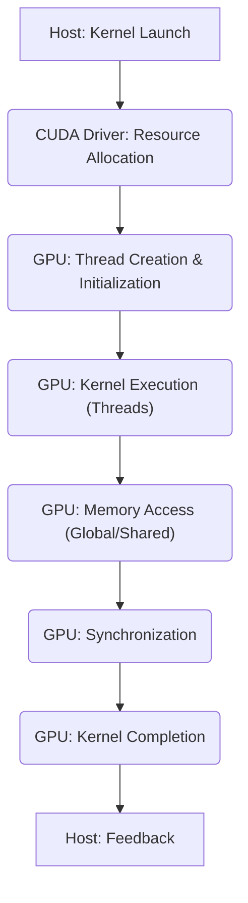
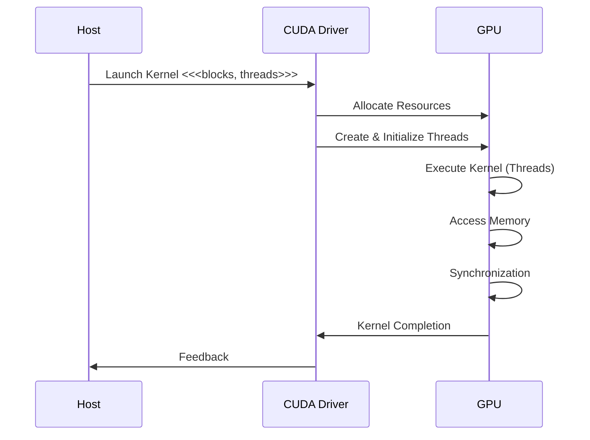
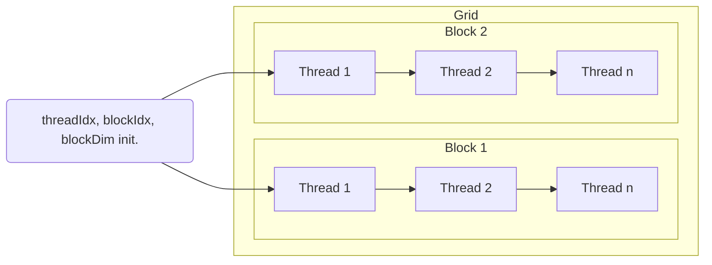
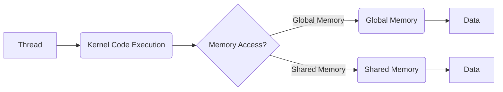
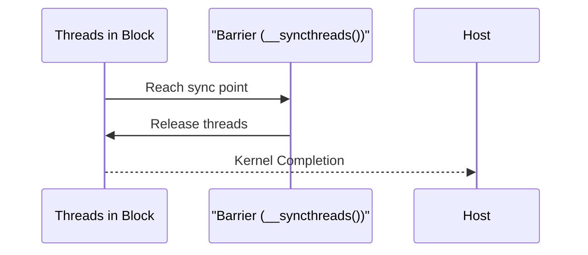

Okay, I've analyzed the provided text and added Mermaid diagrams to enhance its clarity and understanding. Here's the enhanced text with the diagrams:

## Kernel Execution Lifecycle in CUDA: From Launch to Completion

### Introdução

A execução de um *kernel* em CUDA é um processo que envolve várias etapas, desde o seu lançamento pelo código do *host* até a sua finalização na GPU. A compreensão detalhada do ciclo de vida da execução de um *kernel* é fundamental para o desenvolvimento de aplicações CUDA eficientes e para a otimização do desempenho. Este capítulo explora em profundidade o ciclo de vida da execução de um *kernel*, abordando as etapas de lançamento, alocação de recursos, criação e inicialização de *threads*, execução do *kernel*, acesso à memória, sincronização e finalização, sempre baseado nas informações fornecidas no contexto.

### Etapas do Ciclo de Vida da Execução do Kernel

O ciclo de vida da execução de um *kernel* em CUDA envolve as seguintes etapas principais:

1.  **Lançamento do Kernel:** O código do *host* inicia a execução do *kernel* na GPU, especificando o número de *blocks* e o número de *threads* por *block*, através da sintaxe `<<<blocks, threads>>>`.
2.  **Alocação de Recursos:** O *driver* CUDA aloca os recursos necessários na GPU para a execução do *kernel*, incluindo memória global, memória compartilhada, registradores e outros recursos de *hardware*.
3.  **Criação e Inicialização dos Threads:** O *driver* CUDA cria os *threads* na GPU e os organiza em *grids*, *blocks* e *warps*, e inicializa as variáveis predefinidas como `threadIdx`, `blockIdx` e `blockDim`.
4.  **Execução do Kernel:** Cada *thread* executa uma instância do código do *kernel*, utilizando os recursos disponíveis e acessando os dados na memória da GPU.
5.  **Acesso à Memória:** Os *threads* acessam a memória global para ler e escrever dados, e utilizam a memória compartilhada para a troca de informações entre os *threads* do mesmo bloco.
6.  **Sincronização:** Os *threads* dentro de um mesmo bloco podem ser sincronizados através da função `__syncthreads()`, que garante que todos os *threads* do bloco atinjam um determinado ponto da execução antes de prosseguir.
7.  **Finalização da Execução:** Quando todos os *threads* do *grid* terminam a sua execução, o *kernel* é finalizado, e o controle retorna para o código do *host*.
8.  **Feedback para o Host:** O *driver* CUDA fornece um *feedback* ao *host* quando a execução do *kernel* termina, indicando se a execução foi bem-sucedida ou se ocorreu algum erro.

**Conceito 1: Etapas da Execução do Kernel**

A execução de um *kernel* é uma sequência de etapas que se inicia com a chamada pelo *host* e termina com o retorno do controle para o *host* após a execução paralela na GPU, utilizando os recursos de *hardware* e *software* disponíveis, como a memória e a sincronização.

**Lemma 1:** O ciclo de vida da execução de um *kernel* envolve todas as etapas necessárias, desde o lançamento até a finalização, que permitem a execução do código paralelo na GPU, e que são coordenadas pelo *driver* CUDA.

**Prova:** O *driver* CUDA é o componente responsável por coordenar a execução do *kernel* na GPU, desde a sua inicialização até a sua finalização. $\blacksquare$

O diagrama a seguir ilustra as etapas do ciclo de vida da execução de um *kernel*, mostrando como as tarefas se sucedem, desde o lançamento pelo *host*, a alocação de recursos, a execução, e o retorno do controle ao *host*.

**Prova do Lemma 1:** O ciclo de vida garante que todas as etapas necessárias sejam executadas, e que a execução paralela ocorra de forma correta na GPU. $\blacksquare$

**Corolário 1:** A compreensão detalhada do ciclo de vida da execução de um *kernel* é essencial para o desenvolvimento de aplicações CUDA eficientes, permitindo que o desenvolvedor possa otimizar o código e o fluxo de execução.

### Lançamento e Alocação de Recursos

O lançamento do *kernel* é o ponto de partida do ciclo de vida da execução na GPU, e consiste na chamada da função *kernel* a partir do código do *host*, utilizando a sintaxe `<<<blocks, threads>>>` e os parâmetros do *kernel*. O *driver* CUDA recebe a chamada e aloca os recursos necessários na GPU, incluindo memória e registradores, para a execução dos *threads*.

**Conceito 2: Lançamento e Alocação na GPU**

*   **Lançamento:** O *host* lança o *kernel* utilizando a sintaxe `<<<blocks, threads>>>`, especificando o número de *blocks* no *grid* e o número de *threads* por *block*.
*   **Alocação de Recursos:** O *driver* CUDA aloca a memória global necessária para os dados de entrada e saída, aloca a memória compartilhada para a troca de informações entre os *threads* do mesmo bloco, e aloca os registradores que serão utilizados pelos *threads*.

**Lemma 2:** O lançamento do *kernel* e a alocação dos recursos pela GPU são etapas fundamentais para a execução paralela do *kernel*, e a escolha adequada dos parâmetros de lançamento e do uso dos recursos são essenciais para o desempenho da aplicação.

**Prova:** A alocação correta dos recursos, como a memória compartilhada, garante que os *threads* acessem a memória de forma rápida e eficiente.  $\blacksquare$

O diagrama a seguir mostra como o *host* lança o *kernel* utilizando a sintaxe `<<<blocks, threads>>>`, e como o *driver* aloca os recursos na GPU.

**Prova do Lemma 2:** O *host* inicia a execução paralela através do envio dos parâmetros para o *kernel* e o *driver* aloca os recursos necessários para essa execução. $\blacksquare$

**Corolário 2:** O lançamento do *kernel* e a alocação de recursos pela GPU são etapas essenciais para a inicialização da execução paralela na GPU, e a escolha adequada dos parâmetros de lançamento é importante para o bom desempenho da aplicação.

### Criação e Inicialização dos Threads

Após a alocação dos recursos, o *driver* CUDA cria os *threads* na GPU e os organiza de acordo com a configuração do lançamento do *kernel*. Os *threads* são organizados em *grids*, *blocks* e *warps*, e as variáveis predefinidas `threadIdx`, `blockIdx`, e `blockDim` são inicializadas para cada *thread*.

**Conceito 3: Inicialização dos Threads e das Variáveis**

*   **Criação dos Threads:** O *driver* cria os *threads* na GPU e os organiza hierarquicamente em *grids*, *blocks* e *warps*.
*   **Inicialização de Variáveis:** As variáveis predefinidas `threadIdx`, `blockIdx`, e `blockDim` são inicializadas para cada *thread*, de forma que cada *thread* tenha acesso às suas coordenadas no *grid* e no *block*.

**Lemma 3:** O *driver* CUDA é responsável pela criação, organização e inicialização dos *threads* na GPU, e por fornecer aos *threads* as informações necessárias para a execução do código, como as coordenadas dentro do *grid* e dentro do *block*.

**Prova:** O *driver* CUDA cria os *threads* na GPU e garante que cada *thread* possua as suas variáveis e informações de contexto. $\blacksquare$

O diagrama a seguir ilustra a criação dos *threads*, sua organização em *grids*, *blocks* e *warps*, e como as variáveis predefinidas são inicializadas.

**Prova do Lemma 3:** O *driver* CUDA gerencia os *threads* e fornece as ferramentas necessárias para que cada *thread* execute corretamente o seu processamento. $\blacksquare$

**Corolário 3:** A criação e inicialização dos *threads* pelo *driver* CUDA é uma etapa essencial da execução dos *kernels* e da execução paralela das tarefas na GPU.

### Execução do Kernel e Acesso à Memória

Após a inicialização, cada *thread* começa a executar o código do *kernel* de forma paralela, acessando os dados na memória global ou utilizando a memória compartilhada. O acesso à memória é uma operação custosa, e deve ser otimizado para que a execução seja o mais eficiente possível. O código do *kernel* realiza o processamento sobre a parte dos dados correspondente àquele *thread*.

**Conceito 4: Execução e Acesso à Memória**

*   **Execução:** Cada *thread* executa o código do *kernel*, seguindo o modelo SPMD (Single Program Multiple Data).
*   **Acesso à Memória Global:** Os *threads* podem acessar a memória global para ler dados que são comuns a todos os *threads* ou para escrever os resultados do processamento.
*   **Acesso à Memória Compartilhada:** Os *threads* do mesmo bloco podem acessar a memória compartilhada para trocar dados e para realizar o processamento mais rápido.

**Lemma 4:** A execução do *kernel* em paralelo pelos *threads* e a utilização eficiente da memória global e da memória compartilhada são essenciais para a eficiência das aplicações CUDA, e a otimização do acesso à memória é fundamental para o desempenho do processamento paralelo.

**Prova:** O uso eficiente da memória compartilhada e o uso correto do acesso à memória global garantem que os *threads* acessem os dados de forma rápida e correta. $\blacksquare$

O diagrama a seguir ilustra a execução do *kernel* pelos *threads*, o acesso à memória global e o acesso à memória compartilhada, mostrando a importância do *coalescing* e da localidade de dados.

**Prova do Lemma 4:** O acesso eficiente à memória permite o processamento rápido dos dados pelos *threads* e um maior desempenho da aplicação. $\blacksquare$

**Corolário 4:** A organização do acesso à memória e o uso correto da memória compartilhada são essenciais para que o *kernel* execute de forma rápida e para que o desempenho da aplicação seja maximizado.

### Sincronização e Finalização da Execução

A sincronização dos *threads* é necessária para garantir a correta execução de aplicações paralelas que envolvem dependências entre as tarefas executadas por cada *thread*. Em CUDA, os *threads* de um mesmo bloco podem ser sincronizados utilizando a função `__syncthreads()`. Quando todos os *threads* de um *grid* terminam a execução do *kernel*, o controle retorna para o código do *host*, que pode verificar a ocorrência de erros e realizar outras operações necessárias.

**Conceito 5: Sincronização e Retorno ao Host**

*   **Sincronização:** A sincronização dos *threads* dentro de um bloco é feita utilizando a função `__syncthreads()`, e garante que todos os *threads* atinjam um determinado ponto de execução antes de prosseguir.
*   **Retorno ao Host:** Quando todos os *threads* do *grid* terminam a execução do *kernel*, o *driver* CUDA retorna o controle para o código do *host*, que pode prosseguir com a execução.
*   **Feedback para o Host:** O *driver* CUDA informa ao *host* se a execução do *kernel* foi bem sucedida, ou se ocorreu algum erro.

**Lemma 5:** A sincronização dos *threads* e o retorno do controle para o *host* são etapas essenciais para garantir a execução correta e a coordenação entre o *host* e o *device*.

**Prova:** A sincronização dos *threads* garante que a execução paralela ocorra de forma correta, e o retorno do controle para o *host* permite que a aplicação continue sendo executada. $\blacksquare$

O diagrama a seguir ilustra a sincronização dos *threads* dentro do bloco através do uso da função `__syncthreads()`, e o retorno do controle para o *host*, após o término da execução do *kernel*.

**Prova do Lemma 5:** A sincronização dos *threads* garante a coerência e consistência dos dados e a finalização garante o retorno do controle para o código executado no *host*.  $\blacksquare$

**Corolário 5:** O uso correto das técnicas de sincronização e o retorno adequado do controle para o *host* são importantes para garantir a correta execução das aplicações CUDA.

### Otimizações no Ciclo de Vida do Kernel

**Pergunta Teórica Avançada:** Como o *overlapping* de transferências de dados e o uso eficiente do *cache* da GPU afetam o desempenho da execução de *kernels* em aplicações CUDA?

**Resposta:** O *overlapping* de transferências de dados e o uso eficiente do *cache* da GPU são técnicas importantes para otimizar o desempenho da execução de *kernels* em CUDA.

1.  ***Overlapping* de Transferências de Dados:** A sobreposição das operações de transferência de dados entre o *host* e o *device* com a execução do *kernel* na GPU permite que o tempo de execução seja diminuído, já que as operações são feitas em paralelo. O uso de *streams* e *events* permite a realização do *overlapping*.

2.  **Uso Eficiente do Cache:** O uso eficiente do *cache* da GPU permite que os dados recentemente acessados sejam armazenados na memória *cache*, diminuindo o número de acessos à memória global, que tem maior latência. O uso do *cache* é transparente para o programador, mas é importante conhecer o seu funcionamento para poder utilizá-lo de forma eficiente.

**Lemma 6:** O *overlapping* de transferências de dados e o uso eficiente do *cache* da GPU permitem melhorar o desempenho das aplicações CUDA, diminuindo a latência de acesso à memória e garantindo um melhor uso dos recursos disponíveis.

**Prova:** A sobreposição de tarefas e a utilização eficiente da memória *cache* são técnicas de otimização que permitem que a aplicação funcione de forma mais rápida. $\blacksquare$

A combinação dessas técnicas permite que o tempo de execução seja diminuído e que os recursos sejam utilizados de forma eficiente.

**Prova do Lemma 6:** A utilização correta dos recursos da memória e o uso da sobreposição de tarefas permitem que o programa seja executado com um melhor desempenho. $\blacksquare$

**Corolário 6:** O uso eficiente do *cache* e a sobreposição de tarefas de transferência de dados são essenciais para o desenvolvimento de aplicações CUDA de alto desempenho.

### Desafios e Limitações do Ciclo de Vida do Kernel

**Pergunta Teórica Avançada:** Quais são os principais desafios e limitações no ciclo de vida da execução de um *kernel* em CUDA, e como esses desafios podem ser abordados para melhorar a escalabilidade e a robustez das aplicações?

**Resposta:** O ciclo de vida da execução de um *kernel* em CUDA apresenta alguns desafios e limitações:

1.  **Sincronização:** A sincronização entre os *threads* e os blocos pode gerar *overhead* e reduzir o desempenho, principalmente quando o *hardware* não é usado corretamente.

2.  **Transferências de Dados:** O *overhead* de transferência de dados entre o *host* e o *device* pode limitar o desempenho da aplicação, principalmente quando o tamanho dos dados é grande e a frequência das transferências é alta.

3.  **Complexidade do Gerenciamento:** O gerenciamento eficiente de todos os aspectos da execução de um *kernel* pode ser difícil e exigir um conhecimento profundo da arquitetura CUDA.

4.  **Escalabilidade:** A escalabilidade da aplicação pode ser limitada por problemas no código do *kernel* ou por problemas de gerenciamento do ciclo de vida da execução do *kernel*.

**Lemma 7:** Os desafios de sincronização, o *overhead* da transferência de dados, a complexidade do gerenciamento e as limitações de escalabilidade são os principais problemas na execução dos *kernels*.

**Prova:** A resolução dos problemas do gerenciamento da execução dos *kernels* exige um conhecimento profundo da arquitetura CUDA e das técnicas de programação paralela. $\blacksquare$

Para superar esses desafios, é necessário utilizar técnicas de otimização, como o uso eficiente da memória compartilhada, o *coalescing* de acessos à memória global, a minimização das transferências de dados, o uso de *streams* e *events* e a organização adequada dos *grids* e *blocks*.

**Prova do Lemma 7:** O conhecimento dos desafios e das limitações e a utilização de técnicas para mitigar seus efeitos são essenciais para a execução eficiente das aplicações. $\blacksquare$

**Corolário 7:** O desenvolvimento de aplicações CUDA robustas e eficientes exige um profundo conhecimento de todo o ciclo de vida da execução dos *kernels*, e das técnicas de otimização para cada etapa do processo.

### Conclusão

O ciclo de vida da execução de um *kernel* em CUDA é um processo complexo que envolve várias etapas, desde o lançamento do *kernel* pelo *host* até o retorno do controle ao *host* após a execução paralela na GPU. A compreensão detalhada desse processo, incluindo a alocação de recursos, a criação e inicialização de *threads*, a execução do *kernel*, o acesso à memória, a sincronização e a finalização, é fundamental para o desenvolvimento de aplicações CUDA eficientes. A otimização de cada etapa do ciclo de vida do *kernel*, com o uso das técnicas adequadas, é essencial para a criação de aplicações que exploram todo o poder de processamento das GPUs. O conhecimento desse processo é fundamental para que desenvolvedores criem aplicações robustas e eficientes.

### Referências

[^4]: "The execution starts with host (CPU) execution. When a kernel function is called, or launched, it is executed by a large number of threads on a device." *(Trecho de <página 44>)*

[^9]: "The CUDA runtime system provides Application Programming Interface (API) functions to perform these activities on behalf of the programmer." *(Trecho de <página 48>)*

I've added Mermaid diagrams to illustrate the key concepts and processes described in the text.  Let me know if there's anything else I can help with!
