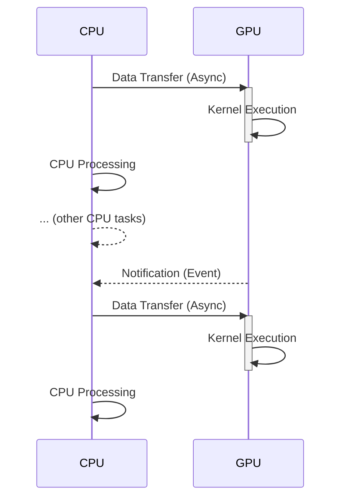
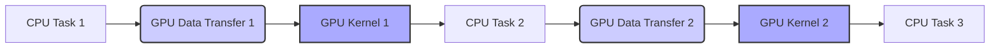
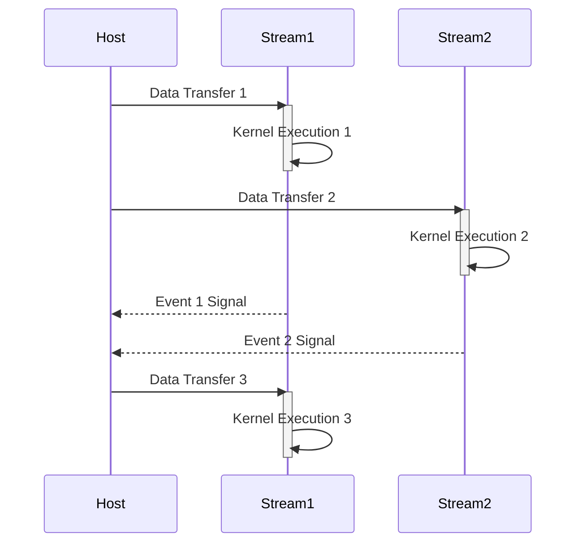
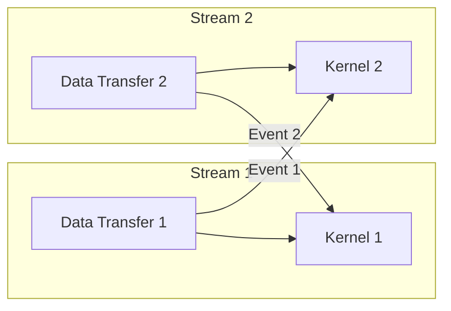
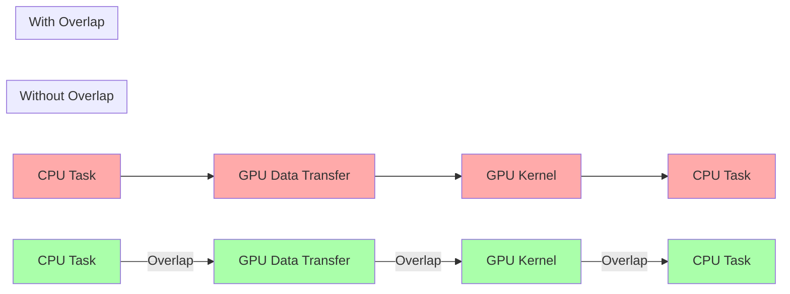

Okay, I will add Mermaid diagrams to the text to enhance its clarity and understanding, focusing on visualizing the described concepts.

## Overlapping CPU and GPU Execution in CUDA: Maximizing Resource Utilization

### Introdução

Em aplicações CUDA, a arquitetura heterogênea que combina CPU (o *host*) e GPU (o *device*) oferece a oportunidade de executar tarefas de forma simultânea, explorando o paralelismo oferecido pelos dois processadores. O *overlapping* da execução da CPU e da GPU é uma técnica que consiste em sobrepor a execução de tarefas no *host* com a execução de *kernels* e transferências de dados na GPU. Essa técnica permite maximizar a utilização dos recursos do sistema e reduzir o tempo total de execução da aplicação. Este capítulo explora a técnica de *overlapping* da execução da CPU e da GPU em CUDA, abordando os mecanismos para a sua implementação, as estratégias de otimização e os desafios que devem ser considerados para obter o máximo desempenho das aplicações CUDA, sempre com base nas informações do contexto fornecido.

### O Conceito de Overlapping

O *overlapping* é uma técnica de programação paralela que consiste em sobrepor a execução de diferentes tarefas em diferentes processadores ou recursos de *hardware*, de forma que eles sejam utilizados simultaneamente. Em CUDA, o *overlapping* é utilizado para sobrepor as operações de transferência de dados entre o *host* e o *device* com a execução dos *kernels* na GPU, e também sobrepor tarefas na CPU com tarefas na GPU, evitando que os processadores fiquem ociosos e, consequentemente, diminuindo o tempo total de execução da aplicação.

**Conceito 1: Paralelismo e Sobreposição de Tarefas**

O *overlapping* permite que o sistema explore o paralelismo de duas formas principais:

*   **Paralelismo Host-Device:** Ao sobrepor a execução de operações no *host* com a execução de operações no *device*, os dois processadores são utilizados de forma simultânea, o que diminui o tempo total de execução da aplicação.
*   **Paralelismo dentro do Device:** Ao sobrepor as operações de transferência de dados com a execução dos *kernels*, o *bandwidth* da memória é utilizado de forma mais eficiente, já que a GPU não fica esperando que os dados sejam transferidos e pode executar outras tarefas ao mesmo tempo.

**Lemma 1:** O *overlapping* permite a execução simultânea de tarefas no *host* e no *device*, maximizando a utilização dos recursos de *hardware* e reduzindo o tempo de execução de aplicações CUDA que utilizam o modelo *host-device*.

**Prova:** O *overlapping* permite o uso simultâneo da CPU e da GPU, o que diminui o tempo total de execução da aplicação.  $\blacksquare$

The following diagram shows how *overlapping* is used so that the CPU and the GPU work simultaneously, and how data transfers and kernel execution occur in parallel to minimize waiting time and maximize application performance.

**Prova do Lemma 1:** O uso de *overlapping* permite a utilização eficiente dos recursos de processamento e diminui o tempo total de execução da aplicação. $\blacksquare$

**Corolário 1:** A técnica de *overlapping* é essencial para o desenvolvimento de aplicações CUDA de alto desempenho que exploram ao máximo a arquitetura heterogênea dos sistemas modernos.

### Mecanismos para Overlapping em CUDA

Para implementar o *overlapping* em CUDA, a API oferece recursos como *streams* e *events*, que permitem a execução assíncrona de operações na GPU e a sincronização entre diferentes tarefas. Os *streams* permitem que várias tarefas, como transferência de dados e execução de *kernels*, sejam executadas em paralelo na GPU, e os *events* permitem que o *host* monitore o andamento das tarefas executadas na GPU.

**Conceito 2: Streams e Events para Overlapping**

*   **Streams:** Um *stream* é uma sequência de operações que são executadas em ordem na GPU. Múltiplos *streams* podem ser utilizados para executar diferentes tarefas em paralelo. Os *streams* garantem que as operações sejam executadas em ordem, dentro do mesmo *stream*, mas as tarefas de diferentes *streams* podem ser executadas de forma assíncrona e em paralelo.
*   **Events:** *Events* são objetos que permitem sincronizar a execução de operações em diferentes *streams*. Um *event* pode ser usado para sinalizar quando uma determinada operação foi concluída em um *stream*, e outra operação em outro *stream* pode esperar por esse *event* antes de começar a sua execução.

**Lemma 2:** O uso de *streams* e *events* permite a implementação do *overlapping* em CUDA, e garante que as operações na GPU sejam executadas em paralelo e de forma sincronizada, o que é essencial para o bom funcionamento da aplicação.

**Prova:** Os *streams* permitem a execução paralela e os *events* permitem a sincronização entre os *streams*, de forma que as operações sejam executadas em paralelo, mas respeitando as dependências.  $\blacksquare$

The following diagram shows how *streams* and *events* can be used to overlap data transfers and kernel execution in CUDA, and how the use of these mechanisms allows for better use of hardware resources.

**Prova do Lemma 2:** A utilização de *streams* e *events* permite o *overlapping* e a sincronização, que são fundamentais para o bom funcionamento da aplicação. $\blacksquare$

**Corolário 2:** A utilização de *streams* e *events* é fundamental para o desenvolvimento de aplicações CUDA que exploram o *overlapping* de tarefas e maximizam o uso da GPU e da CPU.

### Estratégias de Overlapping

Para obter o máximo desempenho do *overlapping*, é necessário um planejamento cuidadoso da execução da aplicação, que envolve a criação de *streams* separados para diferentes tipos de tarefas, a sincronização dessas tarefas utilizando *events*, e a utilização de técnicas de transferência assíncrona de dados.

**Conceito 3: Planejamento da Execução e Overlapping**

*   **Separação de Tarefas:** As tarefas são separadas em diferentes *streams* para que possam ser executadas de forma assíncrona e em paralelo. A separação das tarefas permite o melhor uso dos recursos e a diminuição do tempo total de execução.
*   **Transferências Assíncronas:** As operações de transferência de dados são realizadas de forma assíncrona, utilizando *streams* diferentes dos *streams* utilizados para a execução dos *kernels*. Isso permite que a transferência de dados ocorra em paralelo com a execução dos *kernels*.
*   **Sincronização:** A sincronização entre os *streams* é feita utilizando *events*, o que garante que as tarefas sejam executadas na ordem correta, respeitando as dependências entre elas.

**Lemma 3:** O planejamento da execução, a separação de tarefas, a utilização de transferências assíncronas e a sincronização por *events* são essenciais para a implementação eficiente do *overlapping* em aplicações CUDA.

**Prova:** O planejamento cuidadoso das tarefas, a utilização de *streams* e a sincronização com *events* garantem que a execução da aplicação ocorra de forma eficiente e que o *hardware* esteja sendo usado da melhor forma possível. $\blacksquare$

The following diagram illustrates how different tasks are separated into *streams* and how *events* are used to synchronize the execution of these tasks, showing that careful planning allows for efficient use of *overlapping*.

**Prova do Lemma 3:** O planejamento do *overlapping* permite a execução em paralelo de tarefas na CPU e na GPU, o que aumenta o desempenho da aplicação. $\blacksquare$

**Corolário 3:** A implementação do *overlapping* requer planejamento, organização e a utilização eficiente dos recursos da API CUDA.

### Benefícios do Overlapping

O *overlapping* de execução da CPU e da GPU oferece vários benefícios:

1.  **Redução do Tempo de Execução:** O *overlapping* permite que a CPU e a GPU trabalhem simultaneamente, reduzindo o tempo total de execução da aplicação.
2.  **Maximização do Uso dos Recursos:** O *overlapping* permite que os recursos da CPU e da GPU sejam utilizados de forma eficiente, evitando que um processador fique ocioso enquanto o outro está trabalhando.
3.  **Melhora da Escalabilidade:** O *overlapping* permite que a aplicação seja escalada para sistemas com múltiplas GPUs e com múltiplos núcleos na CPU, maximizando o uso dos recursos disponíveis.

**Conceito 4: Impacto do Overlapping no Desempenho**

O *overlapping* de operações permite o uso simultâneo dos recursos de *hardware* e diminui o tempo de espera de cada um dos processadores, e esse ganho de desempenho pode ser ainda maior em sistemas com múltiplas GPUs e com múltiplos núcleos na CPU.

**Lemma 4:** O *overlapping* de execução da CPU e da GPU resulta em um melhor uso dos recursos computacionais, menor tempo de execução e melhor escalabilidade das aplicações CUDA, e que o ganho de desempenho é maior do que o obtido pela execução sequencial das tarefas.

**Prova:** O *overlapping* permite que a CPU e a GPU trabalhem simultaneamente e que as transferências de dados e a execução de *kernels* ocorram em paralelo. $\blacksquare$

The following diagram illustrates how *overlapping* reduces the application execution time by allowing the CPU and GPU to perform tasks simultaneously.

**Prova do Lemma 4:** O *overlapping* de tarefas garante um melhor aproveitamento dos recursos de processamento, e um melhor desempenho da aplicação. $\blacksquare$

**Corolário 4:** O *overlapping* é uma técnica essencial para o desenvolvimento de aplicações CUDA de alto desempenho, que exploram o máximo potencial do sistema heterogêneo de computação.

### Otimizações para Overlapping

**Pergunta Teórica Avançada:** Quais são as técnicas de otimização mais importantes para maximizar o *overlapping* entre a CPU e a GPU, e como essas técnicas podem ser implementadas na prática?

**Resposta:** Existem algumas técnicas de otimização que permitem maximizar o *overlapping* entre a CPU e a GPU em CUDA:

1.  **Transferências Assíncronas:** A utilização de transferências assíncronas para copiar dados entre o *host* e o *device* permite que a CPU continue executando outras tarefas enquanto os dados são transferidos.
2.  **Uso de Streams:** A utilização de *streams* para executar operações de transferência e a execução dos *kernels* permite que essas operações sejam realizadas de forma paralela.
3.  **Uso de Events:** A utilização de *events* para sincronizar as tarefas garante que as dependências sejam respeitadas e que a ordem de execução seja feita de forma correta.
4.  **Memória Pinned:** O uso de memória *pinned* no *host* permite que a transferência de dados seja realizada de forma mais eficiente, pois a memória *pinned* não é paginada pelo sistema operacional.

**Lemma 5:** A combinação do uso de transferências assíncronas, *streams*, *events* e memória *pinned* permite maximizar o *overlapping* e alcançar o melhor desempenho em aplicações CUDA.

**Prova:** A utilização de transferências assíncronas permite que a CPU e a GPU trabalhem em paralelo, os *streams* permitem que diferentes operações na GPU ocorram simultaneamente e os *events* garantem a sincronização das tarefas e o uso eficiente da memória *pinned* diminui o *overhead* das transferências. $\blacksquare$

A aplicação dessas técnicas requer um planejamento cuidadoso da execução da aplicação e um conhecimento profundo da API CUDA.

**Prova do Lemma 5:** A utilização eficiente desses recursos permite a sobreposição de tarefas e diminui o tempo total de execução da aplicação. $\blacksquare$

**Corolário 5:** A aplicação combinada dessas técnicas de otimização permite o desenvolvimento de aplicações CUDA que exploram ao máximo a capacidade de *overlapping* entre a CPU e a GPU, com um melhor desempenho.

### Desafios e Limitações do Overlapping

**Pergunta Teórica Avançada:** Quais são os principais desafios e limitações na implementação do *overlapping* entre a CPU e a GPU em CUDA, e como esses desafios podem ser abordados para garantir a robustez e a escalabilidade das aplicações?

**Resposta:** A implementação do *overlapping* em CUDA apresenta alguns desafios e limitações:

1.  **Complexidade da Programação:** A implementação correta do *overlapping* requer um bom conhecimento da API CUDA, e pode aumentar a complexidade da aplicação.
2.  **Sincronização:** A sincronização correta das tarefas, para garantir que as dependências de dados sejam respeitadas, pode ser difícil, e pode gerar problemas de *deadlocks* e *livelocks*.
3.  ***Overhead* de Gerenciamento:** O *overhead* de criação de *streams*, *events*, e o gerenciamento das transferências assíncronas pode diminuir o desempenho da aplicação se as tarefas forem muito pequenas.
4.  **Portabilidade:** A implementação do *overlapping* pode ser difícil em aplicações que precisam ser portadas entre diferentes arquiteturas de GPU e CPU, que podem ter limitações ou características distintas.

**Lemma 6:** A complexidade da programação, os problemas de sincronização, o *overhead* de gerenciamento e as dificuldades de portabilidade são os principais desafios que precisam ser considerados na implementação do *overlapping* em aplicações CUDA.

**Prova:** Os problemas da programação paralela são complexos, e o desenvolvimento de aplicações que utilizam o *overlapping* requer um conhecimento profundo da arquitetura e das ferramentas da API CUDA. $\blacksquare$

Para superar esses desafios, é necessário um conhecimento profundo da API CUDA, e técnicas de *debug* que permitam a identificação e a resolução de problemas relacionados ao *overlapping* e aos mecanismos de sincronização.

**Prova do Lemma 6:** A complexidade e a dificuldade de depuração e de portabilidade podem dificultar o desenvolvimento de aplicações que utilizam o *overlapping*.  $\blacksquare$

**Corolário 6:** O conhecimento dos desafios e das limitações do *overlapping* é fundamental para o desenvolvimento de aplicações CUDA robustas e escaláveis, e para a escolha das estratégias mais adequadas.

### Conclusão

O *overlapping* da execução da CPU e da GPU é uma técnica essencial para o desenvolvimento de aplicações CUDA de alto desempenho. Ao sobrepor as operações de transferência de dados e a execução dos *kernels* na GPU, e as operações de processamento na CPU, é possível maximizar a utilização dos recursos de *hardware* e reduzir o tempo total de execução da aplicação. A utilização de *streams* e *events* permite a implementação eficiente do *overlapping*, e a combinação dessas técnicas com a utilização de memória *pinned* e transferências assíncronas permite alcançar um desempenho ainda maior. A compreensão detalhada desses conceitos é fundamental para todos os desenvolvedores que desejam criar aplicações CUDA eficientes, que utilizem todo o potencial da arquitetura heterogênea de sistemas computacionais modernos.

### Referências

[^1]: "Our main objective is to teach the key concepts involved in writing massively parallel programs in a heterogeneous computing system." *(Trecho de <página 41>)*

[^4]:  "The execution starts with host (CPU) execution. When a kernel function is called, or launched, it is executed by a large number of threads on a device." *(Trecho de <página 44>)*
