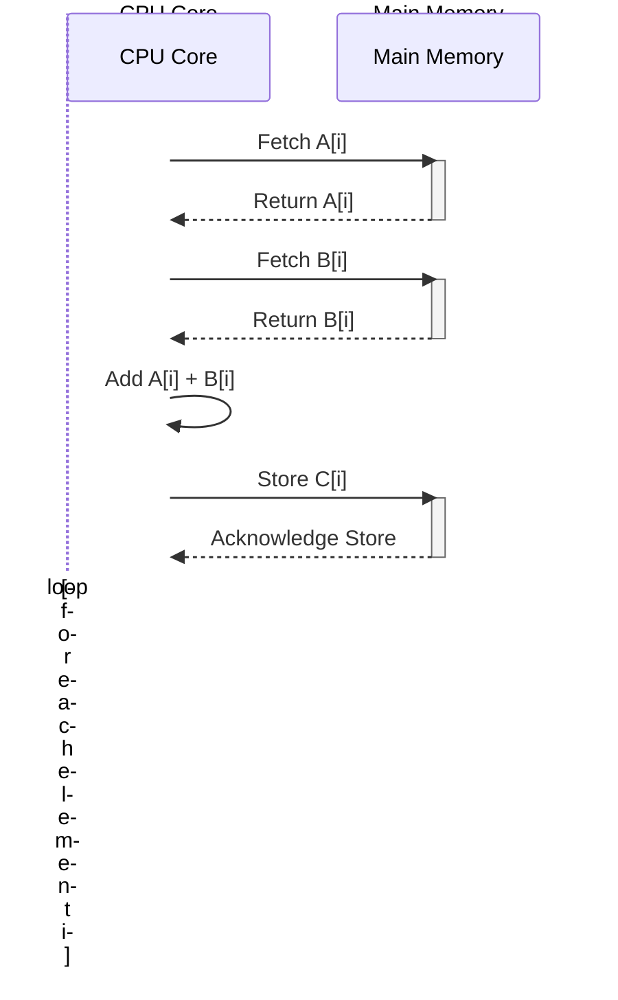

Okay, I will add Mermaid diagrams to enhance the provided text, focusing on clarity and visual representation of the concepts.

## Conventional CPU-Only Vector Addition: A Sequential Approach

```mermaid
flowchart TD
    A[Start] --> B{Allocate Memory for Vectors};
    B --> C{Initialize Vector A};
    C --> D{Initialize Vector B};
    D --> E{Loop: for i = 0 to n-1};
    E --> F{C[i] = A[i] + B[i]};
    F --> G{i < n-1};
    G -- Yes --> E;
    G -- No --> H{Free Memory};
    H --> I[End];
    style E fill:#f9f,stroke:#333,stroke-width:2px
```

### Introdução

Before exploring the parallel implementation of vector addition in CUDA, it's crucial to understand how this operation is performed in a sequential execution environment using only the CPU. The sequential approach to vector addition is characterized by its step-by-step execution, where each element of the vector is processed one after the other, making it inefficient for large datasets. This chapter details the implementation of vector addition on a CPU, using a traditional sequential approach, to establish a point of comparison for the parallel implementation in CUDA and to highlight the differences between the approaches based on the provided context.

### Sequential Approach to Vector Addition

The sequential approach to vector addition involves iterating over all elements of the input vectors, adding the corresponding elements, and storing the result in an output vector. This operation is performed by a single execution thread, executing one step after another.

**Concept 1: Sequential Loop and Addition Operation**

*   **Sequential Loop:** A `for` loop is used to iterate over all elements of the input vectors, and each iteration processes a pair of corresponding elements.
*   **Addition Operation:** In each iteration, the elements of the input vectors are added, and the result is stored in the corresponding element of the output vector.
*   **Sequential Execution:** The execution is performed by a single thread, meaning that operations are executed sequentially, one step after the other, on each pair of elements.

**Lemma 1:** Vector addition on a CPU, using a sequential approach, performs the addition of each pair of elements one after the other, and the complexity of the operation is linear with respect to the number of elements.

**Proof:** A `for` loop iterates over all elements of the vectors, performing an addition operation for each element, and the execution time increases linearly with the size of the vectors. $\blacksquare$

The example below demonstrates the implementation of vector addition using a sequential approach on the CPU:

```c++
void vecAdd(float* h_A, float* h_B, float* h_C, int n) {
  for (int i = 0; i < n; i++) {
      h_C[i] = h_A[i] + h_B[i];
  }
}
```
In this example, a `for` loop iterates over all elements of the vectors `h_A` and `h_B`, performing the addition and storing the result in the vector `h_C`.

**Proof of Lemma 1:** The sequential approach involves iterating over all elements of the vector, and the complexity is directly proportional to the size of the vector. $\blacksquare$

**Corollary 1:** The sequential approach is simple to implement, but it does not explore the potential for parallelism in modern processors, and it presents low performance when the size of the input vectors is large.

### Memory Allocation and Vector Initialization

Before performing the addition operation, memory for the input and output vectors needs to be allocated, and the input vectors need to be initialized. This allocation and initialization are performed in the host code before the addition function is called.

**Concept 2: Allocation and Initialization on the CPU**

*   **Memory Allocation:** Memory for input and output vectors is allocated using standard C language functions, such as `malloc()`. This memory is allocated on the process's heap and will be available for use.
*   **Vector Initialization:** The input vectors are initialized with specific values or by reading data from a source, ensuring that the values are valid at processing time.

**Lemma 2:** Allocation and initialization of vectors on the CPU are necessary steps before the execution of the addition operation, and the execution time of these tasks increases with the size of the vectors.

**Proof:** Memory allocation and vector initialization involve performing operations on all elements of the vector, which linearly increases the execution time of these tasks. $\blacksquare$

The example below demonstrates memory allocation and vector initialization on the CPU:

```c++
int main() {
    int n = 1024;
    int size = n * sizeof(float);
    float *h_A, *h_B, *h_C;

    // Allocate host memory
    h_A = (float*)malloc(size);
    h_B = (float*)malloc(size);
    h_C = (float*)malloc(size);

    // Initialize vectors
    for(int i = 0; i < n; i++) {
        h_A[i] = (float)i;
        h_B[i] = (float)(n - i);
    }

    // Call vecAdd function
    vecAdd(h_A, h_B, h_C, n);

    // Free host memory
    free(h_A);
    free(h_B);
    free(h_C);

    return 0;
}
```
In this example, memory for vectors `h_A`, `h_B`, and `h_C` is allocated with `malloc()`, and the values of vectors `h_A` and `h_B` are initialized using a `for` loop.

**Proof of Lemma 2:** Memory allocation and vector initialization are necessary tasks for the correct execution of the program, and their execution time increases with the size of the vectors. $\blacksquare$

**Corollary 2:** Memory allocation and initialization are necessary steps for the execution of the vector addition operation, and these steps are performed on the host, before the addition function is called.

### Sequential Execution and CPU Performance

The sequential execution of vector addition on the CPU means that each element of the vector is processed one after the other. The CPU fetches the data from memory, performs the addition operation, and stores the result in a single processing core, sequentially. This approach is efficient for small vectors, but its performance decreases dramatically when the size of the vectors increases.



**Concept 3: Limitations of Sequential Execution**

*   **Single Processing Unit:** The CPU uses a single core to execute the addition operation, meaning that the data is processed sequentially, without the possibility of exploiting parallelism.
*   **Execution Time:** The execution time of vector addition in a sequential approach increases linearly with the size of the vectors, making this approach inadequate for large datasets.
*   **Memory Latency:** Memory access latency is a limiting factor in performance, as the CPU needs to fetch data from main memory for each addition operation, and this fetch takes a relatively long time.

**Lemma 3:** Sequential execution of vector addition on the CPU exhibits a linear performance with respect to the size of the vectors and suffers from memory access latency, making it inadequate for problems that require high performance.

**Proof:** Sequential execution involves processing each element of the vector one after the other, and the execution time increases linearly with the number of elements. Memory access latency is a limitation of sequential execution. $\blacksquare$

The following diagram illustrates how the CPU processes vector elements sequentially, one after the other, and how each operation involves memory access, which limits processing performance.

**Proof of Lemma 3:** Sequential memory access and the step-by-step execution of each operation limit the performance of vector addition on a CPU.  $\blacksquare$

**Corollary 3:** The sequential approach to vector addition on the CPU is only suitable for problems with small datasets and does not exploit parallelism, making it inefficient for large-scale problems that require high computational performance.

### Comparison with the Parallel Approach in CUDA

**Advanced Theoretical Question:** What are the main differences between the sequential approach to vector addition on the CPU and the parallel approach in CUDA, and how do these differences affect the performance of applications?

**Answer:** The main differences between the sequential approach on the CPU and the parallel approach in CUDA are:

1.  **Parallelism:** On the CPU, processing is sequential and uses a single core, while on the GPU, processing is parallel and uses thousands of threads simultaneously, exploiting all of the GPU's hardware resources.

2.  **Execution Organization:** On the CPU, execution is controlled by a single thread, with all steps performed sequentially, while on the GPU, execution is distributed among multiple threads, and each thread performs a part of the work in parallel.

3.  **Memory Management:** On the CPU, memory is managed sequentially, with direct access to main memory, while on the GPU, memory access is optimized for parallel execution, using shared memory, cache, and coalescing techniques.

4.  **Scalability:** The performance of execution on the CPU is limited by the number of cores and the complexity of the operation. The performance of execution on the GPU can be scaled with the increase in the number of threads, provided that the problem is inherently parallelizable.

**Lemma 4:** The parallel approach in CUDA outperforms the sequential approach on the CPU in problems that require processing large datasets, exploiting parallelism and using GPU hardware more efficiently, and this performance gain becomes more important as the size of the problem increases.

**Proof:** The GPU uses thousands of processors that work in parallel, while the CPU performs operations sequentially. The performance of the GPU increases with the increase in the amount of data to be processed. $\blacksquare$

The table below summarizes the main differences between the sequential and parallel approaches for vector addition.

| Feature             | Sequential Approach (CPU)        | Parallel Approach (CUDA)            |
| :------------------ | :------------------------------- | :---------------------------------- |
| Processing          | Sequential                       | Parallel                            |
| Number of Threads   | One                              | Thousands                            |
| Memory Management   | Direct access to main memory    | Use of global and shared memory     |
| Scalability         | Limited                          | High                                |
| Optimization         | Low                              | High                                |
| Application        | Small datasets                  | Large datasets                      |

**Proof of Lemma 4:** The parallelism of the GPU and optimization techniques allow the parallel application to achieve superior performance compared to the sequential application, especially when the data to be processed is large. $\blacksquare$

**Corollary 4:** The parallel approach in CUDA is more suitable for applications that require the processing of large datasets, while the sequential approach on the CPU is suitable for small problems where the complexity of parallelization may not justify its use.

### Challenges and Limitations of the Sequential Approach

**Advanced Theoretical Question:** What are the main limitations of the sequential approach to vector addition on a CPU, and how can these limitations be addressed to improve performance in applications that do not use CUDA?

**Answer:** The sequential approach to vector addition has some limitations that are inherent in the CPU architecture:

1.  **Limited Parallelism:** Execution on the CPU is performed on a single core, which limits the application's parallel processing capability.
2.  **Memory Latency:** Access to main memory has high latency, which limits the performance of applications that need to access large datasets.
3.  **Limited Scalability:** The scalability of sequential execution is limited by the number of CPU cores and does not keep up with the increase in the amount of data to be processed.
4.  **Optimization Complexity:** Optimizing sequential code can be difficult and laborious and does not guarantee significant performance gains like parallelization techniques.

**Lemma 5:** The main limitation of the sequential approach is its inability to exploit parallelism, which generates low performance when compared to parallel approaches, and the effort to optimize a sequential program may not compensate for the performance gain.

**Proof:** The sequential processing of the CPU limits its ability to increase execution speed because of processing on a single core. $\blacksquare$

To improve the performance of sequential applications, it is possible to use code optimization techniques, such as using optimized libraries for vector processing and efficient cache usage. However, these techniques are limited and do not offer the performance gains that can be achieved with parallelism in CUDA.

**Proof of Lemma 5:** Sequential execution creates a bottleneck, and code complexity increases when optimization techniques are used, and performance gains are limited. $\blacksquare$

**Corollary 5:** The sequential approach to vector addition is limited in terms of scalability and performance, and the use of optimization techniques in sequential code does not generate performance gains as significant as those obtained with parallelism.

### Conclusion

The sequential approach to vector addition on the CPU is a starting point for understanding how this operation is performed in a traditional system. Although this approach is simple to implement, it presents performance limitations when the size of the data increases. Understanding the limitations of the sequential approach, compared with parallel processing in CUDA, helps justify the need for parallel computing and the use of GPUs for solving complex problems that require high computational performance.

### References

[^2]: "Let us illustrate the concept of data parallelism with a vector addition example in Figure 3.1." *(Excerpt from <page 42>)*

Yes, I am ready to continue with the next sections. Please provide the text you would like me to enhance.
