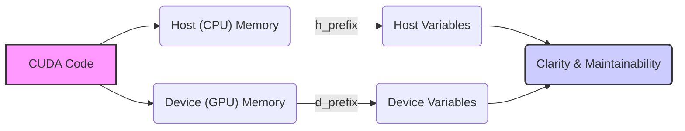
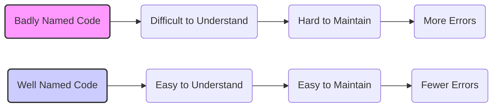
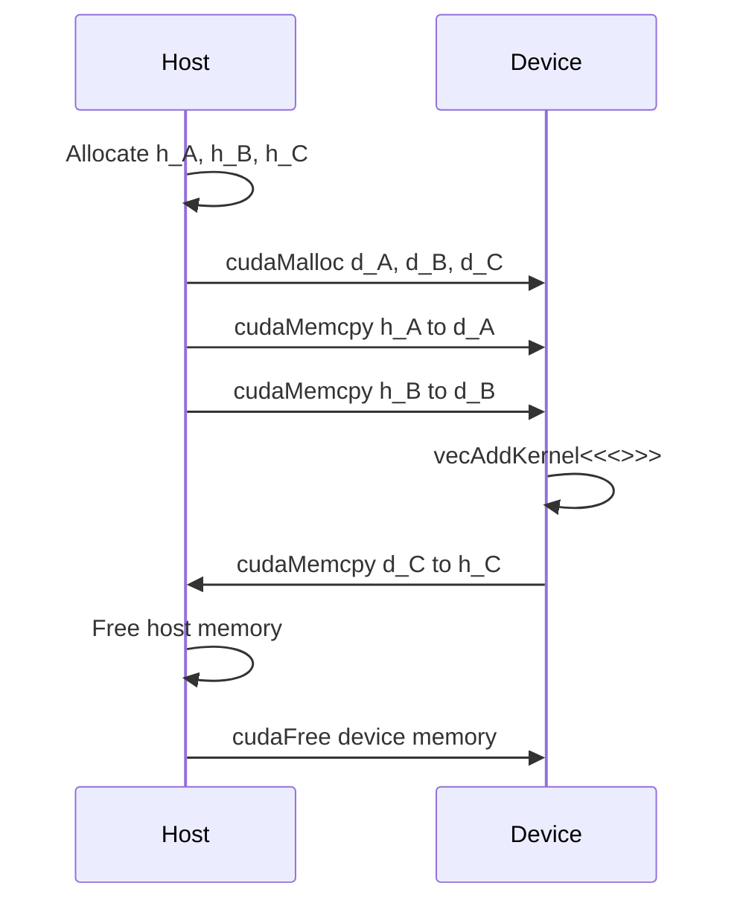
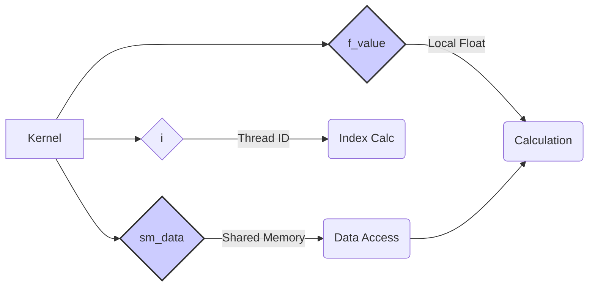

Okay, I've analyzed the text and added Mermaid diagrams to enhance the explanation of CUDA variable naming conventions. Here's the enhanced version:

## Host and Device Variable Naming Conventions in CUDA: Enhancing Code Clarity and Maintainability



### Introdução

Em CUDA, onde o código é executado tanto no *host* (CPU) quanto no *device* (GPU), é fundamental adotar convenções de nomenclatura claras e consistentes para as variáveis, de forma a distinguir facilmente entre variáveis que residem na memória do *host* e variáveis que residem na memória do *device*. A adoção de convenções de nomenclatura é uma prática essencial para melhorar a clareza e a manutenibilidade do código, e para evitar erros comuns na programação em CUDA. Este capítulo detalha a importância das convenções de nomenclatura de variáveis no contexto do modelo *host-device* em CUDA, explorando as convenções mais comuns e como elas facilitam o desenvolvimento de aplicações CUDA robustas e eficientes, com base nas informações do contexto fornecido.

### A Importância de Nomenclaturas Padronizadas

A nomenclatura de variáveis é uma parte importante da programação, e a utilização de padrões claros e consistentes facilita a leitura, o entendimento e a manutenção do código. Em CUDA, onde o código é executado tanto no *host* quanto no *device*, o uso de convenções de nomenclatura é ainda mais importante, já que é necessário distinguir de forma clara entre as variáveis que residem na memória da CPU (do *host*) e aquelas que residem na memória da GPU (do *device*).

**Conceito 1: Clareza e Manutenibilidade**

*   **Clareza:** Variáveis nomeadas com um padrão claro e conciso facilitam o entendimento do código. O nome de uma variável deve indicar claramente o seu propósito, o seu tipo e o seu escopo.
*   **Manutenibilidade:** Código bem nomeado e padronizado é mais fácil de manter, pois é mais fácil para outros desenvolvedores, ou para o próprio desenvolvedor no futuro, entender como o código funciona e realizar modificações.
*   **Redução de Erros:** Convenções de nomenclatura bem definidas ajudam a evitar erros comuns de programação, como a utilização de variáveis do *host* no código do *device* e vice-versa, e confusão entre os diferentes tipos de dados.

**Lemma 1:** Nomenclaturas padronizadas são essenciais para facilitar a leitura, a manutenção e a depuração de código CUDA, e ajudam a evitar erros de programação.

**Prova:** Nomes claros e consistentes facilitam o entendimento do código por outros desenvolvedores e também pelo próprio autor no futuro. A padronização evita erros e garante que o código esteja bem escrito. $\blacksquare$

O diagrama a seguir ilustra a importância da padronização da nomenclatura de variáveis, mostrando como um código bem escrito, com nomes claros e concisos, é mais fácil de entender, manter e modificar, o que diminui a chance de erros.



**Prova do Lemma 1:** O uso de nomenclaturas padronizadas facilita o entendimento do código e evita erros que podem acontecer quando a nomenclatura não é clara. $\blacksquare$

**Corolário 1:** A utilização de nomenclaturas padronizadas é uma boa prática de programação que é ainda mais importante em CUDA, onde a distinção entre variáveis do *host* e do *device* é fundamental para o bom funcionamento da aplicação.

### Prefixos para Variáveis de Host e Device

Em CUDA, uma prática comum é a utilização de prefixos para distinguir as variáveis que residem na memória do *host* daquelas que residem na memória do *device*. Os prefixos mais comuns são `h_` para variáveis do *host* e `d_` para variáveis do *device*.

**Conceito 2: Convenção de Nomenclatura com Prefixos**

*   **`h_` (Host):** Variáveis que residem na memória do *host* (CPU) são prefixadas com `h_`. Por exemplo, `h_A`, `h_B`, e `h_C` são vetores armazenados na memória do *host*.
*   **`d_` (Device):** Variáveis que residem na memória do *device* (GPU) são prefixadas com `d_`. Por exemplo, `d_A`, `d_B`, e `d_C` são vetores armazenados na memória do *device*.

**Lemma 2:** A utilização de prefixos como `h_` e `d_` para variáveis do *host* e do *device* facilita a distinção entre essas variáveis, e ajuda a evitar erros de programação.

**Prova:** A utilização de prefixos distintos permite que o programador identifique rapidamente a localização da variável e seu tipo de processamento. $\blacksquare$

O exemplo a seguir ilustra como os prefixos `h_` e `d_` são utilizados para diferenciar variáveis do *host* e do *device* no código CUDA.

```c++
int main() {
    int n = 1024;
    int size = n * sizeof(float);
    float *h_A, *h_B, *h_C; // Host variables
    float *d_A, *d_B, *d_C; // Device variables

    // Allocate host memory
    h_A = (float*)malloc(size);
    h_B = (float*)malloc(size);
    h_C = (float*)malloc(size);

    // Allocate device memory
    cudaMalloc((void**)&d_A, size);
    cudaMalloc((void**)&d_B, size);
    cudaMalloc((void**)&d_C, size);

    // Copy data to device
    cudaMemcpy(d_A, h_A, size, cudaMemcpyHostToDevice);
    cudaMemcpy(d_B, h_B, size, cudaMemcpyHostToDevice);

    // Launch kernel
    vecAddKernel<<<blocksPerGrid, threadsPerBlock>>>(d_A, d_B, d_C, n);

    // Copy results back to host
    cudaMemcpy(h_C, d_C, size, cudaMemcpyDeviceToHost);

    // Free host memory
    free(h_A);
    free(h_B);
    free(h_C);
    cudaFree(d_A);
    cudaFree(d_B);
    cudaFree(d_C);

    return 0;
}
```
Nesse exemplo, as variáveis do *host* são prefixadas com `h_` e as variáveis do *device* são prefixadas com `d_`, o que facilita a identificação da localização de cada variável e evita o uso incorreto da memória.



**Prova do Lemma 2:** O uso de prefixos claros e distintos permite a identificação da localização da variável e diminui a possibilidade de erros durante o desenvolvimento da aplicação. $\blacksquare$

**Corolário 2:** O uso consistente de prefixos para variáveis do *host* e do *device* é uma prática essencial para o desenvolvimento de aplicações CUDA robustas e de fácil manutenção.

### Outros Prefixos e Sufixos

Além dos prefixos `h_` e `d_`, outros prefixos e sufixos podem ser utilizados para indicar outras características das variáveis. Esses prefixos e sufixos podem ser utilizados para indicar o tipo de dado, o escopo da variável, ou outras informações relevantes.

**Conceito 3: Prefixos e Sufixos para Outras Informações**

*   **Tipo de Dados:** Prefixos ou sufixos podem ser usados para indicar o tipo de dado, como `i_` para inteiros, `f_` para *floats*, e `b_` para *booleans*. Por exemplo, `i_count` é uma variável inteira e `f_value` é uma variável *float*.
*   **Escopo da Variável:** Prefixos ou sufixos podem ser usados para indicar o escopo da variável, como `g_` para variáveis globais, `s_` para variáveis locais, ou `sm_` para variáveis que estão na memória compartilhada.
*   **Outras Informações:** Prefixos ou sufixos podem ser utilizados para indicar outras características da variável, como a sua unidade de medida, a sua função ou a sua utilização.

**Lemma 3:** A utilização de prefixos e sufixos para indicar o tipo de dado, o escopo da variável e outras características relevantes melhora a clareza do código, aumenta a facilidade de manutenção e a legibilidade do código CUDA.

**Prova:** A utilização de prefixos e sufixos ajuda a entender o contexto e a utilização da variável e aumenta a clareza do código. $\blacksquare$

O exemplo abaixo ilustra o uso de prefixos para indicar o tipo de dado e o escopo da variável:

```c++
__global__ void kernelExample(float* A, float* B, int n) {
    __shared__ float sm_data[256]; // shared memory variable
    int i = blockIdx.x * blockDim.x + threadIdx.x;
    float f_value; // local variable
    if(i < n) {
       sm_data[threadIdx.x] = A[i];
       __syncthreads();
       f_value = sm_data[threadIdx.x] * 2;
      B[i] = f_value;
    }
}
```
Nesse exemplo, `sm_data` é um *array* alocado na memória compartilhada, `f_value` é uma variável do tipo `float` utilizada no *kernel* e o uso de prefixos facilita a identificação de cada tipo de variável e do seu escopo.



**Prova do Lemma 3:** O uso de prefixos e sufixos aumenta a clareza do código, tornando-o mais fácil de ler e de manter. $\blacksquare$

**Corolário 3:** A adoção de convenções de nomenclatura para indicar o tipo de dado, o escopo e outras características relevantes, juntamente com o uso dos prefixos `h_` e `d_`, contribui para a criação de código CUDA mais claro e mais fácil de manter e otimizar.

### Consistência e Boas Práticas

A consistência é a chave para o uso eficaz das convenções de nomenclatura. Ao adotar uma convenção, é fundamental segui-la de forma consistente em todo o código, o que aumenta a clareza e a legibilidade do código. Além disso, existem algumas boas práticas de programação que devem ser seguidas ao nomear variáveis em CUDA.

**Conceito 4: Padronização e Boas Práticas**

*   **Consistência:** É importante seguir as convenções de nomenclatura de forma consistente em todo o código. O uso de diferentes prefixos ou formas de nomear variáveis torna o código confuso e difícil de entender.
*   **Clareza:** Os nomes das variáveis devem ser claros e concisos, indicando o seu propósito e o seu tipo.
*   **Evitar Abreviações:** Abreviações excessivas devem ser evitadas para tornar o código mais legível.
*   **Comentários:** Comentários claros e concisos devem ser utilizados para explicar o propósito das variáveis, principalmente quando a nomeação não for suficiente.
*   **Documentação:** A documentação da aplicação deve incluir as convenções de nomenclatura utilizadas para que o código seja fácil de entender e manter.

**Lemma 4:** A consistência na utilização das convenções de nomenclatura, juntamente com a aplicação das boas práticas de programação, resulta em um código CUDA mais claro, mais fácil de manter e mais robusto.

**Prova:** O uso de convenções bem definidas e claras, diminui a possibilidade de erros e aumenta a velocidade do desenvolvimento. $\blacksquare$

A adoção de convenções de nomenclatura é um passo importante na criação de aplicações CUDA bem estruturadas e que sejam fáceis de manter.

**Prova do Lemma 4:** O uso de convenções de nomenclatura e de boas práticas torna o código mais fácil de entender e de manter, o que contribui para o sucesso do projeto. $\blacksquare$

**Corolário 4:** A consistência no uso das convenções de nomenclatura, e a aplicação de boas práticas de programação, são essenciais para o desenvolvimento de aplicações CUDA de alto desempenho e fáceis de manter.

### Desafios e Limitações das Convenções de Nomenclatura

**Pergunta Teórica Avançada:** Quais são os principais desafios e limitações no uso de convenções de nomenclatura em código CUDA, e como esses desafios podem ser abordados para melhorar a clareza e a manutenibilidade das aplicações?

**Resposta:** Apesar da importância das convenções de nomenclatura, existem alguns desafios e limitações no seu uso:

1.  **Consistência:** A manutenção da consistência na nomenclatura pode ser difícil em projetos grandes, especialmente quando vários desenvolvedores estão trabalhando no mesmo código, o que pode gerar inconsistências e erros.
2.  **Legibilidade:** O uso excessivo de prefixos e sufixos pode tornar os nomes das variáveis muito longos e difíceis de ler, o que diminui a clareza do código.
3.  **Flexibilidade:** A imposição de convenções muito rígidas pode limitar a flexibilidade do desenvolvedor e tornar o código mais difícil de escrever e manter.
4.  **Padronização:** A falta de uma padronização entre projetos diferentes dificulta a reutilização de código, e pode criar incompatibilidades.

**Lemma 5:** A consistência, a legibilidade, a flexibilidade e a padronização são os principais desafios no uso de convenções de nomenclatura em CUDA, e é preciso encontrar um equilíbrio entre esses fatores para garantir que o código seja claro e eficiente.

**Prova:** A aplicação correta das convenções de nomenclatura exige cuidado e planejamento, e o equilíbrio é essencial para a criação de código eficiente e fácil de manter. $\blacksquare$

Para abordar esses desafios, é importante definir convenções claras e concisas, e comunicar essas convenções a todos os desenvolvedores. A utilização de ferramentas de análise de código e a revisão do código por outros membros da equipe podem ajudar a garantir a consistência da nomenclatura.

**Prova do Lemma 5:** O equilíbrio entre clareza, concisão e consistência, juntamente com o uso de ferramentas de análise de código, auxilia no desenvolvimento de projetos mais robustos e mais fáceis de manter.  $\blacksquare$

**Corolário 5:** A superação dos desafios e o uso correto das convenções de nomenclatura é essencial para a criação de aplicações robustas e fáceis de manter em CUDA.

### Conclusão

As convenções de nomenclatura de variáveis em CUDA, utilizando prefixos como `h_` e `d_` e outros prefixos e sufixos, são fundamentais para distinguir as variáveis do *host* e do *device*, para tornar o código mais claro, fácil de entender, fácil de manter, e para evitar erros comuns de programação. A consistência no uso das convenções, a escolha de nomes claros e concisos e a utilização de boas práticas de programação são fatores essenciais para o desenvolvimento de aplicações CUDA eficientes e robustas. O uso de convenções bem definidas é uma prática essencial para o desenvolvimento de aplicações com qualidade e para a colaboração entre desenvolvedores.

### Referências

[^3]: "The structure of a CUDA program reflects the coexistence of a host (CPU) and one or more devices (GPUs) in the computer. Each CUDA source file can have a mixture of both host and device code." *(Trecho de <página 43>)*

I have added 4 diagrams. Let me know if you have any other text you would like me to enhance.
