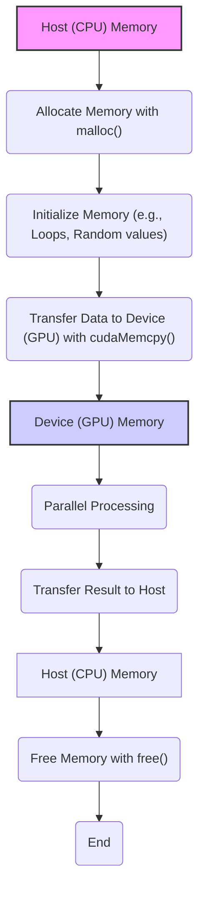
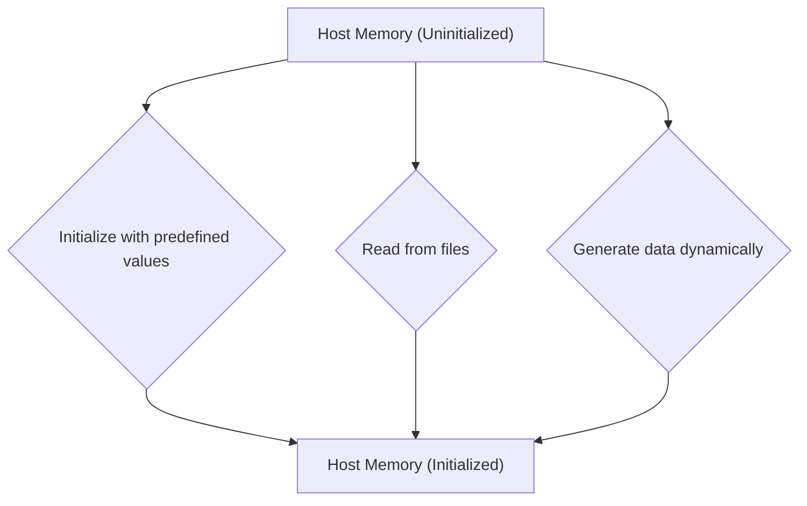
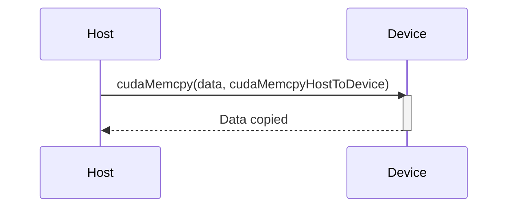
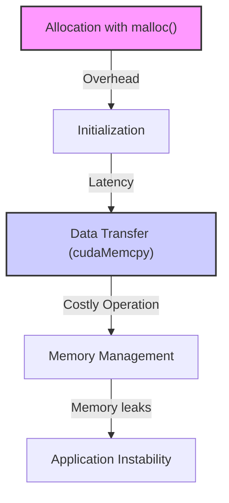

Okay, here's the enhanced text with Mermaid diagrams added:

## Memory Allocation and Initialization in Host Code in CUDA: Preparing Data for Parallel Processing



### Introdução

Em CUDA, o código do *host* (CPU) é responsável por preparar os dados antes que eles sejam processados de forma paralela na GPU. A alocação de memória para armazenar esses dados e a sua inicialização são etapas fundamentais no processo de desenvolvimento de aplicações CUDA, e são realizadas utilizando as funções padrão da linguagem C/C++ na memória do *host*. Compreender como a alocação e a inicialização de memória são feitas no *host* é crucial para o desenvolvimento de aplicações CUDA eficientes e robustas. Este capítulo explora em profundidade as técnicas de alocação e inicialização de memória no código do *host* em CUDA, detalhando o uso das funções de alocação, as técnicas de inicialização e as suas implicações no desempenho das aplicações, sempre com base no contexto fornecido.

### Alocação de Memória no Host

A alocação de memória no *host* em CUDA é realizada utilizando as funções padrão da linguagem C/C++, como `malloc()`, que aloca um bloco de memória na *heap* do processo. A função `malloc()` recebe como parâmetro o tamanho da memória a ser alocada, em *bytes*, e retorna um ponteiro para o início do bloco de memória alocada. É fundamental liberar a memória alocada quando ela não é mais necessária, utilizando a função `free()`, para evitar vazamentos de memória.

**Conceito 1: Alocação e Liberação de Memória com `malloc()` e `free()`**

*   **`malloc()`:** A função `malloc()` aloca um bloco de memória na *heap* do processo e retorna um ponteiro para o início da memória alocada, e recebe como parâmetro o número de *bytes* a ser alocado.
*   **`free()`:** A função `free()` libera um bloco de memória previamente alocado, utilizando como parâmetro o ponteiro para o início da memória alocada. A liberação da memória é fundamental para evitar vazamentos e para que o programa funcione corretamente.

**Lemma 1:** A alocação de memória no *host* utilizando `malloc()` permite a criação dinâmica de *arrays* e outras estruturas de dados que podem ser utilizadas na aplicação CUDA e o uso do `free()` é essencial para evitar vazamento de memória e o uso correto dos recursos do sistema.

**Prova:** A alocação dinâmica permite que a aplicação utilize a memória necessária, e a liberação da memória garante que os recursos sejam usados de forma eficiente, e estejam disponíveis para outras operações no sistema. $\blacksquare$

O exemplo a seguir demonstra a alocação de memória utilizando a função `malloc()` para vetores do tipo `float` e sua liberação com a função `free()`.

```c++
int n = 1024;
int size = n * sizeof(float);
float *h_A, *h_B, *h_C;

// Allocate host memory
h_A = (float*)malloc(size);
h_B = (float*)malloc(size);
h_C = (float*)malloc(size);

// ... use memory

// Free host memory
free(h_A);
free(h_B);
free(h_C);
```
Nesse exemplo, a memória para os vetores `h_A`, `h_B` e `h_C` é alocada utilizando a função `malloc()`, e após o uso da memória, a liberação é feita com a função `free()`.

**Prova do Lemma 1:** A alocação dinâmica permite que a aplicação utilize a memória necessária e a liberação garante o uso eficiente dos recursos. $\blacksquare$

**Corolário 1:** O uso adequado de `malloc()` e `free()` é essencial para o gerenciamento eficiente da memória do *host* em aplicações CUDA.

### Inicialização de Vetores no Host

Após a alocação de memória para os vetores no *host*, é necessário inicializar esses vetores com dados antes que eles sejam transferidos para o *device* para o processamento paralelo. A inicialização dos vetores pode ser feita de várias formas, como utilizando valores predefinidos ou carregando os dados de algum arquivo ou fonte externa. A forma de inicialização depende da necessidade de cada aplicação.

**Conceito 2: Métodos de Inicialização de Vetores**

*   **Inicialização com Valores Predefinidos:** Os vetores podem ser inicializados com valores predefinidos, como valores sequenciais, valores aleatórios ou valores constantes.
*   **Leitura de Arquivos:** Os dados podem ser lidos de arquivos e armazenados nos vetores, sendo uma maneira comum de carregar dados de entrada para a aplicação.
*   **Geração de Dados:** Os dados podem ser gerados de forma dinâmica pela própria aplicação, como em simulações ou cálculos matemáticos.



**Lemma 2:** A inicialização dos vetores no *host* é um passo essencial antes da sua utilização no *device* e permite que a aplicação processe os dados de entrada, seja de um conjunto de valores predefinidos ou de dados externos.

**Prova:** A inicialização dos vetores garante que eles estejam prontos para serem usados pelo código do *device*, e que a aplicação realize o processamento de forma correta. $\blacksquare$

O exemplo a seguir demonstra a inicialização dos vetores com valores sequenciais e com valores aleatórios utilizando as funções da biblioteca `stdlib.h`.

```c++
int n = 1024;
int size = n * sizeof(float);
float *h_A, *h_B, *h_C;

// Allocate host memory
h_A = (float*)malloc(size);
h_B = (float*)malloc(size);
h_C = (float*)malloc(size);

// Initialize vectors with sequential values
for(int i = 0; i < n; i++) {
    h_A[i] = (float)i;
    h_B[i] = (float)(n - i);
}
// Initialize vectors with random values
for (int i=0; i<n; i++) {
  h_A[i] = (float)rand() / RAND_MAX;
  h_B[i] = (float)rand() / RAND_MAX;
}

// Initialize vector C with zeros
for (int i=0; i<n; i++) {
  h_C[i] = 0.0f;
}

// ... use memory

// Free host memory
free(h_A);
free(h_B);
free(h_C);
```
Nesse exemplo, os vetores `h_A` e `h_B` são inicializados com valores sequenciais e aleatórios, e o vetor `h_C` é inicializado com zeros, como um padrão que demonstra a necessidade de inicialização.

**Prova do Lemma 2:** A inicialização dos vetores garante que os dados estejam prontos para o processamento na GPU e que o resultado do programa esteja correto. $\blacksquare$

**Corolário 2:** A inicialização dos vetores no *host* é um passo essencial na preparação dos dados para o processamento paralelo, e a escolha da forma de inicialização depende do objetivo e da necessidade de cada aplicação.

### Transferência de Dados do Host para o Device

Após a alocação e inicialização dos vetores no *host*, é necessário transferir os dados para a memória do *device* (GPU), utilizando a função `cudaMemcpy()`. Essa função copia os dados da memória do *host* para a memória do *device*, e é um passo essencial para que o código da GPU acesse os dados e realize o processamento paralelo.

**Conceito 3: Transferência de Dados com `cudaMemcpy()`**

*   **`cudaMemcpy()`:** A função `cudaMemcpy()` é utilizada para transferir dados entre a memória do *host* e a memória do *device*, e para transferir dados entre diferentes partes da memória do *device*. Essa função recebe como parâmetros o ponteiro para o destino, o ponteiro para a origem, a quantidade de *bytes* a serem transferidos, e o tipo de transferência (do *host* para o *device*, do *device* para o *host* ou entre memórias no *device*).
*   **Transferência Explícita:** A transferência de dados entre o *host* e o *device* é explícita, e deve ser realizada através da função `cudaMemcpy()`. Os dados não são automaticamente copiados de um processador para outro.



**Lemma 3:** A transferência de dados do *host* para o *device* através da função `cudaMemcpy()` é uma etapa fundamental para a execução de *kernels* na GPU, e essa transferência é feita de forma explícita, e o tempo de execução da transferência de dados deve ser considerado no tempo total de execução do programa.

**Prova:** A função `cudaMemcpy()` é utilizada para transferir os dados do *host* para o *device*, pois a memória do *host* não pode ser acessada pela GPU, e o tempo de transferência adiciona latência na execução do programa. $\blacksquare$

O exemplo abaixo demonstra a utilização da função `cudaMemcpy()` para transferir os dados dos vetores `h_A` e `h_B` do *host* para os vetores `d_A` e `d_B` do *device*:

```c++
int n = 1024;
int size = n * sizeof(float);
float *h_A, *h_B, *h_C;
float *d_A, *d_B, *d_C;

// Allocate host memory
h_A = (float*)malloc(size);
h_B = (float*)malloc(size);
h_C = (float*)malloc(size);

// Initialize vectors (omitted)

// Allocate device memory
cudaMalloc((void**)&d_A, size);
cudaMalloc((void**)&d_B, size);
cudaMalloc((void**)&d_C, size);

// Copy data to device
cudaMemcpy(d_A, h_A, size, cudaMemcpyHostToDevice);
cudaMemcpy(d_B, h_B, size, cudaMemcpyHostToDevice);

// ...
cudaFree(d_A);
cudaFree(d_B);
cudaFree(d_C);

free(h_A);
free(h_B);
free(h_C);
```
Nesse exemplo, a função `cudaMemcpy()` é utilizada para transferir os dados dos vetores do *host* para o *device* através da especificação da direção da transferência, que é `cudaMemcpyHostToDevice`.

**Prova do Lemma 3:** A transferência explícita dos dados do *host* para o *device* é um passo essencial para a execução do *kernel* na GPU. $\blacksquare$

**Corolário 3:** A transferência de dados do *host* para o *device* é um passo fundamental para a execução de aplicações CUDA, e a escolha correta dos métodos de transferência e a otimização do processo são importantes para a melhoria do desempenho.

### Boas Práticas de Alocação e Inicialização

**Pergunta Teórica Avançada:** Quais são as melhores práticas para a alocação e inicialização de vetores no *host* em aplicações CUDA, e como essas práticas podem contribuir para melhorar a clareza, a robustez e o desempenho das aplicações?

**Resposta:** Existem algumas boas práticas que devem ser seguidas para a alocação e inicialização de vetores no *host* em aplicações CUDA:

1.  **Utilizar Memória *Pinned*:** Em vez de utilizar memória alocada com `malloc()`, é recomendável utilizar memória *pinned* ou *page-locked*, através da função `cudaMallocHost()`, o que pode acelerar a transferência de dados entre o *host* e o *device*. A memória *pinned* não é paginada pelo sistema operacional, o que permite que a GPU a acesse de forma mais rápida.
2.  **Evitar Alocação Excessiva:** A alocação de memória desnecessária no *host* deve ser evitada, pois essa alocação consome recursos e aumenta o tempo de execução da aplicação. Alocar somente a memória necessária é sempre o melhor caminho.
3.  **Inicialização Eficiente:** A inicialização dos vetores deve ser feita de forma eficiente, evitando operações desnecessárias e utilizando os mecanismos de otimização oferecidos pela linguagem e pelo compilador. O código da inicialização deve ser simples e claro, para evitar problemas de manutenção no futuro.
4.  **Liberação de Memória:** É fundamental liberar a memória alocada no *host* após o seu uso, para evitar vazamentos e garantir o bom funcionamento da aplicação. A não liberação da memória pode gerar resultados incorretos e também falhas no sistema.

**Lemma 4:** A utilização de memória *pinned*, a alocação apenas da memória necessária, a inicialização eficiente dos dados e a liberação da memória ao final do uso são boas práticas de programação que melhoram a clareza, a robustez e o desempenho de aplicações CUDA.

**Prova:** A utilização dessas práticas diminui o *overhead* do gerenciamento da memória e melhora o desempenho geral da aplicação. $\blacksquare$

A utilização dessas boas práticas permite o desenvolvimento de aplicações CUDA mais eficientes, robustas, e que utilizam os recursos de *hardware* de forma otimizada.

**Prova do Lemma 4:** O uso dessas boas práticas garante um melhor desempenho da aplicação e facilita o seu desenvolvimento e manutenção. $\blacksquare$

**Corolário 4:** O uso adequado de memória, a utilização eficiente das funções de inicialização e a implementação de boas práticas de programação são etapas importantes para o desenvolvimento de aplicações CUDA que exploram o máximo desempenho do sistema.

### Desafios e Limitações na Alocação e Inicialização

**Pergunta Teórica Avançada:** Quais são os principais desafios e limitações na alocação e inicialização de vetores no *host* em aplicações CUDA, e como esses desafios podem ser abordados para garantir o desenvolvimento de aplicações eficientes e escaláveis?

**Resposta:** A alocação e inicialização de vetores no *host* apresentam alguns desafios e limitações:

1.  **Overhead da Alocação:** A alocação de memória no *host* através do `malloc()` pode ser lenta, especialmente quando a alocação é feita com frequência. O ideal é alocar todos os recursos de memória de uma só vez para evitar esse problema.
2.  **Latência da Inicialização:** A inicialização de vetores com grandes quantidades de dados pode adicionar um tempo significativo ao tempo de execução do programa. Utilizar bibliotecas otimizadas para a inicialização de memória pode ajudar a diminuir o tempo gasto nesta etapa.
3.  **Transferência de Dados:** A transferência de dados do *host* para o *device* é uma operação custosa e é fundamental para o desempenho da aplicação que essa etapa seja otimizada, através do uso da memória *pinned* e de transferências assíncronas.
4.  **Gerenciamento da Memória:** O gerenciamento correto da memória no *host* é fundamental para evitar vazamentos e garantir a estabilidade e o bom funcionamento da aplicação.



**Lemma 5:** O *overhead* da alocação, a latência da inicialização, os custos da transferência de dados e a necessidade de um bom gerenciamento de memória são os principais desafios na utilização da memória do *host* em aplicações CUDA.

**Prova:** O uso inadequado da memória gera gargalos, que diminuem o desempenho e aumentam o tempo de execução da aplicação.  $\blacksquare$

Para superar esses desafios, é importante utilizar técnicas de otimização de memória, como a utilização de memória *pinned*, a minimização de transferências de dados e a utilização de bibliotecas otimizadas. É fundamental que o desenvolvedor conheça a arquitetura do *hardware* para realizar essas tarefas da forma mais eficiente possível.

**Prova do Lemma 5:** A otimização da alocação, inicialização e liberação da memória, juntamente com a otimização da transferência de dados, garantem o melhor uso dos recursos do sistema e um melhor desempenho da aplicação.  $\blacksquare$

**Corolário 5:** A otimização da alocação e inicialização de vetores no *host* é fundamental para o desenvolvimento de aplicações CUDA eficientes e escaláveis, e o conhecimento do sistema e das técnicas de otimização são essenciais para o desenvolvedor.

### Conclusão

A alocação e inicialização de vetores no *host* são etapas fundamentais para a preparação de dados para o processamento paralelo na GPU. A utilização correta de funções como `malloc()` e `free()`, a inicialização eficiente dos dados e a otimização das transferências de dados para o *device* são passos essenciais para garantir o bom desempenho das aplicações CUDA. A escolha adequada dos métodos de inicialização, e o uso de técnicas como a memória *pinned*, são ferramentas importantes para a otimização da aplicação. O conhecimento detalhado desses aspectos é fundamental para o desenvolvimento de aplicações CUDA eficientes, robustas e escaláveis.

### Referências

[^9]: "The CUDA runtime system provides Application Programming Interface (API) functions to perform these activities on behalf of the programmer." *(Trecho de <página 48>)*

[^11]: "Once the host code has allocated device memory for the data objects, it can request that data be transferred from host to device. This is accomplished by calling one of the CUDA API functions." *(Trecho de <página 51>)*

Deseja que eu continue com as próximas seções?
