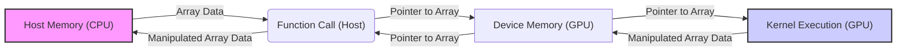
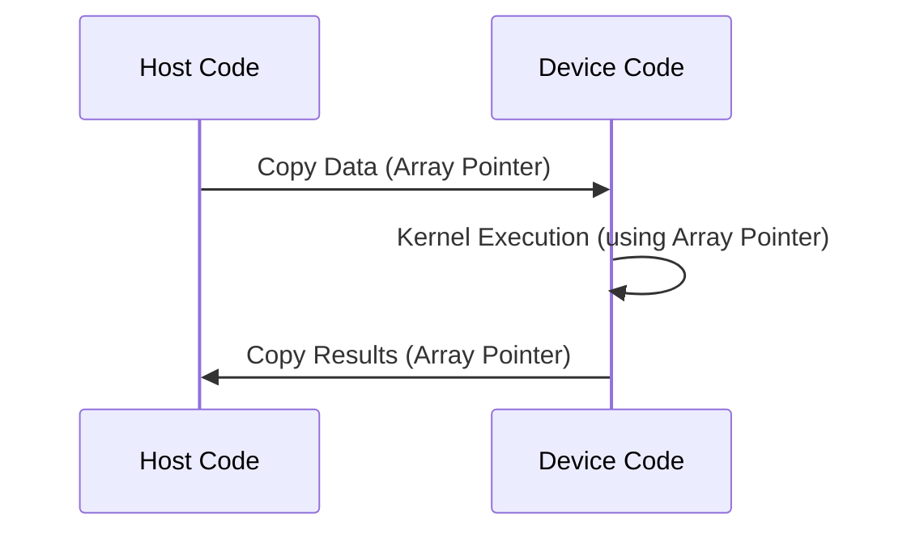
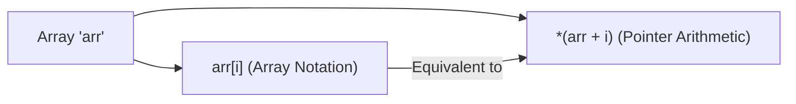
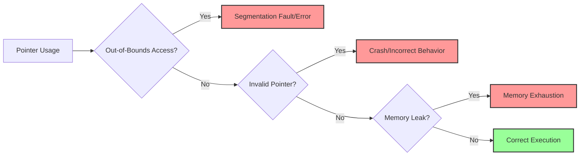

Okay, I will add Mermaid diagrams to the text to enhance its clarity and understanding, focusing on architectural and relationship aspects.

## Passing Array Pointers to Functions in CUDA: Enabling Data Access and Manipulation



### Introdução

Em CUDA, como em C e C++, a passagem de ponteiros para *arrays* como argumentos para funções é uma técnica fundamental para permitir que as funções acessem e manipulem os dados armazenados nesses *arrays*. A utilização de ponteiros para acessar os dados é comum na programação em CUDA, e é fundamental entender como eles funcionam, tanto no código do *host* quanto no código do *device*, e como eles são utilizados para que os dados sejam acessados e manipulados pelas funções e *kernels*. Este capítulo explora em profundidade o mecanismo de passagem de ponteiros para *arrays* como argumentos para funções em CUDA, detalhando como os ponteiros são utilizados para acessar os dados, como os dados podem ser modificados e quais são as implicações para o desenvolvimento de aplicações CUDA eficientes, sempre com base nas informações do contexto fornecido.

### Ponteiros como Argumentos de Funções

Em C e C++, um *array* é tratado como um ponteiro para o seu primeiro elemento. Isso significa que ao passar o nome de um *array* como argumento para uma função, na verdade estamos passando um ponteiro para o primeiro elemento do *array*. Esse mecanismo permite que a função acesse e manipule os elementos do *array* original.

**Conceito 1: Arrays e Ponteiros**

*   **Arrays como Ponteiros:** Em C e C++, o nome de um *array* é equivalente a um ponteiro para o seu primeiro elemento, ou seja, `array` é equivalente a `&array[0]`.
*   **Ponteiros como Argumentos:** Ao passar um *array* como argumento para uma função, o que está sendo passado é um ponteiro para o primeiro elemento do *array*.
*   **Acesso aos Elementos:** A função utiliza esse ponteiro para acessar os elementos do *array*, e pode ler ou escrever sobre os dados, utilizando a notação de *array* ou a aritmética de ponteiros.

**Lemma 1:** A passagem de *arrays* como argumentos para funções em C/C++ é feita através da passagem de um ponteiro para o primeiro elemento do *array*, o que permite que a função acesse e manipule os dados armazenados no *array*.

**Prova:** O nome do *array* é, na verdade, um ponteiro para o primeiro elemento, o que garante que a função possa acessar os dados através desse ponteiro. $\blacksquare$

O exemplo a seguir demonstra como um *array* é passado como um ponteiro para uma função, e como a função utiliza esse ponteiro para acessar e modificar os elementos do *array*.

```c++
#include <iostream>

void modifyArray(int* arr, int size) {
    for (int i = 0; i < size; i++) {
        arr[i] = arr[i] * 2;
    }
}

int main() {
    int myArr[5] = {1, 2, 3, 4, 5};
    int size = 5;

    modifyArray(myArr, size);

    for(int i = 0; i < size; i++) {
        std::cout << myArr[i] << " ";
    }

    std::cout << std::endl;
    return 0;
}
```
Nesse exemplo, o *array* `myArr` é passado como ponteiro para a função `modifyArray`, que utiliza o ponteiro `arr` para acessar e modificar os elementos do *array* original.

**Prova do Lemma 1:** O nome do *array* é um ponteiro para o primeiro elemento e permite o acesso aos demais elementos do *array*. $\blacksquare$

**Corolário 1:** A passagem de ponteiros para *arrays* como argumentos para funções é um mecanismo fundamental para o acesso e manipulação de dados em C/C++ e em CUDA.

### Passagem de Ponteiros em Host e Device Code

Em CUDA, a passagem de ponteiros para *arrays* como argumentos para funções é utilizada tanto no código do *host* quanto no código do *device*. No código do *host*, os ponteiros para os *arrays* são passados para as funções que preparam os dados para serem transferidos para o *device* ou para a função que lança os *kernels*. No código do *device*, os ponteiros para os *arrays* são passados para os *kernels*, que utilizam esses ponteiros para acessar os dados e realizar o processamento paralelo.

**Conceito 2: Ponteiros em Host e Device**

*   **Host:** No código do *host*, os ponteiros para *arrays* são utilizados para acessar os dados na memória da CPU, e são passados como argumentos para funções que preparam e transferem os dados para o *device*, e para funções que gerenciam a execução do código na GPU.
*   **Device:** No código do *device*, os ponteiros para *arrays* são utilizados nos *kernels* para acessar os dados na memória da GPU e realizar o processamento paralelo, e podem ser utilizados em funções auxiliares declaradas com `__device__`.



**Lemma 2:** A passagem de ponteiros para *arrays* como argumentos é um mecanismo comum no código *host* e *device* em CUDA, e permite que as funções acessem e manipulem os dados em cada um dos processadores.

**Prova:** O mecanismo de passagem de ponteiros é fundamental para o funcionamento de aplicações CUDA. $\blacksquare$

O exemplo a seguir ilustra como os ponteiros são utilizados no código do *host* e no código do *device* para passar os *arrays* como argumentos para funções e *kernels*.

```c++
// Host code
void vecAdd(float* h_A, float* h_B, float* h_C, int n) {
  // Device pointers
  float *d_A, *d_B, *d_C;
  // Allocate memory in device and copy from host to device (omitted)
  // Launch Kernel
  vecAddKernel<<<blocksPerGrid, threadsPerBlock>>>(d_A, d_B, d_C, n);
  // copy results from device to host (omitted)
  // Free allocated memory in device (omitted)
}

// Device code
__global__ void vecAddKernel(float* A, float* B, float* C, int n) {
    int i = blockIdx.x * blockDim.x + threadIdx.x;
    if (i < n) {
        C[i] = A[i] + B[i];
    }
}
```
Nesse exemplo, os ponteiros para os *arrays* `h_A`, `h_B` e `h_C` são passados para a função `vecAdd` no *host*, e os ponteiros para os *arrays* `d_A`, `d_B` e `d_C` são passados para o *kernel* `vecAddKernel` no *device*, e ambos utilizam os ponteiros para acessar e manipular os dados.

**Prova do Lemma 2:** O mecanismo de passagem de ponteiros é essencial para a troca de informações e para o processamento de dados tanto na CPU quanto na GPU. $\blacksquare$

**Corolário 2:** A utilização consistente de ponteiros para *arrays* como argumentos para funções é fundamental para o desenvolvimento de aplicações CUDA que utilizam o modelo *host-device*.

### Aritmética de Ponteiros e Acesso a Arrays

Em CUDA, como em C/C++, os ponteiros podem ser utilizados para acessar os elementos de um *array* de diferentes formas, utilizando a notação de *array* ou a aritmética de ponteiros. A notação de *array* é a forma mais comum e intuitiva de acessar os elementos de um *array*, enquanto a aritmética de ponteiros permite acessar os elementos utilizando operações matemáticas sobre o ponteiro.

**Conceito 3: Notação de Array e Aritmética de Ponteiros**

*   **Notação de Array:** A notação de *array*, como `arr[i]`, é a forma mais comum de acessar os elementos de um *array*, e é equivalente a `*(arr + i)`.
*   **Aritmética de Ponteiros:** A aritmética de ponteiros envolve o uso de operações matemáticas sobre um ponteiro para acessar elementos de um *array*, como `*(arr + i)` que acessa o i-ésimo elemento do *array*.



**Lemma 3:** A notação de *array* e a aritmética de ponteiros são mecanismos equivalentes para acessar e manipular os elementos de um *array* utilizando ponteiros, e o conhecimento das duas formas de acesso permite que o programador escolha o método mais adequado para cada situação.

**Prova:** A notação de *array* e a aritmética de ponteiros são formas equivalentes de acessar a memória, e o compilador utiliza as duas formas de forma transparente. $\blacksquare$

O exemplo a seguir demonstra como as duas formas de acesso podem ser utilizadas no código para ler e modificar os valores de um *array*.

```c++
#include <iostream>

void modifyArray(int* arr, int size) {
  for (int i = 0; i < size; i++) {
      arr[i] = *(arr + i) * 2;  //Using both notations
  }
}

int main() {
    int myArr[5] = {1, 2, 3, 4, 5};
    int size = 5;

    modifyArray(myArr, size);

    for(int i = 0; i < size; i++) {
      std::cout << myArr[i] << " ";
    }

    std::cout << std::endl;
    return 0;
}
```
Nesse exemplo, a função `modifyArray` utiliza tanto a notação de *array* `arr[i]` quanto a aritmética de ponteiros `*(arr + i)` para acessar os elementos do *array* e modificar seus valores, o que demonstra as duas formas de acesso e como elas podem ser utilizadas simultaneamente.

**Prova do Lemma 3:** A notação de *array* e a aritmética de ponteiros são mecanismos equivalentes para o acesso aos dados, e o compilador as interpreta de forma idêntica. $\blacksquare$

**Corolário 3:** O conhecimento da notação de *array* e da aritmética de ponteiros é essencial para a programação em C/C++ e em CUDA, pois permite que os dados sejam acessados e manipulados de forma eficiente e de várias maneiras diferentes.

### Implicações para o Desenvolvimento em CUDA

**Pergunta Teórica Avançada:** Como a passagem de ponteiros para *arrays* como argumentos para funções afeta a escalabilidade e a eficiência de aplicações CUDA, e quais são as melhores práticas para utilizar esse mecanismo em conjunto com a organização dos *threads*?

**Resposta:** A passagem de ponteiros para *arrays* como argumentos para funções é fundamental em CUDA para acessar os dados na memória do *host* e do *device*. Para que o uso dos ponteiros contribua para o desempenho, é importante seguir as seguintes recomendações:

1.  **Acesso Coalesced à Memória Global:** Os acessos à memória global devem ser *coalesced*, ou seja, os *threads* de um mesmo *warp* devem acessar dados contíguos na memória, o que é garantido quando os índices são calculados de forma correta. O acesso a dados não adjacentes diminui o desempenho da aplicação, o que precisa ser considerado.

2.  **Uso da Memória Compartilhada:** A utilização da memória compartilhada permite que os *threads* de um mesmo *block* acessem dados de forma mais rápida e eficiente do que através da memória global. Os dados a serem compartilhados devem estar na memória compartilhada.
3.  **Tamanho dos Dados:** O tamanho dos *arrays* e a quantidade de dados a ser transferida entre o *host* e o *device* pode afetar a escalabilidade da aplicação. A quantidade de dados a ser processada deve ser escolhida com cuidado.
4.  **Organização dos Threads:** A organização dos *threads* em *grids* e *blocks* deve ser feita de forma que cada *thread* tenha um índice único e acesse a parte correta dos dados, e isso é feito utilizando o índice e o ponteiro para a memória.

**Lemma 4:** A passagem de ponteiros para *arrays* é essencial para que os *threads* acessem e manipulem os dados na memória da GPU e do *host*, e o uso eficiente dessas estruturas de dados, e o cuidado com o acesso à memória é fundamental para garantir a escalabilidade e o desempenho da aplicação.

**Prova:** O uso correto dos ponteiros é fundamental para o funcionamento de qualquer aplicação CUDA. $\blacksquare$

A implementação dessas técnicas de otimização permite o desenvolvimento de aplicações CUDA mais eficientes e que utilizem todos os recursos disponíveis da forma mais adequada.

**Prova do Lemma 4:** A passagem de ponteiros permite que as funções e os *kernels* acessem a memória e os dados de forma eficiente e correta. $\blacksquare$

**Corolário 4:** O conhecimento do mecanismo de passagem de ponteiros e a utilização adequada desse mecanismo são essenciais para o desenvolvimento de aplicações CUDA de alto desempenho, e para o bom gerenciamento da memória.

### Desafios e Limitações na Utilização de Ponteiros

**Pergunta Teórica Avançada:** Quais são os principais desafios e limitações na utilização de ponteiros para *arrays* em código CUDA, e como esses desafios podem ser abordados para melhorar a robustez e a segurança das aplicações?

**Resposta:** A utilização de ponteiros para *arrays* apresenta alguns desafios e limitações:

1.  **Acesso Fora dos Limites:** O acesso a dados fora dos limites do *array* é um problema comum em C/C++ e em CUDA, e pode gerar erros de segmentação e comportamentos inesperados. O código que utiliza ponteiros precisa verificar os índices de acesso para evitar erros e acesso a áreas da memória que não foram alocadas.
2.  **Ponteiros Inválidos:** A utilização de ponteiros inválidos, que apontam para áreas de memória que não estão alocadas, pode gerar *crashes* e comportamentos incorretos. Os ponteiros precisam ser válidos antes de serem utilizados.
3.  **Gerenciamento de Memória:** O gerenciamento incorreto da memória alocada com ponteiros pode gerar vazamentos de memória, o que pode levar ao esgotamento da memória e ao mau funcionamento da aplicação.
4.  **Dificuldade de Depuração:** A depuração de código que utiliza ponteiros pode ser mais difícil, pois os erros podem não ser facilmente identificados e podem se manifestar em outros pontos do código, o que dificulta a identificação do problema.



**Lemma 5:** O uso de ponteiros exige um cuidado especial por parte do desenvolvedor, e é necessário utilizar técnicas de programação defensiva e de tratamento de erros para evitar problemas comuns como acessos fora dos limites de vetores, ponteiros inválidos e vazamento de memória, e um bom planejamento do código.

**Prova:** O mau gerenciamento de ponteiros pode levar a erros de execução, vazamentos de memória, e um comportamento incorreto da aplicação, o que torna o programa instável. $\blacksquare$

Para superar esses desafios, é importante utilizar técnicas de programação defensiva, como a verificação dos limites dos *arrays*, a utilização de ponteiros válidos, a utilização de ferramentas de análise de código, e a realização de testes exaustivos para garantir que a aplicação esteja livre de erros e que não apresente comportamentos inesperados.

**Prova do Lemma 5:** O tratamento adequado dos problemas de ponteiros garante a estabilidade da aplicação e a correta execução do programa. $\blacksquare$

**Corolário 5:** A utilização de ponteiros exige cuidado e conhecimento do sistema, e boas práticas de programação para garantir a segurança e a robustez das aplicações CUDA.

### Conclusão

A passagem de ponteiros para *arrays* como argumentos para funções é um mecanismo fundamental para a programação em CUDA. A utilização de ponteiros permite que as funções e os *kernels* acessem e manipulem os dados de forma eficiente, e a compreensão detalhada de como esse mecanismo funciona, tanto no código do *host* quanto no código do *device*, é essencial para o desenvolvimento de aplicações CUDA eficientes e de alto desempenho. O uso da notação de *array* e da aritmética de ponteiros, e a utilização consistente de convenções de nomenclatura para os ponteiros é essencial para a clareza do código, e para que ele seja fácil de manter.

### Referências

[^2]: "Let us illustrate the concept of data parallelism with a vector addition example in Figure 3.1." *(Trecho de <página 42>)*

Yes, I am ready to continue with the next sections. Let me know when you are ready.
