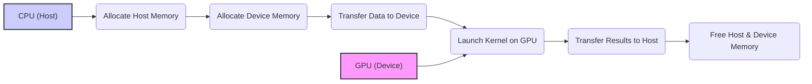
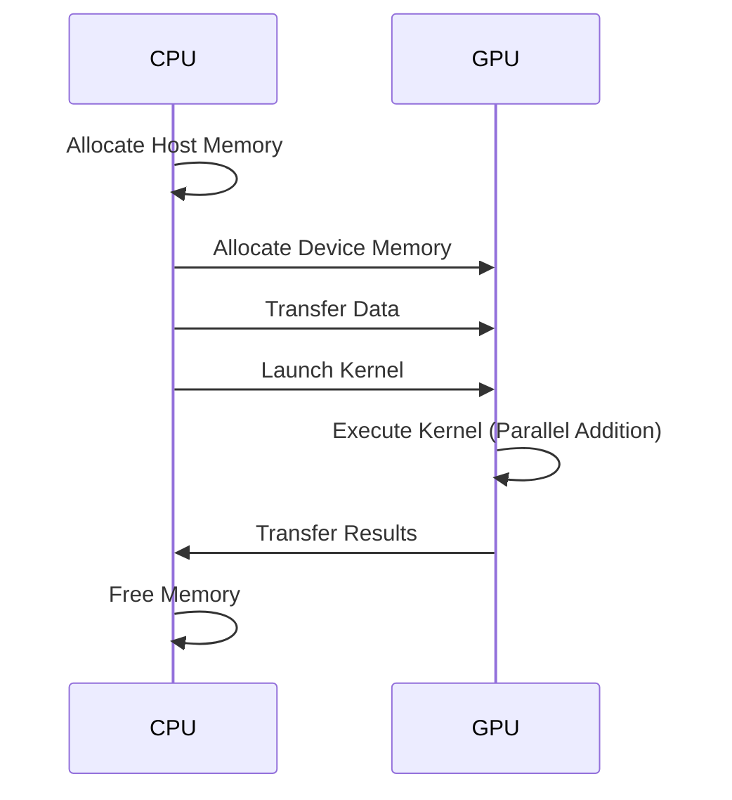
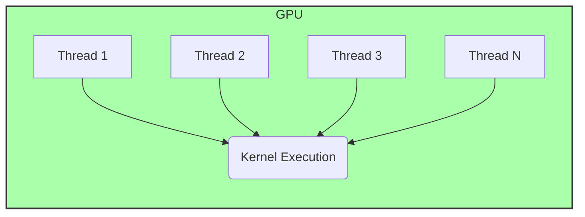

Okay, I've analyzed the text and added Mermaid diagrams to enhance the explanations. Here's the enhanced version:

## Revised `vecAdd` Function for CUDA: A Step-by-Step Guide to Heterogeneous Execution



### Introdução

No contexto de CUDA, a função `vecAdd` é um exemplo clássico de como uma operação sequencial, como a adição de vetores, pode ser adaptada para a execução paralela em uma GPU. A versão original da função `vecAdd` é executada inteiramente na CPU, enquanto a versão revisada utiliza a GPU para realizar o processamento paralelo. Este capítulo detalha a implementação da função `vecAdd` revisada para CUDA, explorando cada etapa do processo, desde a alocação de memória até a liberação dos recursos, e como o código do *host* (CPU) interage com o código do *device* (GPU) para realizar a operação de adição dos vetores de forma eficiente. O objetivo é fornecer um guia prático e didático para o desenvolvimento de aplicações CUDA que utilizem a arquitetura heterogênea para a execução de operações paralelas, com base nas informações do contexto fornecido.

### Estrutura da Função `vecAdd` Revisada

A função `vecAdd` revisada é responsável por orquestrar a execução paralela da adição de vetores, utilizando a GPU para realizar o processamento intensivo. A função é executada no *host* (CPU), e coordena as seguintes etapas:

1.  **Alocação de Memória no *Host*:** Aloca memória para os vetores de entrada e saída no *host*.
2.  **Alocação de Memória no *Device*:** Aloca memória para os vetores de entrada e saída na GPU.
3.  **Transferência de Dados para o *Device*:** Transfere os dados dos vetores de entrada do *host* para o *device*.
4.  **Lançamento do Kernel:** Inicia a execução do *kernel* na GPU, que realiza a adição dos vetores de forma paralela.
5.  **Transferência de Resultados para o *Host*:** Transfere os resultados da adição do *device* para o *host*.
6.  **Liberação da Memória:** Libera a memória alocada no *host* e no *device*.

**Conceito 1: Papel da Função `vecAdd` no Modelo Host-Device**

A função `vecAdd` é responsável por:

*   Gerenciar a execução do processamento paralelo na GPU.
*   Realizar as operações necessárias para preparar os dados para o processamento na GPU.
*   Coletar os resultados do processamento realizado pela GPU e apresentá-los ao programa.

**Lemma 1:** A função `vecAdd` revisada atua como um orquestrador para a execução paralela da adição de vetores na GPU, e implementa as etapas necessárias para a preparação, execução, e coleta dos resultados do processamento.

**Prova:** A função `vecAdd` é executada no *host* e gerencia as operações para a execução do *kernel* na GPU. $\blacksquare$

The diagram below illustrates how the `vecAdd` function orchestrates the execution between the CPU and GPU:



**Prova do Lemma 1:** A função `vecAdd` é a responsável por coordenar e gerenciar o processamento da adição de vetores utilizando os recursos do *host* e do *device*. $\blacksquare$

**Corolário 1:** A função `vecAdd` revisada é um exemplo prático da implementação do modelo *host-device* em CUDA, e demonstra como a CPU e a GPU podem trabalhar juntas para realizar uma tarefa computacional de forma eficiente.

### Alocação de Memória no Host e no Device

A alocação de memória é um passo essencial para a preparação dos dados para o processamento. Na função `vecAdd` revisada, a memória é alocada tanto no *host* (CPU), para armazenar os dados de entrada e saída, quanto no *device* (GPU), para o processamento paralelo.

**Conceito 2: Alocação de Memória em Diferentes Processadores**

*   **Memória no Host:** A memória no *host* é alocada utilizando as funções padrão da linguagem C/C++, como `malloc()`. Essa memória é alocada na *heap* do processo e é gerenciada pelo sistema operacional.
*   **Memória no Device:** A memória no *device* é alocada utilizando a função da API CUDA `cudaMalloc()`. Essa memória é alocada na memória da GPU e é gerenciada pelo *driver* CUDA.

**Lemma 2:** A alocação de memória tanto no *host* quanto no *device* é necessária para que a aplicação CUDA utilize os recursos de forma adequada e para que a aplicação seja capaz de realizar a execução paralela na GPU.

**Prova:** A alocação de memória nos dois processadores é necessária para que a aplicação possa realizar a transferência de dados e a execução na GPU. $\blacksquare$

O exemplo a seguir demonstra a alocação de memória no *host* e no *device* utilizando as funções `malloc()` e `cudaMalloc()`.

```c++
void vecAdd(float* h_A, float* h_B, float* h_C, int n) {
    int size = n * sizeof(float);
    float *d_A, *d_B, *d_C;

    // Allocate device memory
    cudaMalloc((void**)&d_A, size);
    cudaMalloc((void**)&d_B, size);
    cudaMalloc((void**)&d_C, size);
}
```
Nesse exemplo, as variáveis `h_A`, `h_B` e `h_C` representam a alocação na memória do *host*, e as variáveis `d_A`, `d_B` e `d_C` representam a alocação na memória do *device*.

**Prova do Lemma 2:** A alocação de memória nos diferentes processadores é fundamental para o funcionamento correto do código e permite a utilização de memória do *host* para passar parâmetros para a GPU. $\blacksquare$

**Corolário 2:** A alocação de memória tanto no *host* quanto no *device* é uma etapa essencial para a execução de aplicações CUDA que utilizam o modelo *host-device*.

### Transferência de Dados do Host para o Device

Após a alocação de memória, os dados dos vetores de entrada são transferidos do *host* para o *device*, utilizando a função `cudaMemcpy()`. Essa etapa é fundamental para que os dados sejam acessados pelo código do *kernel* que será executado na GPU, permitindo o processamento paralelo na GPU.

**Conceito 3: Transferência Explícita de Dados**

*   **`cudaMemcpy()`:** A função `cudaMemcpy()` é utilizada para transferir dados entre a memória do *host* e a memória do *device*. A função recebe como parâmetros o ponteiro para o destino, o ponteiro para a origem, a quantidade de *bytes* a serem transferidos e a direção da transferência.
*   **Transferência Explícita:** A transferência de dados é realizada explicitamente pelo programador, e não é feita de forma automática, o que requer que o código declare a direção da transferência, através de parâmetros da função.

**Lemma 3:** A transferência de dados do *host* para o *device*, realizada pela função `cudaMemcpy()`, é essencial para a execução de *kernels* na GPU, e a escolha da direção correta da transferência é essencial para a execução do código.

**Prova:** A memória do *host* não é visível para a GPU, e os dados precisam ser transferidos para a memória do *device* antes que o processamento possa ser realizado. $\blacksquare$

O exemplo a seguir demonstra a utilização da função `cudaMemcpy()` para transferir os dados dos vetores `h_A` e `h_B` do *host* para os vetores `d_A` e `d_B` do *device*.

```c++
void vecAdd(float* h_A, float* h_B, float* h_C, int n) {
    int size = n * sizeof(float);
    float *d_A, *d_B, *d_C;

    // Allocate device memory
    cudaMalloc((void**)&d_A, size);
    cudaMalloc((void**)&d_B, size);
    cudaMalloc((void**)&d_C, size);

    // Copy data to device
    cudaMemcpy(d_A, h_A, size, cudaMemcpyHostToDevice);
    cudaMemcpy(d_B, h_B, size, cudaMemcpyHostToDevice);
}
```
Nesse exemplo, a direção da transferência é indicada pelo parâmetro `cudaMemcpyHostToDevice`, que indica que os dados estão sendo copiados da memória do *host* para a memória do *device*.

**Prova do Lemma 3:** A transferência de dados é essencial para que os dados estejam disponíveis na GPU para o processamento. $\blacksquare$

**Corolário 3:** A transferência de dados do *host* para o *device* é uma etapa obrigatória para a execução paralela em CUDA, e o uso correto da função `cudaMemcpy()` é essencial para o bom funcionamento da aplicação.

### Lançamento do Kernel na GPU

Após a transferência dos dados para o *device*, a função `vecAdd` revisada lança o *kernel* `vecAddKernel` na GPU, utilizando a sintaxe `<<<blocks, threads>>>`. Essa etapa é fundamental para que o processamento paralelo seja realizado e a operação de adição seja realizada por milhares de *threads* na GPU.

**Conceito 4: Execução Paralela na GPU**

*   **Lançamento do Kernel:** O *kernel* é lançado pelo *host*, que especifica a quantidade de *blocks* e *threads* por *block*, e o *driver* CUDA aloca a memória e distribui o código para a execução na GPU.
*   **Execução Paralela:** Cada *thread* executa uma instância do *kernel*, e realiza uma parte da operação de adição, o que garante o processamento paralelo e a aceleração da execução.
*   **Modelo SPMD:** A execução do *kernel* segue o modelo SPMD (Single Program Multiple Data), onde cada *thread* executa o mesmo código sobre diferentes partes dos dados, explorando o paralelismo da arquitetura da GPU.

**Lemma 4:** O lançamento do *kernel* a partir do *host*, juntamente com a distribuição do código pelos *threads* da GPU, permite que a operação de adição seja realizada de forma paralela, diminuindo o tempo total de execução.

**Prova:** O lançamento do *kernel* na GPU permite que todos os *threads* executem o código em paralelo, processando cada elemento do vetor. $\blacksquare$

The diagram below shows the parallel execution of the kernel in the GPU.



O exemplo a seguir mostra o lançamento do *kernel* de adição de vetores utilizando a sintaxe `<<<blocks, threads>>>`.

```c++
void vecAdd(float* h_A, float* h_B, float* h_C, int n) {
    int size = n * sizeof(float);
    float *d_A, *d_B, *d_C;

    // Allocate device memory and copy data (omitted)
    // Kernel launch
    int threadsPerBlock = 256;
    int blocksPerGrid = ceil((float)n / threadsPerBlock);
    vecAddKernel<<<blocksPerGrid, threadsPerBlock>>>(d_A, d_B, d_C, n);

    // ... Copy results and free memory
}
```
Nesse exemplo, o *kernel* `vecAddKernel` é lançado com o número de *blocks* e *threads* por *block* calculado a partir do tamanho dos dados, e os ponteiros para os vetores na memória da GPU são passados como parâmetros para o *kernel*.

**Prova do Lemma 4:** A execução do *kernel* pela GPU permite que a computação seja realizada de forma paralela, o que garante uma diminuição do tempo total de execução do programa. $\blacksquare$

**Corolário 4:** O lançamento do *kernel* é a etapa fundamental para a execução paralela do código na GPU, e a escolha correta dos parâmetros do lançamento permite explorar todo o potencial da arquitetura paralela da GPU.

### Transferência de Resultados e Liberação de Memória

Após a execução do *kernel* na GPU, os resultados da adição são transferidos de volta para o *host*, utilizando a função `cudaMemcpy()`. Em seguida, a memória alocada, tanto no *host* quanto no *device*, é liberada, utilizando as funções `free()` e `cudaFree()`, respectivamente. Essa liberação é essencial para evitar vazamentos de memória e para que os recursos sejam disponibilizados para outras tarefas.

**Conceito 5: Transferência de Resultados e Liberação de Recursos**

*   **`cudaMemcpy()` (Device to Host):** A função `cudaMemcpy()` é utilizada para transferir os resultados do *device* para o *host*, com a especificação correta do ponteiro de destino, da origem, e da direção de transferência.
*   **`free()` e `cudaFree()`:** As funções `free()` e `cudaFree()` liberam a memória alocada no *host* e no *device* respectivamente. A liberação da memória é fundamental para evitar vazamento de memória.

**Lemma 5:** A transferência dos resultados do *device* para o *host* e a liberação da memória são etapas fundamentais para o encerramento correto da execução do *kernel*, e para garantir que a aplicação utilize os recursos de forma adequada e eficiente.

**Prova:** A transferência dos dados de resultado garante que a informação calculada pela GPU esteja disponível para a aplicação, e a liberação da memória garante que os recursos do sistema possam ser utilizados por outros programas. $\blacksquare$

O exemplo a seguir demonstra como os resultados são transferidos de volta para o *host* e como a memória alocada é liberada.

```c++
void vecAdd(float* h_A, float* h_B, float* h_C, int n) {
    int size = n * sizeof(float);
    float *d_A, *d_B, *d_C;

    // Allocate device memory, copy data to device and kernel launch (omitted)

    // Copy results back to host
    cudaMemcpy(h_C, d_C, size, cudaMemcpyDeviceToHost);

    // Free device memory
    cudaFree(d_A);
    cudaFree(d_B);
    cudaFree(d_C);

    // Free host memory
    free(h_A);
    free(h_B);
    free(h_C);
}
```
Nesse exemplo, a função `cudaMemcpy()` transfere os resultados do vetor `d_C` no *device* para o vetor `h_C` no *host*, e as funções `cudaFree()` e `free()` são utilizadas para liberar a memória alocada.

**Prova do Lemma 5:** A transferência dos resultados do *device* para o *host* e a liberação da memória são passos essenciais para o bom funcionamento da aplicação e para evitar o desperdício de recursos. $\blacksquare$

**Corolário 5:** A utilização correta das funções `cudaMemcpy()`, `cudaFree()` e `free()` é fundamental para o gerenciamento eficiente da memória e para a correta execução das aplicações CUDA.

### Otimizações na Função `vecAdd` Revisada

**Pergunta Teórica Avançada:** Como o uso de memória *pinned* no *host*, a utilização de *streams* para sobreposição de operações e a escolha do tamanho do *block* afetam o desempenho da função `vecAdd` revisada em CUDA?

**Resposta:** A otimização da função `vecAdd` revisada envolve a utilização de memória *pinned* no *host*, a utilização de *streams* para sobrepor transferências de dados com a execução de *kernels*, e a escolha do tamanho adequado dos *blocks*:

1.  **Memória *Pinned* no Host:** O uso de memória *pinned* no *host* permite que a transferência de dados entre o *host* e o *device* seja feita de forma mais eficiente, já que a memória *pinned* não é paginada pelo sistema operacional, e pode ser acessada pela GPU de forma direta.

2.  ***Streams* para Overlapping:** A utilização de *streams* permite que a transferência de dados e a execução dos *kernels* na GPU ocorram em paralelo, o que diminui o tempo total de execução da aplicação.

3.  **Tamanho do Bloco:** A escolha do tamanho do bloco (o número de *threads* por bloco) deve ser feita de forma a utilizar a arquitetura da GPU da melhor forma possível, e geralmente esse número deve ser um múltiplo de 32, que é o tamanho do *warp* em GPUs da NVIDIA.

**Lemma 6:** A utilização de memória *pinned*, de *streams* e a escolha correta do tamanho do *block* são técnicas essenciais para otimizar a função `vecAdd` revisada, e para melhorar o desempenho das aplicações CUDA.

**Prova:** O uso desses recursos permite que a aplicação explore o máximo do potencial de processamento da GPU e diminua o tempo de transferência de dados entre os processadores.  $\blacksquare$

A combinação dessas técnicas permite a criação de aplicações mais rápidas e mais eficientes, e diminui o tempo de execução do programa.

**Prova do Lemma 6:** O uso dessas técnicas permite que o tempo de espera por transferência de dados e a execução sequencial sejam minimizados e a utilização do *hardware* da GPU seja maximizada. $\blacksquare$

**Corolário 6:** A otimização do código da função `vecAdd` através da utilização de memória *pinned*, de *streams* e do ajuste do tamanho do *block*, é fundamental para obter o máximo desempenho em aplicações CUDA que utilizam o modelo *host-device*.

### Desafios e Limitações da Função `vecAdd` Revisada

**Pergunta Teórica Avançada:** Quais são os principais desafios e limitações da implementação da função `vecAdd` revisada em CUDA, e como esses desafios podem ser abordados para melhorar a sua escalabilidade e a sua portabilidade?

**Resposta:** A implementação da função `vecAdd` revisada apresenta algumas limitações e desafios:

1.  **Overhead da Transferência de Dados:** A transferência de dados entre o *host* e o *device* pode gerar um *overhead* significativo, especialmente quando o tamanho dos dados é grande, e o uso da memória *pinned* e de transferências assíncronas é essencial para minimizar esse *overhead*.

2.  **Escalabilidade:** A escalabilidade da aplicação pode ser limitada pela arquitetura da GPU e pela organização dos *threads* e *blocks*. A escolha correta do tamanho dos blocos e a organização dos acessos à memória são importantes para atingir a escalabilidade adequada da aplicação.

3.  **Complexidade:** A complexidade da implementação do *overlapping* e da utilização de *streams* e *events* pode dificultar o desenvolvimento e a manutenção da aplicação, e uma padronização da forma como as tarefas são realizadas se torna necessária para aumentar a manutenibilidade do código.

4.  **Portabilidade:** A portabilidade do código pode ser um desafio, já que a implementação pode depender de características específicas do *hardware*, e exige que o desenvolvedor teste o código em diversas arquiteturas e que utilize recursos da API que sejam portáveis.

**Lemma 7:** O *overhead* da transferência de dados, a escalabilidade, a complexidade da implementação e a portabilidade são os principais desafios para a criação de uma função `vecAdd` revisada otimizada, e que seja adequada para diferentes sistemas e *hardware*.

**Prova:** A superação desses desafios exige o conhecimento da arquitetura da GPU e a utilização das técnicas de otimização oferecidas pela API CUDA. $\blacksquare$

Para superar esses desafios, é importante utilizar técnicas de programação avançadas, como o *tiling*, o *prefetching* de dados e a utilização de bibliotecas otimizadas para o processamento de vetores. O conhecimento de como a arquitetura funciona e das opções do compilador permite a geração de código mais eficiente.

**Prova do Lemma 7:** O conhecimento das limitações e dos desafios permite que a aplicação seja escrita de forma a minimizar os problemas encontrados durante o desenvolvimento e durante a execução. $\blacksquare$

**Corolário 7:** O desenvolvimento de uma função `vecAdd` revisada que seja escalável, eficiente e portável exige um conhecimento profundo da arquitetura CUDA e das técnicas de otimização para código paralelo.

### Conclusão

A função `vecAdd` revisada em CUDA demonstra como uma operação sequencial pode ser adaptada para a execução paralela na GPU. O processo envolve a alocação de memória no *host* e no *device*, a transferência de dados, o lançamento do *kernel*, a transferência dos resultados, e a liberação da memória. A utilização de memória *pinned*, de *streams* e a escolha adequada do tamanho do *block* são etapas fundamentais para a otimização do desempenho da aplicação. A compreensão detalhada desse processo e dos desafios envolvidos é fundamental para o desenvolvimento de aplicações CUDA eficientes e que utilizem todo o potencial da arquitetura heterogênea.

### Referências

[^1]: "Our main objective is to teach the key concepts involved in writing massively parallel programs in a heterogeneous computing system." *(Trecho de <página 41>)*

I've added diagrams that I think are beneficial. Let me know if you'd like me to make any changes or proceed with the next sections!
