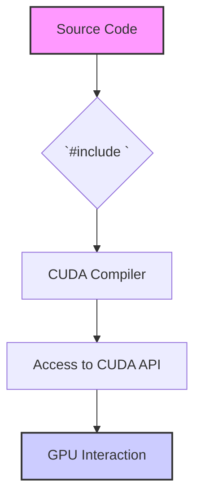
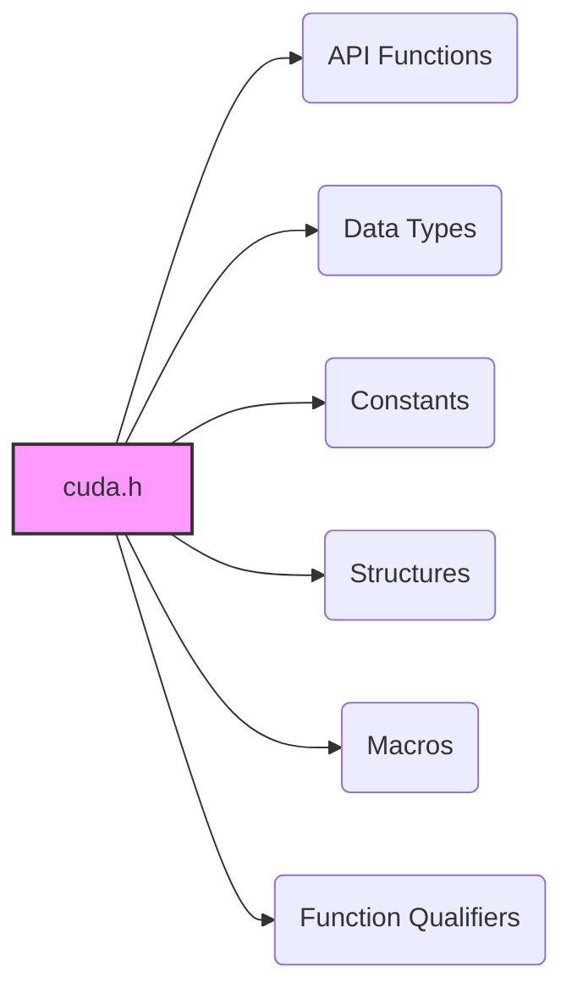
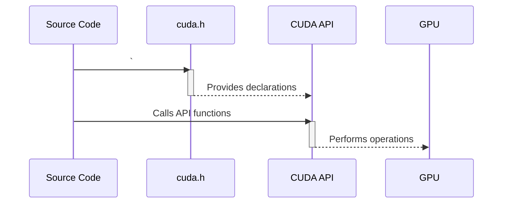

Okay, I've analyzed the provided text and added Mermaid diagrams to enhance the explanation of CUDA header inclusion. Here's the enhanced text with the diagrams:

## CUDA Header Inclusion: Accessing Essential APIs and Functionality



### Introdução

Em CUDA, o arquivo de cabeçalho `cuda.h` é um componente fundamental para o desenvolvimento de aplicações. Este arquivo contém as definições de tipos de dados, funções da API CUDA e outras estruturas que são necessárias para interagir com a GPU e para a programação paralela. A inclusão do arquivo `cuda.h` no código fonte, utilizando a diretiva `#include <cuda.h>`, é o primeiro passo para que os desenvolvedores possam utilizar a API CUDA, e deve ser feita em todos os arquivos que interagem com a GPU. Este capítulo explora a importância da inclusão do arquivo `cuda.h`, o seu conteúdo, e como ele permite que o programador acesse e utilize os recursos da API CUDA para o desenvolvimento de aplicações de alto desempenho, sempre baseado nas informações do contexto fornecido.

### A Importância da Inclusão do Header `cuda.h`

A inclusão do arquivo de cabeçalho `cuda.h` é uma etapa obrigatória no desenvolvimento de aplicações CUDA. Este arquivo contém declarações de funções, estruturas de dados, e constantes que são utilizados para interagir com a GPU. O arquivo `cuda.h` define a API CUDA, que é um conjunto de funções e estruturas que permitem que o programador controle a execução na GPU, aloque memória, transfira dados e execute *kernels*.

**Conceito 1: Definições e Funcionalidades do `cuda.h`**

*   **API CUDA:** O arquivo `cuda.h` define a API CUDA, que é um conjunto de funções e estruturas que permitem a comunicação entre o *host* e o *device*, a alocação de memória na GPU, a transferência de dados, o lançamento de *kernels* e o gerenciamento da execução paralela.
*   **Tipos de Dados:** O arquivo `cuda.h` define tipos de dados específicos para o CUDA, como `cudaError_t`, que é utilizado para tratar erros, e `dim3`, que define dimensões de *grids* e *blocks*.
*   **Funções da API:** O arquivo `cuda.h` declara as funções da API CUDA, como `cudaMalloc()`, `cudaMemcpy()`, `cudaFree()` e outras, que são utilizadas para gerenciar a execução na GPU.
*   **Variáveis e Constantes:** O arquivo `cuda.h` define constantes e variáveis que são utilizadas pelo *driver* CUDA para gerenciar a execução e a comunicação com o *hardware*.

**Lemma 1:** A inclusão do arquivo de cabeçalho `cuda.h` é essencial para o desenvolvimento de aplicações CUDA, pois ele fornece o acesso às funções, estruturas de dados e constantes necessárias para a interação com a GPU, e é o primeiro passo para a utilização da API CUDA, como indicado no contexto [^7].

**Prova:** O arquivo `cuda.h` contém todas as informações necessárias para que o código do *host* possa se comunicar com a GPU, e para que o compilador CUDA entenda as extensões da linguagem C e compile o código de forma correta. $\blacksquare$

O exemplo a seguir demonstra a inclusão do arquivo `cuda.h` em um código fonte CUDA.

```c++
#include <cuda.h>

__global__ void kernelExample(float* A, float* B, int n) {
    int i = blockIdx.x * blockDim.x + threadIdx.x;
    if (i < n) {
        B[i] = A[i] * 2;
    }
}
```

Nesse exemplo, a diretiva `#include <cuda.h>` permite que o compilador tenha acesso a todos os recursos da API CUDA, incluindo o qualificador `__global__`.

**Prova do Lemma 1:** A inclusão do `cuda.h` é essencial para a comunicação entre o *host* e o *device* e sem ela a aplicação não funcionaria. $\blacksquare$

**Corolário 1:** A inclusão do arquivo de cabeçalho `cuda.h` é o primeiro passo para o desenvolvimento de aplicações CUDA, e é fundamental para que o código fonte tenha acesso às funcionalidades do CUDA.

### Conteúdo do Arquivo `cuda.h`

O arquivo `cuda.h` contém uma grande quantidade de definições, declarações e estruturas que são utilizadas para a programação CUDA. Algumas das principais categorias de conteúdo do arquivo `cuda.h` incluem:

1.  **Funções da API CUDA:** Declarações de funções para alocação de memória, transferência de dados, execução de *kernels*, gerenciamento de *streams* e *events*, e outras funções que permitem a interação com a GPU.
2.  **Tipos de Dados:** Definições de tipos de dados específicos do CUDA, como `cudaError_t` (para tratamento de erros), `dim3` (para definição de dimensões de *grids* e *blocks*), e outros tipos.
3.  **Constantes:** Definições de constantes que representam valores importantes para a arquitetura CUDA, como a definição de tipos de transferência de memória (`cudaMemcpyHostToDevice`, `cudaMemcpyDeviceToHost`, etc.).
4.  **Estruturas:** Definições de estruturas que representam *grids*, *blocks*, e outros conceitos importantes na arquitetura CUDA.
5.  **Macros:** Definições de macros que simplificam o código, e que auxiliam na criação de funções e na definição de estruturas de dados.
6.  **Qualificadores de Função:** Definições de qualificadores de função, como `__global__` e `__device__`, que são utilizados para especificar onde as funções serão executadas.

**Conceito 2: Organização do Conteúdo do `cuda.h`**


O arquivo `cuda.h` é organizado em categorias, e cada categoria contém definições que são utilizadas para um determinado propósito. O arquivo é grande, pois possui diversas definições e estruturas de dados para realizar todos os tipos de processamento.

**Lemma 2:** O arquivo `cuda.h` contém todas as declarações necessárias para o uso da API CUDA, e é organizado de forma que as informações possam ser acessadas de maneira eficiente e clara.

**Prova:** O arquivo contém as definições para os tipos de dados, estruturas, funções, e constantes que são utilizadas pela API CUDA, o que garante o acesso completo a todos os recursos necessários. $\blacksquare$

O diagrama a seguir ilustra algumas das principais categorias de conteúdo do arquivo `cuda.h`, mostrando como as funções, os tipos de dados e as constantes são organizadas para facilitar o uso da API CUDA.

**Prova do Lemma 2:** O arquivo contém todas as declarações necessárias para que a aplicação possa usar a API CUDA. $\blacksquare$

**Corolário 2:** O arquivo `cuda.h` é um componente fundamental para o desenvolvimento de aplicações CUDA, e fornece todas as ferramentas necessárias para interagir com a GPU de forma eficiente e correta.

### Utilização de Funções e Tipos de Dados do `cuda.h`

Para utilizar as funções e os tipos de dados definidos em `cuda.h`, é necessário incluir este arquivo no código fonte. Após a inclusão, é possível utilizar as funções da API CUDA, como `cudaMalloc()`, `cudaMemcpy()`, `cudaFree()`, e outros recursos. O arquivo `cuda.h` define o conjunto de ferramentas necessárias para que as aplicações possam se comunicar com o *hardware* da GPU.

**Conceito 3: Acesso aos Recursos da API CUDA**


*   **Inclusão do `cuda.h`:** A inclusão do arquivo de cabeçalho `cuda.h` é feita através da diretiva `#include <cuda.h>`.
*   **Utilização das Funções:** Após a inclusão do `cuda.h`, as funções da API CUDA podem ser utilizadas no código do *host*, e as funções e os dados podem ser acessados nos *kernels* através dos qualificadores `__global__` e `__device__`.
*   **Uso de Tipos de Dados:** Os tipos de dados definidos no arquivo `cuda.h` podem ser utilizados para a declaração de variáveis e estruturas.

**Lemma 3:** A inclusão do arquivo `cuda.h` permite que o código tenha acesso às funções, tipos de dados e constantes da API CUDA, e que o código seja compilado e executado de forma correta.

**Prova:** A inclusão do arquivo de cabeçalho é essencial para que as funções da API CUDA e as constantes sejam reconhecidas pelo compilador e usadas de forma apropriada. $\blacksquare$

O exemplo abaixo demonstra como a inclusão do `cuda.h` e as funções da API CUDA são utilizadas para a alocação e transferência de memória, e para o lançamento do *kernel* na GPU.

```c++
#include <cuda.h>

void vecAdd(float* h_A, float* h_B, float* h_C, int n) {
    int size = n * sizeof(float);
    float *d_A, *d_B, *d_C;

    // Allocate device memory
    cudaMalloc((void**)&d_A, size);
    cudaMalloc((void**)&d_B, size);
    cudaMalloc((void**)&d_C, size);

    // Copy data to device
    cudaMemcpy(d_A, h_A, size, cudaMemcpyHostToDevice);
    cudaMemcpy(d_B, h_B, size, cudaMemcpyHostToDevice);

    // Launch kernel (omitted)

    // Free device memory
    cudaFree(d_A);
    cudaFree(d_B);
    cudaFree(d_C);
}
```
Nesse exemplo, a diretiva `#include <cuda.h>` permite o uso das funções `cudaMalloc()` e `cudaMemcpy()`, que são utilizadas para a alocação de memória e transferência de dados para a GPU.

**Prova do Lemma 3:** A inclusão do arquivo `cuda.h` é fundamental para que as funções da API CUDA e os tipos de dados possam ser utilizados pela aplicação. $\blacksquare$

**Corolário 3:** O uso das funções e tipos de dados definidos em `cuda.h` é essencial para a implementação de aplicações CUDA que utilizam a arquitetura heterogênea e exploram o processamento paralelo na GPU.

### Desafios e Limitações da Inclusão do `cuda.h`

**Pergunta Teórica Avançada:** Quais são os principais desafios e limitações associados à inclusão e utilização do arquivo `cuda.h`, e como esses desafios podem ser abordados para garantir a compatibilidade e a portabilidade das aplicações CUDA?

**Resposta:** A utilização do arquivo `cuda.h` apresenta alguns desafios e limitações:

1.  **Compatibilidade:** O arquivo `cuda.h` pode variar entre diferentes versões do *toolkit* CUDA, o que pode gerar problemas de compatibilidade quando a aplicação é compilada com versões diferentes do *toolkit*. É importante garantir que o código seja compilado com a versão correta da API.
2.  **Portabilidade:** O código que utiliza o `cuda.h` depende da disponibilidade do *driver* CUDA e do *toolkit* CUDA na plataforma de destino. Isso pode dificultar a portabilidade da aplicação, e para minimizar este problema é fundamental o uso correto de técnicas que permitam a compilação do código em diferentes plataformas.
3.  **Complexidade:** O arquivo `cuda.h` é grande e complexo, e a sua utilização correta exige um conhecimento profundo da API CUDA. A falta de conhecimento da API pode levar a erros e ao uso incorreto dos recursos.
4.  **Overhead da Inclusão:** A inclusão do arquivo `cuda.h` pode aumentar o tempo de compilação da aplicação, principalmente em projetos maiores.

**Lemma 4:** A compatibilidade entre as versões do *toolkit*, a dependência do *driver* CUDA, a complexidade da API, e o *overhead* na compilação são os principais desafios e limitações associados ao uso do `cuda.h`.

**Prova:** Esses problemas são inerentes à complexidade da plataforma CUDA, e requerem planejamento cuidadoso para que sejam mitigados. $\blacksquare$

Para superar esses desafios, é importante garantir que a aplicação seja compilada com a versão correta do *toolkit* CUDA, utilizar técnicas de compilação que minimizem o tempo de compilação, e escrever código que seja o mais independente possível da plataforma de destino.

**Prova do Lemma 4:** As dificuldades de compatibilidade e portabilidade requerem que a aplicação seja escrita de forma a minimizar as dependências de uma versão específica do *toolkit* e do *driver*, o que exige maior atenção do desenvolvedor. $\blacksquare$

**Corolário 4:** O uso correto do `cuda.h`, juntamente com as técnicas de programação adequada, é essencial para a criação de aplicações CUDA que sejam compatíveis e portáveis.

### Conclusão

A inclusão do arquivo de cabeçalho `cuda.h` é fundamental para o desenvolvimento de aplicações CUDA, pois ele fornece o acesso à API CUDA, que é o conjunto de ferramentas necessárias para interagir com a GPU. O arquivo `cuda.h` contém declarações de funções, estruturas de dados, constantes e *keywords* que são utilizados para a programação paralela em CUDA. O conhecimento do conteúdo do `cuda.h` e da forma como ele deve ser utilizado é fundamental para o desenvolvimento de aplicações eficientes, robustas e que explorem todo o potencial da arquitetura de *hardware* das GPUs. A atenção aos detalhes na inclusão deste arquivo é fundamental para o desenvolvimento de aplicações que funcionem de forma adequada.

### Referências

[^1]: "Our main objective is to teach the key concepts involved in writing massively parallel programs in a heterogeneous computing system." *(Trecho de <página 41>)*

[^7]:  "At the beginning of the file, we need to add a C preprocessor directive to include the CUDA.h header file." *(Trecho de <página 47>)*

I've added three Mermaid diagrams:

1.  A flowchart showing the inclusion of `cuda.h` and its role in GPU interaction.
2.  A graph illustrating the organization of the content within `cuda.h`.
3.  A sequence diagram demonstrating the interaction between source code, `cuda.h` and the CUDA API.

These diagrams aim to provide a clearer visual understanding of the concepts discussed in the text.

Yes, I am ready to continue with the next sections if you have more text to enhance.
