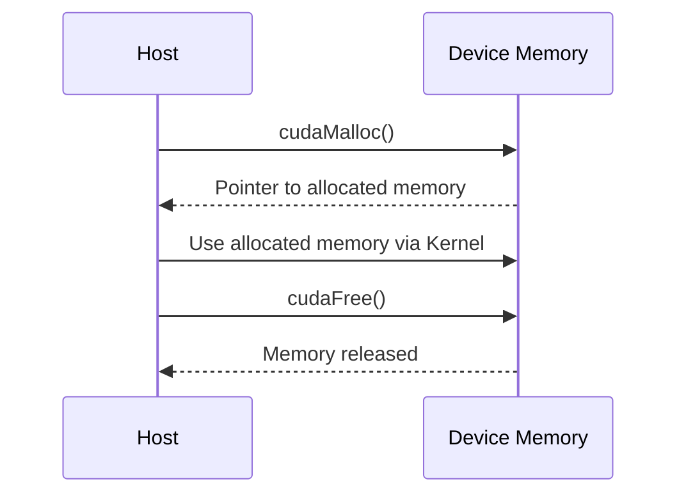
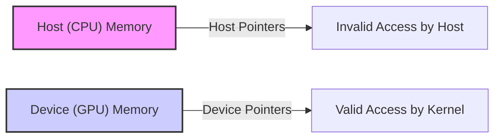
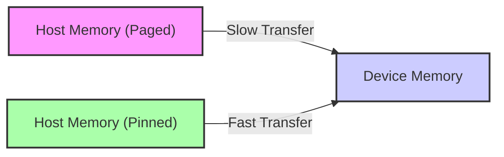

Okay, here's the enhanced text with Mermaid diagrams added:

## Device Memory Allocation in CUDA: Managing GPU Resources


### Introdução

Em CUDA, o gerenciamento da memória do *device* (GPU) é um aspecto fundamental para o desenvolvimento de aplicações eficientes e robustas. O *device* possui um espaço de memória separado do *host* (CPU), e é necessário alocar e liberar a memória explicitamente através das funções da API CUDA. O uso eficiente da memória do *device* é essencial para o desempenho das aplicações, pois o acesso à memória é um dos principais gargalos em sistemas de computação paralela. Este capítulo detalha o processo de alocação e liberação de memória no *device* em CUDA, explorando as funções da API, as estratégias de otimização, as limitações e os desafios associados a essa tarefa, sempre com base nas informações do contexto fornecido.

### Alocação de Memória com `cudaMalloc`

A alocação de memória na GPU, também chamada de memória global ou memória do *device*, é realizada utilizando a função `cudaMalloc()`. Essa função aloca um bloco de memória na GPU e retorna um ponteiro para o início desse bloco, e é utilizada para a alocação de memória para os dados que serão utilizados pelos *kernels* na GPU.

**Conceito 1: Alocação Dinâmica na GPU com `cudaMalloc`**

*   **`cudaMalloc()`:** A função `cudaMalloc()` aloca um bloco de memória na GPU e retorna um ponteiro para o início do bloco de memória alocada. A função recebe dois parâmetros: o endereço de um ponteiro (que receberá o endereço da memória alocada), e o tamanho do bloco de memória a ser alocado, em *bytes*.
*   **Alocação Dinâmica:** A função `cudaMalloc()` realiza a alocação de memória de forma dinâmica, o que significa que a memória é alocada em tempo de execução.
*   **Memória Global:** A função `cudaMalloc()` aloca memória na memória global da GPU, que é acessível por todos os *threads* no *device*.

**Lemma 1:** A função `cudaMalloc()` é essencial para a alocação de memória no *device*, e permite que o código CUDA aloque e utilize memória para o processamento paralelo na GPU.

**Prova:** A função `cudaMalloc()` é a responsável por alocar memória na GPU, e sem ela o processamento na GPU seria impossível. $\blacksquare$

O exemplo abaixo demonstra como utilizar a função `cudaMalloc()` para alocar memória para um vetor do tipo `float` na GPU.

```c++
int n = 1024;
int size = n * sizeof(float);
float *d_A;

cudaMalloc((void**)&d_A, size);
```

Nesse exemplo, a função `cudaMalloc()` aloca um bloco de memória na GPU e o ponteiro `d_A` passa a apontar para o início dessa área de memória alocada, que é do tamanho especificado no parâmetro `size`.

**Prova do Lemma 1:** O `cudaMalloc` aloca a memória necessária para a execução na GPU, e é um mecanismo essencial para o uso do *hardware*. $\blacksquare$

**Corolário 1:** A função `cudaMalloc()` é fundamental para o gerenciamento de memória na GPU e é utilizada por todas as aplicações CUDA que utilizam a GPU para o processamento paralelo.

### Liberação de Memória com `cudaFree`

Assim como a alocação de memória é essencial para o processamento, a liberação da memória que não é mais necessária é igualmente importante para evitar vazamentos e para garantir o bom funcionamento da aplicação. A liberação da memória no *device* é realizada utilizando a função `cudaFree()`, que libera a memória alocada com `cudaMalloc()`.



**Conceito 2: Liberação Dinâmica na GPU com `cudaFree`**

*   **`cudaFree()`:** A função `cudaFree()` libera um bloco de memória previamente alocado na GPU com a função `cudaMalloc()`, utilizando como parâmetro o ponteiro para o início do bloco de memória.
*   **Liberação de Memória:** A função `cudaFree()` libera a memória alocada, tornando-a disponível para outras alocações. A liberação de memória é fundamental para evitar o esgotamento da memória do *device*.

**Lemma 2:** A função `cudaFree()` é essencial para liberar a memória alocada com `cudaMalloc()`, evitando vazamentos e garantindo o bom funcionamento da aplicação, e que os recursos da GPU sejam utilizados de forma eficiente.

**Prova:** A falta de liberação da memória leva ao vazamento de memória, o que impede que a memória seja utilizada por outras aplicações e pode gerar instabilidade e falhas no sistema. $\blacksquare$

O exemplo abaixo demonstra a liberação de memória utilizando a função `cudaFree()`:

```c++
int n = 1024;
int size = n * sizeof(float);
float *d_A;

cudaMalloc((void**)&d_A, size);

// ... use d_A

cudaFree(d_A);
```
Nesse exemplo, a memória alocada para o ponteiro `d_A` é liberada com a função `cudaFree()`.

**Prova do Lemma 2:** A liberação da memória é essencial para evitar o vazamento, e para que a GPU utilize a sua memória de forma eficiente. $\blacksquare$

**Corolário 2:** O uso adequado da função `cudaFree()` é fundamental para o gerenciamento da memória do *device* e para garantir a estabilidade das aplicações CUDA.

### Ponteiros para Memória do Device

As funções `cudaMalloc()` e `cudaFree()` utilizam ponteiros para acessar a memória do *device*. O ponteiro retornado por `cudaMalloc()` é um ponteiro para o início do bloco de memória alocada na GPU, e é esse ponteiro que é utilizado para acessar e manipular os dados na memória do *device*, e ele não pode ser desreferenciado diretamente no código do *host*.

**Conceito 3: Ponteiros para a Memória do Device**

*   **Ponteiros do Device:** Os ponteiros que apontam para a memória do *device* (como o retornado por `cudaMalloc()`) são ponteiros para o espaço de endereçamento da GPU, e são diferentes dos ponteiros utilizados na CPU, que apontam para o espaço de memória do *host*.
*   **Acesso pelo Kernel:** Esses ponteiros são passados como argumentos para os *kernels*, e são utilizados pelos *threads* para acessar os dados na memória global do *device*, e a utilização desses ponteiros é realizada pela GPU, e não pela CPU.
*   **Inacessibilidade no Host:** Ponteiros para a memória do *device* não devem ser desreferenciados pelo código do *host*, pois a memória da GPU não é acessível diretamente pela CPU, e operações incorretas podem gerar erros de execução.



**Lemma 3:** Os ponteiros que apontam para a memória do *device* só podem ser acessados pelo código que está sendo executado na GPU, e não devem ser utilizados no código do *host*, a não ser para serem utilizados como argumentos para a transferência de dados entre o *host* e o *device* ou para o lançamento de *kernels*.

**Prova:** A arquitetura da GPU define um espaço de memória separado do espaço de memória da CPU, o que impede o acesso direto da CPU à memória da GPU, e o acesso direto gera um erro. $\blacksquare$

O exemplo a seguir demonstra como o ponteiro `d_A` é alocado com `cudaMalloc()`, e como ele é passado para o *kernel* como argumento para a execução na GPU.

```c++
int n = 1024;
int size = n * sizeof(float);
float *d_A;

cudaMalloc((void**)&d_A, size);
// ... copy data to device
// Launch kernel
kernelExample<<<blocks, threads>>>(d_A, ... ); // pass d_A to the kernel
cudaFree(d_A);
```
Nesse exemplo, o ponteiro `d_A` é passado para o *kernel* e é utilizado para que os *threads* acessem a memória alocada na GPU, e ele não é desreferenciado diretamente no código do *host*.

**Prova do Lemma 3:** A arquitetura da GPU impede o acesso direto do código do *host* à memória da GPU, o que garante o funcionamento correto da aplicação. $\blacksquare$

**Corolário 3:** A compreensão da diferença entre ponteiros do *host* e do *device* é fundamental para a programação em CUDA e para evitar erros que podem levar ao mau funcionamento da aplicação.

### Estratégias de Otimização da Alocação de Memória

**Pergunta Teórica Avançada:** Como o uso de memória *pinned*, a escolha do tamanho dos blocos de memória a serem alocados, e o *pooling* de memória afetam a eficiência da alocação de memória no *device*, e como essas técnicas podem ser implementadas na prática?

**Resposta:** A otimização da alocação de memória no *device* envolve a utilização de memória *pinned*, a escolha do tamanho adequado dos blocos a serem alocados, e o uso de técnicas de *pooling* de memória:

1.  **Memória *Pinned* no Host:** A utilização da memória *pinned* ou *page-locked* no *host* (alocada com `cudaMallocHost()`) permite uma transferência de dados mais eficiente entre o *host* e o *device*. A memória *pinned* não é paginada pelo sistema operacional, o que permite um acesso mais direto pela GPU.
2.  **Tamanho dos Blocos de Memória:** A escolha do tamanho correto dos blocos de memória a serem alocados pode influenciar no desempenho, dependendo da forma como os dados são acessados pelos *kernels*. Alocar blocos de memória maiores evita a fragmentação da memória e pode melhorar o desempenho em alguns casos.
3.  ***Pooling* de Memória:** O *pooling* de memória é uma técnica que envolve a criação de um conjunto de blocos de memória pré-alocados que são reutilizados ao longo da execução da aplicação, o que evita a necessidade de alocar e liberar memória a cada vez que um *kernel* é executado, diminuindo o *overhead* de alocação e liberação.

**Lemma 4:** A utilização de memória *pinned* no *host*, a escolha do tamanho adequado dos blocos de memória no *device* e o uso de *pooling* permitem otimizar a alocação de memória e aumentar o desempenho das aplicações CUDA.

**Prova:** A memória *pinned* diminui o tempo das transferências, a alocação de blocos de tamanho adequado evita a fragmentação, e o *pooling* diminui o *overhead* da alocação. $\blacksquare$



A combinação dessas técnicas permite que o gerenciamento da memória do *device* seja feito de forma eficiente, o que maximiza o desempenho e diminui o tempo de execução da aplicação.

**Prova do Lemma 4:** A combinação das técnicas permite que a aplicação utilize os recursos de memória de forma mais eficiente e que o tempo total de execução da aplicação seja minimizado. $\blacksquare$

**Corolário 4:** A utilização de técnicas de otimização na alocação e liberação de memória é fundamental para o desenvolvimento de aplicações CUDA de alto desempenho.

### Desafios e Limitações da Alocação de Memória no Device

**Pergunta Teórica Avançada:** Quais são os principais desafios e limitações na alocação de memória no *device* em aplicações CUDA, e como esses desafios podem ser abordados para melhorar a escalabilidade e a robustez das aplicações?

**Resposta:** A alocação de memória no *device* apresenta alguns desafios e limitações:

1.  **Memória Limitada:** A memória da GPU é limitada, o que exige um planejamento cuidadoso do uso da memória, e a utilização eficiente dos recursos, especialmente em aplicações que trabalham com grandes conjuntos de dados.
2.  **Fragmentação:** A alocação e liberação frequente de blocos de memória de diferentes tamanhos pode gerar fragmentação da memória do *device*, o que dificulta a utilização de blocos contíguos de memória, e diminui o desempenho.
3.  **Latência da Alocação:** A alocação de memória na GPU pode ter uma latência relativamente alta, o que exige um bom planejamento de quando a alocação deve ser feita.
4.  **Overhead da Transferência:** A transferência de dados para a memória da GPU é uma operação custosa, e é fundamental para o desempenho que as transferências sejam minimizadas e que a memória seja usada de forma eficiente.

**Lemma 5:** A limitação da quantidade de memória, a fragmentação da memória, a latência da alocação e o *overhead* de transferência de dados são os principais desafios na alocação de memória no *device* em CUDA.

**Prova:** As limitações da memória do *device*, a latência do acesso à memória e o *overhead* das operações diminuem o desempenho e exigem que o código seja cuidadosamente implementado.  $\blacksquare$

Para superar esses desafios, é importante utilizar técnicas de gerenciamento de memória, como o *pooling* de memória, a utilização de alocação em blocos de tamanho adequado e a utilização eficiente das técnicas de transferência de dados, o que exige um conhecimento da arquitetura e das técnicas de programação.

**Prova do Lemma 5:** A superação desses desafios exige um conhecimento profundo da arquitetura e das técnicas de otimização, para que a memória seja utilizada da forma mais eficiente possível. $\blacksquare$

**Corolário 5:** O conhecimento das limitações da alocação de memória no *device* e o uso de técnicas de otimização são essenciais para o desenvolvimento de aplicações CUDA eficientes e escaláveis.

### Conclusão

A alocação e liberação de memória no *device* em CUDA são etapas fundamentais para o desenvolvimento de aplicações que exploram o poder de processamento da GPU. A utilização das funções `cudaMalloc()` e `cudaFree()`, a escolha adequada do tamanho dos blocos de memória, a utilização da memória *pinned* e do *pooling* de memória são técnicas importantes para o gerenciamento eficiente da memória do *device*. A compreensão detalhada desses conceitos, bem como das limitações e desafios associados, é essencial para o desenvolvimento de aplicações CUDA robustas e de alto desempenho, e é fundamental que o desenvolvedor conheça o comportamento da memória para obter o máximo desempenho.

### Referências

[^8]: "In CUDA, host and devices have separate memory spaces." *(Trecho de <página 48>)*

[^9]:  "The CUDA runtime system provides Application Programming Interface (API) functions to perform these activities on behalf of the programmer." *(Trecho de <página 48>)*

Deseja que eu continue com as próximas seções?
