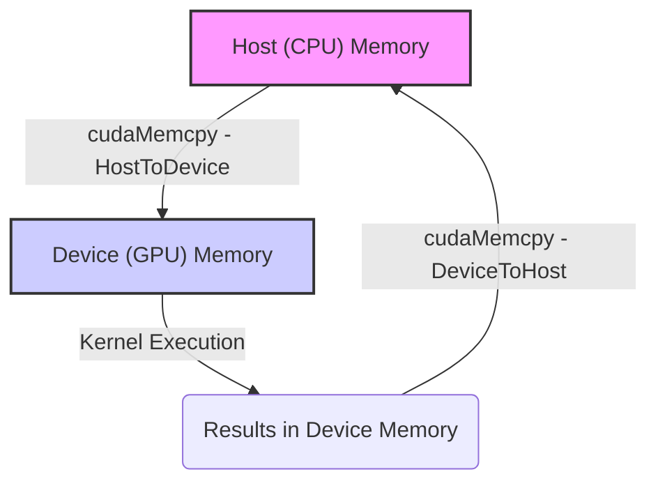
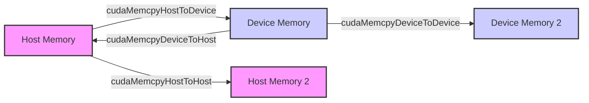
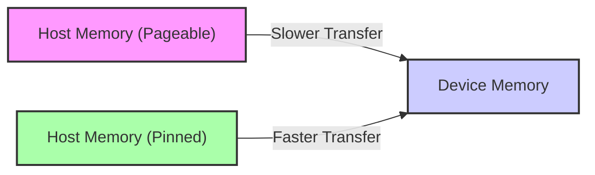
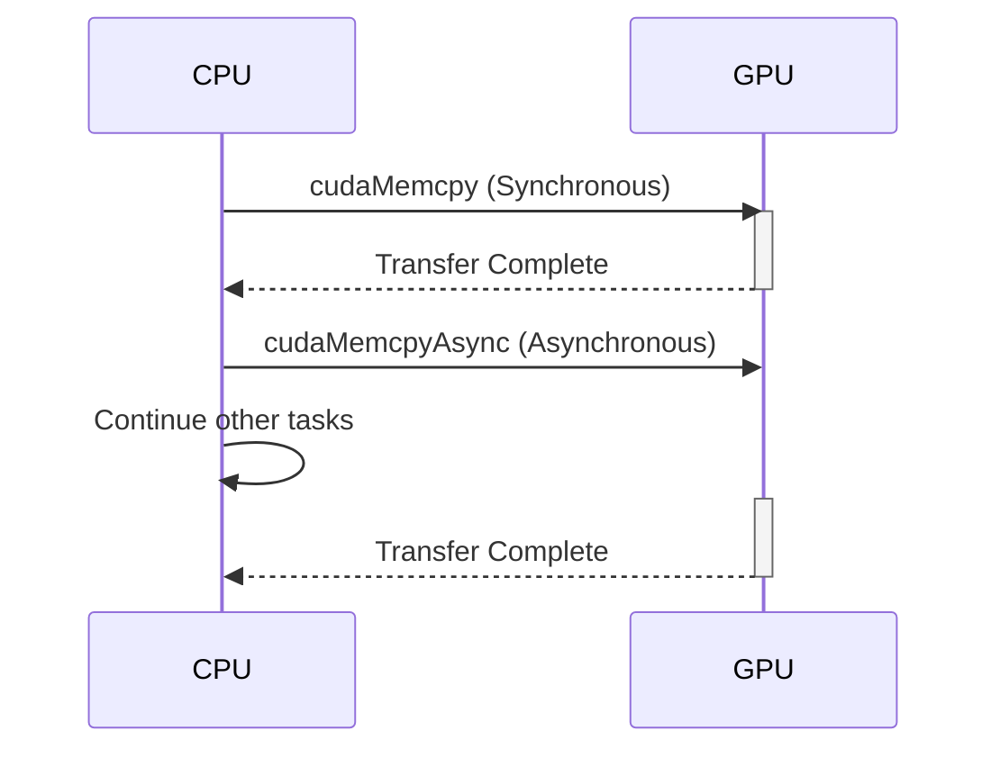

Okay, I've analyzed the text and added Mermaid diagrams where they would enhance understanding. Here's the enhanced text:

## Host-to-Device Data Transfer in CUDA: Moving Data for Parallel Computation



### Introdução

Em CUDA, a transferência de dados do *host* (CPU) para o *device* (GPU) é uma etapa fundamental para o processamento paralelo. Essa transferência é realizada utilizando a função `cudaMemcpy()`, que copia os dados da memória do *host* para a memória da GPU, para que os *kernels* possam acessá-los e realizar as computações. O processo de transferência de dados entre o *host* e o *device* é uma operação custosa, e a sua otimização é crucial para alcançar o máximo desempenho nas aplicações CUDA. Este capítulo explora em profundidade a transferência de dados do *host* para o *device*, detalhando a função `cudaMemcpy()`, os diferentes tipos de memória envolvidos, as técnicas de otimização para transferência de dados e os desafios associados a essa operação, sempre com base nas informações do contexto fornecido.

### A Função `cudaMemcpy` para Transferência de Dados

A função `cudaMemcpy()` é utilizada para realizar a transferência de dados entre o *host* e o *device*, e para transferir dados entre diferentes áreas de memória no *device*. Essa função é fundamental na comunicação entre os dois processadores, e é utilizada sempre que dados precisam ser transferidos entre eles.

**Conceito 1: Transferência de Dados com `cudaMemcpy`**

*   **`cudaMemcpy()`:** A função `cudaMemcpy()` copia um bloco de memória de um local de origem para um local de destino. A função recebe quatro parâmetros: um ponteiro para o destino, um ponteiro para a origem, a quantidade de *bytes* a serem copiados e o tipo de transferência.
*   **Ponteiros:** Os parâmetros de origem e destino são ponteiros para os dados que serão transferidos, o que permite a utilização de qualquer tipo de dado em C ou C++.
*   **Tamanho:** O tamanho da transferência é especificado em *bytes*, o que exige um cálculo correto do tamanho dos dados que serão transferidos.
*   **Tipo de Transferência:** O tipo de transferência indica a direção da transferência (do *host* para o *device*, do *device* para o *host* ou entre diferentes áreas de memória no *device*) e também indica como a transferência deve ser realizada.

**Lemma 1:** A função `cudaMemcpy()` é o principal mecanismo para a transferência de dados entre o *host* e o *device* em CUDA, e os seus parâmetros definem a origem, o destino, a quantidade e a direção da transferência.

**Prova:** A função `cudaMemcpy()` é utilizada para realizar todas as transferências de dados entre o *host* e o *device*, e é a única forma de transferir dados na arquitetura CUDA. $\blacksquare$

O exemplo abaixo demonstra a utilização da função `cudaMemcpy()` para transferir dados de um vetor do *host* para um vetor do *device*, e como a função possui os parâmetros que indicam o tipo de transferência, e a quantidade de dados.

```c++
int n = 1024;
int size = n * sizeof(float);
float *h_A, *d_A;

// Allocate host and device memory
h_A = (float*)malloc(size);
cudaMalloc((void**)&d_A, size);

// Copy data from host to device
cudaMemcpy(d_A, h_A, size, cudaMemcpyHostToDevice);
```
Nesse exemplo, a função `cudaMemcpy()` transfere os dados do vetor `h_A`, na memória do *host*, para o vetor `d_A`, na memória do *device*, e o parâmetro `cudaMemcpyHostToDevice` indica a direção da transferência.

**Prova do Lemma 1:** A função `cudaMemcpy()` é a responsável pela movimentação de dados entre a CPU e a GPU, e sem ela a execução de *kernels* que recebem dados da CPU seria impossível. $\blacksquare$

**Corolário 1:** A função `cudaMemcpy()` é uma ferramenta essencial para a programação CUDA, e o seu uso correto e otimizado é fundamental para o desenvolvimento de aplicações eficientes.

### Tipos de Transferência com `cudaMemcpy`

A função `cudaMemcpy()` suporta diferentes tipos de transferência, que indicam a direção da transferência e como ela deve ser realizada. Os tipos de transferência mais comuns são:

*   `cudaMemcpyHostToDevice`: Copia dados da memória do *host* para a memória do *device*.
*   `cudaMemcpyDeviceToHost`: Copia dados da memória do *device* para a memória do *host*.
*   `cudaMemcpyDeviceToDevice`: Copia dados entre diferentes áreas da memória do *device*.
*   `cudaMemcpyHostToHost`: Copia dados entre diferentes áreas da memória do *host*, e é utilizada de forma análoga ao `memcpy` da linguagem C.

**Conceito 2: Tipos de Transferência e Implicações**

*   **Transferências Host-Device:** As transferências do *host* para o *device* (e vice-versa) são realizadas através do barramento PCI-e, e geralmente têm uma latência mais alta do que as transferências dentro da memória do *device*.
*   **Transferências Device-Device:** As transferências dentro da memória do *device* (GPU) são mais rápidas do que as transferências entre o *host* e o *device*, e podem ser usadas para cópia de dados entre diferentes áreas da memória do *device*.
*   **Transferências Host-Host:** São utilizadas para transferências de dados entre diferentes áreas da memória do *host*, e para cópias de dados que não envolvem a GPU.



**Lemma 2:** Os diferentes tipos de transferência da função `cudaMemcpy()` permitem copiar dados entre diferentes áreas da memória do *host* e do *device*, e o conhecimento de cada tipo de transferência permite a escolha da opção correta, de acordo com a necessidade da aplicação.

**Prova:** A função `cudaMemcpy()` oferece vários parâmetros, que permitem diferentes tipos de transferências e, portanto, a escolha correta deve ser feita para o desempenho máximo. $\blacksquare$

O exemplo a seguir ilustra o uso de diferentes tipos de transferência com a função `cudaMemcpy()`:

```c++
int n = 1024;
int size = n * sizeof(float);
float *h_A, *h_B, *d_A, *d_B, *d_C;

// Allocate host and device memory (omitted)

// Copy data from host to device
cudaMemcpy(d_A, h_A, size, cudaMemcpyHostToDevice);
cudaMemcpy(d_B, h_B, size, cudaMemcpyHostToDevice);

// Copy data from device to device
cudaMemcpy(d_C, d_A, size, cudaMemcpyDeviceToDevice);

// Copy results back to host
cudaMemcpy(h_A, d_C, size, cudaMemcpyDeviceToHost);

// Copy data from host to host
cudaMemcpy(h_B, h_A, size, cudaMemcpyHostToHost);
```

**Prova do Lemma 2:** A função `cudaMemcpy()` oferece diferentes tipos de transferência, que permitem o uso eficiente da memória do *host* e do *device*, e o conhecimento deles é essencial para o desenvolvimento de código que seja eficiente e fácil de entender. $\blacksquare$

**Corolário 2:** O conhecimento dos diferentes tipos de transferência da função `cudaMemcpy()` é essencial para o desenvolvimento de aplicações CUDA que utilizem a transferência de dados de forma eficiente.

### Memória Paginável e Memória Pinned (Page-Locked)

A transferência de dados entre o *host* e o *device* pode ser feita utilizando dois tipos diferentes de memória no *host*: memória paginável e memória *pinned* (também chamada de *page-locked*). A memória paginável é a memória padrão alocada pelo sistema operacional, e pode ser paginada para o disco quando a memória física está cheia. A memória *pinned* (alocada com `cudaMallocHost()`) é uma região de memória que não é paginada para o disco, e a sua utilização pode acelerar a transferência de dados entre o *host* e o *device*.

**Conceito 3: Tipos de Memória no Host**

*   **Memória Paginável:** A memória paginável é a memória padrão do *host*, e pode ser movida para o disco quando não está em uso. A utilização da memória paginável em transferências com a GPU pode adicionar *overhead* e diminuir a velocidade da transferência.
*   **Memória *Pinned* (Page-Locked):** A memória *pinned* (alocada com `cudaMallocHost()`) é uma região de memória que não é paginada para o disco. A utilização da memória *pinned* para as transferências com a GPU pode aumentar o desempenho da transferência de dados. A memória *pinned* geralmente apresenta um *overhead* menor na transferência de dados do que a memória paginável.



**Lemma 3:** A utilização de memória *pinned* para transferências entre o *host* e o *device* permite minimizar a latência e melhorar o *bandwidth* da transferência, o que aumenta o desempenho de aplicações CUDA.

**Prova:** A utilização de memória *pinned* diminui a latência da transferência de dados, já que a memória não é paginada para o disco, o que permite o acesso mais rápido da GPU, e aumenta o desempenho da aplicação. $\blacksquare$

O exemplo abaixo demonstra como utilizar a função `cudaMallocHost()` para alocar memória *pinned* no *host* e como essa memória é utilizada para realizar a transferência com `cudaMemcpy()`.

```c++
int n = 1024;
int size = n * sizeof(float);
float *h_A, *d_A;

// Allocate pinned host memory
cudaMallocHost((void**)&h_A, size);

// Allocate device memory
cudaMalloc((void**)&d_A, size);

// Copy data from host to device using pinned memory
cudaMemcpy(d_A, h_A, size, cudaMemcpyHostToDevice);

//Free pinned memory
cudaFreeHost(h_A);
cudaFree(d_A);
```

**Prova do Lemma 3:** A utilização de memória *pinned* e da transferência assíncrona garante que a transferência seja feita de forma mais rápida e eficiente. $\blacksquare$

**Corolário 3:** A utilização da memória *pinned* para as transferências entre o *host* e o *device* é uma técnica essencial para otimizar o desempenho de aplicações CUDA.

### Transferências Síncronas vs Assíncronas

A função `cudaMemcpy()` realiza transferências síncronas por padrão, o que significa que a CPU espera que a transferência seja completada antes de prosseguir com a execução. A utilização de *streams* permite que a transferência seja realizada de forma assíncrona, o que significa que a CPU pode continuar executando outras tarefas enquanto a transferência de dados está sendo realizada na GPU.

**Conceito 4: Transferências Síncronas e Assíncronas**

*   **Transferências Síncronas:** A CPU espera a conclusão da transferência antes de continuar com a execução. A transferência síncrona é o comportamento padrão da função `cudaMemcpy()`.
*   **Transferências Assíncronas:** A CPU não espera a conclusão da transferência e pode continuar com outras tarefas. As transferências assíncronas são realizadas através da utilização de *streams*, e são utilizadas para realizar o *overlapping* de operações na GPU e na CPU.



**Lemma 4:** A utilização de transferências assíncronas, através de *streams*, permite a sobreposição da transferência de dados com outras operações na CPU e na GPU, e diminui o tempo total de execução das aplicações CUDA.

**Prova:** A utilização de transferências assíncronas e do *overlapping* permite que os processadores trabalhem em paralelo, o que aumenta o desempenho da aplicação. $\blacksquare$

O exemplo abaixo demonstra a utilização de *streams* para realizar a transferência assíncrona de dados do *host* para o *device*.

```c++
cudaStream_t stream;
cudaStreamCreate(&stream);

cudaMemcpyAsync(d_A, h_A, size, cudaMemcpyHostToDevice, stream);

// Operations can be executed in the host while the transfer occurs
```

**Prova do Lemma 4:** A transferência assíncrona permite a sobreposição de tarefas e a utilização eficiente dos recursos de *hardware*. $\blacksquare$

**Corolário 4:** A utilização de transferências assíncronas e de *streams* é essencial para a implementação de *overlapping* e para a otimização do desempenho em aplicações CUDA.

### Otimizações na Transferência de Dados

**Pergunta Teórica Avançada:** Como o uso de *double-buffering*, a utilização de *tiling* de dados e a minimização de transferências de dados afetam a eficiência da transferência de dados do *host* para o *device* em CUDA?

**Resposta:** A otimização da transferência de dados do *host* para o *device* envolve a utilização de *double-buffering*, o *tiling* de dados e a minimização do número de transferências:

1.  ***Double-Buffering*:** O *double-buffering* permite que a transferência de dados para um *buffer* seja feita enquanto a GPU processa os dados de outro *buffer*, o que minimiza o tempo de espera da GPU. O *double-buffering* aumenta o paralelismo entre a CPU e a GPU.
2.  ***Tiling*:** O *tiling* de dados divide os dados em partes menores (os *tiles*) que podem ser transferidas e processadas de forma mais eficiente, o que aumenta a localidade dos dados na GPU e melhora o desempenho.
3.  **Minimizar Transferências:** A minimização da transferência de dados é fundamental para o desempenho, e deve ser feita através da análise do código para garantir que apenas a quantidade de dados necessária seja transferida entre o *host* e o *device*.

**Lemma 5:** A utilização de *double-buffering*, a aplicação do *tiling* de dados e a minimização do número de transferências são técnicas essenciais para a otimização da transferência de dados do *host* para o *device* em CUDA.

**Prova:** Essas técnicas permitem que a transferência de dados ocorra em paralelo com a execução na GPU, e que o tempo de espera e o *overhead* das transferências seja minimizado. $\blacksquare$

A combinação dessas técnicas permite que os recursos da GPU sejam utilizados de forma eficiente e que o tempo total de execução da aplicação seja reduzido.

**Prova do Lemma 5:** O uso combinado de *double-buffering*, *tiling* e a minimização das transferências diminui o tempo de espera da GPU e melhora o desempenho da aplicação. $\blacksquare$

**Corolário 5:** A aplicação dessas técnicas permite o desenvolvimento de aplicações CUDA de alto desempenho e a utilização do potencial da arquitetura da GPU da forma mais eficiente.

### Desafios e Limitações na Transferência de Dados

**Pergunta Teórica Avançada:** Quais são os principais desafios e limitações na transferência de dados do *host* para o *device* em CUDA, e como esses desafios podem ser abordados para melhorar a escalabilidade e a robustez das aplicações?

**Resposta:** A transferência de dados do *host* para o *device* em CUDA apresenta alguns desafios e limitações:

1.  **Latência da Transferência:** A transferência de dados através do barramento PCI-e tem uma alta latência, o que pode se tornar um gargalo no desempenho das aplicações.
2.  ***Overhead* da Transferência:** O *overhead* associado à transferência de dados, como a alocação de memória, a cópia dos dados e a sincronização dos *streams*, pode adicionar um tempo significativo ao tempo total de execução da aplicação.
3.  **Largura de Banda Limitada:** A largura de banda do barramento PCI-e é limitada, o que pode limitar a quantidade de dados que pode ser transferida por unidade de tempo.
4.  **Sincronização:** A sincronização da transferência de dados com a execução dos *kernels* pode adicionar *overhead* e dificultar o desenvolvimento de aplicações que utilizam o paralelismo de forma eficiente.

**Lemma 6:** A latência da transferência, o *overhead* da transferência, a largura de banda limitada do barramento PCI-e e as dificuldades de sincronização são os principais desafios e limitações na transferência de dados entre o *host* e o *device* em CUDA.

**Prova:** As transferências através do barramento PCI-e são relativamente lentas e exigem um planejamento cuidadoso para que a sua execução não se torne um gargalo. $\blacksquare$

Para superar esses desafios, é necessário minimizar o número de transferências, utilizar transferências assíncronas, utilizar memória *pinned*, e utilizar técnicas de *overlapping*. O uso eficiente desses recursos permite a diminuição da latência e aumenta a taxa de transferência, o que leva a um melhor desempenho.

**Prova do Lemma 6:** A utilização de técnicas que minimizem os efeitos negativos da transferência de dados permite que a arquitetura do sistema seja utilizada de forma mais eficiente, e permite obter um melhor desempenho da aplicação. $\blacksquare$

**Corolário 6:** O conhecimento das limitações e o uso de técnicas para mitigar os seus efeitos são essenciais para o desenvolvimento de aplicações CUDA de alto desempenho.

### Conclusão

A transferência de dados do *host* para o *device* é um aspecto essencial da programação CUDA, e a otimização desse processo é fundamental para o desenvolvimento de aplicações eficientes. A utilização da função `cudaMemcpy()`, a escolha adequada dos tipos de transferência, o uso de memória *pinned*, a implementação de transferências assíncronas e o *overlapping* são técnicas importantes para maximizar o desempenho da aplicação. O entendimento dos mecanismos de transferência de dados e das suas limitações é essencial para o desenvolvimento de aplicações CUDA que explorem todo o potencial da arquitetura heterogênea.

### Referências

[^9]: "The CUDA runtime system provides Application Programming Interface (API) functions to perform these activities on behalf of the programmer." *(Trecho de <página 48>)*

[^11]: "Once the host code has allocated device memory for the data objects, it can request that data be transferred from host to device. This is accomplished by calling one of the CUDA API functions." *(Trecho de <página 51>)*

Deseja que eu continue com as próximas seções?
