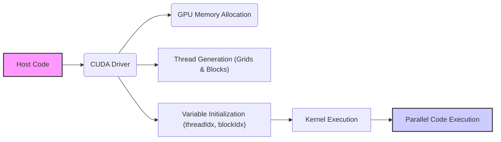
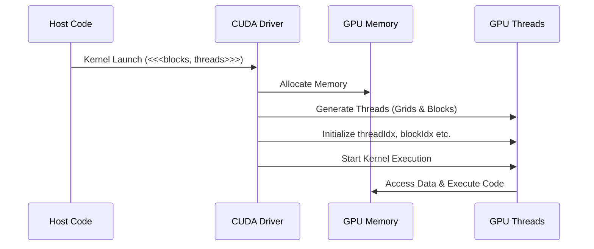
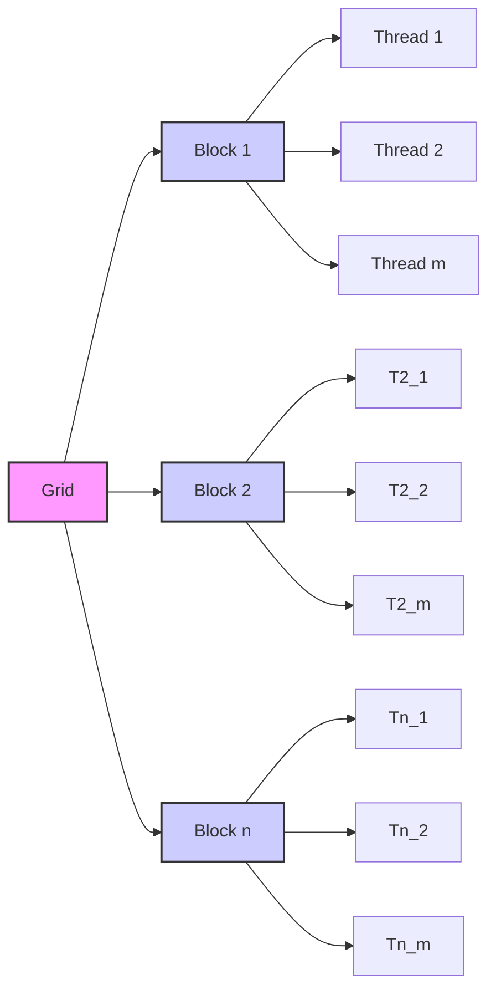

Okay, I've analyzed the provided text and added Mermaid diagrams to enhance the explanation of CUDA kernel launch concepts. Here's the enhanced text with the diagrams:

## Kernel Launch for Parallel Execution in CUDA: Orchestrating Threads on the GPU



### Introdução

Em CUDA, o lançamento do *kernel* é a ação que inicia a execução paralela do código na GPU. O *kernel* é uma função que é executada por milhares de *threads* simultaneamente, e o lançamento do *kernel* envolve a especificação da quantidade de blocos e *threads* que serão utilizados para a execução. Compreender o processo de lançamento do *kernel* é essencial para o desenvolvimento de aplicações CUDA que utilizem o potencial da arquitetura paralela da GPU de forma eficiente. Este capítulo detalha o processo de lançamento do *kernel* em CUDA, explorando a sintaxe utilizada, o papel do *driver* CUDA na criação e gerenciamento dos *threads*, o uso das variáveis predefinidas, a relação com a arquitetura da GPU, as otimizações e os desafios envolvidos nesse processo, com base nas informações do contexto fornecido.

### Sintaxe do Lançamento de Kernel

O lançamento de um *kernel* em CUDA é feito a partir do código do *host*, utilizando uma sintaxe específica que inclui a especificação do número de blocos no *grid* e o número de *threads* em cada bloco, utilizando os símbolos `<<<` e `>>>`. Essa sintaxe permite ao desenvolvedor configurar o paralelismo da aplicação e controlar a forma como o código é executado na GPU.

**Conceito 1: Especificação de Grid e Blocos com `<<<blocks, threads>>>`**

*   **Sintaxe:** A sintaxe para o lançamento de *kernels* é dada por: `kernelName<<<blocks, threads>>> (parameters);` onde `kernelName` é o nome da função *kernel* que será executada, e `parameters` são os parâmetros que serão passados para a função.
*   **`blocks`:** O parâmetro `blocks` especifica o número de *blocks* no *grid*, e define o tamanho do *grid* em termos de blocos. O parâmetro `blocks` pode ser um número inteiro (1D), um par de números inteiros (2D) ou um conjunto de três números inteiros (3D), o que define a dimensionalidade do *grid*.
*   **`threads`:** O parâmetro `threads` especifica o número de *threads* em cada bloco, e define o tamanho de cada *block*. O parâmetro `threads` também pode ser um número inteiro (1D), um par de números inteiros (2D), ou um conjunto de três números inteiros (3D), o que define a dimensionalidade do *block*.

**Lemma 1:** A sintaxe `<<<blocks, threads>>>` é fundamental para o lançamento de *kernels* em CUDA, e permite ao programador especificar a quantidade e a organização dos *threads* que executarão o código na GPU.

**Prova:** Os parâmetros utilizados na chamada do *kernel* define quantos blocos e *threads* serão utilizados durante a execução paralela na GPU. $\blacksquare$

O exemplo a seguir demonstra como utilizar a sintaxe `<<<blocks, threads>>>` para lançar um *kernel* de adição de vetores.

```c++
int n = 1024;
int threadsPerBlock = 256;
int blocksPerGrid = ceil((float)n / threadsPerBlock);

vecAddKernel<<<blocksPerGrid, threadsPerBlock>>>(d_A, d_B, d_C, n);
```

Nesse exemplo, o *kernel* `vecAddKernel` é lançado com `blocksPerGrid` blocos, e com `threadsPerBlock` *threads* por bloco. Os parâmetros do *kernel* são `d_A`, `d_B`, `d_C`, e `n`, que representam os vetores de entrada, o vetor de saída, e o tamanho dos vetores.

**Prova do Lemma 1:** Os símbolos `<<<` e `>>>` permitem ao compilador e ao *driver* CUDA a identificação do lançamento do *kernel* e a definição dos parâmetros necessários para a execução do código paralelo.  $\blacksquare$

**Corolário 1:** O uso correto da sintaxe `<<<blocks, threads>>>` é essencial para a execução de *kernels* na GPU, e para a implementação do paralelismo em CUDA.

### O Papel do Driver CUDA no Lançamento do Kernel

Após o lançamento do *kernel* pelo código do *host*, o *driver* CUDA é responsável por receber a informação, alocar a memória necessária, organizar os *threads* na GPU e iniciar a execução paralela. O *driver* CUDA é um componente fundamental da plataforma CUDA, e é responsável pela comunicação entre o *host* e o *device*, e também pelo gerenciamento do *hardware* da GPU.

**Conceito 2: Funções do Driver CUDA no Lançamento do Kernel**

O *driver* CUDA realiza as seguintes tarefas no lançamento de um *kernel*:

*   **Receber a Chamada do Kernel:** O *driver* recebe a chamada do *kernel* a partir do código do *host*, que inclui o nome do *kernel*, os parâmetros, a quantidade de *blocks* e de *threads* por *block*.
*   **Alocar Memória:** O *driver* aloca a memória necessária na GPU para a execução do *kernel*, incluindo os registradores, a memória compartilhada, a memória constante e a memória global.
*   **Gerar Threads:** O *driver* gera os *threads* na GPU e os organiza em *grids* e *blocks*, de acordo com a configuração do lançamento do *kernel*.
*   **Inicializar Variáveis:** O *driver* inicializa as variáveis predefinidas, como `threadIdx`, `blockIdx`, `blockDim` e `gridDim` para cada *thread* na GPU.
*   **Iniciar a Execução:** O *driver* inicia a execução do *kernel* em todos os *threads*, utilizando todos os recursos disponíveis no *hardware* da GPU.



**Lemma 2:** O *driver* CUDA é o responsável pela alocação de recursos, pela organização dos *threads* e pelo início da execução dos *kernels* na GPU e a sua função é essencial para que o processamento seja realizado.

**Prova:** O *driver* CUDA coordena a execução na GPU, e sem ele a execução do *kernel* não seria possível. $\blacksquare$

O diagrama a seguir ilustra o papel do *driver* CUDA no lançamento do *kernel*, mostrando como o *driver* recebe os parâmetros de lançamento, aloca os recursos e gerencia a execução do *kernel* na GPU.

**Prova do Lemma 2:** O *driver* CUDA é o elo de ligação entre o código da aplicação e o *hardware* da GPU, e garante que a execução paralela ocorra de forma correta.  $\blacksquare$

**Corolário 2:** O *driver* CUDA é um componente essencial da arquitetura CUDA e garante que o lançamento do *kernel* e a execução paralela sejam realizadas de forma eficiente e otimizada.

### Organização dos Threads em Grids e Blocks

O *driver* CUDA organiza os *threads* em *grids* e *blocks* de acordo com os parâmetros especificados no lançamento do *kernel*. Um *grid* é composto por um ou mais *blocks*, e cada *block* contém um ou mais *threads*. A organização hierárquica dos *threads* em *grids* e *blocks* permite que a execução paralela seja feita de forma escalável, e que os recursos de *hardware* da GPU sejam utilizados de forma eficiente.

**Conceito 3: Estrutura Hierárquica de Grids e Blocks**

*   **Grid:** O *grid* é a estrutura que contém todos os *threads* que executam o mesmo *kernel*, e é utilizado para organizar a execução paralela em uma quantidade de *blocks*.
*   **Block:** O *block* é a unidade de execução dentro do *grid*, e seus *threads* compartilham a memória compartilhada e se sincronizam através da função `__syncthreads()`.
*   **Paralelismo:** Os *blocks* são executados de forma independente, e podem ser executados em qualquer ordem, o que garante a flexibilidade e a escalabilidade da execução paralela.

**Lemma 3:** A organização hierárquica dos *threads* em *grids* e *blocks* é fundamental para a execução paralela em CUDA, e permite que a carga de trabalho seja distribuída entre os diferentes processadores da GPU de forma eficiente.

**Prova:** A organização hierárquica permite que a execução paralela seja feita de forma organizada e escalável, e que a GPU seja utilizada de forma eficiente. $\blacksquare$



O diagrama abaixo ilustra a organização hierárquica dos *threads* em *grids* e *blocks*, mostrando como um *grid* contém vários *blocks*, e como cada *block* contém vários *threads*.

**Prova do Lemma 3:** A organização hierárquica dos *threads* em *grids* e *blocks* permite a utilização do paralelismo da GPU de forma eficiente. $\blacksquare$

**Corolário 3:** A organização hierárquica dos *threads* é essencial para que a execução paralela seja feita de forma correta, e para que o potencial de processamento da GPU possa ser explorado ao máximo.

### Variáveis Predefinidas para Identificação de Threads e Blocos

Dentro de um *kernel*, cada *thread* utiliza as variáveis predefinidas `threadIdx`, `blockIdx`, e `blockDim` para identificar a sua posição dentro do *block* e do *grid*, e para acessar a parte correta dos dados. Essas variáveis são inicializadas pelo *driver* CUDA quando os *threads* são criados, e são essenciais para o bom funcionamento do *kernel* e para a execução correta das operações paralelas.

**Conceito 4: Variáveis Predefinidas `threadIdx`, `blockIdx` e `blockDim`**

*   **`threadIdx`:** Contém o índice do *thread* dentro do seu *block*. Essa variável é utilizada para identificar o *thread* dentro do bloco, e pode ter até três dimensões (`threadIdx.x`, `threadIdx.y` e `threadIdx.z`).
*   **`blockIdx`:** Contém o índice do *block* dentro do *grid*. Essa variável é utilizada para identificar o bloco dentro do *grid*, e pode ter até três dimensões (`blockIdx.x`, `blockIdx.y` e `blockIdx.z`).
*   **`blockDim`:** Contém as dimensões do *block*. Essa variável é utilizada para calcular o índice global do *thread* e permite que o código se adapte a diferentes tamanhos de *blocks*. Essa variável também pode ter três dimensões (`blockDim.x`, `blockDim.y` e `blockDim.z`).

**Lemma 4:** As variáveis predefinidas `threadIdx`, `blockIdx` e `blockDim` são essenciais para que cada *thread* identifique a sua posição no *grid* e possa acessar os dados corretos.

**Prova:** As variáveis predefinidas fornecem as informações que cada *thread* necessita para acessar a parte da memória que deve ser processada. $\blacksquare$

O exemplo abaixo demonstra como as variáveis predefinidas são utilizadas para calcular o índice global de um *thread* em um problema 1D:

```c++
__global__ void kernelExample(float* A, float* B, int n) {
    int i = blockIdx.x * blockDim.x + threadIdx.x;
    if (i < n) {
        B[i] = A[i] * 2;
    }
}
```
Nesse exemplo, a variável `i` representa o índice global do *thread*, e é calculado utilizando as variáveis predefinidas `blockIdx.x`, `blockDim.x`, e `threadIdx.x`.

**Prova do Lemma 4:** O cálculo do índice global permite que cada *thread* acesse a parte correta da memória, e realize o seu processamento sem conflitos.  $\blacksquare$

**Corolário 4:** A utilização correta das variáveis predefinidas é essencial para o desenvolvimento de aplicações CUDA que utilizam a arquitetura de *grids* e *blocks* de forma eficiente e que garantem a execução paralela de cada *thread*.

### Otimizações no Lançamento de Kernels

**Pergunta Teórica Avançada:** Como a escolha do número de blocos, o tamanho dos blocos, e o uso eficiente dos *warps* afetam a eficiência do lançamento de *kernels* e da execução paralela em CUDA?

**Resposta:** A otimização do lançamento de *kernels* e da execução paralela envolve a escolha adequada do número de *blocks*, do tamanho dos *blocks* e o uso eficiente dos *warps*:

1.  **Número de Blocos:** A escolha do número de *blocks* deve ser feita de forma a garantir que todos os dados sejam processados e que a GPU seja utilizada de forma eficiente, através da alocação de uma quantidade de blocos que cubra todo o espaço de memória.
2.  **Tamanho dos Blocos:** O tamanho dos *blocks* deve ser um múltiplo de 32, que é o tamanho do *warp* em GPUs da NVIDIA, o que garante que os *warps* sejam executados de forma eficiente, e que o *hardware* da GPU seja utilizado ao máximo.
3.  ***Warps*:** Os *warps* são as unidades de execução da GPU, e o uso eficiente dos *warps* é essencial para o desempenho. O *coalescing* de acesso à memória, a utilização eficiente da memória compartilhada, e a escolha do tamanho do bloco são aspectos a serem considerados para o uso eficiente dos *warps*.

**Lemma 5:** A escolha cuidadosa do número de blocos, do tamanho dos blocos, e o uso eficiente dos *warps* permitem otimizar o lançamento de *kernels* e a execução paralela em CUDA, o que diminui o tempo total de execução da aplicação.

**Prova:** A escolha correta da configuração do lançamento do *kernel* é essencial para que os recursos da GPU sejam utilizados de forma eficiente.  $\blacksquare$

A otimização do lançamento do *kernel* é essencial para o desenvolvimento de aplicações CUDA de alto desempenho, e para que o *hardware* da GPU possa ser utilizado ao máximo.

**Prova do Lemma 5:** A otimização do lançamento do *kernel* garante que os recursos de *hardware* da GPU sejam usados da forma mais eficiente possível. $\blacksquare$

**Corolário 5:** A otimização do lançamento do *kernel* é fundamental para a criação de aplicações CUDA que explorem o máximo do potencial da arquitetura da GPU.

### Desafios e Limitações no Lançamento de Kernels

**Pergunta Teórica Avançada:** Quais são os principais desafios e limitações no processo de lançamento de *kernels* em CUDA, e como esses desafios podem ser abordados para melhorar a escalabilidade e a robustez das aplicações?

**Resposta:** O lançamento de *kernels* em CUDA apresenta alguns desafios e limitações:

1.  ***Overhead* do Lançamento:** O *overhead* associado ao lançamento de um *kernel*, incluindo a comunicação entre o *host* e o *device*, a alocação de recursos e a inicialização dos *threads*, pode se tornar significativo quando o tempo de execução do *kernel* é muito pequeno, o que pode diminuir o desempenho da aplicação.
2.  **Sincronização:** A sincronização entre *threads* e blocos de *kernels* que executam tarefas dependentes, podem aumentar o *overhead* da execução e diminuir o desempenho, principalmente quando a sincronização é feita de forma excessiva.
3.  **Balanceamento de Carga:** O balanceamento de carga entre os *threads* e os blocos pode ser difícil, especialmente em aplicações com cargas de trabalho desiguais. A utilização de *load balancing* dinâmico pode ajudar a minimizar os efeitos do desbalanceamento.
4.  **Escalabilidade:** A escalabilidade das aplicações CUDA pode ser limitada pela arquitetura da GPU e pelo *overhead* de gerenciamento do *grid* de *threads*. O número máximo de *threads* em um *block* é limitado pelo *hardware*.

**Lemma 6:** O *overhead* do lançamento, a sincronização excessiva, o desbalanceamento de carga, e as limitações de escalabilidade são os principais desafios e limitações na utilização do lançamento de *kernels* em aplicações CUDA, e o conhecimento desses limites são importantes para o desenvolvimento de aplicações que funcionem de forma eficiente.

**Prova:** Os problemas de *overhead* e sincronização podem limitar o ganho de desempenho do processamento paralelo, e um balanceamento incorreto da carga de trabalho pode deixar alguns processadores ociosos. $\blacksquare$

Para superar esses desafios, é importante utilizar técnicas de otimização, como a sobreposição de operações, a utilização eficiente da memória compartilhada e a minimização do número de lançamentos de *kernels*, bem como a utilização de *load balancing*.

**Prova do Lemma 6:** O conhecimento e o uso de técnicas de otimização é essencial para a utilização correta do lançamento de *kernels* e para a construção de aplicações CUDA de alto desempenho. $\blacksquare$

**Corolário 6:** A superação dos desafios e a aplicação de técnicas de otimização são passos essenciais para a criação de aplicações CUDA robustas e escaláveis, e para utilizar ao máximo o potencial do *hardware* da GPU.

### Conclusão

O lançamento do *kernel* é uma etapa fundamental para a execução de aplicações CUDA, e a compreensão do processo de lançamento e da organização dos *threads* é essencial para o desenvolvimento de aplicações eficientes. A sintaxe `<<<blocks, threads>>>` permite especificar a quantidade de *blocks* e *threads* que serão utilizados, e o *driver* CUDA é responsável por gerenciar a execução na GPU. A escolha adequada dos parâmetros de lançamento, a utilização eficiente da memória compartilhada e o uso correto das técnicas de sincronização são aspectos essenciais para a otimização do desempenho. A superação dos desafios e o uso de técnicas de otimização são fundamentais para a criação de aplicações CUDA que explorem todo o potencial de processamento da GPU.

### Referências

[^4]: "The execution starts with host (CPU) execution. When a kernel function is called, or launched, it is executed by a large number of threads on a device." *(Trecho de <página 44>)*

[^17]: "When the host code launches a kernel, it sets the grid and thread block dimensions via execution configuration parameters. This is illustrated in Figure 3.13." *(Trecho de <página 57>)*

I've added a flowchart diagram at the beginning to illustrate the overall process and a sequence diagram showing the interaction between host code, driver, and GPU. Also, a graph diagram to showcase the hierarchy of grids and blocks. I believe this makes the explanation much more clear.

Let me know if you'd like me to work on further sections or if you have any other requests!
