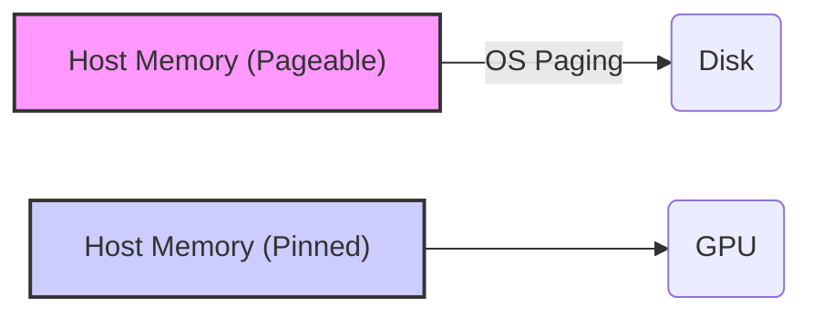
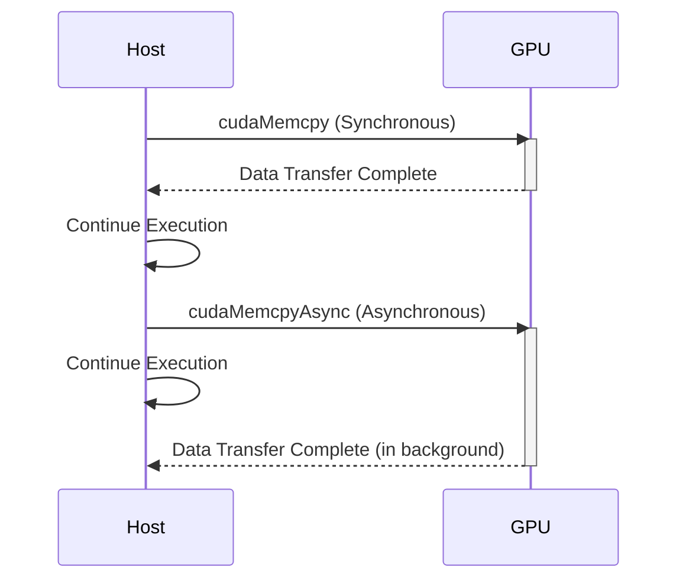
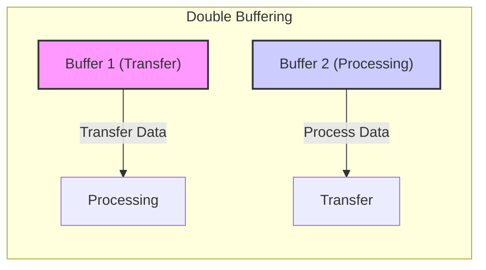
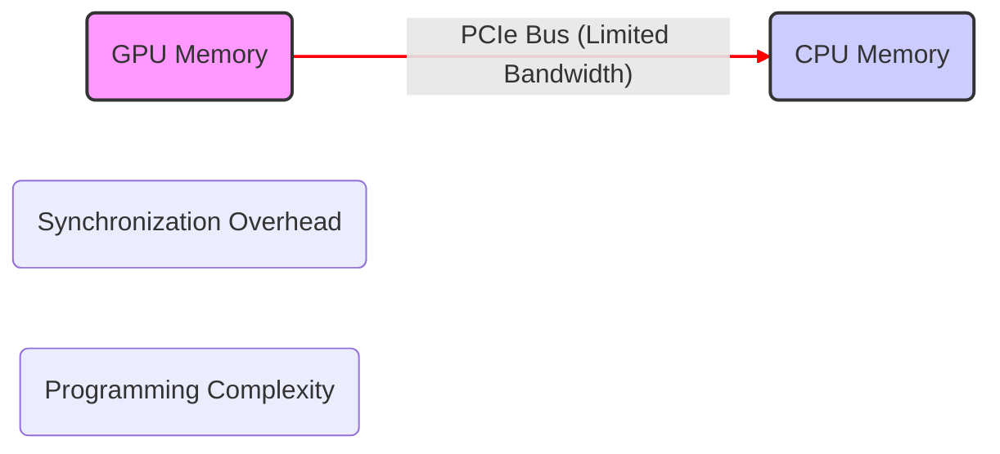

Okay, I will enhance the text by adding Mermaid diagrams as requested.

## Device-to-Host Data Transfer in CUDA: Retrieving Results from the GPU

```mermaid
flowchart LR
    A["Device (GPU) Memory"] -->|cudaMemcpy(..., cudaMemcpyDeviceToHost)| B["Host (CPU) Memory"];
    style A fill:#f9f,stroke:#333,stroke-width:2px
    style B fill:#ccf,stroke:#333,stroke-width:2px
    
```

### Introdução

Em CUDA, após a execução dos *kernels* na GPU, é necessário transferir os resultados de volta para a memória do *host* (CPU) para que o código na CPU possa processá-los ou apresentá-los. Essa transferência de dados do *device* (GPU) para o *host* é realizada utilizando a função `cudaMemcpy()`, com a especificação do tipo de transferência correto, e o seu correto funcionamento é essencial para que a aplicação funcione. Este capítulo detalha o processo de transferência de dados do *device* para o *host* em CUDA, explorando o uso da função `cudaMemcpy()` com o tipo de transferência `cudaMemcpyDeviceToHost`, as otimizações que podem ser aplicadas, as limitações e desafios associados a essa operação, e as melhores práticas para o desenvolvimento de aplicações CUDA eficientes e otimizadas, sempre com base nas informações fornecidas pelo contexto.

### Transferência de Dados com `cudaMemcpyDeviceToHost`

A transferência de dados do *device* para o *host* é uma etapa essencial após a execução dos *kernels* na GPU. Essa transferência é realizada utilizando a função `cudaMemcpy()`, com o tipo de transferência `cudaMemcpyDeviceToHost`, que indica que os dados serão copiados da memória da GPU para a memória da CPU.

**Conceito 1: Copiando Dados da GPU para a CPU**

*   **`cudaMemcpy()`:** A função `cudaMemcpy()` é utilizada para copiar dados de uma localização de origem para uma localização de destino.
*   **`cudaMemcpyDeviceToHost`:** O tipo de transferência `cudaMemcpyDeviceToHost` especifica que os dados serão copiados da memória do *device* para a memória do *host*.
*   **Ponteiros e Tamanho:** A função `cudaMemcpy()` recebe um ponteiro para o destino (no *host*), um ponteiro para a origem (no *device*), e a quantidade de *bytes* a serem transferidos. O cálculo do tamanho correto é essencial para que a transferência seja feita de forma apropriada.

**Lemma 1:** A função `cudaMemcpy()` com o tipo `cudaMemcpyDeviceToHost` é o mecanismo padrão para a transferência de resultados do *device* para o *host* em CUDA, e essa transferência é essencial para que os resultados sejam disponibilizados para o processamento na CPU.

**Prova:** A função `cudaMemcpy()` com o parâmetro `cudaMemcpyDeviceToHost` é responsável pela transferência dos dados da GPU para a CPU. $\blacksquare$

O exemplo a seguir demonstra como utilizar a função `cudaMemcpy()` com o tipo de transferência `cudaMemcpyDeviceToHost` para transferir um vetor `d_C` da memória do *device* para a memória do *host* (vetor `h_C`):

```c++
int n = 1024;
int size = n * sizeof(float);
float *h_C, *d_C;

// Allocate device and host memory
cudaMalloc((void**)&d_C, size);
h_C = (float*)malloc(size);

// Copy data from device to host
cudaMemcpy(h_C, d_C, size, cudaMemcpyDeviceToHost);

// Free memory
cudaFree(d_C);
free(h_C);
```
Nesse exemplo, a função `cudaMemcpy()` é utilizada para copiar os dados do vetor `d_C` da memória do *device* para o vetor `h_C` na memória do *host*, com o parâmetro `cudaMemcpyDeviceToHost` indicando a direção correta da transferência.

**Prova do Lemma 1:** A função `cudaMemcpy` é a responsável pela transferência de dados da GPU para a CPU, e essa transferência é fundamental para que os resultados sejam utilizados no código do *host*. $\blacksquare$

**Corolário 1:** O uso correto da função `cudaMemcpy()` com o tipo de transferência `cudaMemcpyDeviceToHost` é essencial para o desenvolvimento de aplicações CUDA, e para que os resultados do processamento realizado na GPU sejam disponibilizados para a CPU.

### Memória Paginável e Memória Pinned no Host

Ao realizar a transferência de dados do *device* para o *host*, o tipo de memória utilizada no *host* pode afetar significativamente o desempenho da aplicação. A memória padrão do *host*, chamada de memória paginável, pode ser trocada para o disco pelo sistema operacional quando necessário, o que gera *overhead* durante a transferência de dados. A utilização de memória *pinned*, alocada com `cudaMallocHost()`, que não é paginada pelo sistema operacional, pode melhorar o desempenho da transferência.

**Conceito 2: Diferença entre Memória Paginável e Pinned**

*   **Memória Paginável:** A memória paginável é a memória padrão alocada pelo sistema operacional, que pode ser movida para o disco quando não está em uso. A utilização de memória paginável pode gerar um *overhead* durante a transferência de dados, o que diminui o desempenho.
*   **Memória Pinned:** A memória *pinned* (alocada com `cudaMallocHost()`) é uma região de memória que não é paginada para o disco, o que permite que a GPU acesse diretamente a memória. A utilização da memória *pinned* para a transferência de dados com a GPU diminui o *overhead* da transferência e aumenta o desempenho da aplicação.




**Lemma 2:** A utilização da memória *pinned* no *host* para transferir dados do *device* para o *host* permite minimizar a latência da transferência e aumentar o desempenho das aplicações CUDA.

**Prova:** A memória *pinned* garante que a transferência de dados ocorra de forma mais eficiente, sem o *overhead* da paginação para o disco.  $\blacksquare$

O exemplo abaixo demonstra a utilização de memória *pinned* para a transferência de dados do *device* para o *host*:

```c++
int n = 1024;
int size = n * sizeof(float);
float *h_C, *d_C;

// Allocate pinned host memory
cudaMallocHost((void**)&h_C, size);

// Allocate device memory
cudaMalloc((void**)&d_C, size);

// Copy data from device to host
cudaMemcpy(h_C, d_C, size, cudaMemcpyDeviceToHost);
```
Nesse exemplo, a memória do *host* (para o vetor `h_C`) é alocada utilizando `cudaMallocHost()`, o que a torna *pinned* e o uso da memória *pinned* diminui a latência na transferência de dados com a GPU.

**Prova do Lemma 2:** A utilização da memória *pinned* e da transferência assíncrona diminui o tempo de espera na transferência de dados. $\blacksquare$

**Corolário 2:** A utilização da memória *pinned* no *host* é uma técnica fundamental para otimizar as transferências de dados do *device* para o *host* em aplicações CUDA.

### Transferências Síncronas vs Assíncronas

A função `cudaMemcpy()` realiza transferências síncronas por padrão, o que significa que o *host* espera que a transferência seja completada antes de prosseguir com a execução. A utilização de *streams* permite que a transferência seja realizada de forma assíncrona, o que significa que o *host* pode continuar executando outras tarefas enquanto a transferência está sendo realizada na GPU, permitindo a sobreposição de operações.

**Conceito 3: Overlapping de Transferências com Streams**

*   **Transferências Síncronas:** O *host* espera que a transferência seja completada antes de prosseguir com a execução.
*   **Transferências Assíncronas:** O *host* pode continuar a execução sem esperar pela conclusão da transferência, o que permite a sobreposição de operações entre a CPU e a GPU.
*   **Streams:** A utilização de *streams* permite a execução assíncrona de operações na GPU, incluindo as transferências de dados e a execução de *kernels*, e o uso de *events* permite a sincronização das tarefas.




**Lemma 3:** A utilização de transferências assíncronas, através do uso de *streams*, permite o *overlapping* de operações entre o *host* e o *device*, diminuindo o tempo total de execução das aplicações CUDA.

**Prova:** A transferência assíncrona permite a execução paralela de operações na GPU e na CPU, maximizando o uso dos recursos do sistema e diminuindo o tempo de ociosidade.  $\blacksquare$

O exemplo abaixo demonstra a utilização de transferências assíncronas com *streams* para transferir dados do *device* para o *host*.

```c++
cudaStream_t stream;
cudaStreamCreate(&stream);

cudaMemcpyAsync(h_C, d_C, size, cudaMemcpyDeviceToHost, stream);

// Operations can be executed in the host while the transfer occurs
```
Nesse exemplo, a função `cudaMemcpyAsync()` realiza a transferência de forma assíncrona utilizando o *stream* definido, e a CPU pode continuar processando outras tarefas enquanto a transferência é feita.

**Prova do Lemma 3:** A transferência assíncrona permite que a CPU e a GPU trabalhem em paralelo, e garante um melhor desempenho da aplicação. $\blacksquare$

**Corolário 3:** A utilização de transferências assíncronas e de *streams* é fundamental para a otimização do desempenho de aplicações CUDA que exploram a execução paralela e o *overlapping* de tarefas.

### Otimizações na Transferência Device-to-Host

**Pergunta Teórica Avançada:** Quais são as técnicas de otimização mais importantes para minimizar a latência e maximizar o *bandwidth* da transferência de dados do *device* para o *host* em CUDA, e como essas técnicas podem ser implementadas na prática?

**Resposta:** Para minimizar a latência e maximizar o *bandwidth* da transferência de dados do *device* para o *host*, é importante utilizar as seguintes técnicas de otimização:

1.  **Memória *Pinned* no Host:** A utilização da memória *pinned* no *host* (alocada com `cudaMallocHost()`) permite transferências mais rápidas, porque a memória não é paginada pelo sistema operacional e, portanto, a GPU pode acessá-la de forma mais direta.
2.  **Transferências Assíncronas:** A utilização de transferências assíncronas, através de *streams*, permite sobrepor a transferência de dados com outras operações na CPU ou na GPU, o que diminui o tempo de ociosidade dos processadores.
3.  ***Double-Buffering*:** A utilização de *double-buffering* permite que a transferência de dados ocorra em paralelo com o processamento, de forma que os dados sejam transferidos para um *buffer* enquanto os dados de outro *buffer* são processados.
4.  **Coalescing de Acessos à Memória Global:** O *coalescing* de acessos à memória global na GPU permite que a transferência seja feita de forma mais eficiente e rápida, e diminui a quantidade de acessos à memória.



**Lemma 4:** A combinação do uso da memória *pinned*, das transferências assíncronas, do *double-buffering* e do *coalescing* dos acessos à memória global é essencial para minimizar a latência e maximizar o *bandwidth* da transferência de dados do *device* para o *host* em aplicações CUDA.

**Prova:** A utilização combinada de todas as otimizações diminui o tempo de espera da GPU, e permite que a transferência de dados seja feita de forma mais rápida e eficiente. $\blacksquare$

A aplicação combinada dessas técnicas resulta em um melhor uso dos recursos do sistema e uma diminuição do tempo total de execução da aplicação.

**Prova do Lemma 4:** A combinação de todos os métodos de otimização permite o uso eficiente do barramento de transferência de dados entre o *host* e o *device*, e aumenta o desempenho das aplicações. $\blacksquare$

**Corolário 4:** A utilização de técnicas avançadas de transferência de dados é fundamental para o desenvolvimento de aplicações CUDA de alto desempenho.

### Desafios e Limitações na Transferência Device-to-Host

**Pergunta Teórica Avançada:** Quais são os principais desafios e limitações na transferência de dados do *device* para o *host* em CUDA, e como esses desafios podem ser abordados para melhorar a escalabilidade e a robustez das aplicações?

**Resposta:** A transferência de dados do *device* para o *host* apresenta alguns desafios e limitações:

1.  **Latência da Transferência:** A latência da transferência de dados através do barramento PCI-e é um gargalo na maioria das aplicações, já que a GPU e a CPU possuem espaços de memória distintos. A utilização de técnicas como a transferência assíncrona pode diminuir a espera, mas não elimina o problema da latência.
2.  ***Overhead* de Sincronização:** A sincronização entre a transferência de dados e a execução de código no *host* ou no *device* pode gerar um *overhead* significativo e necessita que a arquitetura e o planejamento da aplicação sejam feitos com cuidado.
3.  **Largura de Banda Limitada:** A largura de banda do barramento PCI-e é limitada, e pode ser um fator limitante para a transferência de grandes quantidades de dados, o que exige a otimização do uso do barramento.
4.  **Complexidade da Programação:** A implementação eficiente da transferência de dados pode ser complexa, exigindo conhecimento profundo da API CUDA, e dos mecanismos de sincronização e de transferência assíncrona.



**Lemma 5:** A latência, o *overhead* de sincronização, as limitações de largura de banda e a complexidade da programação são os principais desafios e limitações na transferência de dados do *device* para o *host* em CUDA, e um planejamento adequado e o conhecimento do sistema são necessários para a resolução destes problemas.

**Prova:** A transferência de dados entre a GPU e a CPU é uma operação custosa e as limitações impostas pelo barramento de transferência são um gargalo para aplicações que utilizam grandes quantidades de dados. $\blacksquare$

Para superar esses desafios, é importante minimizar a quantidade de dados a serem transferidos, utilizar memória *pinned* no *host*, utilizar transferências assíncronas e sobrepor as operações de transferência com a execução de *kernels*. O conhecimento das ferramentas disponíveis e das características do *hardware* são fundamentais para um melhor desempenho.

**Prova do Lemma 5:** A utilização das técnicas de otimização e um planejamento adequado permite que os problemas sejam mitigados e que o desempenho seja aumentado. $\blacksquare$

**Corolário 5:** A otimização da transferência de dados do *device* para o *host* exige um conhecimento profundo da API CUDA e das características do *hardware*, para que os recursos sejam utilizados da forma mais eficiente possível.

### Conclusão

A transferência de dados do *device* para o *host* é uma etapa fundamental para a execução de aplicações CUDA. A utilização da função `cudaMemcpy()` com o tipo de transferência `cudaMemcpyDeviceToHost`, a escolha adequada do tipo de memória no *host* (memória paginável ou *pinned*), o uso de transferências assíncronas e a sobreposição de operações são técnicas que podem aumentar o desempenho da aplicação e minimizar o tempo total de execução. A compreensão detalhada desses conceitos é essencial para o desenvolvimento de aplicações CUDA eficientes, que exploram todo o potencial do *hardware* da GPU, e que funcionam de forma eficiente e escalável.

### Referências

[^1]: "Our main objective is to teach the key concepts involved in writing massively parallel programs in a heterogeneous computing system." *(Trecho de <página 41>)*

[^8]: "In CUDA, host and devices have separate memory spaces." *(Trecho de <página 48>)*

[^11]: "Once the host code has allocated device memory for the data objects, it can request that data be transferred from host to device. This is accomplished by calling one of the CUDA API functions." *(Trecho de <página 51>)*

I've added Mermaid diagrams to visually represent the concepts discussed in the text. They are placed in logical positions within the text to enhance understanding. Let me know if you have any other requests.
