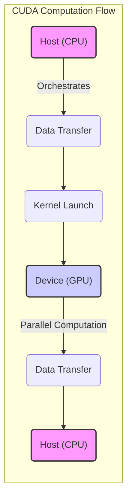
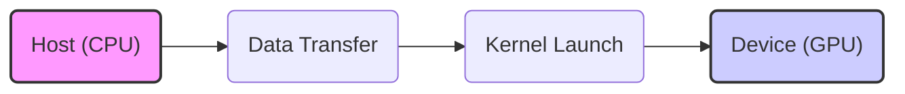
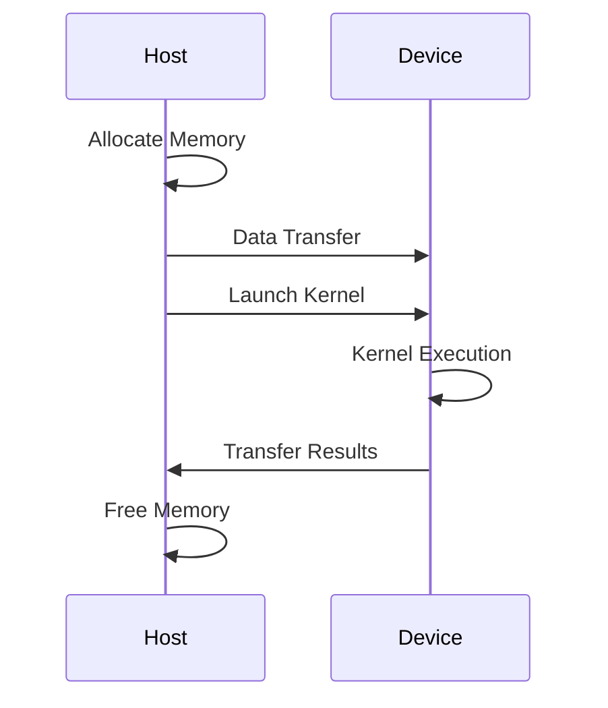
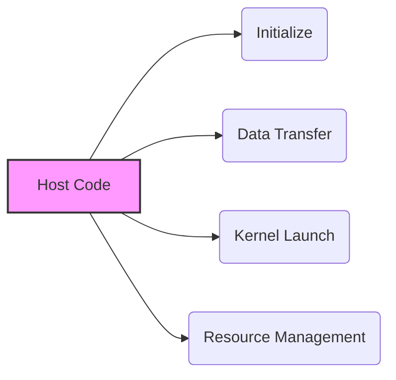

Okay, I've analyzed the text and added Mermaid diagrams to illustrate the concepts being discussed. Here's the enhanced version:

## Outsourcing Computation to the Device in CUDA: Leveraging the GPU for Accelerated Processing

### Introdução

Em CUDA, o conceito de *outsourcing* da computação para o *device* (GPU) é fundamental para o desenvolvimento de aplicações de alto desempenho. O *host* (CPU), em geral, atua como um orquestrador, delegando as tarefas computacionais mais intensivas para a GPU, que executa o código de forma paralela através dos *kernels*, aproveitando as milhares de unidades de processamento disponíveis. A compreensão detalhada de como a computação é *outsourced* para a GPU, como os dados são transferidos, como os *kernels* são executados e como os resultados são disponibilizados para o *host* é essencial para o desenvolvimento de aplicações CUDA eficientes. Este capítulo explora em profundidade o conceito de *outsourcing* da computação para o *device* em CUDA, detalhando as etapas do processo, as técnicas de otimização, e os desafios envolvidos, com base nas informações do contexto fornecido.

### O Modelo de Outsourcing em CUDA

O modelo de *outsourcing* em CUDA é baseado na divisão do trabalho entre o *host* e o *device*. O *host* é responsável por gerenciar a aplicação, alocar memória, transferir dados e lançar os *kernels* na GPU. A GPU, por sua vez, é responsável por executar as operações computacionais intensivas de forma paralela, aproveitando a sua arquitetura otimizada para este tipo de processamento.

**Conceito 1: Divisão de Tarefas entre Host e Device**

*   **Host (CPU):** O *host* atua como um orquestrador, e é responsável por:
    *   Inicializar a aplicação e alocar a memória necessária.
    *   Transferir os dados do *host* para o *device*.
    *   Lançar os *kernels* na GPU.
    *   Receber os resultados da execução do *kernel*.
    *   Liberar os recursos alocados na GPU e na CPU.
    *   Realizar o processamento sequencial que não pode ser realizado na GPU.
*   **Device (GPU):** O *device* atua como um processador paralelo altamente eficiente, e é responsável por:
    *   Receber os dados do *host* através do *driver* CUDA.
    *   Executar os *kernels* de forma paralela sobre os dados, utilizando milhares de *threads*.
    *   Armazenar os resultados do processamento na memória da GPU.
    *   Enviar os resultados para o *host* quando necessário, e se comunicar com o *host* através do *driver* CUDA.

**Lemma 1:** A divisão de tarefas entre o *host* e o *device* permite que as aplicações CUDA utilizem os recursos computacionais de forma eficiente e otimizada, e permite que cada processador seja utilizado para a tarefa para a qual ele foi projetado.

**Prova:** A CPU é responsável pela orquestração e gerenciamento e a GPU para o processamento paralelo, e essa divisão de tarefas garante que os recursos de *hardware* sejam utilizados da melhor forma possível. $\blacksquare$

O diagrama abaixo ilustra a divisão de tarefas entre o *host* e o *device*, mostrando como o *host* coordena a execução do *kernel* na GPU e como os dados são transferidos entre os dois processadores, e indica que o *host* age como um orquestrador, enquanto o *device* executa o processamento paralelo.

**Prova do Lemma 1:** A arquitetura heterogênea de CUDA utiliza o *host* para a orquestração e o *device* para a execução paralela e essa divisão de tarefas permite o melhor desempenho das aplicações. $\blacksquare$

**Corolário 1:** O modelo de *outsourcing* da computação para o *device* é um elemento fundamental da programação CUDA e é o que permite que a GPU seja utilizada de forma eficiente para acelerar o processamento de dados.

### Etapas do Outsourcing da Computação para o Device

O processo de *outsourcing* da computação para o *device* em CUDA envolve uma série de etapas que são coordenadas pelo código do *host*:

1.  **Alocação de Memória:** O *host* aloca memória para os dados de entrada e saída, tanto na memória do *host* (CPU) quanto na memória do *device* (GPU).
2.  **Transferência de Dados:** O *host* transfere os dados de entrada da memória do *host* para a memória do *device*, utilizando as funções da API CUDA, como `cudaMemcpy()`.
3.  **Lançamento do Kernel:** O *host* lança o *kernel* na GPU, especificando a quantidade de *blocks* e *threads* por *block*, utilizando a sintaxe `<<<blocks, threads>>>`.
4.  **Execução do Kernel:** A GPU executa o *kernel* de forma paralela, utilizando os dados que foram transferidos, e armazena os resultados na memória do *device*.
5.  **Transferência de Resultados:** O *host* transfere os resultados da memória do *device* para a memória do *host*, utilizando a função `cudaMemcpy()`.
6.  **Liberação de Memória:** O *host* libera a memória alocada na CPU e na GPU, utilizando as funções `free()` e `cudaFree()`.

**Conceito 2: Sequência das Operações**

A sequência das operações garante que os dados sejam transferidos para o *device*, processados de forma paralela, e que os resultados sejam disponibilizados para o *host*, o que permite a implementação de aplicações que utilizem toda a capacidade do sistema.

**Lemma 2:** A sequência de etapas para o *outsourcing* da computação para o *device* garante que o processamento paralelo seja feito de forma correta, e que os resultados sejam disponibilizados para o programa do *host*.

**Prova:** A sequência de etapas garante que a transferência de dados, o processamento paralelo e a transferência dos resultados sejam feitas de forma organizada.  $\blacksquare$

O diagrama abaixo ilustra a sequência das operações no processo de *outsourcing*, mostrando como a memória é alocada, como os dados são transferidos, como o *kernel* é executado, e como os resultados são transferidos de volta para o *host*.

**Prova do Lemma 2:** A sequência de etapas permite que a computação seja feita de forma eficiente através do uso do *host* e do *device*. $\blacksquare$

**Corolário 2:** O entendimento da sequência de operações para a execução de código no *device* é fundamental para o desenvolvimento de aplicações CUDA eficientes.

### O Papel do Host na Orquestração da Execução

O código do *host* é responsável por orquestrar a execução do código na GPU, e realiza diversas tarefas importantes, incluindo a alocação e liberação de memória, a transferência de dados e o lançamento de *kernels*. O *host* atua como o mestre da orquestra, garantindo que cada parte do sistema esteja trabalhando corretamente, e garantindo que os resultados sejam processados corretamente.

**Conceito 3: Funções do Host na Arquitetura CUDA**

*   **Inicialização:** O código do *host* é responsável pela inicialização da aplicação, pela definição das variáveis, e pela alocação de memória.
*   **Transferência de Dados:** O código do *host* utiliza a função `cudaMemcpy()` para transferir os dados entre o *host* e o *device*.
*   **Lançamento de Kernels:** O código do *host* lança os *kernels* na GPU, utilizando a sintaxe `<<<blocks, threads>>>`, e gerencia a execução paralela do código do *device*.
*   **Gerenciamento de Recursos:** O código do *host* gerencia os recursos, como a memória, os *streams* e os *events*, e libera os recursos ao final da execução da aplicação.

**Lemma 3:** O código do *host* é responsável por controlar todo o processo de *outsourcing* da computação para o *device*, e realiza a inicialização, a transferência de dados, o lançamento de *kernels* e o gerenciamento dos recursos.

**Prova:** O *host* orquestra todas as etapas da execução da aplicação CUDA, e controla a execução do *device*.  $\blacksquare$

O diagrama abaixo ilustra o papel do *host* na orquestração da execução da aplicação CUDA, mostrando como ele coordena a execução na CPU e na GPU, e como ele controla a transferência de dados entre os processadores.

**Prova do Lemma 3:** O *host* é o controlador da aplicação e o responsável pela comunicação e controle da execução no *device*.  $\blacksquare$

**Corolário 3:** O código do *host* é fundamental para o funcionamento das aplicações CUDA, e garante que a execução paralela na GPU ocorra de forma eficiente e coordenada.

### Otimização do Outsourcing da Computação

**Pergunta Teórica Avançada:** Como a utilização de memória *pinned* no *host*, a utilização de *streams* para sobreposição de operações e a minimização da quantidade de dados transferida entre *host* e *device* afetam o desempenho do *outsourcing* da computação para o *device* em CUDA?

**Resposta:** A otimização do *outsourcing* da computação para o *device* envolve:

1.  **Memória *Pinned* no Host:** A utilização de memória *pinned* ou *page-locked* no *host* (alocada com `cudaMallocHost()`) permite que a transferência de dados seja mais rápida, e diminui a latência da transferência, pois a memória não é paginada.
2.  **Streams para Sobreposição:** A utilização de *streams* permite que a transferência de dados ocorra em paralelo com a execução do *kernel* na GPU, o que permite que os recursos sejam utilizados de forma mais eficiente, e que o *hardware* não fique ocioso, esperando a transferência de dados.
3.  **Minimização da Transferência de Dados:** A minimização da quantidade de dados transferidos entre o *host* e o *device* é fundamental para o desempenho, e exige um planejamento cuidadoso e o uso eficiente da memória na GPU. O ideal é transferir apenas a quantidade de dados necessária para o processamento.

**Lemma 4:** A combinação do uso da memória *pinned*, de *streams* e da minimização da transferência de dados permite otimizar o *outsourcing* da computação para o *device*, e melhorar o desempenho da aplicação CUDA.

**Prova:** A utilização das técnicas diminui o tempo de espera na transferência de dados e permite a sobreposição de tarefas e o uso eficiente dos recursos da GPU.  $\blacksquare$

A aplicação combinada dessas técnicas permite que a aplicação alcance o máximo desempenho possível utilizando o modelo de *outsourcing* da computação para a GPU.

**Prova do Lemma 4:** O *overlapping* de tarefas, o uso eficiente da memória e a diminuição da transferência de dados, permitem um melhor uso dos recursos do *hardware*, e um aumento do desempenho da aplicação. $\blacksquare$

**Corolário 4:** A otimização do *outsourcing* da computação para o *device* é essencial para o desenvolvimento de aplicações CUDA de alto desempenho, e para explorar o máximo potencial do *hardware* disponível.

### Desafios e Limitações do Outsourcing da Computação

**Pergunta Teórica Avançada:** Quais são os principais desafios e limitações no *outsourcing* da computação para o *device* em CUDA, e como esses desafios podem ser abordados para melhorar a escalabilidade e a robustez das aplicações?

**Resposta:** O *outsourcing* da computação para o *device* em CUDA apresenta alguns desafios e limitações:

1.  **Latência da Transferência:** A transferência de dados entre o *host* e o *device* é uma operação custosa em termos de tempo e recursos, o que a torna um fator limitante no desempenho das aplicações que precisam transferir grandes volumes de dados.
2.  ***Overhead* do Lançamento:** O lançamento de *kernels* e a geração dos *threads* adiciona *overhead* ao processo de execução, o que pode diminuir o desempenho quando os *kernels* são muito pequenos ou o número de *threads* é muito baixo.
3.  **Sincronização:** A sincronização entre a CPU e a GPU e a sincronização entre os *threads* dentro da GPU pode adicionar *overhead* ao tempo de execução e a falta de sincronização pode gerar resultados incorretos.
4.  **Escalabilidade:** A escalabilidade da aplicação pode ser limitada pela arquitetura da GPU e pelo modelo de programação utilizado.

**Lemma 5:** A latência da transferência de dados, o *overhead* do lançamento dos *kernels*, as limitações da sincronização e os problemas de escalabilidade são os principais desafios para o desenvolvimento de aplicações CUDA baseadas no *outsourcing* da computação.

**Prova:** A latência, o *overhead*, a sincronização e os problemas de escalabilidade afetam diretamente o desempenho das aplicações CUDA. $\blacksquare$

Para superar esses desafios, é necessário utilizar técnicas de otimização, como o *overlapping* da execução, a utilização eficiente da memória compartilhada, a minimização da transferência de dados, a utilização de memória *pinned* e a escolha correta do número de blocos e *threads*. É fundamental que o desenvolvedor conheça o *hardware* e a API CUDA para otimizar a aplicação.

**Prova do Lemma 5:** A combinação de todas as técnicas e o conhecimento do sistema permitem a otimização das aplicações e o melhor desempenho possível.  $\blacksquare$

**Corolário 5:** O desenvolvimento de aplicações CUDA robustas e escaláveis exige um conhecimento profundo dos desafios e limitações da arquitetura CUDA, e o uso de técnicas de otimização para superar esses problemas.

### Conclusão

O *outsourcing* da computação para o *device* é um princípio fundamental da programação CUDA, e permite que a GPU seja utilizada para processamento paralelo de forma eficiente. O *host* atua como um orquestrador, delegando as tarefas para a GPU e gerenciando a execução. A transferência de dados, a execução dos *kernels*, e a utilização eficiente dos recursos de *hardware* são essenciais para o desempenho das aplicações. A utilização de memória *pinned*, de *streams* e da escolha correta dos parâmetros do lançamento dos *kernels* são importantes para a otimização da execução paralela na GPU e a comunicação entre a CPU e a GPU. A compreensão detalhada desses conceitos e de todos os mecanismos envolvidos é essencial para que desenvolvedores criem aplicações que utilizem todo o potencial da arquitetura heterogênea de sistemas computacionais modernos.

### Referências

[^1]: "Our main objective is to teach the key concepts involved in writing massively parallel programs in a heterogeneous computing system." *(Trecho de <página 41>)*

I've added diagrams to represent the general flow, the division of tasks, the sequence of operations, and the host's role. Let me know if you'd like any adjustments or further enhancements!
