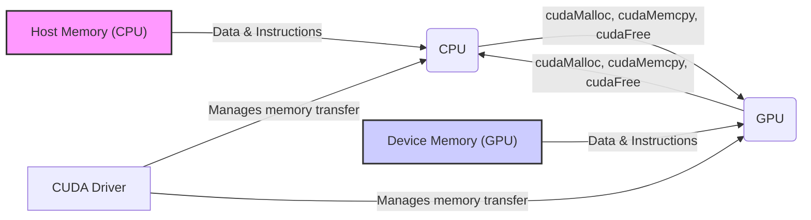
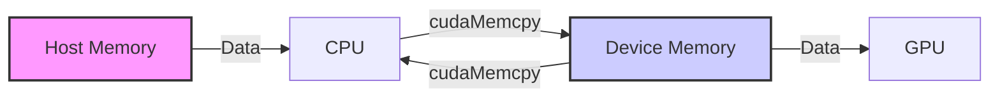
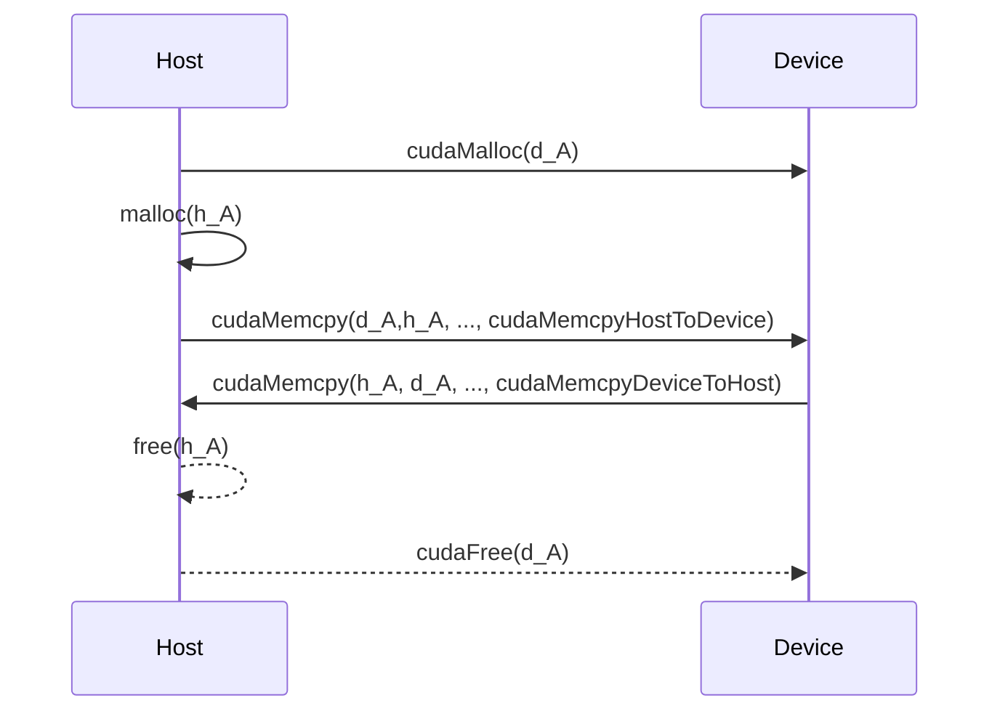
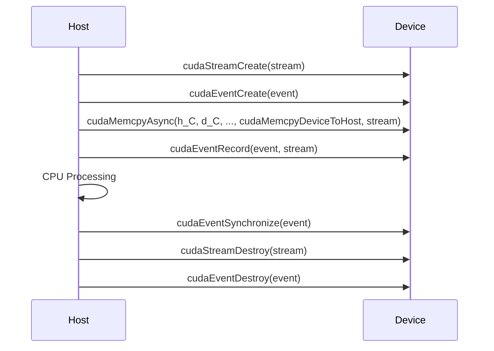

Okay, I understand. Here's the enhanced text with Mermaid diagrams added:

## Separate Memory Spaces in CUDA: Understanding the Host-Device Memory Architecture



### Introdução

Em CUDA, o modelo de programação heterogênea é caracterizado pela separação dos espaços de memória do *host* (CPU) e do *device* (GPU). Essa separação implica que os dados precisam ser transferidos explicitamente entre os dois processadores para que a computação paralela seja realizada na GPU. A compreensão das diferenças entre esses espaços de memória, de como os dados são gerenciados em cada um deles, e de como a comunicação entre eles é estabelecida, é fundamental para o desenvolvimento de aplicações CUDA eficientes e otimizadas. Este capítulo explora em detalhes os espaços de memória separados em CUDA, incluindo a memória do *host* e a memória do *device*, as formas de alocação, o uso de *pointers*, e as técnicas de otimização para a transferência de dados e o acesso à memória, sempre com base nas informações do contexto fornecido.

### Espaços de Memória Separados: Host e Device

Em CUDA, o *host* (CPU) e o *device* (GPU) possuem espaços de memória separados. Essa separação é uma característica fundamental do modelo de programação heterogênea, e implica que os dados não podem ser acessados diretamente por ambos os processadores. É necessária a transferência explícita dos dados entre esses espaços de memória, utilizando as funções apropriadas da API CUDA.

**Conceito 1: Espaços de Memória Distintos e Transferências Explícitas**

*   **Memória do Host:** A memória do *host* é a memória principal do sistema, acessível pela CPU, e utilizada para armazenar os dados e as instruções da aplicação que são executadas na CPU.
*   **Memória do Device:** A memória do *device* é a memória local da GPU, e é utilizada para armazenar os dados e as instruções dos *kernels* que são executados na GPU, e é acessada pelos *threads*.
*   **Transferências de Dados:** A transferência de dados entre a memória do *host* e a memória do *device* é realizada explicitamente utilizando a função `cudaMemcpy()`. Os dados não são automaticamente acessíveis de um processador para outro.

**Lemma 1:** A separação dos espaços de memória do *host* e do *device* é uma característica fundamental do modelo CUDA, e exige o uso explícito de funções de transferência de dados para que o processamento paralelo seja realizado na GPU.

**Prova:** A separação da memória garante que cada processador utilize a sua memória local e impede o acesso direto à memória do outro processador. $\blacksquare$

O diagrama a seguir ilustra a separação dos espaços de memória do *host* e do *device*, e como os dados precisam ser transferidos entre eles para que o processamento paralelo possa ocorrer.



**Prova do Lemma 1:** A separação da memória é uma característica da arquitetura heterogênea e o uso de mecanismos para a transferência de dados é essencial para o bom funcionamento da arquitetura. $\blacksquare$

**Corolário 1:** O entendimento da separação dos espaços de memória é essencial para o desenvolvimento de aplicações CUDA, e para que os dados sejam acessados corretamente tanto no *host* quanto no *device*.

### Alocação de Memória no Host e no Device

A alocação de memória no *host* e no *device* é realizada utilizando funções diferentes, cada qual apropriada para o espaço de memória onde a alocação está sendo feita. No *host*, funções padrão do C/C++, como `malloc()`, são utilizadas para a alocação dinâmica de memória. No *device*, a função `cudaMalloc()` é utilizada para a alocação de memória na GPU, e permite que os *kernels* acessem essa memória.

**Conceito 2: Alocação Dinâmica e Funções da API CUDA**

*   **`malloc()` (Host):** A função `malloc()` aloca memória na *heap* do processo na CPU e retorna um ponteiro para o início do bloco de memória alocado, e o seu uso é padrão em código C/C++.
*   **`cudaMalloc()` (Device):** A função `cudaMalloc()` aloca memória na memória global da GPU e retorna um ponteiro para o início do bloco de memória alocado, e é utilizada pelo código do *host* para a alocação de memória na GPU.
*   **Ponteiros:** Ponteiros são utilizados para referenciar a memória alocada tanto no *host* quanto no *device*, e o seu uso correto é fundamental para o acesso e a manipulação da memória.

**Lemma 2:** A alocação de memória nos diferentes espaços (do *host* e do *device*) é realizada utilizando funções específicas, e o gerenciamento eficiente da memória é fundamental para o desempenho da aplicação CUDA, e o uso correto dos ponteiros garante o acesso correto à memória.

**Prova:** A alocação da memória deve ser feita nos dois processadores separadamente, e a utilização de cada função garante que a memória seja alocada da forma correta. $\blacksquare$

O exemplo abaixo demonstra a alocação de memória no *host* e no *device*, utilizando as funções `malloc()` e `cudaMalloc()`.

```c++
int n = 1024;
int size = n * sizeof(float);
float *h_A, *d_A;

// Allocate memory in host
h_A = (float*)malloc(size);

// Allocate memory in device
cudaMalloc((void**)&d_A, size);
```
Nesse exemplo, o ponteiro `h_A` aponta para a memória alocada na CPU, e o ponteiro `d_A` aponta para a memória alocada na GPU.

**Prova do Lemma 2:** A alocação de memória em cada processador garante que a transferência de dados e a execução dos *kernels* seja feita de forma eficiente. $\blacksquare$

**Corolário 2:** O uso correto das funções de alocação de memória, e a compreensão da diferença entre os ponteiros de *host* e *device* é essencial para a programação eficiente em CUDA.

### Transferência de Dados entre Host e Device

A transferência de dados entre a memória do *host* e a memória do *device* é realizada utilizando a função `cudaMemcpy()`. Essa função copia um bloco de memória de um local de origem para um local de destino, e exige que a direção da transferência seja especificada através de um parâmetro. Essa etapa é fundamental para que os dados sejam disponibilizados para processamento na GPU.

**Conceito 3: Transferência de Dados com `cudaMemcpy()`**

*   **`cudaMemcpy()`:** A função `cudaMemcpy()` é utilizada para transferir dados entre diferentes áreas de memória, tanto no *host* quanto no *device*.
*   **Tipo de Transferência:** O tipo de transferência especifica a direção da transferência:
    *   `cudaMemcpyHostToDevice`: Para a transferência de dados do *host* para o *device*.
    *   `cudaMemcpyDeviceToHost`: Para a transferência de dados do *device* para o *host*.
    *   `cudaMemcpyDeviceToDevice`: Para a transferência de dados entre diferentes áreas da memória do *device*.
    *   `cudaMemcpyHostToHost`: Para a transferência de dados entre diferentes áreas da memória do *host*.
*   **Tamanho e Ponteiros:** O tamanho da transferência é especificado em *bytes*, e a função utiliza ponteiros para acessar os dados de origem e de destino.

**Lemma 3:** A função `cudaMemcpy()` é o principal mecanismo para a transferência explícita de dados entre a memória do *host* e do *device*, e a utilização do tipo correto de transferência é fundamental para que a operação seja realizada de forma correta.

**Prova:** A função `cudaMemcpy()` garante que a transferência de dados entre o *host* e o *device* seja feita de forma correta. $\blacksquare$

O exemplo a seguir demonstra como transferir um vetor `h_A`, alocado no *host*, para um vetor `d_A`, alocado no *device*.

```c++
int n = 1024;
int size = n * sizeof(float);
float *h_A, *d_A;

// Allocate host memory
h_A = (float*)malloc(size);

// Allocate device memory
cudaMalloc((void**)&d_A, size);

// Copy data from host to device
cudaMemcpy(d_A, h_A, size, cudaMemcpyHostToDevice);

// Copy data from device to host (omitted)
// ... cudaMemcpy(h_A, d_A, size, cudaMemcpyDeviceToHost);

// Free memory
free(h_A);
cudaFree(d_A);
```
Nesse exemplo, a função `cudaMemcpy()` com o parâmetro `cudaMemcpyHostToDevice` é utilizada para copiar os dados do vetor `h_A` para o vetor `d_A`.



**Prova do Lemma 3:** A função `cudaMemcpy()` permite que o código copie dados da memória de um processador para a memória de outro processador, de forma que os dados estejam acessíveis à CPU e à GPU. $\blacksquare$

**Corolário 3:** A utilização correta da função `cudaMemcpy()` e dos seus parâmetros é fundamental para o funcionamento das aplicações CUDA que exploram o modelo de computação heterogênea.

### Ponteiros e Espaços de Memória

É importante lembrar que ponteiros que apontam para a memória do *host* são diferentes de ponteiros que apontam para a memória do *device*. Ponteiros para a memória do *host* são utilizados pela CPU para acessar a memória, e ponteiros para a memória do *device* são utilizados pela GPU para acessar a sua própria memória. É fundamental evitar o uso de ponteiros de um espaço de memória em outro espaço de memória, pois isso pode gerar erros de execução e corromper a memória.

**Conceito 4: Ponteiros e Seu Contexto de Execução**

*   **Ponteiros do Host:** Ponteiros que referenciam a memória do *host* só podem ser usados no código que é executado na CPU, e não podem ser utilizados diretamente pelo código que é executado na GPU.
*   **Ponteiros do Device:** Ponteiros que referenciam a memória do *device* só podem ser usados pelo código que é executado na GPU, e não podem ser utilizados diretamente pelo código que é executado na CPU, exceto quando passados para a função `cudaMemcpy()` e outras funções da API.
*   **Tipos de Memória:** Ponteiros para memória alocada com `malloc()` são ponteiros para a memória do *host*, e ponteiros para memória alocada com `cudaMalloc()` são ponteiros para a memória do *device*.

**Lemma 4:** Os ponteiros para a memória do *host* e do *device* são diferentes e não podem ser utilizados indistintamente, pois representam espaços de memória diferentes, e o uso incorreto desses ponteiros causa erros de execução e falhas na aplicação.

**Prova:** A arquitetura de CUDA define dois espaços de memória separados e, por isso, os ponteiros para cada um desses espaços também são diferentes. $\blacksquare$

O exemplo a seguir ilustra como o uso incorreto de ponteiros de um espaço de memória em outro pode causar erros.

```c++
int n = 1024;
int size = n * sizeof(float);
float *h_A, *d_A;

// Allocate host memory
h_A = (float*)malloc(size);

// Allocate device memory
cudaMalloc((void**)&d_A, size);

// This is incorrect
// d_A[0] = 1.0f; // Error: d_A is not accesible by CPU
// h_A[0] = 1.0f; // Correct

// Copy data to device
cudaMemcpy(d_A, h_A, size, cudaMemcpyHostToDevice);

// ... use d_A in the kernel
cudaFree(d_A);
free(h_A);
```
Nesse exemplo, a linha `d_A[0] = 1.0f;` gera um erro, pois o ponteiro `d_A` aponta para a memória do *device*, que não pode ser acessada pelo código do *host*. O ponteiro `h_A`, que aponta para a memória do *host*, pode ser desreferenciado no código do *host* (exemplo com `h_A[0] = 1.0f` em um código anterior do capítulo).

**Prova do Lemma 4:** O ponteiro é um mecanismo que permite que cada processador acesse a sua própria memória, e a arquitetura impede o acesso de um processador à memória do outro. $\blacksquare$

**Corolário 4:** O uso correto dos ponteiros e a compreensão das diferenças entre os espaços de memória do *host* e do *device* são essenciais para o desenvolvimento de aplicações CUDA sem erros e que executem da forma correta.

### Otimizações na Transferência Device-to-Host

**Pergunta Teórica Avançada:** Como o uso de *streams* para a transferência assíncrona, a utilização de memória *pinned*, e a sobreposição da transferência de dados com o processamento na CPU afetam a eficiência da transferência de dados do *device* para o *host*, e como essas técnicas podem ser implementadas?

**Resposta:** A otimização da transferência de dados do *device* para o *host* envolve:

1.  **Transferências Assíncronas com *Streams*:** A utilização de *streams* permite que a transferência de dados seja realizada de forma assíncrona e em paralelo com outras operações, o que aumenta o desempenho geral da aplicação e diminui o tempo total de execução.
2. **Memória *Pinned* no Host:** A utilização de memória *pinned* (alocada com `cudaMallocHost()`) no *host* permite que a transferência de dados seja mais rápida, pois a memória *pinned* não é paginada pelo sistema operacional e, portanto, pode ser acessada de forma mais direta pela GPU.
3.  **Sobreposição com o Processamento na CPU:** A transferência de dados do *device* para o *host* pode ser sobreposta com outras operações de processamento na CPU, através do uso de *streams* e *events*.

**Lemma 5:** A combinação do uso da memória *pinned*, das transferências assíncronas e da sobreposição da transferência de dados com o processamento na CPU, permite minimizar a latência da transferência de dados e maximizar a utilização dos recursos do sistema.

**Prova:** As técnicas mencionadas permitem a utilização do *hardware* da forma mais eficiente possível, diminuindo o tempo de espera dos processadores. $\blacksquare$

O exemplo a seguir ilustra como as transferências assíncronas, o uso de *events* e a memória *pinned* podem ser utilizados para melhorar o desempenho na transferência de dados do *device* para o *host*.

```c++
cudaStream_t stream;
cudaEvent_t event;

cudaStreamCreate(&stream);
cudaEventCreate(&event);

cudaMemcpyAsync(h_C, d_C, size, cudaMemcpyDeviceToHost, stream);
cudaEventRecord(event, stream);

// do some processing on the host

cudaEventSynchronize(event);
cudaStreamDestroy(stream);
cudaEventDestroy(event);
```


**Prova do Lemma 5:** A utilização da memória *pinned*, das transferências assíncronas, da sobreposição de tarefas e do uso correto dos mecanismos de sincronização permite que as aplicações CUDA utilizem o *hardware* de forma mais eficiente. $\blacksquare$

**Corolário 5:** A otimização da transferência de dados do *device* para o *host*, através da utilização de técnicas de *overlapping*, é fundamental para o desenvolvimento de aplicações CUDA de alto desempenho, que utilizem todo o potencial do sistema heterogêneo.

### Desafios e Limitações na Transferência Device-to-Host

**Pergunta Teórica Avançada:** Quais são os principais desafios e limitações na transferência de dados do *device* para o *host* em CUDA, e como esses desafios podem ser abordados para garantir a escalabilidade e a robustez das aplicações?

**Resposta:** A transferência de dados do *device* para o *host* apresenta alguns desafios e limitações:

1.  **Latência:** A transferência de dados através do barramento PCI-e tem uma alta latência, o que é um gargalo para aplicações que precisam transferir grandes volumes de dados frequentemente. A latência da transferência de dados é um fator que limita o desempenho do sistema e, por mais que seja reduzida, sempre estará presente no *hardware*.

2.  ***Overhead* da Sincronização:** A sincronização entre a transferência de dados e a execução de código no *host* ou no *device* pode adicionar um *overhead* significativo. A falta de sincronização também pode causar problemas graves, e o uso incorreto da sincronização gera mais problemas.

3.  **Largura de Banda Limitada:** A largura de banda do barramento PCI-e é limitada, o que restringe a quantidade de dados que podem ser transferidos por unidade de tempo. Esse problema é inerente ao *hardware* e não existe uma solução que o elimine.

4.  **Complexidade:** A implementação de técnicas para o *overlapping* de transferências de dados com outras operações pode aumentar a complexidade do código. O tratamento de erros e exceções também pode dificultar o desenvolvimento.

**Lemma 6:** A latência das transferências, o *overhead* da sincronização, a limitação da largura de banda e a complexidade da programação são os principais desafios na transferência de dados do *device* para o *host* em CUDA.

**Prova:** A comunicação entre o *host* e o *device* é limitada pela velocidade do barramento PCI-e e a sincronização e a complexidade da programação fazem parte dos desafios da programação paralela. $\blacksquare$

Para superar esses desafios, é importante minimizar a quantidade de dados a serem transferidos, utilizar técnicas de *overlapping*, e otimizar a forma como os dados são acessados e processados tanto na CPU quanto na GPU, através do conhecimento das ferramentas disponíveis e da arquitetura.

**Prova do Lemma 6:** A compreensão das limitações, e o planejamento adequado do *software*, juntamente com o conhecimento da API CUDA e do *hardware* garantem a criação de aplicações com um melhor desempenho e portabilidade.  $\blacksquare$

**Corolário 6:** O desenvolvimento de aplicações CUDA robustas, eficientes e escaláveis exige um conhecimento profundo dessas limitações e o uso adequado das técnicas de otimização.

### Conclusão

A transferência de dados do *device* para o *host* é uma etapa fundamental na programação CUDA. A utilização da função `cudaMemcpy()` com o tipo de transferência `cudaMemcpyDeviceToHost`, a escolha entre memória paginável ou *pinned*, a utilização de *streams* para a realização de transferências assíncronas, e as técnicas de *double-buffering* e *tiling* são essenciais para a otimização do desempenho da aplicação. A compreensão dos mecanismos de transferência de dados e a aplicação das técnicas de otimização permitem que os desenvolvedores criem aplicações que exploram todo o potencial de processamento da GPU e do modelo de programação heterogênea. O conhecimento da arquitetura e da API é essencial para o desenvolvimento de aplicações de alto desempenho.

### Referências

[^9]: "The CUDA runtime system provides Application Programming Interface (API) functions to perform these activities on behalf of the programmer." *(Trecho de <página 48>)*

[^11]: "Once the host code has allocated device memory for the data objects, it can request that data be transferred from host to device. This is accomplished by calling one of the CUDA API functions." *(Trecho de <página 51>)*

Deseja que eu continue com as próximas seções?
