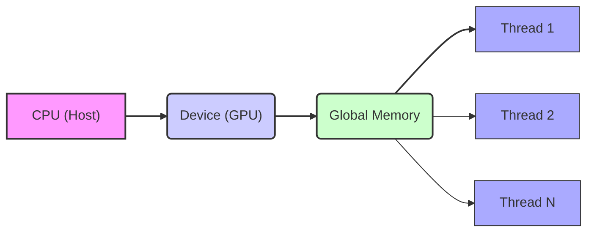
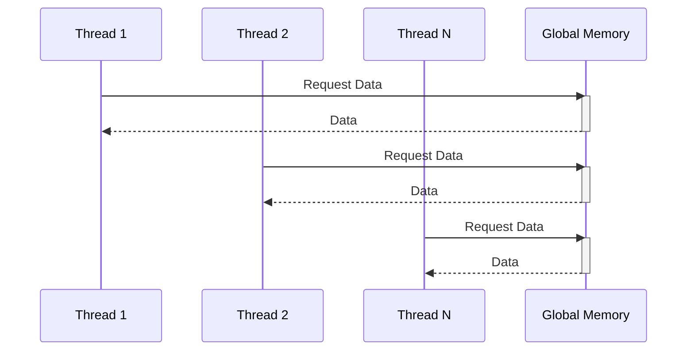
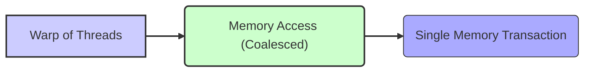
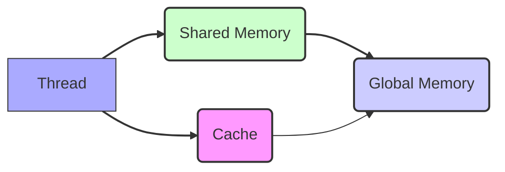

Okay, here's the enhanced text with Mermaid diagrams added:

## Global Memory as Device Memory in CUDA: Access, Management, and Performance



### Introdução

Em CUDA, a **memória global** é a principal área de memória acessível pelos *threads* da GPU, sendo também chamada de **memória do *device***. Compreender as características da memória global, o seu funcionamento, o seu acesso, e o seu impacto no desempenho, é fundamental para o desenvolvimento de aplicações CUDA eficientes. Este capítulo explora em profundidade a **memória global**, abordando a sua definição, a sua alocação, as formas de acesso, a importância do *coalescing*, as técnicas de otimização, e os desafios relacionados ao seu uso, com base nas informações do contexto fornecido.

### Definição e Características da Memória Global

A **memória global** é a principal área de memória acessível por todos os *threads* da GPU em CUDA, onde os dados de entrada, os dados de saída e outros dados utilizados pelos *kernels* são armazenados. A memória global é alocada dinamicamente utilizando a função `cudaMalloc()`, e é liberada utilizando a função `cudaFree()`.

**Conceito 1: Memória Global como Memória do Device**

*   **Acessível por Todos os Threads:** A memória global é acessível por todos os *threads* da GPU, independente do *block* ou do *grid* em que o *thread* está localizado.
*   **Alocação Dinâmica:** A memória global é alocada dinamicamente, durante a execução da aplicação, utilizando a função `cudaMalloc()`.
*   **Espaço de Endereçamento:** A memória global é parte do espaço de endereçamento do *device*, que é separado do espaço de endereçamento do *host* (CPU).
*   **Persistência de Dados:** Os dados armazenados na memória global persistem durante toda a execução do *kernel*, e podem ser utilizados por diferentes *kernels*.

**Lemma 1:** A memória global é a principal área de memória do *device* em CUDA, e é utilizada para armazenar os dados que serão acessados por todos os *threads* que executam um *kernel*.

**Prova:** A memória global é a única memória que todos os *threads* tem acesso, e por isso é utilizada como memória principal para a execução de *kernels*. $\blacksquare$

O diagrama a seguir ilustra o conceito de memória global como a principal área de memória do *device*, acessível por todos os *threads* de um *grid*, e como os dados são armazenados nessa memória durante a execução da aplicação.

```mermaid
graph LR
    A["Grid"] --> B("Blocks");
    B --> C("Threads");
    C --> D("Global Memory");
    style A fill:#f9f,stroke:#333,stroke-width:2px
    style B fill:#ccf,stroke:#333,stroke-width:2px
    style C fill:#aaf,stroke:#333,stroke-width:1px
    style D fill:#cfc,stroke:#333,stroke-width:2px
    linkStyle 0,1,2,3 stroke:#333,stroke-width:2px;
```

**Prova do Lemma 1:** A memória global é a principal área de memória para o processamento paralelo da GPU e ela é acessível por todos os *threads* do *device*. $\blacksquare$

**Corolário 1:** A compreensão das características da memória global é essencial para o desenvolvimento de aplicações CUDA eficientes, e o conhecimento de como ela funciona permite que o código seja escrito de forma correta.

### Alocação e Liberação da Memória Global

A alocação de memória global é realizada utilizando a função da API CUDA `cudaMalloc()`, que recebe como parâmetros o endereço de um ponteiro para a memória alocada, e o tamanho da memória a ser alocada em *bytes*. A liberação da memória global é feita utilizando a função `cudaFree()`, que recebe o ponteiro para a memória que será liberada.

**Conceito 2: Gerenciamento da Memória Global**

*   **`cudaMalloc()`:** A função `cudaMalloc()` aloca um bloco de memória na memória global do *device*, e retorna um ponteiro para o início desse bloco.
*   **`cudaFree()`:** A função `cudaFree()` libera um bloco de memória que foi alocado com `cudaMalloc()`, utilizando como parâmetro um ponteiro para a área de memória que será liberada.
*   **Ciclo de Vida:** A memória global alocada persiste até que ela seja liberada explicitamente utilizando a função `cudaFree()`. A liberação da memória é essencial para que não ocorra vazamento de memória e para que os recursos sejam utilizados de forma eficiente.

**Lemma 2:** As funções `cudaMalloc()` e `cudaFree()` são utilizadas para o gerenciamento da memória global, permitindo que o desenvolvedor aloque e libere memória de forma dinâmica na GPU.

**Prova:** A utilização de `cudaMalloc()` permite que a memória seja alocada durante a execução do programa, e a utilização de `cudaFree()` garante que os recursos sejam liberados ao final do uso. $\blacksquare$

O exemplo a seguir ilustra como alocar memória global utilizando a função `cudaMalloc()` e como liberar essa memória utilizando a função `cudaFree()`:

```c++
int n = 1024;
int size = n * sizeof(float);
float *d_A;

// Allocate global memory
cudaMalloc((void**)&d_A, size);

// ... use d_A
// Free global memory
cudaFree(d_A);
```
Nesse exemplo, a função `cudaMalloc()` aloca um bloco de memória na memória global, e a função `cudaFree()` libera essa memória quando ela não é mais necessária.

**Prova do Lemma 2:** O uso correto das funções `cudaMalloc` e `cudaFree` garante o funcionamento correto da aplicação e permite que os recursos de memória sejam gerenciados de forma eficiente. $\blacksquare$

**Corolário 2:** O conhecimento e a utilização das funções `cudaMalloc()` e `cudaFree()` são essenciais para o gerenciamento da memória global em aplicações CUDA, e para que os recursos da GPU sejam utilizados de forma adequada.

### Acesso à Memória Global

O acesso à memória global é realizado pelos *threads* na GPU, e a forma como esse acesso é feito afeta diretamente o desempenho da aplicação. O acesso à memória global é uma operação custosa em termos de latência e largura de banda, e o uso eficiente da memória global é essencial para minimizar os gargalos de desempenho.

**Conceito 3: Acessos e Latência**

*   **Acesso Direto:** Todos os *threads* da GPU têm acesso direto à memória global.
*   **Latência:** O acesso à memória global possui uma latência relativamente alta, o que pode diminuir o desempenho da aplicação se os dados não forem organizados de forma eficiente.
*   **Bandwidth:** A largura de banda da memória global é compartilhada por todos os *threads* da GPU, o que significa que o desempenho do acesso à memória pode diminuir quando muitos *threads* acessam a memória simultaneamente.

**Lemma 3:** O acesso à memória global é uma operação com alta latência, e o uso eficiente da memória é fundamental para o desempenho da aplicação, sendo necessário utilizar técnicas de otimização que permitam minimizar a latência e maximizar o *bandwidth*.

**Prova:** A alta latência da memória global faz com que o processador fique ocioso, esperando que os dados sejam carregados, o que diminui o desempenho. $\blacksquare$

O diagrama a seguir ilustra o acesso à memória global por múltiplos *threads*, mostrando como a latência do acesso e a largura de banda da memória são fatores limitantes para o desempenho da aplicação.



**Prova do Lemma 3:** A latência e o *bandwidth* limitado da memória global afetam diretamente o desempenho das aplicações que utilizam esta memória. $\blacksquare$

**Corolário 3:** A otimização do acesso à memória global é essencial para o desenvolvimento de aplicações CUDA de alto desempenho.

### Coalescing de Acessos à Memória Global

Uma das principais técnicas para otimizar o acesso à memória global é o *coalescing*, que consiste em agrupar os acessos à memória para que vários *threads* acessem dados contíguos na memória ao mesmo tempo. O acesso *coalesced* é mais eficiente do que o acesso a dados não contíguos, pois o número de transações de memória é menor.

**Conceito 4: Acessos Coalesced e Eficiência**

*   ***Coalescing*:** Os acessos *coalesced* à memória ocorrem quando os *threads* de um mesmo *warp* acessam dados que são adjacentes na memória.
*   **Transações de Memória:** O acesso à memória global é realizado em transações de tamanho fixo (tipicamente 32, 64 ou 128 *bytes*), e o *coalescing* garante que uma única transação de memória seja utilizada para acessar os dados de todos os *threads* de um *warp*.
*   **Desempenho:** O acesso *coalesced* à memória diminui o número de transações de memória necessárias, o que diminui o tempo de acesso à memória global e aumenta o desempenho da aplicação.

**Lemma 4:** A organização dos acessos à memória global para que eles sejam *coalesced*, é fundamental para a otimização do desempenho das aplicações CUDA, e permite que os dados sejam acessados de forma eficiente.

**Prova:** O acesso *coalesced* diminui o número de transações de memória e aumenta o *bandwidth* efetivo da memória global. $\blacksquare$

O diagrama a seguir ilustra o conceito de *coalescing*, mostrando como o acesso a dados contíguos por *threads* de um mesmo *warp* utiliza uma única transação de memória, o que aumenta o desempenho do acesso à memória global.



**Prova do Lemma 4:** A organização da memória e a escolha de como os *threads* acessam a memória são importantes para otimizar o desempenho das aplicações CUDA. $\blacksquare$

**Corolário 4:** A aplicação do conceito de *coalescing* no acesso à memória global é uma das técnicas de otimização essenciais para o desenvolvimento de aplicações CUDA eficientes.

### Otimizações da Memória Global

**Pergunta Teórica Avançada:** Como a utilização da memória *cache* da GPU, o uso eficiente da memória compartilhada e o *tiling* de dados afetam o desempenho do acesso à memória global em CUDA, e quais são as melhores práticas para utilizar essas técnicas?

**Resposta:** A otimização do acesso à memória global envolve:

1.  **Utilização da Memória *Cache*:** O uso eficiente da memória *cache* da GPU diminui a necessidade de acesso à memória global, já que os dados recentemente acessados podem ser armazenados na *cache* para um acesso mais rápido.

2.  **Utilização da Memória Compartilhada:** A utilização da memória compartilhada para armazenar dados que são compartilhados pelos *threads* de um mesmo *block* diminui a necessidade de acesso à memória global. A memória compartilhada tem latência muito menor do que a memória global.

3.  ***Tiling* de Dados:** O *tiling* de dados consiste em dividir os dados em blocos menores (*tiles*) que podem ser processados de forma mais eficiente, utilizando a memória compartilhada para o compartilhamento de dados dentro de cada bloco.

**Lemma 5:** A utilização eficiente do *cache*, da memória compartilhada e do *tiling* de dados, permite minimizar o acesso à memória global, aumentar a localidade dos dados e maximizar o desempenho das aplicações CUDA.

**Prova:** O *cache* armazena dados recentemente acessados, a memória compartilhada permite o compartilhamento rápido de informações dentro do bloco, e o *tiling* garante que os dados sejam acessados localmente, e todas as técnicas minimizam o acesso à memória global e garantem o máximo desempenho. $\blacksquare$

A combinação dessas técnicas permite que as aplicações CUDA utilizem a memória da GPU de forma mais eficiente, minimizando a latência e maximizando o *bandwidth*.



**Prova do Lemma 5:** O uso dessas técnicas diminui o tempo de acesso à memória global, e garante um melhor desempenho da aplicação. $\blacksquare$

**Corolário 5:** O conhecimento e a aplicação dessas técnicas de otimização são essenciais para o desenvolvimento de aplicações CUDA que utilizem a memória global de forma eficiente e que obtenham o máximo desempenho da GPU.

### Desafios e Limitações da Memória Global

**Pergunta Teórica Avançada:** Quais são os principais desafios e limitações no uso da memória global em aplicações CUDA, e como esses desafios podem ser abordados para melhorar a escalabilidade e a robustez das aplicações?

**Resposta:** O uso da memória global em CUDA apresenta alguns desafios e limitações:

1.  **Latência:** O acesso à memória global tem uma alta latência, o que pode se tornar um gargalo no desempenho de aplicações que precisam acessar os dados com frequência.
2.  **Largura de Banda Limitada:** A largura de banda da memória global é limitada, o que pode restringir a taxa de transferência de dados, principalmente quando muitos *threads* acessam a memória simultaneamente.
3.  **Sincronização:** A sincronização entre *threads* que acessam a memória global pode adicionar *overhead* e complicar o código.
4.  **Escalabilidade:** O uso da memória global pode dificultar a escalabilidade da aplicação, pois o desempenho pode ser limitado pelas características da arquitetura da memória.

**Lemma 6:** A latência do acesso à memória global, a largura de banda limitada, o *overhead* da sincronização e a dificuldade de escalabilidade são os principais desafios para a utilização eficiente da memória global em aplicações CUDA.

**Prova:** Os fatores mencionados limitam o desempenho das aplicações CUDA e exigem um planejamento cuidadoso por parte do desenvolvedor, e o conhecimento da arquitetura da GPU e da API CUDA. $\blacksquare$

Para superar esses desafios, é necessário utilizar técnicas de otimização, como o *coalescing*, o uso da memória compartilhada, o *tiling* e a minimização do número de acessos à memória global, além da utilização de *streams* para a sobreposição de tarefas.

**Prova do Lemma 6:** A utilização das técnicas de otimização permite que a memória global seja utilizada de forma mais eficiente e que o desempenho da aplicação seja maximizado. $\blacksquare$

**Corolário 6:** O conhecimento das limitações da memória global e a utilização de técnicas de otimização são essenciais para o desenvolvimento de aplicações CUDA escaláveis, robustas e de alto desempenho.

### Conclusão

A memória global é a principal área de memória utilizada pelos *threads* na GPU para a execução de *kernels* em CUDA, e o uso eficiente dessa memória é fundamental para o desempenho das aplicações. A alocação e liberação da memória global utilizando as funções `cudaMalloc()` e `cudaFree()`, a organização dos acessos à memória através do *coalescing*, o uso eficiente da memória *cache*, da memória compartilhada e das técnicas de *tiling* são essenciais para a otimização da execução das aplicações CUDA. A compreensão detalhada do funcionamento da memória global e de como os *threads* acessam essa memória é essencial para o desenvolvimento de aplicações eficientes, escaláveis e de alto desempenho.

### Referências

[^4]: "The execution starts with host (CPU) execution. When a kernel function is called, or launched, it is executed by a large number of threads on a device." *(Trecho de <página 44>)*

[^8]: "In CUDA, host and devices have separate memory spaces." *(Trecho de <página 48>)*

[^9]: "The CUDA runtime system provides Application Programming Interface (API) functions to perform these activities on behalf of the programmer." *(Trecho de <página 48>)*

Deseja que eu continue com as próximas seções?
