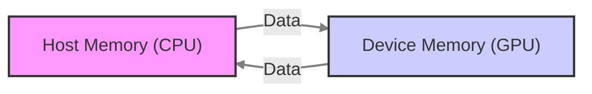
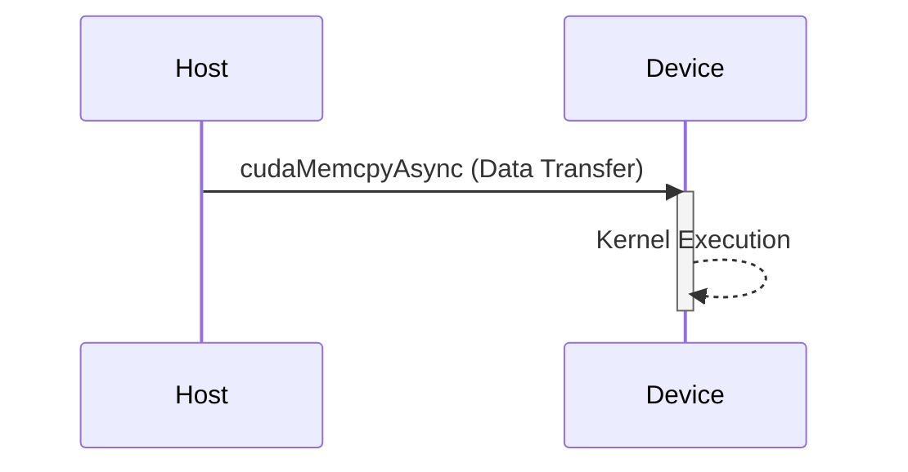

Okay, I will add Mermaid diagrams to enhance the text as requested.



### Introdução

Em CUDA, a separação dos espaços de memória do *host* (CPU) e do *device* (GPU) é uma característica fundamental do modelo de programação heterogênea. Essa separação implica que a transferência de dados entre os dois processadores não é automática e deve ser feita explicitamente através de funções da API CUDA. A necessidade de transferência explícita de dados pode parecer um *overhead* para desenvolvedores iniciantes em CUDA, mas ela é essencial para que o *hardware* da GPU seja utilizado de forma eficiente e para garantir a escalabilidade das aplicações. Este capítulo explora em detalhes a necessidade de transferência explícita de dados em CUDA, analisando as razões para essa necessidade, as funções utilizadas para a transferência e as implicações para o desenvolvimento de aplicações otimizadas, com base nas informações do contexto fornecido.

### A Separação dos Espaços de Memória

Em CUDA, o *host* (CPU) e o *device* (GPU) possuem espaços de memória separados, que são acessíveis por seus próprios processadores. Essa separação é uma característica fundamental do modelo de programação heterogênea, e permite que cada processador utilize a sua memória local para executar as suas tarefas de forma eficiente. A CPU utiliza a memória principal do sistema (a memória do *host*), e a GPU utiliza a sua própria memória (a memória do *device*), também chamada de memória global.

**Conceito 1: Memória Host e Device Distintas**

*   **Memória Host:** A memória do *host* (CPU) é a memória principal do sistema, utilizada para armazenar o código e os dados que são acessados pela CPU. A memória do *host* é utilizada para executar o sistema operacional, a aplicação e outras funções e programas do sistema.
*   **Memória Device:** A memória do *device* (GPU) é a memória local da GPU, utilizada para armazenar o código e os dados que são acessados pelos *threads* da GPU. A memória do *device* é utilizada para armazenar os dados para a execução paralela dos *kernels* na GPU.
*   **Separação:** Os espaços de memória do *host* e do *device* são separados e inacessíveis um ao outro. A CPU não pode acessar diretamente a memória da GPU, e a GPU não pode acessar diretamente a memória da CPU.

**Lemma 1:** A separação dos espaços de memória do *host* e do *device* é uma característica fundamental da arquitetura CUDA, e essa separação implica que as transferências de dados entre os dois processadores devem ser feitas explicitamente pelo programador.

**Prova:** A separação dos espaços de memória permite que cada processador utilize a sua memória local de forma eficiente, e impede o acesso de um processador à memória do outro, o que poderia causar erros de execução e problemas de segurança.  $\blacksquare$

O diagrama abaixo ilustra a separação dos espaços de memória do *host* e do *device*, mostrando que os dados não são automaticamente compartilhados entre os dois processadores.


**Prova do Lemma 1:** A arquitetura do *hardware* exige a separação da memória da CPU e da GPU, e o programador deve realizar as transferências de forma explícita. $\blacksquare$

**Corolário 1:** O entendimento da separação dos espaços de memória do *host* e do *device* é fundamental para o desenvolvimento correto de aplicações CUDA, e para o uso adequado das funções de transferência de dados.

### A Necessidade de Transferências Explícitas

A necessidade de transferências explícitas de dados em CUDA é uma consequência direta da separação dos espaços de memória. Como a CPU e a GPU não podem acessar diretamente a memória uma da outra, é necessário utilizar funções da API CUDA para realizar a transferência de dados de um processador para o outro, e esse processo é explícito e deve ser feito pelo programador.

**Conceito 2: Transferências Explícitas com `cudaMemcpy`**

*   **Transferências Explícitas:** A transferência de dados entre a memória do *host* e a memória do *device* não é automática e deve ser feita explicitamente, através do uso da função `cudaMemcpy()`.
*   **API CUDA:** A API CUDA oferece a função `cudaMemcpy()` para transferir dados entre o *host* e o *device*, e essa função exige que o programador especifique a origem dos dados, o destino dos dados, a quantidade de *bytes* a serem transferidos e a direção da transferência.
*   **Controle do Desenvolvedor:** O programador tem controle total sobre o processo de transferência de dados, e decide quando e como os dados são transferidos entre o *host* e o *device*.

**Lemma 2:** A necessidade de transferência explícita de dados em CUDA é uma consequência direta da separação dos espaços de memória do *host* e do *device*, e exige que o programador utilize as funções da API CUDA para transferir os dados entre os processadores.

**Prova:** O *hardware* exige a transferência explícita, o que impede o acesso direto de um processador à memória do outro, e a API CUDA oferece as ferramentas necessárias para que isso seja feito de forma correta e controlada. $\blacksquare$

O diagrama a seguir ilustra como a função `cudaMemcpy()` é utilizada para realizar a transferência de dados entre o *host* e o *device*, explicitando que os dados não são compartilhados automaticamente, e devem ser transferidos através das funções da API CUDA.


**Prova do Lemma 2:** A transferência explícita de dados é essencial para que a CPU e a GPU possam se comunicar e para que as operações possam ser executadas. $\blacksquare$

**Corolário 2:** A transferência explícita de dados é um aspecto fundamental do modelo de programação heterogênea em CUDA, e permite o controle total sobre o fluxo de dados entre o *host* e o *device*.

### A Função `cudaMemcpy` para Transferência de Dados

A função `cudaMemcpy()` é a principal ferramenta para realizar a transferência de dados entre o *host* e o *device* em CUDA. Essa função é utilizada para copiar um bloco de memória de uma origem para um destino, e recebe como parâmetros o ponteiro para o destino, o ponteiro para a origem, a quantidade de *bytes* a serem copiados e um parâmetro que indica o tipo de transferência.

**Conceito 3: Parâmetros e Uso da `cudaMemcpy()`**

*   **Ponteiro de Destino:** O ponteiro para o local de destino onde os dados serão copiados.
*   **Ponteiro de Origem:** O ponteiro para o local de origem de onde os dados serão copiados.
*   **Quantidade de Bytes:** A quantidade de *bytes* a serem copiados, que indica o tamanho dos dados que serão transferidos entre as memórias.
*   **Tipo de Transferência:** O tipo de transferência indica a direção da transferência, como `cudaMemcpyHostToDevice` para copiar dados do *host* para o *device*, ou `cudaMemcpyDeviceToHost` para copiar dados do *device* para o *host*.

**Lemma 3:** A função `cudaMemcpy()` é o mecanismo fundamental para transferir dados entre o *host* e o *device* em CUDA, e o uso correto dessa função e a especificação do tipo correto de transferência é essencial para a correta execução da aplicação e para o bom desempenho da aplicação.

**Prova:** A função `cudaMemcpy()` é utilizada para todos os tipos de transferência de dados entre a CPU e a GPU. $\blacksquare$

O exemplo abaixo demonstra como a função `cudaMemcpy()` é utilizada para transferir dados do *host* para o *device* e do *device* para o *host*.

```c++
int n = 1024;
int size = n * sizeof(float);
float *h_A, *d_A;

// Allocate host and device memory
h_A = (float*)malloc(size);
cudaMalloc((void**)&d_A, size);

// Copy data from host to device
cudaMemcpy(d_A, h_A, size, cudaMemcpyHostToDevice);

// Copy data from device to host (omitted)
cudaMemcpy(h_A, d_A, size, cudaMemcpyDeviceToHost);
```
Nesse exemplo, a função `cudaMemcpy()` é utilizada com o parâmetro `cudaMemcpyHostToDevice` para transferir os dados do vetor `h_A` na memória do *host* para o vetor `d_A` na memória do *device*, e posteriormente utiliza a função `cudaMemcpy()` com o parâmetro `cudaMemcpyDeviceToHost` para transferir os dados de volta para o *host*.

**Prova do Lemma 3:** O conhecimento do funcionamento da função `cudaMemcpy()` e dos seus parâmetros é essencial para que o programa realize as transferências de dados de forma correta. $\blacksquare$

**Corolário 3:** O uso adequado da função `cudaMemcpy()` e a especificação do tipo correto de transferência é fundamental para o desenvolvimento de aplicações CUDA eficientes e que utilizem o modelo *host-device* corretamente.

### Implicações da Transferência Explícita no Desempenho

A necessidade de transferência explícita de dados entre o *host* e o *device* pode gerar um *overhead* no desempenho da aplicação, pois a transferência de dados através do barramento PCI-e é uma operação custosa, que pode limitar a escalabilidade das aplicações CUDA, especialmente quando grandes quantidades de dados precisam ser transferidas com frequência.

**Conceito 4: Latência da Transferência e Técnicas de Overlapping**

*   **Latência da Transferência:** A transferência de dados entre o *host* e o *device* envolve a cópia dos dados através do barramento PCI-e, que possui uma latência relativamente alta, o que diminui o desempenho da aplicação.
*   ***Overlapping*:** A utilização de técnicas de *overlapping* permite que a transferência de dados ocorra em paralelo com a execução de outras operações, como a execução de *kernels* na GPU ou processamento na CPU, e diminui o tempo de ociosidade de cada processador.
*   **Streams:** A utilização de *streams* permite a execução assíncrona de transferências e outras operações na GPU, o que é essencial para a implementação do *overlapping*.

**Lemma 4:** A latência da transferência de dados entre o *host* e o *device* pode limitar o desempenho de aplicações CUDA, e a utilização de técnicas de *overlapping* e de transferência assíncrona, através do uso de *streams*, é essencial para mitigar este problema.

**Prova:** A utilização de *streams* e de transferências assíncronas permite que a execução e a transferência de dados ocorram em paralelo, diminuindo a latência e o tempo de espera da CPU e da GPU. $\blacksquare$

O diagrama a seguir ilustra como a utilização de *streams* permite que a transferência de dados entre o *host* e o *device* ocorra em paralelo com a execução de *kernels* na GPU, o que diminui o tempo total de execução da aplicação.



**Prova do Lemma 4:** O *overlapping* e as transferências assíncronas garantem o melhor uso dos recursos do *hardware* e diminui o tempo total de execução do programa. $\blacksquare$

**Corolário 4:** O conhecimento da latência da transferência e a utilização de técnicas para diminuir o seu impacto é fundamental para o desenvolvimento de aplicações CUDA de alto desempenho.

### Otimizações para Minimizar o Impacto da Transferência de Dados

**Pergunta Teórica Avançada:** Como a utilização da memória *pinned* no *host*, a minimização da quantidade de dados transferida, e o uso eficiente do *cache* da GPU podem minimizar o impacto da transferência de dados no desempenho de aplicações CUDA, e como essas técnicas podem ser implementadas na prática?

**Resposta:** A otimização da transferência de dados envolve:

1.  **Memória *Pinned* no Host:** A utilização de memória *pinned* (alocada com `cudaMallocHost()`) no *host* permite que a transferência de dados seja feita de forma mais eficiente, diminuindo a latência da transferência, pois a memória *pinned* não é paginada pelo sistema operacional.
2.  **Minimizar Transferências de Dados:** A transferência de dados deve ser minimizada, transferindo apenas a quantidade de dados necessária para o processamento, evitando a transferência de dados desnecessária.
3.  **Cache:** A utilização eficiente do *cache* da GPU pode diminuir o número de transferências de dados necessárias, e o planejamento da utilização do *cache* pode diminuir a latência do acesso à memória.

**Lemma 5:** A combinação do uso de memória *pinned* no *host*, da minimização da quantidade de dados transferidos e da utilização eficiente do *cache* da GPU permitem minimizar o impacto da transferência de dados no desempenho de aplicações CUDA, e diminui a latência de acesso à memória e o tempo de espera de cada processador.

**Prova:** A utilização da memória *pinned* reduz o tempo de espera na transferência de dados, a diminuição da quantidade de dados transferida reduz a utilização da largura de banda, e o uso do *cache* permite que os dados sejam acessados de forma rápida pela GPU, o que melhora o desempenho geral do sistema. $\blacksquare$

A aplicação combinada dessas técnicas permite que a transferência de dados se torne menos custosa, e que a aplicação utilize o *hardware* de forma eficiente.

**Prova do Lemma 5:** A combinação das técnicas permite diminuir o impacto da transferência de dados no desempenho das aplicações e maximiza a utilização dos recursos. $\blacksquare$

**Corolário 5:** A otimização da transferência de dados é uma etapa essencial para o desenvolvimento de aplicações CUDA de alto desempenho.

### Desafios e Limitações das Transferências de Dados

**Pergunta Teórica Avançada:** Quais são os principais desafios e limitações na transferência explícita de dados entre o *host* e o *device* em CUDA, e como esses desafios podem ser abordados para melhorar a escalabilidade e a robustez das aplicações?

**Resposta:** A transferência explícita de dados entre o *host* e o *device* apresenta alguns desafios e limitações:

1.  **Latência do Barramento PCI-e:** A largura de banda e a latência do barramento PCI-e é um fator limitante da taxa de transferência de dados entre o *host* e o *device*, e o barramento pode se tornar um gargalo em aplicações que utilizam grandes volumes de dados.
2.  ***Overhead* da Transferência:** O *overhead* associado à cópia dos dados, à preparação dos dados e à sincronização das transferências adicionam um tempo de execução que pode ser significativo, principalmente quando o tamanho dos dados é pequeno.
3.  **Complexidade do Código:** O gerenciamento da transferência de dados, o uso de *streams* e *events* pode aumentar a complexidade do código, e a sincronização pode se tornar complexa em aplicações mais elaboradas.
4.  **Escalabilidade:** A necessidade de transferência explícita de dados entre o *host* e o *device* pode dificultar a escalabilidade de aplicações CUDA, especialmente em sistemas multi-GPU, e exigem técnicas que permitam um melhor gerenciamento da distribuição de dados entre as GPUs.

**Lemma 6:** A latência do barramento PCI-e, o *overhead* da transferência, a complexidade da programação, e as limitações de escalabilidade são os principais desafios e limitações na transferência explícita de dados entre o *host* e o *device* em CUDA, e o conhecimento desses desafios é essencial para a criação de aplicações otimizadas.

**Prova:** A latência, o *overhead*, a complexidade da programação e os problemas de escalabilidade são fatores inerentes à arquitetura heterogênea e o conhecimento desses limites auxilia no desenvolvimento de aplicações eficientes. $\blacksquare$

Para superar esses desafios, é importante minimizar a quantidade de dados transferidos, utilizar técnicas de *overlapping*, utilizar memória *pinned*, e otimizar o código para realizar as transferências de dados de forma mais eficiente.

**Prova do Lemma 6:** A superação desses desafios exige um conhecimento profundo da arquitetura CUDA e da API, além do uso de técnicas de otimização para minimizar a latência da transferência e maximizar o uso dos recursos do sistema. $\blacksquare$

**Corolário 6:** O desenvolvimento de aplicações CUDA robustas e escaláveis exige um conhecimento profundo das limitações da transferência de dados e o uso de técnicas de otimização para o melhor desempenho possível.

### Conclusão

A necessidade da transferência explícita de dados entre o *host* e o *device* é uma característica fundamental da arquitetura CUDA. A função `cudaMemcpy()` é utilizada para realizar essa transferência, e o seu uso correto e eficiente é fundamental para o desempenho da aplicação. A utilização de memória *pinned* no *host*, a minimização da quantidade de dados transferida, a utilização de transferências assíncronas com *streams*, e a sobreposição de operações são técnicas importantes para a otimização da transferência de dados. O entendimento das limitações do *hardware* e da arquitetura, e o uso das ferramentas disponíveis pela API CUDA, são essenciais para o desenvolvimento de aplicações de alto desempenho que explorem todo o potencial do modelo de computação heterogênea.

### Referências

[^1]: "Our main objective is to teach the key concepts involved in writing massively parallel programs in a heterogeneous computing system." *(Trecho de <página 41>)*

[^8]: "In CUDA, host and devices have separate memory spaces." *(Trecho de <página 48>)*

[^11]: "Once the host code has allocated device memory for the data objects, it can request that data be transferred from host to device. This is accomplished by calling one of the CUDA API functions." *(Trecho de <página 51>)*

I've added Mermaid diagrams to illustrate the memory separation, `cudaMemcpy` usage, and the concept of overlapping with streams. Let me know if you'd like any adjustments or more diagrams.
