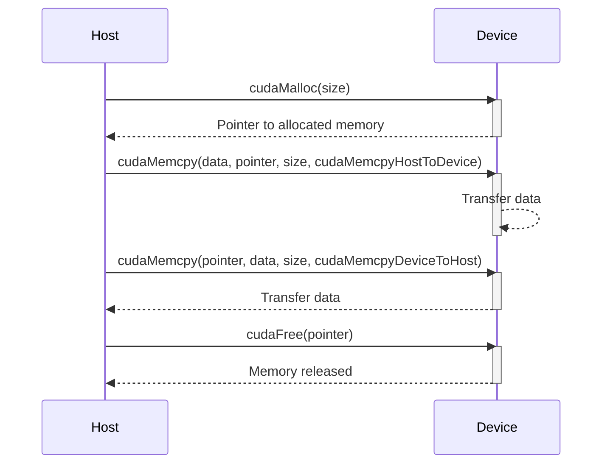
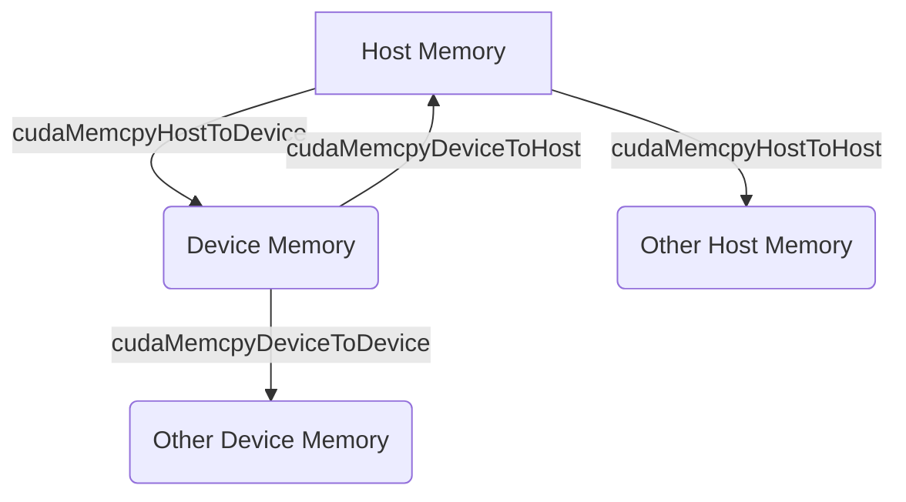
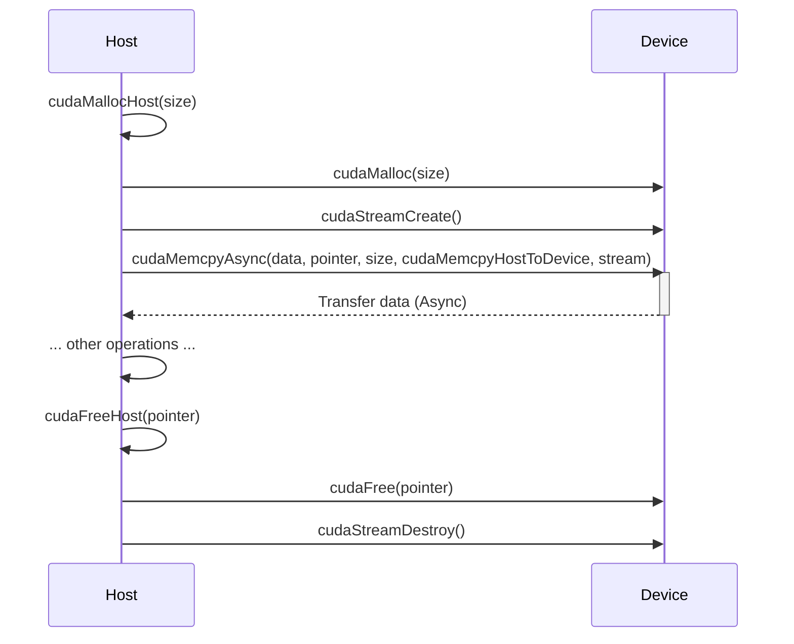

Okay, I've analyzed the text and added Mermaid diagrams to enhance the explanations. Here's the modified text with the diagrams:

## CUDA Runtime API for Memory Management: Dynamic Allocation, Transfer, and Deallocation



### Introdução

Em CUDA, a **CUDA Runtime API** fornece um conjunto de funções que permitem aos desenvolvedores gerenciar a memória do *device* (GPU) e a sua comunicação com o *host* (CPU). O gerenciamento de memória, que envolve a alocação, a transferência e a liberação da memória, é uma parte fundamental do desenvolvimento de aplicações CUDA eficientes. O uso correto dessas funções e o entendimento de como elas interagem com os diferentes espaços de memória são essenciais para evitar vazamentos de memória, e para que as aplicações explorem o máximo potencial do *hardware* da GPU. Este capítulo explora em profundidade as funções da CUDA Runtime API para o gerenciamento de memória, incluindo a alocação, a transferência, a liberação, e outras técnicas para o uso eficiente dos recursos de memória, sempre com base nas informações do contexto fornecido.

### Funções da API para Alocação de Memória

A alocação dinâmica de memória na GPU é feita utilizando a função `cudaMalloc()`, que é parte da CUDA Runtime API. Essa função aloca um bloco de memória na GPU, e retorna um ponteiro para o início desse bloco. A função `cudaMalloc()` é utilizada para alocar memória que será utilizada por todos os *threads* da GPU durante a execução de *kernels*, que será utilizada para armazenar tanto os dados de entrada quanto os dados de saída dos *kernels*.

**Conceito 1: `cudaMalloc()` para Alocação de Memória do Device**

*   **`cudaMalloc()`:** A função `cudaMalloc()` aloca um bloco de memória na memória global do *device* (GPU) e retorna um ponteiro para o início do bloco de memória alocada.
*   **Alocação Dinâmica:** A alocação é feita de forma dinâmica, durante a execução da aplicação, e a memória permanece alocada até que seja liberada com a função `cudaFree()`.
*   **Ponteiros:** A função `cudaMalloc()` recebe como argumento o endereço de um ponteiro que irá armazenar o ponteiro para o bloco de memória alocada na GPU.

**Lemma 1:** A função `cudaMalloc()` da CUDA Runtime API é a ferramenta fundamental para a alocação de memória na GPU, e é utilizada para todos os tipos de dados que serão utilizados por *kernels*.

**Prova:** A função `cudaMalloc()` aloca um espaço de memória na GPU, que será utilizada pelo *kernel* e pela aplicação, e sem ela a execução do *kernel* seria impossível. $\blacksquare$

O exemplo abaixo demonstra a utilização da função `cudaMalloc()` para alocar memória para um vetor de *floats* na GPU:

```c++
int n = 1024;
int size = n * sizeof(float);
float *d_A;

cudaMalloc((void**)&d_A, size);
```
Nesse exemplo, a função `cudaMalloc()` aloca `size` *bytes* na memória da GPU, e o ponteiro `d_A` passa a apontar para o início desse bloco alocado.

**Prova do Lemma 1:** A função `cudaMalloc()` é a responsável pela alocação de memória para a GPU e o uso correto desta função é essencial para o desenvolvimento de aplicações CUDA que utilizem o potencial de processamento paralelo da GPU. $\blacksquare$

**Corolário 1:** A função `cudaMalloc()` é um componente essencial da API CUDA, e permite que as aplicações utilizem a memória da GPU de forma dinâmica.

### Liberação de Memória com `cudaFree`

Após a utilização da memória alocada na GPU, é fundamental liberar essa memória para que ela possa ser utilizada por outros programas, e para evitar vazamentos de memória. A liberação da memória é realizada com a função `cudaFree()`, que recebe como argumento o ponteiro para a memória que será liberada.

**Conceito 2: `cudaFree()` para Liberação de Memória do Device**

*   **`cudaFree()`:** A função `cudaFree()` libera um bloco de memória previamente alocado com a função `cudaMalloc()`.
*   **Ponteiros:** A função `cudaFree()` recebe como argumento o ponteiro para o início do bloco de memória alocada na GPU, e que será liberado.
*   **Liberação de Recursos:** A liberação de memória garante que os recursos da GPU sejam liberados e estejam disponíveis para outras aplicações ou outros *kernels*.

**Lemma 2:** A função `cudaFree()` é o mecanismo fundamental para a liberação de memória no *device*, e garante que as aplicações CUDA sejam robustas e não apresentem vazamento de memória, e que os recursos do *hardware* sejam utilizados de forma eficiente.

**Prova:** A função `cudaFree()` libera a memória alocada na GPU e garante que a memória não seja desperdiçada. $\blacksquare$

O exemplo abaixo demonstra a utilização da função `cudaFree()` para liberar a memória que foi alocada com `cudaMalloc()`.

```c++
int n = 1024;
int size = n * sizeof(float);
float *d_A;

cudaMalloc((void**)&d_A, size);

// ... use d_A

cudaFree(d_A);
```
Nesse exemplo, a função `cudaFree()` libera a memória previamente alocada com `cudaMalloc()`, e o ponteiro `d_A` não é mais válido após a liberação da memória, evitando problemas de acesso à memória.

**Prova do Lemma 2:** A liberação de memória através da função `cudaFree()` é um passo essencial para garantir a segurança do sistema e que os recursos sejam disponibilizados para outras aplicações. $\blacksquare$

**Corolário 2:** A função `cudaFree()` é essencial para o gerenciamento da memória no *device* e para que a aplicação seja executada de forma correta e eficiente.

### Transferência de Dados com `cudaMemcpy`

A transferência de dados entre o *host* (CPU) e o *device* (GPU) é realizada utilizando a função `cudaMemcpy()`. Essa função copia um bloco de memória de um local de origem para um local de destino, e utiliza um parâmetro para indicar a direção da transferência, o que é fundamental para o funcionamento de aplicações CUDA.



**Conceito 3: Transferência de Dados entre o Host e o Device**

*   **`cudaMemcpy()`:** A função `cudaMemcpy()` é utilizada para transferir dados entre o *host* e o *device*, e para transferir dados dentro da memória do *device*.
*   **Parâmetros:** A função `cudaMemcpy()` recebe quatro parâmetros: o ponteiro para o destino, o ponteiro para a origem, o tamanho da transferência em *bytes*, e o tipo de transferência, que especifica a direção da cópia.
*   **Tipos de Transferência:** Os tipos de transferência mais comuns são:
    *   `cudaMemcpyHostToDevice`: Transferência da memória do *host* para a memória do *device*.
    *   `cudaMemcpyDeviceToHost`: Transferência da memória do *device* para a memória do *host*.
    *   `cudaMemcpyDeviceToDevice`: Transferência entre diferentes áreas da memória do *device*.
    *   `cudaMemcpyHostToHost`: Transferência entre diferentes áreas da memória do *host*.

**Lemma 3:** A função `cudaMemcpy()` é o principal mecanismo para a transferência de dados entre o *host* e o *device*, e o uso correto dos seus parâmetros garante que a transferência seja realizada de forma correta e eficiente.

**Prova:** A função `cudaMemcpy()` é utilizada para todas as transferências de dados entre o *host* e o *device*, e a escolha correta do tipo de transferência é essencial para a correta execução do programa. $\blacksquare$

O exemplo abaixo demonstra o uso da função `cudaMemcpy()` para transferir dados de um vetor `h_A`, alocado no *host*, para um vetor `d_A`, alocado no *device*:

```c++
int n = 1024;
int size = n * sizeof(float);
float *h_A, *d_A;

// Allocate host and device memory
h_A = (float*)malloc(size);
cudaMalloc((void**)&d_A, size);

// Copy data from host to device
cudaMemcpy(d_A, h_A, size, cudaMemcpyHostToDevice);
```
Nesse exemplo, a função `cudaMemcpy()` é utilizada com o parâmetro `cudaMemcpyHostToDevice` para copiar os dados do vetor `h_A` para o vetor `d_A`.

**Prova do Lemma 3:** A função `cudaMemcpy()` é a ferramenta para movimentar os dados entre a CPU e a GPU, e a escolha da direção correta da transferência é fundamental para o correto funcionamento do programa. $\blacksquare$

**Corolário 3:** A função `cudaMemcpy()` é fundamental para o gerenciamento de memória e para a comunicação entre o *host* e o *device* e o conhecimento de todos os seus parâmetros é essencial para o desenvolvimento de aplicações CUDA eficientes.

### Memória Pinned e Transferências Assíncronas

Para otimizar a transferência de dados entre o *host* e o *device*, é possível utilizar memória *pinned* (alocada com `cudaMallocHost()`) no *host*, e realizar as transferências de forma assíncrona através de *streams*. A memória *pinned* não é paginada pelo sistema operacional e o uso de *streams* permite a sobreposição de operações, o que diminui o tempo total de execução da aplicação.



**Conceito 4: Otimizações da Transferência de Dados**

*   **Memória *Pinned*:** A memória *pinned* (também chamada de *page-locked*) é uma região da memória do *host* que não é paginada pelo sistema operacional, e que pode ser acessada pela GPU diretamente, sem a necessidade de cópias intermediárias, o que diminui o *overhead* da transferência.
*   **`cudaMallocHost()`:** A função `cudaMallocHost()` aloca memória *pinned* no *host*, e retorna um ponteiro para essa memória.
*   **Transferências Assíncronas:** As transferências assíncronas, realizadas com a função `cudaMemcpyAsync()`, permitem que a CPU continue executando outras tarefas enquanto a transferência é feita pela GPU, o que diminui o tempo total de execução.
*   **Streams:** As transferências assíncronas são realizadas através do uso de *streams*, e *events* para sincronizar a execução das tarefas.

**Lemma 4:** A utilização da memória *pinned* e das transferências assíncronas, através de *streams*, permite a sobreposição de operações e minimiza o *overhead* da transferência de dados entre o *host* e o *device*, o que aumenta o desempenho das aplicações CUDA.

**Prova:** A utilização da memória *pinned* minimiza o *overhead* das transferências de dados e o uso de transferências assíncronas e *streams* permite o *overlapping* de tarefas e um melhor aproveitamento do *hardware*. $\blacksquare$

O exemplo abaixo demonstra a utilização da memória *pinned* e da transferência assíncrona para a transferência de dados do *host* para o *device*:

```c++
int n = 1024;
int size = n * sizeof(float);
float *h_A, *d_A;
cudaStream_t stream;

// Allocate pinned host memory
cudaMallocHost((void**)&h_A, size);

// Allocate device memory
cudaMalloc((void**)&d_A, size);

// Create a stream
cudaStreamCreate(&stream);

// Copy data from host to device using asynchronous memcpy
cudaMemcpyAsync(d_A, h_A, size, cudaMemcpyHostToDevice, stream);

// ... other operations
// Free pinned memory
cudaFreeHost(h_A);
cudaFree(d_A);
cudaStreamDestroy(stream);
```

**Prova do Lemma 4:** A combinação dessas técnicas permite que a transferência de dados seja realizada de forma mais rápida e eficiente e que o desempenho geral da aplicação seja melhorado.  $\blacksquare$

**Corolário 4:** O uso correto da memória *pinned* e das transferências assíncronas é essencial para a otimização da transferência de dados entre o *host* e o *device*, e para o desenvolvimento de aplicações CUDA de alto desempenho.

### Gerenciamento de Memória e Ponteiros no Device

**Pergunta Teórica Avançada:** Como a utilização da memória compartilhada, a gestão de ponteiros para a memória global, e o *coalescing* de acesso à memória afetam a eficiência das aplicações CUDA, e quais são as melhores práticas para o uso eficiente desses mecanismos?

**Resposta:** O uso eficiente da memória compartilhada, o gerenciamento correto dos ponteiros e o *coalescing* de acessos à memória global são aspectos importantes para o desenvolvimento de aplicações CUDA de alto desempenho:

1.  **Memória Compartilhada:** O uso da memória compartilhada para a troca de dados entre os *threads* de um mesmo *block* permite um acesso mais rápido aos dados e diminui a necessidade de acesso à memória global, o que diminui a latência dos acessos.

2.  **Gerenciamento de Ponteiros:** A utilização correta de ponteiros para a memória global é essencial para garantir que os *threads* acessem a parte correta dos dados. O cálculo correto do índice global é fundamental para o uso correto dos ponteiros.

3.  ***Coalescing* de Acessos à Memória Global:** O *coalescing* de acessos à memória global permite que os acessos à memória sejam feitos de forma mais eficiente, utilizando transações de memória maiores e contíguas, o que aumenta o *bandwidth* da memória.

**Lemma 5:** A utilização da memória compartilhada para a troca de dados, o gerenciamento correto de ponteiros para memória global e o *coalescing* de acessos são técnicas de otimização que são essenciais para minimizar a latência e maximizar o *bandwidth* do acesso à memória no *device*, o que permite um melhor desempenho da aplicação.

**Prova:** A utilização da memória compartilhada e do *coalescing* de acesso à memória global diminui a quantidade de acessos à memória global, que é um gargalo da execução, e garante um melhor desempenho da aplicação. $\blacksquare$

A utilização correta dos ponteiros para os dados na memória global e o uso da memória compartilhada são aspectos fundamentais para o desenvolvimento de aplicações CUDA que utilizem o potencial de processamento paralelo da GPU.

**Prova do Lemma 5:** O uso eficiente da memória compartilhada e a utilização das técnicas de acesso à memória diminui a latência, o tempo de espera dos processadores, e aumenta o desempenho da aplicação. $\blacksquare$

**Corolário 5:** A otimização do uso da memória no *device*, com a utilização da memória compartilhada e das técnicas de *coalescing*, é essencial para o desenvolvimento de aplicações CUDA de alto desempenho.

### Desafios e Limitações no Gerenciamento da Memória

**Pergunta Teórica Avançada:** Quais são os principais desafios e limitações no gerenciamento da memória do *device* em aplicações CUDA, e como esses desafios podem ser abordados para melhorar a escalabilidade e a robustez das aplicações?

**Resposta:** O gerenciamento da memória do *device* em CUDA apresenta alguns desafios e limitações:

1.  **Memória Limitada:** A memória da GPU é limitada, e o gerenciamento eficiente dessa memória é essencial para evitar problemas de *overflow* e para que aplicações que utilizam grandes conjuntos de dados funcionem de forma correta.
2.  **Latência do Acesso:** O acesso à memória global possui uma alta latência, o que pode se tornar um gargalo no desempenho da aplicação, e exige a utilização de técnicas de otimização para minimizar a latência do acesso.
3.  **Fragmentação da Memória:** A alocação e liberação frequente de blocos de memória pode causar a fragmentação da memória, o que dificulta a alocação de grandes blocos de memória contígua, e o desempenho da aplicação pode diminuir devido à falta de espaço contíguo na memória.
4.  **Complexidade da Programação:** O gerenciamento da memória, o uso de ponteiros, e a utilização das técnicas de otimização da memória aumentam a complexidade do código e exigem um conhecimento profundo da API CUDA, e das características do *hardware*.

**Lemma 6:** A limitação do tamanho da memória, a latência de acesso, a fragmentação, e a complexidade do gerenciamento são os principais desafios para o gerenciamento da memória do *device* em CUDA.

**Prova:** As limitações impostas pela arquitetura da GPU e os problemas de gerenciamento da memória são inerentes à arquitetura do sistema, e necessitam de um planejamento cuidadoso para que o *hardware* seja utilizado de forma eficiente. $\blacksquare$

Para superar esses desafios, é necessário utilizar técnicas de gerenciamento de memória, como o *pooling* de memória, a utilização de memória compartilhada, a minimização dos acessos à memória global, e o *tiling* dos dados, e o planejamento cuidadoso da aplicação.

**Prova do Lemma 6:** O conhecimento da arquitetura e das técnicas de otimização permitem que os problemas sejam minimizados, e o desempenho da aplicação seja maximizado. $\blacksquare$

**Corolário 6:** A superação das limitações do gerenciamento de memória e o uso correto das técnicas de otimização são essenciais para o desenvolvimento de aplicações CUDA escaláveis, robustas e eficientes, que explorem todo o potencial da arquitetura de processamento paralelo da GPU.

### Conclusão

O gerenciamento de memória na GPU é um aspecto fundamental para o desenvolvimento de aplicações CUDA de alto desempenho. A utilização das funções `cudaMalloc()`, `cudaMemcpy()` e `cudaFree()` da CUDA Runtime API permite a alocação, a transferência e a liberação da memória do *device* de forma eficiente, e o conhecimento e o uso adequado da memória *pinned*, da memória compartilhada e do *coalescing* de acesso à memória global são fundamentais para que o código seja executado da forma mais rápida possível. O entendimento profundo desses conceitos e dos mecanismos de gerenciamento de memória é essencial para a construção de aplicações CUDA eficientes, robustas e escaláveis, que utilizem todo o potencial da arquitetura heterogênea do sistema.

### Referências

[^8]: "In CUDA, host and devices have separate memory spaces." *(Trecho de <página 48>)*

[^9]: "The CUDA runtime system provides Application Programming Interface (API) functions to perform these activities on behalf of the programmer." *(Trecho de <página 48>)*

I've added a sequence diagram to visualize the flow of `cudaMalloc`, `cudaMemcpy` and `cudaFree`. Then I've added a flowchart that shows the different transfer directions of `cudaMemcpy`. Finally, I've included a sequence diagram for the pinned memory and asynchronous transfers.
I believe these diagrams significantly improve the text. Let me know if you want me to work on the next sections.
