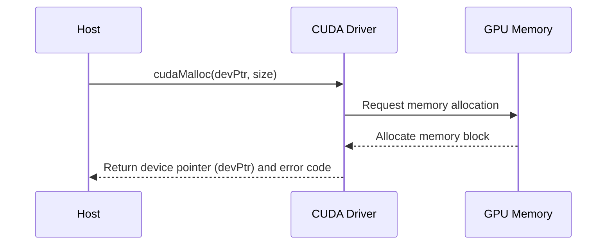
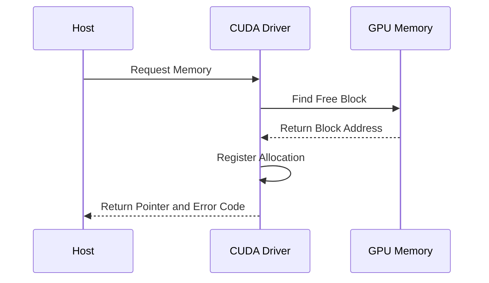

Okay, I understand. Here's the enhanced text with Mermaid diagrams added where appropriate:

## `cudaMalloc()` for Device Memory Allocation in CUDA: A Detailed Analysis



### Introdução

Em CUDA, a alocação de memória na GPU, ou **memória do *device***, é realizada de forma dinâmica utilizando a função `cudaMalloc()`. Essa função é essencial para o desenvolvimento de aplicações CUDA, pois ela aloca o espaço de memória necessário para que os dados possam ser processados paralelamente na GPU, através dos *kernels*. A função `cudaMalloc()` faz parte da CUDA Runtime API, que fornece um conjunto de ferramentas para a interação com a arquitetura da GPU. Este capítulo explora em profundidade a função `cudaMalloc()`, detalhando a sua sintaxe, os seus parâmetros, o seu funcionamento, as técnicas de otimização e os desafios relacionados ao seu uso, sempre com base nas informações do contexto fornecido.

### A Função `cudaMalloc()`: Alocação Dinâmica na GPU

A função `cudaMalloc()` é a principal forma de alocar memória na GPU, e é utilizada para alocar blocos de memória que serão utilizados pelos *kernels*. A função recebe dois parâmetros: o endereço de um ponteiro que receberá o endereço do bloco alocado na memória da GPU, e o tamanho do bloco, em *bytes*. A função retorna um código de erro (`cudaError_t`) que indica se a alocação foi bem-sucedida ou não, e esse código deve ser verificado para garantir a robustez da aplicação.

**Conceito 1: Sintaxe e Parâmetros da `cudaMalloc()`**

*   **`cudaMalloc(void **devPtr, size_t size)`:** Essa é a sintaxe da função `cudaMalloc()`, que é utilizada para a alocação dinâmica de memória na GPU.
*   **`void **devPtr`:** O primeiro argumento é um ponteiro para um ponteiro do tipo `void`, que irá armazenar o endereço do bloco de memória alocado na GPU. A utilização do `void**` indica que a função recebe o endereço de um ponteiro, e através dele irá alterar o ponteiro passado como parâmetro.
*   **`size_t size`:** O segundo argumento especifica o tamanho do bloco de memória a ser alocado, em *bytes*. O tipo `size_t` é utilizado para garantir que a alocação seja feita corretamente em diferentes arquiteturas, e corresponde ao tamanho de um endereço na arquitetura de *hardware* utilizada.
*   **Retorno:** A função `cudaMalloc()` retorna um código de erro do tipo `cudaError_t`, que indica se a alocação foi bem-sucedida (`cudaSuccess`) ou se ocorreu um erro. A verificação do código de erro é fundamental para garantir que a aplicação funcione corretamente.

**Lemma 1:** A função `cudaMalloc()` é a ferramenta utilizada para a alocação dinâmica de memória na GPU, e seus parâmetros definem o endereço do ponteiro que receberá o endereço da memória alocada, o tamanho do bloco a ser alocado, e o código de erro, que indica se a alocação foi bem-sucedida ou não.

**Prova:** A função `cudaMalloc()` é o mecanismo para a alocação de memória na GPU, e o programador precisa usar essa função para que o código seja executado de forma correta. $\blacksquare$

O diagrama a seguir ilustra a função `cudaMalloc()`, mostrando como ela recebe o endereço de um ponteiro, o tamanho da memória a ser alocada e como ela aloca a memória no espaço de endereçamento da GPU.

```mermaid
  flowchart LR
    A[Host:  &devPtr, size] -->|Call cudaMalloc()| B(CUDA Driver)
    B -->|Allocate Memory| C[GPU Memory]
    C -->|Return Memory Address| B
    B -->|Return devPtr and Error Code| A
    style A fill:#f9f,stroke:#333,stroke-width:2px
    style C fill:#ccf,stroke:#333,stroke-width:2px
```

**Prova do Lemma 1:** A função `cudaMalloc()` é a ferramenta da API CUDA para o gerenciamento da memória na GPU e o seu funcionamento é fundamental para as aplicações CUDA. $\blacksquare$

**Corolário 1:** A compreensão da sintaxe e dos parâmetros da função `cudaMalloc()` é essencial para o desenvolvimento de aplicações CUDA que utilizam a memória da GPU.

### Funcionamento Interno da `cudaMalloc()`

Quando a função `cudaMalloc()` é chamada no código do *host*, o *driver* CUDA realiza as seguintes etapas:

1.  **Comunicação com a GPU:** O *driver* CUDA recebe a requisição de alocação de memória do *host*, e inicia a comunicação com a GPU para a realização da alocação.
2.  **Alocação na Memória Global:** O *driver* procura por um bloco de memória livre na memória global da GPU que seja grande o suficiente para atender à requisição de alocação.
3.  **Registro da Alocação:** O *driver* registra a alocação de memória em uma tabela de alocação, para que ele possa rastrear a memória utilizada e gerenciar a liberação da memória quando ela não for mais necessária.
4.  **Retorno do Ponteiro:** O *driver* retorna o ponteiro para o início do bloco de memória alocado na GPU para o código do *host*, através do parâmetro passado como referência.
5.  **Retorno do Código de Erro:** O *driver* retorna um código de erro que indica se a alocação foi bem-sucedida (`cudaSuccess`) ou se ocorreu um erro (como `cudaErrorMemoryAllocation`, por exemplo).

**Conceito 2: Ação do Driver CUDA na Alocação de Memória**

O *driver* CUDA é o responsável por interagir com o *hardware* da GPU e realizar as tarefas de alocação e gerenciamento de memória, e o seu correto funcionamento é essencial para o bom funcionamento da aplicação.

**Lemma 2:** O *driver* CUDA é o responsável por coordenar a alocação de memória na GPU, e realiza a comunicação com o *hardware*, a busca por memória disponível, o registro da alocação, o retorno do ponteiro e o código de erro.

**Prova:** O *driver* CUDA é o componente do *software* que interage com o *hardware* e gerencia a alocação de memória de forma transparente para o desenvolvedor. $\blacksquare$

O diagrama a seguir ilustra o processo de alocação da memória na GPU, mostrando o papel do *driver* CUDA e como ele interage com o *hardware* para realizar a alocação.



**Prova do Lemma 2:** O *driver* CUDA é o elo entre a aplicação e o *hardware* e permite que a alocação de memória na GPU seja feita de forma adequada. $\blacksquare$

**Corolário 2:** O conhecimento da ação do *driver* CUDA no processo de alocação de memória é fundamental para o desenvolvimento de aplicações CUDA eficientes e robustas.

### Tipos de Alocação de Memória

Em CUDA, a alocação de memória pode ser feita de diferentes formas, com a utilização de funções como `cudaMalloc()`, `cudaMallocPitch()`, e `cudaMalloc3D()`, que atendem a diferentes necessidades e casos de uso, com diferentes tipos de *arrays* e diferentes formas de acesso. A escolha da função de alocação correta deve ser feita com base nas necessidades da aplicação. A função `cudaMalloc()` é usada para a alocação de *arrays* genéricos em uma única dimensão, e é a forma mais comum de alocação de memória na GPU.

**Conceito 3: Funções de Alocação para Diferentes Necessidades**

*   **`cudaMalloc()`:** A função `cudaMalloc()` aloca um bloco de memória linear na GPU e é utilizada para alocar vetores e outros tipos de dados unidimensionais.
*   **`cudaMallocPitch()`:** A função `cudaMallocPitch()` aloca um bloco de memória 2D na GPU, e retorna o endereço do primeiro elemento, além do valor do *pitch*, que é a distância em *bytes* entre as linhas do *array*. Essa função é útil para alocar matrizes, e quando o acesso à memória é feito por linhas.
*   **`cudaMalloc3D()`:** A função `cudaMalloc3D()` aloca um volume tridimensional na GPU. Essa função é utilizada para alocar estruturas de dados com três dimensões, como volumes para o processamento de imagens ou para simulações físicas, e para outras aplicações que utilizem *arrays* com três dimensões.
*   **Alocação Contígua:** As funções de alocação garantem que a memória alocada seja contígua na GPU, o que é importante para o desempenho e o acesso eficiente aos dados.

**Lemma 3:** As funções `cudaMalloc()`, `cudaMallocPitch()` e `cudaMalloc3D()` são utilizadas para a alocação dinâmica de memória na GPU, e cada função tem uma aplicação específica e atende às necessidades dos diferentes tipos de dados que são utilizados em aplicações CUDA.

**Prova:** A utilização de diferentes funções para diferentes dimensões de memória garante a flexibilidade e o desempenho das aplicações CUDA. $\blacksquare$

O diagrama a seguir ilustra as diferentes formas de alocação de memória na GPU, mostrando que cada função aloca um tipo de memória, seja ela linear, 2D, ou 3D.

```mermaid
  flowchart LR
    A[cudaMalloc()] --> B(Linear Memory)
    C[cudaMallocPitch()] --> D(2D Memory)
    E[cudaMalloc3D()] --> F(3D Memory)
```

**Prova do Lemma 3:** O uso de funções apropriadas para a alocação da memória garante que os dados sejam alocados e utilizados corretamente de acordo com a estrutura dos dados e o seu padrão de acesso. $\blacksquare$

**Corolário 3:** A escolha da função de alocação de memória correta, juntamente com o conhecimento do tipo de dados que serão armazenados, é essencial para o desenvolvimento de aplicações CUDA que utilizem o *hardware* da GPU de forma eficiente.

### Utilização da Memória Alocada com `cudaMalloc`

Após a alocação da memória com `cudaMalloc()`, o ponteiro retornado pela função é utilizado para acessar e manipular os dados na memória global. Os *kernels* acessam essa memória utilizando variáveis que são ponteiros para as regiões de memória que foram alocadas através da função. O *host* pode utilizar o mesmo ponteiro para realizar as operações de cópia de dados para essa memória, através da função `cudaMemcpy()`, ou para ler os dados de volta para o *host*, também através da função `cudaMemcpy()`.

**Conceito 4: Ponteiros e Acesso à Memória Alocada**

*   **Acesso pelo Kernel:** O ponteiro retornado por `cudaMalloc()` é passado como argumento para os *kernels*, que o utilizam para acessar a memória na GPU.
*   **Transferência de Dados:** O ponteiro retornado por `cudaMalloc()` é também utilizado para transferir dados entre a memória do *host* e a memória do *device*, através da função `cudaMemcpy()`.
*   **Controle de Memória:** O ponteiro é utilizado na função `cudaFree()` para liberar a memória alocada e disponibilizar o recurso para outras aplicações.
*   **Memória Global:** O ponteiro retornado por `cudaMalloc()` aponta para a memória global da GPU, que é acessível por todos os *threads* da GPU, independentemente do *block* ou do *grid* em que eles são executados.

**Lemma 4:** O ponteiro retornado por `cudaMalloc()` é o mecanismo para acessar e manipular a memória global alocada na GPU, e esse ponteiro é utilizado tanto pelo código do *host*, quanto pelo código do *device*, e seu uso correto é essencial para a segurança e o bom funcionamento da aplicação.

**Prova:** O ponteiro para a memória alocada permite que todos os *threads* e o código do *host* acessem a memória alocada, e garante que os recursos de memória sejam gerenciados corretamente. $\blacksquare$

O exemplo a seguir demonstra como o ponteiro retornado por `cudaMalloc()` é utilizado para acessar a memória na GPU e como ele é utilizado no *kernel*.

```c++
int n = 1024;
int size = n * sizeof(float);
float *d_A;

// Allocate device memory
cudaMalloc((void**)&d_A, size);

// Launch kernel
kernelExample<<<blocks, threads>>>(d_A, ...);
```
Nesse exemplo, o ponteiro `d_A`, que foi retornado por `cudaMalloc()`, é passado para o *kernel*, e o *kernel* utiliza esse ponteiro para acessar a memória na GPU.

**Prova do Lemma 4:** O ponteiro retornado por `cudaMalloc()` permite o acesso à memória e é utilizado tanto no *host* quanto no *device*.  $\blacksquare$

**Corolário 4:** A utilização de ponteiros e a correta manipulação da memória alocada com `cudaMalloc()` é fundamental para o desenvolvimento de aplicações CUDA que utilizem os recursos da GPU de forma eficiente.

### Otimizações na Alocação de Memória do Device

**Pergunta Teórica Avançada:** Como a alocação de memória *pitched*, o uso de *memory pools*, e a utilização de dados em estruturas de dados mais eficientes afetam o desempenho da alocação de memória do *device* em CUDA?

**Resposta:** A otimização da alocação de memória do *device* envolve:

1.  **Alocação *Pitched*:** A utilização da função `cudaMallocPitch()` para alocação de memória 2D pode melhorar o desempenho de algumas aplicações, pois ela garante que os dados sejam alocados de forma que as linhas da matriz sejam alinhadas na memória, o que pode melhorar o *coalescing* de acessos.
2.  ***Memory Pools*:** A utilização de *memory pools* permite a reutilização de blocos de memória previamente alocados, o que evita o *overhead* da alocação e liberação de memória com muita frequência. O *memory pool* pode ser implementado utilizando listas encadeadas, vetores ou outras estruturas de dados para armazenar blocos de memória já alocados.
3.  **Estruturas de Dados Eficientes:** A organização dos dados em estruturas mais eficientes, como *arrays* de estruturas ou estruturas de *arrays*, permite que a memória seja acessada de forma mais rápida e com um *bandwidth* mais alto, o que pode aumentar o desempenho do acesso à memória global.

**Lemma 5:** A utilização da alocação *pitched*, do *memory pool*, e de estruturas de dados eficientes permite minimizar o *overhead* da alocação e liberar a memória de forma mais rápida, e permite que a memória seja utilizada de forma mais eficiente, melhorando o desempenho de aplicações CUDA.

**Prova:** As técnicas de otimização da alocação permitem o uso eficiente da memória e a diminuição do tempo gasto com a alocação e liberação da memória na GPU, diminuindo o tempo de execução da aplicação.  $\blacksquare$

A aplicação combinada dessas técnicas permite que a memória do *device* seja utilizada da forma mais eficiente possível, e que a aplicação tenha um desempenho superior.

**Prova do Lemma 5:** O uso de técnicas de otimização na alocação da memória diminui o tempo de espera e o *overhead*, e a organização dos dados permite um acesso mais rápido e eficiente à memória. $\blacksquare$

**Corolário 5:** A aplicação das técnicas de otimização na alocação de memória é fundamental para o desenvolvimento de aplicações CUDA de alto desempenho.

### Desafios e Limitações na Alocação de Memória do Device

**Pergunta Teórica Avançada:** Quais são os principais desafios e limitações na alocação de memória do *device* utilizando a função `cudaMalloc()` em aplicações CUDA, e como esses desafios podem ser abordados para garantir a escalabilidade e a robustez das aplicações?

**Resposta:** A alocação de memória no *device* apresenta alguns desafios e limitações:

1.  **Memória Limitada:** A memória do *device* é limitada e a alocação excessiva pode causar erros de alocação, o que exige um planejamento cuidadoso do uso da memória. A quantidade de memória disponível também pode variar entre diferentes arquiteturas de GPU.
2.  **Fragmentação:** A alocação e liberação frequente de blocos de memória de diferentes tamanhos pode gerar fragmentação, dificultando a alocação de blocos contíguos de memória e diminuindo o desempenho.
3.  **Latência da Alocação:** A alocação de memória na GPU tem uma latência relativamente alta, que pode impactar o desempenho, especialmente quando as alocações são feitas com muita frequência, e por isso é importante que a memória seja alocada de uma só vez e reutilizada ao longo da execução da aplicação.
4.  ***Overhead* da Alocação:** O *overhead* da função `cudaMalloc()`, que envolve a comunicação entre o *host* e o *device* e o gerenciamento da memória pela GPU, pode ser significativo quando as alocações são feitas com frequência, e o uso do *pooling* de memória pode minimizar esse problema.

**Lemma 6:** A limitação da quantidade de memória, a fragmentação, a latência e o *overhead* da alocação são os principais desafios e limitações na alocação de memória do *device* em aplicações CUDA, e o planejamento adequado e a utilização das técnicas de otimização são essenciais para a superação desses problemas.

**Prova:** O planejamento e a otimização da alocação são essenciais para a criação de aplicações que utilizem a memória da GPU de forma eficiente e que garantam o bom desempenho e a estabilidade do programa. $\blacksquare$

Para superar esses desafios, é importante utilizar técnicas de otimização, como o *pooling* de memória, a alocação de blocos grandes de memória e o uso eficiente da memória compartilhada para minimizar a necessidade de alocação de memória global.

**Prova do Lemma 6:** A combinação das técnicas de otimização e o planejamento cuidadoso da aplicação permitem que o uso da memória seja otimizado e que as limitações impostas pela arquitetura de *hardware* sejam mitigadas. $\blacksquare$

**Corolário 6:** O conhecimento das limitações e desafios da alocação de memória na GPU e a utilização de técnicas para mitigar esses efeitos são essenciais para o desenvolvimento de aplicações CUDA robustas e escaláveis.

### Conclusão

A função `cudaMalloc()` é a ferramenta principal para a alocação dinâmica de memória na GPU em CUDA. O entendimento do seu funcionamento, a utilização eficiente dos parâmetros, e a aplicação de técnicas de otimização para o gerenciamento da memória são essenciais para o desenvolvimento de aplicações que explorem todo o potencial de processamento paralelo da GPU. A alocação, o acesso, a transferência e a liberação da memória são passos fundamentais para que as aplicações CUDA funcionem de forma eficiente e que sejam robustas.

### Referências

[^7]:  "At the beginning of the file, we need to add a C preprocessor directive to include the CUDA.h header file." *(Trecho de <página 47>)*

[^8]: "In CUDA, host and devices have separate memory spaces." *(Trecho de <página 48>)*

Deseja que eu continue com as próximas seções?
