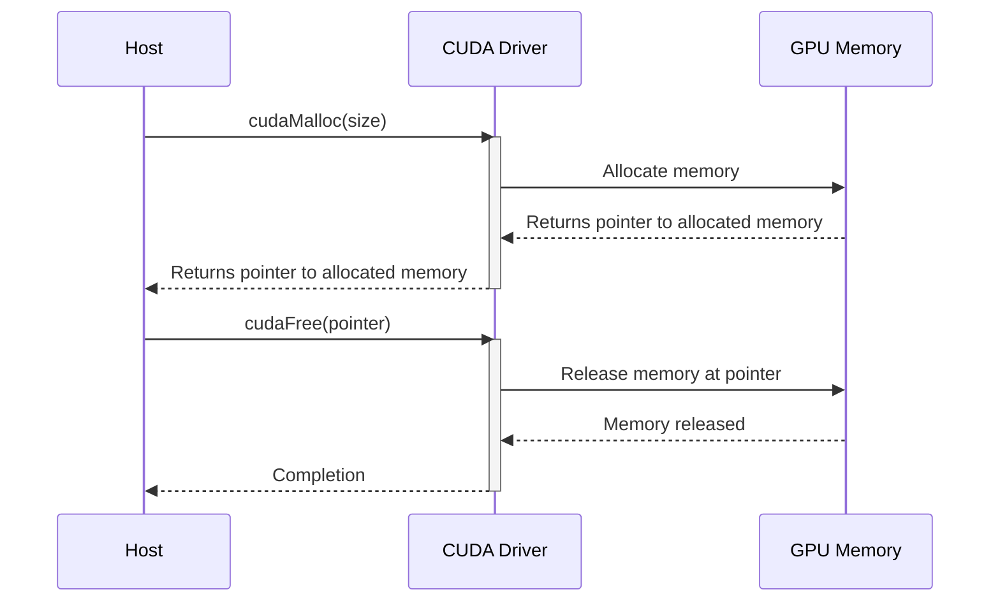
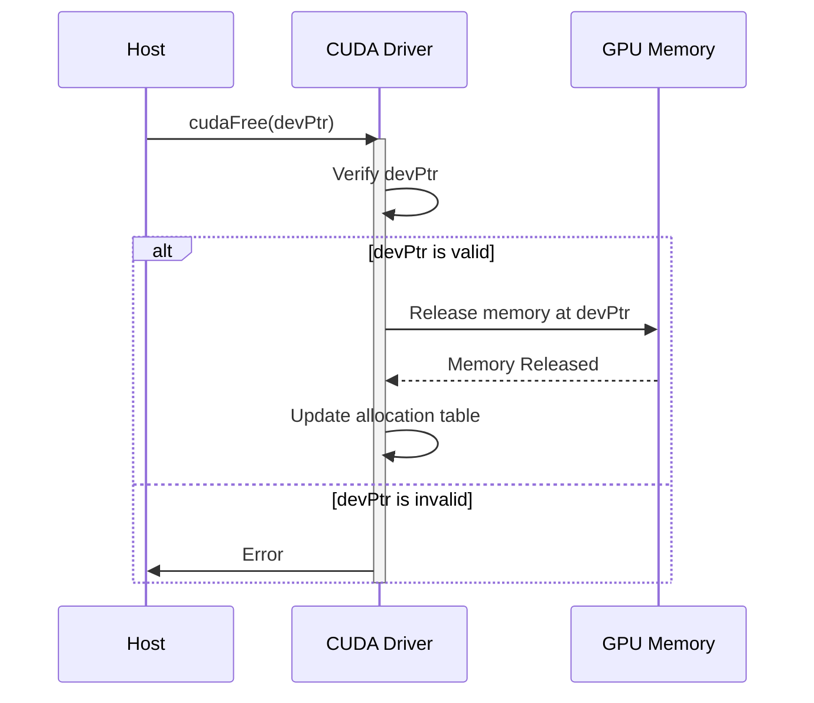

Okay, here's the enhanced text with Mermaid diagrams added:

## `cudaFree()` for Device Memory Deallocation in CUDA: Releasing GPU Resources



### Introdução

Em CUDA, a liberação de memória alocada na GPU, também chamada de **memória do *device***, é realizada através da função `cudaFree()`. Essa função é fundamental para garantir o uso eficiente dos recursos da GPU e para evitar vazamentos de memória. O uso correto da função `cudaFree()` é tão importante quanto a alocação de memória com `cudaMalloc()`, e é uma prática fundamental para o desenvolvimento de aplicações CUDA robustas, que exploram o máximo potencial do *hardware* da GPU. Este capítulo detalha o funcionamento da função `cudaFree()`, explorando a sua sintaxe, os seus parâmetros, a importância da liberação da memória, os desafios relacionados ao seu uso, e as melhores práticas para o desenvolvimento de aplicações CUDA que gerenciem a memória de forma eficiente, sempre com base nas informações do contexto fornecido.

### A Função `cudaFree()`: Liberação de Memória na GPU

A função `cudaFree()` é utilizada para liberar a memória que foi previamente alocada na memória global do *device* (GPU) utilizando a função `cudaMalloc()`. Ao contrário da alocação, a liberação de memória não retorna um código de erro, e a utilização da função com um ponteiro para memória não alocada pode causar erros de execução e outros comportamentos inesperados, o que exige um planejamento cuidadoso para que a função seja utilizada de forma correta.

**Conceito 1: Sintaxe e Parâmetros da `cudaFree()`**

*   **`cudaFree(void *devPtr)`:** A função `cudaFree()` recebe como parâmetro um ponteiro do tipo `void*`, que aponta para o início do bloco de memória alocada no *device* que deve ser liberado, o que indica que a função não exige nenhum tipo específico de dado.
*   **Liberação de Memória:** A função `cudaFree()` libera o bloco de memória associado ao ponteiro passado como parâmetro, e torna o bloco disponível para futuras alocações.
*   **Ponteiro Inválido:** Após a chamada da função `cudaFree()`, o ponteiro passado como argumento não deve mais ser utilizado, pois o seu conteúdo não é mais válido. O uso do ponteiro após a liberação da memória pode causar erros de execução, e deve ser evitado.
*   **`void*`:** A utilização do tipo `void*` para o ponteiro indica que a função aceita qualquer tipo de ponteiro para a memória alocada no *device*.

**Lemma 1:** A função `cudaFree()` é a ferramenta essencial para liberar a memória alocada no *device* com `cudaMalloc()`, e o uso correto dessa função é fundamental para evitar vazamentos de memória e garantir a robustez da aplicação CUDA.

**Prova:** A liberação da memória é necessária para que o sistema operacional não fique sem recursos, o que poderia causar o mau funcionamento da aplicação, e a função `cudaFree()` é a responsável por essa liberação. $\blacksquare$

O exemplo a seguir demonstra a utilização da função `cudaFree()` para liberar a memória alocada na GPU:

```c++
int n = 1024;
int size = n * sizeof(float);
float *d_A;

// Allocate device memory
cudaMalloc((void**)&d_A, size);

// ... use d_A

// Free device memory
cudaFree(d_A);
```

Nesse exemplo, a memória alocada com `cudaMalloc()` para o vetor `d_A` é liberada utilizando a função `cudaFree()` ao final do seu uso, e a utilização da função é fundamental para a correção da aplicação.

**Prova do Lemma 1:** A função `cudaFree()` é a responsável por liberar a memória na GPU e garantir que ela seja reutilizada em outras aplicações ou em outras partes da mesma aplicação. $\blacksquare$

**Corolário 1:** O uso correto da função `cudaFree()` é essencial para o gerenciamento eficiente de memória nas aplicações CUDA, e para que os recursos do *hardware* sejam utilizados de forma otimizada.

### Funcionamento Interno da `cudaFree()`

Quando a função `cudaFree()` é chamada no código do *host*, o *driver* CUDA realiza as seguintes etapas:

1.  **Comunicação com a GPU:** O *driver* CUDA recebe a requisição de liberação de memória do *host* através da chamada da função `cudaFree()`, e inicia a comunicação com a GPU para que a liberação seja feita.
2.  **Liberação da Memória:** O *driver* verifica se o ponteiro passado como argumento para `cudaFree()` é um ponteiro válido, e que aponta para um bloco de memória previamente alocado com `cudaMalloc()`, e libera o bloco de memória.
3.  **Atualização da Tabela de Alocação:** O *driver* atualiza a tabela de alocação de memória da GPU, marcando o bloco de memória como livre, para que possa ser utilizada em futuras alocações.

**Conceito 2: Papel do Driver CUDA na Liberação de Memória**

O *driver* CUDA é o componente do *software* que interage com o *hardware* da GPU e gerencia a alocação e a liberação de memória. O *driver* é o responsável por garantir que a liberação da memória seja feita de forma correta, para que não ocorram vazamentos e outros problemas de memória.

**Lemma 2:** O *driver* CUDA é o responsável por gerenciar a liberação de memória, e ele verifica a validade do ponteiro, libera a memória no *hardware* da GPU, e atualiza a tabela de alocação para que a memória possa ser utilizada posteriormente.

**Prova:** O *driver* CUDA gerencia o *hardware* da GPU e é responsável por garantir que as funções da API CUDA sejam executadas de forma correta.  $\blacksquare$

O diagrama a seguir ilustra o processo de liberação de memória utilizando `cudaFree()`, mostrando como o *driver* CUDA interage com o *hardware* da GPU e realiza a liberação da memória de forma correta, de forma a garantir que a memória seja reutilizada em outras aplicações ou no mesmo programa.

**Prova do Lemma 2:** O *driver* CUDA é o componente do sistema que interage com o *hardware* da GPU e garante que a liberação da memória seja feita de forma adequada. $\blacksquare$

**Corolário 2:** O conhecimento do papel do *driver* CUDA no gerenciamento da liberação da memória é importante para o desenvolvimento de aplicações CUDA que utilizem os recursos de *hardware* de forma eficiente e otimizada.

### Utilização Correta de `cudaFree`
```mermaid
flowchart TD
    A[Start] --> B{Is memory allocated?};
    B -- Yes --> C{Is pointer valid?}
    C -- Yes --> D[cudaFree(devPtr)]
    D --> E[Memory Freed]
    C -- No --> F[Error: Invalid Pointer]
    B -- No --> G[Error: Memory Not Allocated]
    E --> H[End]
    F --> H
    G --> H
```
É fundamental utilizar a função `cudaFree()` de forma correta, para garantir que a memória seja liberada adequadamente e que não ocorram vazamentos, e que a aplicação funcione da forma esperada e sem erros. Alguns erros comuns que devem ser evitados são:

1.  **Liberação de Memória Não Alocada:** A tentativa de liberar memória com `cudaFree()` que não foi previamente alocada com `cudaMalloc()` pode gerar erros de execução e comportamentos inesperados da aplicação.
2.  **Liberação Dupla:** A tentativa de liberar a mesma região de memória duas vezes com `cudaFree()` pode causar a corrupção da memória e gerar erros de execução.
3.  **Liberação Incorreta de Ponteiros:** A tentativa de liberar um ponteiro inválido, ou um ponteiro que não aponta para uma memória alocada com `cudaMalloc()`, pode gerar erros de execução e comportamentos inesperados.
4.  **Verificação de Ponteiros:** Antes de liberar a memória com `cudaFree()`, é importante verificar se o ponteiro é válido, e que a memória realmente foi alocada com `cudaMalloc()`, e que não foi liberada anteriormente.

**Conceito 3: Erros Comuns e Boas Práticas**

*   **Verificação de Ponteiros:** Antes de chamar a função `cudaFree()`, é importante verificar se o ponteiro não é nulo, e se ele aponta para um bloco de memória que foi alocado com `cudaMalloc()`.
*   **Gerenciamento de Ponteiros:** O gerenciamento de ponteiros em aplicações CUDA é essencial para garantir que a memória seja alocada, utilizada e liberada de forma correta, e que não ocorram erros.
*   **Programação Defensiva:** É importante utilizar técnicas de programação defensiva, como a utilização de *assertions*, para detectar erros relacionados à alocação e liberação de memória.

**Lemma 3:** O uso correto da função `cudaFree()` exige o controle dos ponteiros e a verificação de sua validade antes da liberação da memória, para evitar erros de execução, vazamento de memória e outros problemas que podem ocorrer quando a memória não é gerenciada de forma correta.

**Prova:** A utilização correta da função `cudaFree()` garante que o código seja robusto e não apresente problemas de memória. $\blacksquare$

O exemplo a seguir demonstra um caso em que a liberação da memória é feita de forma incorreta, o que gera erros de execução:

```c++
int n = 1024;
int size = n * sizeof(float);
float *d_A;

cudaMalloc((void**)&d_A, size);
// ... use d_A
cudaFree(d_A);
cudaFree(d_A); // Error: double free
```
Nesse exemplo, a memória apontada pelo ponteiro `d_A` é liberada duas vezes, o que causa um erro de liberação dupla, que pode gerar corrupção da memória e outros problemas de execução.

**Prova do Lemma 3:** A utilização incorreta da função `cudaFree()` pode levar a erros difíceis de serem encontrados e que comprometem o funcionamento correto da aplicação.  $\blacksquare$

**Corolário 3:** O uso cuidadoso da função `cudaFree()` e a utilização de boas práticas de programação são essenciais para o desenvolvimento de aplicações CUDA robustas e sem vazamentos de memória.

### Implicações no Desempenho e na Escalabilidade

**Pergunta Teórica Avançada:** Como o *overhead* da alocação e liberação de memória com `cudaMalloc()` e `cudaFree()`, e como a fragmentação da memória do *device* afetam o desempenho e a escalabilidade de aplicações CUDA, e como esses desafios podem ser abordados na prática?

**Resposta:** O *overhead* da alocação e liberação de memória e a fragmentação da memória do *device* podem afetar o desempenho e a escalabilidade das aplicações CUDA:

1.  ***Overhead* de Alocação e Liberação:** A alocação e a liberação de memória na GPU, utilizando `cudaMalloc()` e `cudaFree()`, adicionam um *overhead* ao tempo de execução da aplicação, especialmente quando essas operações são realizadas com muita frequência, o que pode diminuir o desempenho.
2.  **Fragmentação da Memória:** A alocação e liberação de blocos de memória de diferentes tamanhos, principalmente quando isso ocorre de forma frequente, pode causar a fragmentação da memória, dificultando a alocação de blocos grandes de memória e diminuindo o desempenho da aplicação.
3.  **Latência:** A alocação e liberação da memória envolvem a comunicação entre a CPU e a GPU, que é feita através do barramento PCI-e, o que adiciona latência ao processo e diminui o desempenho da aplicação.

**Lemma 4:** O *overhead* da alocação e liberação, a fragmentação da memória e a latência da transferência são os principais problemas e limitações da utilização da memória do *device* através da função `cudaFree()`, e o uso eficiente dos recursos deve ser sempre o objetivo.

**Prova:** A utilização frequente da alocação e da liberação de memória pode gerar um grande *overhead* no tempo total de execução da aplicação e a fragmentação pode dificultar a utilização eficiente da memória. $\blacksquare$

Para minimizar esses problemas, é necessário utilizar técnicas de otimização, como o uso de *memory pools*, a alocação de blocos maiores de memória, a utilização de memória compartilhada para a troca de informações, o *tiling* dos dados, e a sobreposição de tarefas, de forma a diminuir o *overhead* da alocação e a utilização eficiente da memória.

**Prova do Lemma 4:** O conhecimento das limitações e a utilização das ferramentas de otimização são essenciais para que a aplicação funcione de forma eficiente, sem causar problemas de memória. $\blacksquare$

**Corolário 4:** A otimização da alocação e da liberação de memória é fundamental para o desenvolvimento de aplicações CUDA escaláveis, robustas e que utilizem o potencial da GPU de forma eficiente.

### Conclusão

A função `cudaFree()` é um componente fundamental da API CUDA, e é utilizada para liberar a memória alocada na GPU com a função `cudaMalloc()`. A utilização correta dessa função, juntamente com o entendimento dos desafios e limitações do gerenciamento de memória na GPU, são essenciais para o desenvolvimento de aplicações robustas, eficientes, e que utilizem todo o potencial do *hardware* da GPU. O uso correto das funções de alocação e liberação da memória é um passo essencial na criação de aplicações CUDA de alto desempenho.

### Referências

[^9]: "The CUDA runtime system provides Application Programming Interface (API) functions to perform these activities on behalf of the programmer." *(Trecho de <página 48>)*
