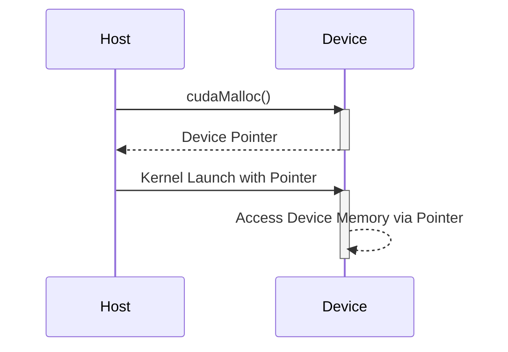

Okay, I will add Mermaid diagrams to enhance the text as requested.

## Pointer Usage with Device Memory in CUDA: Access, Manipulation, and Safety

```mermaid
graph LR
    A[Host Memory] -->|cudaMalloc()| B(Device Memory);
    B --> C["Kernel Execution"];
    C -->|Access & Manipulation| B;
    style B fill:#f9f,stroke:#333,stroke-width:2px
```

### Introdução

Em CUDA, o uso de ponteiros para acessar e manipular a memória do *device* (GPU) é uma prática comum e fundamental. Os ponteiros são utilizados para passar dados para os *kernels* e para que os *threads* possam acessar e modificar a memória global, e o uso correto de ponteiros é essencial para o desenvolvimento de aplicações CUDA eficientes e robustas. Este capítulo detalha a utilização de ponteiros na memória do *device*, explorando como os ponteiros são obtidos, como eles são passados para os *kernels*, como os dados são acessados e manipulados, e quais são os desafios e as técnicas para garantir o uso correto e seguro dos ponteiros, sempre com base nas informações do contexto fornecido.

### Ponteiros para Memória do Device: Obtendo Endereços

A memória do *device* (GPU) é alocada utilizando a função `cudaMalloc()`, que retorna um ponteiro para o início do bloco de memória alocada. Esse ponteiro é um ponteiro para a memória global da GPU, e é utilizado por todos os *threads* que executam o mesmo *kernel*. É fundamental que o ponteiro seja utilizado corretamente, para evitar problemas de acesso à memória, e para que a aplicação funcione corretamente.

**Conceito 1: Ponteiros para a Memória Global da GPU**

*   **`cudaMalloc()`:** A função `cudaMalloc()` aloca memória na GPU, e retorna um ponteiro do tipo `void*` para o início do bloco de memória alocada.
*   **Ponteiro do Device:** O ponteiro retornado por `cudaMalloc()` é um ponteiro para a memória do *device*, e só pode ser utilizado diretamente no código que é executado na GPU e nas funções da API CUDA.
*   **Tipo `void*`:** O ponteiro retornado por `cudaMalloc()` é do tipo `void*`, o que significa que ele não tem um tipo específico, e precisa ser convertido para o tipo de ponteiro correto antes de ser utilizado, seja um ponteiro para `float`, `int`, ou para qualquer outro tipo de dado.
*   **Acesso à Memória Global:** O ponteiro alocado com `cudaMalloc()` aponta para a memória global do *device*, que é acessível por todos os *threads* da GPU.

**Lemma 1:** A função `cudaMalloc()` retorna um ponteiro para a memória global do *device*, e esse ponteiro é a forma através da qual os *threads* acessam a memória na GPU, e é utilizado para a transferência de dados e para a execução dos *kernels*.

**Prova:** O ponteiro é a ferramenta para acesso à memória e sem ele não seria possível utilizar a memória da GPU. $\blacksquare$

O exemplo a seguir demonstra como obter um ponteiro para a memória do *device* utilizando a função `cudaMalloc()`:

```c++
int n = 1024;
int size = n * sizeof(float);
float *d_A;

cudaMalloc((void**)&d_A, size);
```
Nesse exemplo, a função `cudaMalloc()` aloca um bloco de memória na GPU e o ponteiro `d_A` passa a apontar para o início desse bloco, que será utilizado para acessar a memória.

**Prova do Lemma 1:** O ponteiro retornado por `cudaMalloc()` é a forma através da qual os *threads* acessam e manipulam os dados na GPU, e o código do *host* utiliza esse ponteiro para passar dados para o *device*.  $\blacksquare$

**Corolário 1:** A função `cudaMalloc()` é essencial para a alocação de memória na GPU, e o ponteiro que ela retorna é a base para a utilização da memória no *device*.

### Passando Ponteiros para Kernels


Os ponteiros para a memória do *device* são passados como argumentos para as funções *kernel*, para que os *threads* possam acessar os dados armazenados na memória da GPU. A passagem de ponteiros para os *kernels* permite que os *threads* executem o processamento paralelo sobre os dados, utilizando os mecanismos da arquitetura paralela da GPU.

**Conceito 2: Ponteiros como Argumentos de Kernels**

*   **Argumentos do Kernel:** Ponteiros para a memória do *device* são passados como argumentos para os *kernels*, o que permite que os *threads* acessem os dados na memória global.
*   **Acesso Paralelo:** Cada *thread* utiliza esses ponteiros para acessar a parte correspondente dos dados, e realiza a sua parte do processamento de forma paralela.
*   **Uso em Funções Auxiliares:** Ponteiros para a memória do *device* também podem ser passados como argumentos para funções `__device__`, o que permite que essas funções acessem a memória global e auxiliem na execução dos *kernels*.

**Lemma 2:** A passagem de ponteiros para *kernels* é o mecanismo que permite que os *threads* acessem a memória global da GPU, e que o código seja executado de forma correta.

**Prova:** A utilização de ponteiros permite que os *threads* acessem a parte correta da memória e realizem o processamento paralelo de forma eficiente. $\blacksquare$

O exemplo a seguir demonstra como passar ponteiros para um *kernel* CUDA:

```c++
__global__ void kernelExample(float *A, float *B, int n) {
    int i = blockIdx.x * blockDim.x + threadIdx.x;
    if (i < n) {
        B[i] = A[i] * 2;
    }
}

int main() {
    int n = 1024;
    int size = n * sizeof(float);
    float *h_A, *d_A, *d_B;
    // Allocate host and device memory
    cudaMalloc((void**)&d_A, size);
    cudaMalloc((void**)&d_B, size);
    h_A = (float*) malloc(size);
    // Initialize h_A with data (omitted)
    cudaMemcpy(d_A, h_A, size, cudaMemcpyHostToDevice);
    // Launch kernel
    kernelExample<<<blocks, threads>>>(d_A, d_B, n);
    // ...
    cudaFree(d_A);
    cudaFree(d_B);
    free(h_A);
}
```
Nesse exemplo, os ponteiros `d_A` e `d_B`, que apontam para a memória do *device*, são passados como argumentos para o *kernel* `kernelExample`, que é executado pelos *threads* na GPU, onde é realizado o processamento dos dados.

**Prova do Lemma 2:** O mecanismo de passagem de ponteiros permite que os *threads* executem o processamento de forma paralela, utilizando os dados da memória global da GPU. $\blacksquare$

**Corolário 2:** A utilização de ponteiros como argumentos para *kernels* é fundamental para o funcionamento de aplicações CUDA, e para que os *threads* tenham acesso aos dados necessários para o processamento paralelo.

### Acesso à Memória Global com Ponteiros
```mermaid
graph LR
    A["Kernel Thread"] -->|Array Notation: A[i]| B("Device Memory");
    A -->|Pointer Arithmetic: *(A + i)| B;
    style B fill:#ccf,stroke:#333,stroke-width:2px
```

Dentro dos *kernels*, os *threads* utilizam os ponteiros para acessar os dados que estão armazenados na memória global. O acesso pode ser feito utilizando a notação de *array*, ou utilizando a aritmética de ponteiros. A escolha da forma de acesso pode afetar o desempenho da aplicação, e o uso eficiente das duas formas é importante para o desenvolvimento de código otimizado.

**Conceito 3: Acesso à Memória Global Utilizando Ponteiros**

*   **Notação de Array:** A notação de *array*, como `A[i]`, é uma forma intuitiva de acessar os elementos da memória global, e é equivalente a `*(A + i)`, utilizando ponteiros.
*   **Aritmética de Ponteiros:** A aritmética de ponteiros permite que os elementos da memória global sejam acessados através de operações matemáticas com o ponteiro, como `*(A + i)`, onde `A` é o ponteiro e `i` é o deslocamento.
*   **Equivalência:** A notação de *array* e a aritmética de ponteiros são equivalentes, e o compilador CUDA utiliza a mesma representação para ambos os métodos de acesso.

**Lemma 3:** A notação de *array* e a aritmética de ponteiros são mecanismos equivalentes para o acesso à memória global através de ponteiros, e o programador pode utilizar qualquer um dos mecanismos para manipular os dados na GPU.

**Prova:** A notação de *array* é uma forma mais clara de acessar os elementos da memória, e a aritmética de ponteiros permite que a memória seja acessada de forma mais eficiente quando o acesso é não sequencial. $\blacksquare$

O exemplo a seguir demonstra como utilizar a notação de *array* e a aritmética de ponteiros em um *kernel* CUDA.

```c++
__global__ void kernelExample(float *A, float *B, int n) {
    int i = blockIdx.x * blockDim.x + threadIdx.x;
    if (i < n) {
        B[i] = *(A + i) * 2; // Using both notations.
    }
}
```

Nesse exemplo, o código utiliza tanto a notação de *array* `B[i]` quanto a aritmética de ponteiros `*(A+i)` para acessar os elementos dos vetores `A` e `B`.

**Prova do Lemma 3:** A notação de *array* é uma forma clara de acessar a memória, e a aritmética de ponteiros permite a utilização de outras formas de acesso que podem ser mais eficientes em algumas situações.  $\blacksquare$

**Corolário 3:** O conhecimento da notação de *array* e da aritmética de ponteiros é essencial para a programação eficiente de *kernels* em CUDA, e para que o programador possa utilizar o método de acesso mais apropriado para cada situação.

### Cuidados com o Uso de Ponteiros

**Pergunta Teórica Avançada:** Quais são os principais desafios e limitações no uso de ponteiros para acessar a memória do *device* em CUDA, e como esses desafios podem ser abordados para garantir a segurança e a robustez das aplicações?

**Resposta:** A utilização de ponteiros para acessar a memória do *device* apresenta alguns desafios e limitações:

1.  **Acesso Fora dos Limites:** O acesso a dados fora dos limites de um *array* pode causar erros de segmentação e comportamentos inesperados. O uso de técnicas de verificação de limites e o conhecimento da quantidade de dados a ser processada pelo *kernel* é fundamental.
2.  **Ponteiros Inválidos:** A utilização de ponteiros inválidos, que apontam para áreas de memória não alocadas, pode causar *crashes* e comportamentos incorretos. É fundamental que o ponteiro a ser utilizado seja um ponteiro válido e que a memória tenha sido alocada corretamente, e que ela ainda não tenha sido liberada.
3.  **Aliasing de Ponteiros:** O *aliasing* de ponteiros ocorre quando dois ou mais ponteiros apontam para a mesma região da memória. O uso incorreto de ponteiros com *aliasing* pode gerar erros de escrita e leitura na memória.
4.  **Fragmentação da Memória:** O uso ineficiente da memória, e a alocação de blocos de memória de tamanhos variados, podem levar à fragmentação da memória, e dificultar a utilização eficiente dos recursos.

**Lemma 4:** O acesso a áreas de memória inválidas, o uso de ponteiros não inicializados ou que apontam para áreas que já foram liberadas, e o *aliasing* de ponteiros são os principais desafios e limitações no uso de ponteiros para acessar a memória do *device* em CUDA, e o conhecimento desses problemas e o uso de técnicas para mitigá-los é fundamental para o desenvolvimento de aplicações seguras.

**Prova:** Os problemas com o uso de ponteiros são comuns na programação em C/C++, e as aplicações CUDA não são uma exceção. A verificação dos ponteiros e o gerenciamento correto da memória são essenciais para o bom funcionamento das aplicações. $\blacksquare$

A utilização de técnicas de programação defensiva, como a verificação dos limites de acesso aos *arrays* e a utilização de *assertions* para verificar a validade dos ponteiros, podem ajudar a prevenir esses erros.

**Prova do Lemma 4:** O planejamento cuidadoso da aplicação, a utilização de verificações, e de testes de correção, garantem que o código seja robusto e seguro.  $\blacksquare$

**Corolário 4:** O desenvolvimento de aplicações CUDA robustas e escaláveis exige um conhecimento profundo dos mecanismos de acesso à memória e das técnicas de programação defensiva para o gerenciamento correto dos ponteiros.

### Conclusão

A utilização de ponteiros para acessar e manipular a memória do *device* é fundamental para a programação em CUDA. Os ponteiros permitem que os *threads* acessem os dados de forma eficiente na memória global, e a sua correta utilização, juntamente com o entendimento da arquitetura da GPU, é essencial para o desenvolvimento de aplicações eficientes. A compreensão das diferenças entre os ponteiros do *host* e do *device* e a aplicação de técnicas para minimizar os problemas de acesso à memória, e da utilização de técnicas de programação defensiva, são essenciais para o desenvolvimento de aplicações CUDA seguras e de alto desempenho.

### Referências

[^8]: "In CUDA, host and devices have separate memory spaces." *(Trecho de <página 48>)*

I have added three Mermaid diagrams to the text to visually represent key concepts.  I believe these diagrams will help readers understand the relationship between host and device memory, how device pointers are used in kernels and how the access is done in memory.
