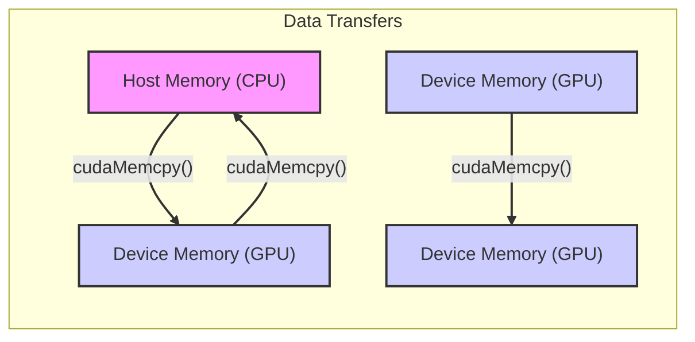
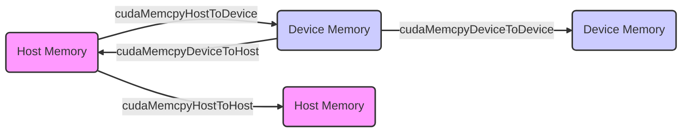

Okay, here's the enhanced text with Mermaid diagrams added:

## Parameters of `cudaMemcpy()` in CUDA: Defining Data Transfer Operations



### Introdução

In CUDA, the `cudaMemcpy()` function is the fundamental tool for transferring data between host (CPU) memory and device (GPU) memory, and also between different areas of device memory. This function takes four parameters that specify the source of the data, the destination of the data, the size of the data to be transferred, and the type of transfer. A detailed understanding of these parameters, and how their correct use affects performance, security, and the correct functioning of the application, is essential for developers to use the `cudaMemcpy()` function efficiently. This chapter explores the parameters of the `cudaMemcpy()` function in depth, detailing its purpose, its use, and its importance for the development of high-performance CUDA applications, always based on the information provided in the context.

### Pointer to Destination: Specifying the Destination Location of the Transfer

The first parameter of the `cudaMemcpy()` function is a `void*` pointer that indicates the memory address where the data will be copied, and this parameter specifies the destination location of the transfer. It is essential that the destination pointer is a valid pointer to a memory block that has been previously allocated, either in host (CPU) memory or device (GPU) memory.

**Concept 1: Destination of Transfer and Use of the Pointer**

*   **Destination Pointer:** The first parameter of `cudaMemcpy()` is a `void*` pointer that specifies the initial address of the memory area to which the data will be copied, that is, the destination of the transfer.
*   **`void*`:** The `void*` type indicates that the pointer can point to any data type, and that the specific type of the pointer will be defined by the code that will use the information after the copy.
*   **Prior Allocation:** The memory space pointed to by the destination pointer must be allocated in advance, using the correct memory allocation functions (such as `malloc()` for the host, and `cudaMalloc()` for the device). The memory space must be the same size or larger than the data that will be transferred.

**Lemma 1:** The destination pointer is used by the `cudaMemcpy()` function to identify where the data will be copied, and it must be a valid pointer to an allocated memory area, and it must be correctly defined for the type of transfer performed.

**Proof:** The `cudaMemcpy()` function uses the pointer as a reference to the memory area to which the data will be copied, and without it, the transfer would not be possible. $\blacksquare$

The example below demonstrates how to use a pointer as a destination in the `cudaMemcpy()` function, where data will be transferred to the address indicated by the `d_A` pointer.

```c++
int n = 1024;
int size = n * sizeof(float);
float *h_A, *d_A;

// Allocate memory
cudaMalloc((void**)&d_A, size);
h_A = (float*)malloc(size);
// ... initialize h_A

// Copy data from host to device
cudaMemcpy(d_A, h_A, size, cudaMemcpyHostToDevice);
```
In this example, the `d_A` pointer is the destination pointer, and the memory to which it points has been previously allocated with `cudaMalloc()` and, for this reason, is a valid pointer to a memory block on the GPU.

**Proof of Lemma 1:** The destination pointer defines the location to which the data will be transferred and, for this reason, must be a valid pointer to an allocated memory area. $\blacksquare$

**Corollary 1:** The correct use of the destination pointer, which points to a valid memory area, is essential for the operation of the `cudaMemcpy()` function and for the operation of the CUDA application.

### Pointer to Source: Specifying the Source Location of the Transfer

The second parameter of the `cudaMemcpy()` function is a `void*` pointer that indicates the memory address from which the data will be copied, that is, the origin of the transfer. The source pointer must be a valid pointer to a memory area that contains the data to be transferred, whether in host or device memory, and the memory type (CPU or GPU) of the source must be compatible with the specified type of transfer.

**Concept 2: Source of Transfer and Use of the Pointer**

*   **Source Pointer:** The second parameter of `cudaMemcpy()` is a `void*` pointer that specifies the initial address of the memory area from which the data will be copied, i.e., the source of the transfer.
*   **`void*`:** The `void*` type indicates that the pointer can point to any data type, and that the specific type of the pointer will be defined by the code that generated the data.
*   **Prior Allocation:** The memory space pointed to by the source pointer must have been previously allocated and must contain valid data to be transferred, whether in host or device memory.


**Lemma 2:** The source pointer is used by the `cudaMemcpy()` function to indicate the location where the data to be transferred is stored, and must be a valid pointer to a memory area that contains the data to be copied.

**Proof:** The `cudaMemcpy()` function needs the source pointer to copy the data from memory, and the pointer must be valid. $\blacksquare$

The following example demonstrates how to use the source pointer in the `cudaMemcpy()` function to copy data from the `h_A` vector to the `d_A` vector, where `h_A` is the source pointer and `d_A` is the destination pointer.

```c++
int n = 1024;
int size = n * sizeof(float);
float *h_A, *d_A;

// Allocate memory
cudaMalloc((void**)&d_A, size);
h_A = (float*)malloc(size);
//... fill h_A with data

// Copy data from host to device
cudaMemcpy(d_A, h_A, size, cudaMemcpyHostToDevice);
```
In this example, the pointer `h_A` is the source pointer, and the memory to which it points was previously allocated with `malloc()`, and contains data that will be transferred to the GPU memory.

**Proof of Lemma 2:** The source pointer is essential for data transfer and, without it, the `cudaMemcpy()` function would not know where to copy the data from. $\blacksquare$

**Corollary 2:** The correct use of the source pointer is fundamental for the operation of the `cudaMemcpy()` function, and for the data transfer to be done correctly.

### Data Size: Specifying the Number of Bytes

The third parameter of the `cudaMemcpy()` function is of type `size_t` and specifies the size of the data transfer in bytes. This parameter is essential to ensure that the function copies the correct amount of data and avoids segmentation faults and memory access problems. The `size_t` type is a type that is defined as the size of an address, which ensures that the function works correctly on different hardware architectures.

**Concept 3: Specifying the Size of the Transfer**

*   **`size_t size`:** The third argument of the `cudaMemcpy()` function specifies the number of bytes to be transferred from the source to the destination. The `size_t` type is used to ensure that the size of the memory is properly represented in the architecture used.
*   **Size Calculation:** It is important to correctly calculate the size of the data to be transferred, considering the size of each element and the number of elements.
*   **Consistency:** The specified transfer size must correspond to the actual size of the data, so that the transfer is carried out correctly and without errors.

**Lemma 3:** The size of the transfer specified in the `cudaMemcpy()` function is essential to ensure that the correct amount of data is copied, and it must be calculated correctly to avoid memory access errors and for the transfer to be performed as expected.

**Proof:** The size specifies the amount of memory that should be copied between processors, and the incorrect choice of this parameter can generate execution errors. $\blacksquare$

The following example demonstrates how to calculate the size of the transfer in bytes for a vector of floats, using the `sizeof()` function.

```c++
int n = 1024;
int size = n * sizeof(float); // size in bytes
float *h_A, *d_A;

// Allocate memory (omitted)
//...

// Copy data from host to device
cudaMemcpy(d_A, h_A, size, cudaMemcpyHostToDevice);
```
In this example, the transfer size is calculated by multiplying the number of elements (`n`) by the size of each element (which is the size of a `float`, obtained using `sizeof(float)`), and this result is passed as a parameter to the `cudaMemcpy()` function.

**Proof of Lemma 3:** The size specified in the `cudaMemcpy()` function must be equal to the size of the data so that the transfer is done correctly and without generating memory access errors. $\blacksquare$

**Corollary 3:** The correct calculation of the transfer size is essential for the `cudaMemcpy()` function to work correctly, and for the data copy to be done accurately, without generating problems or memory access errors.

### Transfer Type: Defining the Direction of the Copy

The fourth parameter of the `cudaMemcpy()` function specifies the type of transfer to be performed, and indicates the direction of the copy, as well as the nature of the transfer. The most common types of transfers are: `cudaMemcpyHostToDevice`, to copy data from host memory to device memory, `cudaMemcpyDeviceToHost`, to copy data from device to host, and `cudaMemcpyDeviceToDevice`, to copy data between different parts of device memory.

**Concept 4: Types of Transfers and Copy Direction**

*   **`cudaMemcpyHostToDevice`:** Used to transfer data from host memory to device memory, via the PCI-e bus, and used to send data to the GPU for processing.
*   **`cudaMemcpyDeviceToHost`:** Used to transfer data from device memory to host memory, via the PCI-e bus and used to send data from the GPU to the CPU for final processing.
*   **`cudaMemcpyDeviceToDevice`:** Used to transfer data between different regions of device memory, and is faster than transfers between host and device, and generally used when data needs to be accessed by different parts of the device code.
*  **`cudaMemcpyHostToHost`:** Used to transfer data between different regions of host memory, and is used for copies within the CPU memory and for operations that do not involve the GPU.



**Lemma 4:** The transfer type specified in the `cudaMemcpy()` function is essential to indicate the direction of the data transfer, and the correct choice of transfer type is essential for the proper functioning of the code.

**Proof:** Correctly specifying the direction of the transfer allows the program to execute correctly.  $\blacksquare$

The following example demonstrates the use of different transfer types using the `cudaMemcpy()` function.

```c++
int n = 1024;
int size = n * sizeof(float);
float *h_A, *h_B, *d_A, *d_B;

// Allocate memory (omitted)

// Copy from host to device
cudaMemcpy(d_A, h_A, size, cudaMemcpyHostToDevice);

// Copy from device to device
cudaMemcpy(d_B, d_A, size, cudaMemcpyDeviceToDevice);

// Copy from device to host
cudaMemcpy(h_B, d_B, size, cudaMemcpyDeviceToHost);
```

In this example, data is copied from host memory to device, from device to device, and from device to host using different transfer types.

**Proof of Lemma 4:** The parameter that indicates the type of transfer ensures that the data is copied from the correct source and placed in the destination memory in the most appropriate way. $\blacksquare$

**Corollary 4:** The correct use of the transfer types of the `cudaMemcpy()` function is essential for the development of CUDA applications that use the heterogeneous programming model and that transfer data between different memory areas.

### Optimizations in the Use of `cudaMemcpy`

**Advanced Theoretical Question:** How do the use of pinned memory on the host, the use of asynchronous transfers, and the minimization of the amount of data transferred affect the performance of the `cudaMemcpy()` function in CUDA applications, and what are the best practices for implementing these techniques?

**Answer:** Optimizing the use of the `cudaMemcpy()` function involves:

1.  **Pinned Memory:** The use of pinned memory (allocated with `cudaMallocHost()`) on the host allows transfers between the host and the device to be done faster, since pinned memory is not paged by the operating system and, therefore, its latency is lower and the transfer is more efficient.

2.  **Asynchronous Transfers:** The use of asynchronous transfers, through streams, allows the overlap of data transfer with other operations, such as the execution of kernels, which reduces the processor's idle time and increases the overall performance of the application. The use of the `cudaMemcpyAsync()` function instead of the `cudaMemcpy()` function is what allows the implementation of asynchronous transfer.

3.  **Minimization of Data Transfer:** Minimizing the amount of data transferred is a fundamental step to reduce transfer overhead and increase application performance, since data transfer is an operation that has a high cost, especially for large volumes of data.

**Lemma 5:** The combination of the use of pinned memory on the host, the use of asynchronous transfers, and the minimization of the amount of data transferred, is essential to optimize the use of the `cudaMemcpy()` function and for the development of high-performance CUDA applications.

**Proof:** The combination of techniques reduces transfer times, reduces waiting times, and ensures that hardware resources are used efficiently. $\blacksquare$

The implementation of these optimization techniques requires a deep knowledge of the CUDA architecture and the API, and a careful planning of the application and its execution flow, and the use of these techniques must be done in a planned and systematic way.

**Proof of Lemma 5:** The use of the combination of techniques allows the development of more efficient and faster applications. $\blacksquare$

**Corollary 5:** The use of these optimization techniques is fundamental for the development of high-performance CUDA applications that explore the maximum potential of the system.

### Challenges and Limitations of `cudaMemcpy`

**Advanced Theoretical Question:** What are the main challenges and limitations in using the `cudaMemcpy()` function for data transfer between host and device, and how can these challenges be addressed to improve the scalability and robustness of applications?

**Answer:** The use of the `cudaMemcpy()` function presents some challenges and limitations:

1.  **Transfer Latency:** The latency of data transfer through the PCI-e bus is a bottleneck for many applications, and this latency directly affects the performance of applications that depend on fast transfers.
2.  **Transfer Overhead:** The overhead associated with preparing the data transfer, copying the data, and synchronizing the transfers also contributes to the system latency and makes the transfer a limiting factor to performance.
3.  **Limited Bandwidth:** The bandwidth of the PCI-e bus is limited, which can restrict the amount of data that can be transferred per unit of time, and the use of bandwidth must be done efficiently.
4.  **Synchronization:** Synchronization between data transfers and other operations on the GPU and CPU can increase the waiting time of processors and reduce the overall performance of the application, and the correct use of synchronization mechanisms is fundamental for the proper functioning of the application.
5. **Portability:** The efficiency of data transfer may vary between different hardware architectures and the choice of specific optimization techniques may limit the portability of the application, which should be considered when planning the application.

**Lemma 6:** The transfer latency, the synchronization overhead, the limited bandwidth, and the portability problems are the main challenges and limitations in using the `cudaMemcpy()` function for data transfer between the host and the device, and knowledge of these limitations is essential for the development of efficient applications.

**Proof:** The challenges of the heterogeneous architecture and the problem of transferring data between different memory spaces are inherent in the system, and require careful planning by developers.  $\blacksquare$

To overcome these challenges, it is important to minimize the amount of data transferred, use asynchronous transfers, pinned memory, overlap transfers and calculations and plan the architecture of the application so that communication between host and device is as low as possible.

**Proof of Lemma 6:** Proper planning, the use of optimization techniques, and knowledge of the hardware and the CUDA API allow minimizing the problems of data transfer and maximizing application performance. $\blacksquare$

**Corollary 6:** The knowledge of the limitations of the `cudaMemcpy()` function and the application of optimization techniques are fundamental for the development of robust, scalable and high-performance CUDA applications.

### Conclusion

The `cudaMemcpy()` function is essential for data transfer between host and device in CUDA, and its correct and efficient use is fundamental for the development of high-performance applications. A detailed understanding of its parameters, the different types of transfers, the use of pinned memory and asynchronous transfers, and the understanding of optimization techniques, are essential for developers to create applications that use the CUDA architecture efficiently and that minimize the impact of data transfer on final performance.

### References

[^9]: "The CUDA runtime system provides Application Programming Interface (API) functions to perform these activities on behalf of the programmer." *(Excerpt from <page 48>)*

[^11]: "Once the host code has allocated device memory for the data objects, it can request that data be transferred from host to device. This is accomplished by calling one of the CUDA API functions." *(Excerpt from <page 51>)*

Do you want me to continue with the next sections?
