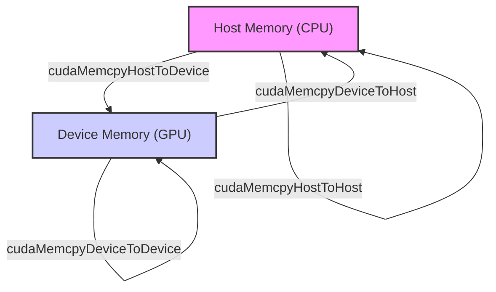
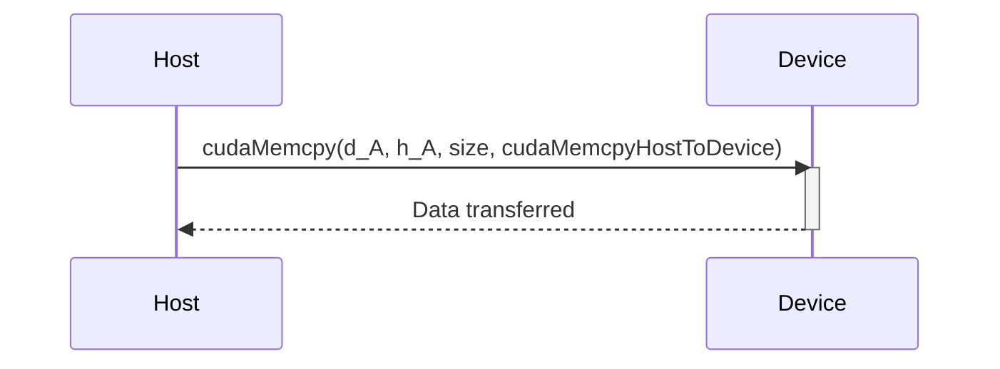
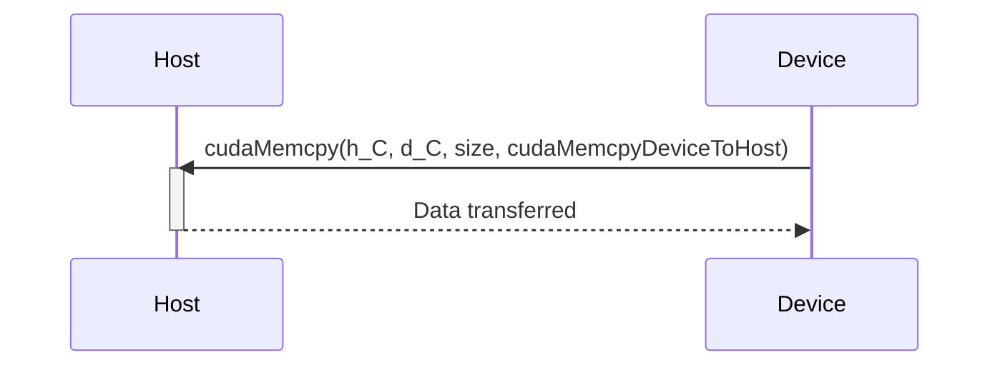
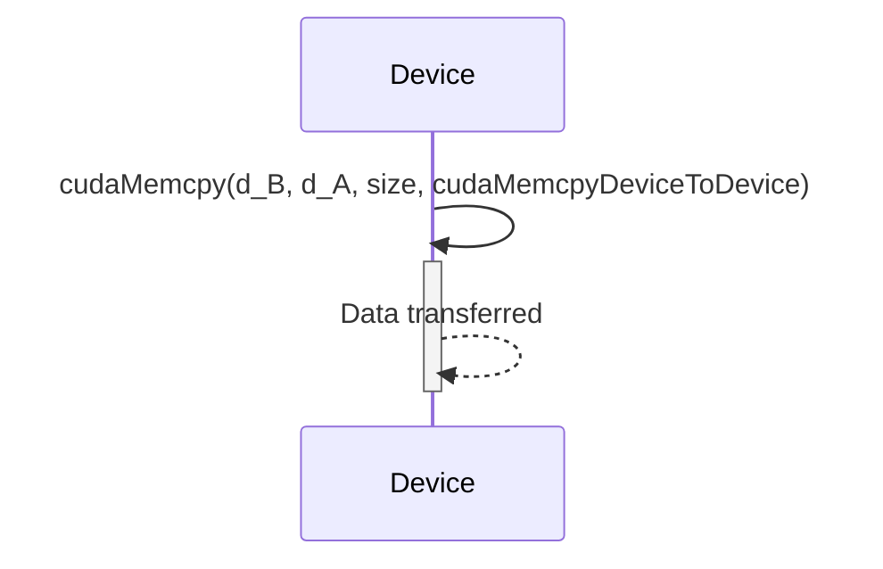
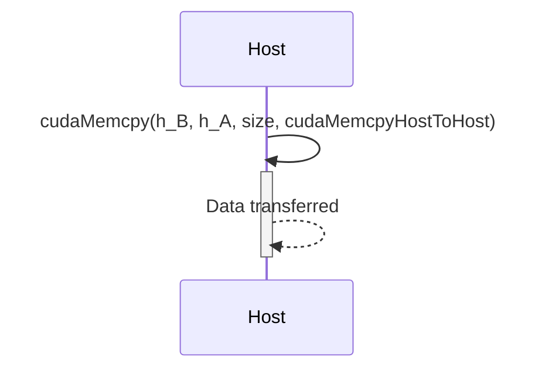

### Introdução

Em CUDA, a função `cudaMemcpy()` é o principal mecanismo para realizar a transferência de dados entre o *host* (CPU) e o *device* (GPU), e também entre diferentes áreas de memória do *device*. O parâmetro que define o **tipo de transferência** especifica a direção da transferência, o tipo de memória de origem e de destino, e, por isso, é fundamental para que a transferência de dados seja realizada de forma correta e eficiente. A escolha adequada do tipo de transferência é um passo essencial no desenvolvimento de aplicações CUDA que utilizam o modelo de computação heterogênea de forma eficiente e robusta. Este capítulo explora em profundidade os diferentes tipos de transferência suportados pela função `cudaMemcpy()`, detalhando as características de cada tipo, o seu uso, e as suas implicações para o desempenho das aplicações CUDA, sempre com base nas informações do contexto fornecido.

### Tipos de Transferência: Definições e Casos de Uso

A função `cudaMemcpy()` suporta quatro tipos principais de transferência, que são definidos por constantes da API CUDA: `cudaMemcpyHostToDevice`, `cudaMemcpyDeviceToHost`, `cudaMemcpyDeviceToDevice` e `cudaMemcpyHostToHost`. Cada um desses tipos de transferência é utilizado para uma finalidade específica, e a escolha correta do tipo de transferência é fundamental para que os dados sejam transferidos na direção adequada e para que a aplicação funcione corretamente.

**Conceito 1: Tipos de Transferência e a sua Direção**

*   **`cudaMemcpyHostToDevice`:** Esse tipo de transferência é utilizado para copiar dados da memória do *host* (CPU) para a memória do *device* (GPU), através do barramento PCI-e, e é utilizado para enviar os dados que serão utilizados pelos *kernels* na GPU.
*   **`cudaMemcpyDeviceToHost`:** Esse tipo de transferência é utilizado para copiar dados da memória do *device* (GPU) para a memória do *host* (CPU), através do barramento PCI-e, e é utilizado para retornar os resultados do processamento para a CPU.
*   **`cudaMemcpyDeviceToDevice`:** Esse tipo de transferência é utilizado para copiar dados entre diferentes áreas da memória do *device* (GPU), e é utilizada para cópias internas na GPU, geralmente, com uma latência menor.
*   **`cudaMemcpyHostToHost`:** Esse tipo de transferência é utilizado para copiar dados entre diferentes áreas da memória do *host* (CPU), e não envolve a GPU.

**Lemma 1:** A função `cudaMemcpy()` suporta quatro tipos de transferência, e cada tipo define a origem, o destino e o sentido da cópia de dados. A escolha correta do tipo de transferência é fundamental para o bom funcionamento da aplicação.

**Prova:** Cada tipo de transferência tem um destino específico e a sua escolha incorreta gera erros de execução e o mau funcionamento da aplicação. $\blacksquare$

O diagrama a seguir ilustra os quatro tipos de transferência da função `cudaMemcpy()`, mostrando como os dados são transferidos entre a memória do *host* e a memória do *device* e entre diferentes áreas da memória do mesmo processador.

**Prova do Lemma 1:** Cada tipo de transferência é utilizada para a movimentação de dados entre dois tipos de memória, e a utilização correta de cada tipo é fundamental para o bom funcionamento da aplicação. $\blacksquare$

**Corolário 1:** A compreensão dos diferentes tipos de transferência da função `cudaMemcpy()` é essencial para o desenvolvimento de aplicações CUDA que utilizam o modelo de programação heterogênea de forma correta.

### `cudaMemcpyHostToDevice`: Transferência para a GPU

O tipo de transferência `cudaMemcpyHostToDevice` é utilizado para transferir dados da memória do *host* (CPU) para a memória do *device* (GPU). Essa transferência é realizada através do barramento PCI-e, e é essencial para que os *kernels* na GPU tenham acesso aos dados que serão processados.

**Conceito 2: Transferência de Dados da CPU para a GPU**

*   **Direção da Transferência:** A direção da transferência é do *host* para o *device*, ou seja, os dados são copiados da memória da CPU para a memória da GPU.
*   **Utilização:** A transferência `cudaMemcpyHostToDevice` é utilizada quando dados que estão na memória do *host* precisam ser processados na GPU, através de um *kernel*.
*   **Barramento PCI-e:** A transferência de dados do *host* para o *device* utiliza o barramento PCI-e, o que pode apresentar um *overhead* dependendo da arquitetura do *hardware*.

**Lemma 2:** A transferência de dados do *host* para o *device*, utilizando `cudaMemcpyHostToDevice`, é essencial para que os *kernels* na GPU acessem os dados, e é utilizada para enviar para o *device* os dados que serão processados de forma paralela, como os vetores e matrizes.

**Prova:** Os *kernels* executados na GPU não conseguem acessar diretamente a memória do *host*, e por isso a transferência com `cudaMemcpyHostToDevice` é necessária. $\blacksquare$

O exemplo a seguir demonstra a utilização da função `cudaMemcpy()` com o tipo de transferência `cudaMemcpyHostToDevice`:

```c++
int n = 1024;
int size = n * sizeof(float);
float *h_A, *d_A;

// Allocate host and device memory (omitted)

// Copy data from host to device
cudaMemcpy(d_A, h_A, size, cudaMemcpyHostToDevice);
```
Nesse exemplo, a função `cudaMemcpy()` é utilizada para transferir os dados do vetor `h_A`, alocado na memória do *host*, para o vetor `d_A`, alocado na memória do *device*.

**Prova do Lemma 2:** A transferência de dados da CPU para a GPU é fundamental para que o processamento paralelo na GPU possa ser realizado. $\blacksquare$

**Corolário 2:** A utilização do tipo de transferência `cudaMemcpyHostToDevice` é essencial para o funcionamento de aplicações CUDA que exploram o modelo de programação heterogênea e que utilizam a GPU para processar dados da CPU.

### `cudaMemcpyDeviceToHost`: Transferência para a CPU

O tipo de transferência `cudaMemcpyDeviceToHost` é utilizado para transferir dados da memória do *device* (GPU) para a memória do *host* (CPU). Essa transferência também é realizada através do barramento PCI-e e, é utilizada para obter os resultados do processamento realizado na GPU.

**Conceito 3: Transferência de Dados da GPU para a CPU**

*   **Direção da Transferência:** A direção da transferência é do *device* para o *host*, ou seja, os dados são copiados da memória da GPU para a memória da CPU.
*   **Utilização:** A transferência `cudaMemcpyDeviceToHost` é utilizada para trazer os resultados do processamento que foi realizado na GPU para o código do *host*.
*   **Barramento PCI-e:** A transferência de dados do *device* para o *host* utiliza o barramento PCI-e, e também pode apresentar um *overhead*, dependendo da arquitetura do *hardware*.

**Lemma 3:** A transferência de dados do *device* para o *host*, utilizando `cudaMemcpyDeviceToHost`, é essencial para que o *host* receba os resultados do processamento que foi realizado na GPU, e que esses resultados sejam disponibilizados para o restante da aplicação.

**Prova:** A CPU é responsável por coordenar toda a aplicação e o resultado do processamento realizado na GPU precisa ser transferido para a CPU. $\blacksquare$

O exemplo a seguir demonstra a utilização da função `cudaMemcpy()` com o tipo de transferência `cudaMemcpyDeviceToHost`:

```c++
int n = 1024;
int size = n * sizeof(float);
float *h_C, *d_C;

// Allocate host and device memory
cudaMalloc((void**)&d_C, size);
h_C = (float*)malloc(size);

// ... execute kernel and other operations

// Copy data from device to host
cudaMemcpy(h_C, d_C, size, cudaMemcpyDeviceToHost);
```
Nesse exemplo, a função `cudaMemcpy()` é utilizada para transferir os resultados do processamento do vetor `d_C` na memória do *device* para o vetor `h_C` na memória do *host*.

**Prova do Lemma 3:** A transferência de dados da GPU para a CPU é fundamental para que o resultado das operações paralelas na GPU seja utilizado pelo restante da aplicação.  $\blacksquare$

**Corolário 3:** O uso correto do tipo de transferência `cudaMemcpyDeviceToHost` é essencial para que a aplicação CUDA possa utilizar os resultados do processamento realizado na GPU, e para que o código executado na CPU possa apresentar esses dados para o usuário.

### `cudaMemcpyDeviceToDevice`: Transferência Interna na GPU

O tipo de transferência `cudaMemcpyDeviceToDevice` é utilizado para transferir dados entre diferentes áreas da memória do *device* (GPU). Essa transferência é realizada sem a utilização do barramento PCI-e, e é mais rápida do que as transferências entre o *host* e o *device*. É utilizada para cópias entre as áreas da memória da GPU.

**Conceito 4: Transferências Internas na GPU**

*   **Direção da Transferência:** A direção da transferência é de uma área de memória para outra, ambas localizadas na GPU.
*   **Utilização:** A transferência `cudaMemcpyDeviceToDevice` é utilizada para copiar dados entre diferentes áreas da memória global da GPU, e para transferir dados entre diferentes níveis da hierarquia de memória da GPU, como da memória global para a memória compartilhada ou para registradores.
*   **Desempenho:** A transferência `cudaMemcpyDeviceToDevice` é mais rápida do que a transferência entre o *host* e o *device*, pois ela não utiliza o barramento PCI-e.

**Lemma 4:** A transferência de dados entre diferentes áreas da memória do *device*, através do uso da função `cudaMemcpyDeviceToDevice`, é mais rápida do que a transferência através do barramento PCI-e, e é útil em aplicações que precisam realizar cópias internas na GPU e para cópias de dados entre diferentes áreas da memória da GPU.

**Prova:** A transferência de dados entre diferentes regiões da memória da GPU não exige a utilização do barramento PCI-e, o que torna a transferência mais rápida do que transferências que envolvem a memória da CPU. $\blacksquare$

O exemplo a seguir demonstra como utilizar a função `cudaMemcpy()` com o tipo de transferência `cudaMemcpyDeviceToDevice`:

```c++
int n = 1024;
int size = n * sizeof(float);
float *d_A, *d_B;

// Allocate device memory (omitted)

// Copy data from device to device
cudaMemcpy(d_B, d_A, size, cudaMemcpyDeviceToDevice);
```

Nesse exemplo, os dados do vetor `d_A` são copiados para o vetor `d_B`, ambos alocados na memória do *device*, utilizando a função `cudaMemcpy()` e o tipo de transferência `cudaMemcpyDeviceToDevice`.

**Prova do Lemma 4:** A transferência de dados utilizando a memória interna da GPU é mais rápida do que a transferência entre a CPU e a GPU, e a utilização de `cudaMemcpyDeviceToDevice` é essencial para que essa transferência seja realizada de forma correta. $\blacksquare$

**Corolário 4:** A utilização do tipo de transferência `cudaMemcpyDeviceToDevice` é essencial para otimizar o desempenho de aplicações CUDA que realizam transferências internas na GPU, e para a cópia eficiente de dados em diversas partes da arquitetura.

### `cudaMemcpyHostToHost`: Transferências Internas na CPU

O tipo de transferência `cudaMemcpyHostToHost` é utilizado para transferir dados entre diferentes áreas da memória do *host* (CPU). Essa transferência é realizada dentro da memória da CPU, e é semelhante a utilização da função `memcpy` da biblioteca padrão C/C++.

**Conceito 5: Transferências Internas na CPU**

*   **Direção da Transferência:** A transferência de dados ocorre entre duas áreas da memória do *host*.
*   **Utilização:** A transferência `cudaMemcpyHostToHost` é utilizada para copiar dados na memória da CPU, e não envolve a GPU.
*   **Semelhança com `memcpy`:** O comportamento dessa função é similar ao da função `memcpy` da biblioteca padrão do C, e a sua utilização permite a cópia de dados em uma região de memória da CPU para outra.

**Lemma 5:** A utilização do tipo de transferência `cudaMemcpyHostToHost` permite que o código utilize a mesma interface de transferência para a memória do *host* e para a memória do *device*, e garante a portabilidade da aplicação, mesmo quando a transferência não envolve o *device*.

**Prova:** A utilização da função `cudaMemcpy` com `cudaMemcpyHostToHost` permite a cópia de dados na memória do *host* de forma consistente com os demais tipos de transferência. $\blacksquare$

O exemplo a seguir demonstra a utilização da função `cudaMemcpy()` com o tipo de transferência `cudaMemcpyHostToHost`:

```c++
int n = 1024;
int size = n * sizeof(float);
float *h_A, *h_B;

// Allocate host memory (omitted)

// Copy data from host to host
cudaMemcpy(h_B, h_A, size, cudaMemcpyHostToHost);
```
Nesse exemplo, os dados do vetor `h_A` são copiados para o vetor `h_B`, ambos localizados na memória do *host*.

**Prova do Lemma 5:** A função `cudaMemcpy` com `cudaMemcpyHostToHost` permite que o programador utilize a mesma função para copiar dados, independente do tipo da memória, o que facilita o desenvolvimento e a leitura do código. $\blacksquare$

**Corolário 5:** A função `cudaMemcpy` é uma ferramenta genérica para a transferência de dados em CUDA, e a utilização do tipo de transferência `cudaMemcpyHostToHost` permite que a mesma interface seja utilizada para a transferência de dados dentro da memória do *host*.

### Otimizações no Uso de `cudaMemcpy`

**Pergunta Teórica Avançada:** Como a utilização de memória *pinned* no *host*, a utilização de transferências assíncronas e a minimização do número de chamadas à função `cudaMemcpy()` afetam a eficiência da transferência de dados em aplicações CUDA, e como essas técnicas podem ser implementadas na prática?

**Resposta:** A otimização do uso da função `cudaMemcpy()` envolve:

1.  **Memória Pinned no Host:** A utilização de memória *pinned* (alocada com `cudaMallocHost()`) no *host* diminui a latência da transferência, pois a memória não é paginada pelo sistema operacional.
2.  **Transferências Assíncronas:** A utilização de transferências assíncronas com *streams* permite a sobreposição de transferências de dados com outras operações, o que diminui o tempo de espera da CPU e da GPU, e aumenta o desempenho da aplicação.
3.  **Minimizar Transferências:** A minimização do número de chamadas à função `cudaMemcpy()` diminui o *overhead* associado à transferência de dados, e garante que a quantidade de dados a ser transferida seja a mínima necessária, pois a transferência é uma operação custosa e deve ser minimizada sempre que possível.

**Lemma 6:** A utilização de memória *pinned* no *host*, das transferências assíncronas com *streams* e a minimização do número de chamadas à função `cudaMemcpy()` permite otimizar a transferência de dados e melhorar o desempenho das aplicações CUDA.

**Prova:** A utilização dessas técnicas minimiza a latência da transferência de dados e garante o uso eficiente dos recursos do *hardware*. $\blacksquare$

A aplicação combinada dessas técnicas permite que as transferências de dados sejam realizadas da forma mais eficiente possível, e diminui o tempo de execução total da aplicação.

**Prova do Lemma 6:** O uso de memória *pinned* e de transferências assíncronas permite que o tempo de transferência de dados seja minimizado, e o uso da menor quantidade de dados possível maximiza o uso do *bandwidth* disponível, e com isso o desempenho da aplicação é melhorado.  $\blacksquare$

**Corolário 6:** A combinação dessas técnicas de otimização é essencial para o desenvolvimento de aplicações CUDA que utilizem a transferência de dados de forma eficiente, maximizando o desempenho do *hardware*.

### Desafios e Limitações na Utilização de `cudaMemcpy`

**Pergunta Teórica Avançada:** Quais são os principais desafios e limitações na utilização da função `cudaMemcpy()` para a transferência de dados em aplicações CUDA, e como esses desafios podem ser abordados para melhorar a escalabilidade e a robustez das aplicações?

**Resposta:** A utilização da função `cudaMemcpy()` apresenta alguns desafios e limitações:

1.  **Latência:** A transferência de dados através do barramento PCI-e tem uma latência relativamente alta, o que pode se tornar um gargalo no desempenho das aplicações. A escolha de *hardware* com um barramento mais rápido pode ser uma opção.

2.  ***Overhead*:** O *overhead* associado ao lançamento da função `cudaMemcpy()` e à sincronização da transferência também pode ser significativo, e é um fator limitante do desempenho em muitas aplicações, e o uso de memória *pinned* e de transferências assíncronas ajuda a diminuir esse problema.

3.  **Largura de Banda Limitada:** A largura de banda do barramento PCI-e é limitada, o que pode restringir a taxa de transferência de grandes quantidades de dados, e o programador deve buscar minimizar a quantidade de dados que é transferida através do barramento.

4.  **Sincronização:** A sincronização das transferências e dos *kernels* pode adicionar *overhead* e pode gerar problemas de concorrência, como *deadlocks* e outros comportamentos inesperados. O uso correto dos mecanismos de sincronização é fundamental.

5.  **Portabilidade:** O desempenho da transferência pode variar entre diferentes arquiteturas de *hardware*, e a utilização de código específico para cada arquitetura pode gerar problemas de portabilidade, o que deve ser levado em consideração ao desenvolver a aplicação.

**Lemma 7:** A latência do barramento PCI-e, o *overhead* da sincronização, a limitação da largura de banda, e os problemas de portabilidade são os principais desafios na utilização da função `cudaMemcpy()`, e que o desenvolvimento de aplicações eficientes exige o conhecimento e o tratamento desses desafios e limitações.

**Prova:** Os desafios apresentados são inerentes à arquitetura heterogênea e a utilização eficiente dos recursos de transferência de dados exige um conhecimento aprofundado do *hardware* e da API CUDA. $\blacksquare$

Para superar esses desafios, é fundamental utilizar técnicas de otimização, como o *double buffering*, o uso de *streams* e de *events*, memória *pinned* e o planejamento cuidadoso do fluxo de dados, para que o desempenho da aplicação seja o mais adequado possível.

**Prova do Lemma 7:** O uso de técnicas de otimização e o planejamento adequado do código, permite minimizar os problemas da transferência de dados e aumentar a escalabilidade da aplicação. $\blacksquare$

**Corolário 7:** O uso correto da função `cudaMemcpy()` e o entendimento das suas limitações e desafios são essenciais para o desenvolvimento de aplicações CUDA de alto desempenho que utilizem os recursos de *hardware* da forma mais eficiente possível.

### Conclusão

A função `cudaMemcpy()` é fundamental para a transferência de dados em CUDA, e o seu uso adequado e eficiente é essencial para o desenvolvimento de aplicações de alto desempenho. A compreensão detalhada dos seus parâmetros, dos tipos de transferência e das técnicas de otimização, é fundamental para que os desenvolvedores possam criar aplicações CUDA que explorem todo o potencial da arquitetura heterogênea de forma eficiente. A aplicação combinada de todos os recursos disponíveis garante a criação de aplicações que maximizem o uso do *hardware* e que apresentem o melhor desempenho possível.

### Referências

[^11]: "Once the host code has allocated device memory for the data objects, it can request that data be transferred from host to device. This is accomplished by calling one of the CUDA API functions." *(Trecho de <página 51>)*

Deseja que eu continue com as próximas seções?
