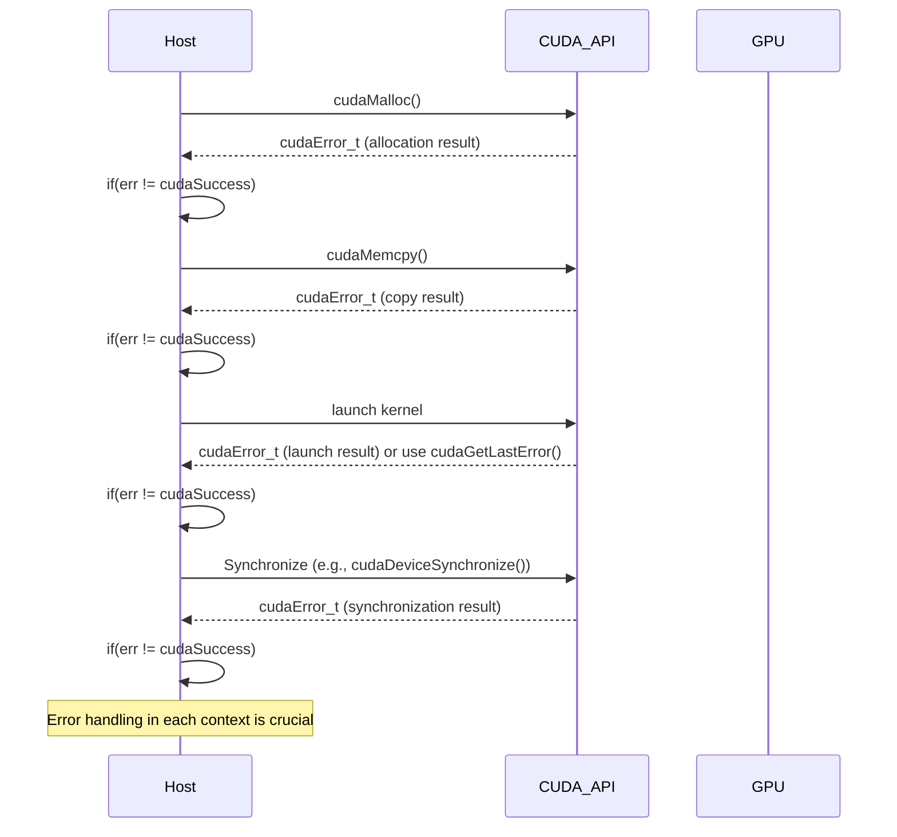

Okay, I've analyzed the provided text and added Mermaid diagrams to enhance understanding of the concepts. Here's the enhanced text:

## CUDA Error Handling Mechanisms: Ensuring Robust and Reliable GPU Computing

```mermaid
  flowchart TD
      A["CUDA API Function (e.g., cudaMalloc)"] -->|Returns cudaError_t| B{Error Check (if/switch)};
      B -- cudaSuccess --> C[Operation Successful];
      B -- Other Error --> D[Error Handling];
      D --> E{Log/Report Error};
       E --> F[Terminate or Recover];
      C --> F
```

### Introdução

Em CUDA, como em qualquer ambiente de programação, o tratamento de erros é uma prática essencial para garantir que as aplicações sejam robustas, confiáveis e que possam lidar com situações inesperadas. A API CUDA oferece um mecanismo de tratamento de erros baseado em códigos de erro que são retornados pelas funções da API, e a verificação e tratamento adequados desses erros é fundamental para o desenvolvimento de aplicações CUDA que funcionem corretamente. Este capítulo explora os mecanismos de tratamento de erros em CUDA, detalhando como os códigos de erro são retornados, como eles podem ser verificados, como os erros podem ser tratados de forma adequada, e como o tratamento de erros contribui para a robustez das aplicações, sempre com base nas informações do contexto fornecido.

### Códigos de Erro `cudaError_t`

A API CUDA utiliza o tipo de dados `cudaError_t` para indicar o resultado da execução das funções. As funções da API CUDA, como `cudaMalloc()`, `cudaMemcpy()` e outras, retornam um código do tipo `cudaError_t` que indica se a operação foi bem-sucedida ou se ocorreu algum erro durante a execução. O valor `cudaSuccess` indica que a operação foi bem-sucedida, e outros valores indicam a ocorrência de um erro, como a falta de memória, ou um problema durante a transferência de dados.

**Conceito 1: `cudaError_t` como Tipo de Retorno**

*   **`cudaError_t`:** O tipo `cudaError_t` é um tipo enumerado que define uma série de códigos de erro que podem ocorrer durante a execução de funções da API CUDA.
*   **`cudaSuccess`:** O valor `cudaSuccess` indica que a operação foi bem-sucedida, e que não ocorreu nenhum erro.
*   **Códigos de Erro:** Outros valores de `cudaError_t` indicam que ocorreu algum erro durante a execução, como `cudaErrorMemoryAllocation` (erro na alocação de memória), `cudaErrorInvalidValue` (valor inválido em um parâmetro), `cudaErrorLaunchFailure` (erro no lançamento do *kernel*) e outros.
*   **Verificação de Erros:** É fundamental verificar o valor de retorno das funções da API CUDA e tratar os erros de forma adequada, para que a aplicação funcione corretamente e seja robusta.

**Lemma 1:** O tipo `cudaError_t` e os seus valores, incluindo o valor `cudaSuccess` e outros códigos de erro, são o principal mecanismo para o tratamento de erros na API CUDA, e a verificação e o tratamento desses códigos são essenciais para a criação de aplicações robustas.

**Prova:** O tipo `cudaError_t` e seus valores são definidos para indicar se uma operação da API CUDA foi bem-sucedida ou não, e para identificar as possíveis causas de um erro. $\blacksquare$

O exemplo abaixo ilustra como verificar o código de erro retornado pela função `cudaMalloc()`:

```c++
cudaError_t err;
int n = 1024;
int size = n * sizeof(float);
float *d_A;

err = cudaMalloc((void**)&d_A, size);
if (err != cudaSuccess) {
  // Error handling code
}
```
Nesse exemplo, a variável `err` armazena o código de erro retornado pela função `cudaMalloc()`, e uma verificação é feita para garantir que a alocação foi bem-sucedida.

**Prova do Lemma 1:** O tipo `cudaError_t` e seus valores definidos pela API CUDA são o principal mecanismo para que as aplicações possam verificar e tratar os erros. $\blacksquare$

**Corolário 1:** O uso correto do tipo `cudaError_t` e a verificação dos códigos de erro retornados pelas funções da API CUDA são passos essenciais para o desenvolvimento de aplicações robustas e que funcionem de forma correta.

### Verificação de Erros com `if` e `switch`

Os códigos de erro retornados pelas funções da API CUDA podem ser verificados utilizando estruturas de controle de fluxo, como os comandos `if` e `switch`. A verificação do código de erro é um passo fundamental para garantir que a aplicação esteja funcionando corretamente e para identificar e tratar problemas que ocorram durante a sua execução.

**Conceito 2: Tratamento de Erros com Estruturas de Controle**

*   **`if`:** O comando `if` é utilizado para verificar se o código de erro é diferente de `cudaSuccess`, e para executar um bloco de código específico caso tenha ocorrido um erro. O comando `if` é utilizado quando o tratamento de erros é simples ou quando um tipo específico de erro deve ser tratado de forma especial.
*   **`switch`:** O comando `switch` é utilizado para verificar diferentes códigos de erro e para executar blocos de código específicos para cada tipo de erro. O comando `switch` é utilizado quando diferentes tipos de erros precisam ser tratados de forma diferente, e o uso do `switch` garante que todos os tipos de erro sejam tratados de forma adequada.

```mermaid
  flowchart TD
      A[cudaError_t] --> B{if err != cudaSuccess?};
      B -- Yes --> C[Error Handling (simple)];
      B -- No --> D[Continue];
      A --> E{switch(err)};
      E -->|case cudaErrorMemoryAllocation| F[Handle Memory Error];
      E -->|case cudaErrorInvalidValue| G[Handle Invalid Value Error];
      E -->|default| H[Handle Other Error];
      F --> D;
      G --> D;
      H --> D;
```

**Lemma 2:** As estruturas de controle `if` e `switch` permitem que o código verifique o código de erro retornado pelas funções da API CUDA e execute o tratamento apropriado, o que é fundamental para o desenvolvimento de aplicações robustas.

**Prova:** O uso de estruturas de controle permite o tratamento de erros e garante que a aplicação não quebre, se erros ocorrerem. $\blacksquare$

O exemplo a seguir demonstra a utilização do comando `if` para verificar um código de erro e imprimir uma mensagem de erro na tela:

```c++
cudaError_t err;
int n = 1024;
int size = n * sizeof(float);
float *d_A;

err = cudaMalloc((void**)&d_A, size);
if (err != cudaSuccess) {
    printf("Error: %s\n", cudaGetErrorString(err));
    exit(EXIT_FAILURE);
}
```

Nesse exemplo, o código verifica o valor de `err`, e se ele for diferente de `cudaSuccess`, o código imprime uma mensagem de erro na tela e finaliza a execução do programa utilizando a função `exit()`.

O exemplo a seguir demonstra a utilização do comando `switch` para verificar diferentes códigos de erro e executar ações específicas para cada tipo de erro:

```c++
cudaError_t err;
int n = 1024;
int size = n * sizeof(float);
float *d_A;

err = cudaMalloc((void**)&d_A, size);

switch (err) {
  case cudaSuccess:
    // All is ok
    break;
  case cudaErrorMemoryAllocation:
    printf("Error: Memory Allocation Failed\n");
    exit(EXIT_FAILURE);
    break;
  case cudaErrorInvalidValue:
    printf("Error: Invalid argument value\n");
    exit(EXIT_FAILURE);
    break;
  default:
    printf("Error: Unknown error %s\n", cudaGetErrorString(err));
    exit(EXIT_FAILURE);
}
```
Nesse exemplo, o comando `switch` verifica o valor de `err`, e executa uma ação diferente para cada código de erro diferente que pode ter ocorrido durante a alocação.

**Prova do Lemma 2:** A utilização dos comandos `if` e `switch` é essencial para a verificação e tratamento dos erros em aplicações CUDA e garante a robustez e a estabilidade da aplicação.  $\blacksquare$

**Corolário 2:** A utilização das estruturas de controle de fluxo para a verificação de códigos de erro é uma prática fundamental para o desenvolvimento de aplicações CUDA robustas e que funcionem de forma correta.

### A Função `cudaGetErrorString`

A API CUDA também oferece a função `cudaGetErrorString()`, que recebe como argumento um código de erro do tipo `cudaError_t`, e retorna uma *string* que contém a descrição do erro. Essa função é utilizada para fornecer informações mais detalhadas sobre os erros que ocorreram, e auxiliar na depuração e na correção dos problemas.

**Conceito 3: Descrição de Erros com `cudaGetErrorString()`**

*   **`cudaGetErrorString()`:** A função `cudaGetErrorString()` recebe como argumento um valor do tipo `cudaError_t`, e retorna um ponteiro para uma *string* que contém a descrição textual correspondente ao código de erro passado como parâmetro.
*   **Descrições Detalhadas:** A utilização da função `cudaGetErrorString()` permite que o desenvolvedor obtenha informações detalhadas sobre os erros que ocorreram, e que o usuário possa obter uma mensagem clara sobre o erro e a sua possível causa.
*   **Depuração:** A função `cudaGetErrorString()` é utilizada para facilitar a depuração e a correção de erros nas aplicações CUDA, e auxilia no desenvolvimento de código mais robusto.

**Lemma 3:** A função `cudaGetErrorString()` permite que o código forneça uma descrição textual dos códigos de erro da API CUDA, o que auxilia o programador a entender o que ocorreu, depurar e corrigir o código.

**Prova:** A função `cudaGetErrorString()` fornece uma descrição detalhada dos erros que podem ocorrer durante a execução de funções CUDA e facilita a depuração da aplicação. $\blacksquare$

O exemplo a seguir demonstra a utilização da função `cudaGetErrorString()` para imprimir uma mensagem de erro na tela quando a alocação de memória falha:

```c++
cudaError_t err;
int n = 1024;
int size = n * sizeof(float);
float *d_A;

err = cudaMalloc((void**)&d_A, size);
if (err != cudaSuccess) {
    printf("Error: %s\n", cudaGetErrorString(err));
    exit(EXIT_FAILURE);
}
```
Nesse exemplo, a função `cudaGetErrorString()` é utilizada para obter a descrição textual do erro retornado pela função `cudaMalloc()`, e essa descrição é impressa na tela.

**Prova do Lemma 3:** A função `cudaGetErrorString()` é utilizada para obter informações sobre o erro, e a descrição textual do erro auxilia na depuração do código e na correção de problemas. $\blacksquare$

**Corolário 3:** A utilização da função `cudaGetErrorString()` é uma boa prática de programação, e é fundamental para o desenvolvimento de aplicações CUDA robustas e de fácil depuração.

### Tratamento de Erros em Diferentes Contextos

**Pergunta Teórica Avançada:** Como o tratamento de erros deve ser implementado em diferentes contextos de aplicações CUDA, incluindo a alocação de memória, a transferência de dados e o lançamento de *kernels*, e como o tratamento de erros afeta a escalabilidade e a robustez das aplicações?

**Resposta:** O tratamento de erros em CUDA deve ser implementado em todos os contextos da aplicação, incluindo:

1.  **Alocação de Memória:** Verificar o código de erro retornado por `cudaMalloc()` e utilizar `cudaFree()` para liberar a memória alocada, mesmo em caso de erros, o que garante que os recursos do sistema sejam liberados e que o código funcione corretamente.

2.  **Transferência de Dados:** Verificar o código de erro retornado por `cudaMemcpy()`, e implementar o tratamento de erros para que o código consiga lidar com problemas na transferência de dados, como a falta de memória ou a corrupção de dados.

3.  **Lançamento de Kernels:** Verificar o código de erro retornado pelo lançamento dos *kernels* (que é obtido utilizando funções como `cudaGetLastError()` ou através da verificação do valor de retorno de algumas funções da API que realizam o lançamento de *kernels*), e tratar os erros para que a aplicação possa se recuperar de falhas na execução da GPU, e possa reportar a informação do erro.

4.  **Sincronização:** A sincronização entre *threads* e entre o *host* e o *device* é também uma fonte de erros e também deve ser verificada. As funções da API CUDA relacionadas à sincronização também retornam um código de erro que deve ser verificado.


**Lemma 4:** O tratamento de erros em todos os contextos da aplicação é essencial para garantir a robustez e a estabilidade das aplicações CUDA e o tratamento adequado de erros também é fundamental para a escalabilidade, pois permite que o sistema trate erros e se recupere, em vez de simplesmente parar a execução.

**Prova:** O tratamento de erros garante que a aplicação seja capaz de lidar com problemas que possam ocorrer durante a sua execução, e que a aplicação não termine de forma inesperada por conta de um erro.  $\blacksquare$

Um tratamento de erros adequado é essencial para a criação de aplicações que funcionem de forma correta, mesmo em situações inesperadas.

**Prova do Lemma 4:** A verificação de erros e o tratamento adequado, em todas as etapas do código, desde a alocação até o término, permitem que as aplicações CUDA funcionem de forma robusta e eficiente. $\blacksquare$

**Corolário 4:** A implementação de mecanismos de tratamento de erros é uma boa prática de programação e é fundamental para a criação de aplicações CUDA robustas, escaláveis e confiáveis.

### Desafios e Limitações do Tratamento de Erros

**Pergunta Teórica Avançada:** Quais são os principais desafios e limitações no tratamento de erros em CUDA, e como esses desafios podem ser abordados para melhorar a robustez e a portabilidade das aplicações?

**Resposta:** O tratamento de erros em CUDA apresenta alguns desafios e limitações:

1.  **Complexidade do Código:** O tratamento adequado de todos os possíveis erros que podem ocorrer em uma aplicação CUDA pode aumentar a complexidade do código, e pode dificultar o entendimento e a manutenção do mesmo.
2.  ***Overhead* do Tratamento de Erros:** A verificação dos códigos de erro e a execução de código de tratamento de erros podem adicionar um *overhead* significativo ao tempo de execução da aplicação. A análise do perfil da aplicação pode ajudar a determinar onde o *overhead* é maior para que a sua utilização seja feita de forma eficiente.
3.  **Portabilidade:** Os códigos de erro podem variar entre diferentes versões do *toolkit* CUDA, o que exige atenção por parte dos desenvolvedores para que a portabilidade da aplicação seja mantida. O uso correto das funções de tratamento de erros e da API CUDA, evita problemas de portabilidade.
4.  **Granularidade dos Erros:** Algumas funções da API CUDA retornam códigos de erro genéricos, o que dificulta a identificação precisa do problema, e exige que o programador utilize outras ferramentas para determinar a causa do erro.

**Lemma 5:** A complexidade do código, o *overhead* do tratamento de erros, a falta de padronização entre as diferentes versões do *toolkit* e a granularidade dos erros são os principais desafios no tratamento de erros em CUDA, e que precisam ser considerados para o desenvolvimento de aplicações robustas e portáveis.

**Prova:** Os problemas apresentados são inerentes à complexidade do sistema, e para garantir a robustez e a portabilidade, um planejamento cuidadoso da aplicação é necessário. $\blacksquare$

Para superar esses desafios, é importante utilizar técnicas de programação defensiva, como a utilização de *assertions*, a documentação do código, a utilização de *macros* para o tratamento de erros, e o planejamento da forma como os erros serão tratados, além de garantir a compatibilidade entre diferentes versões da API CUDA e dos *drivers*.

**Prova do Lemma 5:** A utilização de técnicas de programação defensiva, e o planejamento cuidadoso da aplicação são os meios para garantir que o código seja robusto, independente da arquitetura utilizada. $\blacksquare$

**Corolário 5:** A superação dos desafios e das limitações no tratamento de erros é fundamental para o desenvolvimento de aplicações CUDA robustas, escaláveis, portáveis e de alto desempenho.

### Conclusão

O tratamento de erros é um aspecto fundamental na programação CUDA, e é essencial para garantir que as aplicações sejam robustas e confiáveis. A API CUDA utiliza o tipo `cudaError_t` para retornar códigos de erro, e funções como `cudaGetErrorString()` para obter informações adicionais sobre os erros. O uso correto de estruturas de controle, como `if` e `switch`, juntamente com a verificação dos códigos de erro e a utilização de técnicas de programação defensiva, são essenciais para o desenvolvimento de aplicações CUDA eficientes e de alta qualidade. O planejamento adequado e o uso correto das ferramentas disponíveis são essenciais para o desenvolvimento de aplicações que utilizem todo o potencial da arquitetura CUDA.

### Referências

[^7]:  "At the beginning of the file, we need to add a C preprocessor directive to include the CUDA.h header file." *(Trecho de <página 47>)*

Deseja que eu continue com as próximas seções?
