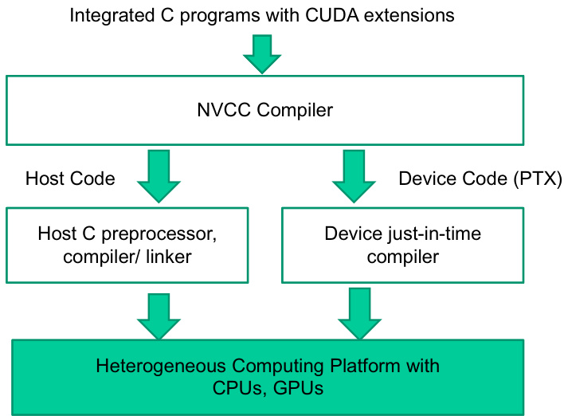

## CUDA Kernels: O Qualificador `__global__`

### Introdução

O desenvolvimento de aplicações paralelas utilizando CUDA (Compute Unified Device Architecture) requer a compreensão de qualificação de funções para execução em GPUs (Graphics Processing Units). Um dos qualificadores mais importantes é `__global__`, que define as **kernels CUDA**, funções especiais executadas no dispositivo (GPU) e invocadas a partir do host (CPU) [^2]. Este capítulo explorará em detalhes o qualificador `__global__`, seu papel na execução de kernels, e as implicações para a programação CUDA.

### Conceitos Fundamentais

O qualificador `__global__` é essencial para a programação CUDA, pois ele identifica as funções que serão executadas em paralelo em múltiplos threads no dispositivo. Abaixo estão os pontos-chave relacionados a este qualificador:

1.  **Execução no Dispositivo:** Funções declaradas com `__global__` são executadas no dispositivo (GPU) [^2]. Isso significa que o código da função é compilado para a arquitetura da GPU e seus threads são executados nos núcleos de processamento da GPU.
2.  **Invocação a Partir do Host:** Kernels CUDA, marcadas com `__global__`, só podem ser chamadas a partir do código do host (CPU) [^2]. A chamada de uma kernel CUDA configura e inicia a execução paralela na GPU.
3.  **Geração de Grid de Threads:** Quando uma kernel CUDA é chamada, ela gera uma *grid de threads* no dispositivo [^2]. Essa grid é uma estrutura hierárquica organizada em blocos, e cada bloco contém um conjunto de threads. O número de blocos e threads por bloco é especificado na chamada da kernel.
4.  **Sintaxe:** A declaração de uma função kernel CUDA segue a seguinte sintaxe:

    ```c++
    __global__ void kernel_name(argumentos);
    ```

    onde `kernel_name` é o nome da função kernel, e `argumentos` são os argumentos passados para a função. O tipo de retorno deve ser sempre `void`.


**Exemplo:**

```c++
__global__ void addVectors(float *a, float *b, float *c, int n) {
    int i = blockIdx.x * blockDim.x + threadIdx.x;
    if (i < n) {
        c[i] = a[i] + b[i];
    }
}
```

Neste exemplo, `addVectors` é uma kernel CUDA que adiciona dois vetores, `a` e `b`, e armazena o resultado em `c`.  O índice `i` é calculado com base no índice do bloco (`blockIdx.x`), dimensão do bloco (`blockDim.x`) e índice do thread dentro do bloco (`threadIdx.x`). Essa kernel é executada em paralelo por múltiplos threads, cada um somando um elemento dos vetores.


**Chamada da Kernel:**

Para chamar a kernel `addVectors` a partir do host, usamos a seguinte sintaxe:

```c++
int blockSize = 256;
int numBlocks = (n + blockSize - 1) / blockSize;
addVectors<<<numBlocks, blockSize>>>(a_d, b_d, c_d, n);
```

Onde:

*   `numBlocks` é o número de blocos na grid.
*   `blockSize` é o número de threads por bloco.
*   `a_d`, `b_d`, e `c_d` são ponteiros para os vetores na memória do dispositivo.
*   A sintaxe `<<<numBlocks, blockSize>>>` especifica a configuração da grid e dos blocos para a execução da kernel.





**Restrições:**

*   Kernels CUDA sempre devem ter um tipo de retorno `void`.
*   Kernels CUDA só podem ser chamadas a partir do código do host (CPU).
*   Variadic functions não são permitidas como kernels CUDA.

### Conclusão

O qualificador `__global__` é um componente fundamental na programação CUDA, habilitando a execução de funções paralelas no dispositivo (GPU). Compreender o papel e a sintaxe deste qualificador é essencial para desenvolver aplicações CUDA eficientes. Ao utilizar kernels CUDA marcadas com `__global__`, os desenvolvedores podem aproveitar o poder de processamento paralelo das GPUs para resolver problemas complexos em uma variedade de domínios, como computação científica, processamento de imagem e aprendizado de máquina.

### Referências
[^2]: The `__global__` keyword indicates that the function is a CUDA kernel, executed on the device and called only from the host code, generating a grid of threads on the device.

<!-- END -->