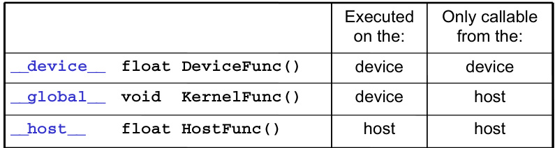

## A Dupla Face da Execução: __host__ e __device__ em Funções CUDA C

### Introdução

No universo da programação CUDA C, a flexibilidade é chave para otimizar a execução do código em diferentes partes do sistema: a CPU (host) e a GPU (device). Um dos mecanismos que oferece essa flexibilidade é a combinação dos especificadores `__host__` e `__device__` na declaração de funções. Este capítulo explorará em detalhes como essa combinação instrui o compilador CUDA a gerar versões distintas de uma mesma função, permitindo a execução tanto no host quanto no device.

### Conceitos Fundamentais

A combinação dos especificadores `__host__` e `__device__` em uma declaração de função instrui o sistema de compilação a gerar duas versões de object files para a mesma função, uma executada no host e uma no device [^1]. Esta capacidade é fundamental para o desenvolvimento de aplicações CUDA eficientes, pois permite que certas partes do código sejam executadas na CPU, enquanto outras, mais adequadas para processamento paralelo, sejam executadas na GPU.

Para ilustrar, considere a seguinte declaração de função:

```c++
__host__ __device__ int minhaFuncao(int a, int b);
```

Neste caso, o compilador CUDA criará duas versões de `minhaFuncao`: uma versão para a CPU e outra para a GPU. A versão para a CPU será compilada usando o compilador host (normalmente `gcc` ou `nvcc`), enquanto a versão para a GPU será compilada usando o compilador device (parte do `nvcc`).

A decisão de qual versão da função será chamada depende do contexto da chamada. Se a função for chamada a partir do código executado na CPU, a versão `__host__` será utilizada. Se a função for chamada a partir do código executado na GPU, a versão `__device__` será utilizada.



A imagem, referenciada na página 55 do documento, apresenta uma tabela que sumariza os qualificadores CUDA C para declaração de funções (_device_, _global_, _host_). A tabela detalha onde cada tipo de função é executado (device ou host) e de onde pode ser chamado, fornecendo um panorama das restrições e capacidades de cada qualificador. A função qualificada como `__global__` é um kernel, executado no dispositivo, mas chamado do host, enquanto `__device__` é executada e chamada no dispositivo, e `__host__` roda no host.

**Exemplo:**

```c++
#include <iostream>

__host__ __device__ int add(int x, int y) {
  return x + y;
}

__global__ void kernel(int *a, int *b, int *c) {
  int idx = threadIdx.x + blockIdx.x * blockDim.x;
  c[idx] = add(a[idx], b[idx]); // Chamada da versão __device__
}

int main() {
  int a[] = {1, 2, 3, 4, 5};
  int b[] = {6, 7, 8, 9, 10};
  int c[5];

  int *dev_a, *dev_b, *dev_c;

  cudaMalloc((void**)&dev_a, sizeof(int) * 5);
  cudaMalloc((void**)&dev_b, sizeof(int) * 5);
  cudaMalloc((void**)&dev_c, sizeof(int) * 5);

  cudaMemcpy(dev_a, a, sizeof(int) * 5, cudaMemcpyHostToDevice);
  cudaMemcpy(dev_b, b, sizeof(int) * 5, cudaMemcpyHostToDevice);

  dim3 dimBlock(5);
  dim3 dimGrid(1);

  kernel<<<dimGrid, dimBlock>>>(dev_a, dev_b, dev_c);

  cudaMemcpy(c, dev_c, sizeof(int) * 5, cudaMemcpyDeviceToHost);

  std::cout << "Result: ";
  for (int i = 0; i < 5; ++i) {
    std::cout << c[i] << " ";
  }
  std::cout << std::endl;

  std::cout << "Host result: " << add(10, 20) << std::endl; // Chamada da versão __host__

  cudaFree(dev_a);
  cudaFree(dev_b);
  cudaFree(dev_c);

  return 0;
}
```

Neste exemplo, a função `add` é definida com os especificadores `__host__` e `__device__`. Dentro do kernel CUDA, `kernel`, a função `add` é chamada. Neste contexto, a versão `__device__` de `add` será utilizada. Já dentro da função `main`, a função `add` também é chamada. Neste contexto, a versão `__host__` de `add` será utilizada.


A imagem ilustra o fluxo de execução de um programa CUDA, alternando entre código serial executado na CPU e kernels paralelos executados na GPU, conforme descrito na seção 3.3 do documento. O kernel GPU 'KernelA<<<nBIK, nTid>>>(args)' é lançado repetidamente a partir do código CPU, indicando a natureza híbrida da computação CUDA, onde tarefas sequenciais e paralelas se alternam para otimizar o desempenho.


This image, Figure 3.5 from page 47, illustrates the outline of a revised `vecAdd()` function in CUDA that offloads computation to a device, specifically a GPU. It shows the three essential steps: Part 1 allocates device memory and copies input vectors A and B from host to device memory, Part 2 launches the kernel for parallel vector addition on the GPU, and Part 3 copies the result vector C from device memory back to host memory and frees device vectors. This highlights the data transfer and kernel execution flow within the CUDA programming model.


A imagem, referenciada como Figura 3.1 na página 43, ilustra o conceito de paralelismo de dados na adição de vetores, um tema central discutido no Capítulo 3 do documento. Ela demonstra como elementos correspondentes de dois vetores de entrada, A e B, são somados em paralelo para gerar um vetor de saída C. Cada operação de adição, representada por um círculo com um sinal de '+', é independente, permitindo a execução simultânea em arquiteturas paralelas como as GPUs da CUDA, um tópico central do capítulo.


This figure, referenced as Figure 3.2 on page 43 of the provided document, provides an overview of the CUDA program compilation process. It illustrates how integrated C programs with CUDA extensions are processed by the NVCC compiler, which separates the code into Host Code and Device Code (PTX). The Host Code is processed by a Host C preprocessor, compiler, and linker, while the Device Code is handled by a Device just-in-time compiler, eventually leading to a heterogeneous computing platform with CPUs and GPUs.


A imagem, encontrada na página 48 do documento, ilustra a arquitetura de memória do CUDA, demonstrando a separação entre a memória do host (CPU) e a memória global do dispositivo (GPU). A imagem destaca a necessidade de transferência explícita de dados entre essas memórias, mostrando setas bidirecionais entre os blocos de memória do host e do dispositivo para representar a cópia de dados. Essa cópia é gerenciada pela API CUDA e é essencial para a execução de kernels em dispositivos CUDA.


The image, found on page 54 and labeled as Figure 3.10, illustrates how threads in a CUDA grid are organized into thread blocks and how each thread combines threadIdx and blockIdx to create a unique global index. It shows blocks 0, 1 and N-1, each with 256 threads indexed from 0 to 255, and provides the formula to calculate the global data index 'i' for accessing elements in device memory.

**Implicações e Considerações:**

1.  **Overhead de Compilação:** A geração de duas versões da mesma função pode aumentar o tempo de compilação.

2.  **Complexidade do Código:** É crucial garantir que ambas as versões da função (`__host__` e `__device__`) se comportem de maneira consistente e correta, considerando as diferentes arquiteturas e restrições de memória.

3.  **Utilização de Recursos:** Funções marcadas com `__host__` e `__device__` podem acessar recursos diferentes, dependendo do contexto de execução. A versão `__host__` pode acessar a memória da CPU e outras bibliotecas do sistema, enquanto a versão `__device__` tem acesso à memória global da GPU e outras funções CUDA.

4.  **Debugging:** Depurar funções que são executadas tanto no host quanto no device pode ser mais complexo, exigindo ferramentas e técnicas específicas.

### Conclusão

A combinação dos especificadores `__host__` e `__device__` em declarações de funções CUDA C oferece uma poderosa ferramenta para otimizar a execução de aplicações, permitindo que o código seja executado tanto na CPU quanto na GPU. Compreender as implicações e considerações associadas a essa combinação é fundamental para o desenvolvimento de aplicações CUDA eficientes e robustas. Esta flexibilidade permite aos desenvolvedores escolher o local de execução mais adequado para cada parte do código, aproveitando ao máximo os recursos do sistema.

### Referências

[^1]: The combination of __host__ and __device__ in a function declaration instructs the compilation system to generate two versions of object files for the same function, one executed on the host and one on the device.
<!-- END -->